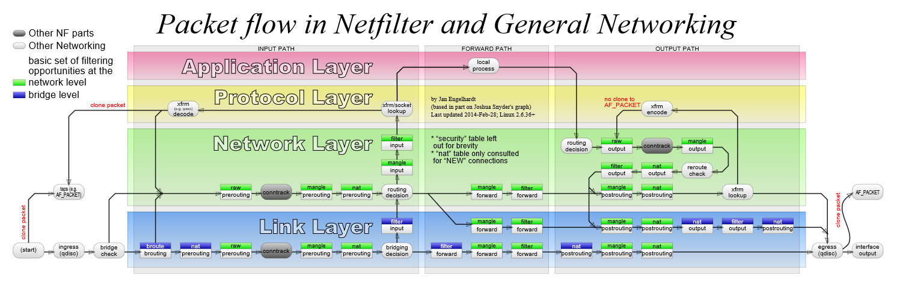

---
aliases:
- /archives/101
categories:
- 网络基础
date: 2019-01-23 10:42:05+00:00
draft: false
title: iptables详解
---

iptables是Linux用户态中的一个软件，用于管理内核中的netfilter。通常iptables运行需要依赖内核模块xtables等，并且需要root。iptables实在是太强大了，iptables本身功能不算太多，但是其有很多的扩展可供使用，包括但不限于l7 filter、geoip、hashlimit、ipmark、iprange、ipset、tproxy、nat等，依靠这些扩展可以实现好多好多的功能，著名的MikroTik RouterOS的防火墙也是由iptables修改而来，使用过iptables和ros的人都知道，两者防火墙的规则和参数，基本上完全一样，可见iptables的灵活性确实强大

# 流量顺序

此处，我引用了Wikipedia中的一幅图来阐述内核态中netfilter的数据流的走向：  



引用页面： [netfilter](https://en.wikipedia.org/wiki/Netfilter)

## 表、链

表即为iptables中的四张表，分为Raw、Mangle、NAT、Filter，流量的经过顺序是Raw->Mangle->NAT->Filter。在RouterBoard中，如果想在L3转发中取得较高的吞吐量，请保证这四张表中没有任何规则，无任何规则时包直接进行Fast Path使用硬件转发，只要规则存在，所有的流量就要进该表中匹配，吞吐量会大幅下降。

按照上面的流量的经过顺序，我们可知如果使用策略路由，流量会最先经过Raw表，一般Raw表为空，其次就走到了Mangle表，然后对相应的包打上路由标记，分流成功。至于有些朋友问我为什么他们使用CentOS做策略路由会失败，我可以很清楚地讲（因为我也被坑过）CentOS7多了一个firewalld，讲真这东西我觉得并不算太好用，firewalld的实现原理也是套着iptables加预先配置好的规则模板，firewalld会默认给iptables加上相应的区域规则，以至于FORWARD进来的数据会全部被DROP!!!所以想用iptables做点好玩的，请务必卸载firewalld

卸载方法如下：


```bash
yum remove firewalld*
```


结合netfilter的图，我们一起来看一下链：我们可以看到，从INPUT PATH到FORWARD PATH再到OUTPUT PATH，对应的表的大致顺序差不多是这样的： PREROUTING->INPUT->FORWARD->OUTPUT->POSTROUTING，特别需要注意的是，目的IP为本机内任何一个接口IP的话，该包会进入INPUT链，否则直接进FORWARD链。在本地进程处理后，源IP为本地某接口IP的数据包会从OUTPUT链中出来，进而才会走到POSTROUTING链中。

之所以会引入Chain（链）这个概念，我们可以看到一条又一条的规则串起来，就形成了一条规则链，一个又一个的链构成了一个表。

那个顺序一定要牢记，不然写规则可能因为位置放错了导致规则失效或者误操作。以及，一定要特别注意规则的顺序！同一个链中的规则会按照顺序依次执行

## 通过命令看思想

此处，引用下我之前写的一个规则：


```bash
#!/bin/bash

ip route add local default dev lo table 100 (1)
ip rule add fwmark 1 lookup 100 (2)

iptables -t mangle -N VTFRE_M_GE_GATE (3)
iptables -t mangle -N VTFRE_M_GE_TCP (4)
iptables -t mangle -N VTFRE_M_GE_UDP (5)

iptables -t mangle -A PREROUTING -m set --match-set ge_userlist src -i br-lan -j VTFRE_M_GE_GATE (6)
iptables -t mangle -A VTFRE_M_GE_GATE -p tcp -g VTFRE_M_GE_TCP (7)
iptables -t mangle -A VTFRE_M_GE_GATE -p udp -g VTFRE_M_GE_UDP (8)

iptables -t mangle -A VTFRE_M_GE_TCP -m set --match-set ge_chnroute dst -j RETURN (9)
iptables -t mangle -A VTFRE_M_GE_TCP -m set --match-set ge_exdclist dst -j RETURN (10)
iptables -t mangle -A VTFRE_M_GE_TCP -m set --match-set ge_locallist dst -j RETURN (11)
iptables -t mangle -A VTFRE_M_GE_TCP -j MARK --set-mark 11 (12)

iptables -t mangle -A VTFRE_M_GE_UDP -m set --match-set ge_chnroute dst -j RETURN (13)
iptables -t mangle -A VTFRE_M_GE_UDP -m set --match-set ge_exdclist dst -j RETURN (14)
iptables -t mangle -A VTFRE_M_GE_UDP -m set --match-set ge_locallist dst -j RETURN (15)
iptables -t mangle -A VTFRE_M_GE_UDP -p udp -j TPROXY --on-port 10888 --tproxy-mark 0x01/0x01 (16)

iptables -t nat -A PREROUTING -p tcp -m mark --mark 11 -j REDIRECT --to-ports 10888 (18)

```


上边的命令不要直接复制进bash，至少把后边括号去掉吧。

  1. 上面1-2规则，我设置了路由标记为0x1的的走table 100 的路由；
  2. 3-5中分别新建了三个新的链；
  3. 6中设定了来自br-lan接口的并且源地址为ge_userlist的包jump到VTFRE_M_GE_GATE链中；
  4. 7-8分别对tcp和udp进行了goto操作，TCP goto到了VTFRE_M_GE_TCP，此处之所以不适用-j(jump)而使用-g(goto)是因为考虑到所有的流量都能把PREROUTING走完，避免RETURN直接跳到下一个表去了，因此在 -j VTFRE_M_GE_GATE后，后续的规则使用-g，在这些链中执行RETURN相当于回到了VTFRE_M_GE_GATE的上一级，即回到了PREROUTING中，确保后续的规则还会继续执行完；
  5. 9-11和13-15分别对目的IP为特定列表中的包进行了RETURN，确保这些流量不会进入后续操作，即实现了策略路由
  6. 12中对这剩下的TCP流量进行标记，标记号为11，用于后续在其它链中操作，此处不太建议修改TTL，我们知道，L3的头部信息修改时，要重新计算检验和，修改TTL会导致重校验，造成资源浪费，明明打个标记就行了（不对头部本身进行操作）。我并没有看底层的代码，如果修改TTL都是在最后POSTROUTING时才生效的话就当我没说好了，如果每次操作都会进行修改和重校验的话，还是建议不要使用TTL做标记了，能节省一点资源就节省一点吧
  7. 16中使用了iptables 的扩展TPROXY，使用这个对UDP进行策略路由，众所周知，由于UDP时无状态的，对UDP的连接跟踪存在问题所以不建议REDIRECT
  8. 18中，重点来了，我看大多数网上的别人写的规则都把REDIRECT规则写进了OUTPUT中，而此处我写到了PREROUTING中，为什么呢？因为我没有开MASQUERADE&DNAT，因此我的流量只是单纯通过了路由决策后就直接进了FORWARD链中，而别人的设备进行了NAT，在转换地址后源地址为本地接口的IP，所以数据会从OUTPUT链中出来！因此我这个情况下，如果我把规则加到OUTPUT，是匹配不到任何流量的！之所以把REDIRECT加到PREROUTING中也是因为我主要是对下游客户端进行分流，是为了避免把本机的发出流量也给混淆进去导致环路（我知道VXRXX的outbound中可以指定出口数据包的标记，但是此处没有什么必要）。以及，此处建议使用REDIRECT而不要用DNAT以提升性能，笔者我并没有试过如果再把这部分流量DNAT到另外一个设备的TPROXY端口能不能生效，理论上来讲，V2XXX针对重定向后的TCP流量会去查连接跟踪表，用来重写目的IP和端口，REDIRECT这个过程实际上是把目标IP地址指向了本机同时目标端口指向了重定向的端口，如果需要实现透明操作的话，转发处理的过程一定需要对目的IP的端口进行重写，就回头去查连接跟踪表来查找真正的目的IP和端口，因此理论上来讲再DNAT后是无效的。

需要额外注意的是，

  1. TCP的拥塞控制是相对于客户端和服务端的，因此FORWARD的TCP流量（即源地址不是本机网卡接口IP，目的地址也不是本机网卡接口IP）不受拥塞控制，所以不要费力去给纯路由节点安装BBR了。当然此处我这里还是需要的
  2. 为什么我使用REDIRECT去重定向UDP却无效？上文讲到，不使用REDIRECT UDP是因为UDP没有状态，连接跟踪没有办法完美跟踪UDP的状态，TCP可以根据连接getsockopt快速查找五元组信息，UDP的话就要每个包都去查，开销之大，并且UDP太容易丢连接，所以使用TPROXY居多

# iptables扩展

  * L7-Filter 用于在L7进行过滤，可以针对应用进行控制，但是要截取协议进行统计和分析。L7会造成不小的开销
  * hashlimit 基于令牌桶的匹配模块，可以搭配其他模块实现限速。该模块可以对包速率等进行控制
  * ipmark 对包进行标记，或者对流中特定标记进行匹配
  * ipopt 匹配或者修改IP的可选部分
  * iprange 可以不用CIDR表示法表示，iprange使得匹配支持192.168.2.2-192.168.2.10 这样的匹配
  * ipset 使得iptables支持地址列表匹配，ipset列表可以由ipset进行创建和管理，进而实现了把时间复杂度从O(n)转变成O(1)
  * nat-extra NAT扩展使得iptables支持镜像和映射等功能，镜像(MIRROR)是对包的目的/源地址和端口信息进行对调，映射(NETMAP)可以将网络静态映射到另外一个网络上
  * tproxy 其将数据包重定向到本地Socket，其不对包产生任何修改，因此需要配合路由标记使用来决策路由
  * ……
