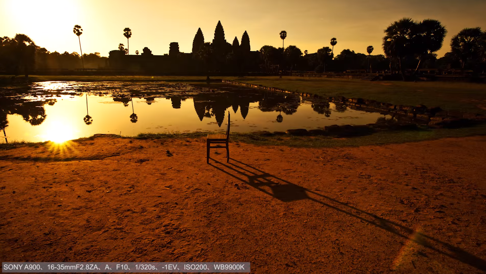
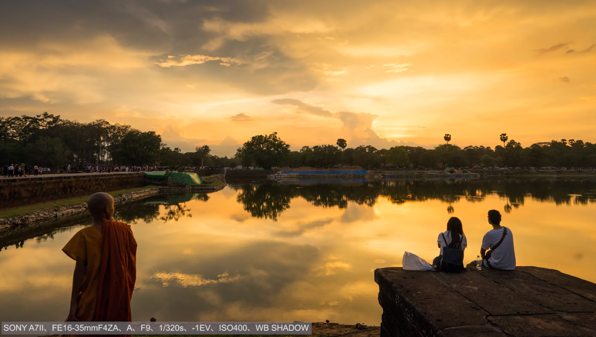
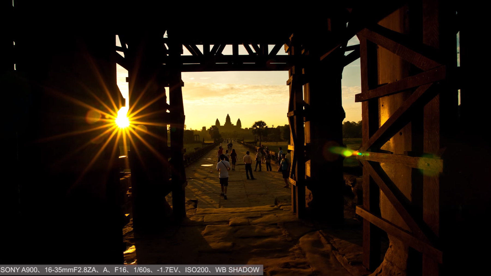
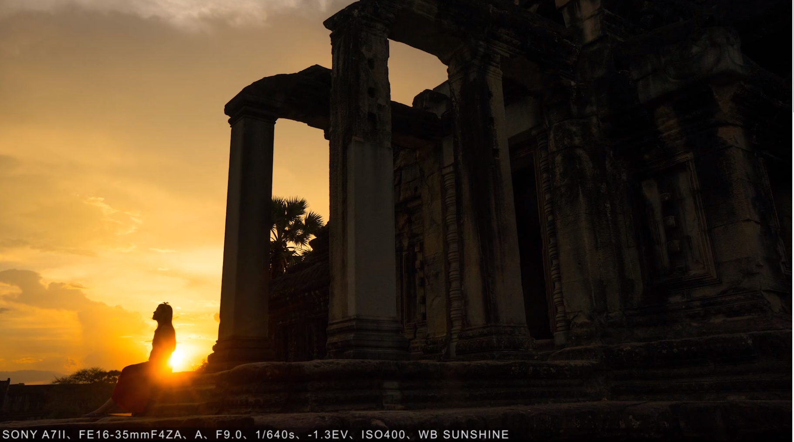
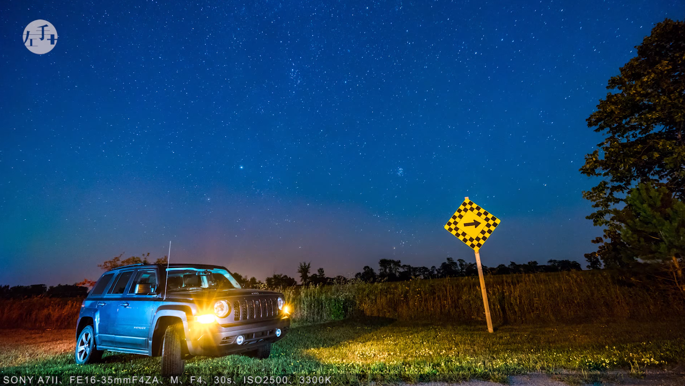
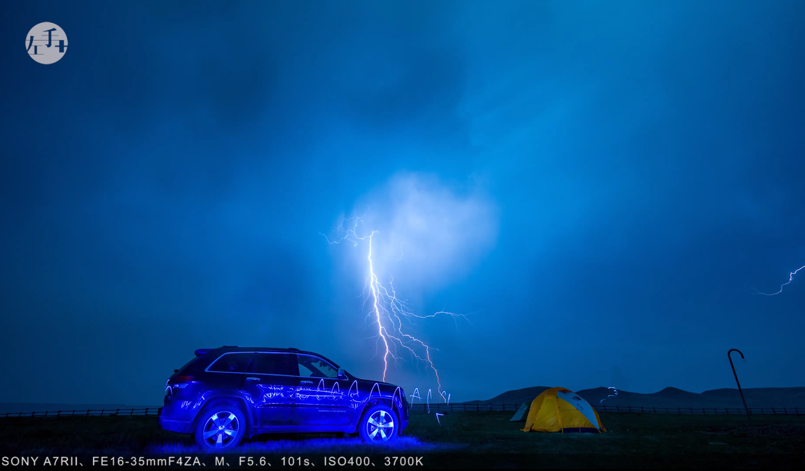

---
aliases:
- /archives/1030
categories:
- 摄影
date: 2020-02-22 10:00:28+00:00
draft: false
title: 摄影参考笔记
---

从今天起打算开始多看一些真正摄影师摄影的视频，同时思考总结一下他们摄影的理念看看能不能学到点东西。文章不断更新

## 前言

作为一个初级入门的摄影爱好者，学了一段时间的后期和摄影基础，对比看了一些大师级摄影发现还是不够，拍出来的照片还是看不下去，决定再总结和抄袭点经验

## 工具安利

### 景深计算器

链接： <http: camera="" depth.htm="" filitov.twcat.org=""> 

## 总结

### 2020年2月22日

视频链接： <https: channel="" ucvqg0fyr1ce_psufegkjpgg="" videos="" www.youtube.com=""> 

视频链接： <https: watch?v="kWBzQEe17Os" www.youtube.com=""> 

画面光比太大时需要分开对天空和地面进行测光，有条件最好加渐变灰滤镜平衡光比。

【对应下图】黄昏时如果能拍到太阳在水中的倒影，看起来挺漂亮（要留意好太阳下山时间）。这样构图个人觉得挺漂亮。光圈F10不大，景深范围较大，色温非常暖，快门速度也非常快<figure class="wp-block-image size-large">

 </figure> 

【对应下图】个人觉得如果拍情侣照的话这个构图（中间对称）还不错（不知道没GND玩不玩得起），又暖又有意境，等我有女朋友了我也要去这样试试拍 ∠( ᐛ 」∠)_ 不过个人也觉得如果左侧画面能再安静一些（没有那些人和那个人）或许会更好一些。从主体出发的话个人觉得画面主体应该在风景上，人物只是配角，对焦时应该保障人物在前景就行了<figure class="wp-block-image size-large">

 </figure> 

【对应下图】这倒是让我学会了一种摄影方法，从窄缝里拍日落或者日出，产生星芒效果。刚看了看我的镜头28-70mm焦段光圈也满足，还没有试过拍太阳的光芒晚点试试 ∠( ᐛ 」∠)_ 画面延伸感给我带来了这个画面的主体时尽头的那座山的感觉，我有点迷感觉主体不是很突出<figure class="wp-block-image size-large">

 </figure> 

有水的元素存在时加长曝光可以实现水面雾化效果

【对应下图】画面中有人群可以用中灰镜+长曝光（可先测光然后用APP算一下曝光时间多少合适）去除人影，对于可能出现的鬼影客人觉得可以后期补一下？（蒙版擦一下）要烧快门线，这个光圈收到了F22<figure class="wp-block-image size-large">

 </figure> 

【对应下图】这个光圈已经缩到9了，画面也是暖色为主，人物遮挡住太阳的方法或许不错可以试一试<figure class="wp-block-image size-large">

 </figure> 

拍摄食物，鉴于没有大光圈的镜头没办法虚化，可能要靠后期来补虚化效果。食物如果偏黑局部光线不足可以用手机闪光灯从正上方向下打

没有广角可以尝试用25-30mm左右焦距（太小会畸变给合成带来影响），纵向拍摄，最好15°一张，这就要烧脚架了，后期用LR/PS合成全景图。拍摄时要保证地平线一致，使用M档为佳，对焦的话没说，晚点尝试一下，每张照片至少要有三分之一与上一张重叠，否则合成就会gg

前景可以放点东西映衬一下不会太空

拍摄人像时可以从低角度拍摄，想要去除画面中其他人物时使用慢门即可（参考0.1秒），要确保有防抖

机内降噪只对jpeg起作用，要后期或者单出raw的可以关机内降噪（我早都想关了）

拍摄银河的基准曝光参数：F2.8，曝光30秒以内，ISO开到1600-3200左右，根据实际情况再微调

【对应下图】天空是如何拍的这么清澈的….留意了下参数，光圈开到了F4，曝光30秒ISO2500，晚点我也去试试<figure class="wp-block-image size-large">

 </figure> 

【对应下图】可以用光绘手法对前景物体进行额外补光，让前景看起来不是很单调。随便用一些其他颜色的LED灯即可，此时需要非常长时间的曝光，人最好穿着黑色衣服以减少光的反射。可以看到图中有一个蓝色的波纹，看起来应该就是LED的轨迹了<figure class="wp-block-image size-large">

 </figure> 

上下对称构图，前景可以用海，后景找暖色的（补色）会好看一些

用黑色东西摇黑卡遮挡反光物体避免光比过大和过度反光

如果想看清对焦区域可以使用峰值对焦方法（需要提前关闭自动放大）

### 人像

人像用光分类

#### 水平光

##### 正面光

  * 光线均匀，面部没什么阴影，适用于正式场合用
  * 整体效果缺乏立体感

##### 45度侧光

  * 面部立体感增强，面部一侧阴影让脸更显瘦，也会让服饰显得更加有质感
  * 是人像中的常用光位

##### 90度侧光

  * 带有强烈的阴影和立体感，让皮肤纹理非常明显
  * 一般用在男性拍摄，用于塑造硬朗的风格

##### 后45度侧光

  * 一侧身体带有轮廓光，头发细节更加突出
  * 常用于多灯拍摄的辅助灯

##### 完全逆光

  * 人物周围形成完整的轮廓光
  * 常用在多灯拍摄的辅助灯
  * 自然逆光时也比较常用，用于剪影拍摄

#### 高位光

##### 正面光

  * 即蝴蝶光，会在鼻子下方形成蝴蝶形阴影（我还真没看出来差别）
  * 常用在女性人像，复古风

室内摄影通常使用的点光源，很容易在人像局部（鼻子和脸等）引起高光，阴影会非常强烈，此时一般要使用柔光。

柔光：

  * 光线柔和，阴影少，非常适合人像拍摄
  * 日常中的柔光：广告灯箱、阴天天空、拉上窗帘后的落地玻璃窗等</https:></https:></http:>