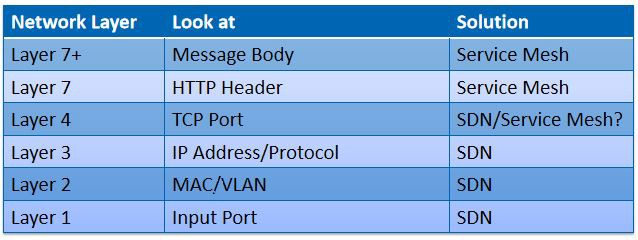

---
aliases:
- /archives/1176
categories:
- 云计算
date: 2020-03-14 08:07:52+00:00
draft: false
title: 什么是云原生？
---

CNCF废话了一大堆，看的迷迷糊糊。本文结合实际应用场景和我对云原生的理解，解释了云原生所包含的技术要点，如容器、服务网格、微服务等，对云原生的整体进行了一定的阐述。

<!--more 阅读更多-->

## 感谢

我之前对云原生并不是非常了解，偶然和付师兄聊起来，由于他本人正是学习云原生最佳实践的，和我讲了很多相关的内容。本文是在付师兄的总结的基础之上，查找了一定的资料，重新进行的进一步的研究和总结。

非常感谢师兄的指导，没有他的一番言论可能不会有本篇文章的诞生。如有需要这位大佬的联系方式，欢迎联系我拿名片。（博客关于里有我的联系方式）

## 前言

CNCF对于云原生v1.0的定义是：

  * 云原生技术有利于各组织在公有云、私有云和混合云等新型动态环境中，构建和运行可弹性扩展的应用。云原生的代表技术包括容器、服务网格、微服务、不可变基础设施和声明式API。
  * 这些技术能够构建容错性好、易于管理和便于观察的松耦合系统。结合可靠的自动化手段，云原生技术使工程师能够轻松地对系统作出频繁和可预测的重大变更。
  * 云原生计算基金会（CNCF）致力于培育和维护一个厂商中立的开源生态系统，来推广云原生技术。我们通过将最前沿的模式民主化，让这些创新为大众所用。

那么我们对上边这三大段切分一下，挖出它的技术要点和要解决的问题

### 技术要点

  * 容器
  * 服务网格
  * 微服务
  * 不可变基础设施
  * 声明式API
  * 自动化手段

### 要解决的问题

  * 在新型动态环境中构建和运行可弹性扩展的应用
  * 构建容错性好、易于管理和便于观察的松耦合系统
  * 使工程师能对系统做出频繁和可预测的重大变更

### 其他解释

在nirmata的官网上，我看到了其对于云原生应用更直接的解释：

<blockquote class="wp-block-quote">

<strong><em>The Application is composed of multiple services</em></strong>: what looks like a single application to the end user, for example a Software-as-a-Service (SaaS) human resources application, or a streaming music service, is actually delivered by a set of co-operating services. Clients interact with the application as a whole; typically via a single API. However, internally the application is made up of multiple cooperating services, much like an object-oriented application is made up of multiple cooperating objects.
  

<strong><em>Each service is elastic</em></strong>: this means that each service can scale-up or scale-down independently of other services. Ideally the scaling is automatic, based on load or other defined triggers. Cloud computing costs are typically based on usage, and being able to dynamically manage scalability in a granular manner enables efficient use of the underlying resources.
  

<strong><em>Each service is resilient</em></strong>: this means that each service is highly-available and can survive infrastructure failures. This characteristic limits the failure domain, due to software bugs or hardware issues.
  

<strong><em>Each service is composable</em></strong>: this implies that the service is designed to allow it to be part of other applications. At the minimum, each Service has an Application Programming Interface (API) that is uniform and discoverable, and in addition can have well defined behaviors for registration, discovery, and request management.
  

<cite>Cloud native software: key characteristics – nirmata</cite>
</blockquote>

让我们一起来解读一下这四个定义：

  * **应用由众多的服务组成：**说白了就是通过微服务实现，各个服务之间通过API协同完成工作
  * **每个服务都是有弹性的：**每个服务都可以随意独立扩容或者剪裁，并且这个过程是自动的、基于负载或者定义的触发器。那么总结来说这个特性就比较吸引人了，这意味着，你的服务在请求不大的情况下，可以对系统进行裁剪，减少成本，在请求逐渐增大的情况下，对系统进行动态扩容（说白了就是加独立的服务来平衡负载），来缓解压力。更何况这个过程还是自动的，那么说如果你的服务是在云上部署的情况下，这整个变化都是动态的，能省下来不少成本
  * **每个服务都具有容错能力：**众所周知，系统由原本的整体拆分成微服务后，通过服务发现和服务注册、服务网格等后，具备了一定的健康检查能力（其实也就是一个TTL，当你心跳没了超过TTL后你这个节点就被剔除了，暂且先理解到服务注册和服务发现，对于服务网格的原理我还没了解到），那么任何一个服务挂了的情况下，服务网格拥有在其他节点继续尝试的能力，因此说单个服务gg后不影响整体运作，每个服务都因此具有一定的容错能力
  * **每个服务都是可以互相构成的：**我觉得这个标题我翻译的不是太好，原意是说这个独立的服务，可以被挪去构成其他的应用，就相当于很多的系统可以相符复用这些小的组件，前提是它们能够兼容

## 服务网格

我觉得，在正式开始讲述云原生之前，需要着重了解一下服务网格，比较有代表性的是Istio，该软件当前已经在Kubernetes中集成。

从官方的介绍来看，Istio主要是为了解决众多微服务在部署和管理中的问题：连接、安全、控制和观察。其内置了日志、遥测和策略系统，用于运行分布式的微服务系统。

<blockquote class="wp-block-quote">

    Istio makes it easy to create a network of deployed services with load balancing, service-to-service authentication, monitoring, and more, with <a href="https://istio.io/docs/tasks/observability/distributed-tracing/overview/#trace-context-propagation">few</a> or no code changes in service code. You add Istio support to services by deploying a special sidecar proxy throughout your environment that intercepts all network communication between microservices, then configure and manage Istio using its control plane functionality, which includes:
  

    * Automatic load balancing for HTTP, gRPC, WebSocket, and TCP traffic.
  

    * Fine-grained control of traffic behavior with rich routing rules, retries, failovers, and fault injection.
  

    * A pluggable policy layer and configuration API supporting access controls, rate limits and quotas.
  

    * Automatic metrics, logs, and traces for all traffic within a cluster, including cluster ingress and egress.
  

    * Secure service-to-service communication in a cluster with strong identity-based authentication and authorization.
  

<cite>Why use Istio? – Istio 1.5</cite>
</blockquote>

从上边官方的解释中，可以看到，其拥有这些功能：

  * 自动负载平衡，支持HTTP、gRPC、WebSocket和TCP
  * 细粒度的流量控制，可以支持丰富的路由规则，支持重试、故障转移（其实就上边我所提到的容错中的一个实现）、故障注入
  * 可插拔的策略层（我还没感受到哪里可插拔）和配置API，其支持权限控制、限流和配额（最开始翻译错了，后边发现这是个从句……）
  * 自动跃点（因该是可以自动根据负载程度选择处理节点吧）、日志和跟踪。支持集群中的所有流量，包含进出集群的流量
  * 强大的安全性

关于更详细的内容，去查阅官方文档吧

## 微服务和容器

这两个概念相对来说简单很多，应该很多人都知道，在此就不解释了。

## 结构对比

我个人接触比较多的，就是nginx，nginx作为网关，进行URL路由和负载平衡，代理众多的API应用。

传统架构存在的一个比较大的问题是，在微服务中，众多的应用都配备了服务发现和服务注册，尤其是在弹性伸缩阶段，很多的服务都是变动的，包括IP地址也是，然而开源的nginx似乎并不能很好得支持这一特性，反观Nginx Plus倒是支持服务注册和服务发现，但是你要掏钱了。

那么当服务在扩容或者裁剪阶段，如果网关是nginx，那么nginx得配置如何跟随更新？即便是有办法使ningx配置跟随更新，那么似乎也不能像Istio那样实现非常细粒度得路由和权限控制。人家Istio可是能支持生产、测试环境同时上线的，通过更细粒度的规则来实现请求的路由，判断这一请求该到生产环境还是该到测试环境，所谓的DevOps个人觉得也是由此而来，觉得CI/CD也是借助这一特性进而更好的实现了（因为你的生产和测试环境完全可以放在一个平台上了，具体是否要有请求进来，由你的规则决定）。按比例截获部分流量到测试环境去，这也就形成了“灰度测试”，然而在nginx上，你怎么整？

那么当众多的请求进入网关后，网关根据请求的参数决定路由到何处，并选择出合适的节点，通过Sidecar将请求转发到相应的服务，每个请求（含内部）都存在于一个池中，当请求处理成功，从池中移除，否则进行故障转移等操作，所以我们说这东西具有一定的容错能力。

那么再回归到最开始地方——用户的请求如何进入，这个问题。当用户在客户端准备发出一个请求时，会先通过DNS解析其域名。这个域名的解析可以使用自主的DNS服务器，那么这样就实现了在DNS上实现的负载均衡——可以跟随网关压力自动解析到不同的网关去。

咋一听，觉得服务网格所实现的，和软件定义网络颇为相似，对此我专程去查了查，有张图觉得很不错，贴上来大家看看<figure class="wp-block-image size-large">

 <figcaption>Comparison between SDN and Service Mesh – Medium</figcaption></figure> 

我个人觉得这张图非常好，众所周知，网络按照OSI标准分为7层，分别简写为L1-L7。在SDN中，以标准OpenFlow协议为准，其覆盖的参数也是L1-L4，对于再高层的协议，即不再支持（暂且先不考虑ARP和DHCP应答等）。那么服务网格就恰到好处得实现了这么个鬼东西，L4的服务网格，个人理解起来应该算是网关了，L7和L7+（这个时服务网格中的定义，OSI中没有L7+的不要想太多）分别对应了头和消息体，通过软件定义的方法，实现更为细粒度的行动控制（好比路由、访问控制等），和SDN简直是系出同门。

## 推荐阅读

过多详细的东西就懒得写了，多看文章吧。在总结了云原生后，笔者我突然眼前一亮，感觉好像打开了新世界的大门——又有好玩的东西了。

剩下的自己看吧，强烈推荐这些内容：

### 服务网格和SDN

文章来源于Medium，标题是服务网格可以从SDN中学到什么，从中可以比较细致得看出其差别，非常推荐

<https: @zhaohuabing="" medium.com="" what-can-service-mesh-learn-from-sdn-1a4874edca03="">

### 宋净超的网站

宋净超（ Jimmy Song ），蚂蚁金服云原生布道师，CNCF Ambassador，ServiceMesher 社区联合创始人，讲师，作者，摄影师。好牛逼的感觉

推荐他的两本书，一本是Go语言实现大规模云原生应用的方式，一本是Istio服务网格的实践进阶：

  * <https: book="" cloud-native-go="" jimmysong.io=""></https:> 
  * <https: book="" istio-handbook="" jimmysong.io=""></https:> 

关于其的文章也非常推荐阅读：

  * <https: cloud-native="" from-kubernetes-to-cloud-native.html="" jimmysong.io="" kubernetes-handbook=""> 
  * <https: concepts="" jimmysong.io="" kubernetes-handbook="" open-interfaces.html=""> 

建议有空有心情最好把整个GitBook都看一遍。

最后，再推荐一下ServiceMesher社区的GitBook，其实也有Jimmy Song的产出：

<https: concepts-and-principle="" istio-handbook="" service-mesh-patterns.html="" www.servicemesher.com="">

## 最后推荐：云原生的整体布局

建议使用电脑浏览，内容非常庞大

<https: landscape.cncf.io=""></https:>

## 参考资料

  * <https: blob="" cncf="" definition.md="" github.com="" master="" toc=""> 
  * <https: 05="" 20="" 2014="" cloud-native-software-key-characteristics="" www.nirmata.com=""></https:></https:></https:></https:></https:></https:>