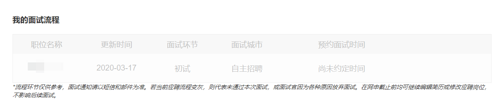

---
aliases:
- /archives/1272
categories:
- 面试
date: 2020-03-17 13:57:50+00:00
draft: true
title: 记第一次面试GG过程
---

大学以来的第一次面试，也是第一次实习，投了腾讯。本文记述并总结了这第一次面试翻车经历

## 关于更新

一时脑子不知道怎么回事忘了开录音，现在回想起来只记得这几个问题了，如果有新回想起来的东西，本文会继续更新补充

## 故事开始于…

晚饭后依旧像往常一样出去散步，走了一半路程突然一个深圳的电话打进来，顿时感觉不对劲，因为我还真没有收到过深圳并且是座机的号码打来的电话，接通之后果然没有猜错是腾讯的面试电话。

面试官说是腾讯云的

## 一点点特别提醒

在腾讯的校招网站上有这么个东西，投入的简历会经过海选（好像是机器学习推荐的）然后投到主管那边去，当**我的面试流程**中出内容时——这时候就要注意了，说明简历被捞中了，接下来可能随时会收到面试通知。如果你的这个记录成灰色了，起初我以为是面试被取消了，但实际上还是收到了面试电话，这个我也不知道这个流程是怎么走的，总之建议在没有收到面试电话前最好就不要放松，时时刻刻要清醒，如果不清醒就要约好清醒时间面试

<figure class="aligncenter size-large">

</figure>

## 总结

### 自我介绍

我觉得面试官应该是有看过简历的，但实际上面试开始时面试官首先让我做自我介绍。我第一想法：咦应该看过我简历了啊为什么还要让我自我介绍，然后我还傻乎乎得让对面直接问说我并不太知道怎么表达哈哈哈。其实想一想，这是个引领话题的好机会，可惜这个点我事后才悟出来。不得不说，有时候多去看看网上的面试经验和技巧，还是非常有帮助的。面试官把开场机会给了我，其实真正正确的做法，是简单自我介绍，重点应该是直接领起话题——把话题领到你擅长的Topic上，**因为面试官会就你所讲的深入去问你**，这样一来两边都轻松，而不至于把面试搞得很尴尬。

所以这个自我介绍非常重要，领好话题并让面试官以你为中心进行提问，这样一来比较容易把握住回答的方向，不容易跑偏，也不容易被问到其他不相关的东西上。

### 技术上

由于我投的是研发相关，所以基础还是那几样：数据结构（算法）、操作系统、计算机网络

可能面试官看我基础也是比较差就特意给了点面子吧，问了如下的问题：

  * Golang的channel怎么实现的，应用场景有哪些
  * Golang的Map实现原理
  * TCP的三次握手如果改成两次会怎样
  * 容器和虚拟机的区别

其实说真的都是很基础的问题，可惜觉得自己回答的都不是非常好或者说就是瞎答。所以基础还是很重要的，要重新开始好好巩固一下基础，没留意到的细节要再去琢磨

### 简历上

写技术点即可，不要写太多（1-2页最好），避免太长劝退面试官。

总结下自己的简历，最大的问题就是把想说的全部写到简历里去了，结果面试时就没东西说了，细节要留着在面试时说；其次，简历上写出来的，只能看上去做了很多，但是没有突出结果或者在项目里起到的作用；简历中要突出重点，其中出现的技术名字就是给自己挖好的坑，面试将会围绕这些技术点展开，要把自己挖好的坑准备好，确保能填上（多谢@奥雷哈刚的秘密 的指点）

面试回答时要有重点，把某个自己简历上所突出的重点的技术细节讲透了，那么就会给人留下印象了，而不至于树立下”哪里基础都不扎实“的印象。（多谢@奥雷哈刚的秘密 的指点）

## 最后一点想法

觉得吧，敢做这种精神还是要有的，试一试才知道差距还有多少，不敢试一试感受一下差距或许就一直成温水里的青蛙了。第一次大胆投腾讯的，以前还真的没有敢想过，希望通过后边越来越多的面试能慢慢感受差距和学习的方向吧

正是由于内卷化越来越严重，在就职上的表现也越来越明显，就职压力也逐步在增大，因此想要冲出舒适圈，还是要多点尝试多点努力的。

<blockquote class="wp-block-quote">

    内卷化（involution），又译为“过密化”，吉尔兹提出“农民在人口压力下不断增加水稻种植过程中的劳动投入，从而获得较高的产量。然而，劳动的超密集投入并未带来产出的成比例增长，出现了单位劳动边际报酬的递减，即过密化现象。”这种现象叫“内卷化”。
  

<cite>百度百科</cite>
</blockquote>
<blockquote class="wp-block-quote">

    现在提到内卷，多是由于本次科技革命的红利已经收割的差不多了，如果再没有下次科技革命的爆发，经济的发展只能走上上规模、铺摊子的老路，呈现边际效益递减。做个不恰当的比如，要想获得1元的产值，必须投入0.5元的成本；想获得100元的产值，就要投入60元的成本；随着产值增长，这个投入会越来越大，例如最后想要获得1000元的产值，必须投入950元的成本，投入收益递减，就称为内卷。假如发生了新的科技革命，投入0.2元就可以获得甚至2元的收入，经济就重新焕发了活力。
  

<cite>作者：Eric Yang 链接：https://www.zhihu.com/question/271037879/answer/1084544547 来源：知乎 著作权归作者所有。商业转载请联系作者获得授权，非商业转载请注明出处。</cite>
</blockquote>

不仅仅是高考、研究生考试内卷化越来越严重，就职也是如此。

最后，觉得，踏踏实实补基础，老老实实走网申，或许是最稳打稳算的做法。