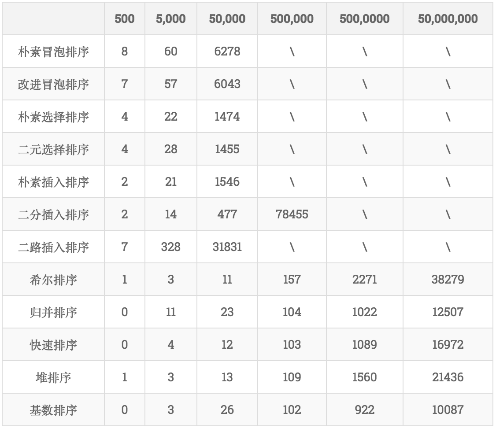

---
aliases:
- /archives/1299
categories:
- 语言
date: 2020-03-19 06:50:38+00:00
draft: false
title: Go维护大顶堆进行排序和实现并行排序的一点想法
---

## 前言

都说没有最优的算法，只有最合适的算法。然而我在leetcode上提交排序代码时9/10通过，只剩最后一个一大串的排序（估摸着大概4万多个数吧），因为超出时间迟迟无法通过。


写到这里，感谢一下陈老哥，不仅在实习上帮助了很多，还解答了好多问题（不愧腾讯大佬）。本文在最开始时拿堆排去排n个数（说白了就是排了全部），而堆排其实并不适合这个场景，下边的表格也很明确得说明了这个问题，所以就慢的一批，感谢陈老哥的提醒。如果图整体排序速度不如快排来的实在（实质是平衡二叉树）

**具体原因：**堆排比较适合的场景是，维护一个堆，通过不断增加元素来排出来特定的数量的最大值或者特定数量的最小值。这也是为什么腾讯音乐那个面试题，让排8G文件里的积分选择使用堆排而不是快排，因为只需要前100个用户的………在堆排排特定数量的情况下，假定只需要知道前K大个数字，那么只需要维护一个K大小的堆，然后一个个向里边添加元素去排，此时维护每个元素的时间复杂度为logK，当元素共n个时，整体的时间复杂度就是nlogK，成为了最小的


图片来源：https://www.jianshu.com/p/97459c2ca2a5

~~上边这个图是各个排序算法在排不同数据量时的消耗的时间（ms）。可以看到在5W数据量时，堆排序基本算是有优势的，在5000W时，排序才用了21s？？？？？Excuse me？？？为啥我写的排50万用了几分钟？？？？暂且不清楚这个表格里的数据类型是什么样的，我排的是unt64，也不排除是因为数据类型导致的速度下降，晚点有空再测试一下吧。~~

## 性能分析

经过性能分析发现，跨函数时指针操作效能比传值高…….


```bash
$ go tool pprof main.exe profile
File: main.exe
Type: cpu
Time: Mar 19, 2020 at 1:52pm (CST)
Duration: 30.19s, Total samples = 30.09s (99.67%)
Entering interactive mode (type "help" for commands, "o" for options)
(pprof) top
Showing nodes accounting for 29.96s, 99.57% of 30.09s total
Dropped 26 nodes (cum <= 0.15s)
      flat  flat%   sum%        cum   cum%
    22.72s 75.51% 75.51%     22.73s 75.54%  main.sortTree
     7.24s 24.06% 99.57%     29.98s 99.63%  main.(*TopHeapSorting).rebuildTopHeap
         0     0% 99.57%     29.98s 99.63%  main.(*TopHeapSorting).Sorting
         0     0% 99.57%     29.98s 99.63%  main.main
         0     0% 99.57%     29.98s 99.63%  runtime.main
(pprof)
```


其中flat是函数本身的执行时间，cum表示函数本身加调用函数的执行时间。从pprof的统计来看，基本75%的时间用在了对比左右子树的排序上了，进行了4次优化，觉得提升不大，仍然达不到上边表格里50万109ms的速度。

那么这时候我就想打人了。

## 代码

这个代码目前是全排的，没有并不是实现部分排序的，不过稍加改动即可实现，就不再花时间去改了


```go
/*
维护大顶堆实现排序
 */
package main

import (
	"fmt"
	"math/rand"
	"net/http"
	_ "net/http/pprof"
)

type TopHeapSorting struct {
	topHeap []uint64
	heapLen uint64
}

/*
添加元素函数
接口收，可以容纳各种数据类型（整数的）
下边有做类型断言和转换
 */
func (t *TopHeapSorting) AddElements(elements ...interface{})  {
	for _, e := range elements {
		if u64Ele, ok := e.(uint64); ok {
			t.add(u64Ele)
		} else if iEle, ok := e.(int); ok {
			t.add(uint64(iEle))
		} else {
			panic("Type error")
		}
	}
}

/*
打散添加并统计
之所以逐个统计是考虑到数据量如果太大，len返回的int可能出现溢出，因此独立实现了长度统计
 */
func (t *TopHeapSorting) add(element uint64)  {
	t.topHeap = append(t.topHeap, element)
	t.heapLen++
}

/*
排序主函数
 */
func (t *TopHeapSorting) Sorting() {
	if t.heapLen <= 1 {
		return
	}
	for end := t.heapLen - 1; end > 1; end-- {
		t.rebuildTopHeap(end)
		t.topHeap[0], t.topHeap[end] = t.topHeap[end], t.topHeap[0]
	}
	if t.topHeap[0] > t.topHeap[1] {
		t.topHeap[0], t.topHeap[1] = t.topHeap[1], t.topHeap[0]
	}
}

/*
重建大顶堆
左子树为奇数索引，右子树为偶数索引
判断一下是不是只有左子树，如果是就只排左子树
 */
func (t *TopHeapSorting) rebuildTopHeap(endIndex uint64)  {
	// 奇数 左子树
	if endIndex & 1 != 0 {
		sortTree(&t.topHeap[(endIndex - 2) / 2],
			&t.topHeap[endIndex],
			nil)
		endIndex--
	}
	for ; endIndex > 1; endIndex -= 2 {
		sortTree(&t.topHeap[(endIndex - 2) / 2],
			&t.topHeap[endIndex - 1],
			&t.topHeap[endIndex])
	}
}

/*
对当前树进行排序
 */
func sortTree(root *uint64, left *uint64, right *uint64) {
	if right == nil {
		if *root < *left {
			*root, *left = *left, *root
		}
	} else {
		if *left > *right {
			if *root < *left {
				*root, *left = *left, *root
			}
		} else {
			if *root < *right {
				*root, *right = *right, *root
			}
		}
	}
}

func main() {
	go func() {
		fmt.Println(http.ListenAndServe("localhost:7000", nil))
	}()
	var t TopHeapSorting
	for i := 0; i < 500000; i++ {
		r := rand.Uint64()
		t.AddElements(r)
	}
	t.AddElements(100, 450, 1, 1000)
	fmt.Println("添加完成")
	t.Sorting()
	fmt.Println(t.topHeap)
}
```


排序是从下向上的。大概讲一下排序思路（**注意这是全部排的**）：

  1. 先添加元素到topHeap，并得到这个topHeap的长度heapLen
  2. 判断是不是只有1个元素，如果是直接return
  3. 【重建大顶堆】对比左右子树和根，把最大值换到根上，后往前排，这样过一遍相当于把最大拍到堆的顶部去
  4. 把堆顶和堆尾交换，并把重建大顶堆的结尾向前移一个单位，重复进行步骤3中的重建
  5. 当剩随后两个元素时对比一下大小纠正堆的顶和紧挨着的元素的顺序，就排好了

**补充：后边突然想到，堆排用递归的方式或许逻辑会更简单一些。有空再用递归重写一个吧**

## 关于并行堆排的一点想法

**那么其实知道了堆排的适用场景后，也就知道了其并不适合大量的排序，所以下边的这个idea应该也没什么价值了，就当看个乐子好了~**

写代码时可以感受到，倒着从后往前排，那么可以把这个堆理解成一堆二叉树。从根向下逐层翻倍，那么对于并行堆排或许可以尝试一下——如果大多数层的结点已经足够大的时候，可以对该层的结点进行拆分，使用并行操作分别进行排序。

那么此处并行排序分为两种方式：

### CPU并行堆排

从上边的性能分析可以看到，压力主要集中在main.sortTree上，时间占比达到了75%，这意味着，sortTree的处理时间比rebuildTopHeap是还要长的，至于为什么sortTree就单纯排序竟然能拉到这么久的时钟消耗，这个原因我也不得而知，不知道是这种不稳定的数据取出和操作导致的还是由于条件判断导致的。

至少，从75%的比例上，可以得到并行排序或许能改善这样一个速度。不过理论上来说只有当某层的结点相当大时，才有切分和并行排序的必要，因为个人觉得，这个新起线程和任务分块去排序的时钟消耗得是划算的，否则就得不偿失了。

### GPU并行堆排

没有明确对比过CPU和GPU对于逻辑处理的效率能差多少，不过CPU擅长处理复杂指令，核心不多，而GPU擅长处理简单指令，核心居多。所以如果GPU的逻辑处理效率不构成损失的话，或许使用cuda去依靠GPU进行并行加速处理这些排序问题，一定程度上应该能够带来不错的性能提升。

晚点有空玩玩吧。