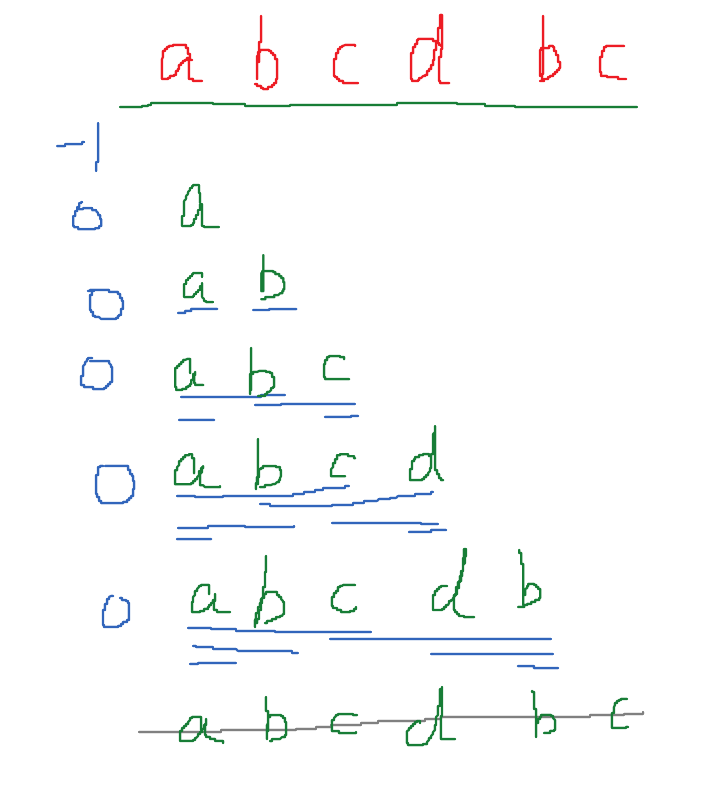
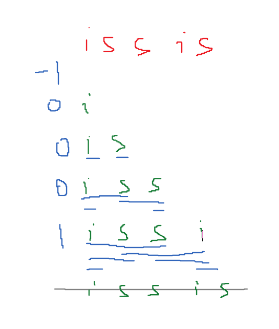

---
aliases:
- /archives/1315
categories:
- 语言
date: 2020-03-22 08:09:51+00:00
draft: false
title: Go KMP算法
---

足够熟悉KMP原理的就不用看了。本篇的代码比较渣

## 前言

KMP算法主要适用于在某个指定的文本串中寻找是否存在特定的模式串和其位置，相对暴力匹配效率高很多。

我们假定文本串长度为tL，模式串长度为pL，由于暴力匹配存在太多的重复工作，因此它的时间复杂度要大，平均时间复杂度为O(tL \* pL / 2)，最糟糕时的时间复杂度会达到O(tL \* pL)；相对而言，KMP的算法的时间复杂度就小很多，为O(tL + pL)。

与其说KMP是字符搜索算法，倒不如说是动态规划算法。似乎对所有的动态规划算法都不是那么感冒，参加过18年的全国大学生数学建模，现在都还记得那个RGV….当时不知道怎么想的选了动态规划的题，简直难于上青天….

## 推荐观看

我看了文字内容讲述KMP，始终看不懂。看了油管的一个视频终于明白了，对强迫症患者非常友好，推荐搞不明白的可以看看实现原理

https://youtu.be/dgPabAsTFa8

## 差别

个人觉得，和其他的一些匹配算法比起来KMP的一大特点是，其对准文本串的索引号只会线性增加，不存在减小，动的是模式串的索引号（在C里边可以说是指针，Go里边由于不允许指针运算因此就先说索引号了）。明白这个特点后，对我们的搬砖过程会有较大帮助

## 处理逻辑

当然，这个逻辑是我看这个视频，以及结合自己理解，整理出来的逻辑，应该是比较容易懂的，我也是按照这个逻辑写的，不过很可惜性能不是非常好，帮助理解的话还是挺有用的

整个过程分为两步，分别如下

### 计算前缀表

由于身边没有数位板用（疫情在家，没开学），17的iPad又不支持Apple Pencil，因此暂时没有比较好的作图工具了，我就直接鼠标低DPI画好了，将就看吧



所谓计算前缀表，就是找出这个模式串的所有从头开始不同长度的子串（不含本身）中的最长公共前后缀大小。如上图，当子串长为1时，这个前缀的数值肯定是0，随后计算剩余的字串的最大前后缀长度即可，由于不包含本身，因此最后要补齐，要在前边补个-1，后续在失配时，这个-1决定了文本串索引号向后移并且归位模式串索引号

我们再举个例子



其实所谓的计算最大前后缀长度，也解释了为什么KMP失配后可以继续移动模式串索引号进行前边位置（不一定是头）的匹配，其高效的来源就在这里。

### 进行匹配

我就只大概说一下匹配逻辑，就不再详细画图了，时间不允许

假设现在文本串进入到搜索函数，那么开始以下的操作：

  1. 判断如果长度是1的话直接暴力匹配就行了（不知道这样处理有没有毛病）
  2. 开始循环匹配，这个过程只会动模式串索引号，文本串索引号一定是顺序向后的
  3. 如果匹配，判断是否匹配的长度是否已经够了，如果够了就计算起始位置并返回，否则模式串和文本串索引号同时向后移动一位并回到2继续匹配
  4. 如果失配，移动模式串索引号，同时判断移动后的值是否为-1，是-1的话归位模式串索引号同时文本串索引号向后移一位；若不是-1则继续从2开始匹配
  5. 如果还没匹配到，就说明没有了，返回-1即可

这个逻辑可以看代码，有注释

## 代码

需要特别注意的是，这个代码的逻辑虽然清晰，但是并不是最优的，不论时间复杂度还是空间复杂度，在leetcode都是垫底的，理解一下就好


```go
package main

import "fmt"

func strStr(haystack string, needle string) int {
	if haystack == needle { return 0 }
	if haystack == "" { return -1 }
	if needle == "" { return 0 }
	kmp := New(needle)
	return kmp.Search(haystack)
}

type KMP struct {
	prefix []int
	pattern string
}

func New(p string) *KMP {
	kmp := KMP{
		prefix:  nil,
		pattern: p,
	}
	kmp.prefix = append(kmp.prefix, -1)
	Len := len(kmp.pattern)
	for i := 1; i < Len; i++ {
		kmp.prefix = append(kmp.prefix, getMaxRepeat(kmp.pattern[0:i], i))
	}
	return &kmp
}

func getMaxRepeat(text string, Len int) int {
	// 计算前缀表
	// 因为要算最小的，不用分奇偶
	for i := 1; i <= Len - 1; i++ {
		if text[0 : Len - i] == text[i : Len] {
			return Len - i
		}
	}
	// 未匹配到
	return 0
}

func (k *KMP) Search(text string) int {
	patLen := len(k.pattern)
	textLen := len(text)

	if patLen == 1 {
		for i := 0; i < textLen; i++ {
			if k.pattern[0] == text[i] {
				return i
			}
		}
		return -1
	}

	// 索引号
	j := 0
	for i := 0; i < textLen; {
		// 如果匹配则继续向下
		if text[i] == k.pattern[j] {
			// 判断一下已经匹配的模式串是不是够了
			if j == patLen - 1 {
				return i - j
			}
			//  长度不够继续向后匹配
			i++; j++
		} else
		// 不匹配的话尝试移动模式串
		{
			// 得到新的索引号
			j = k.prefix[j]
			// 如果j为-1-两数之和，说明要要向下一位文本串进行匹配了
			if j == -1 {
				// 先归位j
				j = 0
				// 对齐到文本串下一位
				i++
			}
		}
	}
	return -1
}

func main() {
	fmt.Println(strStr("mississippi", "issip"))
}
```


## 示例代码

leetcode给了个优秀例程，看了我惊了，怎么这么短


```go
func strStr(haystack string, needle string) int {
    if needle == "" {
        return 0
    }
    for i:=0; i<len(haystack); i++ {
        start := i
        if len(needle) > len(haystack) - i {
            return -1
        }
        for j:=0; j<len(needle); j++ {
            if needle[j] != haystack[start] {
                break
            }
            start += 1
        }
        if start - i == len(needle) {
            return i
        }
    }
    return -1
}
```


梳理一下这个逻辑，我们可以看到，也同样是做了判断，如果模式串为空，直接返回0。后续的，

  1. 初始一个i为0，当i小于文本串长度时，自加
  2. 初始一个start等于i
  3. 判断如果模式串长度大于文本串减去i，返回没找到。这里相当于判断模式串屁股是不是出文本串的边界了
  4. 初始一个j为0，当j小于模式串长度时，持续自加，同时内部判断一下模式串的这个位是否不等于文本串的start，如果不等就break，等的话就start+1，相当于文本串向后移动
  5. 如果匹配到的长度够了，就返回

我怎么估摸着这一点也不像KMP……..是不是我又把KMP的场景用错了，搞得还不如这种暴力匹配…..

## 场景比对
> KMP算法，在较少字符串的情况下进行匹配，相比朴素算法是毫无优势可言的，因为next数组推算，也是需要增加计算成本的。
> 
> 算法大法好之KMP – 掘金</cite>

> BF：简单场景，主串和模式串都不太长，O(m*n)
> 
> KP：字符集范围不要太大且模式串不要太长，否则hash值可能冲突，O(n)
> 
> naive-BM：模式串最好不要太长（因为预处理较重），比如IDE编辑器里的查找场景； 预处理O(m*m)， 匹配O(n)， 实现较复杂，需要较多额外空间
> 
> KMP：适合所有场景，整体实现起来也比BM简单，O(n+m)，仅需一个next数组的O(n)额外空间；但统计意义下似乎BM更快，原因不明
> 
> 另外查资料的时候还看到一种比BM/KMP更快，且实现+理解起来都更容易的的Sunday算法
> 
> 单模式串匹配 </strong>– 36讲AC自动机：如何用多模式串匹配实现敏感词过滤功能

> naive-Trie：适合多模式串公共前缀较多的匹配(O(n*k)) 或者 根据公共前缀进行查找(O(k))的场景，比如搜索框的自动补全提示.
> 
> AC自动机：适合大量文本中多模式串的精确匹配查找，可以到O(n)
> 
> <strong>多模式串匹配</strong> – 36讲AC自动机：如何用多模式串匹配实现敏感词过滤功能

