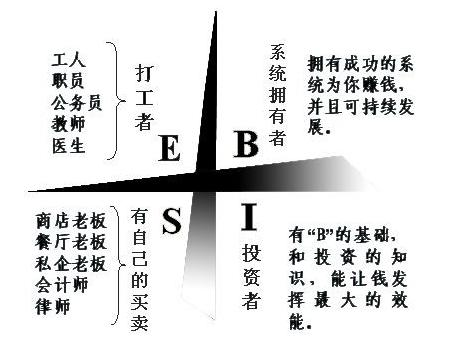

---
aliases:
- /archives/1343
categories:
- 阅读
date: 2020-04-09 14:50:00+00:00
draft: false
title: 为什么穷人和中产阶级很难摆脱财务泥潭？
---

近期阅读了富爸爸系列的书，也是接触的第一本理财相关的书籍，书中也包含了一些经济学原理的内容和马克思主义原理课上我们有学到的一些东西，不论是对个人学习理财来说还是入门了解经济体制和社会体制，都是非常棒的一本书。书中所描述的穷爸爸简直就是我日常的一个缩影，所反映出了自己太多在财商这块的欠缺。我们一直说的穷，其实由于我们本身的习惯问题，使得穷成了必然。

## 写在开始

作为意外看的经济相关的数目（我平日比较少会去看这方面的书），带来的收获非常多。我结合自身情况进行了反思和总结，对于不当行为进行了分析和整改。整个过程中发现理念上确实存在较多问题，多亏这本书给予的指导，起到了非常好的悬崖勒马的作用

阅读这本书之后，深爱上了罗伯特・清崎的书，也发现，人生在世，想更好得活下去，不仅仅需要一个看家本领，这些基础常识也是需要知道的，通过阅读和总结汲取这些知识不得不说是一个非常棒的操作。

我个人比较推荐去阅读富爸爸系列的书籍，从中能够收获到很多东西。本文只是对部分内容进行了归纳和总结，存在一些内容是只可意会不可言传的，还需要各位自行阅读和体会~

**书中的经济体系可能是以资本主义为基础写的，在社会主义的体制下，我暂时也不清楚这个滚雪球的效应会有什么差别，这部分的内容我还在通过询问请教和阅读等去进一步了解，希望阅读本篇文章的读者们结合实际情况理性判断，我的表达不一定是对的。** 谢谢谅解！

## 一点题外话

刚刚收到官方消息，广东终于要开学了。终于可以回学校了……..

## 背景

作者拥有两个爸爸——一个是亲生爸爸，拥有相当高的学历，并且任职夏威夷州教育厅，拥有相当可观的声望；一个是朋友的爸爸，和亲生爸爸完全相反。整本书中，作者通过两个爸爸的所作所为细致进行了对比和总结，给我们展开了很真实的一面——天天希望罗伯特好好读书、将来能够找到好工作的亲生爸爸（文中叫穷爸爸）由于不懂得金钱的智慧，终生被金钱压迫，为后代留下了账单；而让罗伯特打工缺不给工资并且平平的朋友的爸爸（文中叫富爸爸），教会了儿子金钱和投资的智慧，使得他的儿子早早接下了公司并且运营的比富爸爸还要好，早早实现了财务自由。作者由于受到富爸爸的影响，1989年也成为了百万富翁，1994年真正实现财务自由，那年他47岁，他的妻子37岁。

## 金钱的意义

在谈这个话题之前，我们先回顾一下我们曾经学过的东西。或许我们年轻的时候，学校和课本告诉我们，要树立正确的金钱观，金钱并不重要。但，实际上，所谓的这个观念，在欲望在不超出理智可控的情况下，我觉得不应该树立下这样的观念。想想很现实的一个问题，没有钱你能做什么？

金钱的意义是什么？

  1. 有时间教育孩子
  2. 有钱捐赠给所支持的慈善机构和慈善工程
  3. 为社区创造就业机会，维护经济稳定
  4. 有时间和金钱照顾自己的健康
  5. 能够与家人周游世界

上边这6条是《富爸爸财务自由之路》中富爸爸的观点，除去这些，我认为还有这几点：

  1. 为后代打下良好的教育基础。为什么这么说？原因有二，一是，你会相信一个自己问题还解决不好的人帮你解决相应的问题吗？就像《富爸爸穷爸爸》中的穷爸爸一样，他自己的财务问题都没能很好解决，能指望他给罗伯特正确的指导吗？二来是，我们都知道，试错需要成本，试过错才知道自己真正想要什么，试错的成本其实变相来说也是钱。
  2. 去进一步实现理想。人的消费欲望是跟随收入在成长的，所以很多情况下其实收入的增加并不能解决问题，相反可能还会加深问题。当欲望在成长时，消费观念也在逐级成长，这个理想需要足够的经济条件来支撑，否则理想或许就成了梦想

当然，**在强调金钱的重要性时，我们缺要竭力控制不被金钱所诱惑**——即金钱知识一个工具，它能为我们带来资产，善用其投资将会使得我们的生活更美好，而以金钱为目标则会让我们只看到金钱而错失很多机会。

## 为什么富人越来越富穷人越来越穷

我想很多人在逃避这个问题。

思维观念的继承就已经决定了很多。在广东，有一个常识，潮汕人很会做生意，甚至听朋友说，潮汕人每到一处地方，就会把当地的人“赶走”，其实这里的赶走就是把市场全部侵占了。我也有认识不少的潮汕人，在和他们的交流中，不仅感受到的是够意思，还感受到了这群人对于经商的独特的见解。从这些年的经历和交流来说，我不得不承认潮汕人从小接触到经商相关的内容确实比我家这边、非潮汕地区要丰厚很多。更有朋友告诉我，他很小的时候，就已经懂得资本家和劳动者的本质了——这也是在马克思主义原理的课上所讲到的，为什么一贯认为资本家是在剥削劳动者——因为看似劳动者在工作并得到了理应得到的报酬，但实际上他们还有一样东西没有得到并且也不可能得到——财富，是的没错，他们的劳动结果得到的报酬不是全部，他们的价值铸就了资本家的财富，所以认为劳动者是亏的。这个概念被称作资本家剥削，主要表现在劳动力产生的价值大于劳动力价值，那么这部分剩余价值就会为资本家带来滚雪球的效应。如果你还不相信，打开富途牛牛，查看一下各大上市公司的股权结构，你就明白了。然而这些东西，我大学才知道。

现金流象限

穷人和中产阶级为了谋生而工作，在现金流象限中，穷人就是E，他们工作来获得收入，并且当工作没有时，他们即失去了一切。中产阶级中，也包含一部分的E，也会有一部分的S，这部分做自己的老板，即便是没有工作这一收入来源，依靠其自身能力还能从其他渠道继续获得收入，但是S相对于E的区别是，当E失去工作时，即失去了所有的收入来源，当S失去工作时，他们还会有收入来源，即他们能够通过已有的买卖继续维持，但是S与B不同的是，S需要不停工作，一旦S倒下，那么也会失去所有的收入来源。而B，即建立一个别人为你工作的系统，对比S就是，不管你是否在工作，你的资产都在增加

## 当今时代需要什么样的人

借助信息化的发展，知识传递得更加快速，使得很多知识在萌芽阶段，借助互联网就已经传播开了，到了学校教育的阶段，这些知识或许已经不算前沿了。在这个时代，由于信息化发展，人们需要借助更多的力量来武装自己，在社会中获得更多的竞争力，**终身学习和快速学习，以及对于新思维的接纳程度，越来决定一个人的未来**。

清崎在书中说到，**在现实生活中人们往往是依靠勇气而不是智慧去取得领先地位的**。这个我是真的感同身受，从一个最开始的iceRTRS项目，从对需求不理解到理解，开始着重去考虑最适合的场景，考虑如何做到双方互利互惠，这一个从0到1的过程，确实艰难，但是当这个门打开了之后，我所收获到的东西却真的是远远超出了我的想象。

当今时代，很多东西是我们无法改变的，从自身能做到的改变做起，会有很多的机会从中诞生。当今时代下我最反感的人群——喜欢否定自己的人和喜欢抱怨的人，我非常不愿意和他们共事。喜欢否定自己的人，认为什么都做不好，从一开始就没有这个做好的勇气，也与机会失之交臂。其实很多时候，人是需要试错的，虽说试错需要成本，但是试错后才会明白自己真正想要什么想做什么，一开始就否定自己，借此来逃避现实，我觉得真的是非常不可取。喜欢抱怨的人，他们会潜移默化影响你，天天处在一个抱怨的环境中，就逐渐失去了慧眼，看到的不再是充满机会和挑战的世界

## 引用内容

富人之所以越来越富，穷人之所以越来越穷，中产阶级之所以总是在债务的泥潭中挣扎，其中一个主要原因就是，**他们对金钱的认识不是来自学校，而是来自家庭。**

大多数人都是从父母那里了解钱是怎么回事的。关于金钱，贫穷的父母又能够教给孩子们什么呢？他们只会说：“在学校里要好好学习哦。”结果，他们的孩子可能会以优异的成绩毕业，但同时也秉承了穷人的理财方式和思维习惯，这是孩子们在很小的时候就从父母那里学到的。

遗憾的是，学校并没有开设关于“金钱”的课程。学校教育只专注于学术知识的传授和专业技能的培养，却忽视了理财技能的培训。所以众多精明的银行家、医生和会计师在学校时成绩优异，可还是要一辈子在财务问题上挣扎

穷人和中产阶级为钱而工作，富人让钱为他工作

贫穷和破产的区别是：破产是暂时的，贫穷是永久的。

我的一个爸爸总是习惯说“我可付不起”，而另一个爸爸则禁止我们说这样的话，他坚持让我这样说：“我怎样才能付得起？”这两句话，句是陈述句，另一句是疑问句。一句让你放弃，而另一句则促使你去想办法。我那个在不久之后就富起来的爸爸解释，当你下意识地说出“我付不起”的时候，你的大脑就会停止思考；而如果你自问“我怎样才能付得起”，则会让你的大脑动起来。当然，他的意思并不是让你把每件想要的东西都买到手，这里只是强调要不停地锻炼你的大脑一一它是世界上最强大的“计算机”。富爸爸说：“我的大脑越用越活，大脑越活，我挣的钱就越多。”他认为，下意识地说“我可付不起”意味着精神上的懒惰。

**戴尔和他的学习金字塔理论告诉我们，阅读和讲座是学习效果最差的方式。然而，我们都知道大多数学校的教学都是采用阅读和讲座的形式。**

**在现实生活中，人们往往是依靠勇气而不是智慧去取得领先的位置的。**

看到学生们明明知道该做什么，却缺乏勇气付诸实际，我就感到十分悲哀。在现实生活中，人们往往是依靠勇气而不是智慧去取得领先的位置的。以我的个人经验来看，要成为财务上的天才既需要专业知识，又需要足够的勇气。如果畏难情绪太重，往往会抑制才能的发挥。在我的班上，我极力劝说学生们要学着去冒险，要勇敢，把畏难情绪转化成力量和智慧。一些人采纳了我的建议，但另一些人却感到害怕。我很明显地意识到，对大多数人来说，一旦涉及金钱的问题，他们宁愿安全行事。我不得不回答诸如此类的问题:为什么要去冒险?为什么必须永不停止地提高自己的财商?为什么必须懂得财务知识?对此我的回答是:“就是为 了获得更多的选择机会。”

当今是信息时代，在这个时代里，相比上个工业时代有了翻天覆地的变化。在工业时代，传统的教育借助职业教育取得了较为显著的效果。不幸的是，在信息化时代里，教育和终身学习相对于上个时代显得更加重要，单纯在学校读书根本无法赶上这个世界变革和进步的速度。

**从富爸爸的话中，我学到了真理和知彗生活中的很多事情是我们无法控制的。我学会了专注于我所能控制的：我自已。如果事情必须改变，首先要改变的就是我自已。**

**生活推着我们所有的人，有些人放弃了，有些人在抗争。少数人学会了这门课程，取得了进步，他们欢迎生活来推动他们。**

对大多数人而言，给他们的钱越多，他们欠的债也就越多。

正是出于恐惧的心理，人们才想找一份安稳的工作。这些恐惧有：害怕付不起账单，害怕被解雇，害怕没有足够的钱，害怕重新开始。为了寻求保障，他们会学习某种专业，或是做生意，拼命为钱而工作。大多数人成了钱的奴隶，然后就把怒气发泄在他们老板身上。

大多数人并不知道是他们的感情代替了他们进行思考。

**工作只是试图用暂时的办法来解决长期的问题。**

**未来学家阿尔文·托夫勒的这句话印证了20年前富爸爸对我的教导：“21世纪的文盲不是那些不能读和写的人，而是那些不能学习、忘记、再学习的人。**

富爸爸不是一个随大溜的人，他有自己的想法。他痛恨“我们必须这么做，因为其他人都这么做”这类的话，也讨厌“不能”这个词。如果你想让他做什么，最好对他说“我想你办不了这件事”就行了。

说到钱，大多数人都希望稳稳妥妥地挣钱，这样他们才感到安全。关于钱，他们没有激情，有的只是恐惧。“这就是他们接受低工资的原因？”我问。富爸爸说，“有人说我剥削工，因为我比甘蔗种植园和政府付给员工的薪水少。我说是他们自己剥削自己，罪魁祸首是他们的恐惧，而不是我。”

随着政府的扩张，政府对钱的需求量越来越大，而唯一可以获得钱的地方就是中产阶级，意思就是工人。每个政府都欢迎专业的投资者和企业主。工人缴纳税款；如果投资者和企业主以税法作为发展经济的工具，那么他们缴很少的税。

**“大多数人都希望有一份工资收入，因为他们都有恐惧和贪婪之心。一开始，没钱的恐惧会促使他们努力工作，得到报酬后，贪婪或欲望又让他们想拥有所有用钱能买到的好东西。于是就形成了一种模式。“起床，上班，付账，再起床，再上班，再付账······他们的生活永远被这两种感觉所控制：恐惧和贪婪。给他们更多的钱，他们就会以更高的开支重复这种循环。这就是我所说的老鼠赛跑**

**继续工作，孩子们，你们越快忘记你们的工资，你们未来的生活就会越轻松，继续用你们的头脑思考，不求回报地工作，很快就会发现比拿工资更挣钱的方法。你们会看到别人看不见的东西。机会就摆在人们面前，但大多数人从来看不到这些机会，因为他们忙着追求金钱和安定，所以只能得到这些。如果你们能看到一个机会，就注定你们会在一生中不断地发现机会。时，我会教你们其他的事。学会了这些，你们就能避开生活中最大的陷阱。**

因此，我和迈克很难再遵循老师们教的那些僵化的教条，这样问题就来了。当老师说“如果你得不到好成绩，在社会上也干不好”时，我和迈克就扬起了眉毛。当我们被要求循规蹈矩，不要偏离规则时，我们看到学校的程序扼杀了创造性。我们开始理解为什么富爸爸说学校是生产好雇员而不是好雇主的地方。我和迈克有时会问老师，怎样才能学以致用，或是为什么我们不学习有关钱的知识及其运动的规律。对第二个问题，我们得到的回答通常是：钱并不重要，如果我们学习成绩好，自然就会有钱。我们越了解钱的力量，与老师和同学们的距离就越远。

富人获得资产，而穷人和中产阶级获得负债，只不过他们以为那些负债就是资产。如果你的模式是把收入都花掉，那么最可能的结果是在增加收入的同时也增加支出。80%的家庭的财务报表表现的是一幅拼命工作、努力争先的图景，然而他们的努力都打了水漂，因为他们购买的是负债而非资产。大多数人并不真正懂得钱的意义，因此只能被钱控制。

购买或创造提供现金流的资产能使你的钱为你工作。高薪工作只意味着两件事：你在为钱工作，你所支付的税收可能会增加。我已经学会了让钱为我工作，让税收优惠产生收入，而不是薪水。

净资产并不是一个确定的东西，这主要是因为在你开始出售资产时，你还要为获得的收入缴税。  
一旦把1美元投入了资产项，就不要让它出来。你应该这么想：这1美元进了你的资产项，它就成了你的雇员。关于钱，最妙的就是让它可以一天24小时不间断工作，还能为你的子孙后代服务。  
一个重要的区别就是：富人最后才买奢侈品，而穷人和中产阶级会先买奢侈品。穷人和中产阶级用他们的血汗钱和本应该留给子孙的遗产来购买奢侈品。

收税人将尽可能取得更多。税收制度基本上是公平的，因为它对有相同情况的人是一样的。如果您愿意投资，税法将有利于你。如果你只想花钱及购买债务，税法就不会给你任何你可能会缴纳尽可能多的税款。

**如果你清楚自己在做什么，就不是在赌博;如果你把钱投进笔交易然后只是祈祷，才是在赌博。** 在任何一项投资中，成功的办法都是运用你的技术知识、智慧以及对于这个游戏的热爱来减少意外、降低风险。当然，风险总是存在的，但你的财商可以提高你应付意外的能力。常常有这样的情况，对一个人来说是高风险的事情，对另一个人来说则可能是低风险的。这就是我不断鼓励人们多关注财商教育而不只是投资股票、房地产或其他市场的原因。你越精明，就越能应付意外情况。**我个人的股票投资交易对大多数人来说是一件风险极高的事情，因此我绝不提倡人们效仿我。**

**有时你赢了，有时你还要继续学习，但是一定要从中找到乐趣。大部分人从来赢不了是因为他们太害怕失去，这也是我发现的学校教育的一大误区。在学校里，我们得知错误是坏事，如果犯了错就会受到惩罚。然而，如果你看看人类学习的过程，就会明白我们其实就是在犯错误的过程中学到知识的。** 我们从跌倒中学会了走路，如果我们从不跌倒，也就永远学不会走路。学骑自行车也是同样的道理，尽管我的膝盖，上仍有伤疤，但今天我骑车时已毫不费力了。致富也是同样的道理，但不幸的是，大部分人贫穷的主要原因就在于他们太担心失去。胜利者不害怕失败，但失败者害怕。失败是成功过程中的一个组成部分，如果避开失败，也就不会成功。

大部分人需要学习和掌握不止一项技能，只有这样他们的收入才能获得显著增长。以前我提到过，财商是会计、投资、市场和法律等各方面知识和能力的综合。将上述4种技能结合起来，以钱生钱就会容易得多。当涉及钱的时候，只有一项技能的人不得不努力工作。

“对许多知识你只需知道一点就够了。”

**结但掌握财务知识的人有时候还是不能积累丰厚的资产项，其主要原因有5个: (1) 恐惧;(2). 愤世嫉俗 (3) 懒惰; (4). 不良习惯;(5). 自负。**

投资者分为两类:1.第一类也是最普遍的一类，即进行一揽子投资的人。他们联系一家从事经营个人投资业27务的中介机构，例如房地产公司、股票经纪人或财务规划师等，然后买下某些产品。这些产品可能是共同基金、房地产投资信托、股票或债券等。这是一个较好的、简单明了的投资方式，就好像一位顾客到商店去购买一台组装好的电脑。2.第二类是自己创造投资机会的投资者。这种投资者通常会自行组织一项交易，好比一个人买来电脑零部件，然后自己组装，这有点像量身定做。虽然我连组装电脑的第一步工序都不知道，但我清楚应该如何将许多投资机会组织起来，也知道谁能够这样做。第二种类型的投资者最有可能成为职业投资者，但有时可能要花许多年才能将众多“零部件”组织起来，有时它们根本就不可能组合在一起。我的富爸爸鼓励我去做第二类投资者。学会如何将众多“零部件”组合在一起是非常重要的，有时候你会因此获得巨大的成功，但有时候也可能因为形势的逆转而损失惨重。

**对于受过良好教育的爸爸来说，工作的稳定就是一切;而对于富爸爸来说，不断学习才是一切。**  
我常常吃惊为什么有些人才华过人却只挣到很低的工资。  
正如一句格言所说:“工作(job)一词就是‘比破产强一点'(just over broke)。”不幸的是，这适用于数百万人。我劝告年轻人在找工作时要看能从中学到什么，而不是只看能挣多少钱。生活就像去健身房，最痛苦的事情是做出锻炼身体的决定，一旦你过了这一关，以后的事情就好办了。世界上到处都是有才华的穷人。在很多情况下，他们贫穷、财务困难或者只能挣到低于他们应得的薪水，不是因为他们的学识不够，而是因为他们缺乏 另一项技能。精通专业技能既是优势也是弱点。

失败会激励胜利者，击垮失败者。

他们从未这样投资，却总是劝别人不要这样做。我能接受的最低收益率为16%，可那些疑虑重重的人却愿意接受极低的收益率。怀疑的代价真是太高昂了。我认为疑虑和愤世嫉俗的心态使大多数人安于贫困。**生活等着你去致富，可就是这些疑虑使人们无法摆脱贫穷。** 正如我曾说的，摆脱“老鼠赛跑”的生活在技术上讲十分容易，不需要接受太多的教育，可那些疑虑使大多数人寸步难行。“愤世者永远不会成功。”富爸爸说。 “未经证实的怀疑和恐惧会使人们成为愤世嫉俗者。愤世者抱怨现实，而成功者分析现实。”这是富爸爸最喜欢说的另一句话。富爸爸解释，抱怨蒙蔽人的头脑，而分析使人心明眼亮。通过分析能使成功者看到那些愤世者无法看到的东西，发现被其他人都忽视的机会，而发现机会的能力正是取得成功的关键。

然而，我们的心里都渴望拥有那些美好、新颖和令人兴奋的东西。因此，父母就常常利用负罪感来抑制这种欲望。“你只考虑自己， 难道你不知道还有兄弟姐妹吗?”这是我妈妈最爱说的一句话。“你还想我给你买什么?难道你认为我们是摇钱树吗?你认为钱是从树，上掉下来的吗?你知道我们不是有钱人”则是我爸爸最常说的话。话虽不多，但其中的负罪感深深地影响了我。  

**富爸爸相信“我可付不起”这句话禁锢了你的思想，使你无法进一步思考。“我怎样才能付得起”这句话则开启了你的头脑，迫使你去思考并寻求答案。**  

人们需要坐下来问问自己:“如果我不再工作，我的生活会是什么样?”又或:“如果我拥有足够的钱，我会做什么?”没有一点“贪婪”没有想拥有更好的东西的渴望，就不会前进。世界之所以发展是因为我们都渴望生活得更好，新发明的诞生是因为我们渴望更好的东西，我们努力学习也是因为我们想要了解更好的东西。因此，每当你发现自己在逃避你内心清楚应该去做的事情时，就应该问问自己:“我还能得到什么?”稍稍“贪婪’点，这是治愈懒惰的灵丹妙药。  
迈克尔.道格拉斯在电影《华尔街》中说:“欲望是好事。 ”富爸爸用另-种方式进行解释:“ **负罪感比欲望要糟，因为负罪感抢走了灵魂。**”对我来说，埃莉诺.罗斯福说的最好:“**做你内心认为 正确的事情因为你不管怎么做总会受到批评。如果你做，会受到指责;而你不做，还是会受到指责。**”

存在财务问题的人经常耗费一生为别人工作，其中许多人在他们不能工作时就变得一无所有。

---

那么，你或你的孩子应该获取什么样的资产呢？依我看，真正的资产可以分为以下几类：

  * 不需我到场就可以正常运作的业务。我拥有它们，但由别人经营和管理。如果我必须在那儿工作，那它就不是我的事业而是我的职业了。
  * 股票
  * 债券
  * 能够产生收入的房地产
  * 票据（借据）
  * 版税，如音乐、手稿、专利
  * 其他任何有价值、可产生收入或有增值潜力并且有很好销路的东西

---

我提醒人们，财商是由4个方面的专门知识构成的:

  1. 会计。会计就是财务知识或解读数字的能力。如果你想建立一个自己的商业帝国，财务知识是非常重要的。你管理的钱越多，就越要精确，否则这幢大厦就会倒塌。这需要左脑来处理，是细节的部分。财务知识能帮助你读懂财务报表，还能让你辨别一项生意的优势和劣势。
  2. 投资。投资是钱生钱的科学。投资涉及策略和方案，这要右脑来做，是属于创造的部分。
  3. 了解市场。了解市场是供给与需求的科学。这要求了解受感情驱动的市场的“技术面”。市场的另一个因素是“基本面” ，或者说是一项投资的经济意义。一项投资究竟有无意义最终取决于当前的市场状况。
  4. 法律。利用一个具有会计、投资和市场运营的企业会使你的财富实现爆炸性地增长。了解减税优惠政策和公司法的人会比雇员和小业主更快致富。这就像一个人在走，而另一个人却在飞，久而久之这种差距就更大了。

---

我建议你采取以下10个步骤来开发上帝赐予你的才能，这种才能只有你才可以控制:

**1 找一个超现实的理由——精神的力量**

如果你问别人是否愿意致富或者获得财务自由，大部人都会说“愿意”。可是一想到现实，致富之路似乎就变得崎岖而漫长了，相比之下，为了钱工作并把剩余的钱托付给经纪人似乎更容易一些。我曾经遇到一位梦想代表美国参加奥运会的女运动员。为此，她每天早上4点起床，游3个小时泳，然后去上学。周末她也不参加朋友们的聚会。她必须复习功课，保持学习进度以跟上其他同学。当我问她是什么力量激励她拥有超人的雄心壮志和牺牲精神时，她只是回答：“我这样做是为了自己和我所爱的人，是爱的力量使我克服重重困难、甘于牺牲。”这个原因或目标，是“想要”和“不想要”的结合体。当人们问我为什么想致富时，我就说这是内心深处“想要”和“不想要”的结合体。我可以首先举一些由“不想要”促成“想要”的例子。我不想将一生都耗在工作上；我不想要父辈们渴望的那些东西，如稳定的工作和一套郊区的房子；我不想做一个打工仔；我讨厌我爸爸因为忙于工作而总是错过我的橄榄球比赛；我讨厌我爸爸终身努力工作，但在他去世时却失去了他几乎所有的东西，他甚至不能把自己辛苦一生的所得留给孩子。而富人不会那样做，他们会努力工作，然后将工作成果留给孩子们。其次是“想要”。我想自由自在地周游世界，我想以自己喜欢的方式生活，我想在年轻的时候就能做到这些，我想自由支配自己的时间和生活，我想要金钱为我工作。这些就是我发自内心深处的精神动力。你的动力是什么呢？如果促使你前进的动力不够强大，那么前行道路上的严酷现实就会使你退缩。我曾失败过很多次，但就是这种深层的精神动力使我爬起来继续前进。我想在40岁时就实现财务自由，但是一直到47岁，在我经历了许多磨炼之后才真正实现了目标。谈到这一点时，我希望能说这是很容易办到的，但事实并非如此，可也不是很难做到。没有强有力的理由和目标，任何事都会变得非常困难。如果你没有一个强有力的理由，就无需再读下去了，因为这看起来是一项很艰巨的工作

**2 每天做出选择——选择的力量**

这是人们希望生活在一个自由国度的主要原因。我们需要有选择的权力。从理财的角度来说，我们每挣到一美元，就得到了一次选择自己是成为富人、穷人还是中产阶级的机会。我们花钱的习惯反映了我们是什么样的人，穷人之所以贫穷是因为他们有着不良的消费习惯

大部分人不会选择成为富人，对于90%的人来说，做富人有“太多烦扰”，所以他们就说“我对金钱不感兴趣”，或是“我不想成为富人”，抑或“我并不担心，我还年轻”，“等我开始挣钱时，再考虑将来”，或者“我爱人掌握财权”，等等。这些说法存在着一个共同的问题，就是它们阻碍人们去思考这样两件事情：第一是时间，这是你最珍贵的资产；第二是学习，正因为你没有钱，就更要去学习。事实上我们每天都应该做出一个选择，这个选择是我们利用自己的时间、金钱和头脑里学到的东西做出的。这就是选择的力量。我们都有机会。我选择成为富人，每天都在为此而努力。  
当某种新思想与旧有的思维方式发生冲突时，许多所谓的聪明人会本能地为自己辩护。在这种情况下，他们的“聪明”和“傲慢”结合在一起就等于“无知”。我们都知道有许多受过高等教育的人，或是自认为很聪明的人，他们的资产负债表却一塌糊涂。**一个真正聪明的人总是欢迎新思想，因为新思想能使他的思想库更加丰富。听比说更重要，否则，上帝就不会给我们两只耳朵一张嘴巴了。有太多的人爱说不爱听，这就放弃了吸收更多新思想和可能性的机会，他们爱争论而不是提问题。**

**3 慎重地选择朋友——关系的力量**

首先，我不会把理财状况作为挑选朋友的标准。我既有穷困潦倒的朋友，也有每年都有数百万美元进账的朋友，因为我相信“三人行，必有我师”。  
精明的投资者不会抱怨市场时机不对，如果错过了这个“浪头”，他们就会去寻找下一个，并且在其中找到自己的位置。对大多数投资者来说，做到这一点之所以非常困难，是因为一旦他们买入的东西不被大家看好，他们就会感到害怕。**胆小的投资者总是亦步亦趋地跟在众人后面，当欲望驱使他们终于冒险投资时，精明的投资者早就已经获利退出了。明智的投资者往往会购买一项不被大众看好的投资，他们懂得利润在购买时就已确定，而不是在出售时获得的，他们会耐心地等待投资的增值。正如我所说的，他们并不计较市场时机，他们就像冲浪者，时刻等待着下一个大浪来将自己高高托起。**  
到处都有“内线人员交易”。有些形式的内线人员交易是非法的，而有些形式的内线人员交易是合法的。但不管怎样，它们都属于内线人员交易。唯一的区别在于你离内部到底有多近。你要去结交有钱的朋友，因为他们更加接近内部，而钱就是由“内线信息”挣来的。这样你就能在市场繁荣之前买进，在危机之前卖出。我不是要你去做非法的事，但是，**你越早得到信息，获利的机会就越大，风险也会越小，这就是朋友的作用。** 这也是一种财商。

**4 掌握一种模式，然后再学习一种新的模式——快速学习的力量**

面包师要按照一定的配方做面包，即使配方只是记在脑子里。挣钱也是一样的道理。

如果你对自己所做的工作感到厌倦或是你挣的钱不够多，那么很简单，改变你的挣钱模式吧。  
我总是在寻找赚钱更迅速的模式，所以，在条件差不多的情况下，我一天挣的钱比许多人一生当中挣的钱还要多。我这里要补充说一句，**在今天这个快速变化的社会中，你学到的东西再多都不算多，因为当你学到时往往就已经过时了**。问题在于你学得有多快，这种技能是无价之宝。如果你想赚钱，寻找一条捷径是非常关键的。为金钱工作是人类在穴居时代产生的模式，它早已过时了。

**5 首先支付自己——自律的力量**

如果你控制不了自己，就别想着致富。  
简单地说，那**些不太自信、对理财压力承受力差的人永远不会成为富人。** 正如我说过的那样，我从富爸爸那里学到了一条经验——生活推着你转。生活之所以能推着你转，不是因为生活的力量很强大，而是因为你缺乏自律。那些不够坚毅的人往往会成为那些自律性很强的人的手下败将。  
**开创事业所必备的最重要的3种管理技能是：1．现金流管理。2．人事管理。3．个人时间管理。**  
为了能更好地做到“首先支付自己”，请谨记以下两点：1．不要背上数额过大的债务包袱。要保持低支出。首先增加自己的资产，然后，再用资产项产生的现金流来买大房子或豪车。陷在“老鼠赛跑”中不是明智的选择。2．当你资金短缺时，让压力去发挥作用，而不要动用你的储蓄或资本。利用这种压力来激发你的理财天赋，想出新办法挣到更多的钱，然后再支付账单。这样做，不但能让你赚到钱，还能提高你的财商。  
穷人有一些不好的习惯，其中一个普遍的坏习惯就是随便动用储蓄。富人知道储蓄只能用于创造更多的收入，而不是用来支付账单。

**6 给你的经纪人以优厚的报酬——好建议的力量**

人事管理是重要的管理技能之一。**许多人只会管理不如自己聪明的人或是能力不如自己的人。许多中层管理人员一直停留在中层，就是因为他们只知道如何与职位低于自己的人一起工作，却不善于和比自己职位高的人一起工作。真正的技能是在某些技术领域能够管理比你更聪明的人并给他们提供优厚的待遇。** 这也是为什么公司要拥有一个董事会的原因，你应该有这种顾问，而这也是你的财商。

**7 做一个“印第安给予者”——无私的力量**

明智的投资者不只看到投资回报率，而且还能看到，一旦收回投资，就能额外得到的资产。这也是财商。

**8 用资产来购买奢侈品——专注的力量**

我之前谈到过如果一个人缺乏自律，最好别想着致富。因为从理论上来讲，从一项资产中获得现金流的过程是容易的，但是拥有正确的支配金钱的坚强意志却是困难的。在今天的消费者世界里，由于种种外在的诱惑，所以很容易在支出项上挥霍金钱。因为意志薄弱，金钱的流出简直是无遮无拦，这就是大多数人贫困并在财务困境中苦苦挣扎的原因。  
我和其他人一样喜欢奢侈品，差别在于有些人贷款购买奢侈品，这是一个相互攀比的陷阱。而假如我想买一辆保时捷，最简单的方法可能也是给我的银行经理打电话，让他帮我申请一笔贷款，但实际上我不会这么做，我选择关注资产项而不是负债项。我习惯于用消费的欲望来激发并利用我的理财天赋去投资。  
你能越早开始训练自己和自己所爱的人做金钱的主人，结果就会越好。金钱是一种强大的力量，但不幸的是，有的人让金钱的力量反过来对付自己。如果你的财商很低，金钱就会超过你，它会比你更精明。如果你不如金钱精明，你就将为它工作一生。要成为金钱的主人，你就要比金钱更精明。然后金钱才能按照你的要求办事，它会屈服于你，这样你就是它的主人，而不是它的奴隶。这就是财商。

**9 对英雄的崇拜——神话的力量**

在投资问题上，许多人总是说有多么多么困难，而不去找能够“帮助”他们的英雄。

**10 先予后取——给予的力量**

我发现，越真诚地教那些想学习的人，我就从中学到越多。如果你想学习有关金钱的知识，那就要先告诉别人你赚钱的方法，然后，新的思想和绝妙的灵感就会喷涌而出。我爸爸培养老师，最终成为一名资深的教师。同样的，富爸爸总是把自己做生意的经验和知识传授给年轻人。回想起来，当他们把自己懂得的知识十分慷慨地传授给别人时，他们也变得更加聪明了。**在这个世界上有人比我们更聪明，你也许可以凭借自己的努力取得成功，但是如果有了这些人的帮助，你的成功之路也许就会更平坦。你应当做的就是：慷慨一些。**

---

  * **停下你手头的活儿。** 换句话说，就是先停下来，评估一下你的做法中哪些有效，哪些无效。做同一件事情却希望有不同的结果是神志不清的表现。**不要做那些无效的事情，找一些有效的事情去做。**
  * **寻找新的思想。** 为了寻找投资的灵感，我经常到书店搜寻提供独特的、与众不同的主张的书，我把它们称为模式。我买那些介绍各种“模式”的书，这些模式是我以前不知道的。例如，在书店，我找到了乔尔。莫斯科维茨的《收益率达到16%的方法》，我买下了这本书并一口气读完。在第二周的星期四，我开始按照书上说的话行动。大部分人并不采取行动，或者被别人说服不去应用所学到的任何新模式。我的邻居就曾经对我说，16%的收益率是不可能实现的，但我没有听他的，因为他从来没有试过。
  * **找一些做过你想做的事情的人。** 请他们和你一起共进午餐，向他们请教一些诀窍和技巧。就拿16%的税收留置权来说吧，我到税务办公室同一位工作人员见面，我发现她也在做税收留置权投资，于是立即邀请她一起吃午饭。她很兴奋地告诉我她所知道的有关这种投资的所有方法。65甚至在吃过饭后，她又用了整整一下午来向我说明投资的全过程。到了第二天，我就在她的帮助下，找到了两笔大买卖，从此我每年就能获得16%的利息收益。我花了一天来读有关的书，用一天来采取行动，用一个小时吃午饭，又用一天找到了两笔大买卖。
  * **上辅导班、读书或参加研讨会。** 我在报纸上寻找让我感兴趣的辅导班的广告，有许多是免费的，也有一些只收取一小笔费用。我也参加一些很贵的研讨班，因为这些地方所讨论的内容正是我想学的。就是因为学习了这些课程，我才会变得富有，不用出去辛苦地工作。我有许多朋友从不参加这种辅导班，并说我是在浪费钱，然而他们至今仍在干着和以前一样的工作。
  * **提出多份报价。** 如果我想要买一处房产，我会看多处房产并给出一个一般的报价。如果你不知道什么是正确的报价，那我也不知道， 这是房地产中介的工作，要由它们来提出报价。我尽可能少做这方面的工作。
  * **每月在某一地区慢跑、散步或驾车10分钟左右。** 我就是通过上述方式发现我投资中一些最好的房地产项目。有一年，我常常固定在某一邻近的地区慢跑，为的是发现某些变化。一桩交易要赢利，必须具备两个条件:一是廉价，二是有变化。市场上有许多廉价交易，但只有存在变化，才能使廉价交易变得有利可图。因此，当我慢跑的时候，经过的地方都是我想要投资的区域。通过反复观察，我注意到一些细微的变化。我会注意到有的出售招牌挂了很长时间，那意味着卖主很可能急于成交。看到卡车进进出出，我会停下来和司机交谈。我还与邮政货车的司机聊天，从这些人口中可以得到有关某一地区详细得惊人的信息。我找到一个市场行情很差的地区，是那种人人唯恐避之不及的地区。在一年里我不时开车来到这里，以观察有没有好转的迹象。我和零售店主，特别是那些新搬来的交谈，以弄清楚他们搬来的原因。这样做每月只需要花很少时间，同时我还能做其他的事情，比如锻炼锻炼身54体，或去商店走走看看等。
  * **购买特价商品。** 为什么购买物价商品的总是穷人?因为每当超市大减价，如卫生纸打折时，消费者就会涌入超市抢购。而当楼市或股市出现股价下跌时，也就是大多数人所说的下挫或回调时，持有者却急于从中逃出。当超市商品涨价时，人们转到其他商店购物。而当楼市或股市行情上升时，这批人却大举买入股票。**请牢记:利润是买来的， 而不是卖出来的。**
  * **关注适当的地方。** 一位邻居以10万美元购买了一套公寓，我则以5万美元购买了与之相邻的相同的一套公寓。他告诉我他在等着价格上涨。我对他说他能获得的利润在他购买这套公寓时就已经确定了，而并不是在他出售时确定的。他是通过一位房地产经纪人来进行交易的，而这位经纪人却并没有属于自己的房产。我是在房产拍卖会上购买的。我花了500美元参加了一个学习班，学习如何在破产清偿部购买这类房产我的邻居认为花500美元上一个学习班未免太贵了，他说他没有钱，也没有时间，所以他只62能寄希望于价格上升。
  * **我首先寻找想买进的人，然后才去找想卖出的人。** 一位朋友想买一片地，他有钱，但没时间去找。我发现了一处地产，比我朋友想要的面积大一些。我打电话给朋友，他说想要其中一片，于是我买下了土地，然后把那一片卖给了他。我一直没有卖掉剩余的土地，它一直为我带来收益。这个故事的中心是:买下馅饼并把它切成小块。大部分人寻找的只是自己能付得起的东西，所以他们只看到较小的东西。他们只买一小块馅饼，却总是付出更高的价格。**只盯着小生意的人是不会有大突破的。你如果想致富，就要首先考虑较大的生意。**
  * **考虑大生意。** 零售商喜欢提供数量折扣，就是因为大部分商人都喜欢大额购买的人。所以即使你的投资规模很小，你也可以多考虑考虑大生意。当我的公司想购买电脑时，我就打电话给几位朋友，问他们是否也要买电脑。接着我们到不同的零售商那里进行谈判，尽量压低价格，因为我们购买电脑的数量很大。我也以同样的方式买卖股票。小规模投资人善于小规模的动作，因为他们思考的范围太狭窄，他们总是单干，从不53协同作战。
  * **学习前人经验。** 所有上市的大公司都是从小公司起家的。桑德斯上校在60多岁失去了所有财产之后才致富。比尔.盖茨在30岁以前就成了世界上最富有的人之一。
  * **行动的人总会击败不行动的人。**