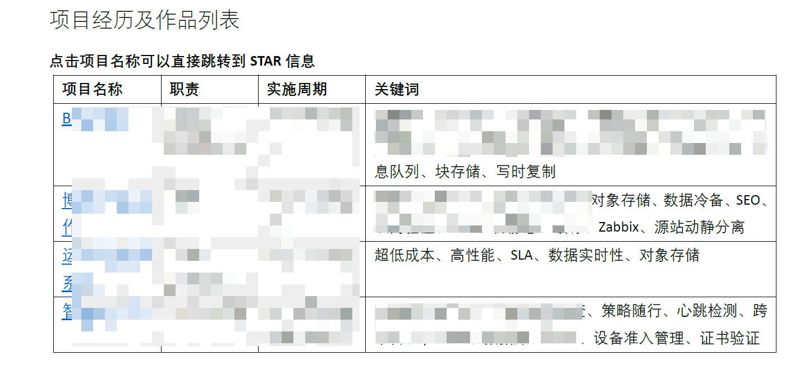
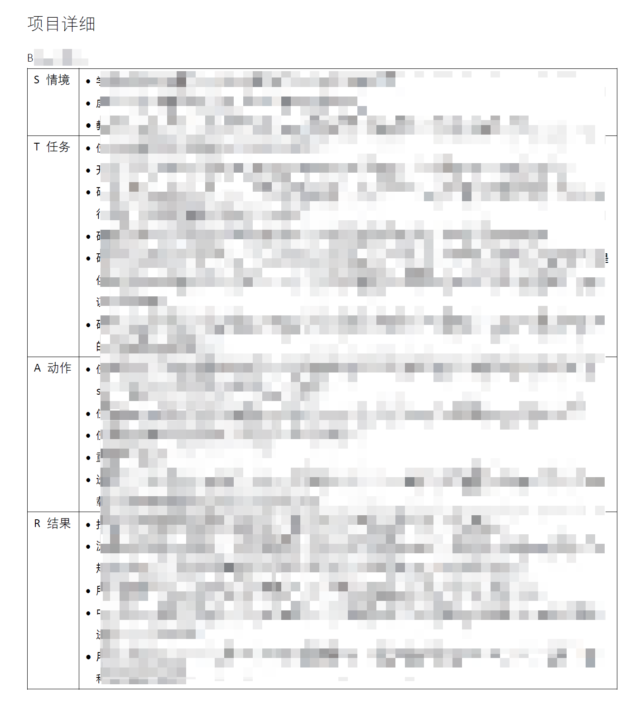

---
aliases:
- /archives/1443
categories:
- 面试
date: 2020-04-18 16:00:27+00:00
draft: false
title: 腾讯春招提前批成功拿下~
---

非常荣幸能够有机会入职鹅厂，截至到最后一次修订为止，offer已经收到了。本文总结一下这次的整个面试过程和经验，为后边朋友们提供参考~

## 写在开始

按照老规矩，还是感谢在这个过程中帮过我的朋友/老师们：

  * @晚晴
  * @Yee
  * @海燕lucky
  * @奥雷哈刚的秘密

当然这几年来，陪伴在身边的RM的朋友们、102的朋友们、罗总、周院、刘导等，也都提供了很多支持，一路走来，感谢有你

简历投到腾讯后总共被捞起来了三次，第一次是后台，挂了；第二次是运营开发，挂了；第三次是测试开发，一口气拿下了

实习部门为TEG技术工程事业群-网络研发部

## 面试建议

个人建议吧，每次面试时能录像最好录像，如果挂了后边可以用来总结问题，如果过了可以写面经装X2333333。但是，要特别留意下的是，有的公司（好比阿里）有些面试内容是属于保密的，这部分就不要记录了。

建议在回答问题前，先结合所在的部门的岗位揣测一下面试官想得到什么样的答案，避免一大堆废话就是讲不到点上。

建议每次面试结束时，问下面试官**关于这次面试的建议**，其实也就是问反馈，从回复里能获得很多有用的信息：好比可能存在的问题、面试情况等，同时建议问一下**后续的流程**，不至于不知所措。在面试过程中，也可以就技术问题做一些探讨，而不是单纯被面试而已，可以去问面试官他们部门在用的技术栈，可以作为后边学习的方向。当然记得看着时间，不要耽误人家太长时间

同时，建议准备面试，建议去查查常问的问题做好准备。博主我是在面HR的时候才做了准备，足足准备了5张A4纸的问题回答，然后全部都命中了，觉得HR面试发挥的算是最好的了。个人建议吧，技术面如果只是少部分缺陷，短期突击还是可以的，如果明摆着问题比较多的话，建议还是别突击了，脚踏实地慢慢补吧。当然，也特别说明一下，**准备面试只是为了把所有能表现的亮点都表现出来，如实回答即可，而不是准备弄虚作假。**

建议每个问答的问题回答不要太久，一般表达思考过程这些，2分钟左右为佳。可以尝试试探，在面试过程中，讲完一段之后，等待个1-3秒，如果面试官没有接话来问，而且这个问题没有讲太长时间，就可以继续补充，如果面试官问问题了，就回答就好了。**我之前文章里写了控场，但实际上不建议这么做，除非面试官真的能冷场，此时才需要我们控场（或者你自己冷场了想让面试官看到真正的闪光点），否则自己主动控场反而容易GG**

## 初试

初试环节大概30min左右

  * 问简历中的一个项目，讲项目的S（背景）、T（规划的任务）、A（实际行动和**思考过程**）、R（结果）即可。侧重讲A和R，突出你的思考的过程，**只是讲项目没有突出思考过程等于没讲，也等于浪费时间**
  * 流量分类和策略路由
  * 对突发流量的认知。回答突发流量直接决定系统高峰时期稳定性，然后结束当前话题
  * 对SDN的理解。谈到了ARP学习过程、MAC帧转发过程、OpenFlow主动和被动模式区别、流量工程、大二层
  * 对NFV的理解。接触不多，就稍微提到了一下负载均衡
  * 描述下报文到网络设备，从一个口进来到另外一个口出去这个过程。从L2（OSI中Layer 2，下同）到L3分别进行了回答，提到了ARP记录、路由表、最长前缀匹配等
  * 数据包进来时为什么先L2。回答由于OSI分层，因此MAC帧和IP是逐层封装的，谈到了MAC帧类型
  * 对IP地址掩码的理解，问/24的地址池、广播地址、网络地址
  * 广播的过程
  * IP地址的分类，问A/B/C地址区别和作用。回答顺便提到了组播地址、RFC1918和路由汇总
  * 两家企业内网互通，私网地址冲突如何解决。立即想到了一对一NAT，打算用SDN的方式回答，结果没想到，所以还是回答了一对一NAT（地址映射），MikroTik做无线的时候用过
  * 项目工作中有没有开发过程
  * 写过什么工具
  * 就自己用的Python和Go区别。提及到了GIL、并发、线程安全、动静态语言、json、哈希表、CPU密集、事件驱动、上下文切换、内核境态，同时对比了应用场景

技术类的问题是这些，然后又附带问了有没有继续深造的打算、问实习能否延长、问未来规划。觉得面试过程中整个我说的比较多，而且扩展的比较多，所以看起来面试官问的也不是很多，看牛客上有人被问的问题一大串，只能说自己运气好吧

## 复试

到复试时就是总监面试了，整个面试大概15min不到

  * 自我介绍（2min）
  * 开发技术栈主要用的语言。回答时同时简述了项目使用的场景和语言需求
  * 对SDN控制器的了解。回答了项目在SDN化的过程中的方式和解决的问题（**突出思考过程！**）
  * 本科生很少有实操和实践经验，说我这方面比较突出~~（嘿嘿）~~，问起初是怎么考虑的
  * 毕业之后的计划
  * 介绍了研发生命周期的三段，开发-&gt;测试-&gt;运营部署和维护
  * 有没有面试其他公司
  * 人在哪里，实习时间
  * 自己如何评价自己性格

稍微提及一下，自我介绍不要讲废话，最佳的自我介绍应该是让人听了之后能留下印象，而不是千篇一律的那种。具体怎么才能做到这个效果还是需要多多百度和修改，要花时间

以及，在复试过程中，我和面试官就自己项目中的一些技术栈进行了探讨，了解到了他们那边在用的一些前沿的技术，并且他也给我推荐了一些相关内容去学习。我建议后续面试的小伙伴们也可以这样去多和面试官探讨，个人觉得如果不是面试官在控场的话，尝试这样交流也是挺好的，还能收获更多东西

## HR面试

听说HR面试比较喜欢突袭….不约时间直接电话打过来，因此建议时刻准备着（我连上厕所时都带着手机了）。由于手机是原生的Android，因此通话没有录音机，我就凭印象写写好了

首先我们要明确HR问的问题的目的是什么，有助于我们更好的涛涛不绝，正常情况下，HR面试主要是了解一个人：人品、性格和上进程度，评估这个人是否符合公司的发展观，也会就项目问你逻辑，借此评估你适不适合这个岗位。因此，此时项目更应该侧重在思考过程上，不用突出技术（因为人家是HR不是做技术的），而是突出对于这个背景（需求），你为什么用这个方案解决，对比其他方案你为什么不选其他的，要突出这个思考的过程，而不是，我学了Spring框架我就只用这东西，我一点都不考虑场景只管怼，这样的开发是不带思考过程的，我个人将这样的实践过程归类为没有意义的。就像技术社区里经常提到的那句话，最怕一门语言就是全部。

问的问题大概有这些：

  * 自我介绍
  * 问简历上的一个项目。回答了这个项目的来源和需求、开发过程、实现的效果，同时就另外一个项目稍微谈到了点设计思想
  * 为什么来广东读书。回答因为对比郑州觉得这里信息领域发达，机会多，喜欢深圳
  * 爱好。回答技术爱好同时，也稍微提了一下摄影和最近学的金融，从金融方面谈到了不会理财的缺点和通过金融知识弥补，谈到了未来的规划（一般HR面试必问优点缺点，这个问题建议提前也准备一下。我没有被问到，事后总结可能是因为学金融相关的东西已经表达出来了）
  * 入职时间

然后就已完成了，当晚offer就批报中了。

**最后总结一下这三轮面试（初试、复试、HR面）**：觉得面试官都很nice，没有在看到网上所说的糟糕的情况。初面的面试官是个女的，在面试过程中给了很多正向的反馈，就使得我面试过程中包括结束后感觉很舒服而不是被碾压了的感觉；复试过程中面试官还和我交流了他们现在在用的技术，借此我终于找到了在我BitSphere这个项目中最符合场景的数据平面的框架——FD.io，收获颇丰。而且复试的面试官我听到他在和我交流的时候语气里带着笑意，就觉得这个面试过程非常舒服，而且面试官还提前了15分钟上线等我，实在是nice。HR面试也很和谐，就觉得很亲和，面试没有多少压力，感觉就是正常交流

## 整个流程

时间线大概是这样的：

  * 3月底简历就被捞起来了，但是迟迟没有发起面试
  * 4月8日，11点，发下午5点半面试的邀请
  * 4月9日，14点，发4月11日11点的面试邀请
  * 4月12日前后，变成HR面试
  * 4月15日，HR面试结束，当晚offer批报中
  * 4月17日，已录用

在校招网站上，你能看到有这四个状态：初试、复试、HR面试、已完成。在已完成时，还有三个隐藏的状态，需要你的内推人才能看到，可以麻烦他帮忙查一下，这三个状态分别是：待批报、批报中、已录用。已录用出了后，一般当天就能收到offer call，如果正逢节假日，可能要等到工作日，offer call后就是下offer邮件，然后大门就为你敞开了（笑

截止到最后一次修订时，offer已经收到了，offer call之后当天就会下offer，不过由于保密要求，因此就只更新到这里啦~

## 关于简历

这几天陆陆续续帮别人看了一些简历，发现其实和自己开始时问题都差不多，在此一一列举一下，供后来者避坑：

  * 照片建议白底，和简历背景融为一体。拍摄建议背景使用白色或者灰白（接近中性灰那种），PS处理一下把人抠出来，保存成png（有Alpha通道）再扔进简历即可
  * 把最出彩的地方放到首位
  * 不要作假不要作假不要作假
  * 标点符号要统一，不要一会英文标点（半角）一会中文标点（全角），真的非常难看
  * 文本格式要统一，不要同样层级的内容一块大一块小，如果面试官是强迫症我想他一定看不下去的
  * 写进来的东西均有可能成为提问的内容，不要写自己不了解的东西
  * 不相关的东西不建议写，可以作为添彩内容，但是如果有明确的bg的话，而且篇幅已经太长了，建议还是删掉
  * 建议简历不要超过一页，如果无法避免的两页了也可以的，三页四页那种就有点过分了。我在第二次被捞时，直到面试时面试官还没看完我的简历………所以建议不要写太长，内容明确，就好
  * 写项目经历建议使用STAR方式写，即情境、任务、行动、结果。重在突出A和R，同时建议写出你的思考过程，如果项目比较出彩的情况下，STAR可以适当超出一些篇幅，觉得应该没啥问题
  * 排版整洁，这个就不多说了
  * 注意措辞，尽量不要出现语病，建议简历写完找几个朋友帮忙读读看有没有表达不对的地方
  * STAR中的R，如果是非逻辑性的结果，建议能量化表达最好量化表达。即，好比我通过一个方式优化系统，使其性能提高了多少个百分点，而不是_使系统性能大幅提升_这样的话
  * 简历不要搞的花花绿绿，又不是做设计行业的，朴素简明即可，能使用关键词就不要用句子表达
  * （想起来再补充）

首先对于简历的话，如果你已经明确岗位了，那么以下内容仅供参考，如果你不确定，可以摆明大致方向的情况下提供尽可能多的项目的详细情况，以便于简历被捞

常规来说，简历不建议超过1页，特殊情况下不建议超出两页。但是如果相关的项目经历确实比较多怎么办？博主我在思考的时候想到了锚点这一做法，即在首页把项目只是列个表，然后锚点打到后边的详细STAR去，对于项目的情况参考论文写关键词即可。这样一来简历就缩减到了1页多一点点（由于大一到大二期间17项荣誉实在没办法删减了，就只能超出一些篇幅了），面试官可以根据他感兴趣的点（关键词）选择性去看他关注的内容，而不必通篇在翻你简历，而你又可以把尽可能多的内容写在简历上，可谓两全其美。当然在一页结束时记得加分隔符，这样看起来会非常整洁

简历大概这样<figure class="wp-block-image size-large">

 </figure> 

通过锚点打到下方写详细即可，如下图<figure class="wp-block-image size-large">

 </figure>