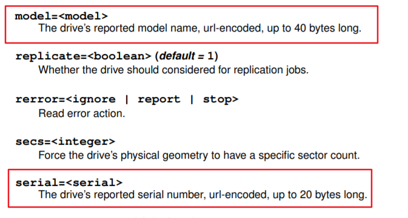
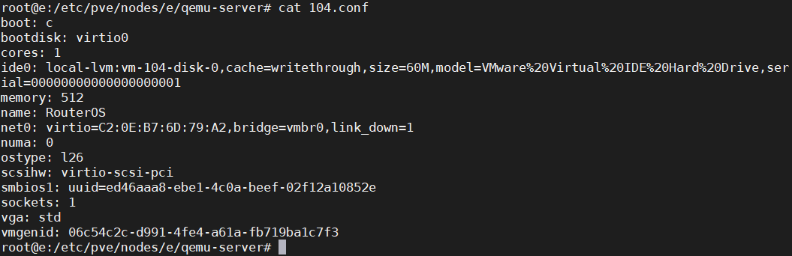
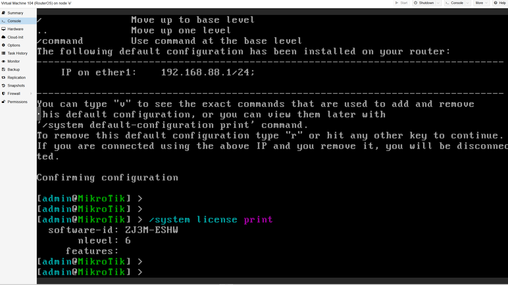

---
aliases:
- /archives/1462
categories:
- Linux
date: 2020-04-26 10:15:33+00:00
draft: false
title: RouterOS x86_64导入到Proxmox VE的方法
---

RouterOS x86_64一般都是以ova的形式存在，原因嘛，你懂得。但是由于RouterOS使用磁盘信息进行授权验证，所以迁移到PVE平台上大概率会导致验证失败然后无法启动。


至于为什么会有VMware ESXi向PVE迁移的平台，这就不得不吐槽一下ESXi对硬件的要求了——5.5版本之后不支持螃蟹的网卡，想在小规模机器上跑，这一点硬件要求就只能选择PVE了。而且ESXi的基础内存开销要比PVE高很多，这也极大程度上劝退了低端机器玩家


## 验证原理

MT官方应该是不会提供验证细节的，倒是在网上看到网友们发掘出来的做克隆盘的方法，其中提到了验证细节

> 1. 硬盘型号Model Name
> 2. 硬盘序号Serial Number
> 3. 硬盘韧体号FirmwareVersion（这个我不确定，实作上我是改一样的；因为可以改到上面的这个字段也可以改；只是有些硬盘是没这个字段的）
> 4. 硬盘大小，跟着C/H/S值跑

3提到的硬盘固件号应该是不用的，实测没改也行也能用。至于硬盘CHS的话，即寻址使用的，不是很清楚这个CHS属于控制器哪一侧，查了一下SATA协议，一直到应用层没有看到关于寻址相关的。又查了下发现是在文件系统层次的，那么既然是在文件系统层次的，那么CHS/LBA就直接在虚拟磁盘中的，在**不动虚拟磁盘（好比扩容）**的情况下，是不用理会的

那么就只需要动model name和serial即可了

## PVE对于不同规范的支持

引用下官方对qm的解释：

> qm is the tool to manage Qemu/Kvm virtual machines on Proxmox VE.


PVE中对于QEMU进行了二次封装，因此配置文件不是qemu专用的了而是pve qm的，在下图中的话，就是等同于libvirt


建议看一下PVE官方的用户手册：https://pve.proxmox.com/pve-docs/pve-admin-guide.pdf

手册中对于高阶设定都给出了很详细的解释，在该文档中我只看到了在IDE规范中存在model和serial参数，如下图




反观SATA和SCSI，我还真没看到model只看到了serial参数，近似model name参数也没有找到，目测只能将就用ide了。

## 导入方法

qm导入磁盘支持vmdk，因此可以直接导没问题的。大概流程如下：

先创建新的虚拟机，假设ID为104，那么新建后删除默认的虚拟磁盘，把RouterOS系统盘的vmdk上传到任意位置，然后使用如下命令导入即可，导入后去Web Console分配到控制器，由于上边说到只有IDE有model name参数，因此只能使用IDE模式


```bash
qm importdisk 104 RouterOS_6.36.3_x64-disk1.vmdk local-lvm
```


然后接下来是修改参数，配置文件目录在`/etc/pve/nodes/&lt;主机名&gt;/qemu-server`中，修改对应编号的配置文件即可，在对应的ide设备尾部添加如下内容即可


```text
,model=VMware%20Virtual%20IDE%20Hard%20Drive,serial=00000000000000000001
```


修改完之后就是这样的



然后去Web Console刷新一下开机即可

## 效果




RouterOS x86_64（非CHR版本）竟然也支持VirtIO网卡，本想存储也使用VirtIO的但由于不支持model name修改所以也就没办法了。不过其本身作为路由器系统来讲，存储没有优化的必要，反而是支持VirtIO网卡会很香，性能上相对于E1000这些虚拟网卡会有比较明显的提升