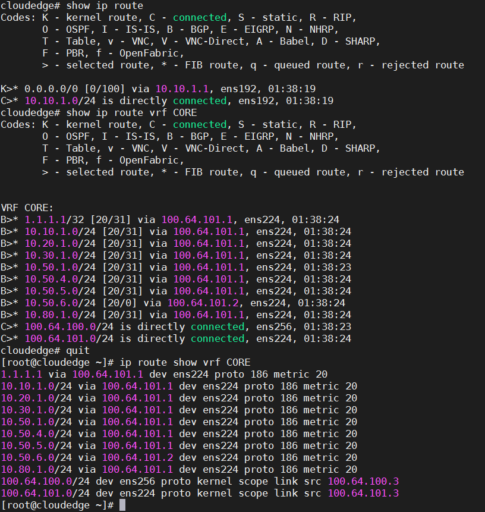
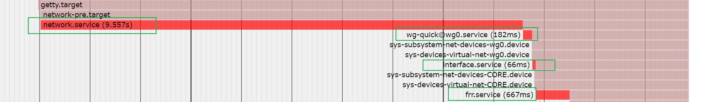

---
aliases:
- /archives/1477
categories:
- 网络基础
date: 2020-06-14 16:10:32+00:00
draft: false
title: XUEGAONET v1.x混合云网络架构详解
---

雪糕网络（xuegao_net）最初来源于瞎搞，没想到越搞越大，在逐步整合了所到之处所有的网络之后，发现管理已经力不从心，由此决定结合在鹅厂学到的东西，慢慢对网络结构进行整改，向着独立、自治和软件定义的目标重构网络。

新网络以BGP为基础，借助GoBGP来实现NFV在区域内部进行引流，同时对外发布路由，借此来实现云上+云下一体化。

## 主要工作

  * 云下基础架构建设
  * 云上建设
  * 云上云下一体化
  * 底层传输优化
  * PaaS向CaaS过渡

## 云下基础设施建设

当前版本主要侧重这些：

  * VRF做三层隔离，以前都是混合的，路由比较乱
  * 专线隧道换成了L2TP+IPSec（坑爹ROS有bug，下文细说）
  * 虚拟交换机端口使用VST Mode，新增接口终于不用重启VM了
  * IGP内OSPF传递路由（过滤/30），EGP内BGP传递路由（过滤/30）
  * 专线路由使用GoBGP gRPC程序动态更新EGP引流路由，把云下和云上流量一块引下来
  * NFV引流和流量回注，不过是默认路由直接回注进隧道端（走VRF）
  * 多跳BGP+NFV，EGP传递直接设置上Nexthop避免迭代
  * 云上VxLAN打通，配合网关和云上服务整合全网资源
  * 发布路由过滤，只允许非点对点路由发布出去，全网地址规划统一

下阶段的话，打算部署EVPN分布式网关了，只不过由于RouterOS迟迟还没有支持BGP EVPN，因此全线换VyOS或者Linux+frrouting可能还需要一段时间。还是分布式的大二层舒服啊...鉴于TAP接入容易屏蔽路由，虽然防止了数据泄露，但是也给一些场景下使用带来了不便，看看后边要不要做个客户端解决一下

## PaaS向CaaS过渡

CentOS 8安装Docker会有一些不兼容的问题，安装参考这篇文章即可解决：https://linuxconfig.org/how-to-install-docker-in-rhel-8

当然是Docker~基本操作完成后，创建`/etc/docker/daemon.json`这么个文件，内容如下。主要目的是不要让docker开启默认的bridge和iptables规则，当然如果你要拿这个机器做docker build的话就不要做这步操作了不然build过程中会无法联网


```json
{
    "iptables": false,
    "bridge": "none"
}
```


其次修改/lib/systemd/system/docker.service，修改数据目录，这个具体看实际应用环境，由于我这里数据存储和系统是分开的，因此要手动改下数据目录。改动后如下（其实也没改多少内容，只是在`ExecStart=/usr/bin/dockerd -H fd://`多加了个`-g /data/docker`）


```ini
[Unit]
Description=Docker Application Container Engine
Documentation=https://docs.docker.com
BindsTo=containerd.service
After=network-online.target firewalld.service
Wants=network-online.target
Requires=docker.socket

[Service]
Type=notify
# the default is not to use systemd for cgroups because the delegate issues still
# exists and systemd currently does not support the cgroup feature set required
# for containers run by docker
ExecStart=/usr/bin/dockerd -g /data/docker -H fd://
ExecReload=/bin/kill -s HUP $MAINPID
TimeoutSec=0
RestartSec=2
Restart=always

# Note that StartLimit* options were moved from "Service" to "Unit" in systemd 229.
# Both the old, and new location are accepted by systemd 229 and up, so using the old location
# to make them work for either version of systemd.
StartLimitBurst=3

# Note that StartLimitInterval was renamed to StartLimitIntervalSec in systemd 230.
# Both the old, and new name are accepted by systemd 230 and up, so using the old name to make
# this option work for either version of systemd.
StartLimitInterval=60s

# Having non-zero Limit*s causes performance problems due to accounting overhead
# in the kernel. We recommend using cgroups to do container-local accounting.
LimitNOFILE=infinity
LimitNPROC=infinity
LimitCORE=infinity

# Comment TasksMax if your systemd version does not supports it.
# Only systemd 226 and above support this option.
TasksMax=infinity

# set delegate yes so that systemd does not reset the cgroups of docker containers
Delegate=yes

# kill only the docker process, not all processes in the cgroup
KillMode=process

[Install]
WantedBy=multi-user.target
```


## VyOS的一些尝试

### 镜像构建

以下内容只是尝试中的记录，实际最后由于VyOS存在限制太多并未选用VyOS而是选用了frrouting。

参考资料：

* https://docs.vyos.io/en/latest/contributing/build-vyos.html

在开始前，先提醒下需要留意下VyOS的许可证问题，官方对许可证是这么解释的（如下），意味着，本如果你想得到LTS镜像，那么抱歉要订阅（或者在开源社区有贡献），否则你就只能老老实实用滚动发布版本（相当于nightly版本，可能不稳定）。但是，LTS源码都公开了，如果你不想订阅那么就只能自己编译，官方甚至还提供了docker image封装好了编译的环境，自己编译iso几乎也是0成本了。这个操作我觉得很赞

> Starting with VyOS 1.2 the release model of VyOS has changed. VyOS is now <strong>free as in speech, but not as in beer</strong>. This means that while VyOS is still an open source project, the release ISOs are no longer free and can only be obtained via subscription, or by contributing to the community.
> 
> The source code remains public and an ISO can be built using the process outlined here.


之所以选择VyOS，是因为VyOS与时俱进，同时在1.2版本之后加入了frrouting，可以说是非常完美了。不论是用在个人环境的云上还是用在家庭等小规模环境，几乎都要比RouterOS完美，而且frr原生支持了BGP EVPN（事实证明VyOS的frr如果要使用EVPN，需要手动单独配置），Linux自带的iptables融入在其中，从功能层面上几乎已经完全秒杀RouterOS了。在VyOS支持WireGuard和OpenVPN UDP的今天，RouterOS刚刚在alpha版本支持了OpenVPN UDP，~~所以我选择开始逐渐向VyOS过渡~~（事实证明VyOS还是不成熟…….）。

手动编译iso的方法看官方的文档吧，即上边的参考资料，此处就不再赘述了。

### 隧道构建混合云BGP Peer（测试）

此处，我选择WireGuard + OpenVPN TCP构建隧道。WireGuard为UDP协议，不容易出现TCP over TCP的锁死问题，首选使用WireGuard隧道，OpenVPN隧道只是冗余使用，链路使用BFD探活，如果WireGuard挂了要秒级完成OpenVPN TCP隧道的切换，那么如果OpenVPN TCP也挂了那就只能认命了。暂且还没规划BGP VPNv4的部署，所以暂且单点接入，挂了就只能祈祷了（不过云服务商一般都不会太脆）。

我装了两个测试机做MultiHop BGP，参考CLI如下，由于是测试，因此公钥私钥我也不脱敏了。两个机器，一个hostname是T1，一个是T2，具体配置如下


```bash
vyos@T1:~$ show configuration commands 
set firewall all-ping 'enable'
set firewall broadcast-ping 'disable'
set firewall config-trap 'disable'
set firewall ipv6-receive-redirects 'disable'
set firewall ipv6-src-route 'disable'
set firewall ip-src-route 'disable'
set firewall log-martians 'enable'
set firewall name Test default-action 'drop'
set firewall receive-redirects 'disable'
set firewall send-redirects 'enable'
set firewall source-validation 'disable'
set firewall syn-cookies 'enable'
set firewall twa-hazards-protection 'disable'
set interfaces bridge br0 address '8.8.4.4/32'
set interfaces ethernet eth0 address '100.1.1.1/30'
set interfaces ethernet eth0 hw-id '00:0c:29:1b:68:dc'
set interfaces loopback lo address '1.1.1.1/32'
set interfaces wireguard wg0 address '10.1.1.1/30'
set interfaces wireguard wg0 description 'T2'
set interfaces wireguard wg0 peer T2 allowed-ips '0.0.0.0/0'
set interfaces wireguard wg0 peer T2 pubkey 'bLvNfwEmtDrMdNy3Inwv7U+W3QMgu0iXouoJqPCHGzo='
set interfaces wireguard wg0 port '1111'
set interfaces wireguard wg0 private-key 'T1'
set protocols bgp 65503 address-family ipv4-unicast network 8.8.4.4/32
set protocols bgp 65503 neighbor 2.1.1.1 ebgp-multihop '5'
set protocols bgp 65503 neighbor 2.1.1.1 remote-as '65502'
set protocols bgp 65503 neighbor 2.1.1.1 update-source 'lo'
set protocols bgp 65503 parameters router-id '1.1.1.1'
set protocols static route 2.1.1.1/32 next-hop 10.1.1.2 next-hop-interface 'wg0'
set system config-management commit-revisions '100'
set system console device ttyS0 speed '115200'
set system host-name 'T1'
set system login user vyos authentication encrypted-password '密码我还是脱敏下吧'
set system login user vyos authentication plaintext-password ''
set system ntp server 0.pool.ntp.org
set system ntp server 1.pool.ntp.org
set system ntp server 2.pool.ntp.org
set system syslog global facility all level 'info'
set system syslog global facility protocols level 'debug'
```


```bash
vyos@T2:~$ show configuration commands 
set firewall
set interfaces bridge br0 address '8.8.8.8/32'
set interfaces ethernet eth0 address '100.1.1.2/30'
set interfaces ethernet eth0 hw-id '00:0c:29:38:b6:90'
set interfaces loopback lo address '2.1.1.1/32'
set interfaces wireguard wg0 address '10.1.1.2/30'
set interfaces wireguard wg0 peer T1 address '100.1.1.1'
set interfaces wireguard wg0 peer T1 allowed-ips '0.0.0.0/0'
set interfaces wireguard wg0 peer T1 persistent-keepalive '10'
set interfaces wireguard wg0 peer T1 port '1111'
set interfaces wireguard wg0 peer T1 pubkey '9mfj6golC2iy3Hv/+TEOGH3vwrRS4LKAbBBPij0gyDg='
set interfaces wireguard wg0 private-key 'T2'
set protocols bgp 65502 address-family ipv4-unicast network 8.8.8.8/32
set protocols bgp 65502 neighbor 1.1.1.1 ebgp-multihop '5'
set protocols bgp 65502 neighbor 1.1.1.1 remote-as '65503'
set protocols bgp 65502 neighbor 1.1.1.1 update-source 'lo'
set protocols bgp 65502 parameters router-id '2.1.1.1'
set protocols static route 1.1.1.1/32 next-hop 10.1.1.1 next-hop-interface 'wg0'
set service
set system config-management commit-revisions '100'
set system console device ttyS0 speed '115200'
set system host-name 'T2'
set system login user vyos authentication encrypted-password '密码我还是脱敏下吧'
set system login user vyos authentication plaintext-password ''
set system ntp server 0.pool.ntp.org
set system ntp server 1.pool.ntp.org
set system ntp server 2.pool.ntp.org
set system syslog global facility all level 'info'
set system syslog global facility protocols level 'debug'
```


WireGuard使用的是被动连接模式，不是点对点模式，因为实际环境要经过NAT，因此并没有按照点对点的方式去配置。需要特别注意的是，在RouterOS里边，对于UDP的连接跟踪时间默认只有10秒，我看其他系统跟踪时间有30秒和20秒不等，当UDP连接跟丢之后，WireGuard隧道可能会出现短时卡死的问题，因此要尽可能不停得发keepalive避免连接跟跟丢。此处测试，因此我设置的发送周期是10s（persistent-keepalive），现实中我会选择配在5s左右，大于BFD的探活的周期即可。

## DNS配置

为了方便区域内部署，决定把DNS全部下发成1.1.1.1，在核心去把1.1.1.1/32指向旁挂的一个Linux服务器去。众所周知，如果要用这样一个方式，这台Linux服务器要额外配置一个loopback地址用于路由，同时还需要打开内核的ip_forward参数。

rc.local如下，主要是用于开机时添加loopback地址。尝试使用network-scripts但是死活加不上去，只能曲线救国了


```bash
#!/bin/bash
# THIS FILE IS ADDED FOR COMPATIBILITY PURPOSES
#
# It is highly advisable to create own systemd services or udev rules
# to run scripts during boot instead of using this file.
#
# In contrast to previous versions due to parallel execution during boot
# this script will NOT be run after all other services.
#
# Please note that you must run 'chmod +x /etc/rc.d/rc.local' to ensure
# that this script will be executed during boot.

ifconfig lo:10 1.1.1.1/32

touch /var/lock/subsys/local
```


下边的这个是sysctl.conf，主要打开了转发和bbr


```bash
# sysctl settings are defined through files in
# /usr/lib/sysctl.d/, /run/sysctl.d/, and /etc/sysctl.d/.
#
# Vendors settings live in /usr/lib/sysctl.d/.
# To override a whole file, create a new file with the same in
# /etc/sysctl.d/ and put new settings there. To override
# only specific settings, add a file with a lexically later
# name in /etc/sysctl.d/ and put new settings there.
#
# For more information, see sysctl.conf(5) and sysctl.d(5).
#
net.ipv4.ip_forward=1
net.core.default_qdisc=fq
net.ipv4.tcp_congestion_control=bbr
```


对了，如果要这么操作，提前记得在Linux上把SSH的监听地址修改成1.1.1.1，不然会给管理带来不便。

## RouterOS关于IPSec的bug

RouterOS新版本（LTS和上个子版本的LTS都是）IPSec无法完成协商，开了debug看了一下，检查发现默认支持的HASH算法和加密模式太少了导致无法握手，手动点上其他的就行了，但是仍然无法完成握手。

IPSec协议在点对点时使用UDP 500端口进行协商，开启NAT-Traveler时并检测到NAT时使用UDP 4500端口协商，观察ROS发现始终在使用500协商………….一直降级到6.40.8没有NAT-T选项时才能正常使用4500完成协商。

真·BugOS

## 链路优化

链路优化主要是混合云间链路优化和物理链路优化，混合云由于要避免TCP over TCP锁死的问题，因此选择使用all over UDP的方式，所有数据封进Wireguard统一上云（含控制面）。物理链路上主要是优化MTU，针对TCP进行优化，全网TCP MSS统一设置在1300，确保合理设置DF的包在上云和直连物理出口的TCP报不会被丢弃（好比BGP）。

注意MSS控制必须要注意是双向控制

部分链路启用ECMP，主要在BGP控制面和专线。

## BugOS的VRF中的BUG

RouterOS，以下简称BugOS。

BugOS中的VRF存在玄学bug，在部分版本中本机全局路由中的流量走到上联并重新穿越回本机的VRF时，较新的几个版本都存在丢包的问题。

VyOS由于crux版本（目前的LTS）暂时还没有支持VRF，预估还要等待晚些时候重新编译新LTS版本才能逐渐把所有的RouterOS换下去。

最近在配置混合云间BGP的时候，发现BugOS的BGP无论如何都不通。具体场景是这样的，客户端L2TP挂云上，两边的L2TP接口都配到了VRF中，BGP的loopback也都加入到了对应的VRF中，本地IGP这样配置全都通了，唯独走隧道（L2TP）死活不通。观察了下连接跟踪表，发现全部都是SYN Sent状态，怀疑BugOS根本就没有把回程正确发出去。于是又在物理接口处抓了下包看了下，果然尼玛流量泄漏，原本应该在VRF中的流量莫名其妙全部走到了全局路由表中。最后只能使用rule把BGP的路由绑定在VRF表里才算established。

在切换方案的时候，无意中看到了frrouting官网这么一段话

> Important note as of June 2018, Kernel versions 4.14-4.18 have a known bug where VRF-specific TCP sockets are not properly handled. When running these kernel versions, if unable to establish any VRF BGP adjacencies, either downgrade to 4.13 or set ‘net.ipv4.tcp_l3mdev_accept=1’. The fix for this issue is planned to be included in future kernel versions. So upgrading your kernel may also address this issue.
> 
> http://docs.frrouting.org/en/latest/installation.html

上边这段话说Linux有些版本的内核对于VRF的支持有bug，可能会导致VRF无法获取TCP socket，进而导致BGP连接被VRF接管时TCP连接无法进入established状态。暂且看来RouterOS可能就是这样了，不过至于这个socket是如何在VRF间共享的（非进程绑定在命名空间），这个晚点研究一下

## 闪亮登场——FRRouting

最后还是选择了使用FRRouting，毕竟原生和Linux融合的，保证自由性，相比VyOS虽然上手不是很好上手，但是出问题排查比较方便。VyOS拿FRRouting和Debian深度定制的，要动起来一些东西不是很方便，虽然用起来是省事很多，但是很多硬性需求无法满足，最后还是回到了frr。

安装前最好先更新下内核吧，尤其是要用MPLS的，官方文档说4.5（包含）以上的才能支持MPLS。同时，上文VRF说到了部分Linux Kernel对VRF的支持存在问题，LTS刚好都落在不符合要求的区间内，更新主线或许是个比较不错的选择。尽管可能潜在一些未知的问题，如果真遇到了就排查一下反馈一下好了，算是为开源做贡献了~

（警告！~~下边使用的7.2版本中BFD在VRF中有bug，建议跟进主线~~主线的也无法使用）编译安装一条龙（仅限CentOS7，其他系统自行看官方文档）：


```bash
wget https://ci1.netdef.org/artifact/LIBYANG-YANGRELEASE/shared/build-10/CentOS-7-x86_64-Packages/libyang-0.16.111-0.x86_64.rpm
wget https://ci1.netdef.org/artifact/LIBYANG-YANGRELEASE/shared/build-10/CentOS-7-x86_64-Packages/libyang-devel-0.16.111-0.x86_64.rpm
yum install ./liby*
yum install git autoconf automake libtool make patch readline-devel texinfo net-snmp-devel groff pkgconfig   json-c-devel pam-devel bison flex pytest c-ares-devel   python-devel systemd-devel python-sphinx libcap-devel
groupadd -g 92 frr
groupadd -r -g 85 frrvty
useradd -u 92 -g 92 -M -r -G frrvty -s /sbin/nologin   -c "FRR FRRouting suite" -d /var/run/frr frr
wget https://github.com/FRRouting/frr/archive/frr-7.2.tar.gz
tar xvf frr-7.2.tar.gz
cd frr-frr-7.2/
./bootstrap.sh
./configure     --bindir=/usr/bin     --sbindir=/usr/lib/frr     --sysconfdir=/etc/frr     --libdir=/usr/lib/frr     --libexecdir=/usr/lib/frr     --localstatedir=/var/run/frr     --with-moduledir=/usr/lib/frr/modules     --enable-snmp=agentx     --enable-multipath=64     --enable-user=frr     --enable-group=frr     --enable-vty-group=frrvty     --enable-systemd=yes     --disable-exampledir     --disable-ldpd     --enable-fpm      --with-pkg-extra-version=-XUEGAONET     SPHINXBUILD=/usr/bin/sphinx-build
make
make check
make install
mkdir /etc/frr
touch /etc/frr/zebra.conf
touch /etc/frr/bgpd.conf
touch /etc/frr/ospfd.conf
touch /etc/frr/ospf6d.conf
touch /etc/frr/isisd.conf
touch /etc/frr/ripd.conf
touch /etc/frr/ripngd.conf
touch /etc/frr/pimd.conf
touch /etc/frr/nhrpd.conf
touch /etc/frr/eigrpd.conf
touch /etc/frr/babeld.conf
chown -R frr:frr /etc/frr/
touch /etc/frr/vtysh.conf
chown frr:frrvty /etc/frr/vtysh.conf
chmod 640 /etc/frr/*.conf
install -p -m 644 tools/etc/frr/daemons /etc/frr/
install -p -m 644 tools/frr.service /usr/lib/systemd/system/frr.service
chown frr:frr /etc/frr/daemons
systemctl daemon-reload
systemctl status frr
systemctl preset frr.service
systemctl enable frr
```


配置的话，文件在`/etc/frr/daemons`中，选择开启哪些组件即可。

紧接着要配置VRF，查阅官方文档，有这么句话

> This command is available on configuration mode. By default, above command permits accessing the VRF configuration mode. This mode is available for both VRFs. It is to be noted that <strong><em>Zebra</em> does not create Linux VRF</strong>. The network administrator can however decide to provision this command in configuration file to provide more clarity about the intended configuration.
> 
> <strong>vrf VRF</strong>

上边这段话，加粗的那个从句是重点，漏看了这句导致我搞了好久。Zebra不会自动创建VRF的情况下，就意味着你要手动创建VRF并且把相关接口绑定进VRF，最好接口地址连带一起配置了。

因此，你需要手动搓一个一次性服务，用于在系统启动后配置VRF。路径在`/data/interface.sh`，需要配合服务启动，具体的service在下边，此处先贴脚本内容：


```bash
#!/bin/bash

ip link add dev CORE type vrf table 200
ip link set dev ens224 master CORE
ip link set dev wg0 master CORE

ifconfig CORE up

```


由于要确保BGP会话能够绑定在VRF中，因此要打开TCP Socket捕获，同时Kernel的IP Forward也要打开，UDP也需要进行Socket捕获是因为BFD要用，配置`sysctl.conf`即可，配置如下（如果用云服务器之类的，可能会有预置参数，改一下即可）：


```bash
net.ipv4.tcp_l3mdev_accept=1
net.ipv4.udp_l3mdev_accept=1
net.ipv4.ip_forward=1
```


生效后可以使用`ip route show vrf CORE`查看CORE这个VRF中的路由。并且测试过Zebra能够正常安装下路由，大概效果就是这样


 </figure> 

唯独就是很奇怪的，和RouterOS死活建不上BFD，不知道为什么，还在进一步排查。

更新到主线内核之后，还可以享受到内核里直接集成的WireGuard，无需再使用DKMS安装。

紧接着手动安装wireguard-tools，直接源码安装就好


```bash
wget https://github.com/WireGuard/wireguard-tools/archive/v1.0.20200513.tar.gz
tar xvf v1.0.20200513.tar.gz
cd wireguard-tools-1.0.20200513/src
make
make install
```


然后即可使用wg命令管理wireguard隧道~当然我们还是要使用服务，下边继续说明

由于直连IP仅用于隧道打通和SSH，BGP等服务还是在内部其他隧道，因此iptables记得修改规则，所有入口过滤仅限在公网入接口，内部隧道接口一般就不加了，真要加也只是加一个TCP MSS Clamp而已。


```bash
wg genkey > private.key
chmod 077 private.key
wg pubkey < private.key > public.key

cat >> /etc/wireguard/wg0.conf << EOF
[Interface]
PrivateKey = [私钥]
ListenPort = [端口号]
MTU = 1412
Table = off  # 不要让wg-quick自作主张添加规则

[Peer]
PublicKey = [公钥]
AllowedIPs = 0.0.0.0/0
EOF
```


注意，服务端的公钥填在客户端的Peer中，客户端的公钥填在服务端的Peer中。填完后使用如下配置来即可


```
systemctl enable wg-quick@wg0
```


注意：WireGuard的地址不要配置，地址配置交给frr来配置，否则frr抢先配置地址会导致wireguard服务启动失败，调整顺序的话可能会导致frr上配置了地址后边wireguard无法重启，所以最好的办法就是在frr上做修改，不要让wg-quick的服务去配置地址。同时，由于wg-quick启动时会加一个iptables规则，这个规则会导致无法正常使用，要把该规则关掉，这个规则不关会导致VRF中无法使用（通过Table = off 关闭）

注意：BGP不要加密码，加了会挂，问题不详，等待检查。（问题已定位，是TCP MSS导致的，在配置BGP通过隧道握手时，一定确保有设置MSS控制并且确保整包长度没有超过MTU，否则BGP的信令默认会设置DF（不允许分片），在经过MTU较小的地方时又不能分片就会导致所有数据包直接被丢弃，造成网络不通）

再完成了配置之后，就需要开始配置服务了，需要特别注意的systemd中frr.service、wg-quick@.service、接口配置（network.service、interface.service）的执行顺序。理论上来说，分入VRF的接口均不需要配置地址，这个工作交给frr即可，因此，确保WireGuard和走VRF的物理接口不要配置地址，并且新加一个一次性服务新建VRF并添加接口即可。

总共有这些服务：

  * frr.service：FRRouting的服务，就不多说了
  * interface.service：新增的一次性服务，主要用于执行脚本新加VRF并添加子接口
  * NetworkManager.service：只是配合nmtui或者nmcli配置接口用的，仅在需要配置时打开即可，用完关掉就行，不然影响启动速度
  * network.service：网络服务，这个就不多说了
  * wg-quick@wg0.service：WireGuard服务

启动顺序为：network.service -> wg-quick@wg0.service -> interface.service -> frr.service。wg-quick@wg0.service要确保网络已经全部启动，因此要在network.service后；interface.service会添加物理接口和wg接口道VRF，因此要在wg-quick@wg0.service之后启动，最后再给frr配置地址。所以这样一来，只需要保障这样一条链的After即可。需要注意的是，我不建议使用Wants，因为Wants拉起服务仍然是同时拉起，还是要单独去设置启动顺序，建议还是老老实实After为好。

因此，最后只需要这几步：

  * 修改wg-quick@wg0.service，After添加network.service
  * 添加interface.service，注意脚本给可执行权限。After=wg-quick@wg0.service
  * 修改frr.service，After添加interface.service
  * 禁用NetworkManager.service，启用interface.service等
  * 如果依赖存在循环，需要手工再去筛查解决




可以看到，最终应该达到的效果，就是上边这样。（上边这个图是使用`systemd-analyze plot > xgn-local-004.svg`导出）。interface.service的文件内容如下：


```ini
[Unit]
Description=XGN Interface
After=wg-quick@wg0.service

[Service]
Type=oneshot
RemainAfterExit=yes
ExecStart=/data/interface.sh

[Install]
WantedBy=multi-user.target
```


## 云上部分

### 云间互通

云上全部使用了frrouting，服务器间互通使用VxLAN打通，统一收到顶层的路由器管理和发布。

基本上也没什么东西，只是各处的interface.sh脚本会有所差异而已（注意该脚本是归属于服务的，被服务一次性执行，同时需要确保在network.service之后执行），贴出来部分脚本吧


```bash
ip link add vxlan1000 type vxlan id 1000 local x.x.x.x remote x.x.x.x dstport 4789 
ifconfig vxlan1000 hw ether aa:bb:cc:dd:ee:ff mtu 1500 up
ip link set dev vxlan1000 master CORE
```


专程问了一下，VPC能过巨型帧，因此物理接口的MTU全部改成2000，VxLAN的MTU改成1500，这样一来默认路由直接改进VxLAN隧道，宿主的网络就可以和云上的核心打通了，当然宿主的VNI和容器的VNI是不同的~

腾讯云的服务器的MAC和IP地址是唯一绑定的，因此不能乱改MAC，否则会无法使用………由于我把上联的口bridge到容器里去了，因此容器里要在每次启动时一次性服务要把接口mac改掉，同时宿主的mac也要改掉（不然就会在宿主也产生水平分割），大概如下


```bash
ifconfig eth1 hw ether xx:xx:xx:xx:xx:xx

ip route del default
ip route add default via x.x.x.x
```


### 容器收归

云上服务全部部署在容器中，可以通过docker network的macvlan模式把vxlan放进来，然后二层就打通了~

不过，在导出docker镜像的时候，需要特别注意下导出的是overlay还是rootfs，尽管导出的都是tar，但是这两种镜像的导入方式（load或者import）是不一样的。期初没留意这个，结果处理镜像花了好长时间

创建网络和容器连接进网络


```bash
docker network create -d macvlan --subnet=x.x.x.x/x --gateway x.x.x.x -o parent=vxlan100 network-name

docker network connect --ip x.x.x.x network-name container-name
```


需要特别注意的是，docker新建容器时，一定要指定network，不然默认会给扔到默认的bridge去。


```bash
docker run -it -d -e container=docker --dns="x.x.x.x" --privileged --memory="512m" --memory-swap="768m" --tmpfs /run --tmpfs /tmp -v /sys/fs/cgroup:/sys/fs/cgroup:ro --network network-name --ip x.x.x.x  --stop-signal SIGRTMIN+3  --restart always --sysctl net.ipv4.ip_forward=1 --name container-name image-name
```


看情况决定要不要给特权容器吧，由于我运行frr用的（IGP的网关要拉BGP知道回程路由），因此还要再给一个sysctl的参数，这些在docker的官方文档上都有非常非常详细的说明（我这么多年看过的最美观和详细的文档，可能就是docker的了）。内存配置是累加的，详见文档~

上边这个配置是容器中运行操作系统的命令，具体就不挨个讲了，感兴趣可以去自己查。如果不按照这个配置，尤其是非特权容器的情况下，你的容器极大概率无法启动systemd……..