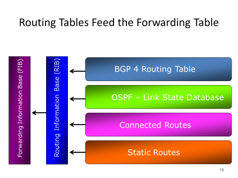
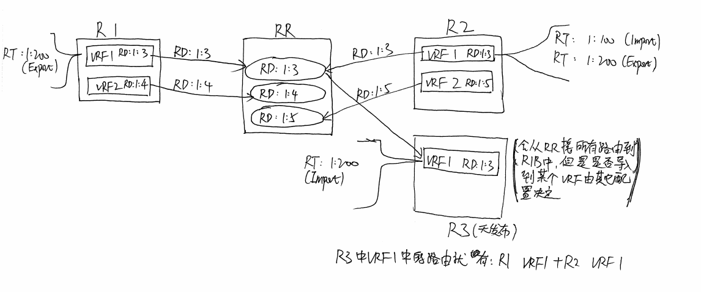

---
aliases:
- /archives/1493
categories:
- 网络基础
date: 2020-06-17 03:54:25+00:00
draft: false
title: BGP局部详解
---

以前对BGP了解不多，随着工作之后接触这玩意越来越多，再加上对EVPN的深入了解，发现BGP这东西简直是全能神，什么都能撑起来。H3C新园区（应用驱动园区）的大二层就是靠MP-BGP实现的（也就是BGP EVPN），不论是分布式EVPN还是3-stage还是5-stage的CLOS均能看到BGP的身影；在数据中心，不论是Underlay还是Overlay，也都有BGP的身影，更别说城域网了。BGP是互联网的骨架，觉得这句话形容得再合适不过了。

## 多跳与直连BGP

多跳BGP仅限于eBGP。在直连BGP的情况下，BGP信令的TTL为1，Peer只有保持接口直连并且使用该直连接口地址的情况下才能完成协商，如果配置有loopback，在本机内路由时会导致TTL减1使得BGP信令被丢弃进而无法协商。因此，只要使用loopback就一定涉及多跳BGP。

## BGP的选路原则

网上有看到13和14两类选路顺序的，第14个选路晚点单独阐述，接下来以cisco官方的文档（2016年）来看下BGP的13个选路原则：

  1. 首选Weight大的。**属于本地参数**
  2. 首选Local Preference大的。**属于IGP参数**
  3. 首选通过network或者aggregate BGP子命令或者通过IGP重分布而获得的本地路由，由network或者redistribute发出的本地路径优于aggregate-address发出的本地聚合路由。即本地通告出去（含重分布的）或者汇总后的路由，但是本地通告的优先级大于本地汇总的路由
  4. AS_Path越短优先级越高
  5. 选择最低的origin type。IGP总是要小于EGP，EGP总是小于INCOMPLETE。IGP和EGP我们都已经知道了，incomplete是指重分布进BGP的路由，即无法确定始发者的路由
  6. 多出口标识符（MED）越低优先级越高。
  7. 首选eBGP路径而非iBGP路径。如果最佳路径已经选择了，则直接跳到步骤9
  8. 首选具有最低IGP metric并且指向BGP下一跳的路径。无论是否有最佳路径，均继续向下匹配
  9. 确定BGP是否需要安装Multipath，如果还没有选择最佳路径则继续
 10. 当两条路径都是外部路径（EGP）时，选择最先受到的路径（即最老的），进而避免路由抖动。如果路由是从同一个路由器接收的或者没有最佳路径的情况下，则跳过此步骤
 11. 首选最低Router ID的BGP路由的路由
 12. 如果多个路径的Router ID相同，则首选最低Cluster list length的路径（没明白这个啥意思）
 13. 首选来自最低邻居地址的路径（即neighbor）

## BFD双向转发检测

BFD可以搭配BGP用，也可以搭配OSPF用，使用场景还是蛮多的。这东西使用UDP协议传输来进行双向探活，众所周知，BGP的收敛时间有180秒，这个时间太长了一些SLA要求高的场景下没办法保障，因此引入BFD快速探活进行路由收敛。

在BFD中，共有这些参数需要留意：

  * neighbor <a.b.c.d|x:x::x:x|word> bfd
  * detect-multiplier (2-255)，默认值为3，即当对端发送周期为300ms时，3倍时间没有收到报文即视为不可达
  * receive-interval (10-60000)，默认值为300，即每300ms向对端发送BFD报文（即接收周期）
  * transmit-interval (10-60000)，发送的周期

需要特别留意的是，BFD仅仅只会在状态从UP转为DOWN时才会强制刷新BGP状态（可以理解为重置BGP会话），从DOWN转为UP时不会采取任何操作。并且，当BGP状态被重置之后如果恢复了，BGP的会话能够独立保持连接，BFD的DOWN并不会把BGP给禁用掉。

BFD还有个echo mode，即回显模式，在这个模式下，BFD会被对端直接镜像一下回去，相当于客户端是主动发，服务端只是被动给绕回去不会主动发BFD，正常情况下两边都是主动发

## iBGP与路由反射

iBGP成员不允许向其他iBGP成员重分布路由（即只能接收来自Peer的路由但是不能再发布给其他iBGP成员），因此iBGP要求Full Mesh连接，但是设备多起来的时候这样也是玩不起的，因此多了个中间人叫做——路由反射器。

路由反射器（RR）接收所有iBGP成员的BGP通告，由于所有iBGP成员本身已经是树状连接，靠RR反射来知道下一跳到哪个iBGP成员。

## BGP路由安装流程

BGP进程 -&gt; RIB -&gt; FIB，有一个图如下：

图片出处：https://bidsarmanish.blogspot.com/2017/01/rib-vs-fib.html

路由迭代也同一样如上图，BGP/OSPF等动态路由学到的路由，会整合静态路由和直连路由一同安装进RIB，在RIB中路由进行迭代，即如下：

假设存在一条静态路由为8.8.8.8 via blockhole，那么当BGP学到一条路由为123.12.12.12 via 8.8.8.8时（假设BGP学到路由时不验证来源地址和下一跳地址），路由会在RIB中迭代出123.12.12.12 via bloackhole，然后迭代出的结果才会被安装到FIB（也即系统路由表）中，指导转发。

在FRRouting中，路由迭代完全是按照上图规范进行，因此它会表现出与上述逻辑一样的迭代效果。但是在RouterOS中，可能因为RouterOS早些时候设计时并没有考虑到这些，新增的静态路由和直连路由是直接出现在FIB中，RIB中并没有存在这些路由信息，以至于BGP学到某些路由或者通过Route Policy设置下一跳进行迭代时，始终会导致无法迭代出最终路由而导致路由无效。

## 地址族：单播与VPNv4

单播即unicast，即通告的地址是单播地址，不包含其他东西。

VPNv4地址中包含RD（Route Distinguisher）和RT（Route Target），RD和VRF绑定（一个BRF只允许有一个RD），RT是路由标识，用于标识VRF中路由的条目。具体的关系可以看下边这个图（手绘，将就一下）：

同RD的路由进入RR后会进入一张路由表，然后进行路由筛选，最优路由会反射回去到Peer（已经是最优路由的Peer不反射，如上图，假如R1中的VRF 1已经是最优路由，那么RR只会反射路由到R2的VRF1，不会再反射回R1的VRF1）。RR会接收所有的Peer的所有RD，因此RR在IGP内处于比较核心的位置，同时RR还会将整合过的所有RD通告回各个Peer，所以IGP内RR一定要有备份

每个VRF只能配置一个RD，用于标识VRF，但是RT却可以多个。RD和VRF唯一绑定，RT在VRF中标识路由，决定导出的路由带什么标记和导入哪些路由

Export Route Target: 我这个VRF发出到全局路由中的路由打上什么标记  
Import Route Target: 我这个VRF从全局路由中导入哪些标记的路由

当从全局路由表中导入路由到VRF时，包括从VRF导出路由到全局路由时，使用RT；当路由在BGP路由间发布时，可能会存在重叠，因此要对IP进行扩展（加上RD），好比来自两处BGP发布的1.1.1.1/32，但是一处RD为2000:1，一处为2000:2，因此在使用RD扩充成ipvpn4地址后就成了2000:1:1.1.1.1/32和2000:2:1.1.1.1/32，进而就没有了路由重叠的问题，路由就成了全局唯一

## BGP邻居地址与通告的下一跳地址规范

其实这个也是早期厂商实现的一个逻辑，如果发现eBGP通告的路由的下一跳地址不是BGP建立邻居的地址，会直接断开该BGP邻居。后来，这个逻辑改为不允许迭代除了直连路由外的其他路由。BGP通告时修改下一跳与本身建立邻居的地址不一致大多使用在IGP范畴，EBGP一般不推荐改下一跳</a.b.c.d|x:x::x:x|word>