---
aliases:
- /archives/161
categories:
- 网络实施
date: 2019-10-25 09:51:07+00:00
draft: false
title: 移花接木——利用隧道技术为局域网客户端分配日本IPv6地址
---

学校还没有开通IPv6，目前只有v4单栈。为了提前享受IPv6，我决定想办法把日本~~Vultr~~Linode的IPv6地址通过分割前缀的方法引入到自己的网络下面来给客户端分配。中间使用隧道连接起来即可


老规矩~


接下来开始正文~


## 简介

本文最开始使用Vultr服务器进行部署，由于Vultr给的IPv6地址都是64前缀，再加上RouterOS并不支持超长前缀，使得并没有办法实现这一操作。今天偶然发现，Linode的服务器可以通过工单索取免费的56前缀路由，因此就开了一台Linode，并成功拿到了前缀。借此来通过隧道将地址引入到自己的局域网内

不得不说，Linode的服务还是挺不错的，连续多个工单都在5分钟左右回复，此时美国时间是晚上11点左右，看起来客服是全天在线的，服务很棒。

## 第一步 – 开实例

在准备上车之前，你需要准备：

  1. 信用卡一张。大陆银联的就可以用
  2. 信用卡有足够的1美金。验证账户使用

我使用的是交通银行的信用卡，可正常通过验证并且可以正常使用。

开启第一台实例后，即可发工单索取56前缀的路由，客服会告知你/56和/64可随意切换，同时也会询问原因。合理原因即可通过，然后10分钟左右即可完成技术处理。

> <strong>me, commented 13 hours ago</strong><br/>Hello,<br/>Could you please help me to change the IPv6 prefix to 54 or 56?<br/>Thank u.<br/><br/><strong>tbaka, commented 13 hours ago</strong><br/>Hi there,<br/>I’d be happy to help you out here, but I just wanted to make sure I understand your request. Are you asking if we can change the IPv6 prefix (as in the 48 bits of the IPv6 address) to a 54 or 56? Or, are you asking if we can route a /56 IPv6 pool to your Linode?<br/>In the case of the first, the IPv6 prefixes are set in our system and we cannot make alterations to them. I apologize if this causes any inconvenience.<br/>In the case of the second, we can add a /56 pool to your Linode. In order to do so we do request some technical justification for why you require this pool. If you would like a /64 pool we can route that to your Linode with no problem.<br/>We look forward to hearing back. If you have any other questions or concerns don’t hesitate to let us know.<br/>Regards, Travis Linode Support Team<br/>Collapse<br/><br/><strong>me, commented 12 hours ago</strong><br/>Can you route a /48 pool to my Linode? Free or charge?<br/><br/><strong>mjones, commented 12 hours ago</strong><br/>Hello,<br/>We’re not able to provide a /48 pool for your Linode, but if you’d like a /56 or /64 pool let me know.<br/>If there’s anything else I can do for you or any questions I can answer please don’t hesitate to ask.<br/>Best Regards, Michael J. Linode Support<br/>Collapse<br/><br/><strong>me, commented 11 hours ago</strong><br/>Ok, route a /56 is no matter.<br/><br/><strong>tbaka, commented 11 hours ago</strong><br/>Hi there,<br/>As I mentioned previously we do require technical justification to route a /56 IPv6 to your Linode. Could you just let us know why you require this rather than the /64 pool? Just as a reminder we are able to route a /64 pool to your Linode without justification.<br/>We look forward to hearing back. If you have any other questions or concerns just let us know.<br/>Regards, Travis Linode Support Team<br/>Collapse<br/><br/><strong>me, commented 11 hours ago</strong><br/>I want to route some ipv6 address to my docker instance.<br/><br/><strong>jfeinbaum, commented 11 hours ago</strong><br/>Hey there,<br/>Thank you very much for providing that information for us, I have gone ahead and added the /56 pool for you. You can view it from your Linodes Networking page, which I have linked for you below:<br/>[my URL]<br/>Please feel free to let us know if you have any questions or need anything else, we’re always here to help you however we can.<br/>Kind Regards, Josh Linode Customer Support<br/>Collapse<br/><br/><strong>me, commented 10 hours ago</strong><br/>All my question have been resolved by you. Thanks. Very good<br/><br/><strong>jfeinbaum, commented 10 hours ago</strong><br/>Hey there,<br/>You’re very welcome! Please reach out anytime you need us again, we’re here 24/7 to help. Have a wonderful day! 🙂<br/>Kind Regards, Josh Linode Customer Support

和客服的工单

后边仔细算了算，8bit相当于1byte，那么4bit相当于1hex。因此128除以4是32，前16为前缀。因此不论如何前缀的长度一定是4的倍数，即56或者60或者64，而不可能是54。估计客服一开始看到我要54前缀可能也很懵逼吧哈哈哈

客服真的很nice。56前缀的IPv6 pool也顺利给了下来。

最幸运的，开的服务器竟然没有被墙。墙了也无所谓了反正用的专线

## 第二步 – 安装MikroTik CHR

更nice的是，Linode集成了救援功能，MikroTik CHR的镜像可以直接在救援模式下完成写入，无需其他复杂的操作。

在此之前，需要进入实例控制台完成如下操作：

  1. 关闭实例（有数据要提前备份，会清硬盘）
  2. 进入实例控制台，进入Advanced选项卡。此处分别有Configuration和Disks，首先把Disks中的所有内容全部删除，然后新建Disk，Label随便填，Filesystem选择raw，Size填最大值即可（如图1）。然后删除Configuration中的Profile，新建Profile并选择VM Mode为Full virtualization（全虚拟化），然后将Select a Kernel选为Direct Disk，/dev/sda选择我们刚刚新建的Disk，如图2，即可。
  3. 切到Rescue选项卡，/dev/sda选择我们刚刚添加的Disk后，点击Submit。如图3
  4. 点击Launch Console，进入文本控制台。使用wget下载MikroTik CHR镜像并解压，然后使用dd写入即可。由于救援系统没有集成CA，因此https访问会提示错误，需要加上额外参数忽略。具体命令如图4。执行完后reboot即可，等待几分钟即可进入RouterOS
  5. 改密码，加防火墙。

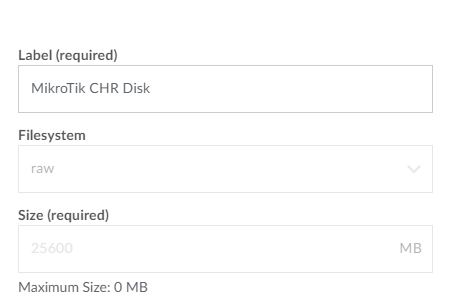
图1. 新建Disk。由于我已经新建过了，此处我点击的是Rename，因此部分值是灰色的不能修改

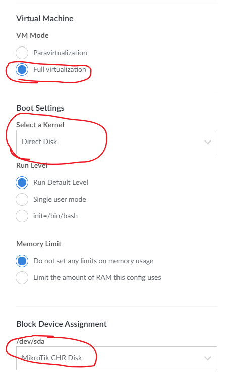
图2. 新建Profile

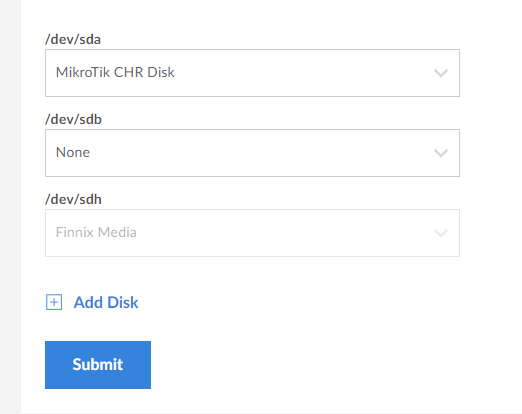
图3. 进入救援模式


图4. 安装CHR命令

目前发现Linode好像并不是很完美支持CHR运行，总是莫名其妙无法联网或者自动重启。对于这个问题，经过测试好像是由于服务提供商那边导致的，关掉Shutdown Watchdog后不要重启实例即可。详细点说，就是确保每次你启动实例时是手动Boot Profile，而不是直接系统自动启动，否则就会导致自动重启的问题。

## 第三步 – 前缀规划

一个很感人的消息是，从IPv6开始所有设备分配的IP地址都是全球唯一单播地址。因此，严格来说不再需要区分公网和私网IP。IPv4企业网中我们根据RFC1918划分企业网内部使用10.0.0.0/8或其他地址块，从企业内部、外部访问边界一台服务器分别需要设置不同的DNS记录，即对内，某个域名可能要解析到一个私网地址，对外可能要解析到一个公网地址。

那么很幸运的，从IPv6开始，企业内部只有一个全球可聚合单播前缀，企业内部网络访问可直接通过这个地址进行访问，由路由表决定路径，地址可唯一。但是坏处是，从IPv6开始，IP地址长的不是一般好记了，因此域名的AAAA记录就更不可或缺了。

由于内网规模并不是很大，因此我并没有使用OSPFv3来管理路由表（虽然IPv4使用的是）。后边如果前缀划分太多了再部署吧。

那么根据RFC4816中的规定：

> Redirect messages are sent by routers to redirect a host to a better first-hop router for a specific destination or to inform hosts that a destination is in fact a neighbor (i.e., on-link). The latter is accomplished by having the ICMP Target Address be equal to the ICMP Destination Address.
> 
> A router MUST be able to determine the link-local address for each of its neighboring routers in order to ensure that the target address in a Redirect message identifies the neighbor router by its link-local address. For static routing, this requirement implies that the next- hop router’s address should be specified using the link-local address of the router. For dynamic routing, this requirement implies that all IPv6 routing protocols must somehow exchange the link-local addresses of neighboring routers.
> 
> RFC4816, pp.73

重定向消息是由路由器发送的，在访问一个地址时用于重定向主机到一个最佳网关或者去通知主机目的地址是其实是他的邻居。通知主机目的地址是邻居是由**Target Address**和**Destination Address**相同的ICMP请求实现。对于这两个名词的解释，可以继续来看下边的引用

> – In the Target Address field: the address to which subsequent packets for the destination should be sent. If the target is a router, that router’s link-local address MUST be used. If the target is a host, the target address field MUST be set to the same value as the Destination Address field.
> 
> – In the Destination Address field: the destination address of the invoking IP packet.
> 
> RFC4816, pp.75

**所谓的Target Address范围：** 前往某个目的地址的数据包的后续的数据包发送的地址（？？？？为啥我愣是没明白这句话什么意思）。如果target是一个路由器，这个路由器的link-local地址将会被使用；如果是一个主机，target地址将会和destination相同

**所谓的Destination Address范围：** 调用这个IP数据包的目标地址（？？？？我晚点再研究一下这两个名词）

静态路由需要使用link-local地址配置，动态路由会通过一些特定方式交换邻居间link-local地址。同时，之所以使用link-local地址是因为要确保临间的重定向消息(ICMPv6)能够正常工作。因此路由配置只需要使用临间接口的link-local地址即可，而不必再像IPv4那样苦苦计算子网地址。

结合上述的内容，我将前缀做了如下的简单划分：

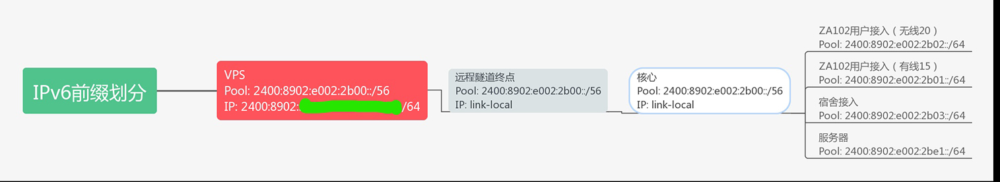
图5. 前缀划分

当然实际的v4地址块远远不仅仅这四个，目前尝鲜阶段只部署了4个区域而已。

## 第四步 – 连接聚合（小插曲）

由于我这里每个v4地址限速15M下/5M上，因此如果我想通过隧道技术实现较高速度，需要将连接进行聚合。二层是链路聚合，那么在这里的即四层的连接聚合。

总共40个IP，为了提高连接分发的效率，我在测试时一共开出了50个SSTP连接。服务端开启SSTP服务器后，内网打开50个SSTP客户端，然后下游再打开一个GRE隧道，在output chain中将GRE packet使用nth+routing mark单向分发，上游回程再使用nth+routing mark进行一次分发，即可实现连接聚合。

那么该操作的大致结构为：

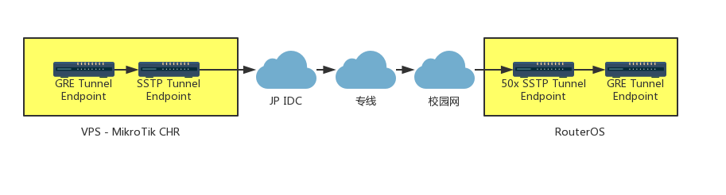
图6. 拓扑逻辑

至于为什么两端都要引入一个GRE Tunnel呢，原因时因为RouterOS目前还并不支持IPv6的mark routing，因此nth无法直接分发IPv6 packet，只能分发IPv4的packet，为了减少开销，因此此处使用GRE Tunnel（L3）是比较划算的方案。

因此，一个IPv6的数据包出去后，分别要封装上GRE的头，然后再封装上SSTP的头，往上再封装一层OpenVPN的头（专线使用），因此要考虑MTU大小。确保IPv6的MTU是能够满足层层封装而不需要分片的。至于MTU的计算方法，可以查看我之前的一篇文章。

大概实现的效果，就是如下的：


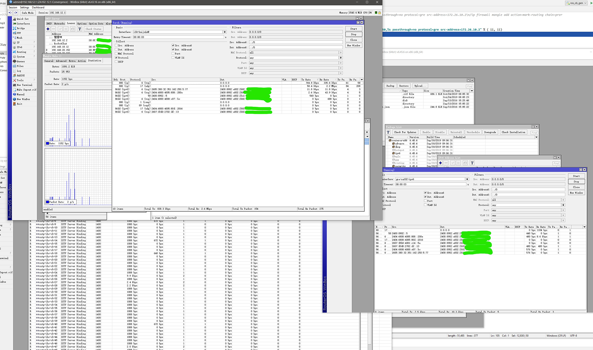
图7. 连接聚合


由于50个连接，我们不可能手动去一个一个写，因此建议使用自动化操作。此处我使用的Python生成，中间进行字符拼接即可，代码如下（随便写的，不要在意规范）：


```python
full = ""
for i in range(1, 51):
    ii = str(i)
    full = full + "\n" + "/ip firewall mangle add action=mark-routing chain=prerouting dst-address=172.29.12.1 in-interface=ether2-p2p new-routing-mark=EndPointLB-%s nth=50,%s passthrough=no protocol=gre src-address=172.26.10.2" % ( ii, ii)
pass
```


pass点上断点，运行到时将full的内容复制出来再执行即可。

## 第五步 – 配置IPv6

这部就比较简单了。

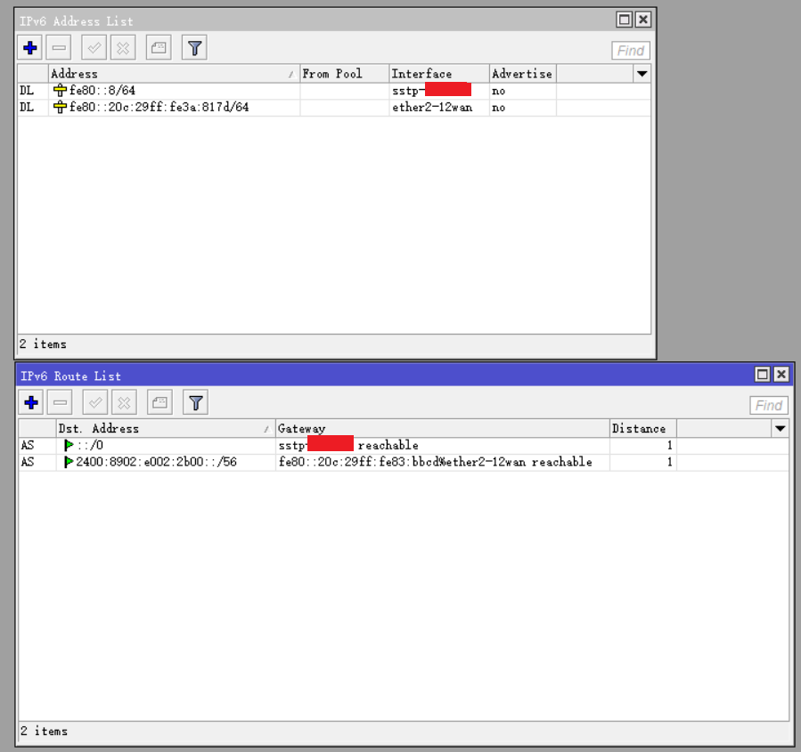
图8. Endpoint IPv6配置

隧道终点（即Endpoint）配置内容很少，只需要按照如上图大概配置一下即可。

特别提醒一点的是，根据IPv6标准，建议给客户端下发的所有IPv6地址均为/64前缀，进而可以使用EUI64同时以确保较强的安全性。

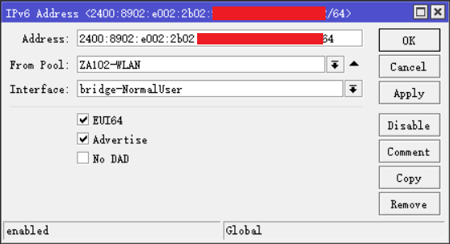
图9. 网关配置

Address中只需要填入::/64即可，From Pool选中划分的Pool（需要提前配置），选择Interface并点上EUI64后，系统会自动生成EUI64标准的地址。如果下游客户端使用SLAAC配置的情况下，可以将Advertise选中

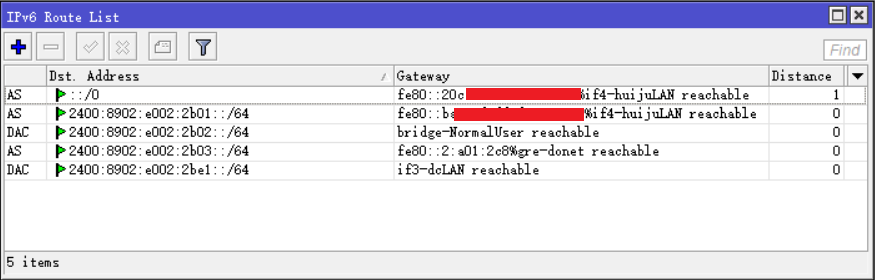
图10. 默认路由

默认路由仍然使用link-local配置，即可。

当用户接口使用SLAAC配置的情况下，需要手动配置ND（实现路由通告）。

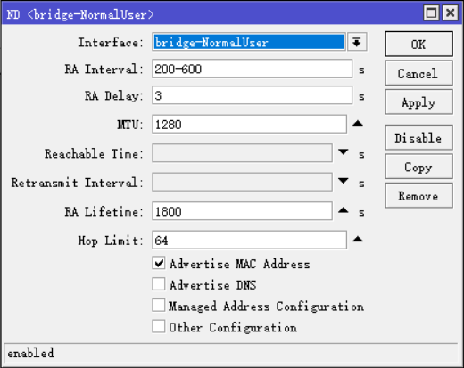
图11. 路由通告

选择接口、通告周期等，MTU需要满足IPv6的最小值1280. 因此上游隧道计算MTU时要尽可能计算好MTU，不要到最下层IPv6 MTU时比1280还小了。

最下边的四个选项分别对应的功能为：

  * 通告MAC地址
  * 通告DNS
  * 管理地址配置（不用SLAAC使用DHCPv6时打开）
  * 其他配置（不用SLAAC使用DHCPv6时打开）

## 第六步 – 测试

直接上图：

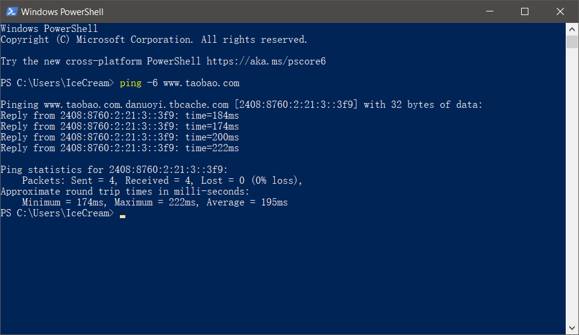
图12. ping测试

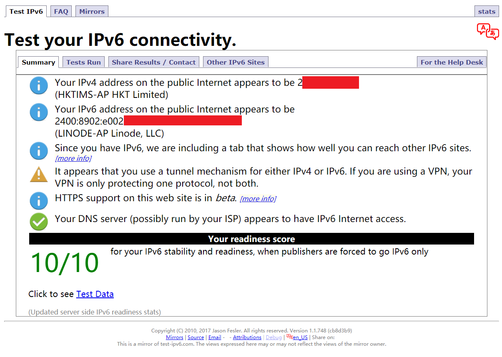
图13. IPv6访问测试

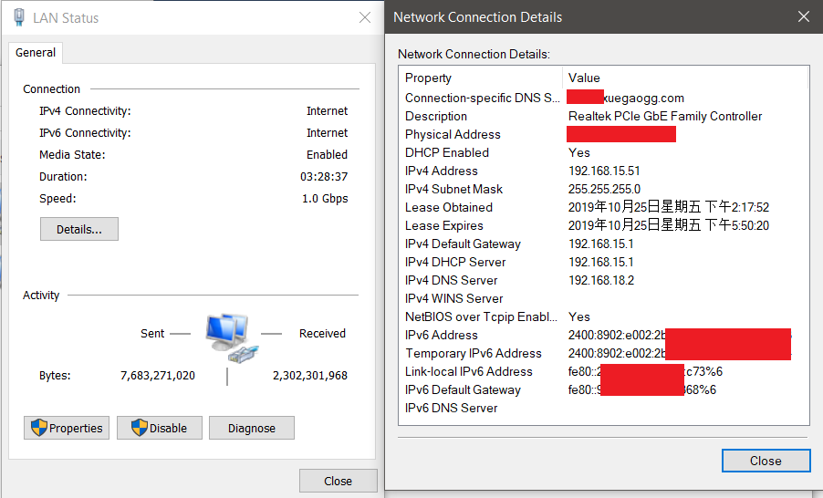
图14. 接口地址

效果如上~

## 第七步 – 额外提醒

经过我本人亲自测试，Android完全不支持DHCPv6和IPv6单栈。Android目前只支持SLAAC获取IPv6地址，同时我在测试时发现当Android设备没有获取到IPv4地址的情况下，即便获取到了v6地址，也不会成功连接上WiFi。

早在七年前就有人将这个issue提交到了Google，官方回应：“不会修复”。

看起来IPv6普及的道路还是挺漫长的。