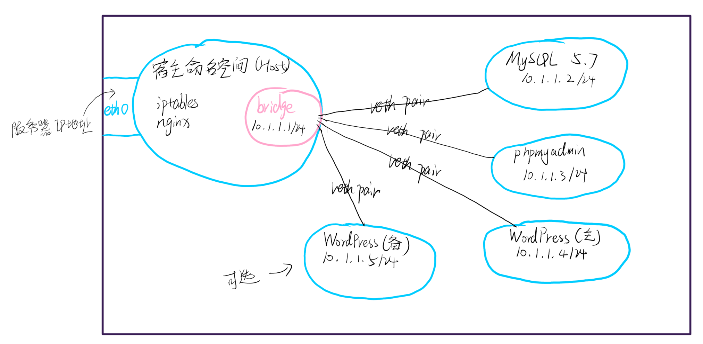
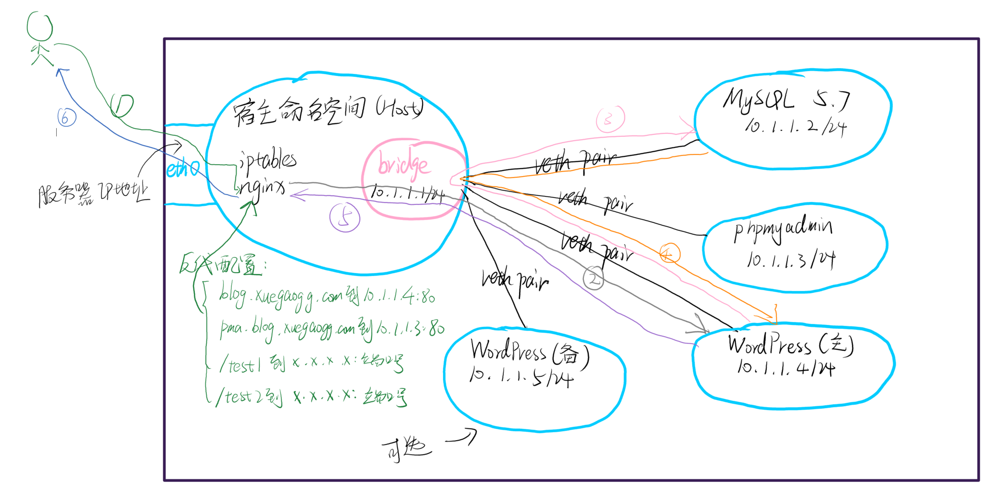

---
aliases:
- /archives/1624
categories:
- WordPress
date: 2020-12-17 10:11:31+00:00
draft: false
title: WordPress全容器部署方案实施
---

本站在2020年12月中旬进行了一次全站迁移，在本次迁移过程中有一个最主要的目的就是——全站容器化。借助容器来摆脱PHP各种CVE爆出后升级手搓编译PHP和依赖的麻烦，事实证明，全容器之后，真的不要太香。


## 为什么需要全站容器化

我再重新罗列一下全站容器化主要应对的问题：

  * 便于快速更新。众所周知，PHP经常出现CVE，每当CVE时往往都需要更新PHP，这对手工编译PHP和相关依赖的我来说无非就是雪上加霜。使用容器化部署，每次爆出CVE即可无感知升级，即WordPress容器同时启动两个，借助nginx反向代理和负载均衡，双WP节点任意更新一个不影响全站访问，可以实现无感知升级。最不济的，脚本快速删除重建新容器也仅仅只需要3秒不到。
  * 安全。上边能够实现快速更新已经算是保障安全了，但是结合容器化的情况下，故障域可以进一步再缩小（前提是容器为普通容器而非特权容器）。
  * 扩展性得到了提升。按照下边所提及的方案部署，众多容器可以散开履行各自的职责，同时各个单元可以随意扩展，无非就是最后经过宿主的nginx反向代理一下而已。这样一个结构也非常符合生产系统中的API网关，可以在统一一个出入口上做审计、限流和加密（HTTPS），内部即为明文，即可直接旁挂防火墙进行包过滤。

## 系统架构图

整体架构大致如下：<figure class="wp-block-image size-large">


 </figure> 

其中，紫色框即代表该服务器，蓝色框是独立的网络命名空间，粉色框即虚拟网络设备（这里是bridge）。在这个架构图里，宿主网络命名空间只安装了nginx和iptables，iptables主要用于防护，借助状态防火墙拦截掉无需开启的端口；nginx则是充当网关，所有服务均需要经过nginx网关才能进入后侧的容器中。在这里，nginx配置反向代理和HTTP请求头验证，也可能会加入HTTPS和HSTS，所有的请求在nginx之前都将会是加密的，在过nginx之后到后边的容器时，将会成为明文，因此在园区里这样部署，刚好可以在中间加一个应用防火墙。在容器里这样部署，在WordPress双容器的情况下，可以实现完全无感知的容器升级。

在这样一个系统架构里，我们一同来看看他的流路径：<figure class="wp-block-image size-large">


 </figure> 

在这样一个架构中，假设用户需要访问我的博客，他会先发出请求（如图中路径1）到我的服务器中，在这个过程中会经过iptables进行过滤，符合所设置规则的才会放行进来（当然中间实际上还是有CDN和其他一些东西的，此处先不考虑了），在路径1中数据包全程HTTPS加密。紧接着，由于nginx设置了到blog.xuegaogg.com的域名反代到10.1.1.4:80，因此nginx会把请求再转发到WordPress（主），这条路径中是没有加密的，请求将会明文传输，如图路径2。紧接着，WordPress（主）收到了访问请求，然后需要查数据库，因此如路径3，MySQL请求经过宿主的bridge进入到MySQL 5.7这个容器中。然后，MySQL 5.7要讲查询结果返回给WordPress（主），因此响应数据经过路径4回去到WordPress（主），在该容器中的PHP处理完成后，再通过路径5回到宿主的Nginx中。最终，再由nginx封装HTTPS等再重新发出（如图中路径6）回到用户侧。

在nginx中，可以根据请求的域名或者URL，来指定反向代理到何方，因此不仅仅可以代理这一个博客，其他应用或者API同理。

在整个路径中，路径1和6（即nginx左侧）均为外部访问，路径2,、3、4、5（即nginx右侧）均为内部代理。外部访问均为HTTPS加密，内部访问均为HTTP明文（MySQL查询也是明文）。在路径2中，nginx将反代请求封装为（源IP：10.1.1.1，目标IP：10.1.1.4），经过bridge二层转发到各个bridge中，各个容器互通也是通过bridge（即二层网络）来通信。

需要特别留意的是，WordPress需要进行插件安装等联网操作，因此需要将Linux的ipv4_forward转发打开，同时需要在iptables上加一条NAT规则，否则WordPress容器无法访问到互联网。

## 操作指南

按照惯例，配置一定不是完整的，贴出来的部分只是参考，更多内容请自行查阅官方文档。

### 前置操作

  * 放开Linux文件描述符限制
  * 关闭默认的docker bridge
  * 宿主安装nginx的repo并安装nginx-stable（主线也可以）
  * 禁用NetworkManager并配置原生network.service
  * 关闭不常用的服务
  * 调整部分Linux内核参数（下文有提及）
  * 关闭系统中的swap交换
  * 准备Apache2的配置文件，php支持现成安全的情况下建议使用worker/event作为并发管理驱动，如果不支持建议使用prefork，但是参数需要微调（调整到多少需要参考基准测试）
  * 等等等等

### 新增Docker Bridge

```
docker network create \
  --driver=bridge \
  --subnet=10.1.1.0/24 \
  --gateway=10.1.1.1 \
  -o "com.docker.network.bridge.name"="br0" \
  -o "com.docker.network.driver.mtu"=8192\
  br0

```


### 启动数据库

数据库的配置和数据文件是外挂出来的，因此本处的MYSQL_ROOT_PASSWORD只会在第一次启动时有效，后续更新容器时操作是无效的。注意不要乱改配置文件，尤其是数据目录，一定要和挂载点一致。

同时，由于数据和配置文件已经挂出来了，容器相当于成了一个壳，借此才可以实现了快速滚动更新。因此，在run容器之前，务必需要提前在所挂载的配置路径中放好配置文件，否则可能会造成启动失败。

注意文件权限。


```
docker run \
    --restart=always --name mysql -it \
    -v /data/mysql-data:/var/lib/mysql \
    -e MYSQL_ROOT_PASSWORD="数据库root密码" \
    --network br0 --ip 10.1.1.2 \
    -v /data/mysql-config:/etc/mysql \
    -d mysql:5 \
    --character-set-server=utf8mb4 --collation-server=utf8mb4_unicode_ci
```


### 启动phpmyadmin

```
docker run \
    --restart=always --name phpmyadmin -it -d \
    -e PMA_HOST=10.1.1.2 \
    -e UPLOAD_LIMIT=128M \
    --network br0 --ip 10.1.1.3 phpmyadmin
```


### 启动WordPress

WordPress同样也是挂载出来的，数据目录和配置目录全部外挂。因此，也需要提前准备好apache2的配置文件，否则会造成无法启动。数据目录需要注意权限，以避免WP出现奇奇怪怪的问题。


```
docker run \
    -it -d --restart=always --name wordpress --restart=always \
    --ip 10.1.1.4 \
    --network br0 \
    -v /data/wordpress-data:/var/www/html \
    -v /data/wordpress-config:/etc/apache2 \
    wordpress:latest
```


### 参考iptables规则

```
*filter
:INPUT ACCEPT [0:0]
:FORWARD ACCEPT [50403:17557739]
:OUTPUT ACCEPT [415401:495038116]
-A INPUT -m state --state RELATED,ESTABLISHED -j ACCEPT
-A INPUT -p icmp -j ACCEPT
-A INPUT -i lo -j ACCEPT

# 状态防火墙，放行指定端口
-A INPUT -p tcp -m state --state NEW -m tcp --dport 指定端口号 -j ACCEPT

-A INPUT -j REJECT --reject-with icmp-host-prohibited
COMMIT

*nat
:PREROUTING ACCEPT [74279:3440224]
:INPUT ACCEPT [67756:3065080]
:POSTROUTING ACCEPT [9603:576180]
:OUTPUT ACCEPT [20038:1318964]
# 打开SNAT
-A POSTROUTING -o eth0 -j MASQUERADE
COMMIT

```


### 参考sysctl.conf

**注意：**绝大多数的配置均需要结合实际的环境（好比机器配置）进行额外修改。直接复制粘贴可能会造成一些机器运行时死机。


```
net.ipv4.ip_forward = 1

net.ipv4.conf.default.rp_filter = 1

net.ipv4.conf.default.accept_source_route = 0
kernel.core_uses_pid = 1
net.ipv4.tcp_syncookies = 1
kernel.msgmnb = 65536
kernel.msgmax = 65536
net.ipv4.conf.all.promote_secondaries = 1
net.ipv4.conf.default.promote_secondaries = 1
net.ipv6.neigh.default.gc_thresh3 = 4096
net.ipv4.neigh.default.gc_thresh3 = 4096
kernel.softlockup_panic = 1
kernel.sysrq = 1
net.ipv6.conf.all.disable_ipv6=1
net.ipv6.conf.default.disable_ipv6=1
net.ipv6.conf.lo.disable_ipv6=1
kernel.shmmax = 68719476736
kernel.printk = 5

fs.file-max = 65536
vm.swappiness = 0

net.core.default_qdisc=fq
net.ipv4.tcp_congestion_control=bbr

```


### 参考nginx.conf

**注意：**在docker环境中log的位置实际上都是链接了stdout或者stderr，日志输出位置建议不要乱改，免得造成容器内日志积压。


```
user  nginx;
worker_processes  2;

error_log  /var/log/nginx/error.log warn;
pid        /var/run/nginx.pid;

events {
    worker_connections  1024;
    use epoll;
    multi_accept on;
    accept_mutex on;
}


http {
    include       /etc/nginx/mime.types;
    default_type  application/octet-stream;

    include /etc/nginx/conf.d/*.conf;

    log_format main       '$remote_addr - '
                                '$http_x_forwarded_for - '
                                '$remote_user, '
                                '[$time_local], '
                                '"$request" $status $body_bytes_sent '
                                '"$http_referer" "$http_user_agent" "$gzip_ratio"';

    access_log  /var/log/nginx/access.log  main;

    server_names_hash_bucket_size 128;
    client_header_buffer_size 32k;
    large_client_header_buffers 4 32k;
    client_max_body_size 128m;

    sendfile on;
    sendfile_max_chunk 512k;
    tcp_nopush on;

    keepalive_timeout 60;

    tcp_nodelay on;

    fastcgi_connect_timeout 300;
    fastcgi_send_timeout 300;
    fastcgi_read_timeout 300;
    fastcgi_buffer_size 64k;
    fastcgi_buffers 4 64k;
    fastcgi_busy_buffers_size 128k;
    fastcgi_temp_file_write_size 256k;

    gzip on;
    gzip_min_length  1k;
    gzip_buffers     4 16k;
    gzip_http_version 1.1;
    gzip_comp_level 2;
    gzip_types     text/plain application/javascript application/x-javascript text/javascript text/css application/xml application/xml+rss;
    gzip_vary on;
    gzip_proxied   expired no-cache no-store private auth;
    gzip_disable   "MSIE [1-6]\.";

    server_tokens off;
    access_log off;

}

```


### 参考nginx单个server配置

```
server {
    listen       端口号 ssl http2;
    server_name  IP地址或者域名;

    ssl_certificate 证书位置;
    ssl_certificate_key 私钥位置;
    ssl_session_timeout 5m;
    ssl_protocols TLSv1.2 TLSv1.3;
    ssl_prefer_server_ciphers on;
    ssl_ciphers "EECDH+AESGCM:EDH+AESGCM";
    ssl_session_cache builtin:1000 shared:SSL:10m;
    ssl_dhparam /etc/nginx/dhparam.pem; # DH算法文件
    ssl_client_certificate 根证书位置;

    location /
    {
        if ( 一些安全规则，不用可以删掉 ) {
            return 404;
        }
        proxy_pass http://10.1.1.4:80/;
        include proxy.conf; # 引入的这个文件自行去nginx官网文档找吧，需要改动一些配置
    }
}

```


同理，phpmyadmin可以结合nginx官方文档自行实现反向代理，此处就不再贴了。

## 如何一键更新

大致讲一下逻辑吧，即：

  * pull一下镜像，更新到最新
  * 使用原始命令新开一个容器，验证原本的配置能否正常启动。如果可以正常使用，则直接执行下一步，否则需要去查Changelog找变更的内容
  * 双容器可以直接stop掉一个容器并创建新容器，单容器最好使用脚本，即stop-&gt;rm-&gt;run，一般都能在5秒内完成重建和启动
  * 然后验证升级是否成功，即可

具体命令就不贴了。这样一个全容器部署的WP，即便是每个月都有CVE，更新php乃至数据库也只需要非常短暂的停机时间，几乎可以说不影响业务的同时无缝完成升级，简直不要太香。

早上早享受。