---
aliases:
- /archives/163
categories:
- 网络实施
date: 2019-06-20 09:23:01+00:00
draft: false
title: 移花接木——利用UPnP和SSTP实现局域网对公映射
---

IPv4使用NAT和CIDR无分类域间路由来实现IPv4地址复用，缓解IP不足的情况。客户端无法使用UPnP协议， 按照ed2k的策略，用户只有共享得越多，下载得速度才能越快，这使得ed2k和bt下载会非常慢。但是在NAT的情况下，客户端访问公网使用NAT，其中网关通过维护连接跟踪表实现从内向外的主动连接，但是从外向内只能通过端口映射或者DMZ解决。在无法获得防火墙管理权限的情况下，如果想实现对公映射，可以使用SSTP来解决。

## 前提

  1. 你需要有一个拥有公网IP的服务器，此处我开了一台日本的Vultr，5美元一个月，还算划算。
  2. 拥有公网IP的服务器操作系统需要能够配置SSTP。此处我把Vultr安装成了MikroTik Router CHR，买了P1的授权。虽然用Linux也可以实现，但是配置和后期管理起来会麻烦一些。
  3. 局域网内的拓扑支持并入这个特性。
  4. 客户端和服务器的性能都足够。由于SSTP开销较大，建议使用x86的硬件来跑。

## 在Vultr上安装RouterOS CHR

  1. 前往SystemRescueCD官网找到live ISO 的版本的下载链接
  2. 提交到Vultr的ISO去，Vultr会自动帮你下载。如下图
  3. 启动系统
  4. 下载chr的RAW镜像
  5. 在得到chr-6.43.16.img.zip后，在系统中将其解压并写入磁盘，使用**dd if= chr-6.43.16.img of=/dev/vda**
  6. 完成后重启，即可使用WinBox进入CHR（默认会启动DHCP Client并添加默认路由）

## 配置SSTP

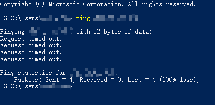
 </figure> 

比较悲惨的是，我买到的这台机器IP被封了，连ICMP都不通，日。只能把SSTP走到科学通道里去了，也就多绕一下，没办法。科学这个过程就省略了，晚点有空再单独提

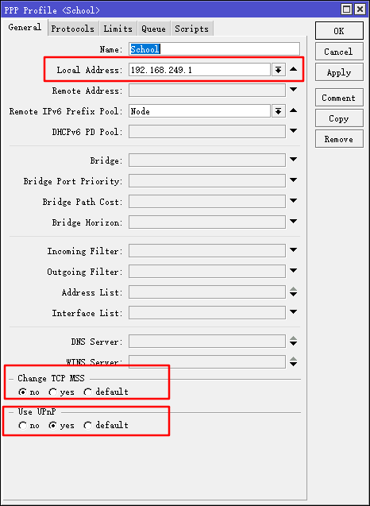

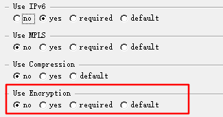

如上边两张图，此处的Local Address指SSTP Server在隧道一侧的地址，此处我关闭了TCP MSS，加密也关掉了。因为已经在隧道了封装一层了，没必要再封装一层加密。同时，建议勾选只允许一个Session，以确保路由不会出现什么问题。

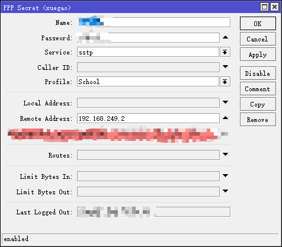

如上图，要对这个用户指定IP地址，避免出现什么问题。

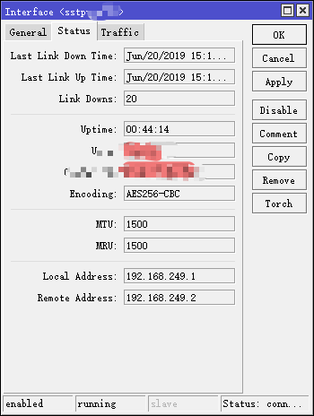

如上图，建议添加Server Binding，添加DNAT时用，确保不会出什么问题。

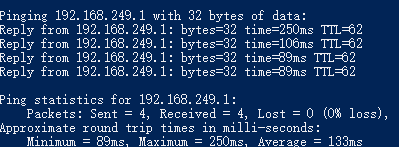

如上图，ping隧道另一侧，已经通了，延迟有点感人，这也没办法。

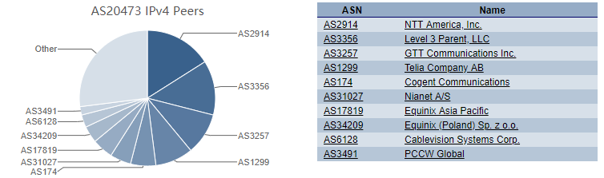

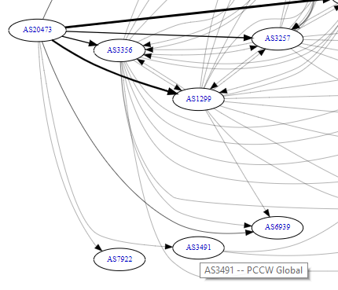

Choopa和PCCW好歹是BGP邻居，网络质量应该也不会太差。

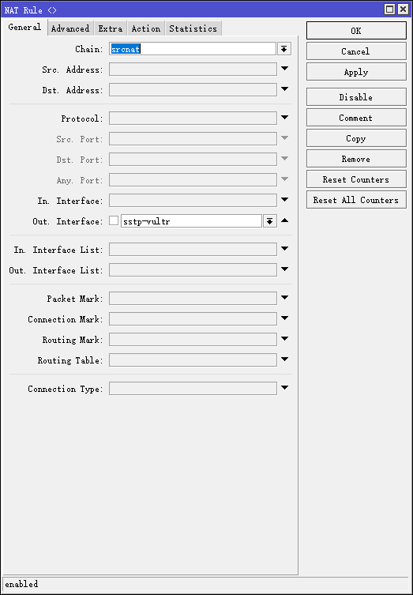

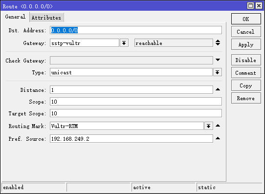

讲个题外话。 如上图 ，紧接着客户端使用SSTP进行连接，然后加一层NAT，此处加NAT是为了UPnP能够正常使用，以及由于UPnP只能一层不能跨路由，因此上游还要加DNAT，这个下面会讲。同时要在客户端（汇聚）添加一个路由标记，用于策略路由使用。

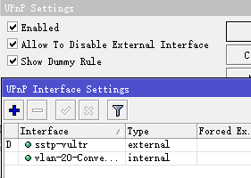

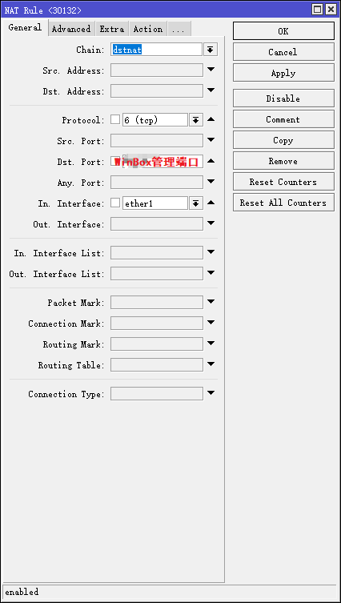

如上图，把客户端的UPnP打开，同时添加接口，sstp是对外，因此sstp接口应当配置为external，vlan20是汇聚接口，因此要选择为内部

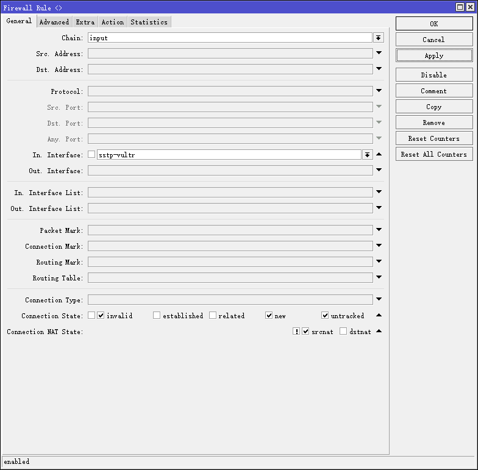

如上图，为了安全起见，在进行完整DNAT后（即DMZ），内网的交换机相当于直接暴露在公网。为了避免出事，要加一条防火墙规则，过滤掉不是本地NAT出去的新建连接握手和在连接跟踪表里没有记录的流量。由于NAT表在Filter表前，因此当UPnP规则生效时，不会产生问题。但是务必要注意规则顺序，WinBox的nat规则要在DNAT的规则前

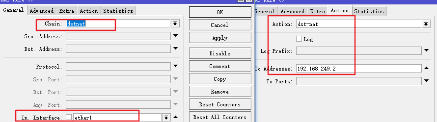

上图规则即添加全局DNAT指向内网的RouterOS，当然我把WinBox的dnat流量已经提前进行了ACCEPT，所以WinBox管理不会中断。**同时，千万别忘了NAT里ACCEPT掉SSTP的流量！不然连接断开后下次就连不上了！**

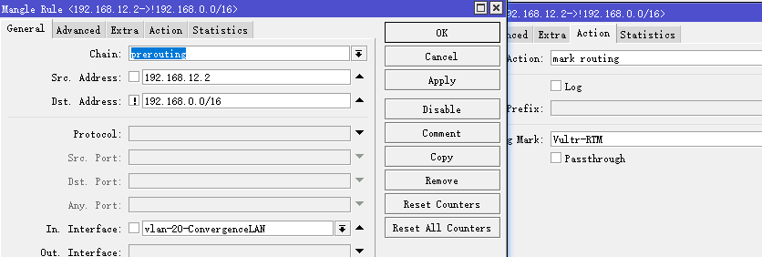

如上图，我只对一台测试的机器开放了这个路由。此时，就可以拿这台测试的虚拟机来下东西试试了

## 结果

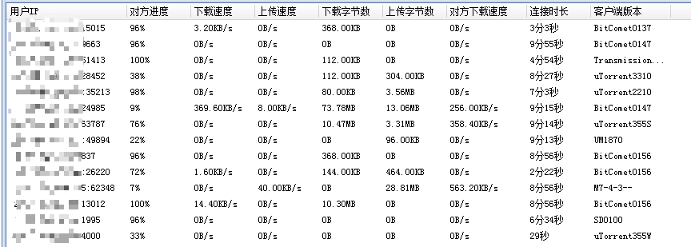

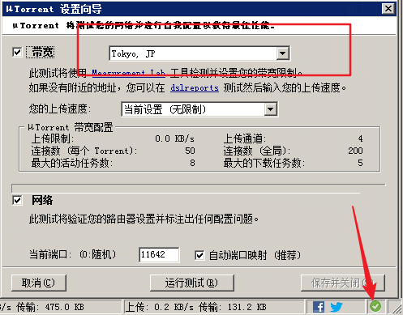

此时我们可以看到，BT下载已经可以正常下动了，同时做种都很正常。

UPnP能用后，BT下载首先时能下载了，其次速度也快了很多。群众的力量的伟大的😂

好了，本次就先写到这里~