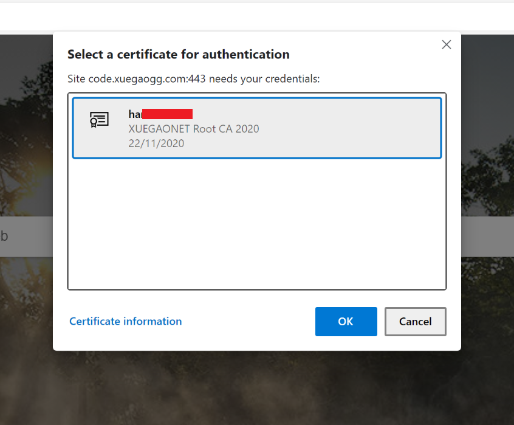
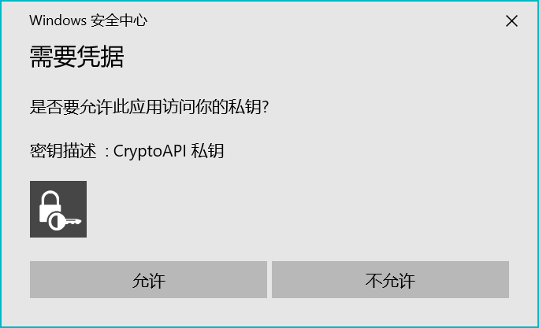
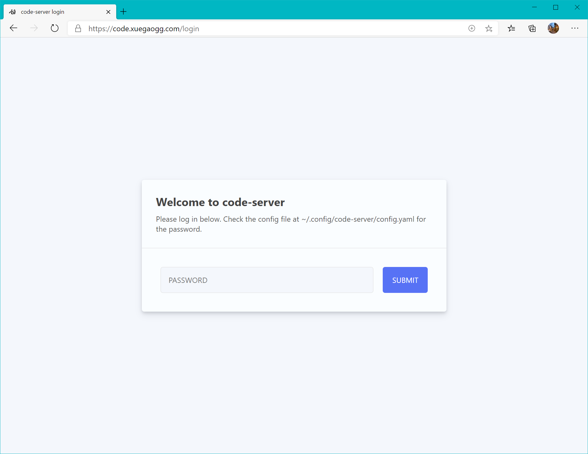
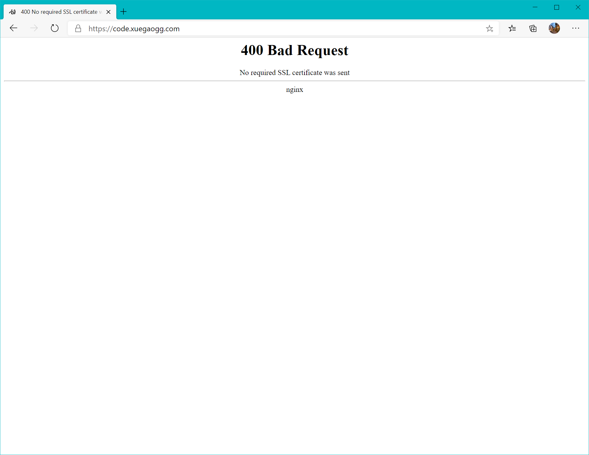
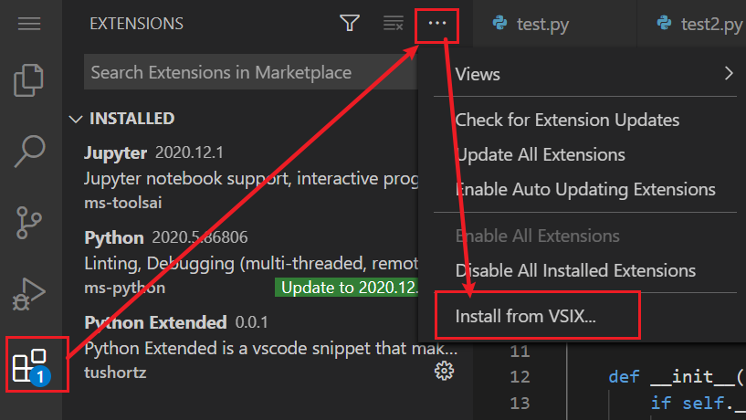
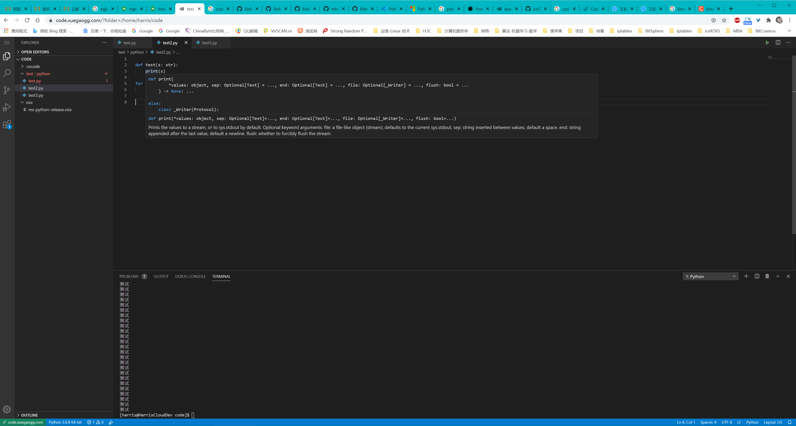
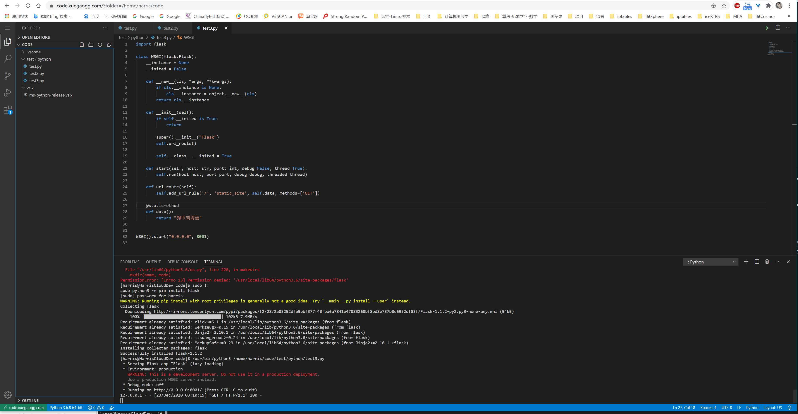
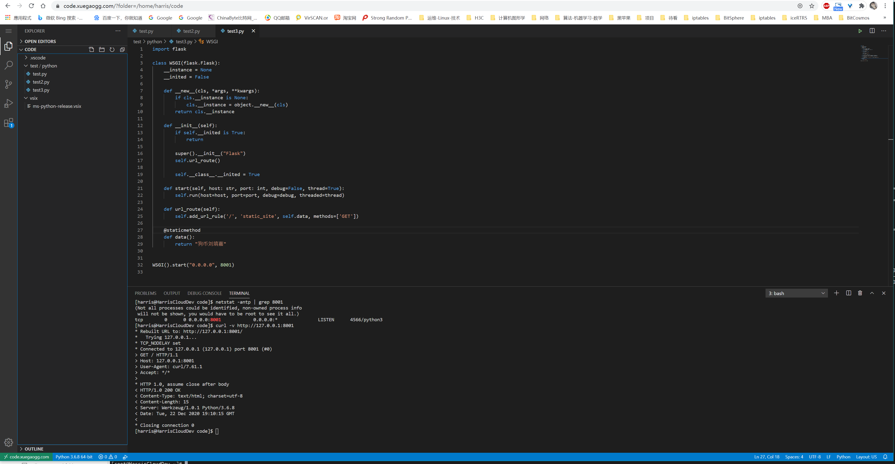

---
aliases:
- /archives/1632
categories:
- Linux
date: 2020-12-23 07:26:35+00:00
draft: false
title: 云上搬砖——Code Server落地实践
---

如今2020年了，甚至都可以说2021年了，在行业一直推行“上云”的这一背景下，越来越多的企业服务开始从私有云转移到了公有云上。在企业纷纷上云提高自身效率的同时，我也一直在想有什么办法来提高个人的开发效率呢？写个代码一直都强调高内聚低耦合，我们的生产力工具和开发系统本来也就要进行解耦，以避免掉太多对终端设备的依赖，来应对突发状况下或者一些特殊的环境依赖需要。今天，无意中发现了一个新的东西——Code Server，即一个VS Code的网页端，也是一个开源软件，借助Code Server，终于有了一个完全托管于云上、无需再过多依赖本地终端的环境。


当然，Code Server现在刚刚上线还没几天，因此暂且不评价是否真正能和本地端IDE媲美，受到网络延迟影响，在线的IDE一定会相对本地端IDE有一定的延迟，但是初步使用，其已经能够满足绝大多数需要，是个非常棒的云上生产工具。


## 服务器选型

初步评估我并不会在云上开发大型系统，因此只需要单机1C/2G即可满足需要，再加上对存储容量要求并不高，27块钱3个月的腾讯云轻量（广州）刚好够用，5M的带宽自己一个人用刚好足够（1M应该不行，所以建议别买1M的机器了）。当然，此处并非打广告，所以你也可以去买阿里云，价钱应该都一样。

只是，非常蛋疼的，受制于国内网络环境的问题，买国内的服务器，安装一些插件时（没有镜像），能足足等上一个小时，妈的。买香港的轻量到国内又各种丢包限流，能不能稳定使用都是个问题。

不过大多数的依赖问题，国内都是有镜像的，最起码能用还是可以满足的，其他的等个一晚上应该还是可以下完的。或者你也可以去买全球加速的CDN，支持WebSocket的那种，就可以把整个IDE全部从海外代回国内来了，只是成本也不低，而且不支持SSL客户端认证。

## 前期准备

在选型服务器之后，接下来要考虑怎么部署了。

在安全方面，由于这个在线的IDE也只是个人使用，因此使用SSL客户端认证是个比较不错的解决方案，使用nginx反向代理Code Server并且打开WebSocket代理即可。本着安全的态度，端口能不开就不开，因此我也只是开了一个SSH端口又开了一个HTTPS的端口而已，并且SSH是只有在需要时才会通过腾讯云的防火墙放。毕竟，Code Server已经有一个不错的Web Terminal了。

在运维方面，本着安全、可扩展的初衷，选用了nginx做网关、直装Code Server到宿主。不选择使用容器是考虑到，开发调试会涉及内核API操作，没有并且也不可能会有使用容器安装Code Server的需要。

如下操作均在CentOS 8上完成，其他系统并未测试。

## 服务器初步配置

众所周知，国内的云服务商很喜欢多此一举在服务器上安装一些奇奇怪怪的东西。虽然官方宣传上来看，确实是为了用户着想为了用户安全考虑，但是这些奇奇怪怪的东西确实真的是会泄露一些服务器的数据出去（好比进程信息等），从v2ex等论坛上我们可以看到大批因为没有卸载这些奇奇怪怪的东西，同时使用服务器fq，进而导致了用户被警告甚至服务器被查封。当然此处我不是用来fq的，只是说，这东西确实有存在数据泄露的风险。

个人觉得，即便是云服务提供商，也要在用户知情、可选择的情况下提供相应的服务，而不是一刀切全部预安装这些奇奇怪怪的侵入式程序。

拿到服务器的第一步，就是先打开SSH，并且禁用掉Lighthouse的网页终端。


```
# 编辑SSH服务配置
vim /etc/ssh/sshd_config
# 重启SSH服务（daemon）
systemctl restart sshd.service

# 删除预置的Lighthouse用户和用户目录（里边有SSH密钥对，安全起见要删除）
userdel lighthouse
rm -rf /home/lighthouse

# 卸载所有腾讯云的服务
/usr/local/qcloud/stargate/admin/uninstall.sh
/usr/local/qcloud/YunJing/uninst.sh
/usr/local/qcloud/monitor/barad/admin/uninstall.sh
cd /usr/local
rm -rf qcloud
rm -rf yd.socket.server
systemctl daemon-reload

# 关闭grub中对串口的输出
vim /etc/default/grub

# 禁用掉没用的服务
# 以下服务是根据实际需要进行禁用，请不要无脑复制粘贴
# 禁用cloud-init前建议提前进行静态地址配置
systemctl disable cloud-init
systemctl disable cloud-final.service
systemctl disable cloud-config.service
systemctl disable cloud-init-local.service
systemctl disable kdump.service
systemctl disable dnf-makecache.timer
systemctl disable iscsi-onboot.service
systemctl disable iscsi.service
systemctl disable iscsiuio.socket
systemctl disable lvm2-lvmpolld.socket
systemctl disable lvm2-monitor.service
systemctl disable qcloud-srv.service

# 安装常用软件
# NetworkManager习惯用于配置生成，一般生成完配置之后就禁用掉并且换成network-scripts了
dnf remove firewalld -y
dnf install iptables-services ipset -y
dnf install vim wget tmux bash-comp* net-tools iproute nano bind-utils traceroute NetworkManager-tui -y

# 修改iptables的规则
vim /etc/sysconfig/iptables

# 安装根证书
# 该步骤是我自己的CA，需要根据实际情况安装自己的CA。没有CA需要自行使用cfssl进行签发，否则后续无法发起客户端认证
# 自签发CA需要安装到自己设备，否则客户端会报不信任
# 请勿无脑复制粘贴
wget https://mirror.xuegaogg.com/xuegaonet/cert/XUEGAONET-CA.pem -O /tmp/XUEGAONET-CA.pem
mv /tmp/XUEGAONET-CA.pem /etc/pki/ca-trust/source/anchors/ -f
update-ca-trust

# 安装network-script
yum install network-scripts

# 请确保已经使用NetworkManager完成配置生成再执行此处命令
systemctl enable --now network
systemctl disable --now NetworkManager

# 修改内核操作
vim /etc/sysctl.conf

# 放开文件描述符限制
cat &gt; /etc/security/limits.conf &lt;&lt; EOF
* soft     nproc          65535
* hard     nproc          65535
* soft     nofile         65535
* hard     nofile         65535
EOF

# 更新内核到主线支持
yum install elrepo-release epel-release
yum --enablerepo=elrepo-kernel install kernel-ml

# 生成新的grub配置
grub2-mkconfig -o /boot/grub2/grub.cfg


```


上述内容共拆解为如下几步：

  * 修改SSH配置
  * 删除Lighthouse预置用户
  * 删除腾讯云的某些奇奇怪怪的服务
  * 关闭Grub中串口输出
  * 禁用掉没用的服务
  * 安装常用软件
  * 安装根证书（我自己的CA）
  * 配置内核参数
  * 更新内核

### 修改SSH配置

修改SSH配置主要是为了修改默认的端口，以避免大规模暴力破解时能不被扫到，其次腾讯云轻量默认禁用了SSH服务（不允许密码连接），因此要手动打开，其次要再调整一些配置。以下配置仅供参考，需要结合实际环境做出一些调整。


```
Port &lt;端口号&gt;
ListenAddress &lt;监听地址&gt;
HostKey /etc/ssh/ssh_host_rsa_key
HostKey /etc/ssh/ssh_host_ecdsa_key
HostKey /etc/ssh/ssh_host_ed25519_key
SyslogFacility AUTHPRIV

# 根据实际需要决定是否需要开启
PermitRootLogin no

MaxAuthTries &lt;最大重试次数&gt;
MaxSessions &lt;最大会话数&gt;
AuthorizedKeysFile .ssh/authorized_keys
PasswordAuthentication yes
ChallengeResponseAuthentication no
GSSAPIAuthentication yes
GSSAPICleanupCredentials no
UsePAM yes

# 关闭各种转发
AllowAgentForwarding no
AllowTcpForwarding no
X11Forwarding no

PrintMotd no
TCPKeepAlive yes
UseDNS no
PermitTunnel no
AcceptEnv LANG LC_CTYPE LC_NUMERIC LC_TIME LC_COLLATE LC_MONETARY LC_MESSAGES
AcceptEnv LC_PAPER LC_NAME LC_ADDRESS LC_TELEPHONE LC_MEASUREMENT
AcceptEnv LC_IDENTIFICATION LC_ALL LANGUAGE
AcceptEnv XMODIFIERS
Subsystem sftp  /usr/libexec/openssh/sftp-server

# 限定特定的用户
AllowUsers &lt;用户名&gt;

```


### 关闭Grub中串口输出

默认的配置中会有serial的内容，启动的日志（包括login）会通过serial进行输出（或者输入）。这可能会导致未经授权的访问，因此建议禁用。直接修改/etc/default/grub即可，具体修改内容参考如下：


```
# 等待时间
GRUB_TIMEOUT=1
GRUB_DISTRIBUTOR="$(sed 's, release .*$,,g' /etc/system-release)"
# 启动内核默认选项，一般习惯设置成0
GRUB_DEFAULT=0
GRUB_DISABLE_SUBMENU=true

# 下边两个原始配置中会有一个serial，需要删除
GRUB_TERMINAL="console"
GRUB_TERMINAL_OUTPUT="console"

# 原始配置中有一个serial的参数，需要删除
GRUB_CMDLINE_LINUX="crashkernel=auto console=ttyS0 console=tty0 panic=5 net.ifnames=0 biosdevname=0 intel_idle.max_cstate=1 intel_pstate=disable"
GRUB_DISABLE_RECOVERY="true"
GRUB_ENABLE_BLSCFG=true


```


### 配置内核参数

对比官方的配置，做出了少部分改动，具体参考如下


```
# 禁用IPv6，暂且用不上
net.ipv6.conf.all.disable_ipv6=1
net.ipv6.conf.default.disable_ipv6=1
net.ipv6.conf.lo.disable_ipv6=1

# 放开文件描述符限制
fs.file-max = 65536
# 调整swap，当然也可以直接设置成0
# 一定记得结合实际内存大小设置
# 无脑复制粘贴可能会造成重大后果
vm.swappiness = 1

# 调整TCP重传算法
net.core.default_qdisc=fq
net.ipv4.tcp_congestion_control=bbr

```


## 安装配置Code Server

此处开始安装Code Server，详细文档请参考官方所述：https://github.com/cdr/code-server/blob/v3.8.0/doc/install.md


```
# 下载并安装
curl -fOL https://github.com/cdr/code-server/releases/download/v3.8.0/code-server-3.8.0-amd64.rpm
dnf install ./code-server-3.8.0-amd64.rpm

# 新增开发用户
useradd harris
# 此处我并没有使用官方的systemd service
# 请注意区别
# service文件见下方
vim /etc/systemd/system/code-server.service

# 生成配置文件
# 路径需要根据自身变化进行更正
mkdir /home/harris/.config/code-server -p
cat &gt; /home/harris/.config/code-server/config.yaml
 &lt;&lt; EOF
bind-addr: 127.0.0.1:9999
auth: password
password: &lt;设置的密码&gt;
cert: false
EOF
chown harris:harris /home/harris -R

# 重载并启动服务
systemctl daemon-reload
systemctl enable --now code-server
.service

```


参考的systemd service配置：


```
[Unit]
Description=code-server
After=network.target

[Service]
Type=exec
ExecStart=/usr/bin/code-server --bind-addr 127.0.0.1:9999
Restart=always
User=harris

[Install]
WantedBy=default.target
```


## 安装nginx

```
yum install yum-utils

# 安装repo
cat &gt; /etc/yum.repos.d/nginx.repo
 &lt;&lt; EOF
[nginx-stable]
name=nginx stable repo
baseurl=http://nginx.org/packages/centos/$releasever/$basearch/
gpgcheck=1
enabled=1
gpgkey=https://nginx.org/keys/nginx_signing.key
module_hotfixes=true
[nginx-mainline]
name=nginx mainline repo
baseurl=http://nginx.org/packages/mainline/centos/$releasever/$basearch/
gpgcheck=1
enabled=0
gpgkey=https://nginx.org/keys/nginx_signing.key
module_hotfixes=true
EOF

# 安装nginx stable
dnf makecache
yum-config-manager --enable nginx-stable
yum install nginx

# 生成DH密钥
openssl dhparam -dsaparam -out /etc/nginx/dhparam.pem 4096

# 生成nginx.conf配置
cat &gt; /etc/nginx/nginx.conf
 &lt;&lt; EOF
user  nginx;
worker_processes  2;

error_log  /var/log/nginx/error.log warn;
pid        /var/run/nginx.pid;

events {
    worker_connections  1024;
    use epoll;
    multi_accept on;
    accept_mutex on;
}


http {
    include       /etc/nginx/mime.types;
    default_type  application/octet-stream;

    include /etc/nginx/conf.d/*.conf;

    log_format main       '$remote_addr - '
                                '$http_x_forwarded_for - '
                                '$remote_user, '
                                '[$time_local], '
                                '"$request" $status $body_bytes_sent '
                                '"$http_referer" "$http_user_agent" "$gzip_ratio"';

    access_log  /var/log/nginx/access.log  main;

    server_names_hash_bucket_size 128;
    client_header_buffer_size 32k;
    large_client_header_buffers 4 32k;
    client_max_body_size 128m;

    sendfile on;
    sendfile_max_chunk 512k;
    tcp_nopush on;

    keepalive_timeout 60;

    tcp_nodelay on;

    fastcgi_connect_timeout 300;
    fastcgi_send_timeout 300;
    fastcgi_read_timeout 300;
    fastcgi_buffer_size 64k;
    fastcgi_buffers 4 64k;
    fastcgi_busy_buffers_size 128k;
    fastcgi_temp_file_write_size 256k;

    gzip on;
    gzip_min_length  1k;
    gzip_buffers     4 16k;
    gzip_http_version 1.1;
    gzip_comp_level 2;
    gzip_types     text/plain application/javascript application/x-javascript text/javascript text/css application/xml application/xml+rss;
    gzip_vary on;
    gzip_proxied   expired no-cache no-store private auth;
    gzip_disable   "MSIE [1-6]\.";

    server_tokens off;
    access_log off;

}
EOF

# 设置反代参数
cat &gt; /etc/nginx/cdr-proxy.conf
 &lt;&lt; EOF
proxy_connect_timeout 300s;
proxy_send_timeout   300s;
proxy_read_timeout   300s;
proxy_buffer_size    32k;
proxy_buffers     4 32k;
proxy_busy_buffers_size 64k;
proxy_redirect     off;
proxy_hide_header  Vary;
proxy_set_header   Host   $http_host;
proxy_set_header Upgrade $http_upgrade;
proxy_set_header Connection upgrade;
proxy_set_header Accept-Encoding gzip;
proxy_set_header   X-Real-IP  $remote_addr;
proxy_set_header   X-Forwarded-For $http_x_forwarded_for;
proxy_set_header   X-Forwarded-Proto $scheme;
EOF

cat &gt; /etc/nginx/conf.d/code-server.conf
 &lt;&lt; EOF
server {
    listen       443 ssl http2;
    server_name  code.xuegaogg.com;

    ssl_certificate cert.pem;
    ssl_certificate_key cert-key.pem;
    ssl_session_timeout 5m;
    ssl_protocols TLSv1.3;
    ssl_prefer_server_ciphers on;
    ssl_ciphers "EECDH+AESGCM:EDH+AESGCM";
    ssl_session_cache builtin:1000 shared:SSL:10m;
    ssl_verify_client on;
    ssl_dhparam dhparam.pem;
    ssl_client_certificate XUEGAONET-CA.pem;
    add_header Strict-Transport-Security "max-age=31536000; includeSubDomains" always;

    location /
    {
        proxy_pass http://127.0.0.1:9999/;
        include cdr-proxy.conf;
    }
}
EOF

# 设置用户密码
passwd harris
# 添加到sudoer中
vim /etc/sudoers

```


在生成DH密钥的时候，一开始使用`openssl dhparam -out dhparam.pem 4096`生成，结果等啊等啊等，刷了个牙洗了个脸，顺带刷了会朋友圈，还没生成完。于是去Google查了下，得到的答案是——openssl在生成DH时会尽可能确保生成的为“强质数(strong prime)”，这对安全并没有起到太大帮助反而会耗费非常多的CPU时间来计算。至于开销的时间呢，Google搜索结果里，我看到了一个after 24 hours….所以建议还是不要这样用了。解决办法就是，加一个`-dsaparam`选项。<figure class="wp-block-pullquote">

&gt; If openssl uses a lot of CPU then it is not blocked waiting for “entropy”. OpenSSL is actually sane in that respect, and uses a cryptographically secure PRNG to extend an initial seed into as many bits as it needs.
&gt; 
&gt; When you use dhparam, OpenSSL not only generates DH parameters; it also wants to assert his social status by taking care to use for the modulus a so-called “strong prime”, which is useless for security but requires an awful lot more computational effort. A “strong prime” is a prime p such that (p-1)/2 is also prime. The prime generation algorithm looks like this:
&gt; 
&gt; * Generate a random odd integer p.
&gt; 
&gt; * Test whether p is prime. If not, loop.
&gt; 
&gt; * Test whether (p-1)/2 is prime. If not, loop.
&gt; 
&gt; Random odd 4096-bit integers are probability about 1/2000 to be prime, and since both p and (p-1)/2 must be prime, this will need on average generating and testing for primality about 4 millions of odd primes. This is bound to take some time.
&gt; 
&gt; When going from 2048-bit to 4096-bit, the density of strong primes is divided by 4, and the primality tests will also be about 4 times slower, so if generating a 2048-bit DH modulus takes 1 hour on average, the same machine with the same software will use an average of 16 hours for a 4096-bit DH modulus. This is only averages; each individual generation may be faster or slower, depending on your luck.
&gt; 
&gt; The reasonable solution would be to add the `-dsaparam` option.
&gt; 
&gt; `openssl dhparam -dsaparam -out /etc/ssl/private/dhparam.pem 4096`
&gt; 
&gt; This option instructs OpenSSL to produce “DSA-like” DH parameters (p is such that p-1 is a multiple of a smaller prime q, and the generator has multiplicative order q). This is considerably faster because it does not need to nest the primality tests, and thus only thousands, not millions, of candidates will be generated and tested.
&gt; 
&gt; As far as academics know, DSA-like parameters for DH are equally secure; there is no actual advantage to using “strong primes” (the terminology is traditional and does not actually imply some extra strength).
&gt; 
&gt; Similarly, you may also use a 2048-bit modulus, which is already very far into the “cannot break it zone”. The 4096-bit modulus will make DH computations slower (which is not a real problem for a VPN; these occur only at the start of the connection), but won’t actually improve security.
&gt; 
&gt; <cite>出处：https://security.stackexchange.com/questions/95178/diffie-hellman-parameters-still-calculating-after-24-hours</cite></figure> 

添加sudoer的话，也就只需要在`/etc/sudoers`添加如下一行：


```
harris  ALL=(ALL)       ALL
```


最后，启动nginx并放行防火墙即可。

## 进入IDE

完成了上边的安装之后，浏览器打开我的在线IDE域名，即可自动弹出证书校验提示，当然如果没有安装客户端证书的话，nginx也会直接拒绝进一步连接。

<div class="wp-block-image">
<figure class="aligncenter size-large">

<figcaption>nginx发起客户端证书验证</figcaption></figure>
</div>
<div class="wp-block-image">
<figure class="aligncenter size-large">

<figcaption>浏览器发起系统私钥验证</figcaption></figure>
</div>

全部给予允许的情况下，即可打开：

<div class="wp-block-image">
<figure class="aligncenter size-large">

</figure>
</div>

当然，如果中间任何一步拒绝，或者客户端没有安装认证用的证书，nginx会直接拒绝连接，如下图：<figure class="wp-block-image size-large">


 </figure> 

当然，有自己的CA，全程都可以报小绿锁，证书签发也不再需要众多限制，客户端认证和HTTPS全部都可以使用自己CA签发的证书，属实是方便。

## 安装Python3插件

CentOS8自带了Python3.6支持，因此无需再安装解释器程序。此处就直接在Code Server中安装Python的支持扩展，需要特别注意的是，应用商店里的Python似乎和Code Server不怎么兼容，参考[https://github.com/cdr/code-server/issues/1837]的Issue，需要使用一个比较老的版本[https://github.com/microsoft/vscode-python/releases/tag/2020.5.86806]，下载vsix并且拖拽上传到服务器，在扩展中手动安装VSIX即可。

注意需要把自动更新关掉，否则等下就会发现又自动更新回去了。<figure class="wp-block-image size-large">


 </figure> 

然后，代码即可正常高亮，同时按下Ctrl还可以看到函数文档：<figure class="wp-block-image size-large">


 </figure> 

## 写个代码

最后，让我来写个测试代码，顺便跑一下

<figure class="wp-block-image size-large">


 </figure> <figure class="wp-block-image size-large">

</figure> 

体验不错。