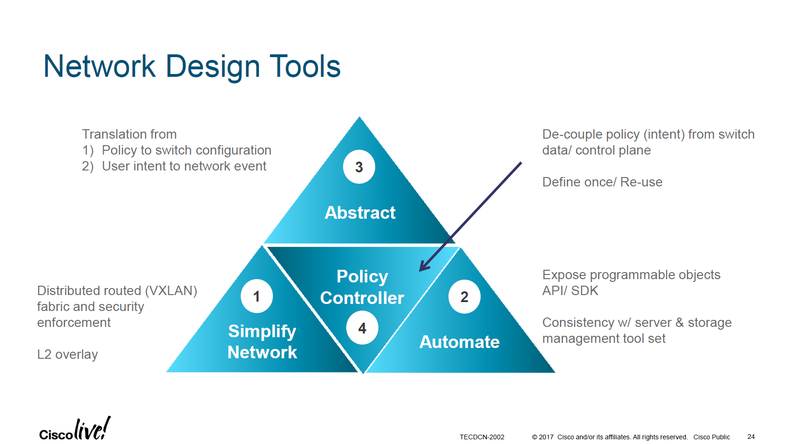

---
aliases:
- /archives/1649
categories:
- 未分类
date: -001-11-30T00:00:00+00:00
draft: true
title: 下一代数据中心基础设施
---

本篇文章参考Cisco的资料，解读了下一代数据中心基础设施及其相关衍生技术，重点讨论了数据中心的VXLAN和EVPN技术。Cisco为我们描绘了一幅目的驱动网络的蓝图，当这样一个结构正确的情况下，网络管理能变得非常简单，完整覆盖了基础设施整个生命周期，这样一个思想值得仔细研读一番。

## 前言

本文结合Cisco Live! 2017年的一个资料Next-Generation Data CenterInfrastructure，同时部分资料来源于互联网，下方都会引出。

## 网络设计工具<figure class="wp-block-image size-large">

 </figure> 

当看到这幅图时，我没有搞明白为什么称之为“网络设计工具”。不过，这样一个Network Design的思路，确实非常值得参考。与其说是Network，不如说是Network System，这样一个规模的网络已经不单单是一个“网络”了。

如上图所示，我们先来解读一下这几个词的含义：

  1. Simplify Network 简单化网络。即我们所看到的网络系统（设备），传统网络下设备需要人工干预配置，在Cisco的简化网络中，借助安全集成的分布式路由架构实现了整个L2网络的虚拟化（Overlay）。
  2. Automate 自动化。暴露出了可编程的API接口和SDK，存储管理和
  3. Policy Controller 策略控制器。
  4. Abstract 抽象。