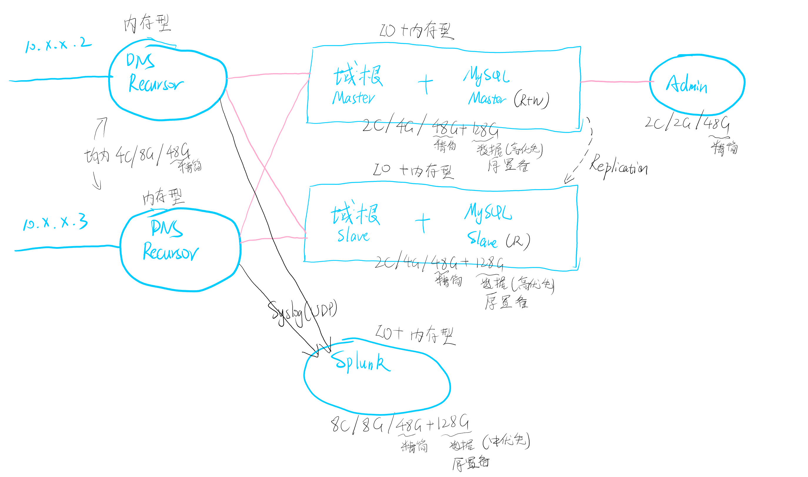
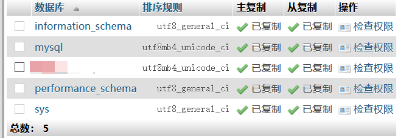

---
aliases:
- /archives/1655
categories:
- Linux
date: 2021-01-14 03:02:57+00:00
draft: false
title: PowerDNS集群系统落地实践
---

其实这已经是PowerDNS集群系统第二次落地了。第一次是在私有的混合云上部署，设计时采用了云上为主、边缘为辅的结构，结合BGP AnyCast+ECMP和PowerDNS官方推荐的架构解决了DNS的高可用、就近查询和负载均衡的问题，上线后一个季度运行正常，还算是挺稳定的。本次，PowerDNS的集群架构将在北京理工大学珠海学院条件装备处落地，为全校提供统一的DNS服务，替换掉老的勉强能用的DNS系统。


## 前言

按照惯例，本文仍然是不写细节只写主要过程。除去这些基础的配置流程，还有部分Linux优化和安全等的工作还需进行，请自行查阅相关文档~

## 整体架构

经过一番讨论~~（阉割）~~，以及结合PowerDNS官方推荐的架构（或者说是原生实现），决定采用如下这样一个拓扑：<figure class="wp-block-image size-large">


 </figure> 

在上图的拓扑中，整体仍然是采用原生的replication方式，只是相比自己混合云中用的方案砍掉了BGP AnyCast和ECMP支持，毕竟学校里边还是不容易有这个环境。没有BGP的情况下，只能通过DHCP指派多个DNS来实现故障冗余，但是不加网关的情况下负载均衡就不是特别好实现了，希望能扛得住吧。

在这样一个拓扑中，两个Recursor主要负责转发查询请求，不过说真的感觉这两个recursor上线后可能负载不会特别平衡，有可能会造成一些问题。而且Windows的DNS是按照顺序进行查询<sup>4</sup>，第一个DNS查询超时（1秒）后还要等待所有适配器上第一个DNS超时（2秒），然后才会在所有接口的所有DNS上进行查询，这样一个过程下来，如果首台DNS服务器离线，会导致所有用户解析延迟3s，这样一来带来的体验应该非常糟糕了。

此处考虑了一下，关于递归和迭代查询，学校里边，出于DNS加速的层面来看，如果使用迭代查询就没有了意义，因此本处选择使用了递归查询的方式部署DNS服务。

## 部署MySQL 5.7主从

此处，我选择了使用MySQL 5.7数据库，并开启了GTID主从同步<sup>1</sup>。

博主我在安装时踩了个坑，我在设置从库的时候忘了设置到只读模式，再加上主库在开启GTID前已经执行了部分操作，然后才又开启GTID，配置了两个库同步。那么这样一来，原本新增的库始终没有同步成功。

回想一下原因，可能是因为我安装数据库后进行了一番操作（新增了个数据库），然后才又去设置了binlog，然后又再去开启了GTID，后边加从库时又忘了置为只读模式，就导致了原本新增的数据库始终无法同步成功，删除原本的库就导致从库同步执行删除失败，然后造成同步线程执行失败退出。

按照官方文档的说法，如果数据库一开始没有设置为GTID模式，则需要将数据库设置为只读模式再配置GTID同步。当前因为变量有两个，因此还没办法确定是修改了binlog名称的原因还是没有开启只读模式的原因，结合官方文档的话暂且只能猜测是忘了设置只读导致的，晚点再做测试吧。双库全部重建并且一开始就启用GTID，并配置同步，就没有了这个问题。

下面内容为安装数据库的过程，此处我选择了使用Docker部署：


```
# 安装Docker
yum remove docker docker-client docker-client-latest docker-common docker-latest docker-latest-logrotate docker-logrotate docker-engine -y
yum install -y yum-utils -y
yum-config-manager --add-repo https://download.docker.com/linux/centos/docker-ce.repo
yum install docker-ce docker-ce-cli containerd.io -y
mkdir /etc/docker -p
# 关闭Docker默认防火墙和bridge
cat &gt; /etc/docker/daemon.json &lt;&lt; EOF
{
    "iptables": false,
    "bridge": "none",
    "registry-mirrors": ["<docker加速器地址>"]
}
EOF

# 如下步骤按需执行
# 下边这个只是将docker的数据目录迁移出而已，请根据需要调整
mkdir /data/docker -p
cat &gt; /etc/systemd/system/docker.service &lt;&lt; EOF
[Unit]
Description=Docker Application Container Engine
Documentation=https://docs.docker.com
After=network-online.target firewalld.service containerd.service
Wants=network-online.target
Requires=docker.socket containerd.service

[Service]
Type=notify
# the default is not to use systemd for cgroups because the delegate issues still
# exists and systemd currently does not support the cgroup feature set required
# for containers run by docker

# -g参数指定docker数据目录
ExecStart=/usr/bin/dockerd -H fd:// --containerd=/run/containerd/containerd.sock -g /data/docker
ExecReload=/bin/kill -s HUP $MAINPID
TimeoutSec=0
RestartSec=2
Restart=always

# Note that StartLimit* options were moved from "Service" to "Unit" in systemd 229.
# Both the old, and new location are accepted by systemd 229 and up, so using the old location
# to make them work for either version of systemd.
StartLimitBurst=3

# Note that StartLimitInterval was renamed to StartLimitIntervalSec in systemd 230.
# Both the old, and new name are accepted by systemd 230 and up, so using the old name to make
# this option work for either version of systemd.
StartLimitInterval=60s

# Having non-zero Limit*s causes performance problems due to accounting overhead
# in the kernel. We recommend using cgroups to do container-local accounting.
LimitNOFILE=infinity
LimitNPROC=infinity
LimitCORE=infinity

# Comment TasksMax if your systemd version does not support it.
# Only systemd 226 and above support this option.
TasksMax=infinity

# set delegate yes so that systemd does not reset the cgroups of docker containers
Delegate=yes

# kill only the docker process, not all processes in the cgroup
KillMode=process
OOMScoreAdjust=-500

[Install]
WantedBy=multi-user.target
EOF
# 如上内容根据实际需要调整

# 新增MySQL配置
# 注意根据目录自行调整
# 注意如下MySQL参数请根据实际需要调整，下方的配置一定不可能适合所有的场景和硬件配置！
mkdir /data/mysql-config -p
cat &gt; /data/mysql-config/my.cnf &lt;&lt; EOF
# Copyright (c) 2017, Oracle and/or its affiliates. All rights reserved.
#
# This program is free software; you can redistribute it and/or modify
# it under the terms of the GNU General Public License as published by
# the Free Software Foundation; version 2 of the License.
#
# This program is distributed in the hope that it will be useful,
# but WITHOUT ANY WARRANTY; without even the implied warranty of
# MERCHANTABILITY or FITNESS FOR A PARTICULAR PURPOSE.  See the
# GNU General Public License for more details.
#
# You should have received a copy of the GNU General Public License
# along with this program; if not, write to the Free Software
# Foundation, Inc., 51 Franklin St, Fifth Floor, Boston, MA  02110-1301 USA
#
# The MySQL  Server configuration file.
#
# For explanations see
# http://dev.mysql.com/doc/mysql/en/server-system-variables.html
[mysqld]
pid-file        = /var/run/mysqld/mysqld.pid
socket          = /var/run/mysqld/mysqld.sock
datadir         = /var/lib/mysql
secure-file-priv = NULL
bind-address    = 0.0.0.0

log-bin=mysql-xbinlog
binlog_format=mixed

# server-id记得修改
server-id   = 2
expire_logs_days = 30

!includedir /etc/mysql/conf.d/
EOF

mkdir /data/mysql-config/conf.d -p

cat &gt; /data/mysql-config/conf.d/docker.cnf &lt;&lt; EOF
[mysqld]
skip-host-cache
skip-name-resolve
EOF
cat &gt; /data/mysql-config/conf.d/xuegao.cnf &lt;&lt; EOF
[mysqld]
query_cache_size = 16M
query_cache_limit = 128M
max-connections = 65535
innodb_thread_concurrency = 8
innodb-buffer-pool-size = 64M
innodb_buffer_pool_instances = 8
innodb_flush_method = O_DIRECT
innodb_log_buffer_size = 64M
innodb_log_file_size = 32M
EOF

mkdir /data/mysql-data -p

# 启动容器
docker run --restart=always --name database -it -v /data/mysql-data:/var/lib/mysql \
    -e MYSQL_ROOT_PASSWORD="&lt;数据库ROOT密码&gt;" --network host -v /data/mysql-config:/etc/mysql \
    -d mysql:5 \
    --character-set-server=utf8mb4 --collation-server=utf8mb4_unicode_ci

# 开一个PMA便于管理
# 此处根据个人需求可以选择不开
docker run --name phpmyadmin -it -d -e PMA_HOST=127.0.0.1 --network host phpmyadmin</docker加速器地址>
```


## 是否需要启动只读模式
<blockquote class="wp-block-quote">
<p>
    This step is only required when working with servers which are already replicating without using GTIDs. For new servers proceed to Step 3. Make the servers read-only by setting the <a href="https://dev.mysql.com/doc/refman/5.7/en/server-system-variables.html#sysvar_read_only">
```
read_only
```
</a> system variable to 
```
ON
```
 on each server by issuing the following
  </p>
<cite>Setting Up Replication Using GTIDs， MySQL Document v5.7</cite>
</blockquote>

从官方的文档<sup>1</sup>中，我们可以看到，设置只读只需要在已经启用复制但是没有启用GTID的机器上。由于上边我把GTID配置一开始就写进了配置文件中，因此应该可以认为这些机器一开始就支持GTID（我没验证），直接配置同步即可。

当然，为了保险起见，还是在所有机器上启用了只读模式。其中，在新建用户时，需要特别留意使用传统的加密方式<sup>2</sup>，新的加密方式暂时还不确定会不会有什么潜在问题


```
docker exec -it database mysql -u root -p

# 新建复制用户
# 请根据实际情况调整如下配置
USE mysql;
CREATE USER '&lt;用户名&gt;'@'&lt;主机名或者IP&gt;' IDENTIFIED WITH mysql_native_password BY '&lt;密码&gt;';
GRANT REPLICATION SLAVE ON *.* TO '&lt;用户名&gt;'@'&lt;主机名或者IP&gt;' REQUIRE NONE WITH MAX_QUERIES_PER_HOUR 0 MAX_CONNECTIONS_PER_HOUR 0 MAX_UPDATES_PER_HOUR 0 MAX_USER_CONNECTIONS 0; 

# 将数据库置为只读模式
SET @@GLOBAL.read_only = ON;
```


那么接下来，就可以开始在从库设置同步了：


```
CHANGE MASTER TO
	MASTER_HOST = '&lt;主机名或者IP&gt;',
	MASTER_PORT = 3306,
	MASTER_USER = '&lt;同步用户&gt;',
	MASTER_PASSWORD = '&lt;密码&gt;',
	MASTER_AUTO_POSITION = 1;

START SLAVE;
```


如上的信息需要根据实际情况修改。

这时候，日志里边就可以看到同步线程开始工作了：<figure class="wp-block-image size-large">


 </figure> 

当检查日志没有错误并且确认同步已经正常开始之后，就可以退出只读模式了，但是！此处我的从库只用来配合PowerDNS的Slave完成查找DNS记录，因此应当保持只读模式。

## 初始化PowerDNS数据库

当正常完成上边操作之后，新建数据库，即可看到PowerDNS的数据库自动完成了主从同步：<figure class="wp-block-image size-large">


 </figure> 

同时，从库的数据库中也能看到复制的对勾，说明一切正常，即可开始使用~

此处初始化PowerDNS的数据库的内容，请查看PowerDNS的官方文档<sup>3</sup>~

## 配置域根主从

考虑到域根的负载并不会特别高，因此只简单配置了一下。下边为Mater的配置，Slave的就对比官方文档修改一些配置即可：


```
allow-axfr-ips=10.0.10.0/24
api=yes
api-key=&lt;自行生成API KEY&gt;
config-dir=/etc/pdns
default-soa-content=<ns名称> i.xuegaogg.com. 0 10800 3600 604800 3600
disable-axfr=no
disable-syslog=yes
distributor-threads=4
guardian=yes
launch=gmysql
gmysql-host=127.0.0.1
gmysql-user=&lt;用户名&gt;
gmysql-password=&lt;密码&gt;
gmysql-dbname=&lt;数据库名&gt;
local-address=0.0.0.0
local-port=53
master=yes
setgid=pdns
setuid=pdns
slave=no
webserver-address=0.0.0.0
webserver-allow-from=10.0.10.0/24
max-cache-entries=12884901
reuseport=yes</ns名称>
```


确保文件权限正确，权限错误的情况下pdns服务启动时日志里会提示无法访问配置文件。

## 配置Recursor

两台Recursor保持一致配置即可。


```
allow-from=127.0.0.0/8, 10.0.0.0/8, ::1/128, fc00::/7, fe80::/10
allow-trust-anchor-query=no
any-to-tcp=no
client-tcp-timeout=3
daemon=no
disable-syslog=no
distributor-threads=4
forward-zones=xxxx.com.=10.0.x.x:53;10.0.x.x:53, xxxxx.edu.cn.=10.0.x.x:53;10.0.x.x:53, 10.in-addr.arpa.=10.0.x.x:53;10.0.x.x:53
forward-zones-recurse=.=x.x.x.x:53
local-address=0.0.0.0
local-port=53
log-timestamp=yes
lowercase-outgoing=no
max-cache-entries=12884901
max-cache-ttl=86400
max-mthreads=2048
max-packetcache-entries=500000
max-udp-queries-per-round=10000
network-timeout=1000
pdns-distributes-queries=no
reuseport=yes
security-poll-suffix=
setgid=pdns-recursor
setuid=pdns-recursor
threads=4
udp-source-port-avoid=11211
udp-source-port-max=65535
udp-source-port-min=10240
```


由于后期我要配合Splunk统计每周期DNS查询量和缓存命中率，因此此处没有禁用syslog，对于不需要记录日志的朋友，该功能可以关闭。当然，systemd的service中，默认直接写死了禁用syslog，需要手工去掉该参数才可。

在这样一个配置里，我保持了reuseport开启并且将pdns-distributes-queries关闭，参照官方文档<sup>5</sup>中的说法，这样的配置可以使每个工作线程共享监听同一个socket，同时可以避免惊群效应，提高多核处理器的性能。在Recursor启动之后，日志中即可看到在以epoll模式运行（即事件驱动），各位可以去Google自行查找相关内容，本文不再多提~

## 配置PowerDNS Admin

原本打算自己封一个Docker Image，一直没时间整，只能先去Docker Hub找些用了。

此处我使用的**pschiffe**的**pdns-admin-uwsgi**和**pdns-admin-static**镜像，由于其使用了uwsgi启动PDA（PowerDNS Admin的简写），因此外层需要使用一个网关套一下。

pdns-admin-static就是一个nginx的镜像。在pdns-admin-static这个容器中，nginx通过主机名找到uwsgi的容器IP，但是，我使用了host命名空间的情况下，并没有办法使用Docker的link，通过主机名访问只能通过在宿主上修改hosts文件，添加uwsgi的容器名到hosts并且指向127.0.0.1即可。

如下命令只是容器的启动参数，注意下边有的地方是”””，即双引号里还有单引号，确认没有错误，请不要删除单引号或者双引号，否则会导致容器启动失败。因为双引号是给docker看的，内部的单引号才应该是带入到PDA配置文件中并且指导启动的。


```
mkdir /data/powerdns-admin/upload -p

docker run -it -d --name pdns-admin-uwsgi  --restart=always \
  -v /data/powerdns-admin/upload:/opt/powerdns-admin/upload \
  -e PDNS_ADMIN_SQLA_DB_HOST="'&lt;数据库IP&gt;'" \
  -e PDNS_ADMIN_SQLA_DB_PORT="'3306'" \
  -e PDNS_ADMIN_SQLA_DB_USER="'&lt;数据库用户名&gt;'" \
  -e PDNS_ADMIN_SQLA_DB_PASSWORD="'&lt;数据库密码&gt;'" \
  -e PDNS_ADMIN_SQLA_DB_NAME="'&lt;数据库名&gt;'" \
  -e PDNS_API_URL="<api url="">" \
  -e PDNS_API_KEY="<api key="">" \
  -e PDNS_VERSION="&lt;版本号&gt;" \
  --network=host \
  pschiffe/pdns-admin-uwsgi:ngoduykhanh

docker run -d -it --name pdns-admin-static --restart=always \
  --network=host \
  pschiffe/pdns-admin-static:ngoduykhanh</api></api>
```


## 接入Splunk统计查询量等数据

此处，我需要看到DNS每个周期经受了多少查询请求，以及需要了解其缓存命中率，并且结合系统的整体负载评估DNS系统基准性能，并指导后续调整。

此处，我选择使用Splunk接受syslog发出的PowerDNS Recursor的日志，此处也不再过多讨论syslog的实现原理和Splunk的安装过程，这些内容请各位自行查找~

接下来，我只需要在recursor上开启日志传送到syslog即可，再配置syslog将日志外发到Splunk，即可完成所有需要。

【晚点填坑】

## 其他

### 完整显示主机名

CentOS中，主机名会显示在每行命令之前，好比：`[root@HOSTNAME ~]#` ，那么也就有一个问题，当主机名中包含小数点的时候，主机名显示会被自动截断，虽然是符合规范了，但是偶尔有时候我们习惯性把IP地址带进主机名去，这样一来难免也同样会被截断，这时候就需要手工修改一下PS1这个变量了，重新定义一下格式即可~


```
echo "export PS1='[\u@\$(/bin/hostname) \W]\\\$ '" &gt;&gt; /etc/profile &amp;&amp; source /etc/profile
```


### 生成精简的配置文件

众所周知，Linux中的配置文件一般都会带有注释，这为运维人员带来了极大的方便，但是有时候我们只是需要一份配置而已，这样一大堆注释反而让人看花了眼，不好寻找重点。

这时候，可以尝试使用grep配合正则，反向匹配掉空行和#开头的内容即可，进而即可得到精简后的配置文件（不含注释和空行）：


```
grep -v '^$\|#' <input file=""/> &gt; <output file=""></output>
```


## 参考资料

  1. Setting Up Replication Using GTIDs. MySQL Document v5.7. https://dev.mysql.com/doc/refman/5.7/en/replication-gtids-howto.html
  2. Casey McMullen. How to Run MySQL 8.0 with Native Password Authentication. https://medium.com/@crmcmullen/how-to-run-mysql-8-0-with-native-password-authentication-502de5bac661
  3. Generic MySQL backend. https://doc.powerdns.com/authoritative/backends/generic-mysql.html
  4. DNS Processes and Interactions. https://docs.microsoft.com/en-us/previous-versions/windows/it-pro/windows-server-2008-R2-and-2008/dd197552(v=ws.10)?redirectedfrom=MSDN
  5. PowerDNS Recursor Settings. https://docs.powerdns.com/recursor/settings.html#reuseport