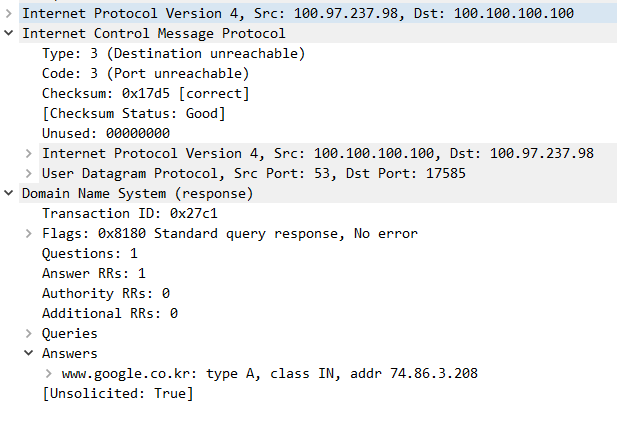
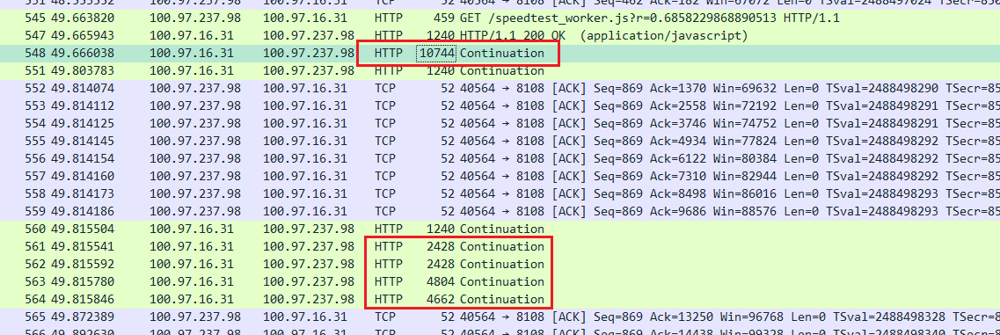
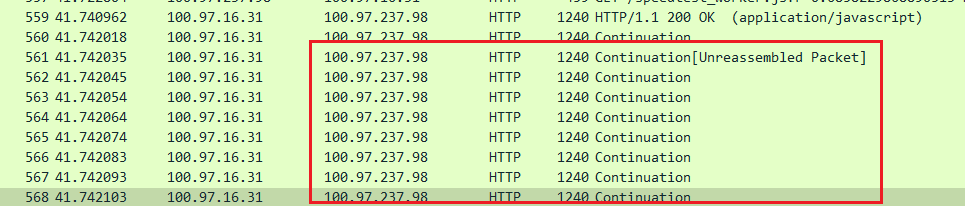
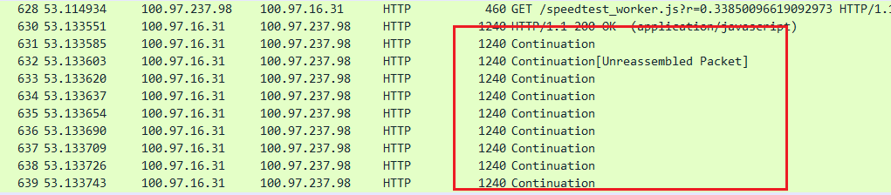
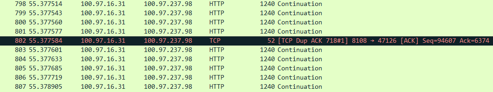
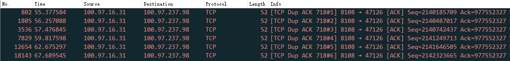
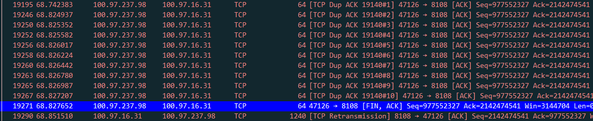
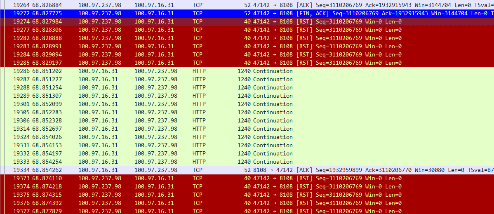

---
aliases:
- /archives/1686
categories:
- Linux
- 网络基础
date: 2021-03-21 16:49:34+00:00
draft: false
title: NAT VPS丢包与TCP
---

博主小时候（大概好像是初三的时候吧），那时候Soft Layer还没有退出HK，随便开台20块钱的机器，流量就有1个T，速度还贼快。近些年来，随着墙逐渐加高，直连线路基本已经无法使用，于是衍生出来各种共享的中转、专线服务，博主趁机也开了一个月付仅要80块钱流量有足足1.5T带宽竟然有250Mbps的NAT VPS，用来实现博主自己的混合云互通（是的不出国），就是没想到NAT VPS竟然能这么感人……

## 前言

首先，先声明一下，写本文的目的主要是想吐槽一下国内NAT VPS的疯狂丢包的境况，顺便复习一下TCP在这样的丢包环境中是如何工作的。

本文不教fq也不可能教fq，如果冲着这个来的可以点关闭了~

## 什么NAT VPS?

早些年的时候，我们买到的VPS都是独立IP的，好比Vultr、Linode的，均为单个IP绑定在VPS上，带宽一般也都能保障到宣称带宽（毕竟专业的IDC带宽充足、端到端QoS成熟靠谱）。近些年来，国内由于不断出现中继和专线，个人用户想省钱，老板想赚钱，刚刚好就促成了NAT VPS这一类别的VPS上线普及。NAT VPS是指所有的用户共享一个静态或者动态公网IP地址，通过DNAT把高位端口号的请求映射进用户购买的VPS指定的端口号上，所有的VPS都在一个大内网中。回程数据包通过conntrack的session直接进行SNAT并回到源主机，实现互通。

好处是，真便宜，在国内商宽贵的一批的今天，你还能在网上看到80块钱1.5T流量250Mbps的NAT VPS，请问谁不心动呢？坏处的话，就是你不知道有多少个人在跟你一起用这样一个不知道多大容量的带宽，而且这种卖家一般是没有端到端QoS的实施能力的，设备性能往往也达不到要求，因此可能会存在较大的速率波动和转发时延震荡。

博主我试了两家的，一家是CloudIPLC的（实名），一家是Hostmsu（无实名）。由于CloudIPLC的机器是在徐州，地域距离造成的延迟较高，怀疑是长肥网络的效应，没有具体测试丢包情况，为了验证短距离通信效果，才专程购买了一台Hostmsu广州华新园移动机房的NAT VPS机器，短距离通信延迟低，不太容易出现长肥网络的效果。本文全文都以Hostmsu的机器做测试，至于CloudIPLC的机器，感兴趣的朋友可以自行去测试一下，应该大家都一样。

博主我的混合云系统目前广东省有三个点，其中IDC的部分在腾讯云上托管，希望使用广州的NAT VPS省下来一笔边缘互通流量钱（事实证明我想多了）。

## 丢包丢成什么样子？

RX指的是边缘服务器接收到的来自NAT VPS的数据包，TX指的是边缘服务器发出的去往NAT VPS的数据包。

发出的数据包会在网关处进行打封装，然后再通过运营商网络转发出去，到达NAT VPS会进行解封装，然后直接到达NAT VPS的操作系统的协议栈中。中间如果是TCP数据包，均已经控制MSS。

该测试为手工测试，时间跨度大概有几十分钟，因此可能不能代表系统瞬时的状态，还需结合其他条件再观察。测试均使用iperf3进行正向、反向打流测试10秒。

全量包比例

  * 大包（1200B）
      * 5Mbps（~520pps）：RX 0%，TX 0.019%
      * 10Mbps（~1042pps）：RX 0%，TX 0.057%
      * 20Mbps（~2080pps）：RX 0%，TX 少量乱序0.062%
      * 40Mbps（~4180pps）：RX 0%，TX 少量乱序0.16%
      * 60Mbps（~6220pps）：RX 0.76%，TX 大量乱序10%
  * 小包（64B）
      * 1Mbps（~1950pps）：RX 0%，TX 大量乱序1.8%
      * 2Mbps（~3800pps）：RX 0%，TX 少量乱序0.018%
      * 4Mbps（~7900pps）：RX 0%，TX 少量乱序0.018%
      * 8Mbps（~15500pps）：RX 0.51%，TX 少量乱序0.21%

我这里出口总共有100Mbps，因此60Mbps再大的速率就没有再测的意义了，同时15.5kpps的包转发率也只能供参考。

从上边大致的测试数据可以看出，RX方向基本都没有啥问题，TX又是丢包又是乱序的。不过说真的，这我就想不明白了，为啥还能乱序？？？？现有的网络结构下，即便是ECMP也都会按照session（L4）信息进行哈希，最不济也是以L3 IP为基准，因此很难说存在乱序的可能，因为整条路径上几乎都可以理解成串行处理。

同时，从NAT VPS发出数据包始终存在乱序和丢包现象，但是回程始终不会有这种情况。结合我刚刚使用speedtest-cli跑出的测试结果（下行280Mbps上行870Mbps）来看，要么ISP对speedtest的测速做了定向“优化”，要么可能就是封装后的UDP协议被ISP限制或者被高防限制。那么此时，就要找服务商确认一下有无高防了。工单已发，等回复吧

## 来抓个包看看吧~

### 莫名的ICMP包

我打开手机的AnyConnect，连上去对我的NAS上的测速跑了一下，得到了一个23M大小的pcap文件（中间节点抓包）。在使用WireShark解析包之后，就看到了一幕很奇怪的现象：

<figure class="aligncenter size-large">

</figure>

说真的，这操作我就没看懂了，为什么一个来查DNS的数据包，还包含着DNS查询结果，但是却是ICMP目标端口不可达？？？

Google告诉我了两个可能性，一个是端口已经关闭导致的，即hit a closed door，另外一种是一个没有明确证据的答案——Google Chrome的DNS Prefetch。

按照对ICMP的理解结合现在的情况，可能是我的设备原本发出DNS查询请求，然后DNS在响应该请求时隔了比较长时间或者一些其他因素，导致设备端socket已经超时关闭？进而造成了通过带着DNS Re.的ICMP回复100.100.100.100来告诉DNS这边设备的端口已经关了？但是前置报文又去哪了呢，我并没有看到Request和尝试的Response？内部网络使用BGP来通告/32的VPN地址，通过BGP AnyCast通告多个DNS，经过全链路追踪，也并没有发现DNS走了其他路由，并且kernel捕获时并没有报出丢包、抓包是在设备端AnyConnect启动前就已经开启，所以前置的报文呢？？？？

离谱。晚点再确认一下吧

### 当TCP/IP遇到网卡

紧接着，发现了第二个很奇怪的问题——即便是禁止了WireShark对TCP、TLS的Reassemble，还是能看到远远超出MTU十倍大小的数据包（如下图）<figure class="wp-block-image size-large">

 </figure> 

可以看到，非常离谱，数据包的Length已经到了一万多Byte，远远超出了MTU！在整个pcap文件中，还存在大量的巨型包，这些巨型包甚至直接超出了巨型帧的MTU大小，但是在对侧设备上接口抓包却看到是已经完成了分片的正常大小包（如下图）。看的我一度以为我计网白学了，是不是漏了TCP/IP的分片逻辑？为此专程又去确认复习了一遍TCP/IP的拆包逻辑2，发现并没有理解错<figure class="wp-block-image size-large">

 </figure> 

一贯理解libpcap抓包主要是通过eBPF在数据包进入系统协议栈之前进行的clone并且直接传送进用户态空间进行保存，因此可以确认libpcap抓到的数据包一定是未进到系统协议栈之前、从网卡队列中取出的原始包。为了确认理解没有出错，专程在kernel doc页面得到了查证1

这时候，搞不定的问题只能继续问Google了（如下图）<figure class="wp-block-image size-large">

 </figure> 

在WireShark的社区3里正好看到了这样一句话：

<blockquote class="wp-block-quote">

    Probably you captured on the host that transmitted the oversized packet, and TCP Large Segment Offload [TSO] is enabled
  

<cite>TCP packet length was much greater than MTU [closed] – WireShark Ask</cite>
</blockquote>

好家伙！突然灵光一闪，TCP Checksum都能够被网卡Offload，那岂不是分片和合并也可以通过网卡进行硬件加速？

<blockquote class="wp-block-quote">

    The following technologies are described:
  

    * TCP Segmentation Offload – TSO
  

    * UDP Fragmentation Offload – UFO
  

    * IPIP, SIT, GRE, and UDP Tunnel Offloads
  

    * Generic Segmentation Offload – GSO
  

    * Generic Receive Offload – GRO
  

    * Partial Generic Segmentation Offload – GSO_PARTIAL
  

    * SCTP accelleration with GSO – GSO_BY_FRAGS
  

<cite>Segmentation Offloads in the Linux Networking Stack4</cite>
</blockquote>

其中，**TSO**属于硬件范畴，其允许硬件去分片一个巨型的TCP包成多个Segment，满足MSS大小要求。**UFO**属于硬件范畴，允许硬件将一个超大的UDP分成多个分段，类似于TSO，只是作用对象和具体实现不太相似。**IPIP/SIT/GRE/UDP Tunnel卸载**没有看到明确的说明是硬件还是软件实现，主要用于这种Overlay的封包解封装和校验。**GSO**属于软件范畴，当网卡驱动无法支持卸载时则启用GSO来分片，以满足MSS要求，同时所有的硬件Segmentation Offload均需要依赖GSO。**GRO**是对GSO的补足，用于软件实现对GSO分片的Segment合并。

综上，即可得出结论，tcpdump抓包看到的1万多byte的包，实际上是借助硬件TSO的结果，因为TSO要求尽可能晚分片，说白了就是操作系统不要分片，等待数据包进入网卡队列后由网卡进行硬件分段。这样一个操作，在存在应用的服务器上确实有较大帮助，操作系统无需再关注TCP分段，直接全部交给网卡进行处理，减少CPU时钟消耗，但是，在作为路由器的Linux上，似乎不是个明智的选择。

所以还是关了吧。<figure class="wp-block-image size-large">

 </figure> 

这下就好了。

**接下来的内容，我就以新抓的包为基准，继续分析上文提到的丢包和乱序问题。**

### 重复ACK

此处我只观察了98-&gt;31的单方向下载测试的连接<figure class="wp-block-image size-large">

 </figure> 

该Session中的原始ACK确认了100.97.16.31-&gt;100.97.237.98（省略了端口号）发送方队列中[:977552327]（非上图）的内容。但是很可惜，98到31发起GET请求，同时31告诉98它已经收到了，该ACK可以在两端都能抓到，因此确定该ACK是在POP点到AnyConnect客户端间丢失，没办法了，那就丢吧。

目前定位第一次ACK在从POP点发出到AnyConnect客户端间丢了。

观察了一下后续（如下图），发现这个ACK全程活生生愣是被传了6次，时间跨度足足有67.6-55.3=12.3s。联合整个流的上下文再观察，98向31发起了一个HTTP GET，31尝试回复98一个ACK，但是似乎看起来是丢了，因为此时98向31已经开始在发送一大堆数据（librespeed）了，同时31还在继续等待并向98重新ACK。所以，由此可以知道，接收窗口中的数据在没有经过ACK的时候就已经会拷贝出到用户程序，并且用户程序已经开始在写入了大量的数据进行响应。<figure class="wp-block-image size-large">

 </figure> 

98向31发起GET，因此31需要回复98一个ACK。但是由于各种原因，大量传输已经开始，数据海量开始向98发出，98需要ACK回31，但是此时线路发生了拥塞，再加上31的接收窗口没有满并且98回31的线方向没有拥塞，因此那个倒霉的ACK就淹没在了这大片流量之中。

突然，56.257088s时，31向98再次发起一次Dup ACK#2，WireShark分析得到的是重复ACK，此时RTT也仅仅只有49ms（相对于正常RTT已经高出了1.5倍）。在这个ACK中，其要确认远程队列里的[:977552327]，确实还是刚刚31想ACK的那个Seg。

紧接着，在后续的包中，又看到了从98向31的一大堆重复ACK，而且是在疯狂确认[:2142474541]的内容，这部分内容看了下是[2142474541:2142475729]的一个Seg丢失造成的，在疯狂Dup ACK之后也确实看到了Retransmission，刚刚好这条PATH也没有拥塞，所以Dup ACK期望获得重传也蛮合理。<figure class="wp-block-image size-large">

 </figure> 

所以，原来标称的250Mbps线路在跑到10Mbps左右的时候就开始了拥塞。该情况是在UDP Overlay的基础之上测得，TCP的尚不明确。

### 先前的Seg丢失

结合上边的梳理，就知道这里Seg丢了之后，后续的包继续发来，会持续造成重复确认丢的这个Seg的头部位置，进而方便进行快速重传。不过，在这个实际的这个抓包观察的环境里，看到的不是快重传，而是不断SACK进行了局部确认。丢失的Seg在发送端队列中序列为[1932205519:1932206707]，丢失的ACK在发送后400ms左右才到达滑窗的边界，此时还没有收到，但是接收又不能停止，此时为了避免停止等待浪费吞吐量，因此需要进行窗口缩放。

窗口缩放时，TCP开始发送Window Update消息，告诉对侧调整窗口缩放因子，让其将发送窗口加大，来保证发送吞吐量不受到影响。

在调整窗口的同时，那个倒霉的Seg才到，现在我们知道了，这个倒霉的Seg并没有丢失，只是到得晚了一点而已（乱序），在其到了之后，Window Update便停止了，同时后续也就没有了SACK。

### 连接被重置<figure class="wp-block-image size-large">

 </figure>
<blockquote class="wp-block-quote">

    RST in response to FIN is an old hack that’s still common in http. The concept is basically that http sessions are short-lived, with a single Req/Resp pair (http 1.0). This special case therefore doesn’t require TCP’s ability to receive data after a FIN is sent, so after the server is done sending the requested content, the browser will send a RST.
  

<cite>Why TCP Reset sent after receive [FIN,ACK] Packet?5 – WireShark Ask</cite>
</blockquote>

如上引用，其表示在HTTP这种协议中RST在FIN之后发出属于old hack，在HTTP 1.0的一问一答请求的模式中，确实是这样，但是这个请求是HTTP 1.1的。

<blockquote class="wp-block-quote">

    The FIN and RST packets in your flow are not directly related. By sending FIN 10.77.137.106 is signalling that it has no more data to send. It could still receive more data from the other end of the connection. However when more data does arrive 10.77.32.60 sends RST to signal that the application is not going to be reading anymore data from the socket.
  

    If an application wants to shut down a TCP connection cleanly without causing any RST packets being sent, it has to first use the shutdown system call to close the socket for writing while keeping it open for reading. After it has shutdown the socket for writing it will still have to read all data the other end has to send before it close the socket entirely.
  

<cite>Why TCP Reset sent after receive [FIN,ACK] Packet?5 – WireShark Ask</cite>
</blockquote>

那么这个回答似乎比较河里，FIN仅仅用于提示对端没有更多的消息会再发送了，但是却会有其他消息继续到达，此时也刚刚好进入FIN-WAIT阶段，可能是为了确保后边不要再有数据发来了，然后才直接RST一了百了？这个目前也没有明确的答案支出，**晚点再验证**

## 一点点想法

早些时候参考KCP设计自有的Overlay协议时，也就考虑加上了链路质量分析，主要用来双端进行发包收包统计，直接计算链路丢包情况。在实际开发的时候，发现最大的问题在于——连TCP都有可能乱序，那么这样的话如何同步时钟？

看起来如果想要实现彻底的全链路的链路质量监控，最狠的办法，应该也只有借助raw socket实现伪装TCP的同时把每一个包的状态全部上报的控制器去，整条链上所有的数据或许只有绘图出来才会有指导全链路质量优化的可能了。

## 写在最后

实际定位一次问题，可以发现，其实现在的计算机网络和谢希仁书上的计网，差别已经很大了。现实中的协议栈看起来比书上的更加麻烦，同时随着SDN的发展，操作系统似乎越来越热衷于将各种原本操作系统应该做的工作Offload到各种硬件上（好比网卡），所以，也就有了本文我们所看到的，计网说数据包在TCP/IP都会分片，发出去的Frame中数据长度一定不可能超过1500B（巨型帧会更大），但是本文我们也看到了，现实中操作系统就是喜欢各种Offload，让网卡这种ASIC去Offload各种不仅仅限于Checksum的操作，好比分片。这种Offload刚刚好又在网卡层面处理，因此通过eBPF抓包得到的结果，还真的会和计网书上讲的不一样。

讲到这里，我还是想说，课本不会也永远不可能是全部。我始终贯彻落实从实际环境的角度定位并解决问题一边了解基础的方法，这恰到好处也让我看到了很多和计网书上不一样的东西，希望这样一个学习方式对你也能有所启发。

最后的最后，这NAT VPS的网真j8垃圾。

## 参考资料

  1. Linux Socket Filtering aka Berkeley Packet Filter (BPF). https://www.kernel.org/doc/html/latest/networking/filter.html
  2. 为什么 TCP/IP 协议会拆分数据（强推该博客）. https://draveness.me/whys-the-design-tcp-segment-ip-packet/
  3. TCP packet length was much greater than MTU [closed]. https://ask.wireshark.org/question/4564/tcp-packet-length-was-much-greater-than-mtu/
  4. Segmentation Offloads in the Linux Networking Stack. https://www.kernel.org/doc/Documentation/networking/segmentation-offloads.txt
  5. Why TCP Reset sent after receive [FIN,ACK] Packet?. https://osqa-ask.wireshark.org/questions/13986/why-tcp-reset-sent-after-receive-finack-packet