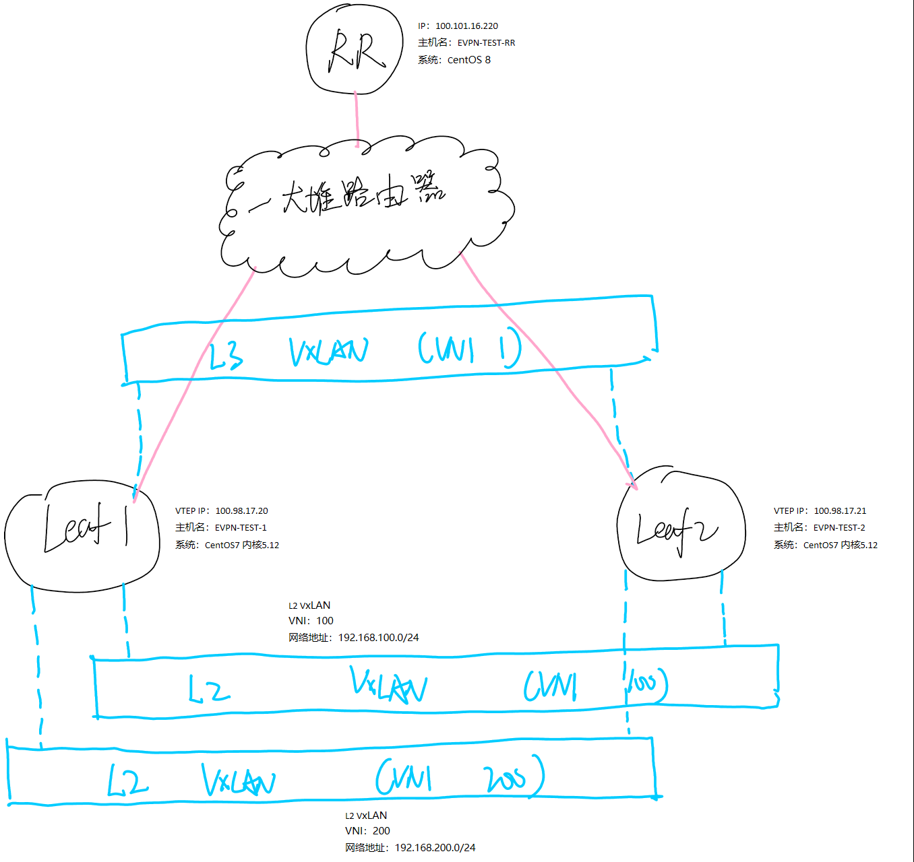
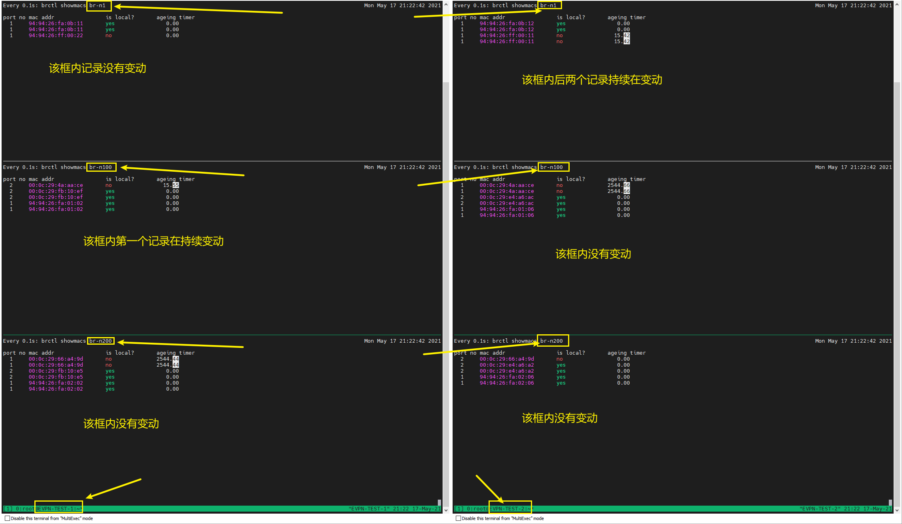
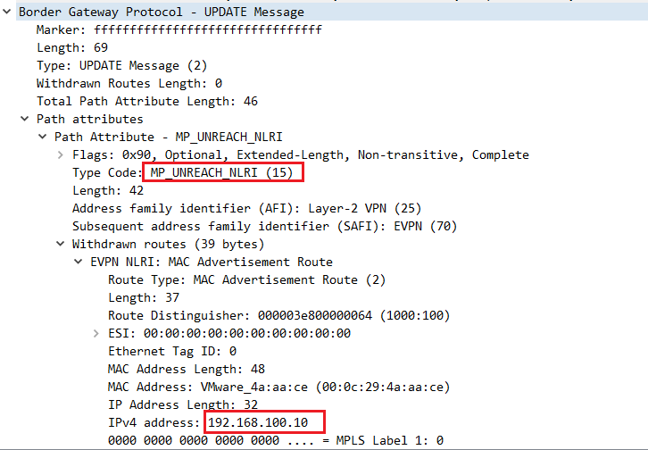
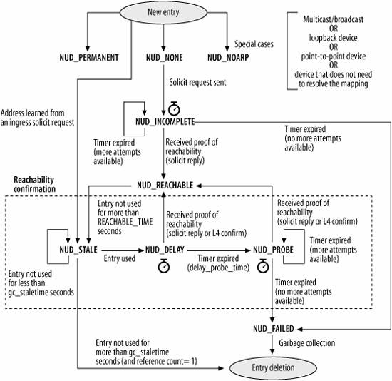
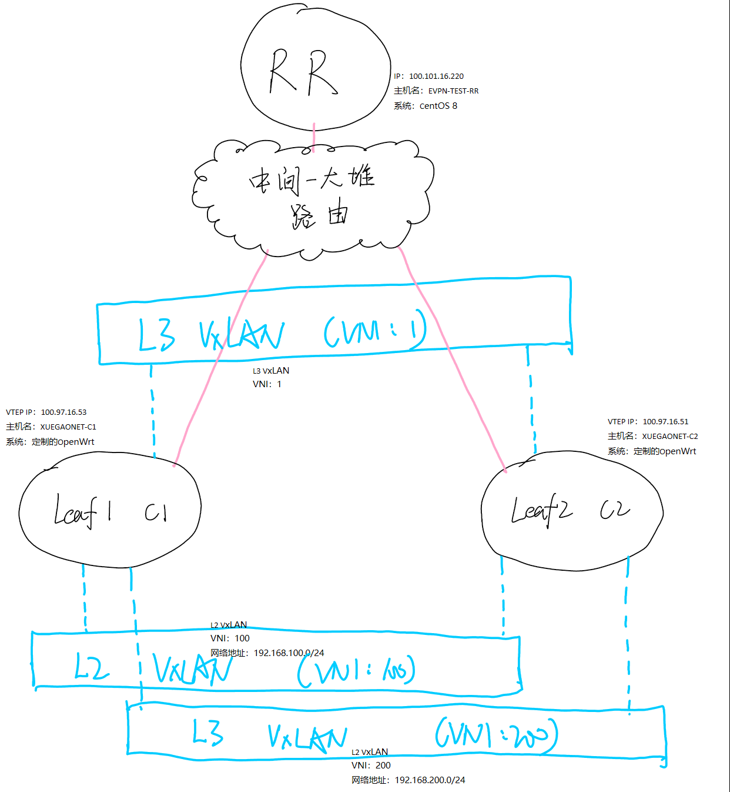

---
aliases:
- /archives/1752
categories:
- Linux
- 网络基础
date: 2021-05-17 09:16:20+00:00
draft: false
title: OpenWrt+FRRouting+Ifman：天下没有不能成为SD-WAN CE的路由器
---

出于成本考虑，博主我对OpenWrt系统进行了定制，期望任何一个OpenWrt的机器都能够成为SD-WAN的CE。这个定制里加入了FRRouting和我自己的接口管理套件Ifman，运行在一台MT7620的路由器上，就可以实现分布式网关的Symmetric/Asymmetric特性。两个MT7620的路由器和一台1C1G的虚拟机（RR），已经可以舒舒服服玩起来了~


在开始之前，你得先知道这几件事：

  * 在本文这个场景中，一切均通过软转发实现，没有ASIC的加持，因此吞吐量和时延就不要太看重了。用于学习或者解决基础互通还是可以的，生产环境的话还要结合具体情况进一步评估和优化。当然，如果有特殊需求，你也可以在**关于&amp;声明**中找到我的联系方式来联系我解决（有偿），包稳定（笑）
  * MT7620的CPU并不强，如果你也使用同样的配置的机器测试，打满的时候可能会出现因为CPU满载导致BFD Keepalive抖动进而BGP Session断开的问题，此时你可能需要换一台机器。MT7621的设备我在宿舍测试过，能跑到240Mbps左右，抖动数据没做相关测试，至少比MT7620强很多就是了
  * 现有的这个固件的程序会对ROM进行稍微频繁的读写操作，可能不利于路由器的SPI Flash的寿命。如果生产使用，还请三思使用NAND Flash等性能和可靠性（包含坏块屏蔽）更高的方式
  * 这是篇技术文章，解决需求和问题的时候，穿插着很多技术性内容。可能有不严谨或者理解偏差的地方，欢迎指正~


## 前言

博主我自己也有一堆散在全国、全球各地的服务器和机房，为了整合这些基础设施，也是绞尽了脑汁。毕竟，网络基础设施互通，进一步存储和计算才能打通，所有的资源才能真正整合利用起来。看了下主流云服务厂商的SD-WAN解决方案的成本，算了我还是自己做好了，有需要我自己再加功能。现有的SD-WAN的CPE、网关的成本，加起来才200元不到，流量成本也有途径拉到更低，何乐而不为？

博主我选择了使用OpenWrt系统作为基础，在stable版本上扩充和集成了自研的Ifman插件和开源软件FRRouting，启用了内核相关的特性，使得整机能够成为一个CE并且能够实现其功能。其中，Ifman是我的一个开源项目，仓库链接：【**<a data-id="https://github.com/XUEGAONET/ifman" data-type="URL" href="https://github.com/XUEGAONET/ifman" rel="noreferrer noopener" target="_blank">点击这里</a>**】，后续会慢慢加入gRPC通道支持远程下发配置；FRRouting是一个开源的控制面软件，用于实现BGP EVPN这个控制面功能，数据面自然就交给了Linux内核来完成~

这个文章中分为**两大部分**，一部分为**实验室的虚拟化环境内部部署验证**，一部分为**实际硬件部署验证**。其实起初一开始是直接在硬件上部署验证的，但是发现有一些奇奇怪怪的问题和参考文献的结果有出入，后边实在觉得奇怪，临时在实验室的虚拟化环境上部署验证证实了OpenWrt的系统问题，具体细节还在定位中，后续解决和验证后固件会公开出来~

请注意，文末的参考文献不一定全部都在文中加了脚注，有些只是看过就写上了。对于不是特别了解该技术的兄弟，可以把文末的参考文献细致研究一下，建议顺序是先看Cisco Live!的ppt了解大致，再通过[7]的书籍细致了解原理。

由于子网路由（Type-2）在OpenWrt上和CentOS上均有验证过，均没有问题，因此本文就不再关注子网路由的结果了，我们单纯来做个验证看看分布式网关+Anycast Gateway+前缀路由引入（Type-5）是怎么样的。

## 虚拟化环境部署验证

### 拓扑图

如下图1，整体结构就长这样。请留意图中的内核版本<figure class="wp-block-image size-large">


 <figcaption>图1. 虚拟化环境部署拓扑</figcaption></figure> 

在图1中，Leaf 1和Leaf 2通过一大堆路由器后与RR建邻。其中，两个Leaf都在一个二层域中，不过只是为了方便测试而已，放任何位置都无所谓的，本身就是个分布式的。全网为iBGP，AS号为1000。

在这个环境中，Symmetric与Asymmetric的环境是整合部署的，因此图1中能够看到会有一个L3 VxLAN（VNI 1），但是实际上根据模式差别，该VxLAN不一定会被用上。

在看完大架构之后，我直接进入抓包验证阶段，正好了解一下这玩意到底是怎么跑起来的。

### Symmetric验证

该模式为对称模式，相比非对称模式只是多一个L3 VxLAN，该L3 VxLAN用于封装转发跨子网并且跨VTEP的访问。

在对称模式中，L3 VxLAN起到作用，整体转发逻辑可以参考[8]的pp.78-80。在这个模式中，VTEP本身开启Anycast Gateway的同时，将L2就近分割到L3，进而直接在本地完成路由表查找并且转发。只是对比Asymmetric，在本模式中，子网的明细路由会通过主机路由的形式安装到VTEP上，好比如下的代码框。这样一来，在L2向L3分割后，跨子网的数据包即可通过明细路由通过L3 VxLAN到对侧的VTEP去。


```
[root@EVPN-TEST-2 ~]# ip route show vrf vrf-evpn
192.168.100.0/24 dev br-n100 proto kernel scope link src 192.168.100.1
192.168.100.10 via 100.98.17.20 dev br-n1 proto 186 metric 20 onlink
192.168.200.0/24 dev br-n200 proto kernel scope link src 192.168.200.1
```


通过上边的路由可以知道，到远端VTEP的明细路由被引入到了br-n1这个接口中（即通过VxLAN 1），但是为什么下一跳会是100.98.17.20还需要再研究一下。

这样一来，所有跨子网的访问，如果目标地址存在于本地VTEP则直接通过直连路由到达对应的Bridge Domain，如果目标地址在远端VTEP上则通过明细路由命中并通过L3 VxLAN封装到对应的VTEP去，解封装后再路由到直连路由的接口中，完成转发。

验证阶段，我使用Leaf 2下的192.168.200.10 Ping Leaf 1下的192.168.100.10。最终结果当然是通的

首先来关注一下EVPN-TEST-2的br-n200端口的数据包（如下），可以看到来回都有。


```
[root@EVPN-TEST-2 ~]# tcpdump -i br-n200 -vv -en
tcpdump: listening on br-n200, link-type EN10MB (Ethernet), capture size 262144 bytes
13:52:16.259174 00:0c:29:66:a4:9d &gt; 94:94:26:22:22:22, ethertype IPv4 (0x0800), length 98: (tos 0x0, ttl 64, id 30832, offset 0, flags [DF], proto ICMP (1), length 84)
    192.168.200.10 &gt; 192.168.100.10: ICMP echo request, id 6257, seq 2591, length 64
13:52:16.259735 94:94:26:22:22:22 &gt; 00:0c:29:66:a4:9d, ethertype IPv4 (0x0800), length 98: (tos 0x0, ttl 62, id 45191, offset 0, flags [none], proto ICMP (1), length 84)
    192.168.100.10 &gt; 192.168.200.10: ICMP echo reply, id 6257, seq 2591, length 64
13:52:17.283161 00:0c:29:66:a4:9d &gt; 94:94:26:22:22:22, ethertype IPv4 (0x0800), length 98: (tos 0x0, ttl 64, id 30851, offset 0, flags [DF], proto ICMP (1), length 84)
    192.168.200.10 &gt; 192.168.100.10: ICMP echo request, id 6257, seq 2592, length 64
13:52:17.283689 94:94:26:22:22:22 &gt; 00:0c:29:66:a4:9d, ethertype IPv4 (0x0800), length 98: (tos 0x0, ttl 62, id 45843, offset 0, flags [none], proto ICMP (1), length 84)
    192.168.100.10 &gt; 192.168.200.10: ICMP echo reply, id 6257, seq 2592, length 64
^C
4 packets captured
4 packets received by filter
0 packets dropped by kernel
```


那么在命中明细路由之后会走到L3 VxLAN中去。来关注一下L3 VxLAN（VNI 1）的数据包情况，按照常理推测，该隧道会同时并行往返的数据包，因此也被叫做对称。


```
[root@EVPN-TEST-2 ~]# tcpdump -i vxlan1 -vv -en
tcpdump: listening on vxlan1, link-type EN10MB (Ethernet), capture size 262144 bytes
13:54:16.003766 94:94:26:ff:00:22 &gt; 94:94:26:ff:00:11, ethertype IPv4 (0x0800), length 98: (tos 0x0, ttl 63, id 21964, offset 0, flags [DF], proto ICMP (1), length 84)
    192.168.200.10 &gt; 192.168.100.10: ICMP echo request, id 6257, seq 2708, length 64
13:54:16.004220 94:94:26:ff:00:11 &gt; 94:94:26:ff:00:22, ethertype IPv4 (0x0800), length 98: (tos 0x0, ttl 63, id 48319, offset 0, flags [none], proto ICMP (1), length 84)
    192.168.100.10 &gt; 192.168.200.10: ICMP echo reply, id 6257, seq 2708, length 64
13:54:17.027737 94:94:26:ff:00:22 &gt; 94:94:26:ff:00:11, ethertype IPv4 (0x0800), length 98: (tos 0x0, ttl 63, id 22028, offset 0, flags [DF], proto ICMP (1), length 84)
    192.168.200.10 &gt; 192.168.100.10: ICMP echo request, id 6257, seq 2709, length 64
13:54:17.028310 94:94:26:ff:00:11 &gt; 94:94:26:ff:00:22, ethertype IPv4 (0x0800), length 98: (tos 0x0, ttl 63, id 48882, offset 0, flags [none], proto ICMP (1), length 84)
    192.168.100.10 &gt; 192.168.200.10: ICMP echo reply, id 6257, seq 2709, length 64
^C
4 packets captured
4 packets received by filter
0 packets dropped by kernel

```


从上边可以看到符合推测。那么问题又来了，那个100.98.17.20的路由又是哪来的？这个IP地址存在于default VRF中，但是是如何进入vrf-evpn的呢？我先来看看这个路由的具体的属性。


```
EVPN-TEST-2# do show ip bgp vrf vrf-evpn 192.168.100.10/32
BGP routing table entry for 192.168.100.10/32
Paths: (1 available, best #1, vrf vrf-evpn)
  Not advertised to any peer
  Imported from 1000:100:[2]:[0]:[48]:[00:0c:29:4a:aa:ce]:[32]:[192.168.100.10], VNI 100/1
  Local
    100.98.17.20 from 100.101.16.220 (100.98.17.20) announce-nh-self
      Origin IGP, metric 0, localpref 100, valid, internal, best (First path received)
      Extended Community: RT:1:1 RT:100:1 ET:8 Rmac:94:94:26:ff:00:11
      Originator: 100.98.17.20, Cluster list: 100.101.16.220
      Last update: Mon May 17 13:56:46 2021

```


看到相比其他记录中多出了一个RMAC属性。结合了相关材料[13]来看（pp. 61），也并没有得出有效的结果。那么来关注一下路由好了，在看上边添加的明细路由的时候，看到一个onlink的属性，那么既然这条路由本应该是无效路由却真正生效了，可能就是因为onlink这个参数。特此查了一下这个onlink究竟是什么：

<blockquote class="wp-block-quote">
<p>
    pretend that the nexthop is directly attached to this link, even if it does not match any interface prefix.
  </p>
<cite>ip-route(8) — Linux manual page[14]</cite>
</blockquote>

好家伙，所以说onlink参数使得路由添加直接绕过了内核的检查，那么这样一来也就意味着即便下一跳的地址不在接口所在的网络地址中，该路由仍然可以有效，并且仍然会通过这个下一跳地址进行ARP查找。那么借助这个特性，即可将该明细路由的数据包直接通过不配置IP地址完成L2转发，在此我只想说一句，Linux牛逼。

那么到这里，又产生了一个问题，Linux的ARP这么随便以至于是进来接口只要是ARP、只要IP地址在本地中存在，就一定会应答吗？沿着这个思路，我查找了一下syctl的参数，发现还真的有这玩意的解释（如下引用），这样就解释得通为什么Linux能够正常答复刚刚提到的ARP请求了。

<blockquote class="wp-block-quote">
<p>
    IP addresses are owned by the complete host on Linux, not by particular interfaces.
  </p>
<cite>IP Sysctl[15]</cite>
</blockquote>

现在我们已经知道，onlink属性使得其关联的明细路由能够无视常规的路由属性直接发起异于接口IP的ARP查询，实现L3 VxLAN接口不配IP就可以直接完成转发。

#### 配置

##### Ifman

EVPN-TEST-1（Leaf 1）和EVPN-TEST-2（Leaf 2）的Ifman配置与下方的非对称模式中的配置一致，只是此模式中L3 VxLAN为必须，非对称中可以删掉。

##### FRRouting

EVPN-RR


```
frr version 7.5.1
frr defaults traditional
hostname EVPN-TEST-RR
no ip forwarding
no ipv6 forwarding
!
ip route 100.64.0.0/10 100.101.16.1
!
router bgp 1000
 bgp router-id 100.101.16.220
 no bgp default ipv4-unicast
 bgp bestpath as-path multipath-relax
 neighbor client peer-group
 neighbor client remote-as internal
 neighbor client bfd
 neighbor client ttl-security hops 16
 bgp listen range 100.64.0.0/10 peer-group client
 !
 address-family l2vpn evpn
  neighbor client activate
  neighbor client route-reflector-client
 exit-address-family
!
line vty
!
end

```


EVPN-TEST-1（Leaf 1）


```
frr version 7.5.1
frr defaults traditional
hostname EVPN-TEST-1
no ipv6 forwarding
!
ip route 100.64.0.0/10 100.98.17.1
!
vrf vrf-evpn
 vni 1
 exit-vrf
!
interface br-n100 vrf vrf-evpn
 ip address 192.168.100.1/24
!
interface br-n200 vrf vrf-evpn
 ip address 192.168.200.1/24
!
router bgp 1000
 bgp router-id 100.98.17.20
 no bgp default ipv4-unicast
 neighbor 100.101.16.220 remote-as internal
 neighbor 100.101.16.220 bfd
 neighbor 100.101.16.220 bfd check-control-plane-failure
 neighbor 100.101.16.220 ttl-security hops 16
 !
 address-family l2vpn evpn
  neighbor 100.101.16.220 activate
  advertise-all-vni
  vni 200
   rd 1000:200
   route-target import 200:1
   route-target export 200:1
   advertise-default-gw
   advertise-svi-ip
  exit-vni
  vni 100
   rd 1000:100
   route-target import 100:1
   route-target export 100:1
   advertise-default-gw
   advertise-svi-ip
  exit-vni
 exit-address-family
!
router bgp 1000 vrf vrf-evpn
 !
 address-family ipv4 unicast
  redistribute connected
 exit-address-family
 !
 address-family l2vpn evpn
  advertise ipv4 unicast
  rd 1000:1
  route-target import 1:1
  route-target export 1:1
 exit-address-family
!
access-list vty seq 5 permit 127.0.0.0/8
access-list vty seq 10 deny any
!
line vty
 access-class vty
!
end

```


EVPN-TEST-2（Leaf 2）


```
frr version 7.5.1
frr defaults traditional
hostname EVPN-TEST-2
no ipv6 forwarding
!
ip route 100.64.0.0/10 100.98.17.1
!
vrf vrf-evpn
 vni 1
 exit-vrf
!
interface br-n100 vrf vrf-evpn
 ip address 192.168.100.1/24
!
interface br-n200 vrf vrf-evpn
 ip address 192.168.200.1/24
!
router bgp 1000
 bgp router-id 100.98.17.21
 no bgp default ipv4-unicast
 neighbor 100.101.16.220 remote-as internal
 neighbor 100.101.16.220 bfd
 neighbor 100.101.16.220 bfd check-control-plane-failure
 neighbor 100.101.16.220 ttl-security hops 16
 !
 address-family l2vpn evpn
  neighbor 100.101.16.220 activate
  advertise-all-vni
  vni 200
   rd 1000:200
   route-target import 200:1
   route-target export 200:1
   advertise-default-gw
   advertise-svi-ip
  exit-vni
  vni 100
   rd 1000:100
   route-target import 100:1
   route-target export 100:1
   advertise-default-gw
   advertise-svi-ip
  exit-vni
 exit-address-family
!
router bgp 1000 vrf vrf-evpn
 !
 address-family ipv4 unicast
  redistribute connected
 exit-address-family
 !
 address-family l2vpn evpn
  advertise ipv4 unicast
  rd 1000:1
  route-target import 1:1
  route-target export 1:1
 exit-address-family
!
access-list vty seq 5 permit 127.0.0.0/8
access-list vty seq 10 deny any
!
line vty
 access-class vty
!
end

```


### Asymmetric验证

该模式为非对称模式，好处是简单，配置上实际和对称模式也没差多少。

在非对称模式中，L3 VxLAN没用，整体的转发逻辑可以参考[8]的pp.75-77。在这个模式中，VTEP本身开启Anycast Gateway的同时，将L2就近分割到L3，进而直接在本地完成路由表查找并且进行转发，如果本地存在直连路由，那么再通过对应的Bridge进行Flood、Learning、Forward，当然如果已经存在记录那么直接就会Forward，当本地VTEP不存在该直连路由时，那么通过BGP进行路由。当然，也可以通过FRRouting本身支持的prefix-routes-only也可以。

这个模式下的转发逻辑，可以参考如下的引用。整体思路即，前缀路由（此处的前缀路由指通过BGP VPNv4地址进行通告安装的路由，非BGP EVPN Type-5）如果在多个VTEP上均有安装，那么通过ECMP随机选择到一个VTEP去，在VTEP的L3向L2发出时通过子网路由和L2 VxLAN封装到对应的VTEP（在本地VTEP直接转发）。

<blockquote class="wp-block-quote">
<p>
    Having each distributed IP anycast gateway advertise a subnet route from each VTEP where that subnet is locally instantiated allows a “next-best” route to be available in the routing table. A remote VTEP, which does not have that subnet instantiated locally, finds that the subnet prefix is reachable over multiple paths via ECMP. When traffic destined to an unknown/silent endpoint in this subnet is received by this remote VTEP, traffic is forwarded to one of the chosen VTEPs that serve the destination subnet based on the calculated ECMP hash. Once the traffic reaches that VTEP, the subnet prefix route is hit, which in turn points to a glean adjacency. This triggers the VTEP to send out an ARP request to the local-connected Layer 2 network, based on the destination subnet information.
  </p>
<cite>Building Data Centers with VXLAN BGP EVPN, Cisco. pp. 68[7]</cite>
</blockquote>

验证阶段，我使用Leaf 2下的192.168.200.10 Ping Leaf 1下的192.168.100.10。最终结果当然是通的

首先来关注一下EVPN-TEST-2的br-n200端口的数据包（如下），可以看到来回都有。


```
[root@EVPN-TEST-2 ~]# tcpdump -i br-n200 -vv -n
tcpdump: listening on br-n200, link-type EN10MB (Ethernet), capture size 262144 bytes
12:55:19.558616 IP (tos 0x0, ttl 64, id 51171, offset 0, flags [DF], proto ICMP (1), length 84)
    192.168.200.10 &gt; 192.168.100.10: ICMP echo request, id 4987, seq 129, length 64
12:55:19.559262 ARP, Ethernet (len 6), IPv4 (len 4), Request who-has 192.168.200.10 tell 192.168.200.1, length 28
12:55:19.559458 ARP, Ethernet (len 6), IPv4 (len 4), Reply 192.168.200.10 is-at 00:0c:29:66:a4:9d, length 46
12:55:19.663392 IP (tos 0x0, ttl 63, id 4705, offset 0, flags [none], proto ICMP (1), length 84)
    192.168.100.10 &gt; 192.168.200.10: ICMP echo reply, id 4987, seq 129, length 64
12:55:20.559746 IP (tos 0x0, ttl 64, id 51342, offset 0, flags [DF], proto ICMP (1), length 84)
    192.168.200.10 &gt; 192.168.100.10: ICMP echo request, id 4987, seq 130, length 64
......
^C
12 packets captured
12 packets received by filter
0 packets dropped by kernel

```


那么从常理上来说，路由会到br-n100去再通过L2 VxLAN VNI 100转发到对应的VTEP去。


```
[root@EVPN-TEST-2 ~]# tcpdump -i br-n100 -vv -n
tcpdump: listening on br-n100, link-type EN10MB (Ethernet), capture size 262144 bytes
13:01:01.365804 IP (tos 0x0, ttl 63, id 26485, offset 0, flags [DF], proto ICMP (1), length 84)
    192.168.200.10 &gt; 192.168.100.10: ICMP echo request, id 4987, seq 465, length 64
13:01:02.389776 IP (tos 0x0, ttl 63, id 27035, offset 0, flags [DF], proto ICMP (1), length 84)
    192.168.200.10 &gt; 192.168.100.10: ICMP echo request, id 4987, seq 466, length 64
13:01:03.413883 IP (tos 0x0, ttl 63, id 27749, offset 0, flags [DF], proto ICMP (1), length 84)
    192.168.200.10 &gt; 192.168.100.10: ICMP echo request, id 4987, seq 467, length 64
13:01:04.415499 IP (tos 0x0, ttl 63, id 28388, offset 0, flags [DF], proto ICMP (1), length 84)
    192.168.200.10 &gt; 192.168.100.10: ICMP echo request, id 4987, seq 468, length 64
^C
4 packets captured
4 packets received by filter
0 packets dropped by kernel


```


```
# 注意看VNI，此处应当关注VNI 100
[root@EVPN-TEST-2 ~]# tcpdump -i ens256 udp and dst port 4789 -vv -n
tcpdump: listening on ens256, link-type EN10MB (Ethernet), capture size 262144 bytes
13:02:00.374135 IP (tos 0x4, ttl 4, id 38572, offset 0, flags [none], proto UDP (17), length 134)
    100.98.17.21.33860 &gt; 100.98.17.20.4789: [bad udp cksum 0xeb70 -&gt; 0x6947!] VXLAN, flags [I] (0x08), vni 100
IP (tos 0x0, ttl 63, id 55530, offset 0, flags [DF], proto ICMP (1), length 84)
    192.168.200.10 &gt; 192.168.100.10: ICMP echo request, id 4987, seq 523, length 64
13:02:00.374615 IP (tos 0x4, ttl 4, id 11209, offset 0, flags [none], proto UDP (17), length 134)
    100.98.17.20.25032 &gt; 100.98.17.21.4789: [udp sum ok] VXLAN, flags [I] (0x08), vni 200
IP (tos 0x0, ttl 63, id 19659, offset 0, flags [none], proto ICMP (1), length 84)
    192.168.100.10 &gt; 192.168.200.10: ICMP echo reply, id 4987, seq 523, length 64
13:02:01.398303 IP (tos 0x4, ttl 4, id 38629, offset 0, flags [none], proto UDP (17), length 134)
    100.98.17.21.33860 &gt; 100.98.17.20.4789: [bad udp cksum 0xeb70 -&gt; 0x6947!] VXLAN, flags [I] (0x08), vni 100
IP (tos 0x0, ttl 63, id 56062, offset 0, flags [DF], proto ICMP (1), length 84)
    192.168.200.10 &gt; 192.168.100.10: ICMP echo request, id 4987, seq 524, length 64
13:02:01.398829 IP (tos 0x4, ttl 4, id 11827, offset 0, flags [none], proto UDP (17), length 134)
    100.98.17.20.25032 &gt; 100.98.17.21.4789: [udp sum ok] VXLAN, flags [I] (0x08), vni 200
IP (tos 0x0, ttl 63, id 19826, offset 0, flags [none], proto ICMP (1), length 84)
    192.168.100.10 &gt; 192.168.200.10: ICMP echo reply, id 4987, seq 524, length 64
^C
4 packets captured
5 packets received by filter
0 packets dropped by kernel

```


从上边这一个VTEP的抓包来看，已经足够完成验证了。去程在本地VTEP上完成路由（即Leaf 2），因此VxLAN封装的VNI为100，回程在远端的VTEP上完成路由（即Leaf 1），因此VxLAN封装的VNI为200。

#### 配置

##### Ifman

EVPN-TEST-1（Leaf 1）


```
logger:
  mode: rotate
  level: info
  single:
    path: /tmp/ifman.log
    perm: 0644
  rotate:
    dir: /etc/ifman/log
    age: 1296000
    cut_period: 86400

interface:
  - name: vrf-evpn
    description: evpn vrf
    status: up
    type: vrf
    config:
      table_id: 200
      mac: 94:94:26:AF:01:01
    tso: false
    lro: false
    gso: false
    gro: false
    rp_filter: off
    address:

  - name: br-n1
    description: n1 bridge
    status: up
    type: bridge
    config:
      mtu: 1400
      tx_queue_len: 4096
      mac: 94:94:26:ff:00:11
      master: vrf-evpn
    tso: false
    lro: false
    gso: false
    gro: false
    rp_filter: off
    address:

  - name: br-n100
    description: n100 bridge
    status: up
    type: bridge
    config:
      mtu: 1400
      tx_queue_len: 4096
      mac: 94:94:26:11:11:11
      master: vrf-evpn
    tso: false
    lro: false
    gso: false
    gro: false
    rp_filter: off
    address:

  - name: br-n200
    description: n200 bridge
    status: up
    type: bridge
    config:
      mtu: 1400
      tx_queue_len: 4096
      mac: 94:94:26:22:22:22
      master: vrf-evpn
    tso: false
    lro: false
    gso: false
    gro: false
    rp_filter: off
    address:

  - name: vxlan1
    description: vxlan1 l3 vxlan
    status: up
    type: vxlan
    config:
      mtu: 1400
      tx_queue_len: 4096
      mac: 94:94:26:FA:0B:11
      master: br-n1
      vni: 1
      vtep_dev: ens192
      dst: 0.0.0.0
      ttl: 4
      tos: 7
      learning: false
      src_port_low: 10240
      src_port_high: 40960
      port: 4789
    tso: false
    lro: false
    gso: false
    gro: false
    rp_filter: off
    address:

  - name: vxlan100
    description: vxlan100
    status: up
    type: vxlan
    config:
      mtu: 1400
      tx_queue_len: 4096
      mac: 94:94:26:FA:01:02
      master: br-n100
      vni: 100
      vtep_dev: ens192
      dst: 0.0.0.0
      ttl: 4
      tos: 7
      learning: false
      src_port_low: 10240
      src_port_high: 40960
      port: 4789
    tso: false
    lro: false
    gso: false
    gro: false
    rp_filter: off
    address:

  - name: vxlan200
    description: vxlan200
    status: up
    type: vxlan
    config:
      mtu: 1400
      tx_queue_len: 4096
      mac: 94:94:26:FA:02:02
      master: br-n200
      vni: 200
      vtep_dev: ens192
      dst: 0.0.0.0
      ttl: 4
      tos: 7
      learning: false
      src_port_low: 10240
      src_port_high: 40960
      port: 4789
    tso: false
    lro: false
    gso: false
    gro: false
    rp_filter: off
    address:

  - name: ens256
    description: n100
    status: up
    type: generic
    config:
      mtu: 1400
      master: br-n100
      tx_queue_len: 4096
    tso: false
    lro: false
    gso: false
    gro: false
    rp_filter: off
    address:

  - name: ens224
    description: n200
    status: up
    type: generic
    config:
      mtu: 1400
      master: br-n200
      tx_queue_len: 4096
    tso: false
    lro: false
    gso: false
    gro: false
    rp_filter: off
    address:

route:

verify:
  check_period: 60

```


EVPN-TEST-2（Leaf 2）


```
logger:
  mode: rotate
  level: info
  single:
    path: /tmp/ifman.log
    perm: 0644
  rotate:
    dir: /etc/ifman/log
    age: 1296000
    cut_period: 86400

interface:
  - name: vrf-evpn
    description: evpn vrf
    status: up
    type: vrf
    config:
      table_id: 200
      mac: 94:94:26:AF:01:02
    tso: false
    lro: false
    gso: false
    gro: false
    rp_filter: off
    address:

  - name: br-n1
    description: n1 bridge
    status: up
    type: bridge
    config:
      mtu: 1400
      tx_queue_len: 4096
      mac: 94:94:26:ff:00:22
      master: vrf-evpn
    tso: false
    lro: false
    gso: false
    gro: false
    rp_filter: off
    address:

  - name: br-n100
    description: n100 bridge
    status: up
    type: bridge
    config:
      mtu: 1400
      tx_queue_len: 4096
      mac: 94:94:26:11:11:11
      master: vrf-evpn
    tso: false
    lro: false
    gso: false
    gro: false
    rp_filter: off
    address:

  - name: br-n200
    description: n200 bridge
    status: up
    type: bridge
    config:
      mtu: 1400
      tx_queue_len: 4096
      mac: 94:94:26:22:22:22
      master: vrf-evpn
    tso: false
    lro: false
    gso: false
    gro: false
    rp_filter: off
    address:

  - name: vxlan1
    description: vxlan1 l3 vxlan
    status: up
    type: vxlan
    config:
      mtu: 1400
      tx_queue_len: 4096
      mac: 94:94:26:FA:0B:12
      master: br-n1
      vni: 1
      vtep_dev: ens256
      dst: 0.0.0.0
      ttl: 4
      tos: 7
      learning: false
      src_port_low: 10240
      src_port_high: 40960
      port: 4789
    tso: false
    lro: false
    gso: false
    gro: false
    rp_filter: off
    address:

  - name: vxlan100
    description: vxlan100
    status: up
    type: vxlan
    config:
      mtu: 1400
      tx_queue_len: 4096
      mac: 94:94:26:FA:01:06
      master: br-n100
      vni: 100
      vtep_dev: ens256
      dst: 0.0.0.0
      ttl: 4
      tos: 7
      learning: false
      src_port_low: 10240
      src_port_high: 40960
      port: 4789
    tso: false
    lro: false
    gso: false
    gro: false
    rp_filter: off
    address:

  - name: vxlan200
    description: vxlan200
    status: up
    type: vxlan
    config:
      mtu: 1400
      tx_queue_len: 4096
      mac: 94:94:26:FA:02:06
      master: br-n200
      vni: 200
      vtep_dev: ens256
      dst: 0.0.0.0
      ttl: 4
      tos: 7
      learning: false
      src_port_low: 10240
      src_port_high: 40960
      port: 4789
    tso: false
    lro: false
    gso: false
    gro: false
    rp_filter: off
    address:

  - name: ens224
    description: n100
    status: up
    type: generic
    config:
      mtu: 1400
      master: br-n100
      tx_queue_len: 4096
    tso: false
    lro: false
    gso: false
    gro: false
    rp_filter: off
    address:

  - name: ens192
    description: n200
    status: up
    type: generic
    config:
      mtu: 1400
      master: br-n200
      tx_queue_len: 4096
    tso: false
    lro: false
    gso: false
    gro: false
    rp_filter: off
    address:

route:

verify:
  check_period: 60

```


##### FRRouting

EVPN-RR


```
frr version 7.5.1
frr defaults traditional
hostname EVPN-TEST-RR
no ip forwarding
no ipv6 forwarding
!
ip route 100.64.0.0/10 100.101.16.1
!
router bgp 1000
 bgp router-id 100.101.16.220
 no bgp default ipv4-unicast
 bgp bestpath as-path multipath-relax
 neighbor client peer-group
 neighbor client remote-as internal
 neighbor client bfd
 neighbor client ttl-security hops 16
 bgp listen range 100.64.0.0/10 peer-group client
 !
 address-family ipv4 vpn
  neighbor client activate
  neighbor client addpath-tx-all-paths
  neighbor client route-reflector-client
 exit-address-family
 !
 address-family l2vpn evpn
  neighbor client activate
  neighbor client route-reflector-client
 exit-address-family
!
line vty
!
end

```


EVPN-TEST-1（Leaf 1）


```
frr version 7.5.1
frr defaults traditional
hostname EVPN-TEST-1
no ipv6 forwarding
!
ip route 100.64.0.0/10 100.98.17.1
!
interface br-n100 vrf vrf-evpn
 ip address 192.168.100.1/24
!
interface br-n200 vrf vrf-evpn
 ip address 192.168.200.1/24
!
router bgp 1000
 bgp router-id 100.98.17.20
 no bgp default ipv4-unicast
 neighbor 100.101.16.220 remote-as internal
 neighbor 100.101.16.220 bfd
 neighbor 100.101.16.220 bfd check-control-plane-failure
 neighbor 100.101.16.220 ttl-security hops 16
 !
 address-family ipv4 vpn
  neighbor 100.101.16.220 activate
 exit-address-family
 !
 address-family l2vpn evpn
  neighbor 100.101.16.220 activate
  advertise-all-vni
  vni 200
   rd 1000:200
   route-target import 200:1
   route-target export 200:1
   advertise-default-gw
   advertise-svi-ip
  exit-vni
  vni 100
   rd 1000:100
   route-target import 100:1
   route-target export 100:1
   advertise-default-gw
   advertise-svi-ip
  exit-vni
 exit-address-family
!
router bgp 1000 vrf vrf-evpn
 !
 address-family ipv4 unicast
  redistribute connected
  rd vpn export 1000:1
  rt vpn both 1:1
  export vpn
  import vpn
 exit-address-family
!
access-list vty seq 5 permit 127.0.0.0/8
access-list vty seq 10 deny any
!
line vty
 access-class vty
!
end
```


EVPN-TEST-2（Leaf 2）


```
frr version 7.5.1
frr defaults traditional
hostname EVPN-TEST-2
no ipv6 forwarding
!
ip route 100.64.0.0/10 100.98.17.1
!
interface br-n100 vrf vrf-evpn
 ip address 192.168.100.1/24
!
interface br-n200 vrf vrf-evpn
 ip address 192.168.200.1/24
!
router bgp 1000
 bgp router-id 100.98.17.21
 no bgp default ipv4-unicast
 neighbor 100.101.16.220 remote-as internal
 neighbor 100.101.16.220 bfd
 neighbor 100.101.16.220 bfd check-control-plane-failure
 neighbor 100.101.16.220 ttl-security hops 16
 !
 address-family ipv4 vpn
  neighbor 100.101.16.220 activate
 exit-address-family
 !
 address-family l2vpn evpn
  neighbor 100.101.16.220 activate
  advertise-all-vni
  vni 200
   rd 1000:200
   route-target import 200:1
   route-target export 200:1
   advertise-default-gw
   advertise-svi-ip
  exit-vni
  vni 100
   rd 1000:100
   route-target import 100:1
   route-target export 100:1
   advertise-default-gw
   advertise-svi-ip
  exit-vni
 exit-address-family
!
router bgp 1000 vrf vrf-evpn
 !
 address-family ipv4 unicast
  redistribute connected
  rd vpn export 1000:1
  rt vpn both 1:1
  export vpn
  import vpn
 exit-address-family
!
access-list vty seq 5 permit 127.0.0.0/8
access-list vty seq 10 deny any
!
line vty
 access-class vty
!
end

```


### 联调验证

上文简单测试看似能够正常使用了，为了确保真的能正常使用了，我又进行了一些联调测试，其中包含压力测试。

这测着测着，还真能测出来问题。

#### 内核日志提示源MAC地址重复

内核刷出来了大量的日志提示下方的消息，以至于直接触发了net_ratelimit的消息门限。虽然并不影响使用，但是看着蛮奇怪的。


```
[  332.621523] br-n200: received packet on vxlan200 with own address as source address (addr:94:94:26:22:22:22, vlan:0)
[  332.725894] br-n200: received packet on vxlan200 with own address as source address (addr:94:94:26:22:22:22, vlan:0)
[  384.489977] br-n200: received packet on vxlan200 with own address as source address (addr:94:94:26:22:22:22, vlan:0)
[  384.592018] br-n200: received packet on vxlan200 with own address as source address (addr:94:94:26:22:22:22, vlan:0)
```


理了一下思路，Bridge提示来自VxLAN接口的源MAC重复，那挺好办直接不让它学习VxLAN接口的MAC即可~亲测关闭Bridge对特定Port的MAC Learning后，内核就不会再报出该信息，同时不影响系统正常运行。

从Bridge的MAC Learning角度来讲，Bridge需要知道各个Port下都有哪些MAC地址，由于Bridge启用了Anycast Gateway，因此两端会存在同样一个MAC地址，在发起ARP查询时难免会通过VxLAN泄漏到远端的VTEP的Bridge中去。这个ARP记录没有学习的必要，因此对VxLAN端口的MAC Learning完全可以关闭。在参考文献[10]中，也有提示关闭bridge in traditional mode对vxlan端口的learning。

当前，Ifman还没有支持Bridge子接口的MAC Learning关闭特性，因此只能通过命令手工关闭：


```
bridge link set dev vxlan100 learning off
bridge link set dev vxlan200 learning off
```


**但是不要关L3 VxLAN的！**

#### 周期性丢Neighbor的Entry导致丢包

这个问题似乎才是最难搞的。

我通过brctl观察了两个VTEP的所有Bridge中学习到的MAC地址的情况和有效时间，总结出如下图2的一个初步结果。<figure class="wp-block-image size-large">


 <figcaption>图2. 两个VTEP中所有Bridge的MAC记录</figcaption></figure> 

T1挂在EVPN-TEST-1的br-n100下，因此此处的MAC记录变化会直接影响终端设备的可达。同时，br-n1中的MAC记录会影响L3 VxLAN的转发，也会对可达造成影响。好家伙，这直接两个问题。

在定位问题的开始，经过检查发现内核中并没有输出异常的日志。那么可以关注一下NETLINK事件了，在EVPN-TEST-1和EVPN-TEST-2两个VTEP上分别看到了如下记录：


```
# EVPN-TEST-1
192.168.100.10 dev br-n100 lladdr 00:0c:29:4a:aa:ce STALE
192.168.100.10 dev br-n100 lladdr 00:0c:29:4a:aa:ce REACHABLE
```


```
# EVPN-TEST-2
192.168.100.10 dev br-n100  FAILED
Deleted 192.168.100.10 dev br-n100  FAILED
100.98.17.20 dev br-n1  FAILED
Deleted 100.98.17.20 dev br-n1  FAILED
Deleted dev vxlan1 lladdr 94:94:26:ff:00:11 REACHABLE
Deleted dev vxlan1 lladdr 94:94:26:ff:00:11 REACHABLE
Deleted ??? dev vxlan1 lladdr 94:94:26:ff:00:11 REACHABLE
Deleted dev vxlan1 lladdr 94:94:26:ff:00:11 REACHABLE
Deleted 192.168.100.10 via 100.98.17.20 dev br-n1 table 200 proto 186 metric 20 onlink
192.168.100.10 dev br-n100 lladdr 00:0c:29:4a:aa:ce NOARP
100.98.17.20 dev br-n1 lladdr 94:94:26:ff:00:11 NOARP
dev vxlan1 lladdr 94:94:26:ff:00:11 REACHABLE
dev vxlan1 lladdr 94:94:26:ff:00:11 REACHABLE
??? dev vxlan1 lladdr 94:94:26:ff:00:11 REACHABLE
dev vxlan1 lladdr 94:94:26:ff:00:11 REACHABLE
192.168.100.10 via 100.98.17.20 dev br-n1 table 200 proto 186 metric 20 onlink
```


看到这NETLINK消息，不禁好奇到底啥玩意，再看看BGP的消息吧。

在EVPN-TEST-2上抓包，看到了上边情况发生时BGP发生了两次UPDATE。第一次UPDATE看到RR反射来的消息通告撤销192.168.100.10的子网路由（图3），第二次UPDATE看到RR反射来的消息通告安装192.168.100.10的子网路由（图4）。<figure class="wp-block-image size-large">


 <figcaption>图3. 撤销子网路由</figcaption></figure> <figure class="wp-block-image size-large">

<figcaption>图4. 安装子网路由（图没截完整）</figcaption></figure> 

结合上边两个图的路由变化，192.168.100.10的子网路由被撤销同时，连带的明细路由也会一同被撤销，因此就能看到上边L3 VxLAN的学习的MAC被撤销的NETLINK事件。这样一来，我就可以把问题范围再度缩小——问题出在EVPN-TEST-1中的br-n100上。

再回到上边的EVPN-TEST-1的NETLINK消息来看，MAC地址进入到了一个STALE的状态，然后又进入到了REACHABLE状态。但是结合下边的引用内容来看，其只是出于可疑状态，本身并没有失效，那为什么会直接造成路由被撤销了呢？

<blockquote class="wp-block-quote">
<p>
    the neighbour entry is valid but suspicious. This option to ip neigh does not change the neighbour state if it was valid and the address is not changed by this command.
  </p>
<cite>ip-neighbour(8) — Linux manual page[16]</cite>
</blockquote>

为了解决这个奇怪的问题，我查了一下Google，找到了一张图来阐述NUD的状态机[17]。<figure class="wp-block-image size-large">


 <figcaption>图5. NUD状态机</figcaption></figure> 

首先明确一下，ip neigh（即图5的NUD）即为ARP的范畴，并非为MAC Learning，因为MAC Learning是在Bridge中并且用于指导Bridge转发用的。大可以把MAC Learning和ARP完全理解成独立的两个东西，ARP Table指导内核发出的报文填充L2 Header，Bridge指导报文转发（含泛洪和学习）。

如上图5所示，当Entry超过REACHABLE_TIME没有使用后，该Entry的状态将会进入STALE状态。而只要进入STALE状态，相应的子网路由就会被撤销。那么结合文献[18]可以了解到，调整base_reachable_time即可缓解该状态变化的问题，事实证明，确实能够延长Entry的存活时间，由原本的40s左右加长到了80s。那么按照推荐值，这个值加到1800会合适一些，即1800000ms。同时调整一下gc的水位线，内核的参数可以参考下方。


```
net.ipv4.neigh.default.base_reachable_time_ms = 1800000
net.ipv6.neigh.default.base_reachable_time_ms = 1800000

net.ipv4.neigh.default.gc_thresh1 = 8192
net.ipv4.neigh.default.gc_thresh2 = 12228
net.ipv4.neigh.default.gc_thresh3 = 24456
net.ipv6.neigh.default.gc_thresh1 = 8192
net.ipv6.neigh.default.gc_thresh2 = 12228
net.ipv6.neigh.default.gc_thresh3 = 24456


```


具体还要再测试一下。【待更新】

## 对比Symmetric与Asymmetric

在虚拟化环境部署完后，针对BGP EVPN两种模式来总结一下。

结合参考文献的[1]中pp. 66所述和实际部署后的效果来看，确实Symmetric会比Asymmetric好很多。当然参考文献[1]仅仅是提供了一个Summary，详细的差异可以移步到[7]的pp. 99-104，但是针对该材料中提出的如下观点，其实并不是没有解决办法。

<blockquote class="wp-block-quote">
<p>
    Asymmetric IRB requires consistent VNI configuration across all VXLAN VTEP(s) to prevent traffic frombeing black-holed.
  </p>
<cite>Building Data Centers with VXLAN BGP EVPN, Cisco. pp. 101[7]</cite>
</blockquote>

上边的这个观点指出在非对称模式下所有的VTEP均需要拥有全部的VxLAN配置，其实并不一定。如果通过Anycast Gateway就近分割L2/L3后，通过BGP单播或者VPN地址族路由也不是不可以，但是这样的做法潜在两个问题：

  1. 路由发布为前缀路由（即非明细路由），这样不免会有一种情况：假设内网数据包从网关到边缘的VTEP去，那么由于所有的VTEP都通告了相同的前缀，此时网关并不知道真正的终端在哪个VTEP上，该数据包只能通过ECMP随机选中一台VTEP（如果通过OSPF发布则是在IGP内部选择最优的路由抵达），在抵达VTEP并通过直连路由路由到Bridge Domain时，通过子网路由才能再次将该数据包通过L2 VxLAN转发到对应的、正确的VTEP。所以这样一来，Underlay有可能会存在负载较高的VTEP，同时负责前缀路由的同时还要负责将数据包通过L2 VxLAN转发到正确的VTEP去，属实没有必要。
  2. BGP EVPN的设计之初，就是拆分出来了Underlay和Overlay，如果使用非对称的情况下，路由会仍然跑在Underlay上，那Overlay的意义何在…？

所以，还是对称模式香。所谓非对称模式简单一些，其实也就差一个L3 VxLAN而已，还是能够接受的。

## 硬件部署验证

其实这个硬件部署是最开始做的，因为硬件上始终有问题，但是由于环境过小，定位问题有些困难，因此临时在虚拟化环境上进行测试。虚拟化环境上验证完全没有问题，但是硬件上始终有问题，后文结合硬件上的验证和定位，确定和虚拟化环境上的差异，并且不断调整固件直到解决问题为止。

### 拓扑图

我模拟了一个最小的环境，Leaf的两个机器均为刷了定制OpenWrt系统的MT7620路由器，RR为CentOS 8 x86_64。

在这个最小环境中，大致拓扑是这样：<figure class="wp-block-image size-large">


 </figure> 

在这个图中我们可以看到，Leaf 1（即C1）和Leaf 2（即C2）通过一大堆路由器后与RR建邻。其中，两个Leaf都在一个二层域中，不过只是为了方便测试而已，放任何位置都无所谓的。全网为iBGP，AS号为1000。

### Symmetric验证

【待完善】

### Asymmetric验证

Asymmetric模式即Bridge-&gt;Route-&gt;Bridge，三个操作均在同一个VTEP上完成。在实际测试中发现，Linux的Bridge会对所有接口进行MAC Learning，因此VxLAN接口也会包含在内，当从远端的VTEP命中子网路由后发送封装到本端VTEP，从VxLAN接口出到Bridge时会经过MAC Learning这个过程，由于源MAC地址是通过Anycast出去的，因此两边MAC相同，此时会被MAC Learning认为环路并且丢弃这些从VxLAN接口进入的、和网关的MAC地址相同的报文。所以，出现了下方内核中报出大量的日志


```
......
[ 8383.083127] br-n200: received packet on vxlan200 with own address as source address (addr:aa:aa:aa:aa:aa:ab, vlan:0)
[ 8383.259582] br-n200: received packet on vxlan200 with own address as source address (addr:aa:aa:aa:aa:aa:ab, vlan:0)
[ 8383.435392] br-n200: received packet on vxlan200 with own address as source address (addr:aa:aa:aa:aa:aa:ab, vlan:0)
......
```


更神奇的是，该问题仅在OpenWrt的内核中报出过，一度怀疑是不是OpenWrt的patch帮助其支持了防环，但是也直接导致了这样一个模式完全无法使用。还在进一步定位中。【待完善】

## Linux Bridge如何支持BGP EVPN？

观察一下可以看到，Linux Bridge之所以这么强大以至于足以支持BGP EVPN，本质上是借助其fdb扩展实现的，将记录重新映射到了VxLAN，有点像路由迭代。只是，在路由迭代的时候，是L3的路由的下一跳属性借助现有的路由迭代出真实下一跳的结果，fdb的迭代是L2的MAC Learning借助现有的VxLAN的VNI、VTEP IP迭代出真实的下一跳到VTEP的结果。

从材料\[3\]\[4\]\[5\]\[6\]中可以看到，fdb中迭代完成后的字段就有了<remote_mac>, <vni>, <remote_vtep_ip>这三个（针对材料中所言，还有其他的字段可以通过man bridge看到）。仅此即实现了同Bridge Domain内、跨VTEP的互通。

## 参考文献

  1. Lukas Krattiger. Building Data Centre Networks with VXLAN BPG-EVPN, Cisco Live!. March 2018, https://www.ciscolive.com/c/dam/r/ciscolive/apjc/docs/2018/pdf/BRKDCN-3378.pdf
  2. Lilian Quan, Erum Frahim, Kevin Cook. Implementing VXLAN In a Data Center, Cisco Live!. February 2016, https://www.ciscolive.com/c/dam/r/ciscolive/emea/docs/2016/pdf/LTRDCT-2223.pdf
  3. Roopa Prabhu. Linux Bridge, l2-overlays, E-VPN!, Cumulus Networks. https://netdevconf.info/2.2/slides/prabhu-linuxbridge-tutorial.pdf
  4. Roopa Prabhu, Nikolay Aleksandrov. Scaling Linux bridge forwarding database, Cumulus Networks. http://vger.kernel.org/lpc_net2018_talks/scaling_bridge_fdb_database_paperV2.pdf
  5. Toshiaki Makita. Part I: Virtual Switching Technologies in Linux, Hardware Accelerating Linux Network Functions, NTT Open Source Software Center. https://netdevconf.info/0.1/docs/netdev_tutorial_bridge_makita_150213.pdf
  6. Thomas Richter. Software Defined Networking using VXLAN, IBM Research and Development, Linux Technology Center. https://events.static.linuxfound.org/sites/events/files/slides/2013-linuxcon.pdf
  7. Lukas Krattiger, Shyam Kapadia, David Jansen. Building Data Centers with VXLAN BGP EVPN, Cisco. https://ptgmedia.pearsoncmg.com/images/9781587144677/samplepages/9781587144677_sample.pdf 【非完整版，Amazon上有完整版的电子书，或者你也可以去淘宝找书~本文中参考的为完整版】
  8. Lukas Krattiger. Building DataCenter Networks with VXLAN BGP-EVPN, Cisco Live!. July 2016, https://www.ciscolive.com/c/dam/r/ciscolive/us/docs/2016/pdf/BRKDCT-3378.pdf
  9. VXLAN Network with MP-BGP EVPN Control Plane, Cisco. https://www.cisco.com/c/en/us/products/collateral/switches/nexus-9000-series-switches/guide-c07-734107.pdf
 10. Ethernet Virtual Private Network – EVPN, Cumulus Networks. https://docs.nvidia.com/networking-ethernet-software/cumulus-linux-37/Network-Virtualization/Ethernet-Virtual-Private-Network-EVPN/
 11. Dynamic Segmentation: Virtual Network Based Tunneling (VNBT), Aruba Networks. https://higherlogicdownload.s3.amazonaws.com/HPE/MigratedAttachments/E197F883-1871-4792-811D-8B41CF332C24-5-Dynamic%20Segmentation%20-%20Virtual%20Network%20Based%20Tunneling%20(VNBT).pdf
 12. Comparing Symmetric and Asymmetric IRB, DELL Technologies. https://infohub.delltechnologies.com/l/os10-10-5-1-feature-symmetric-irb-technical-note/comparing-symmetric-and-asymmetric-irb-1
 13. Vinit Jain. Troubleshooting VxLAN BGP EVPN, Cisco Live!. June 2017, https://www.ciscolive.com/c/dam/r/ciscolive/us/docs/2017/pdf/BRKDCN-3040.pdf
 14. ip-route(8) — Linux manual page. https://www.man7.org/linux/man-pages/man8/ip-route.8.html
 15. IP Sysctl. https://www.kernel.org/doc/html/latest//networking/ip-sysctl.html
 16. ip-neighbour(8) — Linux manual page. https://man7.org/linux/man-pages/man8/ip-neighbour.8.html
 17. Neighbor States and Network Unreachability Detection (NUD). http://www.embeddedlinux.org.cn/linux_net/0596002556/understandlni-CHP-26-SECT-6.html
 18. David Sinn. Changing ARP timers in Cumulus Linux, Cumulus Networks. December 2019, https://support.cumulusnetworks.com/hc/en-us/articles/202012933-Changing-ARP-timers-in-Cumulus-Linux</remote_vtep_ip></vni></remote_mac>