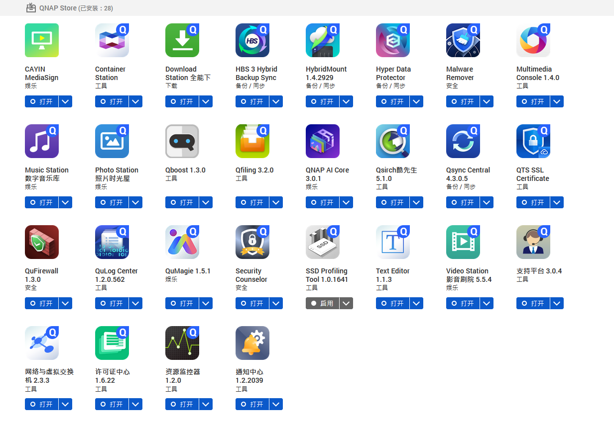
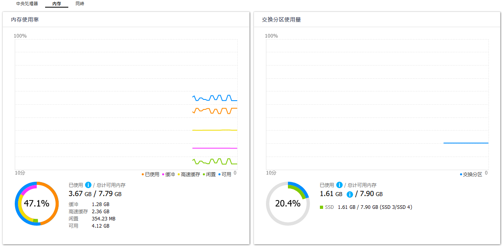

---
categories:
- Linux
date: 2021-06-01T00:00:00+00:00
draft: false
title: 威联通的QTS为什么会卡到起飞？附带优化方法
---

临近正式毕业，考虑到好多好多的数据需要留存和备份，博主我上了一台白的威联通NAS。作为一个使用群晖（黑）差不多有6年左右历史的老玩家来说，从群晖到威联通的这开始几天里，我一度怀疑这QTS的系统是不是个半成品来的，各种加载中、转圈圈、无响应，属实卡到起飞，简直被群晖的DSM按在地上摩擦。本来不想动QTS的系统，避免引起一些不必要的问题，但是这体验差劲到了极点，还是决定优化一下好了。

## 前言

博主我的NAS型号是威联通的TS-963N，一个9盘位的机子。选购前评估侧重存储和备份功能，经过钱包、文件系统（威联通ext4+lvm方案、威联通QuTS hero ZFS方案、群晖Btrfs）、硬件配置、需求等多方面评估后，决定选择了综合成本较低的TS-963N系列方案，综合存储方案如下：

  * 【数据盘】5块，DC级，3.5寸4T硬盘，RAID 6阵列
  * 【系统盘】2块，消费级，2.5寸1T硬盘，RAID 1阵列
  * 【缓存盘】2块，DC级，2.5寸128G MLC固态硬盘，RAID 1阵列

由于机器默认只配了一条4GB的内存，因此后续又买了一条4G的LPDDR3内存条。注意各位小伙伴在买内存条时建议买全新、靠谱颗粒的内存，我在狗东上买了一条联想的4G，拆开后看到是南亚的颗粒，还算挺满意的。

## 一点点忠告

如果你只是拿这个NAS来存东西，其他任何功能都不开的话，其实已经非常够用了，duck不必再沿着本文看下去了。如果你跟我一样，装了这么多东西（如下图）的话，那么可能你也需要优化一下了。



如果你跟我一样安装了这么多APP的情况下，仍然使用的4G的内存，那我真的建议你赶紧加到8G去或者更大。如果你用着4G的内存同时还是全机械盘运行，emmmm体验应该会非常爆炸了。

之前忘记在哪里看到，4G及以下内存不建议使用Qsirch，实际的Qsirch的内存消耗也确实不小（如下图）


整体的内存消耗情况如下图，可以看到实际可用的也就剩了一半，如果是4G的内存确实是会吃紧一些。




当然，即便是8G的内存，仍然使用了不少的交换分区容量。当第一优先级的交换分区位于机械硬盘时，频繁的页面置换操作会为硬盘带来大量的读写操作，增加硬盘负载。由于机械硬盘本身IOPS偏低，而虚拟内存（VM）抽象了物理内存和交换分区（含文件），因此操作系统在内存满时会通过页面置换将物理内存中的页交换到交换分区中，进而腾出来空间给其他程序继续执行。至于这里设置的值多少合适，仁者见仁智者见智吧，频繁触发页面置换能将不频繁使用的页置换出去为其他程序开辟更多内存，但是程序运行期间又会引起缺页异常，来回就会引发换入和换出，表现为对硬盘的，就是不停的读和写。由于Linux内存管理的设计上本身更倾向于将更多的内存用于cache而不是不活动的页，随着cache的增加，难免会继续造成交换。vm.swappiness决定了换出的时间，并不能决定换出的水位线，因此只要swap存在，早晚都会换入换出。

所以，解决问题的最终办法，就是——加内存，然后把数据存储卷上的swap全关了。毕竟，数据盘经不起这么折腾，系统盘大不了挂了就挂了，换一下也不影响啥。

```bash
#!/usr/bin/env bash

# disable all non ssd disk and file swap
swapoff /dev/md256
swapoff /dev/md322
swapoff /share/CACHEDEV4_DATA/.swap/qnap_swap

# set swappiness ratio
sysctl -w vm.swappiness=5
```
