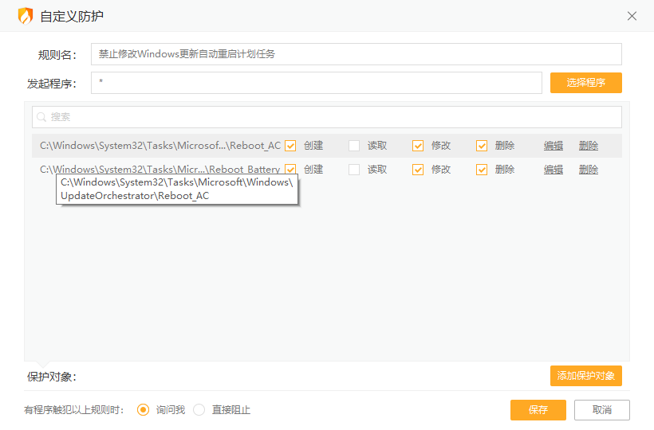
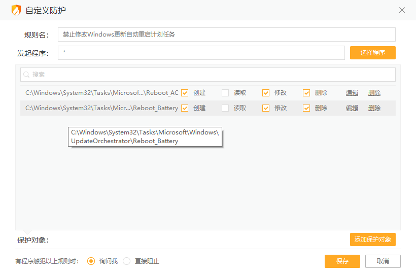
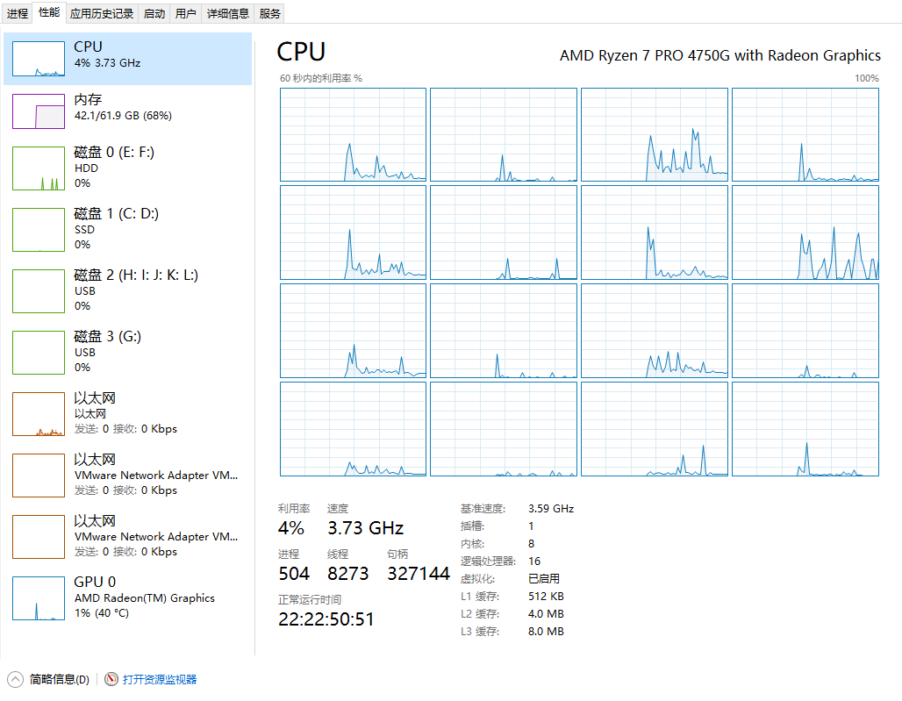

众所周知，Windows 10的系统更新往往会帮你自动重启电脑以完成更新，有时候挂着虚拟机在写东西呢，第二天再看，发现自动更新重启就帮我把虚拟机给关了，连挂起都不帮我挂起，一怒之下研究了一下怎么封杀这智障更新重启，确保系统更新能正常使用，但是规避掉自动重启。

## 准备

* 火绒

## 原理

Windows更新会在每次更新安装完后自动更新一个计划任务，以便到时间后自动重启电脑，那借助火绒目的是拦截掉修改该计划任务的操作。由于Windows的所有计划任务最后表现只是个文件，因此核心思想就是，使用火绒的文件保护，保护特定的计划任务文件，实现Windows更新想重启电脑时人工确认，不再自动重启。

## 步骤

▼ 进入火绒，在**设置**中找到**安全设置**。

▼ 点进去后，找到**自定义规则**。由于我已经添加上去了，因此看到会有图中的记录，接下来我们来看看防护具体规则。

▼ 需要保护这两个文件（即任务），路径在图中已经显示出来了，读取可以随意，但是修改、删除和创建需要保护。这样添加后，即可在Windows更新设置重启时弹出提示框（火绒），要求用户确认是否要允许其修改重启任务。

▼ 可以看到，保持开机时间已经有22天，即便有更新，Windows也就没办法再自动帮我重启了。

截止到再次修订本文时，我的电脑已经有4个更新挂起，开机已经38天，效果非常棒（笑

