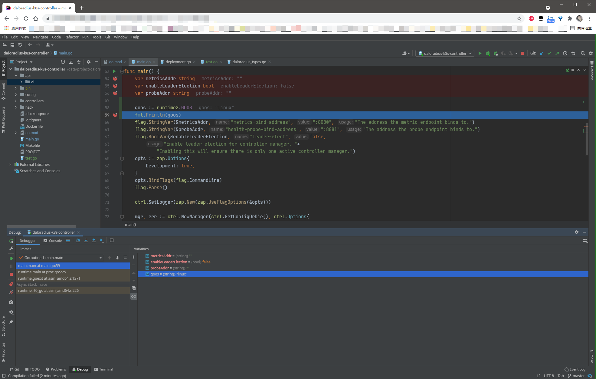

既可以拥有GoLand代码补全的能力，又可以在Windows上体验到原生的Linux编程调试过程，当开发环境和终端设备能够解耦开的时候，工程随行就成为了可能，开发效率再度+++++到底是什么东西能有这么香？我们来看看~

## 背景

众所周知，博主我长期使用Go语言从事基础设施开发，在这期间免不了经常会使用一些系统调用，那么在Windows上开发Linux程序时，每当调试就会非常头大。当然，后来我遇到了VSCode，Remote SSH这个插件真是让我立马卸载了JetBrains全家桶，**近乎**原生的远程开发和调试体验，实在不要太舒服。

但是！随着一段时间的使用，发现VSCode对Golang的自动补全能力实在是令人无法直视，尤其在面对API不熟的情况下，缺少GOPATH全量索引的VSCode顿时就显得暗淡了，博主我默默换回了GoLand&#8230;&#8230;甚至还发了一条朋友圈


请大家自行感受2333333

但是远程调试又好头大。直到今天，无意中发现了近乎完美的开发方式——Projector，让远程调试和GoLand的自动补全特性全部拥有

## 何方神圣？
> As you may know, Swing is a graphical widget toolkit for Java. Current JetBrains IDEs use Swing to draw the UI. The same is true for other IntelliJ-based IDEs, like Android Studio.
>
> Even though it is generally a good thing that JetBrains IDEs and Swing apps are desktop applications, there’s a number of corner cases, like thin clients, that require a special approach. This is where Projector comes in.
> 
> Projector is a self-hosted technology that runs IntelliJ-based IDEs and Swing-based apps on the server, allowing you to access them from anywhere using browsers and native apps.
> 
> Oleg Chirukhin, Access Your IDE Remotely With Projector. https://blog.jetbrains.com/blog/2021/03/11/projector-is-out/

在Jet家官方的Blog上，看到了一篇文章（如上引用）。由于我不是特别了解Java，但是就从字面意思来看，Jet家的IDE都是拿Swing这个东西去渲染的UI，包括基于Jet家IDE的Android Studio同样也是。Projector这个东西的出现，直接允许用户可以自托管Jet家的IDE和基于Swing的APP在自己的服务器上，然后借助浏览器访问。当然，官方也提供了Projector的Client，所以B/S、C/S全有了。

以前，VSCode有Code Server，现在，Jet家也出了Projector，而且均是开源的！当然许可证上或多或少有些差别，至于能否安安稳稳开源，此处就不过多讨论了，感兴趣可以去了解一下。

## 使用体验

博主我共部署了两个demo测试，一个服务器位于腾讯云香港，一个位于内网的虚拟机（同Region不同AZ）。

从延迟上来讲，成都到香港，延迟有46ms左右；成都内不同AZ间互访，延迟在8ms左右。在46ms延迟的情况下，浏览器端的GoLand体验还是略微差了些，操作响应速度还是挺明显的，略微影响开发，但是能用。在8ms延迟的情况下，浏览器端体验已经近乎原生应用程序，除了滚动时略微一些卡顿（几乎感觉不到），其他的几乎不存在影响交互体验的因素。

因此，如果你的内网有服务器并且互通延迟低于15ms，那恭喜你，Projector在内网的体验还是非常棒的。如果高于15ms，体验应该也没有太大差别，即便是46ms的延迟，也还是能用的（手动狗头。当然，延迟越低，体验越好啦~

目前我只观测了延迟，至于带宽容量上需要保障多少，就不知道了，还需要大家自行去探索~<figure class="wp-block-image size-large">



香吗？

## 如何使用？

如果仅在内网使用，其实完全可以按照官方的快速安装文档来，即直接监听HTTP，直接起服务，即可运行。

此处，我将Projector部署在了内网的虚拟机中，由于本身就有私有的CA，因此也就顺手把SSL证书签发啦~

此处使用的CentOS 7系统，不同版本的CentOS依赖上不通用，如果是其他发行版更不通用。如果系统存在差异，请自行查看文档[^1]寻找对应的安装方式
[^1]:Projector Installation. https://github.com/JetBrains/projector-installer#Installation

### 依赖安装

首先，安装相关依赖。此处我直接使用了root用户安装，是否使用root还需结合自身情景考量，如果非root运行还请再查看文档~

```bash
yum install python3 python3-pip pyOpenSSL python-cryptography
python3 -m pip install -U pip
yum install less libXext libXrender libXtst libXi freetype -y
pip3 install projector-installer
source ~/.bash_profile
```

### Projector配置

初次使用，需要先install一下安装所需的IDE，大致流程就像下边这样

```bash
[root@T-K8S-M ~]# projector install 
Checking for updates ... done.
Installing IDE in quick mode; for full customization you can rerun this command with "--expert" argument or edit this config later via "projector config edit" command.
           1. Idea_Community
           2. Idea_Ultimate
           3. PyCharm_Community
           4. PyCharm_Professional
           5. CLion
           6. GoLand
           7. DataGrip
           8. PhpStorm
           9. WebStorm
          1.  RubyMine
          2.  Rider
          3.  DataSpell
          13. MPS
Choose IDE type or 0 to exit: &#91;0-13]: 6
Do you want to select from Projector-tested IDE only? &#91;y/N]
           1. GoLand 2021.1.3
           2. GoLand 2021.1.2
           3. GoLand 2021.1.1
           4. GoLand 2021.1
           5. GoLand 2020.3.5
           6. GoLand 2020.3.4
           7. GoLand 2020.3.3
           8. GoLand 2020.3.2
           9. GoLand 2020.3.1
          10. GoLand 2020.3
          11. GoLand 2020.2.4
          12. GoLand 2020.2.3
          13. GoLand 2020.2.2
          14. GoLand 2020.2.1
          15. GoLand 2020.2
          16. GoLand 2020.1.4
          17. GoLand 2020.1.3
          18. GoLand 2020.1.2
          19. GoLand 2020.1.1
          20. GoLand 2020.1
          21. GoLand 2019.3.4
          22. GoLand 2019.3.3
          23. GoLand 2019.3.2
          24. GoLand 2019.3.1
          25. GoLand 2019.3
Choose IDE number to install or 0 to exit: &#91;0-25]: 1
Installing GoLand 2021.1.3
Downloading goland-2021.1.3.tar.gz
&#91;##################################################]  100%          
Unpacking goland-2021.1.3.tar.gz
&#91;##################################################]  100%          
Configuration name: GoLand
Checking for updates ... done.
To access IDE, open in browser 
        http:&#47;&#47;localhost:9999/

To see Projector logs in realtime run
        tail -f "/root/.projector/configs/GoLand/projector.log"

Exit IDE or press Ctrl+C to stop Projector.
```

紧接着，初次使用后会产生配置文件，此处我修改了一下配置，更改监听地址和HTTPS设置。

默认设置下，端口监听绑定在通配符上，没有必要，可以绑定单个接口IP地址即可~同时，需要特别注意的是，设置的所谓的密码其实只是个token，该token存在于URL的参数中，因此建议生成随机字符串作为token，避免使用自己常用的密码，以免不小心泄漏。

```bash
[root@T-K8S-M ~]# projector config edit
Checking for updates ... done.
Edit configuration GoLand
Enter the path to IDE (<enter> for /root/.projector/apps/GoLand-2021.1.3, <tab> for complete): 
Enter a Projector listening port (press ENTER for default) [9999]: 9999
Would you like to specify listening address (or host) for Projector? [y/N]y
Enter a Projector listening address (press ENTER for default) [*]: <这里输入你要绑定的IP地址>
Would you like to specify hostname for Projector access? [y/N]
Use secure connection (this option requires installing a projector's certificate to browser)? [y/N]y
Would you like to set password for connection? [y/N]y
Please specify RW password:
Repeat password:
Would you like to set separate read-only password? [y/N]n
           1. tested
           2. not_tested
Choose update channel or 0 to keep current(not_tested): [0-2]: 0
done.
```

最后，当然是安装自己CA签发下来的证书辣~

```bash
[root@T-K8S-M apps]# projector install-certificate --certificate /root/server.pem --key /root/server-key.pem 
Checking for updates ... done.
Installing /root/server.pem certificate to config GoLand
```

所以，**总共配置过程**，其实也就如下三个步骤而已，如有其他配置需要，还需自行查找文档~

```bash
projector install
projector config edit
projector install-certificate --certificate /root/server.pem --key /root/server-key.pem
```

### 安装服务

现在，Projector可以被我们手工启动起来了，要做到后台运行和crash自动重启，还得需要systemd帮忙拉起。

那就直接安装进systemd的服务里去吧~其中，**ExecStart的路径需要根据自身环境进行修改**，确保定位到对应的run.sh

```bash
cat << EOF > /etc/systemd/system/goland.service
[Unit]
Description=Jetbrains Projector - GoLand
 
[Service]
Type=simple
ExecStart=/root/.projector/configs/GoLand/run.sh
Restart=always
 
[Install]
WantedBy=default.target
EOF

systemctl daemon-reload
systemctl enable --now goland.service
```

### 运行状态

最后，我们即可通过`systemctl status goland.service`看到服务的状态。如果明明显示running了却还无法在自己电脑上打开，**请检查你的防火墙**！！！

```bash
● goland.service - Jetbrains Projector - GoLand
   Loaded: loaded (/etc/systemd/system/goland.service; enabled; vendor preset: disabled)
   Active: active (running) since Sat 2021-07-24 14:31:28 HKT; 1h 25min ago
 Main PID: 2687 (run.sh)
    Tasks: 70
   Memory: 1.9G
   CGroup: /system.slice/goland.service
           ├─ 2687 /bin/sh /root/.projector/configs/GoLand/run.sh
           ├─ 2701 /root/.projector/apps/GoLand-2021.1.3/jbr/bin/java -classpath /root/.projector/apps/GoLand-2021.1.3/lib/bootstrap.jar:/root/.projector/apps/GoLand-2021.1.3/lib/util.jar:/root/.projector/apps/GoLand-...           ├─ 2952 /root/.projector/apps/GoLand-2021.1.3/bin/fsnotifier64
           ├─22602 /bin/bash --rcfile /root/.projector/apps/GoLand-2021.1.3/plugins/terminal/jediterm-bash.in -i
           ├─31653 /root/.projector/apps/GoLand-2021.1.3/plugins/go/lib/dlv/linux/dlv --listen=0.0.0.0:34195 --headless=true --api-version=2 --check-go-version=false --only-same-user=false exec /data/project/daloradiu...           └─31658 /data/project/daloradius-k8s-controller/bin/daloradius_k8s_controller

Jul 24 15:42:02 T-K8S-M run.sh[2687]: [DEBUG] :: IdeState :: "set keymap to match user's OS (WINDOWS)" is done
Jul 24 15:42:12 T-K8S-M run.sh[2687]: [INFO] :: ProjectorServer :: *.*.*.* connected.
Jul 24 15:42:14 T-K8S-M run.sh[2687]: [DEBUG] :: IdeState :: Starting attempts to set keymap to match user's OS (WINDOWS)
Jul 24 15:42:14 T-K8S-M run.sh[2687]: [DEBUG] :: IdeState :: "set keymap to match user's OS (WINDOWS)" is done
Jul 24 15:42:24 T-K8S-M run.sh[2687]: [INFO] :: ProjectorServer :: *.*.*.* connected.
Jul 24 15:42:25 T-K8S-M run.sh[2687]: [DEBUG] :: IdeState :: Starting attempts to set keymap to match user's OS (WINDOWS)
Jul 24 15:42:25 T-K8S-M run.sh[2687]: [DEBUG] :: IdeState :: "set keymap to match user's OS (WINDOWS)" is done
Jul 24 15:43:03 T-K8S-M run.sh[2687]: [INFO] :: ProjectorServer :: *.*.*.* connected.
Jul 24 15:43:04 T-K8S-M run.sh[2687]: [DEBUG] :: IdeState :: Starting attempts to set keymap to match user's OS (WINDOWS)
Jul 24 15:43:04 T-K8S-M run.sh[2687]: [DEBUG] :: IdeState :: "set keymap to match user's OS (WINDOWS)" is done
```

不愧是Jet家的东西，刚启动内存就吃了1.3G，运行调试时就到了1.9G，还是挺吓人的。各位小伙伴在用的时候还是得要给大点内存，以免OOM了。

## 写在结尾

Projector也有CS架构中的Client，体验一样非常舒服，可以在Toolbox中下载~

Projector也有Docker版本，但是毕竟开发需要，需要各种环境，还是建议直接在宿主中安装体验会好一些~后续安装其他系统依赖时也会方便很多。

当然，以官方的说法来说，Projector仍然还是一项非常年轻的技术，它可能一时还不能用于生产环境，日常使用时可能也会存在其他问题，还需要时间成长。博主我在短时间使用中，就发现了其在FireFox浏览器中无法正常输入的问题，暂时还没有定位原因，可能也会潜在其他的小问题，使用Client或许能够较大提升使用体验。

最后，如果你喜欢，可以在使用时遇到问题时多多向社区反馈，甚至是去提交你的commit，让这个年轻的软件为自己所用时也变得更好。

> Projector is a technology rather than an end-user solution. You can use it to customize your own infrastructure to meet the needs of your business. Ansible? Sure. Kubernetes? No problem.
> 
> You can build anything you want – assuming you have enough technical expertise. The code is open source, so there is nothing restricting you from changing whatever you want, or even contributing back to it! You can find more information, along with the most important server-side code, here on GitHub.
> 
> Projector still is a very young technology, but we believe that it has the potential to become one of the best solutions for remote IDE access. We’d be glad to hear your feedback. You can contact us anytime through YouTrack and Twitter.
> 
> Oleg Chirukhin, Access Your IDE Remotely With Projector. https://blog.jetbrains.com/blog/2021/03/11/projector-is-out/
