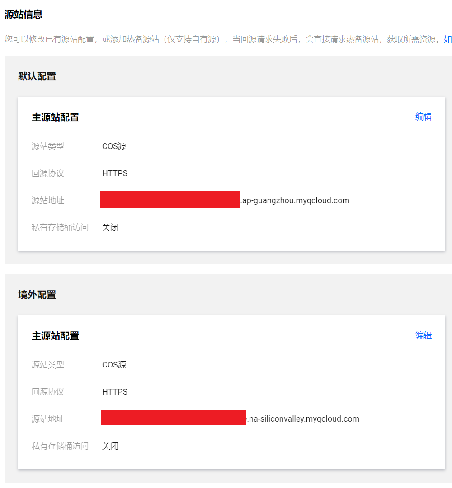

雪糕博客建站6年来，来来回回搬站可谓搬了无数次。WordPress、Typecho、Hexo，几乎市面上成熟一些的博客系统都被换了一遍，这次，我们来换个Hugo看看（逃

当你看到这篇文章时，即代表雪糕博客已经完成了新一轮的全站迁移工作了，从原本的WordPress迁移到了Hugo。换了一个崭新的面貌，换了一个崭新的交互体验~早些时候的文章在迁移过程中，多多少少可能受到了点改动，也可能会有了些错误，这也无可避免了，只能慢慢发现再去改正了。后续的文章，就要向着新博客看齐辣~

## 区别

Hugo和Hexo比较类似，都是渲染出纯静态的页面，对比WordPress、Typecho等动态博客系统来讲，这些动态的博客系统就是请求一次渲染一次，将内容传送给客户端。

16年还是17年的时候，曾经试水过Hexo作为博客系统。那时候，没有流水线这个技术，CI/CD也不成熟，写完的md就要手工使用使用`npm`进行服务端渲染，然后再手工推送到对象存储中，即便是省事到极致，也无非可能是还要有一台服务器协助每次构建和推送，相当之麻烦。现在，GitHub的Action完美帮助解决了这个问题，博客的源文件可以直接存放进仓库去，借助Action即可在每次推送后触发构建和推送更新，可谓非常舒服。

上边我们提到了WordPress等动态博客系统，它们在服务端完成渲染，因此一定得需要服务器支撑，博客才能打开。即便是也有一些使用WordPress RESTful API的主题，博主也体验了一下，体验不是特别好，问题还是比较多的。而且其架构上决定了，几乎没有无服务器计算的可能。然而，像Hugo或者Hexo的博客系统，它们仅仅是个渲染器，把你的md文章渲染出来，一整个博客就是一堆html静态文件，我们只需要扔到托管静态页面的服务商那里去，即可上线博客。

## Hugo的优势

其实不能说是Hugo的优势，应该说的静态博客的优势。我把它们总结为如下这些特性：
* 静态了，不用买服务器了，省钱。成本瞬间降到原本的十分之一不到
* 多地域同步成为了可能，回源可以有多个选择，这个特性对同时有海内外访客访问的站点来说，可谓相当有益处
* 也不用再采购WAF了，又省下一笔
* 博客放在GitHub，还可以被封存起来留给后人（笑
* 完美兼容公众号。当全站启用服务端渲染不使用前端渲染时，文章（含样式）可以无缝和公众号同步（前提是微信允许的样式）
* 省掉了服务器的维护工作，SLA也有了保障
* 写博客也可以用Typora或者VSCode了
* 这个特性我不确定是不是Hugo特有的——模板渲染。这个特性非常棒，以至于我可以任意改动主题的任何一个layout，也可以插入自己的template到特定的layout去。配合Git一来，改动主题的同时又可以同步上游更新，直接解决了以往WP的痛点
* 有流水线的加持下，静态博客最大的问题似乎已经被解决了，反之对比生态来看，不得不说现在js还是挺强的，轮子实在是太多了

## 中间存在的问题

存在的最大的问题，可能就是迁移工作了。这个迁移工作整整持续了一个月，我才终于把博客从WorePress迁出。尽管Hugo有提供导出工具，尽管我还自己写了个Python的脚本专门来处理Markdown，但是还是工程量非常大。
原因出自于，WordPress的文中存在众多的转义、标签，情况太多，以至于时间成本上来说，已经不如人工修正划算了。

其他的，都是小问题。

## 部件

雪糕博客静态版（Hugo），总共借助了这几个部件支撑：
* Hugo
* PaperMod主题，经过雪糕修改，增加了公众号支持和ICP备案号[^1]
* GitHub，托管博客的源代码文件，并负责自动构建和推送[^2]
* 腾讯云COS，存储最终构建产生的文件
* 腾讯云CDN，负责面向全球的资源缓存和分发
* 百度统计
* hugo-notice，用于支撑文中的Tips、Notice等提示内容样式[^3]
* utteranc，一个低权限的评论系统（借助GitHub Issue实现）[^4]
* COS推送工具（全球加速版），经过雪糕修改[^7]。仅仅只支持全球加速COS，用于解决GithHub Action在国际网络的情况下推不进国内COS的问题
* COS推送工具（原版）[^8]。用于推送到境外COS

[^1]: https://github.com/ic0xgkk/xuegao-blog-PaperMod
[^2]: https://github.com/ic0xgkk/xuegao-blog
[^3]: https://github.com/martignoni/hugo-notice
[^4]: https://utteranc.es/
[^7]: https://github.com/XUEGAONET/tencent-cos-action
[^8]: https://github.com/zkqiang/tencent-cos-action

可以看到，依赖了相当多的GitHub的内容，其平台的生态，可谓真的强大。

## 上线过程

此处就记录一下，新方案的博客上线过程中，做的一些比较重要的工作好了。

### 增加微信公众号的代码块[^5]

其实这个就是借助模板渲染，我只需要在content的块之前加入一个放二维码的块，然后再在layouts里加载即可。

这个做法需要对主题进行侵入式修改，期初我本身不是特别愿意进行侵入式修改的，以免后续上游更新之后造成冲突。但是转而一想，如果将layouts从主题挪进根目录的layouts，上游修改之后反而更没有办法同步。因此，此时最好的解决办法就是——fork一下，随后上游有改动的情况下手工去点一下fetch，或者使用GitHub的Pull APP就可以解决问题了。

```html
  {{- if (.Param "enableContentHeader") }}
    {{/* 文章头部-开始 */}}
    {{- partial "content_header.html" -}}
    {{/* 文章头部-结束 */}}
  {{- end}}

  {{- if .Content }}
  <div class="post-content">
    {{- if not (.Param "disableAnchoredHeadings") }}
      {{- partial "anchored_headings.html" -}}
    {{ end }}
    {{- .Content -}}
  </div>
  {{- end }
```

[^5]: https://github.com/ic0xgkk/xuegao-blog-PaperMod/commit/1381b11c0f8b5ada1e689b0a965698b0f6f77d2e

### 增加备案号的代码块[^6]

这个原理同上

```html
 <span>{{ .Site.Copyright | markdownify }}</span>
    {{- else }}
    <span>&copy; {{ now.Year }} <a href="{{ "" | absLangURL }}">{{ .Site.Title }}</a></span>
    {{- end }} 

    {{- /* 备案号信息 */ -}}
    {{- with .Param "ChinaBeianNumber" }}
        |
        <span>
            <a href="http://www.beian.gov.cn" rel="noopener noreferrer" target="_blank">{{.}}</a>
        </span>
        <br>
    {{- end }} 

    <span>
        Powered by
        <a href="https://gohugo.io/" rel="noopener noreferrer" target="_blank">Hugo</a> &
        <a href="https://git.io/hugopapermod" rel="noopener" target="_blank">PaperMod</a>
    </span>
```
[^6]: https://github.com/ic0xgkk/xuegao-blog-PaperMod/commit/41f6a1ce6cd58ec0d16a9cb4f37d8ebd067873fd

### 国内COS的推送问题

这是一个老问题，直到2021年，它依旧令人困扰，那就是——国际网络和大陆网络互通的质量问题。

GitHub Action构建之后的文件，由于网络原因，无法正常同步进COS去，真搞笑。好在，腾讯云官方提供了全球加速，恰到好处解决了这个问题。但是，又很遗憾的，目前GitHub商店里的COS推送工具，唯独只有这一个[^8]能用，官方提供的反而是无法正常使用的。这我是真的迷

由于这个工具[^8]借助COS官方的COSCMD实现，原作者在实现这个工具时，没有支持到自定义的Endpoint，以至于无法支持全球加速推送；即便是我的修改版[^7]支持了全球加速，这个工具会告诉你它不支持全球加速模式下的删除操作。那么就会带来一个问题，当存储桶内需要增量同步且需要删除本地已经不存在的文件的时候，操作就会失败。是的，你没有看错，就是这么迷。

但是好在，有一个变相解决问题的方式，就是，先全球加速同步一次把文件传上去，再使用地域直接访问来删除掉本地已经不存在的文件，即可。这样一个操作，换做GitHub Action写，就是下边这样

```yaml
      # 发布到腾讯云COS中，使用全球加速
      # 由于腾讯云的cli工具设计问题，全球加速时无法进行同步删除
      # 为了解决这个问题，不得不先全球加速同步推送，再使用地域同步以删除不需要的文件
      # 推送文件需要保证速度，同步删除则不急，因此允许网络不稳定的情况下等待下一次Action触发再尝试删除
      
      # 使用全球加速同步推送一次
      # 这个阶段同步删除时会报错，但是不影响继续执行
      # 国内源站COS
      - name: Upload to Accelerate COS in China
        uses: XUEGAONET/tencent-cos-action@v0.2.0
        with:
          args: upload -rsf --delete ./public/ /
          secret_id: ${{ secrets.TENCENT_CLOUD_SECRET_ID }}
          secret_key: ${{ secrets.TENCENT_CLOUD_SECRET_KEY }}
          bucket: ${{ secrets.COS_BUCKET }}

      # 使用地域，再次同步推送一次。此时由于MD5验证都通过，因此只会删除本地已经不存在了的文件
      # 国内源站COS
      - name: Sync Deleting in China
        uses: zkqiang/tencent-cos-action@v0.1.0
        with:
          args: upload -rsf --delete ./public/ /
          secret_id: ${{ secrets.TENCENT_CLOUD_SECRET_ID }}
          secret_key: ${{ secrets.TENCENT_CLOUD_SECRET_KEY }}
          bucket: ${{ secrets.COS_BUCKET }}
          region: ap-guangzhou
```

注意提前添加其中的secret噢~

### 全球请求回源的问题

还是受到大陆特色网络的影响，海外的请求通过CDN回源时，质量仍然会不佳。这个问题我专程开了个工单，得到的回复是：

> cdn跨境回源的话是走的国际网络回源，暂无优化线路。
> 
> cdn不保证跨境回源都是正常的，建议加速区域与源站地域在一块。

对于这个问题，如果要解决，只能海内外回源分开了。那么考虑了一下，采取了这样的做法：海内外分开，放两个桶，默认回源回国内的桶，配置一个特殊回源，让海外请求回源回到海外的桶。这样一来，同一个域名下的请求回源就分开了，就可以保障海内外访问质量了。这样的做法也得到了认可，确实可以这样搞。

这样一来，仅仅只需要再开一个海外的桶，将渲染出的静态文件推完国内的之后，再推一次海外的就好了。

所以在GitHub的Action里，就要加下边这样一个Step

```yaml
      # 海外源站COS
      - name: Sync to International COS
        uses: zkqiang/tencent-cos-action@v0.1.0
        with:
          args: upload -rsf --delete ./public/ /
          secret_id: ${{ secrets.TENCENT_CLOUD_SECRET_ID }}
          secret_key: ${{ secrets.TENCENT_CLOUD_SECRET_KEY }}
          bucket: ${{ secrets.COS_BUCKET_G }}
          region: na-siliconvalley
```

最后，在CDN上配置一个特殊回源就好啦。




### CDN缓存设置

我认为，Hugo比较好的一个做法，就是，它的css全部加上了SHA256，这样一来CDN在缓存css时就可以尽可能加长缓存时间了，反正只要SHA256不变，我们就可以认为这个文件就是同一个，也不必再去关注它的参数了。

```cmd
harris@harris-mPC MINGW64 /e/Download/Gene
$ curl.exe https://blog.xuegaogg.com/assets/css/stylesheet.min.4a1f41ec8670d6a9c9bbcbc6e01af9d22b8227fb47fa229a7ed74047b46d7af5.css -o stylesheet.min.4a1f41ec8670d6a9c9bbcbc6e01af9d22b8227fb47fa229a7ed74047b46d7af5.css
  % Total    % Received % Xferd  Average Speed   Time    Time     Time  Current
                                 Dload  Upload   Total   Spent    Left  Speed
100 14385  100 14385    0     0   175k      0 --:--:-- --:--:-- --:--:--  177k

harris@harris-mPC MINGW64 /e/Download/General
$ sha256sum.exe stylesheet.min.4a1f41ec8670d6a9c9bbcbc6e01af9d22b8227fb47fa229a7ed74047b46d7af5.css
4a1f41ec8670d6a9c9bbcbc6e01af9d22b8227fb47fa229a7ed74047b46d7af5 *stylesheet.min.4a1f41ec8670d6a9c9bbcbc6e01af9d22b8227fb47fa229a7ed74047b46d7af5.css
```

因此，CDN的配置也可以友好很多，直接使劲加缓存就好了。（笑


