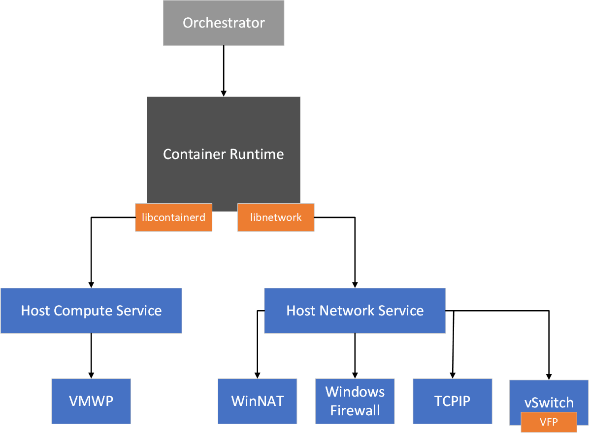
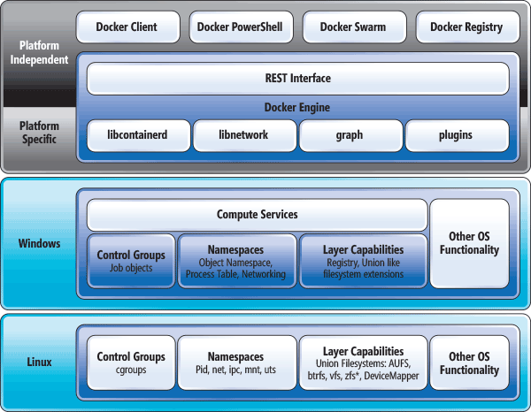
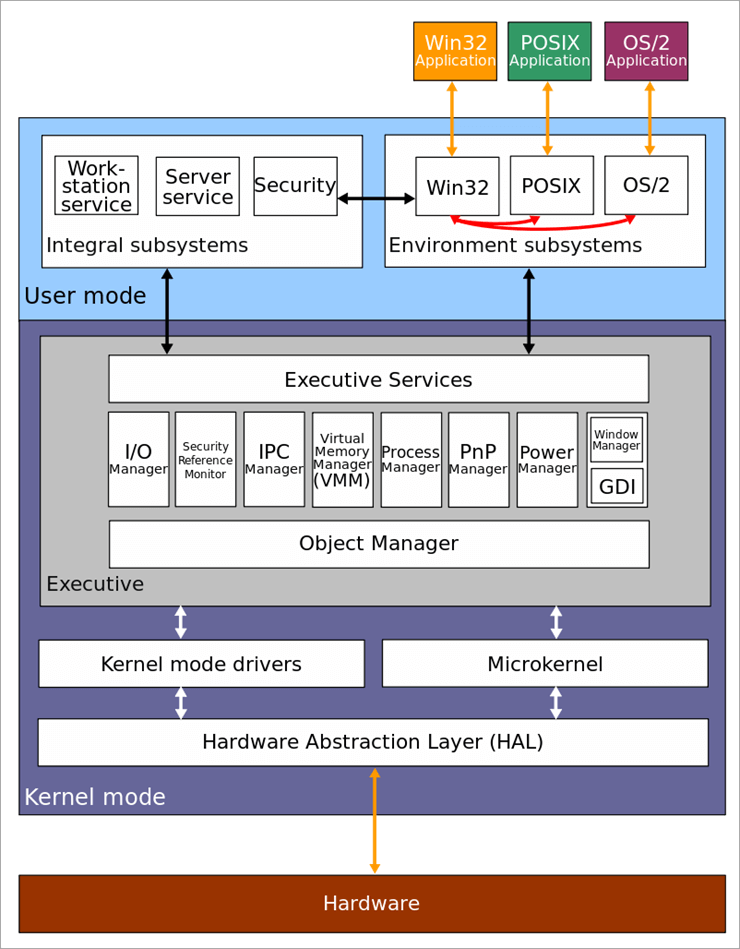
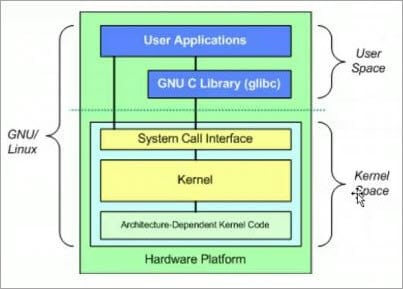

众所周知，Linux下有多种类型的namespace，它们共同实现了容器这一最终形态，进而向上交付出了Kubernetes这样一个精品。那么当Kubernetes运行在Windows上时，它所依靠的技术发生了什么变化？作为一个f\*\*k Windows的忠实用户来说，起初看到Windows还能Kubernetes，让我大跌眼镜，甚至一度觉得这很不Kubernetes，毕竟以往Windows的稳定性、系统设计等已经给我留下了深刻的、极差的印象。这篇文章，我们一块来看看Windows，到底是怎么Hold住Kubernetes的，真的能好好Hold住吗？

## 都什么玩意？

此处，我就不再介绍Kubernetes了，由于我是从事网络系统部分的，因此接下来我们直接从它的网络设计[^1]开始。

[^1]: Intro to Windows support in Kubernetes. https://kubernetes.io/docs/setup/production-environment/windows/intro-windows-in-kubernetes/#networking

> Each container has a virtual network adapter (vNIC) which is connected to a Hyper-V virtual switch (vSwitch). The Host Networking Service (HNS) and the Host Compute Service (HCS) work together to create containers and attach container vNICs to networks. HCS is responsible for the management of containers whereas HNS is responsible for the management of networking resources such as:
> 
> * Virtual networks (including creation of vSwitches)
> * Endpoints / vNICs
> * Namespaces
> * Policies (Packet encapsulations, Load-balancing rules, ACLs, NAT'ing rules, etc.)
> 
> The following service spec types are supported:
> * NodePort
> * ClusterIP
> * LoadBalancer
> * ExternalName

从支持类型上来说，支持的挺齐全的，有点出乎意料。在上边这段引用中，可以看到这个模式其实和VMware Workstation差不多，也和常规的桥来说没差多少。

> The Host Networking Service (HNS) and the Host Compute Service (HCS) work together to create containers and attach endpoints to a network. You can interact with HNS through the HNS Powershell Helper Module.
> 
> **Container Network Management with Host Network Service**[^1]

可以看到，HNS和HCS相互依存，去创建容器并且把**终点**（Endpoint）添加到**网络**（Network）中。根据官方的说法，HNS与HCS职责也不同，理清整篇文章之后[^1]，我这么理解这玩意（HNS）的职责：
* 创建**网络**
  * 为每个**网络**创建Hyper-V交换机
  * 如果需要，创建NAT和IP池
* 创建**终点**
  * 为每个容器**终点**创建对应的命名空间
  * 将vNIC添加到**网络**命名空间中（HNS与HCS均有）
  * 创建交换机的端口
  * 为**终点**分配IP地址、DNS、路由等

看完了文章，我愣是没看明白它在讲啥，不愧是Windows。不过，它下边一张图倒是更清晰了一些

看完了这张图，我仍然是云里雾里的。至少在这个图里，我们得到了两条有用的信息：HCS封装出了容器的运行时接口（CRI），HNS封装出了容器的网络接口（CNI）。

这么一来，上边这些内容也就搞明白了。HNS管理着虚拟交换机，它要去创建交换机、端口、地址池、命名空间；HCS管理容器运行时，因此创建基本的运行环境也就是靠它了。那么，接下来我们就把重点放在HNS上了，至于它与HCS的交集，等遇到了再看。

从上边的图片来看，Linux容器实现借助`namespace`隔离，在Windows里，则是通过VMWP隔离。那么这个VMWP是什么？查了一下资料[^2]，得到了这么个东西——VM Worker Process。可还行，这么看Windows容器的本质，原来就是个虚拟机？

## 原来就是个虚拟机？

此时，正好看到了这么一张图[^4]

从这张图来看，Windows本身是可以支持内核在容器间的共享的。那么再深究一下，看到了这么一篇文章[^3]，原来Windows对于容器的隔离是支持两种模式的，一种就是借助虚拟化的方式将其从内核层面上隔离，另外一种就是共享宿主内核只隔离进程。但是，微软称Hyper-V隔离的形式为`enhanced`，称共享宿主内核的形式成`traditional`，这真是令我没想到。我们刚刚所看到的内容[^4]就是来源于微软对于`traditional`模式的解读。看起来Windows本身似乎对容器的支持就不是特别好，以至于Hyper-V的方式成为了香饽饽。虽然我们一贯认为Hyper-V属于半虚拟化，在微软的优化下确实可能是一个比较好的兼备的方式，但是不得不说这个思路还是比Linux的容器要重了太多。

微软的Windows基础团队也很苦恼Windows上的容器问题，尝试了Drawbridge[^6]、Server silos（我也没看明白这是啥玩意），最后silos经过迭代才有了现在的production-ready版本。

[^8]: Windows Server Containers. https://docs.microsoft.com/en-us/archive/msdn-magazine/2017/april/containers-bringing-docker-to-windows-developers-with-windows-server-containers

在看silos之前，了解一下Drawbridge是什么玩意。这还得从ASPLOS 2011年的一篇中选的论文[^7]说起，这篇论文提出了一个库操作系统的概念，微软在Windows 7上实现了其库操作系统这么一个东西，甚至还把Office那一套、IE、IIS借助这东西跑了起来，但是因为其存在蛮多局限性，最后也没能用于容器场景[^8]。

最后，反而是silos借助现有的Windows Job Objects做出来了原型，一波三折之后终于能够用了。存储、网络、内存等，相关工作还是借助文件系统、网络隔离、内存管理和调度抽象来实现。官方也提到，silos本身实现的进程分组、资源控制也和Linux的cgroup非常相似。但是，在Linux中，容器中通常会运行一个进程，它们和宿主、其他容器共享系统内核的服务；Windows为了提高可用性和安全性，其将很多代码挪到了内核外部，通过用户态去执行，这样一个模式已经持续了好多年，因此也带来了不小问题。权衡之后，Windows选择了一部分服务对容器可见，一部分服务在每个容器中均保留一份。

[^6]: Drawbridge. https://www.microsoft.com/en-us/research/project/drawbridge/
[^7]: Donald E. Porter, Silas Boyd-Wickizer, Jon Howell, Reuben Olinsky, Galen Hunt. Rethinking the Library OS from the Top Down. Proceedings of the 16th International Conference on Architectural Support for Programming Languages and Operating Systems (ASPLOS), March 2011. Published by Association for Computing Machinery, Inc. https://www.microsoft.com/en-us/research/wp-content/uploads/2016/02/asplos2011-drawbridge.pdf

所以，Windows容器的本质，可以是虚拟机，也可以是个容器。当你选择Hyper-V模式时，它就可以运行在Hyper-V中，与宿主完全独立并且使用各自的内核；当你选择进程隔离模式时，它就借助silos仅仅隔离进程来运行容器，然后大家一起来共用一个内核。

## 镜像为啥这么大？

> A container is an isolated, lightweight silo for running an application on the host operating system. Containers build on top of the host operating system's kernel (which can be thought of as the buried plumbing of the operating system), and contain only apps and some lightweight operating system APIs and services that run in user mode, as shown in this diagram.
>
> **Container architecture**[^5]

[^5]: Containers vs. virtual machines. https://docs.microsoft.com/en-us/virtualization/windowscontainers/about/containers-vs-vm

这上边这段话可以看到，Windows设计的容器，“仅仅”包含了Apps和一些轻量的操作系统的API以及服务，emmmm确实挺轻量。不过，这个Service里，都是些什么玩意？以至于一个镜像竟然能这么鬼大？

上边的内容我们提到过了，Windows对比Linux其很多服务被挪到了内核外实现，其不像Linux一样拥有系统调用，高级特性全部是通过系统服务和dll实现，如果需要隔离，只能复制一份必要的系统服务和全量的系统dll，免不了进一步涨大镜像体积。如果想精简Windows的
镜像，**在参考当前设计思路的情况下**，只能剪裁掉容器内应用不需要的用户态的内核特性、不需要的运行库。但是！有没有途径剪裁以及剪裁了会不会出问题，就是另外一回事了。

所以免不了，镜像的体积就会特别大。

## 设计造成了它们先天性有什么差别？

截止到这里，我们差不多了解了Windows容器的原理了[^9]。最后，再来看看它的结构[^8]：

[^9]: A short introduction to Windows Containers. https://medium.com/@justen.walker/a-short-introduction-to-windows-containers-db5adc0db536
[^4]: Windows and containers. https://docs.microsoft.com/en-us/virtualization/windowscontainers/about/
[^3]: Isolation Modes. https://docs.microsoft.com/en-us/virtualization/windowscontainers/manage-containers/hyperv-container
[^2]: Attacking the VM Worker Process. https://msrc-blog.microsoft.com/2019/09/11/attacking-the-vm-worker-process/

然后，我们再来回到网络部分。结合上边的内容，我应该可以把Windows中的Network、Endpoint大致理解为类似Linux VETH对一样的全双工管道，由内核管理，通过宿主、容器中的子系统安装为接口并配置地址、路由等信息。

我们来看看Windows内核[^13]和Linux内核[^13]的结构。图片年代可能比较久远了，我们暂且只需要关注整个子系统/组件区别即可。

[^13]: Linux Vs Windows Difference: Which Is The Best Operating System?. https://www.softwaretestinghelp.com/linux-vs-windows/

其实差别主要也就集中在内核API上，问题也都出在了这里。

看过flannel中是如何实现Windows的网络部分的[^12]代码（库文档[^10]）之后，其实发现逻辑似乎和netlink的差不多。

[^12]: https://github.com/flannel-io/flannel/blob/fca1560c91cc44f3c15355b0c2de431a2b7dbf23/backend/vxlan/device_windows.go

[^10]: hcsshim. https://pkg.go.dev/github.com/microsoft/hcsshim

从设计上来讲，对比Windows和Linux的内核，我们大致可以知道这么两件事：
* Windows的支持度还是差了点，毕竟Linux的接口模型还是太丰富了。具体可以查看我早期一篇文章：[Linux虚拟网络接口模型概述](https://blog.xuegaogg.com/posts/497/)，公众号文章可能要点击原文才能打开该链接。
* 使用Windows容器，无法避免镜像体积过大的问题
* Hyper-V模式下，容器管理宿主的Object，停留在我目前的认知上来说，除了逃逸否则应该是没有可能了。进程隔离模式下，容器如果管理宿主的Object，当该服务API从宿主暴露进容器内部或者有额外的IPC实现方式时，可能还会是可能的

## 总结

说真的，这篇文章最后我自己看起来都觉得有一种只写了一半的感觉。因为实在是很艰难，博主我工作涉及网络这部分，免不了要去支持Windows，整Windows网络的同时，发现这Windows这东西连个文档都不全，网上能提供帮助的文章也是少之又少。

吐槽完了Windows，虽然主观上认为它很垃圾，但是这似乎也是它的优点。相信经过刚刚的内容，你也看到了，Windows设计之初为了可用性和安全性做了一些独特的设计，也正是这些设计导致了容器本身没有办法“微”起来。系统差异造成了上层其他实现的差异，也不能说Windows做的差劲，只能说面向这个需求时真的麻烦了一些吧，再加上闭源...也没办法，鱼与熊掌不可兼得吧。

最后的最后，如果真的要问我能hold的住吗？我觉得，路还不是很好走。
