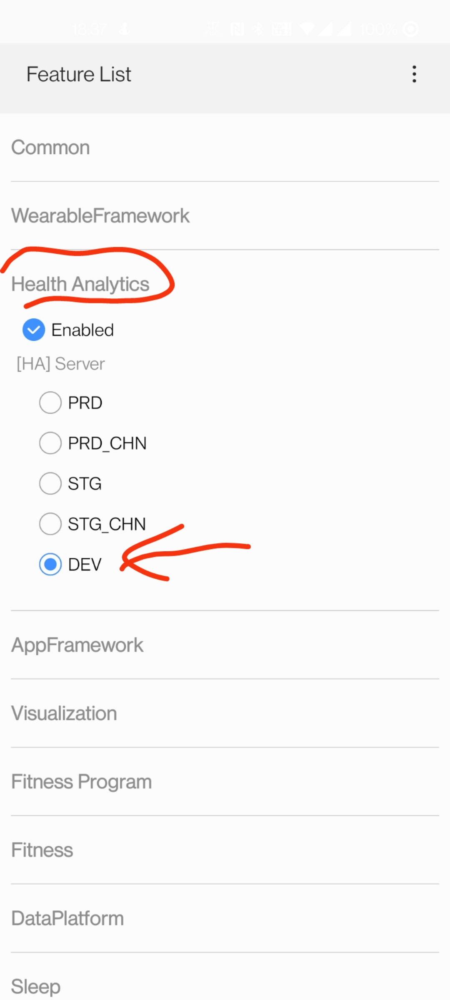
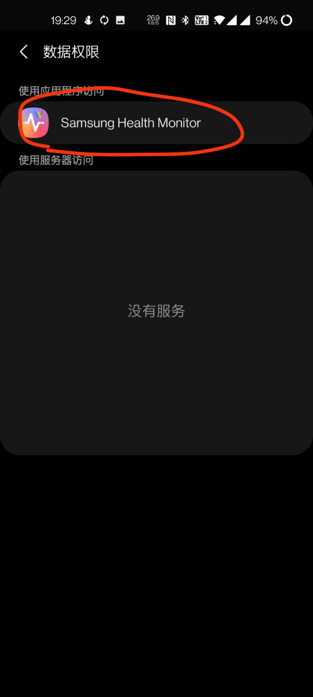

前几天博主我入手了三星的Galaxy Watch4，起初是在一家淘宝店买了港行的，无奈老板迟迟找不到货，想着有那么多年玩机的经验，搞个国行的应该也能有解决办法，就上了国行。没想到，这水，有点深。虽说最终解决了问题，但是前前后后搞了许久，要不是为了一个圆形的表盘，我就直接退货了。

## 前言

**文章转载，请标明原文链接~**

写在这里了，我想应该也会有很多小伙伴在困惑，自己非国行的机器，究竟该不该买国行的Watch 4。以我现在的经历来讲，我觉得，能等一等，最好还是不要买国行了。原因有下：
* 国行阉割的APP，尤其是Play，生态是真的补不回来了，而且目前Google账户也无法使用，替换套件很大可能性会碰到Knox和bootloader，不太现实。但是港行等的机器，adb可以手工安装几乎所有大陆应用（要找提取版）
* 国行的生态是真的零碎，好端端的海外版的WearOS套件搭配GApps，是真的好用。但是阉割掉这部分生态之后，几乎什么优势也没有了，甚至连接WiFi还要我手工输入密码，要知道Google账号登录后WiFi是会自动同步的啊喂
* 没有了本篇文章所提到的连接、同步问题

当然，已经入坑国行的小伙伴，退货来得及的情况下也建议退货吧，或者你也可以使用本文的方法，自行解决这些问题。但是，本文也仅仅实现了非国行Android和国行Watch4的配对、手表与三星健康同步，至于日后是否还会有其他东西需要折腾，这个就真不好说了。

为什么博主我死磕了好久，就在这个同步问题上？毕竟买了这个手表就是为了这些功能的，结果您告诉我，受制于地区限制或者手表本身设备限制，不给我同步，那我还不如省点钱？？？

本篇文章，主要内容我就分为两部分，一部分讲如何配对，一部分讲如何同步数据。由于很多操作我已经做过了，因此截图时会直接截到已经完成了的，还需要大家结合自己的情况去操作哈~

## 前提条件

博主我的手机是一加8，并且刷了欧版的OxygenOS，打开了root。如果你需要进行本文的操作，需要满足如下条件：
* 手机拥有root权限。如果没有root，可能需要adb进行应用停用（未测试）

## 配对你的手表！

当你的非国行的Android和国行的手表配对时，是否被`三星智能穿戴`APP重重的打了一巴掌，告诉你“该设备无法配对”？好了去他的三星，现在我们有办法可以解决——根据我多年玩机的经验，国行和非国行的Android根本上只是差了一个Play服务和商店。服务框架本身都是有集成，至于是否停用了或者是阉割版的就不清楚了。因此本文我们解决配对问题时，直接禁用Play服务和Play商店，即可正常配对。

操作步骤如下：
* 保持手机连接到正常的WiFi，或者开着数据网均可。此处我使用的OpenWrt路由器并且搭配了某些功能，亲测可行，不会判断IP
* 使用冰箱或者钛备份等应用，冻结Google Play服务和商店，记得是两个应用
* **【重置手表后重新配对同一个手机需要，首次配对无需进行】** 如果你已经安装了`三星智能穿戴`APP和那个Plugin，请先卸载他们，注意是卸载不是清除数据。最好把那个`WearOS by 谷歌`一起卸载了
* 正常配对流程进行就好了，获取Google账户信息时会卡住，此时再将刚刚禁用的两个app重新启用，就会报“无法复制您的Google账户”，然后跳过就好
* 不知道为什么三星账户登录始终有问题，只能一直跳过。但是在手表端上单独连WiFi是可以正常使用，没有什么影响
* **【重置手表后需要】** 登录三星账号，然后执行恢复操作。即可将之前的配置备份恢复（没留意恢复完整没）

在配对、日后使用中，需要特别注意：
* 不用尝试登录Google账号了，登不上的
* 不要作死卸载手机上的任何手表应用，否则就要重新安装（重置）。血的教训，尤其是重置手表后，所有的APP都没了，还要手工adb安装一次
* 日后重置手表后，再次连接需要进行同样的操作
* 日后请不要删除新建的那个目录和文件，也请留意避免被清理软件给清理掉了

到这里，就可以看到APP上显示手表已配对，就可以开始使用啦~

## 去他的地区或者设备限制

正常安装三星健康APP后，我们可能会收获“此配件可能在您所在的国家/地区不提供，或可能无法与您的设备进行互操作”错误。并且配件中始终无法搜索到我们的手表，合着手机和手表的数据完全成独立的了。

这个问题困扰了我很久，起初是通过三星健康的调试模式进入设置同步，后来因为版本更新后没有了Set按钮，但是老版本的又没有Watch4支持，一直解决不了问题。三星这波操作真的把我整烦了，问完京东客服准备退货了，抱着试一试的心态，看了下盖乐世社区，无意中看到了这篇文章[^2]，瞬间有了头绪。原来三星没有彻底移除调试模式的Set，只是换了一种方式把它隐藏了（我直接好家伙的）。

[^2]: http://www.samsungmembers.cn/thread-1195492-109-147.html

所以，你需要先安装三星健康（我使用的6.18.7.005版本），然后按照如下步骤操作：
* 在你的手机存储目录下的`Download`目录中，新建`SamsungHealth`名称的目录，并在这个目录中新建一个`FeatureManagerOn`的空文件
* 打开你的三星健康APP，进入`侧边栏->设置->关于三星健康`，不停点击版本号处，即可出现一个Set按钮。在你的手机上可能不会显示第一个按钮，我们只需要点进去Set即可
* 进入Set后，分别按照如下几个步骤，点上对应的设置
* 设置区域为CN。印象里首次设置只显示了一个，仅设置一个为CN也可以
* 按照如图分别设置为`DEV`和`on`
* 返回之后，提示强制停止程序，以生效刚刚的改动
* 然后就OK啦

在完成这个操作之后，我们再次进入APP，即可看到数据已经同步出来了。由于我提前已经安装了心电图和血压计[^1]，因此数据已经一并完成同步并显示出来了。再看其他的运动数据，都已经同步成功

日后使用时，还需要特别注意：
* 暂且没测试过更新后还能否使用。因为这目前已经是最新版了，没得我更

## 顺手打开心电图和血压计的同步

似乎不用再单独去`Samsung Health Monitor`和`三星健康`中专门打开数据权限了，看配置完成之后手表已经自动全部同步了。当然，你也可以继续打开它们，步骤如下：
* 进入`Samsung Health Monitor`中，打开数据权限
* 进入`三星健康`中，打开数据权限

然后就可以啦~

## 写在最后

完成了这一系列操作之后，就可以enjoy it啦~至于心电图、血压计功能，破解教程已经烂大街了，此处我就放个xda的做法[^1]，自行参考啦~

[^1]: https://forum.xda-developers.com/t/restrictions-removed-samsung-health-monitor-wearos-1-1-1-157-root-age-country-device-restriction-removed-27th-september-2021.4322527/
