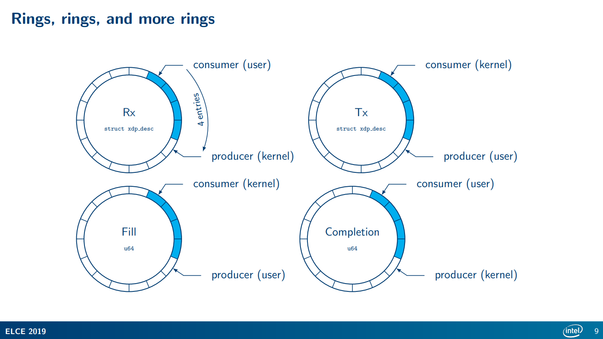
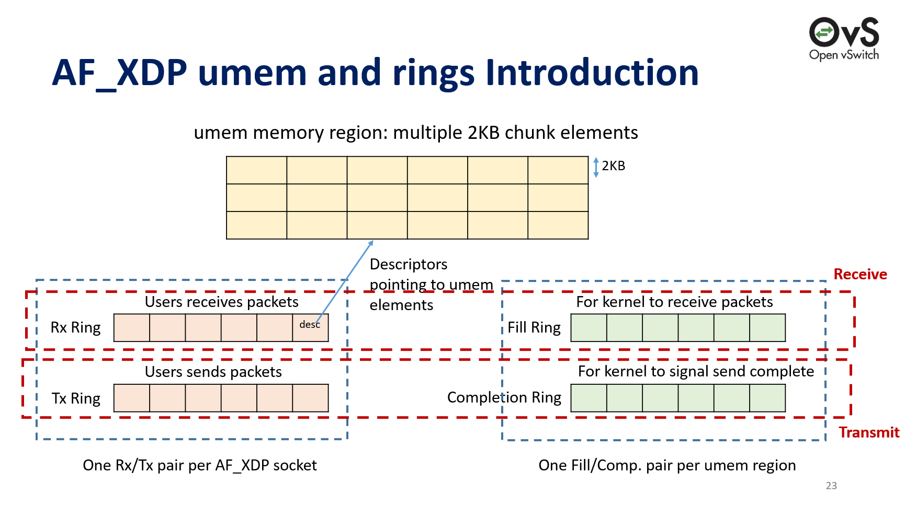

相信使用过Linux的AF_PACKET类型socket的朋友都知道，性能不是特别好，而且似乎引入了一个新的问题——用户态程序要处理所有来的报文（可能也能绑定socket，博主我没有尝试过），这应该是相当拉胯了。使用eBPF XDP处理完美解决所有问题，还附带了UMEM共享内存，省掉了不少CPU时钟，不仅能解决云原生场景下的一些性能和潜在问题，还能顺带做个SD-WAN，能不香吗？（手动狗头

## 对比伤害多大？

我们来比较一下`AF_PACKET`和`AF_XDP`，看看这个伤害有多大。


这个是我在Intel在2019年的一个会议的ppt[^9]上找到的，看这数据，合着直接是吊打啊。

[^9]: Low-Latency, Deterministic Networking with Standard Linux using XDP Sockets. Embedded Linux Conference Europe, Lyon, 2019. https://elinux.org/images/9/96/Elce-af_xdp-topel-v3.pdf
[^1]: The Path to DPDK Speeds for AF XDP. http://vger.kernel.org/lpc_net2018_talks/lpc18_paper_af_xdp_perf-v2.pdf

## 前言

其实，本文源自于2018年`Linux Plumbers Conference`一篇中选的论文`The Path to DPDK Speeds for AF XDP`[^1]。博主我兴致勃勃的期望能在这篇论文中找到更好的解决性能问题的办法，在给公司的产品上解决性能问题同时，能在雪糕网络[^3]的开源项目[^4]中同样适用，但是很可惜，基本条件无法满足。：）但是转而一想，借助eBPF能把内核的协议栈绕过去，就已经能解决几乎99%的问题了，而且更重要的是，这玩意在嵌入式场景中同样适用呀！即便是换在客户现场，不是所有的客户都有牛逼的网卡加持，那么eBPF相比DPDK得天独厚的优势就立马显现出来了。

其实这个需求最开始还是来自于我的一个开源项目，早些时候，博主我分别使用IPSec、SSTP、WireGuard等协议作为SD-WAN的互通的基础，但是实际上发现这几个玩意都各有各的令人蛋疼的地方，在边缘计算的场景下劣势远远大于优势。综合来讲，大概有这些吧：

* IPSec，实在是太适合作为SD-WAN的协议了，甚至Linux本身还有xfrm支持，很多商业设备对其也有支持[^2]。但是本身其设计协议为UDP，再加上国内运营商对于UDP协议的管控，我们大概也能够猜到质量有多堪忧了。以及，使用IPSec，在某些方面也带来了较高的成本。

* SSTP，人家是个TCP协议，单说各种场景下的通用性确实强了很多，但是再谈开销，可以拜拜了。

* WireGuard，似乎是目前最适合面向未来的协议了，几乎可以说是noise加密框架的精髓，非常适合IPv6的分布式的场景下使用。但是，其本身没有路由能力，主要是依靠填入的`AllowedIPs `进行，交付进操作系统的就是一整个子网，高度集成在Linux内核中，对于一些毕竟灵活的场景，就显得很不足了，跟Windows的HNS Network的拓扑比较类似。而且， 也是个UDP协议。

以及，这些协议都有一个公共的特点，就是连最基础的链路遥测能力都不具备，很多情况下对于链路的感知能力还是挺缺失的。作为一个开源的SD-WAN软体[^4]，基本的互联互通、安全和遥测能力总要有吧？但是使用原生的Linux的协议栈，完全没办法解决问题，用DPDK又实在是太依赖硬件，更何况在嵌入式或者vCPE场景中即便能使用PMD，看着100%的CPU，能不蛋疼吗？那么最好的方案又是什么呢？

本文，博主我结合现有的代码[^30]，研读分析一下XDP的性能之路，它是如何向着DPDK看齐的，以及在云原生场景和我的开源SD-WAN[^4]中，它又能贡献什么？它还有什么劣势需要弥补？

（其实这个程序[^30]最开始来源于`Asavie Technologies Ltd.`这家公司的一个开源项目[^5]，并非借鉴Cilium）

**注意：本文中的`AF_XDP`是Linux套接字的一种类型，但是实际上就是指的`XDP`技术，在本文中都是在表述同一个事物。**

[^30]: https://github.com/XUEGAONET/starOcean/tree/894393c3be8928d228a3cb3f10c0201f689431bd
[^2]: rte_security: enabling hardware acceleration of security protocols. https://www.dpdk.org/wp-content/uploads/sites/35/2017/09/DPDK-Userspace2017-Day1-9-security-presentation.pdf

[^3]: XUEGAONET. https://github.com/XUEGAONET
[^4]: XUEGAONET/starOcean. https://github.com/XUEGAONET/starOcean

## 什么是Ring？

哈，一开始就是Ring。其实这个东西不仅仅存在于DPDK，在eBPF中，也有使用到。Ring只是一个代名词，全称应该叫做Ring Buffer。Ring在中文中是介质、环状物的意思，那么在这里，我们就知道了它就是一个环形的缓冲区，维基百科[^7]也称之为Circular buffer。

[^7]: Circular buffer. https://en.wikipedia.org/wiki/Circular_buffer

本质来说，它就是一条链表，只是头尾接起来了而已，所以就成了个环。但在Ring的场景中，使用线性表的形式代替链表能够取得更好的性能，但是就会免不了要涉及指针的回绕。我就简单拿一段代码来举例了：

```go
xsk.fillRing.Descs[prod&uint32(xsk.options.NumFillRingDesc-1)] = desc.Addr
```

▲ 我们就只关注索引（方括号中）的内容即可。`prod`为内存中指向的Desc的位置，`xsk.options.NumFillRingDesc`为这片Desc的数量，指针也只会在这一片的Desc的范围中活动。那最后为什么要减1呢？其实这也正好可以解释一下为什么Ring的chunk和数量都要求魔数一样，我们来看看：

```text
假设：
    prod=1,
    xsk.options.NumFillRingDesc=128（下边用NumFillRingDesc表述）
那么：
    NumFillRingDesc-1 = 128 - 1 = 127，换成二进制空间即：0111 1111
    prod & NumFillRingDesc = 0000 0001 & 0111 1111 = 0000 0001

当prod=128时，prod&NumFillRingDesc = 1000 0000 & 0111 1111 = 0000 0000
发现了什么？
当prod=129时，prod&NumFillRingDesc = 1000 0001 & 0111 1111 = 0000 0001
```

▲ 指针回绕就是这么实现的。其实求余也可以实现一样的效果，目的是限制指针始终在某个范围内，以避免指针越界造成的问题。这么一来，指针操作不就成个环了吗？博主我在搞明白了这个写法之后，连连称赞不绝，真的是妙啊。换我一开始没有想到的话，可能一堆的if就要出来了。


▲ 从这个图[^8]我们可以非常直观的看到，整个队列是如何写入数据和读出数据的。

我们再来详细讨论一下，这个环形队列的各种情况：




▲ 当P与C指向同一个位置时，即为P还没有生产出来，C已经把队列消费完了。这时候，队列就成空队列了



▲ 当P生产一些内容后，C同时也会开始消费，消费后的格子就会被置空



▲ 当C继续消费，会越来越接近P，此时队列中还有个元素



▲ 当C再继续消费，会回到最开始的状态，即把队列都消费完了，此时队列为空



▲ 当P继续生产，到达链表末尾时，会回绕到开头。如上图这个时候，就是队列中还剩一个元素，C还可以继续消费



▲ 当P继续生产，检查发现P的下一个指针为C所指向的位置时，即判定为队列已满，当前位置就不会再生产新的元素。不过这也只是看到的其中一种方式而已，留空一位，以防止P追上C，其他的判空和判满方式我就不多提了

讲了这么多，那么这个环形的队列到底有什么用呢？那就是，没有锁啊！常规情况下，并发控制我们可以直接加个锁，但是加锁的损耗我们也都知道了。但是面向网络场景里，连二次缓冲都非常不建议，更别说加个锁带来极高的抖动了，协议上本身有支持可靠和非可靠的传输，队列满了就丢包就好了，并不需要100%处理，能够支撑可靠传输的，交给协议自己去把握重传，不支持可靠性传输的，说明协议本身能够容许丢包，此时即便是丢包也无所谓了。因此，在环形缓冲中，队列满的情况下直接返回就好了，即代表着这个包被丢弃了，可以说是非常适合用于处理数据面了。

在上边这个过程里，我们大可以把它理解成一个追逐打闹的游戏23333，两个人在一个圈上追逐打闹，并且只能按照同一个方向，仅此而已。只是反映到环形队列和绕回时，就会有了我们上边所看到的效果。

但是！但是！但是！这一切的一切，均需要满足一个条件——**改动生产者和消费者等时**，必须是原子操作 ！其原因是，CPU的字长决定了其一次能操作多少个bit，当在32位的CPU操作64位的数据时，由于CPU字长不够，因此64bit的数据需要分成两次进行，好比设置`uint64`的值时，如果字长受限，那么这个操作就不是原子的，中间如果正好有并发读这个值时，可能只是设置了32个bit，那么值就会错乱。因此，我们必须要保证，所有的值操作，均是原子性的，但是当在64位的CPU和系统中使用时，就不会有这个问题。不过当需要跨平台时，尤其是需要适配arm平台时，一些较老的arm字长可能不足以满足到64位，需要注意这个问题。当然，如果你要为mips架构的平台适配的话，那不仅仅要考虑字长，还有大小端也要考虑了（当然arm也可能会有大小端问题，同样也需要留意）。

可以看到，XDP里习来DPDK的一大Ring特性，可谓是在性能上解决了不少问题。当然，要说Ring，其实也只是个通用的数据结构，只是对比DPDK，恰好他们有着这样的相似住处~

[^8]: https://en.wikipedia.org/wiki/Circular_buffer#/media/File:Circular_Buffer_Animation.gif

## 这么多Ring到底是干嘛的？

▼ 此处，我还是借Intel的ppt[^9]中的一张图来说明，可能会比较抽象。如果需要更详细的，可以看这篇文章[^10]，这篇文章的作者行文逻辑可谓是十分清晰，在博主我刚刚入门eBPF XDP的时候也给我带来了相当大的帮助，强烈推荐。





▲ 这张图来自Linux Plumbers Conference 2018中的一篇论文的ppt[^11]。

我把XDP中所用到的Ring分为两类：

* Fill Ring与Completion Ring是一类，Desc均是`[]uint64`类型。一个Ring会有一个`[]uint64`环，索引元素时会进行回绕，存储的是`XDPDesc`中的`Addr`，这个`Addr`指的就是UMEM中的位置。
* Rx Ring与Tx Ring是一个类，Desc均是`[]XDPDesc`类型。一个Ring会有一个`[]XDPDesc`环，索引元素时会进行回绕，存储的是就是完整的`XDPDesc`。

那要这个Fill Ring和Completion Ring的意义是什么？说真的，到现在为止，我也没有Get到这两个Ring的意义，猜测可能只是在轮询或者事件驱动的场景中才会有？可能是为了减少调用syscall的等待时间（毕竟不用拷贝整个报文了）？这个推测也只是推测，因为毕竟DPDK的PMD人家是真的只有Rx和Tx Ring，甚至你只使用一个Ring也没问题。我认为这也是XDP与DPDK的一个差异吧，DPDK通过忙轮询来转发，XDP很大程度上需要与其他业务共存，忙轮询的方式并不可取，期望通过轻量的方式解决收发包需要的话，也就是只能通过poll/select/epoll等方式了。

[^11]: Bringing the Power of eBPF to Open vSwitch. https://slideplayer.com/slide/16139721/
[^10]: REXROCK. AF_XDP技术详解. https://rexrock.github.io/post/af_xdp1/

## 用户态和内核态如何打通？

此处，我就不提eBPF内核、用户态程序的加载和eBPF程序本身的逻辑了，我们就来看看eBPF用户态程序是如何与内核态的程序打通的。

[^5]: asavie/xdp. https://github.com/asavie/xdp

```go
	xsk.fd, err = syscall.Socket(unix.AF_XDP, syscall.SOCK_RAW, 0)
	if err != nil {
		return nil, errors.Wrap(err, "syscall.Socket failed")
	}
```

▲ 那么一开始的，肯定是先要打开一个文件描述符了，毕竟Linux的核心思想就是——一切皆文件。

```go
	xsk.umem, err = syscall.Mmap(-1, 0, options.NumFrame*options.SizeFrame,
		syscall.PROT_READ|syscall.PROT_WRITE,
		syscall.MAP_PRIVATE|syscall.MAP_ANONYMOUS|syscall.MAP_POPULATE)
	if err != nil {
		xsk.Close()
		return nil, errors.Wrap(err, "syscall.Mmap failed")
	}
```

▲ 调用Mmap，但是并不传递文件描述符（借助匿名页`MAP_ANONYMOUS`），在内核里开一个`options.NumFrame*options.SizeFrame`长度、私有的内存空间（`MAP_PRIVATE`），并把头指针扔回来，传给`xsk.umem`，因此此时此刻，`xsk.umem`这个变量的内存空间实际上就是和内核共享的了。下文，我们就称这个共享的内存空间为UMEM。

```go
	xdpUmemReg := unix.XDPUmemReg{
		Addr:     uint64(uintptr(unsafe.Pointer(&xsk.umem[0]))),
		Len:      uint64(len(xsk.umem)),
		Size:     uint32(options.SizeFrame),
		Headroom: 0,
	}
```

▲ 新增这么个Reg，存储这个共享的内存空间的头指针和长度，`options.SizeFrame`即为每个Chunk的大小。此处我并不需要在头域填充其他内容，因此Headroom被我置为了0，但是如果你需要在报文前部填充其他内容，好比VxLAN头，就需调整头域大小，以便进行预留。头域的作用，主要还是为了在需要添加额外的头时，不需要再对报文头进行整体的位移操作，可以节省一些时钟。

```go
	rc, _, errno = unix.Syscall6(syscall.SYS_SETSOCKOPT, uintptr(xsk.fd),
		unix.SOL_XDP, unix.XDP_UMEM_REG,
		uintptr(unsafe.Pointer(&xdpUmemReg)),
		unsafe.Sizeof(xdpUmemReg), 0)
	if rc != 0 {
		xsk.Close()
		return nil, errors.Wrap(errno, "unix.SetsockoptUint64 XDP_UMEM_REG failed")
	}
```

▲ 将刚刚开辟的UMEM与我们AF_XDP的文件描述符进行关联。

```go
	err = syscall.SetsockoptInt(xsk.fd, unix.SOL_XDP, unix.XDP_UMEM_FILL_RING,
		options.NumFillRingDesc)
	if err != nil {
		xsk.Close()
		return nil, errors.Wrap(err, "unix.SetsockoptUint64 XDP_UMEM_FILL_RING failed")
	}

	err = unix.SetsockoptInt(xsk.fd, unix.SOL_XDP, unix.XDP_UMEM_COMPLETION_RING,
		options.NumCompletionRingDesc)
	if err != nil {
		xsk.Close()
		return nil, errors.Wrap(err, "unix.SetsockoptUint64 XDP_UMEM_COMPLETION_RING failed")
	}

	err = unix.SetsockoptInt(xsk.fd, unix.SOL_XDP, unix.XDP_RX_RING,
		options.NumRxRingDesc)
	if err != nil {
		xsk.Close()
		return nil, errors.Wrap(err, "unix.SetsockoptUint64 XDP_RX_RING failed")
	}

	err = unix.SetsockoptInt(xsk.fd, unix.SOL_XDP, unix.XDP_TX_RING,
		options.NumTxRingDesc)
	if err != nil {
		xsk.Close()
		return nil, errors.Wrap(err, "unix.SetsockoptUint64 XDP_TX_RING failed")
	}
```

▲ 设置长度为`options.NumFillRingDesc`的Fill Ring，设置长度为`options.NumCompletionRingDesc`的Completion Ring，设置长度为`options.NumRxRingDesc`的Rx Ring，设置长度为`options.NumTxRingDesc`的Tx Ring。总共设置了4个类型的Ring，它们都是无锁的环形队列。

```go
	var offsets unix.XDPMmapOffsets
	var vallen uint32
	vallen = uint32(unsafe.Sizeof(offsets))
	rc, _, errno = unix.Syscall6(syscall.SYS_GETSOCKOPT, uintptr(xsk.fd),
		unix.SOL_XDP, unix.XDP_MMAP_OFFSETS,
		uintptr(unsafe.Pointer(&offsets)),
		uintptr(unsafe.Pointer(&vallen)), 0)
	if rc != 0 {
		xsk.Close()
		return nil, errors.Wrap(errno, "unix.Syscall6 getsockopt XDP_MMAP_OFFSETS failed")
	}
```

▲ 这段代码通过系统调用的`SYS_GETSOCKOPT`类型，获得了`unix.XDPMmapOffsets`这么个类型的变量。这里边又是什么呢？我们来看看：

```go
type XDPMmapOffsets struct {
	Rx XDPRingOffset
	Tx XDPRingOffset
	Fr XDPRingOffset
	Cr XDPRingOffset
}

type XDPRingOffset struct {
	Producer uint64
	Consumer uint64
	Desc     uint64
	Flags    uint64
}
```

▲ 可以看到，我们通过刚刚系统调用，得到了刚刚开出来的4种Ring各自的Producer、Consumer、Desc、Flags在内存中的偏移量。这些内容统统都在UMEM空间中，所有类型的Ring均是来自其中。其中，Producer与Consumer就是这个Ring中的生产者和消费者了，一个用于向这个无锁队列中放Desc，一个用于从这个无锁队列中出队Desc。

在得到了偏移量之后，我们便可以得知其成员变量的内存位置，进而即可将其对应转换成go语言所能接受的数据类型。

```go
	fillRingSlice, err := syscall.Mmap(xsk.fd, unix.XDP_UMEM_PGOFF_FILL_RING,
		int(offsets.Fr.Desc+uint64(options.NumFillRingDesc)*uint64(unsafe.Sizeof(uint64(0)))),
		syscall.PROT_READ|syscall.PROT_WRITE,
		syscall.MAP_SHARED|syscall.MAP_POPULATE)
	if err != nil {
		xsk.Close()
		return nil, errors.Wrap(err, "syscall.Mmap XDP_UMEM_PGOFF_FILL_RING failed")
	}
```

▲ 在上边这个过程中，我只拿出来了Fill Ring的转换过程来举例，还有其他3种类型的Ring，可以自行查看代码，不过都是一样的逻辑，数据结构上会略有差异，下边我也会再提到另外一个类型的~这个转换过程其实也就是，将一个头域的指针还原为语言中的数据结构，只不过我们要算好内存的空间，以避免在使用它时出现越界等的情况。

可以看到，这次我继续使用了Mmap，但是与之前UMEM的使用略有不同，这次我增加了文件描述符，这样一来，即可把该文件描述符中`unix.XDP_UMEM_PGOFF_FILL_RING`位置起始的内存作为一个指针，得到最后我们所看到的`fillRingSlice`。需要注意的是，这里的`unix.XDP_UMEM_PGOFF_FILL_RING`是个地址的偏移量噢，并不是Flag。

在这个过程中，可以看到在计算Fill Ring的内存空间大小时，引入了一个新的数据类型`unsafe.Sizeof`。`offsets.Fr.Desc`为我们上边通过系统调用的到的变量中的成员变量中的Desc，也就是Desc的偏移量，此处加上了`options.NumFillRingDesc`与`unsafe.Sizeof(uint64(0))`的乘积。`options.NumFillRingDesc`我们知道是Fill Ring中的Desc的数量，但是为什么要乘以一个`unsafe.Sizeof(uint64(0))`呢？经过博主我好久查阅资料，发现其实这里的`unsafe.Sizeof(uint64(0))`跟直接替换成8并无区别......因为uint64的数据类型，在内存中始终都是使用8字节的空间，不存在像string类型一样就是个结构体。所以此时此刻，我们即可得知，在内存空间里，Desc的Slice其实就是一个连续的uint64的空间，每个uint64空间存储了一个内存地址，其指向UMEM中的某个位置，标识了一个网络数据帧的头指针的位置。

```go
	txRingSlice, err := syscall.Mmap(xsk.fd, unix.XDP_PGOFF_TX_RING,
		int(offsets.Tx.Desc+uint64(options.NumTxRingDesc)*uint64(unsafe.Sizeof(Desc{}))),
		syscall.PROT_READ|syscall.PROT_WRITE,
		syscall.MAP_SHARED|syscall.MAP_POPULATE)
	if err != nil {
		xsk.Close()
		return nil, errors.Wrap(err, "syscall.Mmap XDP_PGOFF_TX_RING failed")
	}
```

▲ 我们再来看一个Tx Ring。上边的上边的Fill Ring存储的主要是`uint64`结构为主的内存地址，包括Completion Ring也是一样。还有另外2个Ring，Tx与Rx Ring则主要是存储Desc为主（此处就是Tx Ring）。因此，此时计算Tx Ring的整体长度时，就是通过`unsafe.Sizeof(Desc{})`来获取整个结构体的长度，有点类似于C语言中的`sizeof(struct xxx)`，由于此处内存已经对齐，因此内核和用户态中结构体也可以实现共享。

```go
	xsk.fillRing.Producer = (*uint32)(unsafe.Pointer(uintptr(unsafe.Pointer(&fillRingSlice[0])) + uintptr(offsets.Fr.Producer)))
	xsk.fillRing.Consumer = (*uint32)(unsafe.Pointer(uintptr(unsafe.Pointer(&fillRingSlice[0])) + uintptr(offsets.Fr.Consumer)))
```

▲ 刚刚我们知道了Fill Ring在内存中的位置，并且也已经将其转换成go语言所能接受的切片类型了，那么紧接着我们要算出来生产者和消费者的指针位置了。到这里，可能会有朋友要发问了，明明推荐使用与CPU等字长的数据结构，为什么这里非要用一个`*uint32`呢？其实这个问题一开始我也奇怪了好久，直到我在内核的文档[^6]里看到了这么个东西：

```c
// struct xdp_rxtx_ring {
//  __u32 *producer;
//  __u32 *consumer;
//  struct xdp_desc *desc;
// };

// struct xdp_umem_ring {
//  __u32 *producer;
//  __u32 *consumer;
//  __u64 *desc;
// };
```

[^6]: AF_XDP, Linux Networking Documentation. https://www.kernel.org/doc/html/v4.18/networking/af_xdp.html

▲ 因为内核里的数据结构就是个`__u32 *`的指针，所以在用户态，我们也只能用`*uint32`了，否则就会出问题了。此处的`offsets.Fr.xxx`均是一个`uint64`类型，然而`xsk.fillRing.xxx`却是一个指针，因此我们算出来偏移量之后，需要再把类型做一次转换，即可将用户态和内核态的指针关联在一起，其实就是两个指针，指向了同一个内存空间。所以接下来当我们需要告诉内核消费我们生产的Desc时，仅仅需要改动内核里的这个值，即相当于挪动了指针位置。

```go
type SliceHeader struct {
	Data uintptr
	Len  int
	Cap  int
}
```

▲ 在开始接下来的内容之前，我们先来看一看在go语言中，slice（切片）的底层结构到底是怎么样的。这个结构体就是切片的原貌，我们可以知道，所谓的我们的一堆byte其实就是个指针而已，被单独存放在了`Data`中，数据的长度即为`Len`，整个切片的长度即为`Cap`。所以我们看到的切片，其实它就是个结构体而已，这也就是为什么很多网络编程里，只是会传递一个切片进去但是又没有返回切片，只返回得到一个长度，其实就是利用了结构体中指针相同的原理，操作的还是同同一块数据。

```go
	sh := (*reflect.SliceHeader)(unsafe.Pointer(&xsk.fillRing.Descs))
	sh.Data = uintptr(unsafe.Pointer(&fillRingSlice[0])) + uintptr(offsets.Fr.Desc)
	sh.Len = options.NumFillRingDesc
	sh.Cap = options.NumFillRingDesc
```

▲ 此时，我们知道了切片的实际存储结构，接下来我们再来看上边这段代码。在这段代码里，`xsk.fillRing.Descs`为`[]uint64`类型，是`type umemRing struct`的成员变量之一，借助这样的方式，为`xsk.fillRing.Descs`这个空指针进行初始化。即，将其先转换成一个`SliceHeader`，手工为其设置`Data`的指针位置、`Len`及`Cap`。这样一来，我们后续在使用`xsk.fillRing.Descs`时，它就不再是一个空指针了，操作它内部的数据，就相当于直接在修改UMEM空间中的内容了。

通过上边这么个过程，我们就知道内核态如何与用户态的程序互通了。当然，这整个过程还缺最后一步：

```go
	sa := unix.SockaddrXDP{
		Flags:   DefaultSocketFlags,
		Ifindex: uint32(Ifindex),
		QueueID: uint32(QueueID),
	}
	if err = unix.Bind(xsk.fd, &sa); err != nil {
		xsk.Close()
		return nil, errors.Wrap(err, "syscall.Bind SockaddrXDP failed")
	}
```

▲ 没错，最后一步就是把它们bind起来，将文件描述符与网卡、网卡队列进行关联。这里的`Flags`可以指定文件描述符的参数，可以设置为`复制`、`零复制`、`共享UMEM`多种模式，但是零复制需要网卡支持，部分场景可能无法使用，目前测试发现的兼容性最好的还是复制模式。

整个过程，我们始终是在操作UMEM区域中的内容，而UMEM又是在内核态、用户态之间共享的，用户态程序从UMEM中拿报文、放报文（其实是Desc），内核态程序从UMEM中消费用户放进去的报文、收报文放进UMEM中去。相比系统原生协议栈中的协议，博主我也不知道原生的协议栈到底有了多少次的缓冲、拷贝，但是我知道XDP的如果硬件支持，可以做到零，即便是有拷贝，应该也是要比原生的协议栈要少。

## 收发包又是如何进行的？

此处我依然通过代码来说明，由于收发包思路其实都一样，因此我就只提收包的基本流程了，发包其实会更加简单。

整个收包流程大致如下：

* 先去看看Fill Ring还有多少个空位，得到个数字n
* 从UMEM中拿n个Desc出来
* 讲这n个Desc填充到Rill Ring中
* 开始Poll文件描述符，得到收到包的个数m
* 从Rx Ring中拿出m个Desc
* 从这些Desc中获取Data，就是报文

接下来我们结合代码再看看：

```go
// NumFreeFillSlots returns how many free slots are available on the Fill ring
// queue, i.e. the queue to which we produce descriptors which should be filled
// by the kernel with incoming frames.
func (xsk *Socket) NumFreeFillSlots() int {
	prod := *xsk.fillRing.Producer
	cons := *xsk.fillRing.Consumer
	max := uint32(xsk.options.NumFillRingDesc)

	n := max - (prod - cons)
	if n > max {
		n = max
	}

	return int(n)
}
```

▲ emmmmm感觉这个做法不是特别好。本身是一个环形队列，按照这个获取逻辑，当生产者指针已经回绕，但是消费者还未回绕时，`prod - cons`得到了负值，这时`max`减去这个负值，就肯定超出了`max`的大小，结果最后的`n`就成了`max`的大小，可问题是实际队列里可能并不是真的还有这么多的空间。我们再继续向下看。

```go
// GetDescs returns up to n descriptors which are not currently in use.
func (xsk *Socket) GetDescs(n int) []Desc {
	if n > len(xsk.freeDescs) {
		n = len(xsk.freeDescs)
	}
	descs := xsk.getDescs[:0]
	j := 0
	for i := 0; i < len(xsk.freeDescs) && j < n; i++ {
		if xsk.freeDescs[i] == true {
			descs = append(descs, Desc{
				Addr: uint64(i) * uint64(xsk.options.SizeFrame),
				Len:  uint32(xsk.options.SizeFrame),
			})
			j++
		}
	}
	return descs
}
```

▲ 获取到空闲的Fill Ring的容量后，获取他们的Desc。此时先去判断了一下`n`是不是大于`freeDescs`的数量，如果大于的话会以实际的`freeDescs`的数量为准。所以传入的n和最后返回的Desc的数量可能是不一致的！因此在使用返回的Desc时一定不要使用n进行索引，否则可能会产生越界。`descs := xsk.getDescs[:0]`其实只是相当于得到了这个切片的地址而已（注意不是Data的地址），以复用这一片已经初始化过的空间，妙啊！接下来的代码就对`freeDescs`进行了遍历，以找到空的位置，并计算出偏移量。

```go
// Fill submits the given descriptors to be filled (i.e. to receive frames into)
// it returns how many descriptors where actually put onto Fill ring queue.
// The descriptors can be acquired either by calling the GetDescs() method or
// by calling Receive() method.
func (xsk *Socket) Fill(descs []Desc) int {
	numFreeSlots := xsk.NumFreeFillSlots()
	if numFreeSlots < len(descs) {
		descs = descs[:numFreeSlots]
	}

	prod := *xsk.fillRing.Producer
	for _, desc := range descs {
		xsk.fillRing.Descs[prod&uint32(xsk.options.NumFillRingDesc-1)] = desc.Addr
		prod++
		xsk.freeDescs[desc.Addr/uint64(xsk.options.SizeFrame)] = false
	}
	//fencer.SFence()
	*xsk.fillRing.Producer = prod

	xsk.numFilled += len(descs)

	return len(descs)
}
```

▲ 紧接着，就是通过Fill的方式，把这些准备好的Desc的地址挨个填充到Fill Ring中，并且将其设置为非freeDescs。最后，挪动生产者的指针。后边的，就是提交给操作系统进行Poll了。

虽然，`freeDescs`初始化时数量与`NumFrame`保持一致，Go中的bool类型只有1byte，操作一定是原子的，但是，这么个流程下来，其实还是很有bug。单生产者单消费者的情况下没有问题，多生产者的情况下，暂且抛开前边的判空不说，单说填充Fill Ring时，就有可能会造成写冲突，进一步造成内存中数据的脏写，这是存在的一个问题。毕竟蛮多情况下，网卡并不支持RSS功能的，难免有时候还是会在单队列场景下用到多个生产者的情况。

## 可以优化的地方

通篇看来，还可以再改进改进，等晚点commit再去优化一下啦：

* **调整内核定时器中断间隔：** 缩小时钟周期，即加大`CONFIG_HZ`的值。对于纯网络设备会有非常大帮助，对于还有其他应用的话则建议再评估。当时钟周期足够小时，其会影响定时器（软的）中断的周期，定时器触发足够频繁时，poll/select等IO也会更加及时一些，可以降低响应时间。当然，在IO周期足够短的情况下，而且又非常密集，那么建议直接使用忙轮询。在XDP场景中，由于并没有忙轮询，主要是依靠轮询的方式来关注是否有新包到来，因此调低中断间隔会降低突发IO的情况下的抖动，但是代价是，会牺牲吞吐量。因此，在IO密集并且对延迟要求高的情况下，直接用忙轮询吧（DPDK的PMD就是一个很好的例子），IO不密集但是延迟要求也高的话，就降低定时器中断的周期。IO不密集延迟也不敏感的话，那就可以一定程度上调高定时器中断的周期，来提高吞吐量。
* **使用内存大页：** 这个思路其实是抄DPDK的，因为操作系统默认情况下是通过Page为单位管理内存，UMEM划分足够大时，使用大页来提高TLB查找的效率，其次避免操作系统把UMEM换出到交换空间去，UMEM要给换到交换空间去就真的要命了。
* **队列的判空和判满逻辑有问题** 。
* **支持多生产者：** 毕竟有时候还是会要并行发送。
* **vDSO移植：** 我想这应该是一个最具有挑战性的想法了。在目前的场景下，使用系统调用去Poll文件描述符还是无法避免的，在pprof的时候实际上也能看到，syscall占用的时钟还是不少的。如果能将这个系统调用使用vDSO的形式移植到用户空间的虚拟内存中去，这对性能提升会有非常大的帮助。但是，从安全角度来讲，可能也会挖一些新坑了。

## 题外话：一个小坑

eBPF内核态程序中有一个SEC，博主我以为只是一个随便写的、类似变量一样的东西，但是后边发现通过`bpf2go`编译之后，始终没有`*ebpf.Program`的成员变量，最后发现原来这个SEC是有要求的，其一定是要满足`BPF_PROG_TYPE`的前缀[^20]的，否则eBPF程序是无法被正常加载的，甚至`bpf2go`都不会帮你生成正确的代码。

[^20]: https://github.com/libbpf/libbpf/blob/92c1e61a605410b16d6330fdd4a7a4e03add86d4/src/libbpf.c#L8024

## eBPF XDP带来了什么？

文章到结尾了，这也应该是大家、包括我自己最关注的点，这玩意到底能带来什么效益？综合来讲，我把它简单概述为以下几个方面：

* 对系统无侵入，不用改驱动，不用改内核，eBPF的程序完全运行在一个沙盒里，程序启动时加载进网卡就好了，而且eBPF程序真的很简单
* 完整绕过了内核的协议栈，性能++
* 可以操作数据包的每一个Byte了，这个过程交由用户态程序处理
* 高度兼容性，相比DPDK没有那么苛刻的硬件要求

但是，自然也有一些弊端：

* 网卡硬件卸载能力无法使用，好比Checksum Offloading、TSO等。这点就不如DPDK支持全面了
* 网卡驱动不一定支持ZeroCopy，你可能还是需要Copy
* 还是会有一些系统调用的，vDSO暂不支持这部分系统调用，这部分的开销还是得有的

具体的使用场景，还要看大家自行发挥啦~~~

## 总结

相信看到这里，你心里对于eBPF XDP方案与DPDK方案的认知也非常清晰了。eBPF XDP方案很多设计与DPDK如出一辙，但是又各有各的一些独特的优势和劣势。在SD-WAN的CE侧设备中，其似乎是一个绝佳的解决方案，甚至换到PE侧都是一个非常够用的解决方案。SD-WAN应用一并解决了边缘计算场景下的痛点之一——弱网络的稳定性和可观测性，对于边缘计算是一个非常好的补足。即便是迁移应用到云原生场景中，对于部分Overlay场景也能起到非常大的加速作用，甚至可以拿它来做台比Open vSwitch还要灵活的交换机+路由器都不是问题，做一个轻量、高性能的负载均衡器也完全没有问题，可谓是yyds！

