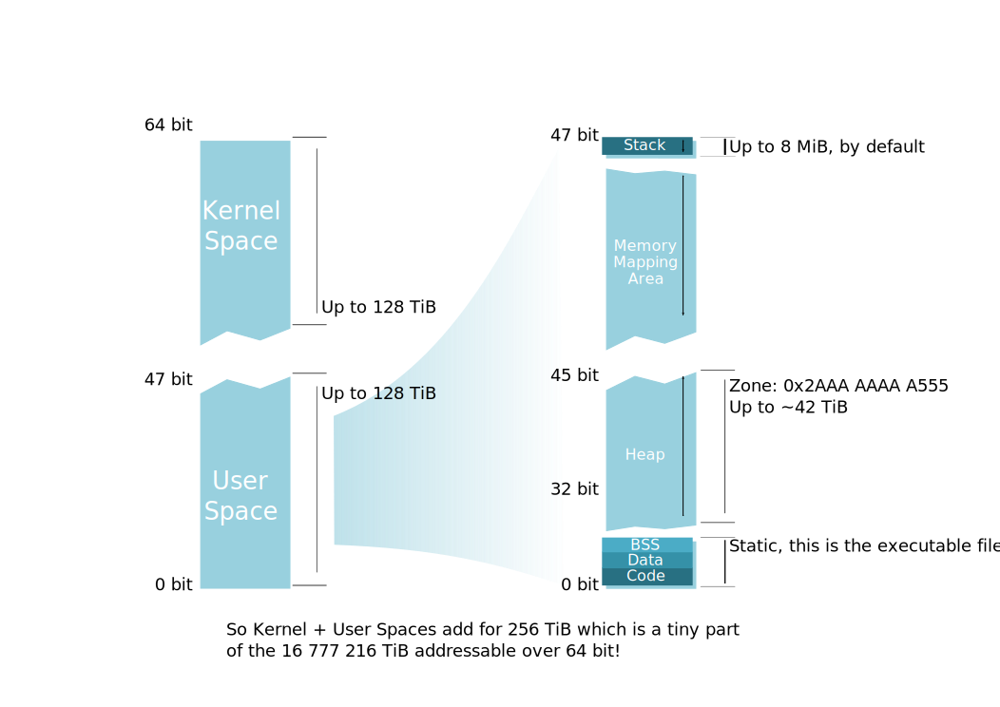

上一篇文章我们一块来看了eBPF XDP的性能之路和场景，文中对于Ring也进行了简单的描述，但是真正当我重构起来那个包时，这么多的Ring究竟在内存中的哪个位置？哪些数据之间又是重叠的？本篇文章，我们就来顺腾摸瓜，看看这玩意更低层级是什么样子的。

## 前言

其实写这篇文章的初衷，是因为在重构上篇文章中提到的包时，遇到了大量的问题。在使用原始版本的包时，总觉得其有些设计不是特别好，性能也没有达到预期，想了想还是重构一下吧，毕竟轮子不好用，自己可以造是吧（笑。在重构过程中，发现UMEM的空间只有`NumFrame*SizeFrame`，实在是没想明白另外几个Ring都存在了哪里，可能操作系统没学好吧 - -。这篇文章，我就再梳理一下XDP程序的内存结构，解决重构的问题同时顺便看看有没有什么可以优化的，至少也要接近到Intel的官方数据左右，才能有生产的可能。

## Linux下程序内存布局是什么样的？

说了这么多，还是先来讨论一下这个最重要的问题，在Linux中，程序的内存布局是什么样的？想必我们都有看到过一大堆的32位情况下的内存结构，但是毕竟64位目前是主流，并且64位的可寻址空间远远大出了32位，那么内存结构变化也是在所难免的。那么到底什么样子呢？

本节，我以Linux Kernel 5.15版本的文档[^1]为辅，来仔细瞅瞅64位的情况下Linux的程序的内存结构。

[^1]: Memory Management. https://www.kernel.org/doc/html/latest/x86/x86_64/mm.html

从文档[^1]上可以知道，Linux将内存管理分成了两种，一种为4级页表，一种为5级页表。在4级页表的情况下，VM（Virtual Memory，虚拟内存）受限于48位页表，最大可寻址空间仅有256T（从头开始偏移128T和从尾开始偏移128T），其内最大的可寻址物理内存空间也仅有64T。虽然Linux已经在支持更大的内存寻址了，但是我一个山里孩子，至今为止还没见到过大于1T内存的机器，所以本文我们就不讨论5级页表辣~

在4级页表的情况下，有48位可以用于寻址，前47位为正偏移地址，后47位为负偏移地址。正偏移量为头部+128T，负偏移量为尾部-128T，因此VM中的地址则为`0x0000000000000000`到`0x00007FFFFFFFFFFF`、`0xFFFF800000000000`到`0xFFFFFFFFFFFFFFFF`这两部分。整体上来说，内核与用户态的内存是等分的，更加细致的结构如下：

| 起始地址           | 起始地址偏移量 | 结束地址           | 大小    | 境态 | 区域描述                                     |
| ------------------ | -------------- | ------------------ | ------- | ---- | -------------------------------------------- |
| 0x0000000000000000 | 0              | 0x00007FFFFFFFFFFF | 128TB   | 用户 | VM                                           |
| 0x0000800000000000 | +128TB         | 0xFFFF7FFFFFFFFFFF | ~16M TB | 无   | 4级页表的情况下，无法寻址该部分内存          |
| 0xFFFF800000000000 | -128TB         | 0xFFFF87FFFFFFFFFF | 8TB     | 内核 | 保留给虚拟化                                 |
| 0xFFFF880000000000 | -120TB         | 0xFFFF887FFFFFFFFF | 0.5TB   | 内核 | LDT remap for PTI                            |
| 0xFFFF888000000000 | -119.5TB       | 0xFFFFC87FFFFFFFFF | 64TB    | 内核 | 直接映射物理内存，`page_offset_base`的固定值 |
| 0xFFFFC88000000000 | -55.5TB        | 0xFFFFC8FFFFFFFFFF | 0.5TB   | 内核 | 无用                                         |
| 0xFFFFC90000000000 | -55TB          | 0xFFFFE8FFFFFFFFFF | 32TB    | 内核 | vmalloc/ioremap space (vmalloc_base)         |
| 0xFFFFE90000000000 | -23TB          | 0xFFFFE9FFFFFFFFFF | 1TB     | 内核 | 无用                                         |
| 0xFFFFEA0000000000 | -22TB          | 0xFFFFEAFFFFFFFFFF | 1TB     | 内核 | virtual memory map (vmemmap_base)            |
| 0xFFFFEB0000000000 | -21TB          | 0xFFFFEBFFFFFFFFFF | 1TB     | 内核 | 无用                                         |
| 0xFFFFEC0000000000 | -20TB          | 0xFFFFFBFFFFFFFFFF | 16TB    | 内核 | KASAN shadow memory                          |
| 0xFFFFFC0000000000 | -4TB           | 0xFFFFFFFFFFFFFFFF | 4TB     | 内核 | 内核里其他一些杂七杂八的                     |

其实博主我一开始画了个图，因为内存分段太过于零散了...以至于画到后边发现太难按照比例挤下所有的内容了，因此还是表格看吧。

此外，在每个VM中，用户态的空间是相互独立的，而装载的内核态空间是统一的。只是，用户态程序运行在较低权限，在没有取得特权模式时无法访问内核态空间而已。所有程序独立使用自己的用户态空间，通过引发缺页异常，不断向自己的VM中装载物理内存或者磁盘中的页面，以满足程序需要。写到这里，正好想到在云原生的场景下，虽然进程通过命名空间进行隔离了，但是每个程序VM内还是会装载同一个内核的内存空间的，只是不允许被直接访问和操作而已，此时此刻内核本身稍有bug（好比脏牛），宿主立马就成了肉便器，还是挺有意思的。

在了解了内核态空间的结构之后，再来看看用户态的：



▲ 从上边这个图片[^2]中，我们可以看到，用户态空间中，**高位到低位**分别是栈、内存映射区域、堆、静态区，其中，静态区又再细分为BSS、Data、Code。在整个用户态空间中，栈空间大小是恒定的，因此在处理网络报文时，程序最好解除栈限制，否则栈空间消耗较多时可能会触发限制造成问题，程序初始化时可以使用`RLIMIT_STACK`解除掉栈大小限制，同时，使用`RLIMIT_MEMLOCK`解除可锁定的内存限制。

[^2]: File:Linux Virtual Memory Layout 64bit.svg. https://commons.wikimedia.org/wiki/File:Linux_Virtual_Memory_Layout_64bit.svg

到这里，我们已经对Linux下程序的内存布局有了一些了解了。

## 我的程序内存布局又是怎么样的？

此处，就要用上`pmap`命令了，来查看程序的内存使用情况。此处我就直接拿在写的`starOcean`[^4]来举例了：

[^4]: https://github.com/XUEGAONET/starOcean

```bash
996529:   ./example_sendicmpv4_default -interface ens19 -ip 192.168.2.111 -listen 0.0.0.0:30088 -mac 94:94:a6:00:01:88 -qid 0
         Address Perm    Offset Device     Inode    Size  Rss  Pss Referenced Anonymous LazyFree ShmemPmdMapped FilePmdMapped Shared_Hugetlb Private_Hugetlb Swap SwapPss Locked THPeligible Mapping
        00400000 r-xp  00000000  fc:11 135237059    3124 2740 2740       2740         0        0              0             0              0               0    0       0      0           0 example_sendicmpv4_default
        0070d000 r--p  0030d000  fc:11 135237059    2660 2276 2276       2276         0        0              0             0              0               0    0       0      0           0 example_sendicmpv4_default
        009a6000 rw-p  005a6000  fc:11 135237059     268  268  268        268        68        0              0             0              0               0    0       0      0           0 example_sendicmpv4_default
        009e9000 rw-p  00000000  00:00         0     220   72   72         72        72        0              0             0              0               0    0       0      0           0 
        020c8000 rw-p  00000000  00:00         0     132    4    4          4         4        0              0             0              0               0    0       0      0           0 [heap]
      c000000000 rw-p  00000000  00:00         0   65536 1104 1104       1104      1104        0              0             0              0               0    0       0      0           0 
    7f7580000000 rw-p  00000000  00:0f    671874 1048576    0    0          0         0        0              0             0              0         1048576    0       0      0           0 anon_hugepage (deleted)
    7f75d4000000 rw-p  00000000  00:00         0     132    4    4          4         4        0              0             0              0               0    0       0      0           0 
    7f75d4021000 ---p  00000000  00:00         0   65404    0    0          0         0        0              0             0              0               0    0       0      0           0 
    7f75dc000000 rw-p  00000000  00:00         0     132    4    4          4         4        0              0             0              0               0    0       0      0           0 
    7f75dc021000 ---p  00000000  00:00         0   65404    0    0          0         0        0              0             0              0               0    0       0      0           0 
    7f75e0000000 rw-p  00000000  00:00         0     132    4    4          4         4        0              0             0              0               0    0       0      0           0 
    7f75e0021000 ---p  00000000  00:00         0   65404    0    0          0         0        0              0             0              0               0    0       0      0           0 
    7f75e4000000 rw-p  00000000  00:00         0     132    4    4          4         4        0              0             0              0               0    0       0      0           0 
    7f75e4021000 ---p  00000000  00:00         0   65404    0    0          0         0        0              0             0              0               0    0       0      0           0 
    7f75e8000000 rw-p  00000000  00:00         0     132    4    4          4         4        0              0             0              0               0    0       0      0           0 
    7f75e8021000 ---p  00000000  00:00         0   65404    0    0          0         0        0              0             0              0               0    0       0      0           0 
    7f75ec000000 rw-p  00000000  00:00         0     132    4    4          4         4        0              0             0              0               0    0       0      0           0 
    7f75ec021000 ---p  00000000  00:00         0   65404    0    0          0         0        0              0             0              0               0    0       0      0           0 
    7f75f37ff000 ---p  00000000  00:00         0       4    0    0          0         0        0              0             0              0               0    0       0      0           0 
    7f75f3800000 rw-p  00000000  00:00         0    8192    8    8          8         8        0              0             0              0               0    0       0      0           0 
    7f75f4000000 rw-p  00000000  00:00         0     132    4    4          4         4        0              0             0              0               0    0       0      0           0 
    7f75f4021000 ---p  00000000  00:00         0   65404    0    0          0         0        0              0             0              0               0    0       0      0           0 
    7f75f87ad000 rw-p  00000000  00:00         0     256    8    8          8         8        0              0             0              0               0    0       0      0           0 
    7f75f87ed000 ---p  00000000  00:00         0       4    0    0          0         0        0              0             0              0               0    0       0      0           0 
    7f75f87ee000 rw-p  00000000  00:00         0    8192    8    8          8         8        0              0             0              0               0    0       0      0           0 
    7f75f8fee000 rw-s  80000000  00:08    671873      36    0    0          0         0        0              0             0              0               0    0       0      0           0 socket:[671873]
    7f75f8ff7000 rw-s  00000000  00:08    671873      36    0    0          0         0        0              0             0              0               0    0       0      0           0 socket:[671873]
    7f75f9000000 rw-s 180000000  00:08    671873      20    0    0          0         0        0              0             0              0               0    0       0      0           0 socket:[671873]
    7f75f9005000 rw-p  00000000  00:00         0     256    8    8          8         8        0              0             0              0               0    0       0      0           0 
    7f75f9045000 ---p  00000000  00:00         0       4    0    0          0         0        0              0             0              0               0    0       0      0           0 
    7f75f9046000 rw-p  00000000  00:00         0    9600   12   12         12        12        0              0             0              0               0    0       0      0           0 
    7f75f99a6000 ---p  00000000  00:00         0       4    0    0          0         0        0              0             0              0               0    0       0      0           0 
    7f75f99a7000 rw-p  00000000  00:00         0    8448   96   96         96        96        0              0             0              0               0    0       0      0           0 
    7f75fa1e7000 ---p  00000000  00:00         0       4    0    0          0         0        0              0             0              0               0    0       0      0           0 
    7f75fa1e8000 rw-p  00000000  00:00         0    8192    8    8          8         8        0              0             0              0               0    0       0      0           0 
    7f75fa9e8000 ---p  00000000  00:00         0       4    0    0          0         0        0              0             0              0               0    0       0      0           0 
    7f75fa9e9000 rw-p  00000000  00:00         0    8192    8    8          8         8        0              0             0              0               0    0       0      0           0 
    7f75fb1e9000 ---p  00000000  00:00         0       4    0    0          0         0        0              0             0              0               0    0       0      0           0 
    7f75fb1ea000 rw-p  00000000  00:00         0   44228   88   88         88        88        0              0             0              0               0    0       0      0           0 
    7f75fdd1b000 ---p  00000000  00:00         0  263680    0    0          0         0        0              0             0              0               0    0       0      0           0 
    7f760de9b000 rw-p  00000000  00:00         0       4    4    4          4         4        0              0             0              0               0    0       0      0           0 
    7f760de9c000 ---p  00000000  00:00         0  293564    0    0          0         0        0              0             0              0               0    0       0      0           0 
    7f761fd4b000 rw-p  00000000  00:00         0       4    4    4          4         4        0              0             0              0               0    0       0      0           0 
    7f761fd4c000 ---p  00000000  00:00         0   36692    0    0          0         0        0              0             0              0               0    0       0      0           0 
    7f7622121000 rw-p  00000000  00:00         0       4    4    4          4         4        0              0             0              0               0    0       0      0           0 
    7f7622122000 ---p  00000000  00:00         0    4580    0    0          0         0        0              0             0              0               0    0       0      0           0 
    7f762259b000 rw-p  00000000  00:00         0       4    4    4          4         4        0              0             0              0               0    0       0      0           0 
    7f762259c000 ---p  00000000  00:00         0     508    0    0          0         0        0              0             0              0               0    0       0      0           0 
    7f762261b000 rw-p  00000000  00:00         0     396   48   48         48        48        0              0             0              0               0    0       0      0           0 
    7f762267e000 r--p  00000000  fc:03      3728     152  152    2        152         0        0              0             0              0               0    0       0      0           0 libc-2.33.so
    7f76226a4000 r-xp  00026000  fc:03      3728    1332  544    8        544         0        0              0             0              0               0    0       0      0           0 libc-2.33.so
    7f76227f1000 r--p  00173000  fc:03      3728     304    0    0          0         0        0              0             0              0               0    0       0      0           0 libc-2.33.so
    7f762283d000 ---p  001bf000  fc:03      3728       4    0    0          0         0        0              0             0              0               0    0       0      0           0 libc-2.33.so
    7f762283e000 r--p  001bf000  fc:03      3728      12   12   12         12        12        0              0             0              0               0    0       0      0           0 libc-2.33.so
    7f7622841000 rw-p  001c2000  fc:03      3728      12   12   12         12        12        0              0             0              0               0    0       0      0           0 libc-2.33.so
    7f7622844000 rw-p  00000000  00:00         0      36   12   12         12        12        0              0             0              0               0    0       0      0           0 
    7f762284d000 r--p  00000000  fc:03      3742      28   28    0         28         0        0              0             0              0               0    0       0      0           0 libpthread-2.33.so
    7f7622854000 r-xp  00007000  fc:03      3742      60   60    1         60         0        0              0             0              0               0    0       0      0           0 libpthread-2.33.so
    7f7622863000 r--p  00016000  fc:03      3742      16   16    0         16         0        0              0             0              0               0    0       0      0           0 libpthread-2.33.so
    7f7622867000 ---p  0001a000  fc:03      3742       4    0    0          0         0        0              0             0              0               0    0       0      0           0 libpthread-2.33.so
    7f7622868000 r--p  0001a000  fc:03      3742       4    4    4          4         4        0              0             0              0               0    0       0      0           0 libpthread-2.33.so
    7f7622869000 rw-p  0001b000  fc:03      3742       4    4    4          4         4        0              0             0              0               0    0       0      0           0 libpthread-2.33.so
    7f762286a000 rw-p  00000000  00:00         0      24   12   12         12        12        0              0             0              0               0    0       0      0           0 
    7f7622874000 rw-s 100000000  00:08    671873      20    0    0          0         0        0              0             0              0               0    0       0      0           0 socket:[671873]
    7f7622879000 r--p  00000000  fc:03      3703       4    4    0          4         0        0              0             0              0               0    0       0      0           0 ld-2.33.so
    7f762287a000 r-xp  00001000  fc:03      3703     148  148    2        148         0        0              0             0              0               0    0       0      0           0 ld-2.33.so
    7f762289f000 r--p  00026000  fc:03      3703      40   40    0         40         0        0              0             0              0               0    0       0      0           0 ld-2.33.so
    7f76228a9000 r--p  0002f000  fc:03      3703       8    8    8          8         8        0              0             0              0               0    0       0      0           0 ld-2.33.so
    7f76228ab000 rw-p  00031000  fc:03      3703       8    8    8          8         8        0              0             0              0               0    0       0      0           0 ld-2.33.so
    7ffdfed76000 rw-p  00000000  00:00         0     132   16   16         16        16        0              0             0              0               0    0       0      0           0 [stack]
    7ffdfede2000 r--p  00000000  00:00         0      16    0    0          0         0        0              0             0              0               0    0       0      0           0 [vvar]
    7ffdfede6000 r-xp  00000000  00:00         0       8    4    0          4         0        0              0             0              0               0    0       0      0           0 [vdso]
ffffffffff600000 r-xp  00000000  00:00         0       4    0    0          0         0        0              0             0              0               0    0       0      0           0 [vsyscall]
                                                 ======= ==== ==== ========== ========= ======== ============== ============= ============== =============== ==== ======= ====== =========== 
                                                 2276760 7884 6901       7884      1672        0              0             0              0         1048576    0       0      0           0 KB 
```

▲ 可以很清晰得看到，**比较突出**的几个地址：

* 0x0000000000400000：静态，Code，可读可执行
* 0x000000000070D000：静态，Data，可读
* 0x00000000009A6000：静态，BSS，可读可写
* 0x00000000020C8000：动态，Heap，可读可写
* 0x00007F7580000000：动态，匿名页，可读可写。这里就是程序装载进去的Hugepage了，此处因为我使用的是1G的页面，因此装载一个页面就直接就是整个1G的页全部装入VM了
* 0x00007FFDFED76000：动态，Stack，可读可写
* 0xFFFFFFFFFF600000：内核态

从上边的内存布局来看，原来即便是Mmap，内存区域也是要被装载到用户态的空间上，还真不是内核就和用户态真的完全使用同一段地址共享了一片内存区域。

```go
	txRingSlice, err := syscall.Mmap(xsk.fd, unix.XDP_PGOFF_TX_RING,
		int(offsets.Tx.Desc+uint64(options.NumTxRingDesc)*uint64(unsafe.Sizeof(Desc{}))),
		syscall.PROT_READ|syscall.PROT_WRITE,
		syscall.MAP_SHARED|syscall.MAP_POPULATE)
	if err != nil {
		xsk.Close()
		return nil, errors.Wrap(err, "syscall.Mmap tx ring failed")
	}
```

▲ XDP的套接字的描述符也能够通过Mmap来装载，很大程度上可以认为这个文件描述符所指向的空间也是一个匿名的文件了。

梳理完之后，我们可以知道，程序内的VM装载了Hugepage，文件描述符（注意就是一个文件描述符，不是其指向的内存区域）如果没有逃逸到堆上的话就是在栈上了，而Ringbuf则是通过Mmap从文件描述符所指向的内存区域装载到了程序的VM中，以供用户态程序使用。

## 魔改的Ringbuf为什么不能用？

XDP程序部分原始的代码[^5]写得并不是特别好，因此我重写了一部分逻辑。在重写时，结构体的指针是一定要绕回的，于是我顺手把消费者和生产者指针也一起绕回了。于是中间经过了漫长的debug时光......指针总是在到临界点回绕后，就出现了问题，甚至一度我认为Linux压根就没有支持回绕，直到看到了官方给的代码[^3]，哦，原来指针不用回绕啊。 - -  离了个大谱

[^5]: https://github.com/asavie/xdp
[^3]: AF_XDP. https://www.kernel.org/doc/html/latest/networking/af_xdp.html

那为什么指针反而不用回绕呢？

这里要感谢一下TUNA的小伙伴们~ 从结构体数组中索引Desc时确实需要回绕，这个是毋庸置疑的，因为为了防止数组越界。但是，指针是真的可以不用回绕的，理由也很简单——`uint32`是个无符号的整形，因此即便是生产者先一步发生了溢出，按照C语言中对无符号整形溢出的定义——以`2^(8*sizeof(type))`取模，生产者的指针最后也是被回绕了。但是此时，回绕后的指针一定是小于消费者的，生产者减去消费者之后在有符号的情况下应该是整形，在无符号下会怎么样呢？正常减法时需要借位，二进制的减法同样需要借位，只是受制于只有32bit的空间，因此只会取到32bit长度的空间，反映到数学里的结果，就是——`2^(8*sizeof(type))` + 本应该得到的负数，在本Ringbuf中，就得到了消费者尾部+生产者头部的长度。正因如此，这个指针不论怎么减，其结果始终是得到了元素数量。

所以，只绕结构体就好了，生产者消费者的没有绕的必要了。

## 再优化一下？

其实感觉这个优化已经没有什么意义了。出于熟悉一下Mmap，再加上Desc总归传来传去不如和UMEM合并到一块大页下边好了，于是做了一个似乎没有多大意义的优化：

```go
	flag := syscall.MAP_PRIVATE | syscall.MAP_ANONYMOUS | syscall.MAP_POPULATE
	if options.UseHugePage {
		flag |= unix.MAP_HUGETLB
		if options.HugePage1Gb {
			flag |= 30 << unix.MAP_HUGE_SHIFT
		}
	}

	memBufSize := options.NumFrame*options.SizeFrame + 4*options.NumFrame*int(unsafe.Sizeof(Desc{}))
	log.Infof("allocate %dkb by using mmap", memBufSize)

	memBuf, err := syscall.Mmap(-1, 0, memBufSize,
		syscall.PROT_READ|syscall.PROT_WRITE, flag)
	if err != nil {
		xsk.Close()
		return nil, errors.Wrap(err, "syscall.Mmap umem failed")
	}
```

▲ `memBufSize`计算出了UMEM和4处`[]Desc`需要的内存空间，通过Mmap装入到了程序的VM内。

```go
	xsk.umem = memBuf[:options.NumFrame*options.SizeFrame]
```

▲ 传递UMEM大小的空间给`xsk.umem`，由于`xsk.umem`本身就是个`[]byte`类型了，因此直接截取就好了。切片底层的Data只是一个指针，所以这样赋值也能够共享到期望的内存区域。

```go
	var sh *reflect.SliceHeader

	sh = (*reflect.SliceHeader)(unsafe.Pointer(&xsk.fillDescs))
	sh.Data = uintptr(unsafe.Pointer(&memBuf[options.NumFrame*options.SizeFrame+0*options.NumFrame*int(unsafe.Sizeof(Desc{}))]))
	sh.Len = options.NumFrame
	sh.Cap = options.NumFrame
```

▲ 上边的代码需要对每个`[]Desc`单独设置。由于不是`[]byte`类型，因此我们得对它的切片变量进行设置，基本思路就是将其强制转成一个指针给到一个变量去，通过低级的切片的成员变量来设置Data的指针、Len和Cap，即可。

理论上来说，如果你可以保证内存不泄露，那么把所有热数据全部转移到大页中都没有问题...就是费了点脑子

## 收工

本篇文章对应的commit为a07de3b97558d89ef87c6257415840798bf22483[^6]。目前已经完整支持了大页、完全无锁的单生产者单消费者的Ringbuf、完全零拷贝的包解析与构造引擎等。

[^6]: https://github.com/XUEGAONET/starOcean/tree/a07de3b97558d89ef87c6257415840798bf22483

压测数据已经非常超出预期了，按照Intel官方给出的ppt上的数据来看，l2fwd例程参考的转发率为1.0Mpps（忘了是1.2还是1.0了），魔改后的XDP程序估算已经有1.1Mpps，实际上取0.9也非常满足几乎所有场景使用了，更何况魔改后的XDP使用的测试例程还是不仅仅只支持了L2转发的。之所以说是估算呢，是因为两个测试程序已经把CPU打满了，结果XDP程序仅仅使用了3成左右CPU，核心数有限，因此测试没有办法再继续了，可能得需要DPDK才能得到一个更加真实的值了。

```text
[Status][2021-11-14 12:10:45.769879341 +0800 HKT m=+51840.272715655]
  - Filled:               4322913143
  - Completed:            4322911050
  - Received:             4322911095
  - Transmitted:          4322911095
  - [K]RxDropped:         0
  - [K]RxInvalidDescs:    0
  - [K]TxInvalidDescs:    0
[Status][2021-11-14 12:11:45.76988915 +0800 HKT m=+51900.272725464]
  - Filled:               4348415900
  - Completed:            4348413849
  - Received:             4348413874
  - Transmitted:          4348413874
  - [K]RxDropped:         0
  - [K]RxInvalidDescs:    0
  - [K]TxInvalidDescs:    0
```

我就取了一个周期内的测试数据来看，`Transmitted`的差值为25502779，`Completed`的差值为25502799，`Transmitted`的差值减去`Complete`的差值竟然是负数...那我们以这个值来计算吧，丢包为20个。因此，25502779/60=425046.3，包转发率为425kpps，我再取最高的CPU使用率38.5%计算，满负载情况下可以得到预估的转发率为1103.9kpps。由于网络报文处理不能单看转发率，满负载的情况下可能还会有中断开销、丢包曲线等影响，因此我们就取0.9作为其最终值——993.51kpps，四舍五入一下1Mpps。丢包率估算为20/425046=0.00004705=0.004705%，已经达到了万分之一以下的丢包率。这个值虽然可能还是有些理想化，但是已经具有一定的参考价值了。

这个成绩虽说追不上带有硬件支持的商用设备，但是已经能追平RB4011这种低端的商用设备在无硬件加速情况下的性能了。最重要的是，全程我只使用了网卡的一个队列和一个CPU逻辑核，而已！

那么再针对魔改的XDP做一段时间的稳定性测试，补充一下case，GA Ready的话就可以拿去作为基建开始盖楼啦~

