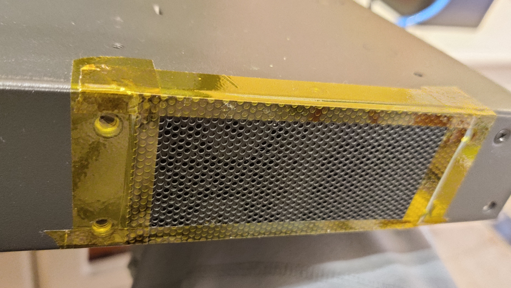
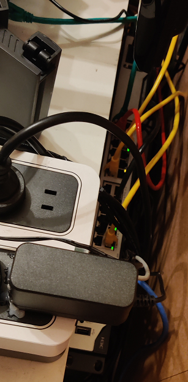

500元不到买台华三的商用机，28个千兆口，轻松拉满300M宽带，又可以起BGP起VRF，香就完事了。

## 注意

本文不打广告，仍然以技术为主。要是打广告博主就不会去捡垃圾了

## 前言

其实博主我跟MT（MikroTik，以下简称MT）家的设备和软件（RouterOS，以下简称ROS，注意不是机器人操作系统）还挺有渊源，印象里好像是从初三就开始用MT家的ROS了，到现在差不多也有接近9年了，然而，ROS才从那时的5.26更新到现在的6.48，期待已久的ROS 7.0现在连Testing阶段都还没到，是真的磨叽。在这9年的时间里，ROS与Linux的结合，算是让我相当清晰得搞明白了Linux的数据面和各种hook点的功能以及潜在的bug（因为ROS就是基于Linux），慢慢也让我开始决定抛弃这玩意，走上自研网络设备的路线。从一开始借用Linux的系统协议栈，到后来DPDK PMD数据面，再到现在eBPF XDP轻量数据面，快进一步到智能网卡和FPGA，无一不是为了更好地把这玩意替换掉，满足更多场景需要。

可以说，MT家的设备给了初学者一个非常好、非常廉价的实验平台，但是它存在的问题，好比——

* BGP TTL设置为1没有生效，导致与H3C等商用设备peering时无法通过TTL检查
* 路由表设计不合规范，导致BGP等动态路由无法在路由表中迭代
* BGP BFD会话经常会闪断，问题不详
* VRF会话泄漏，从Linux带出来的问题。和netfilter共同使用时（好比NAT）有冲突，问题不详
* VRF地址泄漏，这个应该是ROS本身的bug，主要表现在VRF内处理ICMP报文时会产生
* 至今为止正式版本还不支持BGP EVPN、VxLAN、FlowSpec、NETCONF等1202年功能
* Dude烂的一塌糊涂，Userman的bug也多，几乎不能用
* 至今为止还不支持IPv6 NPT
* 偶尔kernel panic

除去上边的大问题（大问题可能还没列全233），还有不少小问题。如果说家用的话，其实还是可以将就一下的，毕竟大多数家用场景不会像我一样用到BGP和VRF，所以具体怎么选择，还是看需求了~

## 重新定义“家用机”

博主我换了台H3C的`MSR3600-28`，注意，型号就是`MSR3600-28`，没有其他字符了。这台机器其实是银行的定制机，因此参数在官网上找不到，只能再搜索或者去淘宝找卖家问。以我在Google上查到的参数来看，这个机器的参数大致如下：

| 属性         | MSR3600-28                |
| ------------ | ------------------------- |
| IPv4转发性能 | 1Mpps～3Mpps              |
| 内存         | 1G                        |
| FLASH        | 256M                      |
| 固定WAN接口  | 3GE+1SFP                  |
| 固定LAN接口  | 24GE（均支持LAN/WAN切换） |
| SIC插槽      | 4                         |
| 最大功耗     | 54W                       |
| 冗余电源     | 支持1+1冗余交流电源       |
| 外形尺寸     | 440×360×44.2              |

这个机器拿来做一个简单的路由功能的路由器，家用的话还是相当够了。换到商用场景里，一台差不多的交换机+自研的数据面，即可解决大多数问题，也不再需要ROS了。

那么，上边这个数据意味着什么呢？

* 转发率：如果是硬件转发，那和RB5009的硬件转发基本接近，如果不是，那直接吊打RB5009
* 内存：相同
* FLASH：偏小，但是这不重要
* 端口：秒杀。唯一遗憾可能就是没有万兆口吧，虽然支持SIC插槽，但是这个机器本身就比较老了，SIC模块都是百兆、千兆的，没有什么扩展性可言
* 体积：还是挺大了
* 功耗：还是挺大了

但是！这么多端口，随便聚合一下，带宽就有了~当然如果你需要单口1G以上的，那还是可以看看MT家的RB，或者海鲜市场的一些二手H3C了，保有量还是蛮大的。

不过，由于我没拆机器，加上网上没有找到拆机，因此**尚不清楚端口是通过什么方式连接的**。如果全部直连CPU，那么应该不必担心太多性能问题，但是也有可能是过交换机芯片的，这种情况下会不会存在总线带宽的瓶颈，我也就不清楚了。似乎像MT一样公开芯片架构的厂商，似乎还真的不多。

**至少在我当前的需求背景下**，香就完事了。

## 需求

整个配置里，满足了这么些我的需求：

* BT/PT做种。我这边有公网IP，再加上有IPv6，因此得分别给DMZ的机器下发IPv6地址，映射IPv4端口号
* 每天自动重新拨号。这样可以防止运营商强制72小时踢下线（避免在用时刚好被踢断网）
* 防火墙（带状态）。免得被黑，能封就封
* VRF
* BGP（internal）。H3C的路由器充当RR
* IPv6 PD中继。获取前缀下发给DMZ区域的设备（无状态下发）
* PPPoE拨号
* 基本的路由交换功能
* 开启FreeARP。防劫持非常有用
* 机器越少越好，端口越多越好

## 拓扑

就长下边这样了。



可能有些乱，但是你只需要知道整个只有两台机器就行了。是的，只有一台NUC跑着Proxmox VE，还有一台这个`H3C MSR3600-28`的路由器（以下简称路由器）。拨号也同样在这台路由器上，通过图中的`GE 0/1`连接ONU。

在这个拓扑里，我们又看到了我们的老朋友OpenWRT，这个东西的作用想必大家都知道，我也不多说了。至于SD-WAN的CPE，是我自研的网络互连方案，用于和学校、托管的IDC、家里、云服务商内网打通，整合资源使用，因此会比较依赖BGP来通告路由。为了保证默认路由不冲突（两个VRF中均有默认路由），就划开分别使用了两个VRF（H3C的设备中叫做`vpn-instance`）。其中，一个为默认的，即我们不带VRF配置时三层配置默认放置的VRF，负责内部的网络；一个为单独新增的，用于进行PPPoE拨号、NAT、端口映射（DNAT）和IPv6，比较类似我们常说的DMZ。

这样一来，原本需要使用两台机器才能搞定的配置，现在就可以合并到一台机器下啦~这个拓扑截止到写本文时，博主我已经用了几天了，还是挺OK的，换在ROS上使用这么个拓扑的话，VRF的bug复现时可能会导致一些安全问题（而且可能压根就不能用）。

## Data Path

看完了大致拓扑，老规矩，我们还是得来聊一聊Data Path。

在上边的拓扑中，Vlan 1000、4000均是划分给不同的设备用的，好比常规的上网的设备、服务器。Vlan 4002则是放置了SD-WAN CPE与OpenWRT，SD-WAN CPE通过BGP与路由器建邻，引出混合云内部的路由，OpenWRT通过默认路由引出公网流量。SD-WAN CPE、OpenWRT、PT机另外一个接口均放在Vlan 4001中，这样一个两层的NAT虽然不算是个特别好的注意，但是绝大多数情况下，都是个非常够用而且简单的办法，毕竟家用，使用非对称路由、BGP引流或者CGNAT的方式复杂度都还是挺高的了。

从Vlan 1000或者4000进入的数据包，在路由器查完路由表之后，要么命中SD-WAN发布出来的内网的路由，路由到SD-WAN的CPE，要么通过默认路由直接路由到OpenWRT。路由到SD-WAN CPE时，包会在CPE上再进行路由，选中适合的POP点，封装加密后发出到Vlan 4002，经过NAT之后发出。路由到OpenWRT时，出OP进行一次NAT，到Vlan4001，出路由器时再进行一次NAT，就发出了。

## 参考配置

我公开一份我自己的配置，对一些我在配置时遇到的不太常规的地方也单独阐述一下。

我觉得不太寻常的配置，主要有这么几个部分：

* 防火墙。这玩意防火墙没有Linux里那么细，不会分转发、进入方向，这就给IPv6下的ACL加大了一些难度
* 拨号。要单独设置`dialer-group`，否则无法使用...

**不过，请务必注意，配置中比较多内容脱敏了，只留下了命令以便查找文档了解其作用。这部分脱敏的，需要你自己自行查找官网文档。当然，你也可以联系我付费解决~**

### 防火墙差异

用习惯了ROS中的防火墙之后（其实也就是Linux的netfilter），再用华三这个防火墙，蛮不习惯的。

▼ 它默认不支持基于状态的过滤，要手工设置ASPF才行；其次，对于包过滤的顺序，不像netfilter的NAT在Filter表之前，H3C的机器是始终先通过包过滤再通过NAT，因此非出向NAT的Session（因为出向NAT会被添加临时的规则来放行这个Session的回程），要进来前必须要手工先放行，然后才能进行DNAT。好比下边这样：

```cisco
#
aspf policy 10
 # 设置检查TCP SYN位
 tcp syn-check
#
interface Dialer1
 # 先放行特定的包
 packet-filter 3100 inbound
 # 再进行DNAT。由于我这里Dialer1是在独立一个VRF里，因此会有个vpn-instance top的配置
 nat server protocol tcp global current-interface xxx vpn-instance top inside x.x.x.x xxx vpn-instance top description XXXXX
#
acl advanced 3100
 rule 0 permit icmp vpn-instance top icmp-type echo
 # 建议只放行首包，剩下的交由ASPF放行。以防止状态错误的包一块进入
 rule 10 permit tcp vpn-instance top destination-port eq 11111 syn 1
#
```

▼ 这时，如果你只保持上边的规则....是有很大风险的，因为这个机器的防火墙默认规则是放行...所以还要手工设置默认拒绝，那么才会在ACL规则结束后把其它报文全部丢掉。

```cisco
#
 packet-filter default deny
#
```

▼ 还有一个，就是反向路由验证的差异。经常用Linux数据面的人应该并不陌生，但是在H3C的路由器里，当你设置成`strict`时，`urpf`这么个玩意是会忽略默认路由的，还必须要再加上一个`allow-default-route`才能允许反向路由查找默认路由，也是挺迷糊的。

```cisco
#
interface Dialer1
 ip urpf strict allow-default-route
 ipv6 urpf strict allow-default-route
#
```

在netfilter里，会有专门的链名来区分报文的路径，好比INPUT链的是进入到本机的，FORWARD的是路由转发的。但是在H3C的机器里，没有，因此如果在IPv6这种端到端的情况下，接口又配置了IPv6全球单播地址，在对本机的服务进行保护时，似乎就比较难搞。

▼ 博主我的做法是，把ACL加到服务去，让所有的服务拦截掉IPv6的请求。IPv4由于本身没有完全对外，因此整体上是安全的。就像下边，给SSH加上拦掉所有IPv6，再分别把这个ACL应用到HTTPS等其他服务，就好了。

```cisco
#
 ssh server enable
 ssh server ipv6 acl ipv6 3800
#
acl ipv6 advanced 3800
 description Service-IN-v6
 rule 0 deny ipv6 vpn-instance top
#
```

### 拨号差异

H3C的设备里，搞了个Dialer专门来拨号。这个Dialer必须得绑定一个组，否则就无法使用；它还必须单独为每种认证方式设置独立的账户，不然也无法使用....

▼ 博主我一顿操作猛如虎，配完发现PPPoE通了，但是就是不通网。搞了许久，才发现，原来必须得添加个`dialer-group`。可能就是设置协议栈吧，设置这个Dialer是只支持IPv4还是只支持IPv6，或者全部都支持（全部放行）。

```cisco
#
 dialer-group 1 rule ip permit
 dialer-group 1 rule ipv6 permit
#
interface Dialer1
 dialer bundle enable
 # 这里要绑定dialer-group
 dialer-group 1
 dialer timer idle 0
 dialer timer wait-carrier 30
 dialer timer autodial 10
 ip address ppp-negotiate
#
```

▼ 为每种认证方式设置独立的账户。说真的蛮奇怪的，我这一个接口，BARS难道还能不同的加密类型不同的用户？

```cisco
#
interface Dialer1
 ppp chap password cipher xxxxxxx
 ppp chap user xxxxxxx
 ppp pap local-user xxxxxxxx password cipher xxxxxxxxxxx
#
```

### 完整配置参考

注意，此处命令仅供参考。其他机器可能并不适用。对于不知道干啥的命令，不建议直接使用，请查询文档确认。

```cisco
<HOME-CORE>display current-configuration
#
 version 7.1.064, Release 6728P12
#
 sysname HOME-CORE
#
 # 一定设置正确时区，否则计划任务会错乱
 clock timezone hk add 08:00:00
 clock protocol ntp
#
ip vpn-instance top
 # 创建VRF
 description PPPoE and ONU
#
wlan global-configuration
#
 undo resource-monitor output syslog snmp-notification netconf-event
#
 tcp syn-cookie enable
#
 packet-filter default deny
#
 security-zone intra-zone default permit
#
aspf policy 10
 tcp syn-check
#
 dialer-group 1 rule ip permit
 dialer-group 1 rule ipv6 permit
#
 # 把数据包向下卸载，有点类似于ROS的Fast Track。此处我选择以流为单位卸载
 ip load-sharing mode per-flow dest-ip src-ip ip-pro dest-port src-port global
#
nat address-group 1000 name outside-onu
 address interface GigabitEthernet0/1
#
nat address-group 1001 name outside-pppoe-ct
 address interface Dialer1
#
 undo nat alg dns
 undo nat alg ftp
 undo nat alg pptp
 undo nat alg rtsp
#
 dhcp enable
#
 dhcp snooping enable
#
 dns source-interface Vlan-interface4002
 dns domain xxx.xuegaogg.com
 dns server 223.5.5.5
#
 ipv6 dhcp snooping enable
#
 system-working-mode standard
 password-recovery enable
 usb disable
#
vlan 1
#
vlan 1000
#
vlan 4000 to 4002
#
dhcp server ip-pool acc
 gateway-list x.x.x.1
 network x.x.x.0 mask 255.255.255.0
 address range x.x.x.100 x.x.x.230
 dns-list x.x.x.x
 domain-name xxx.xuegaogg.com
 static-bind ip-address x.x.x.x mask 255.255.255.0 hardware-address xxxx-xxxx-xxxx description NAS-DS220+
#
controller Cellular0/0
#
interface Aux0
#
interface Dialer1
 description PPPoE-CT
 mtu 1480
 timer-hold 15
 ppp chap password cipher xxxxxx
 ppp chap user xxxxxx
 ppp pap local-user xxxxxx password cipher xxxxxx
 # 绑定VRF
 ip binding vpn-instance top
 dialer bundle enable
 dialer-group 1
 dialer timer idle 0
 dialer timer wait-carrier 30
 dialer timer autodial 10
 ip address ppp-negotiate
 tcp mss 1400
 ipv6 mtu 1400
 ip urpf strict allow-default-route
 packet-filter 3100 inbound
 packet-filter ipv6 3600 inbound
 aspf apply policy 10 inbound
 aspf apply policy 10 outbound
 nat outbound address-group 1001 vpn-instance top
 nat server protocol tcp global current-interface xxx vpn-instance top inside x.x.x.x xxx vpn-instance top description BT
 # 需要启用链路本地地址，才能正常通过ICMPv6、DHCPv6交互
 ipv6 address auto link-local
 ipv6 urpf strict allow-default-route
 # 获取前缀到1号池子
 ipv6 dhcp client pd 1
#
interface Virtual-Template0
#
interface NULL0
#
interface Vlan-interface1000
 description ACC
 ip address x.x.x.1 255.255.255.0
 arp max-learning-num 256
 arp send-gratuitous-arp interval 1000
 tcp mss 1220
 dhcp server apply ip-pool acc
 dhcp client-detect
#
interface Vlan-interface4000
 description MGMT_AND_VM
 ip address x.x.x.1 255.255.255.0
 arp max-learning-num 256
 arp send-gratuitous-arp interval 1000
 tcp mss 1220
#
interface Vlan-interface4001
 description TOP_LAN
 ip binding vpn-instance top
 ip address x.x.x.1 255.255.255.0
 arp max-learning-num 256
 arp send-gratuitous-arp interval 1000
 tcp mss 1400
 ipv6 mtu 1400
 ip urpf strict
 # 由于我设置了每天自动重拨，因此前缀的有效期也要设置成1天
 ipv6 nd ra prefix default 86400 86400
 ipv6 address auto link-local
 # 设置分配的前缀（会自动填充到PD获取的1号池子里）
 ipv6 address 1 0:0:0:1::/64
 ipv6 urpf strict
 ipv6 neighbors max-learning-num 1024
 # 一定要undo，才能开启RA。默认情况下RA是关闭的
 undo ipv6 nd ra halt
 ipv6 nd ra router-lifetime 3600
#
interface Vlan-interface4002
 description BGP_SIDE
 ip address x.x.x.10 255.255.255.0
 arp max-learning-num 256
 arp send-gratuitous-arp interval 1000
 tcp mss 1220
#
interface GigabitEthernet0/0
 port link-mode route
 description NO_USE
 shutdown
#
interface GigabitEthernet0/1
 port link-mode route
 description ONU-HUAWEI-MA5761
 ip binding vpn-instance top
 ip address x.x.x.2 255.255.255.0
 tcp mss 1400
 nat outbound address-group 1000 vpn-instance top
 pppoe-client dial-bundle-number 1
#
interface GigabitEthernet0/2
 port link-mode route
 description NO_USE
 shutdown
#
interface GigabitEthernet0/27
 port link-mode route
 description NO_USE
 shutdown
#
interface GigabitEthernet0/3
 port link-mode bridge
 description ACC
 port access vlan 1000
 broadcast-suppression pps 128
 multicast-suppression pps 256
 port-security max-mac-count 32
#
interface GigabitEthernet0/4
 port link-mode bridge
 description ACC
 port access vlan 1000
 broadcast-suppression pps 128
 multicast-suppression pps 256
 port-security max-mac-count 32
#
interface GigabitEthernet0/5
 port link-mode bridge
 description ACC
 port access vlan 1000
 broadcast-suppression pps 128
 multicast-suppression pps 256
 port-security max-mac-count 32
#
interface GigabitEthernet0/6
 port link-mode bridge
 description ACC
 port access vlan 1000
 broadcast-suppression pps 128
 multicast-suppression pps 256
 port-security max-mac-count 32
#
interface GigabitEthernet0/7
 port link-mode bridge
 description ACC
 port access vlan 1000
 broadcast-suppression pps 128
 multicast-suppression pps 256
 port-security max-mac-count 32
#
interface GigabitEthernet0/8
 port link-mode bridge
 description ACC
 port access vlan 1000
 broadcast-suppression pps 128
 multicast-suppression pps 256
 port-security max-mac-count 32
#
interface GigabitEthernet0/9
 port link-mode bridge
 description ACC
 port access vlan 1000
 broadcast-suppression pps 128
 multicast-suppression pps 256
 port-security max-mac-count 32
#
interface GigabitEthernet0/10
 port link-mode bridge
 description ACC
 port access vlan 1000
 broadcast-suppression pps 128
 multicast-suppression pps 256
 port-security max-mac-count 32
#
interface GigabitEthernet0/11
 port link-mode bridge
 description ACC
 port access vlan 1000
 broadcast-suppression pps 128
 multicast-suppression pps 256
 port-security max-mac-count 32
#
interface GigabitEthernet0/12
 port link-mode bridge
 description ACC
 port access vlan 1000
 broadcast-suppression pps 128
 multicast-suppression pps 256
 port-security max-mac-count 32
#
interface GigabitEthernet0/13
 port link-mode bridge
 description ACC
 port access vlan 1000
 broadcast-suppression pps 128
 multicast-suppression pps 256
 port-security max-mac-count 32
#
interface GigabitEthernet0/14
 port link-mode bridge
 description ACC
 port access vlan 1000
 broadcast-suppression pps 128
 multicast-suppression pps 256
 port-security max-mac-count 32
#
interface GigabitEthernet0/15
 port link-mode bridge
 description MGMT
 port access vlan 4000
 broadcast-suppression pps 128
 multicast-suppression pps 128
 port-security max-mac-count 32
#
interface GigabitEthernet0/16
 port link-mode bridge
 description MGMT
 port access vlan 4000
 broadcast-suppression pps 128
 multicast-suppression pps 128
 port-security max-mac-count 32
#
interface GigabitEthernet0/17
 port link-mode bridge
 description MGMT
 port access vlan 4000
 broadcast-suppression pps 128
 multicast-suppression pps 128
 port-security max-mac-count 32
#
interface GigabitEthernet0/18
 port link-mode bridge
 description MGMT
 port access vlan 4000
 broadcast-suppression pps 128
 multicast-suppression pps 128
 port-security max-mac-count 32
#
interface GigabitEthernet0/19
 port link-mode bridge
 description MGMT
 port access vlan 4000
 broadcast-suppression pps 128
 multicast-suppression pps 128
 port-security max-mac-count 32
#
interface GigabitEthernet0/20
 port link-mode bridge
 description MGMT
 port access vlan 4000
 broadcast-suppression pps 128
 multicast-suppression pps 128
 port-security max-mac-count 32
#
interface GigabitEthernet0/21
 port link-mode bridge
 description TOP_LAN
 port access vlan 4001
 broadcast-suppression pps 128
 multicast-suppression pps 128
 port-security max-mac-count 128
#
interface GigabitEthernet0/22
 port link-mode bridge
 description TOP_LAN
 port access vlan 4001
 broadcast-suppression pps 128
 multicast-suppression pps 128
 port-security max-mac-count 128
#
interface GigabitEthernet0/23
 port link-mode bridge
 description TOP_LAN
 port access vlan 4001
 broadcast-suppression pps 128
 multicast-suppression pps 128
 port-security max-mac-count 128
#
interface GigabitEthernet0/24
 port link-mode bridge
 description TOP_LAN
 port access vlan 4001
 broadcast-suppression pps 128
 multicast-suppression pps 128
 port-security max-mac-count 128
#
interface GigabitEthernet0/25
 port link-mode bridge
 description NO_USE
 shutdown
#
interface GigabitEthernet0/26
 port link-mode bridge
 description LENOVO-M73
 port link-type trunk
 port trunk permit vlan all
 port trunk pvid vlan 4000
 broadcast-suppression pps 1280
 multicast-suppression pps 1280
#
bgp xxxx
 router-id x.x.x.x
 group xgn internal
 peer xgn connect-interface Vlan-interface4002
 peer xgn timer keepalive 1 hold 5
 peer xgn bfd single-hop
 # 对于垃圾ROS，你可能要去掉这个TTL检查才能正常建邻
 peer xgn ttl-security hops 1
 peer x.x.x.2 group xgn
 peer x.x.x.4 group xgn
 #
 address-family ipv4 unicast
  network x.x.x.x 255.255.255.0
  peer xgn enable
  peer xgn reflect-client
#
 ipv6 prefer temporary-address
#
 scheduler logfile size 16
#
# 定时任务，每天早上自动关闭Dialer并重新打开。用于重拨获取新地址，这样就不会正好在白天用的时候被强制踢下线了
scheduler job connect-pppoe
 command 1 system-view
 command 2 interface Dialer 1
 command 3 no shutdown
#
scheduler job disconnect-pppoe
 command 1 system-view
 command 2 interface Dialer 1
 command 3 shutdown
#
scheduler schedule reconnect-s1
 user-role network-admin
 job disconnect-pppoe
 time repeating at 06:00 interval 1440
#
scheduler schedule reconnect-s2
 user-role network-admin
 job connect-pppoe
 time repeating at 06:01 interval 1440
#
line class aux
 user-role network-admin
#
line class tty
 user-role network-operator
#
line class vty
 user-role network-operator
#
line aux 0
 parity odd
 speed 115200
 terminal type vt100
 user-role network-admin
 idle-timeout 0 0
#
line vty 0 63
 authentication-mode scheme
 user-role network-operator
#
 ipv6 nd mac-check enable
#
 ip route-static 0.0.0.0 0 Vlan-interface4002 x.x.x.1 preference 3 description TEMP-Default
 ip route-static x.x.x.x 10 NULL0
 ip route-static vpn-instance top 0.0.0.0 0 Dialer1 description PPPoE-CT
 ipv6 route-static vpn-instance top :: 0 Dialer1 description PPPoE-CT
#
 info-center loghost 127.0.0.1 port 3301
 info-center source CFGLOG loghost level informational
#
# 要接入监控，所以SNMP还是得开了
 snmp-agent
 snmp-agent local-engineid xxxxxxx
 snmp-agent community read cipher xxxxxxx
 snmp-agent sys-info version v2c
 snmp-agent packet max-size 1024
#
performance-management
#
 ssh server enable
 ssh server authentication-retries 5
 ssh server rekey-interval 24
 ssh server ipv6 acl ipv6 3800
 ssh server port xxx
#
 # 一定记得同步时间，以免计划任务错乱
 ntp-service enable
 ntp-service unicast-server ntp.aliyun.com source Vlan-interface4002
#
acl advanced 3100
 description PPPoE-IN
 rule 0 permit icmp vpn-instance top icmp-type echo
 rule 10 permit tcp vpn-instance top destination-port eq xxxxxx syn 1
#
acl advanced 3200
 description Lan-IN
 rule 0 permit icmp
 rule 10 permit tcp destination x.x.x.x 0
 rule 11 permit udp destination x.x.x.x 0
#
acl ipv6 advanced 3600
 description PPPoE-IN-v6
 # ICMP一定得全放了
 rule 0 permit icmpv6 vpn-instance top
 # 放DHCP
 rule 1 permit udp vpn-instance top destination FE80::/64 destination-port eq 546
 # 拦掉除了刚刚DHCP外的其他链路地址的请求
 rule 50000 deny ipv6 vpn-instance top destination FE80::/64
 # 放掉其他IPv6访问
 rule 60000 permit ipv6 vpn-instance top
#
acl ipv6 advanced 3800
 description Service-IN-v6
 rule 0 deny ipv6 vpn-instance top
#
 password-control enable
 undo password-control aging enable
 undo password-control history enable
 password-control length 6
 password-control login-attempt 3 exceed lock-time 10
 password-control update-interval 0
 password-control login idle-time 0
#
domain system
#
 domain default enable system
#
role name level-0
 description Predefined level-0 role
#
role name level-1
 description Predefined level-1 role
#
role name level-2
 description Predefined level-2 role
#
role name level-3
 description Predefined level-3 role
#
role name level-4
 description Predefined level-4 role
#
role name level-5
 description Predefined level-5 role
#
role name level-6
 description Predefined level-6 role
#
role name level-7
 description Predefined level-7 role
#
role name level-8
 description Predefined level-8 role
#
role name level-9
 description Predefined level-9 role
#
role name level-10
 description Predefined level-10 role
#
role name level-11
 description Predefined level-11 role
#
role name level-12
 description Predefined level-12 role
#
role name level-13
 description Predefined level-13 role
#
role name level-14
 description Predefined level-14 role
#
user-group system
#
local-user xxx class manage
 service-type ssh terminal https
 authorization-attribute user-role network-admin
 password-control login-attempt 5 exceed lock-time 10
#
 ip https port xxx
 ip https acl ipv6 advanced 3800
 ip https enable
#
wlan ap-group default-group
 vlan 1
#
return
```

## 看图

 ▼ 建议还是给机器的风扇封个口，以免吸入毛絮等其他比较大的东西。



▼ 在机器屁股上粘上连个泡沫，避免直接触地震动。同时也可以避免挤压到其他线


▼ 最后就是上电使用啦~



## 最后

**虽然整个UPS功耗不过70W，但是毕竟仍然是强电，因此，如果你也需要在家里放这种设备，我也强烈建议你——配置监控报警！安装温度传感器！安装烟雾报警器！安装电量计！准备应急用灭火器！定期检查电线是否破损！检查电线是否过热！接地线！**

小心行得万年船。祝大家玩机愉快~~~

