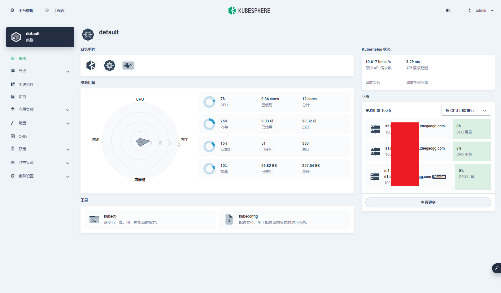

2022年了，开发需要各种应用时，不用再像以前那样挨个手工安装一整天了，直接上K8S就好啦~

这次，博主我上了一套3节点的集群，其中包含1个Master、2个Worker，前端选择了开源的KubeSphere，网络组件选择了性能好、又能起BGP的Cilium。由于本次部署是作为日常开发环境，操作上少了一些合规的考虑，仅供尝鲜和入门使用，生产环境部署需再细致研究。

# 注意

- 操作系统均为Rocky Linux 8，基于RHEL 8的发行版按照本文操作应该都没有太大问题
- 未标明操作的机器时（如：每个Node均需要操作），默认即代表在Master操作

# 操作步骤

## 准备

- 为系统配置网络，请禁用NetworkManager，使用network.service
- 建议网关使用OpenWRT并且开启一些东西，否则你会为抓镜像的各种失败抓狂
- 请关闭SELinux
- 请关闭iptables并清空规则
- 请使用root操作

## 安装和设置容器运行时

每个Node均需要操作。

此处，我使用的是containerd作为容器的运行时。

```bash
cat > /etc/modules-load.d/containerd.conf << EOF
overlay
br_netfilter
EOF

modprobe overlay
modprobe br_netfilter

cat > /etc/sysctl.d/99-kubernetes-cri.conf << EOF
net.bridge.bridge-nf-call-iptables  = 1
net.ipv4.ip_forward                 = 1
net.bridge.bridge-nf-call-ip6tables = 1
EOF

sysctl --system
```

只需要安装`containerd`就好了，并不需要安装`docker`本身。

```bash
dnf config-manager --add-repo=https://download.docker.com/linux/centos/docker-ce.repo
dnf makecache
dnf install containerd.io -y
```

生成containerd的默认配置。

```bash
mkdir -p /etc/containerd
containerd config default > /etc/containerd/config.toml
```

紧接着，你需要使用`vim /etc/containerd/config.toml`，找到下边的内容，添加一行配置。

```toml
[plugins."io.containerd.grpc.v1.cri".containerd.runtimes.runc]
  ...
  [plugins."io.containerd.grpc.v1.cri".containerd.runtimes.runc.options]
    SystemdCgroup = true   # << 加这一行
```

改完配置后，我们需要重启它一下，为了日后的使用，顺便把它设置成开启自启动。

```bash
systemctl restart containerd.service
systemctl enable containerd.service
```

## 安装k8s

每个Node均需要操作。

首先，需要进行下边的操作，确保netfilter能匹配到bridge桥接的端口的流量。

```bash
cat > /etc/modules-load.d/k8s.conf << EOF
br_netfilter
EOF

cat > /etc/sysctl.d/k8s.conf << EOF
net.bridge.bridge-nf-call-ip6tables = 1
net.bridge.bridge-nf-call-iptables = 1
EOF

sysctl --system
```

你可能看到了`el7`，但是别慌，亲测没有`el8`的仓库，而且`el7`能够正常安装使用。

```bash
cat > /etc/yum.repos.d/kubernetes.repo << EOF
[kubernetes]
name=Kubernetes
baseurl=https://packages.cloud.google.com/yum/repos/kubernetes-el7-\$basearch
enabled=1
gpgcheck=1
repo_gpgcheck=1
gpgkey=https://packages.cloud.google.com/yum/doc/yum-key.gpg https://packages.cloud.google.com/yum/doc/rpm-package-key.gpg
exclude=kubelet kubeadm kubectl
EOF

dnf makecache
dnf install -y kubelet kubeadm kubectl --disableexcludes=kubernetes
```

紧接着，启用kubelet。

```bash
systemctl enable --now kubelet
```

## 设置域名解析

每个Node均需要操作。

由于我集群规模不大，加上是非生产环境，因此我就直接手工添加了hosts来解析对应的Node。

```bash
cat >> /etc/hosts << EOF

# K8S Cluster
100.x.x.x m.x.xuegaogg.com
100.x.x.x m1.x.xuegaogg.com
100.x.x.x s1.x.xuegaogg.com
100.x.x.x s2.x.xuegaogg.com

EOF
```

正确做法应当是在DNS服务器上逐个添加解析记录，如果机器较多，可以使用域控的方式自动加入。

可以看到，我专门留多了一个`m.x.xuegaogg.com`，这个记录和`m1.x.xuegaogg.com`的记录目前是保持一致，主要是以后用于keepalived使用。当部署多活的Master时，我们可能会有`m1`、`m2`、`m3`等，但是Worker加入时始终还是使用`m`加入，届时`m`解析成浮动IP即可~

## 设置集群

首先在Master上先预热一下镜像。鉴于国内网络情况较为恶劣，此处如果直接抓取的话，可能会失败或者要等待很久。

```bash
kubeadm config images pull
```

紧接着，在Master上初始化，其中：

- apiserver-advertise-address：填写机器的IP地址即可，决定监听的IP
- control-plane-endpoint：Worker加入的地址
- pod-network-cidr：Pod使用的子网，请使用RFC1918中的地址，不要作死使用其他地址
- service-cidr：Service使用的子网，请使用RFC1918中的地址，不要作死使用其他地址
- service-dns-domain：域名后缀
- node-name：设置本Node的名称，在`kubectl get node`即可看到

```bash
kubeadm init \
  --apiserver-advertise-address 100.x.x.x \
  --control-plane-endpoint m.x.xuegaogg.com \
  --pod-network-cidr 192.168.0.0/17 \
  --service-cidr 192.168.128.0/18 \
  --service-dns-domain x.xuegaogg.com \
  --node-name m1.x.xuegaogg.com
```

当Master初始化完成后，会显示出来加入的命令，一定记得仔细看英文提示，因为有的命令是给高可用控制面加入的，有的才是给Worker加入的，需要加以区分。在加入的命令之后，加入一行指定Node的名称

```bash
kubeadm join m.x.xuegaogg.com:6443 \
  --token xxxxxx \
  --discovery-token-ca-cert-hash sha256:xxxxxxxxxxx \
  --node-name s1.x.xuegaogg.com  # << 加这一行
```

## 复制kubectl配置

安装完成后，我们需要在Master复制配置（其中包含了证书），以便kubectl命令能够正常使用。

```bash
mkdir -p $HOME/.kube
cp -i /etc/kubernetes/admin.conf $HOME/.kube/config
chown $(id -u):$(id -g) $HOME/.kube/config
```

## 安装自动补全

众所周知，使用kubectl时，经常要打各种资源的名称，如果没有自动补全，逐个get然后复制真的很麻烦，因此，你可以直接使用bash的自动补全。

首先，你得安装bash的自动补全。

```bash
dnf install bash-comp* -y
```

紧接着，生成配置

```bash
mkdir -p ~/.kube
kubectl completion bash > ~/.kube/completion.bash.inc
printf "
# Kubectl shell completion
source '$HOME/.kube/completion.bash.inc'
" >> $HOME/.bash_profile
source $HOME/.bash_profile
```

当加入`.bash_profile`之后，每次进入新的bash会话时，自动补全的脚本会被自动加载。

## 安装网络

首先，你需要安装个依赖。

```bash
dnf install iproute-tc -y
```

其次，下载并解压cilium的最后版本。

```bash
curl -L --remote-name-all https://github.com/cilium/cilium-cli/releases/latest/download/cilium-linux-amd64.tar.gz{,.sha256sum}
sha256sum --check cilium-linux-amd64.tar.gz.sha256sum
sudo tar xzvfC cilium-linux-amd64.tar.gz /usr/local/bin
rm cilium-linux-amd64.tar.gz{,.sha256sum} -rf
```

最后，就可以安装cilium了。此处，我设置了IPAM使用k8s原生的，因此后边加了个额外的参数，否则你的Pod分配的IP地址和你一开始使用kubeadm设置的会不一样。

```bash
cilium install --ipam kubernetes
```

## 配置存储

### 安装NFS服务器

配置存储可以说说稍微麻烦一些的了。此处，我使用了一台虚拟机提供NFS存储，IO还是挺差的...有钱了还是得买台EMC...

此处，我使用Alpine Linux作为NFS服务器，减少不必要的资源消耗。

```bash
apk add nfs-utils
```

安装完成后，直接配置NFS导出的目录即可，路径为`/etc/exports`。

```bash
# /etc/exports
#
# See exports(5) for a description.

# use exportfs -arv to reread
#/export    192.168.1.10(rw,no_root_squash)

/data 100.x.x.0/24(rw,async,no_subtree_check,no_wdelay,crossmnt,no_root_squash,insecure_locks,sec=sys,anonuid=0,anongid=0)
```

配置完成后，设置自启动

```bash
rc-update add nfs
```

然后重启机器，即可生效服务~

### 配置K8S的NFS StorageClass

**为所有机器（切记是所有）安装NFS客户端组件**，因为不装就无法挂载。

```bash
dnf install nfs-utils -y
```

接下来的操作在Master执行，找到适合你使用的存储Provisioner，此处我使用的是NFS，因此我选择了`nfs-subdir-external-provisioner`这么个玩意。

```bash
wget https://github.com/kubernetes-sigs/nfs-subdir-external-provisioner/archive/refs/tags/nfs-subdir-external-provisioner-4.0.16.tar.gz
tar xvf nfs-subdir-external-provisioner-4.0.16.tar.gz
cd nfs-subdir-external-provisioner-nfs-subdir-external-provisioner-4.0.16/deploy
```

首先是设置你存储后端安装的命名空间。需要特别注意的是，由于配置了RBAC权限，因此我们可以在其它命名空间挂入存储，因此此处我选择把存储的Provisioner安装到了kube-system这个命名空间。

```bash
NAMESPACE="kube-system"
sed -i'' "s/namespace:.*/namespace: $NAMESPACE/g" rbac.yaml
kubectl apply -f rbac.yaml
sed -i'' "s/namespace:.*/namespace: $NAMESPACE/g" deployment.yaml
```

替换完成命名空间后，你还要手工修改`deployment.yaml`和`class.yaml`。

下边是参考的`deployment.yaml`，你只需要修改`NFS_SERVER`、`NFS_PATH`、最后的nfs的两个值（建议和`NFS_SERVER`、`NFS_PATH`保持一致）。

```yaml
apiVersion: apps/v1
kind: Deployment
metadata:
  name: nfs-client-provisioner
  labels:
    app: nfs-client-provisioner
  # replace with namespace where provisioner is deployed
  namespace: kube-system
spec:
  replicas: 1
  strategy:
    type: Recreate
  selector:
    matchLabels:
      app: nfs-client-provisioner
  template:
    metadata:
      labels:
        app: nfs-client-provisioner
    spec:
      serviceAccountName: nfs-client-provisioner
      containers:
        - name: nfs-client-provisioner
          image: k8s.gcr.io/sig-storage/nfs-subdir-external-provisioner:v4.0.2
          volumeMounts:
            - name: nfs-client-root
              mountPath: /persistentvolumes
          env:
            - name: PROVISIONER_NAME
              value: k8s-sigs.io/nfs-subdir-external-provisioner
            - name: NFS_SERVER
              value: 100.x.x.x
            - name: NFS_PATH
              value: /data
      volumes:
        - name: nfs-client-root
          nfs:
            server: 100.x.x.x
            path: /data
```

下边是参考的`class.yaml`。我添加了路径命名的参数`pathPattern`，这样可以清晰地将不同Pod挂载的存储目录给区分开。

特别注意，此处`onDelete`我设置了`delete`，当文件夹已存在时会直接删除，如果你需要保留，则需要调整为`retain`。或者使用不使用此配置，由`archiveOnDelete: true`进行自动备份。

```yaml
apiVersion: storage.k8s.io/v1
kind: StorageClass
metadata:
  name: nfs-client
provisioner: k8s-sigs.io/nfs-subdir-external-provisioner # or choose another name, must match deployment's env PROVISIONER_NAME'
parameters:
  pathPattern: "${.PVC.namespace}/${.PVC.annotations.nfs.io/storage-path}"
  archiveOnDelete: "false"
  onDelete: delete
```

然后分别apply一下就好了。

```bash
kubectl apply -f deployment.yaml
kubectl apply -f class.yaml
```

最后，要为StorageClass设置默认，以确保Pod创建时能自动套用这个StorageClass去挂卷。

```bash
kubectl patch storageclass nfs-client -p '{"metadata": {"annotations":{"storageclass.kubernetes.io/is-default-class":"true"}}}'
```

当有Pod挂存储时，我们即可看到对应生成的PVC：

```bash
[root@M1 deploy]# kubectl get pv -A
NAME                                       CAPACITY   ACCESS MODES   RECLAIM POLICY   STATUS   CLAIM                                                             STORAGECLASS   REASON   AGE
pvc-56xxxx   20Gi       RWO            Delete           Bound    kubesphere-monitoring-system/prometheus-k8s-db-prometheus-k8s-0   nfs-client              93m
pvc-f2xxxx   20Gi       RWO            Delete           Bound    kubesphere-monitoring-system/prometheus-k8s-db-prometheus-k8s-1   nfs-client              93m
```

## 安装KubeSphere

可能需要关注一下官网的最新版，此处贴的yaml在你看到本文的时候，不一定是最新的。

```bash
kubectl apply -f https://github.com/kubesphere/ks-installer/releases/download/v3.2.1/kubesphere-installer.yaml
kubectl apply -f https://github.com/kubesphere/ks-installer/releases/download/v3.2.1/cluster-configuration.yaml
```

我们可以使用下边的命令查看安装进度。请注意，只有Pod在创建成功后，才能看到日志，如果是在抓镜像或者创建容器的阶段，可能会提示容器不存在，则还需要等一等，或者可以使用kubectl先观察Pod的启动情况。

```bash
kubectl logs -n kubesphere-system $(kubectl get pod -n kubesphere-system -l app=ks-install -o jsonpath='{.items[0].metadata.name}') -f
```

# 开始使用



# 感慨

写到最后，不禁感慨，我缺一台EMC。（还缺几台机架服务器）

困死了，睡个午觉~