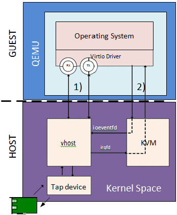

Linux上遇到一个问题——macvtap的虚拟接口无法和parent互通，这个问题让我不禁感到奇怪。以往都是同一个parent上的macvtap间互访，还真没有留意过访问parent是什么样一个情况。libvirt的wiki告诉我它确实是不能互通的，这或多或少激起了我对macvtap与bridge区别的一个好奇，Google未果，只能沿着Linux的内核代码走一遍了。

## 前言

事实上，macvtap和macvlan系出同门，macvtap底层其实就是macvlan。

我在写了一半文章的时候，突然好奇又拐回来补充了一句：明明有macvlan但是为什么非要用macvtap呢？在DPDK老版本的文档上[^1]，我找到了一个图。

[^1]: https://doc.dpdk.org/guides-1.8/sample_app_ug/vhost.html



从上边这个图，我们就知道了，macvtap最大的意义在于创建了一个tap的字符设备，这样一来QEMU的相关组件可以和tap共用一个队列（不知道队列放在这里恰不恰当），实现虚拟机网络后端和宿主网络的关联互通。

## 寻找切入点

首先，得找到添加macvtap的函数入口。此处，我直接去看iproute2的代码。通篇直接搜索macvtap，即可定位到下边的代码。看一下路径，是在`ip/iplink_macvlan.c:297`中，所以说macvlan和macvtap系出同门，还是有根据的。

```c
struct link_util macvtap_link_util = {
	.id		= "macvtap",
	.maxattr	= IFLA_MACVLAN_MAX,
	.parse_opt	= macvlan_parse_opt,
	.print_opt	= macvlan_print_opt,
	.print_help	= macvlan_print_help,
};
```

结构体是link_util，沿着这个结构体搜索，就可以找到`ip link add`的入口，在`ip/iplink.c:1747`中。

```c
if (matches(*argv, "add") == 0)
			return iplink_modify(RTM_NEWLINK,
					     NLM_F_CREATE|NLM_F_EXCL,
					     argc-1, argv+1);
```

进入`iplink_modify`函数，可以看到在参数解析后，调用了`rtnl_talk`。

```c
if (rtnl_talk(&rth, &req.n, NULL) < 0)
		return -2;
```

看到这个rtnl，倒是挺熟悉的，Google了一下是rtnetlink库，上边调用的talk就是这个库的一个接口。那么我们再进去这个`rtnl_talk`函数看看是什么系统调用。

```c
status = sendmsg(rtnl->fd, &msg, 0);                                
	if (status < 0) {
		perror("Cannot talk to rtnetlink");
		return -1;
	}
...
while (1) {
next:
		status = rtnl_recvmsg(rtnl->fd, &msg, &buf);
		++i;
```

再分别点进去了三层调用之后，终于找到了这一段代码，原来是`sendmsg`调用。那么这样一来，我们的ftrace就有跟踪点可以跟踪了。

## ftrace跟踪调用链

我们先把基本设置做完，详细可以看我博客“使用Linux内核的ftrace跟踪eBPF问题”这篇文章。

▼ 然后，打开对sendmsg系统调用的跟踪。

```c
echo 1 > events/syscalls/sys_enter_sendmsg/enable 
echo 1 > events/syscalls/sys_exit_sendmsg/enable
```

▼ 由于调用深度太大，此处我先进行了一个10深度的跟踪，然后看看如果有丢失的函数单独再进行一次5个深度的跟踪。

```bash
echo 10 > /sys/kernel/tracing/max_graph_depth
```

▼ 由于`ip link add`是一次性执行，因此我们需要设置好PID起始值，使用`&&`保证其能符合我们预期的PID。此时，我已经在后台挂好了保存tracing内容的命令。

```bash
echo 40000 > /proc/sys/kernel/ns_last_pid && ip link add link ens192 name macvtap0 type macvtap
```

结束后，即可得到10个深度的sendmsg的系统调用的跟踪。

▼ 在这个10深度的跟踪中漏掉了`netlink_rcv_skb`函数（丢失事件），因此我们对它进行单独跟踪。

```bash
echo "netlink_rcv_skb" > /sys/kernel/tracing/set_graph_function
```

▼ 然后删除接口，设置深度之后跟踪。

```bash
ip link del link ens192 name macvtap0 type macvtap
echo 5 > /sys/kernel/tracing/max_graph_depth
echo 40000 > /proc/sys/kernel/ns_last_pid && ip link add link ens192 name macvtap0 type macvtap
```

▼ 最终，我们分别得到了这下边两个跟踪的内容。

**下边这段很长，不想看可以快速划过。**

```bash
 1)               |  /* sys_sendmsg -> 0x30 */
 0)               |  /* sys_sendmsg(fd: 4, msg: 7ffe519ad2d0, flags: 0) */
 0)               |  __x64_sys_sendmsg() {
 0)               |    __sys_sendmsg() {
 0)               |      sockfd_lookup_light() {
 0)               |        __fdget() {
 0)   0.183 us    |          __fget_light();
 0)   1.577 us    |        }
 0)   2.727 us    |      }
 0)               |      ___sys_sendmsg() {
 0)               |        sendmsg_copy_msghdr() {
 0)               |          copy_msghdr_from_user() {
 0)               |            __copy_msghdr_from_user() {
 0)               |              move_addr_to_kernel.part.23() {
 0)               |                __check_object_size() {
 0)   0.143 us    |                  __virt_addr_valid();
 0)   0.100 us    |                  check_stack_object();
 0)   1.974 us    |                }
 0)   3.224 us    |              }
 0)   4.126 us    |            }
 0)               |            rw_copy_check_uvector() {
 0)               |              __check_object_size() {
 0)   0.077 us    |                __virt_addr_valid();
 0)   0.066 us    |                check_stack_object();
 0)   1.480 us    |              }
 0)   2.230 us    |            }
 0)   8.080 us    |          }
 0)   9.010 us    |        }
 0)               |        ____sys_sendmsg() {
 0)               |          sock_sendmsg() {
 0)               |            security_socket_sendmsg() {
 0)   0.070 us    |              bpf_lsm_socket_sendmsg();
 0)   0.886 us    |            }
 0)               |            netlink_sendmsg() {
 0)   0.134 us    |              pid_vnr();
 0)               |              security_socket_getpeersec_dgram() {
 0)   0.073 us    |                bpf_lsm_socket_getpeersec_dgram();
 0)   0.903 us    |              }
 0)               |              __alloc_skb() {
 0)               |                kmem_cache_alloc_node() {
 0)               |                  _cond_resched() {
 0)   0.073 us    |                    rcu_all_qs();
 0)   0.930 us    |                  }
 0)   0.073 us    |                  should_failslab();
 0)   2.430 us    |                }
 0)               |                __kmalloc_reserve.isra.54() {
 0)               |                  __kmalloc_node_track_caller() {
 0)   0.084 us    |                    kmalloc_slab();
 0)   0.164 us    |                    _cond_resched();
 0)   0.087 us    |                    should_failslab();
 0)   3.737 us    |                  }
 0)   4.444 us    |                }
 0)               |                ksize() {
 0)   0.113 us    |                  __ksize();
 0)   1.110 us    |                }
 0) + 10.313 us   |              }
 0)   0.074 us    |              skb_put();
 0)               |              __check_object_size() {
 0)   0.153 us    |                __virt_addr_valid();
 0)   0.123 us    |                __check_heap_object();
 0)   0.097 us    |                check_stack_object();
 0)   3.060 us    |              }
 0)               |              security_netlink_send() {
 0)   0.076 us    |                bpf_lsm_netlink_send();
 0)   0.846 us    |              }
 0)               |              netlink_unicast() {
 0)   0.100 us    |                netlink_trim();
 0)               |                netlink_lookup() {
 0)               |                  __netlink_lookup() {
 0)   0.073 us    |                    netlink_compare_arg_init();
 0)   0.903 us    |                  }
 0)   1.746 us    |                }
 0)   0.110 us    |                netlink_skb_set_owner_r();
 0)   0.150 us    |                netlink_deliver_tap();
 0)               |                rtnetlink_rcv() {
 0)               |                  netlink_rcv_skb() {
 0) + 88.657 us   |                    rtnetlink_rcv_msg();
 0)   ==========> |
 0)   2.073 us    |                    smp_irq_work_interrupt();
 0)   <========== |
 0)   0.086 us    |                    skb_pull();
 0) + 97.020 us   |                  }
 0) + 97.707 us   |                }
 0)               |                consume_skb() {
 0)               |                  skb_release_all() {
 0)   0.444 us    |                    skb_release_head_state();
 0)   0.457 us    |                    skb_release_data();
 0)   3.247 us    |                  }
 0)               |                  kfree_skbmem() {
 0)   0.277 us    |                    kmem_cache_free();
 0)   1.553 us    |                  }
 0)   8.420 us    |                }
 0) ! 112.794 us  |              }
 0)   0.146 us    |              put_pid();
 0) ! 134.747 us  |            }
 0) ! 137.240 us  |          }
 0) ! 138.760 us  |        }
 0)   0.090 us    |        kfree();
 0) ! 151.323 us  |      }
 0) ! 155.856 us  |    }
 0) ! 157.056 us  |  }
 0)               |  /* sys_sendmsg -> 0x34 */
 0)               |  /* sys_sendmsg(fd: 3, msg: 7ffe519ad930, flags: 0) */
 0)               |  __x64_sys_sendmsg() {
 0)               |    __sys_sendmsg() {
 0)               |      sockfd_lookup_light() {
 0)               |        __fdget() {
 0)   0.383 us    |          __fget_light();
 0)   1.360 us    |        }
 0)   2.610 us    |      }
 0)               |      ___sys_sendmsg() {
 0)               |        sendmsg_copy_msghdr() {
 0)               |          copy_msghdr_from_user() {
 0)               |            __copy_msghdr_from_user() {
 0)               |              move_addr_to_kernel.part.23() {
 0)               |                __check_object_size() {
 0)   0.140 us    |                  __virt_addr_valid();
 0)   0.096 us    |                  check_stack_object();
 0)   1.990 us    |                }
 0)   2.787 us    |              }
 0)   4.953 us    |            }
 0)               |            rw_copy_check_uvector() {
 0)               |              __check_object_size() {
 0)   0.073 us    |                __virt_addr_valid();
 0)   0.067 us    |                check_stack_object();
 0)   1.483 us    |              }
 0)   2.817 us    |            }
 0) + 10.197 us   |          }
 0) + 11.626 us   |        }
 0)               |        ____sys_sendmsg() {
 0)               |          sock_sendmsg() {
 0)               |            security_socket_sendmsg() {
 0)   0.070 us    |              bpf_lsm_socket_sendmsg();
 0)   2.247 us    |            }
 0)               |            netlink_sendmsg() {
 0)   0.176 us    |              pid_vnr();
 0)               |              security_socket_getpeersec_dgram() {
 0)   0.074 us    |                bpf_lsm_socket_getpeersec_dgram();
 0)   2.330 us    |              }
 0)               |              __alloc_skb() {
 0)               |                kmem_cache_alloc_node() {
 0)               |                  _cond_resched() {
 0)   0.073 us    |                    rcu_all_qs();
 0)   0.907 us    |                  }
 0)   0.073 us    |                  should_failslab();
 0)   2.773 us    |                }
 0)               |                __kmalloc_reserve.isra.54() {
 0)               |                  __kmalloc_node_track_caller() {
 0)   0.080 us    |                    kmalloc_slab();
 0)   0.153 us    |                    _cond_resched();
 0)   0.070 us    |                    should_failslab();
 0)   4.270 us    |                  }
 0)   6.127 us    |                }
 0)               |                ksize() {
 0)   0.194 us    |                  __ksize();
 0)   1.503 us    |                }
 0) + 15.846 us   |              }
 0)   0.070 us    |              skb_put();
 0)               |              __check_object_size() {
 0)   0.107 us    |                __virt_addr_valid();
 0)   0.117 us    |                __check_heap_object();
 0)   0.100 us    |                check_stack_object();
 0)   3.973 us    |              }
 0)               |              security_netlink_send() {
 0)   0.074 us    |                bpf_lsm_netlink_send();
 0)   0.937 us    |              }
 0)               |              netlink_unicast() {
 0)   0.117 us    |                netlink_trim();
 0)               |                netlink_lookup() {
 0)               |                  __netlink_lookup() {
 0)   0.077 us    |                    netlink_compare_arg_init();
 0)   1.240 us    |                  }
 0)   2.910 us    |                }
 0)   0.130 us    |                netlink_skb_set_owner_r();
 0)   0.396 us    |                netlink_deliver_tap();
 0)               |                rtnetlink_rcv() {
 0)               |                  netlink_rcv_skb() {
 0)               |                    rtnetlink_rcv_msg() {
 0) # 1075.241 us |                    }
 0)   ==========> |
 0)   8.860 us    |                    smp_irq_work_interrupt();
 0)   <========== |
 0)   4.980 us    |                    netlink_ack();
 0)   0.097 us    |                    skb_pull();
 0) # 1096.154 us |                  }
 0) # 1096.898 us |                }
 0)               |                consume_skb() {
 0)               |                  skb_release_all() {
 0)   0.414 us    |                    skb_release_head_state();
 0)   0.450 us    |                    skb_release_data();
 0)   2.450 us    |                  }
 0)               |                  kfree_skbmem() {
 0)   0.700 us    |                    kmem_cache_free();
 0)   1.517 us    |                  }
 0)   5.440 us    |                }
 0) # 1112.251 us |              }
 0)   0.177 us    |              put_pid();
 0) # 1144.965 us |            }
 0) # 1149.478 us |          }
 0) # 1150.498 us |        }
 0)   0.094 us    |        kfree();
 0) # 1165.978 us |      }
 0) # 1170.271 us |    }
 0) # 1171.534 us |  }
```

可以看到一次`ip link add`执行中，总共产生了两个sendmsg。

▼ 在看了一会代码之后，找到了另外一个可能调用sendmsg的地方`ip/iplink.c:974`，其中的`nl_get_ll_addr_len`包含对sendmsg的调用。

```c
if (dev && addr_len &&
	    !(req->n.nlmsg_flags & NLM_F_CREATE)) {
		int halen = nl_get_ll_addr_len(dev);

		if (halen >= 0 && halen != addr_len) {
			fprintf(stderr,
				"Invalid address length %d - must be %d bytes\n",
				addr_len, halen);
			return -1;
		}
	}
```

但是因为条件中有一个`addr_len`，我没有设置address的情况下其值为0，此分支不会被执行。

▼ 再看下边一个分支，在`ip/iplink.c:1013`，这里有个if-else结构，那一定会执行到`ll_name_to_index`了。在`ll_name_to_index`这个函数中，一定会执行到`ll_link_get`函数，其中会执行到`rtnl_talk_suppress_rtnl_errmsg`，那么就有了一个sendmsg的调用。

```c
	if (!(req->n.nlmsg_flags & NLM_F_CREATE)) {
		if (!dev) {
			fprintf(stderr,
				"Not enough information: \"dev\" argument is required.\n");
			exit(-1);
		}

		req->i.ifi_index = ll_name_to_index(dev);
		if (!req->i.ifi_index)
			return nodev(dev);

		/* Not renaming to the same name */
		if (name == dev)
			name = NULL;

		if (index)
			addattr32(&req->n, sizeof(*req), IFLA_NEW_IFINDEX, index);
	} else {
		if (name != dev) {
			fprintf(stderr,
				"both \"name\" and \"dev\" cannot be used when creating devices.\n");
			exit(-1);
		}

		if (link) {
			int ifindex;

			ifindex = ll_name_to_index(link);
			if (!ifindex)
				return nodev(link);
			addattr32(&req->n, sizeof(*req), IFLA_LINK, ifindex);
		}

		req->i.ifi_index = index;
	}
```

因此，我们就只关注第二个sendmsg。

▼ 由于深度限制，我单独跟踪了`rtnetlink_rcv_msg`函数，在第二个sendmsg事件中，其调用如下。

```bash
 3)               |  /* sys_sendmsg -> 0x34 */
 3)               |  /* sys_sendmsg(fd: 3, msg: 7ffe0818a290, flags: 0) */
 3)               |  netlink_rcv_skb() {
 3)               |    rtnetlink_rcv_msg() {
 3)               |      netlink_net_capable() {
 3)               |        __netlink_ns_capable() {
 3)   0.916 us    |          ns_capable();
 3)   2.654 us    |        }
 3)   4.843 us    |      }
 3)   0.077 us    |      try_module_get();
 3)               |      mutex_lock() {
 3)               |        _cond_resched() {
 3)   0.073 us    |          rcu_all_qs();
 3)   0.787 us    |        }
 3)   1.674 us    |      }
 3)               |      rtnl_newlink() {
 3)               |        kmem_cache_alloc_trace() {
 3)   0.154 us    |          _cond_resched();
 3)   0.070 us    |          should_failslab();
 3)   3.234 us    |        }
 3)               |        __rtnl_newlink() {
 3)   0.156 us    |          rtnl_ensure_unique_netns();
 3)   0.607 us    |          __dev_get_by_name();
 3)   0.110 us    |          validate_linkmsg();
 3)   1.156 us    |          rtnl_link_ops_get();
 3)   0.493 us    |          macvlan_validate [macvlan]();
 3)   0.963 us    |          rtnl_link_get_net_capable.constprop.45();
 3) + 16.917 us   |          rtnl_create_link();
 3)               |          macvtap_newlink [macvtap]() {
 ------------------------------------------
 0)  <...>-40023   =>  <...>-40001  
 ------------------------------------------

 0) # 1096.182 us |          } /* macvtap_newlink [macvtap] */
 0)   ==========> |
 0)   9.940 us    |          smp_irq_work_interrupt();
 0)   <========== |
 0) + 52.097 us   |          rtnl_configure_link();
 0) # 1197.691 us |        } /* __rtnl_newlink */
 0)               |        kfree() {
 0)   0.227 us    |          __slab_free();
 0)   1.750 us    |        }
 0) # 1206.861 us |      } /* rtnl_newlink */
 0)               |      netdev_run_todo() {
 0)               |        __rtnl_unlock() {
 0)   0.183 us    |          mutex_unlock();
 0)   2.633 us    |        }
 0)   3.983 us    |      }
 0)   0.116 us    |      module_put();
 0) # 1226.495 us |    } /* rtnetlink_rcv_msg */
 0)               |    netlink_ack() {
 0)               |      __alloc_skb() {
 0)               |        kmem_cache_alloc_node() {
 0)   0.303 us    |          _cond_resched();
 0)   0.117 us    |          should_failslab();
 0)   0.667 us    |          __slab_alloc();
 0)   4.367 us    |        }
 0)               |        __kmalloc_reserve.isra.54() {
 0)   0.910 us    |          __kmalloc_node_track_caller();
 0)   2.003 us    |        }
 0)               |        ksize() {
 0)   0.207 us    |          __ksize();
 0)   1.416 us    |        }
 0) + 11.780 us   |      }
 0)               |      __nlmsg_put() {
 0)   0.146 us    |        skb_put();
 0)   1.357 us    |      }
 0)               |      netlink_unicast() {
 0)   0.160 us    |        netlink_trim();
 0)               |        netlink_lookup() {
 0)   0.950 us    |          __netlink_lookup();
 0)   2.227 us    |        }
 0)               |        sk_filter_trim_cap() {
 0)   0.383 us    |          security_sock_rcv_skb();
 0)   1.853 us    |        }
 0)               |        netlink_attachskb() {
 0)   0.124 us    |          netlink_skb_set_owner_r();
 0)   1.444 us    |        }
 0)               |        __netlink_sendskb() {
 0)   0.173 us    |          netlink_deliver_tap();
 0)   0.404 us    |          skb_queue_tail();
 0)   0.203 us    |          sock_def_readable();
 0)   4.243 us    |        }
 0) + 16.160 us   |      }
 0) + 32.780 us   |    }
 0)   0.146 us    |    skb_pull();
 0) # 1263.862 us |  } /* netlink_rcv_skb */
```

▼ 相信你也已经看到了，对接口的初始化开始于`__rtnl_newlink`，因此我们重点只需要关注这几个函数即可。

```bash
 3)               |        __rtnl_newlink() {
 3)   0.156 us    |          rtnl_ensure_unique_netns();
 3)   0.607 us    |          __dev_get_by_name();
 3)   0.110 us    |          validate_linkmsg();
 3)   1.156 us    |          rtnl_link_ops_get();
 3)   0.493 us    |          macvlan_validate [macvlan]();
 3)   0.963 us    |          rtnl_link_get_net_capable.constprop.45();
 3) + 16.917 us   |          rtnl_create_link();
 3)               |          macvtap_newlink [macvtap]() {
 ------------------------------------------
 0)  <...>-40023   =>  <...>-40001  
 ------------------------------------------

 0) # 1096.182 us |          } /* macvtap_newlink [macvtap] */
 0)   ==========> |
 0)   9.940 us    |          smp_irq_work_interrupt();
 0)   <========== |
 0) + 52.097 us   |          rtnl_configure_link();
 0) # 1197.691 us |        } /* __rtnl_newlink */
```

虽然深度还不太够，但是其实到`macvtap_newlink`的情况下，剩下的我们已经可以直接通过看内核的代码找到后续了。

## 定位macvtap创建入口

由于此处我使用的Rocky Linux 8进行的ftrace，因此我们看Linux源码也使用相同版本的源码`4.18.0`。

对其调用的函数搜索了一下，很快就定位到了`net/core/rtnetlink.c:2846`，那么我们就从这里开始~

▼ 创建link的过程不出意外都是通用的，再加上大概看了一下`rtnl_create_link`之后有这么个写法，并且没有看到`macvtap_newlink`。

```c
if (ops->newlink) {
	err = ops->newlink(link_net ? : net, dev, tb, data,
			   extack);
...
}
```

▼ 按照Linux的常规操作，估计这里可能是一个IoC的写法，因此我直接搜索`macvtap_newlink`定位了一下，果然看到了个这么个玩意，我tm直呼内行。

```c
static struct rtnl_link_ops macvtap_link_ops __read_mostly = {
	.kind		= "macvtap",
	.setup		= macvtap_setup,
	.newlink	= macvtap_newlink,
	.dellink	= macvtap_dellink,
	.priv_size      = sizeof(struct macvtap_dev),
};
```

因此，我们已经找到了入口函数为`macvtap_newlink`，接下来我们就从它开始。

## 代码解读

按照以往，我是不会把大段没必要的代码贴到文章里的，但是因为本篇是阅读代码，加上Linux内核的代码确实有非常多有价值的内容，因此决定还是全部粘贴进来了。

`macvtap_newlink`、`macvlan_common_newlink`、`macvlan_port_create`、`macvlan_handle_frame`这几个函数均是Rx路径上或者相关的，其他的则是在Tx路径上。

### macvtap_newlink

该函数在`drivers/net/macvtap.c:80`的位置，是我们沿着上文继续的第一个真正处理macvtap接口的函数。

```c
static int macvtap_newlink(struct net *src_net, struct net_device *dev,
			   struct nlattr *tb[], struct nlattr *data[],
			   struct netlink_ext_ack *extack)
{
	// 获取dev的接口的私有数据
	struct macvtap_dev *vlantap = netdev_priv(dev);
	int err;

	INIT_LIST_HEAD(&vlantap->tap.queue_list);

	/* Since macvlan supports all offloads by default, make
	 * tap support all offloads also.
	 */
	vlantap->tap.tap_features = TUN_OFFLOADS;

	/* Register callbacks for rx/tx drops accounting and updating
	 * net_device features
	 */
	vlantap->tap.count_tx_dropped = macvtap_count_tx_dropped;
	vlantap->tap.count_rx_dropped = macvtap_count_rx_dropped;
	vlantap->tap.update_features  = macvtap_update_features;

	// 把tap_handle_frame注册到macvtap接口上
    // 这里注册的handle和后边内容中macvlan注册的不一样：
    //   macvlan是在其绑定的物理接口上注册，以实现对物理接口rx的分流；
    //   而此处注册的handle是在macvtap上，使得rx能够被重定向到tap去
	err = netdev_rx_handler_register(dev, tap_handle_frame, &vlantap->tap);
	if (err)
		return err;

	/* Don't put anything that may fail after macvlan_common_newlink
	 * because we can't undo what it does.
	 */
	// 后边内容中有详细解释
	err = macvlan_common_newlink(src_net, dev, tb, data, extack);
	if (err) {
		netdev_rx_handler_unregister(dev);
		return err;
	}
	
	// macvtap接口重定向到的tap修改为macvlan接口
	// 可能是因为macvtap会关联对应的/dev/tapX吧，
    //   打开的tap描述符写数据的话应当直接关联到对应的macvlan的操作
	vlantap->tap.dev = vlantap->vlan.dev;

	return 0;
}
```

在上边这段代码中，我们还要对`macvlan_common_newlink`继续追踪，在这个函数里并没有写出太多内容。

### macvlan_common_newlink

该函数在`drivers/net/macvlan.c:1347`，大概扫了一下，应该是重点了。

▼ 在正式浏览代码之前，有一小段搞的我挺迷的，我们先单独捞出来看看。

```c
	struct macvlan_dev *vlan = netdev_priv(dev);
	struct macvlan_port *port;
	struct net_device *lowerdev;
```

`netdev_priv`是干什么的？Google了一下，Stack Overflow上得到了个这么个答案[^2]——驱动内部会定义一些额外的变量，称之为私有变量，单纯的`net_device`仅包含基本的变量。如果换做语言特性的继承来讲的话，那么`net_device`可能就是父类，驱动定义的结构体（此处类比`macvlan_dev`）可能就是继承了父类并添加了私有成员变量的子类。只是这一切，在C语言里因为没有继承这个概念就成了指针的尾部后移用于分配多的空间存储新的变量，就有了我们看到的`netdev_priv`，我直呼内行——原来C语言才是最万能的语言——爷就是用指针都能指出来泛型。

`dev`的类型就是`net_device`，就好比是父类，它的定义位于`include/linux/netdevice.h:1717`，属于内核全局头文件范畴。`macvlan_dev`就是一个类型，定义位于`include/linux/if_macvlan.h:18`，也是内核全局头文件的范畴，其类比就是个带有私有变量的子类，因此我们可以把`macvlan_dev`和`net_device`划个约等号（吧？）。

[^2]: https://stackoverflow.com/questions/24051453/where-is-the-private-data-stored-for-each-net-device-in-linux-kernel-2-6-32-or-l

**后文，我们将对这三个概念进行有意的区分，设备将会指代`macvlan_dev`或者`net_device`，端口、接口则会则会指代`macvlan_port`。**

▼ 那么接下来，再来看代码。


```c
int macvlan_common_newlink(struct net *src_net, struct net_device *dev,
			   struct nlattr *tb[], struct nlattr *data[],
			   struct netlink_ext_ack *extack)
{
	struct macvlan_dev *vlan = netdev_priv(dev);
	struct macvlan_port *port;
	struct net_device *lowerdev;
	int err;
	int macmode;
	bool create = false;

	if (!tb[IFLA_LINK])
		return -EINVAL;

/* 非来自内核
   IFLA_LINK.
   For usual devices it is equal ifi_index.
   If it is a "virtual interface" (f.e. tunnel), ifi_link
   can point to real physical interface (f.e. for bandwidth calculations),
   or maybe 0, what means, that real media is unknown (usual
   for IPIP tunnels, when route to endpoint is allowed to change)

   macvtap也是虚拟设备，因此获取到的就是真实的物理设备，可以看到变量名也使用了lowerdev 
*/
	lowerdev = __dev_get_by_index(src_net, nla_get_u32(tb[IFLA_LINK]));
	if (lowerdev == NULL)
		return -ENODEV;

	/* When creating macvlans or macvtaps on top of other macvlans - use
	 * the real device as the lowerdev.
	 */
    // 如果获取到的物理设备还是macvlan，那就再获取它的物理设备
	if (netif_is_macvlan(lowerdev))
		lowerdev = macvlan_dev_real_dev(lowerdev);
  
    // 设置MTU
	if (!tb[IFLA_MTU])
		dev->mtu = lowerdev->mtu;
	else if (dev->mtu > lowerdev->mtu)
		return -EINVAL;

	/* MTU range: 68 - lowerdev->max_mtu */
	dev->min_mtu = ETH_MIN_MTU;
	dev->max_mtu = lowerdev->max_mtu;
  
    // 设置MAC地址，不指定就随机
	if (!tb[IFLA_ADDRESS])
		eth_hw_addr_random(dev);

    // 物理设备有没有绑定其他的macvlan端口
    // 这里的函数是个预定义 #define macvlan_port_exists(dev) (dev->priv_flags & IFF_MACVLAN_PORT)
    // flag如果包含IFF_MACVLAN_PORT则true
	if (!macvlan_port_exists(lowerdev)) {
    // 创建macvlan的端口，后边内容有详细解释
    // 注册完成了macvlan的rx_handle，要想handle对数据包的处理生效，下边就要开始处理rcu子系统里的链表部分了
		err = macvlan_port_create(lowerdev);
		if (err < 0)
			return err;
		create = true;
	}
    // 获取物理设备上的macvlan端口
    // 如果上边物理设备上已经绑定macvlan端口的话，就是获取到了已有的macvlan端口
	port = macvlan_port_get_rtnl(lowerdev);

	/* Only 1 macvlan device can be created in passthru mode */
	// 判断此macvlan端口是否有MACVLAN_F_PASSTHRU的flag
	if (macvlan_passthru(port)) {
		/* The macvlan port must be not created this time,
		 * still goto destroy_macvlan_port for readability.
		 */
		err = -EINVAL;
		goto destroy_macvlan_port;
	}

	// 设置macvlan设备的lowerdev为物理设备
	vlan->lowerdev = lowerdev;
	// 设置macvlan设备的dev为传入的设备（可能为macvlan也可能物理设备）
	vlan->dev      = dev;
    // 设置macvlan设备的port为刚获取到的macvlan端口
	vlan->port     = port;
	vlan->set_features = MACVLAN_FEATURES;
	vlan->nest_level = dev_get_nest_level(lowerdev) + 1;

	vlan->mode     = MACVLAN_MODE_VEPA;
	// 读取模式设置，设置模式。否则默认就是VEPA
	if (data && data[IFLA_MACVLAN_MODE])
		vlan->mode = nla_get_u32(data[IFLA_MACVLAN_MODE]);

	// 读取flag，设置flag
	if (data && data[IFLA_MACVLAN_FLAGS])
		vlan->flags = nla_get_u16(data[IFLA_MACVLAN_FLAGS]);

	// 设备是直通模式才进入
	if (vlan->mode == MACVLAN_MODE_PASSTHRU) {
		if (port->count) {
			err = -EINVAL;
			goto destroy_macvlan_port;
		}
		macvlan_set_passthru(port);
		eth_hw_addr_inherit(dev, lowerdev);
	}
	
	// data不为空且IFLA_MACVLAN_MACADDR_MODE的内容不为空执行
	// 这里正常情况下应该是都会执行的
	if (data && data[IFLA_MACVLAN_MACADDR_MODE]) {
		if (vlan->mode != MACVLAN_MODE_SOURCE) {
			err = -EINVAL;
			goto destroy_macvlan_port;
		}
		// IFLA_MACVLAN_MACADDR_MODE对应的source模式下的MAC地址的添加、删除等操作
		macmode = nla_get_u32(data[IFLA_MACVLAN_MACADDR_MODE]);
		err = macvlan_changelink_sources(vlan, macmode, data);
		if (err)
			goto destroy_macvlan_port;
	}

	// 注册macvlan设备
	err = register_netdevice(dev);
	if (err < 0)
		goto destroy_macvlan_port;

	dev->priv_flags |= IFF_MACVLAN;
	err = netdev_upper_dev_link(lowerdev, dev, extack);
	if (err)
		goto unregister_netdev;

	// 添加macvlan设备的list元素到port->vlans的尾部
	list_add_tail_rcu(&vlan->list, &port->vlans);
	netif_stacked_transfer_operstate(lowerdev, dev);
	linkwatch_fire_event(dev);

	return 0;

unregister_netdev:
	/* macvlan_uninit would free the macvlan port */
	unregister_netdevice(dev);
	return err;
destroy_macvlan_port:
	/* the macvlan port may be freed by macvlan_uninit when fail to register.
	 * so we destroy the macvlan port only when it's valid.
	 */
	if (create && macvlan_port_get_rtnl(lowerdev))
		macvlan_port_destroy(port->dev);
	return err;
}
EXPORT_SYMBOL_GPL(macvlan_common_newlink);
```

### macvlan_port_create

再来看看macvlan接口的创建过程，在`drivers/net/macvlan.c:1153`的位置。

```c
static int macvlan_port_create(struct net_device *dev)
{
	struct macvlan_port *port;
	unsigned int i;
	int err;
  
    // 判断一些不是ETH类型的接口或者是环回口的话，就报错返回
	if (dev->type != ARPHRD_ETHER || dev->flags & IFF_LOOPBACK)
		return -EINVAL;

	if (netdev_is_rx_handler_busy(dev))
		return -EBUSY;

	port = kzalloc(sizeof(*port), GFP_KERNEL);
	if (port == NULL)
		return -ENOMEM;

	port->dev = dev;
    // 复制设备的dev_addr到macvlan的端口的perm_addr
	ether_addr_copy(port->perm_addr, dev->dev_addr);
    // 初始化macvlan端口的双向链表（驱动）
	INIT_LIST_HEAD(&port->vlans);
	for (i = 0; i < MACVLAN_HASH_SIZE; i++)
        // 初始化macvlan端口的哈希链表（驱动）
		INIT_HLIST_HEAD(&port->vlan_hash[i]);
	for (i = 0; i < MACVLAN_HASH_SIZE; i++)
        // 初始化macvlan端口的哈希链表（驱动）
		INIT_HLIST_HEAD(&port->vlan_source_hash[i]);

	skb_queue_head_init(&port->bc_queue);
	INIT_WORK(&port->bc_work, macvlan_process_broadcast);

    // 为dev设备注册macvlan_handle_frame，macvlan_handle_frame这个handler将会用到port这个端口
	err = netdev_rx_handler_register(dev, macvlan_handle_frame, port);
	if (err)
		kfree(port);
	else
		dev->priv_flags |= IFF_MACVLAN_PORT;
	return err;
}
```

### macvlan_handle_frame

再来看看注册的`macvlan_handle_frame`，在`drivers/net/macvlan.c:438`的位置。

```c
/* called under rcu_read_lock() from netif_receive_skb */
static rx_handler_result_t macvlan_handle_frame(struct sk_buff **pskb)
{
	struct macvlan_port *port;
	struct sk_buff *skb = *pskb;
	const struct ethhdr *eth = eth_hdr(skb);
	const struct macvlan_dev *vlan;
	const struct macvlan_dev *src;
	struct net_device *dev;
	unsigned int len = 0;
	int ret;
	rx_handler_result_t handle_res;

    // 获取上边netdev_rx_handler_register阶段传入的port端口（驱动）
	port = macvlan_port_get_rcu(skb->dev);
    // 组播处理
    // 由于我先不关注组播，因此直接跳过
	if (is_multicast_ether_addr(eth->h_dest)) {
    ...
	}
	
	// 处理源MAC转发
	macvlan_forward_source(skb, port, eth->h_source);
	// 如果是passthru模式就先不管了，来看看非passthru
	if (macvlan_passthru(port))
		vlan = list_first_or_null_rcu(&port->vlans,
					      struct macvlan_dev, list);
	else
		// 非passthru
        // 在port的vlan_hash中搜索，找到符合目标MAC的macvlan设备
		vlan = macvlan_hash_lookup(port, eth->h_dest);
	// 如果是source模式就结束了
	if (!vlan || vlan->mode == MACVLAN_MODE_SOURCE)
		return RX_HANDLER_PASS;

	dev = vlan->dev;
	// 接口如果压根就没UP就到此结束
	if (unlikely(!(dev->flags & IFF_UP))) {
		kfree_skb(skb);
		return RX_HANDLER_CONSUMED;
	}
	len = skb->len + ETH_HLEN;
    // 这个函数检查一下目前的skb有没有被共享，如果有的话就clone出一个
	skb = skb_share_check(skb, GFP_ATOMIC);
	if (!skb) {
		ret = NET_RX_DROP;
		handle_res = RX_HANDLER_CONSUMED;
		goto out;
	}

	*pskb = skb;
	// 设置新的收包设备为刚找到的macvlan的设备
	skb->dev = dev;
    // 设置类型也是为PACKET_HOST
	skb->pkt_type = PACKET_HOST;

	ret = NET_RX_SUCCESS;
	handle_res = RX_HANDLER_ANOTHER;
out:
	macvlan_count_rx(vlan, len, ret == NET_RX_SUCCESS, false);
	return handle_res;
}
```

### netpoll_send_skb_on_dev

下边这个函数是Tx路径下的，位置在`net/core/netpoll.c:329`。这个函数是poll系统中网络设备的（好比`ifconfig`看到的网卡），netpoll将会工作在它们的Tx队列上，将Tx队列中的报文交由驱动的xmit函数进行处理，只是这个函数到驱动的xmit函数，中间还有大概几层。

```c
/* call with IRQ disabled */
void netpoll_send_skb_on_dev(struct netpoll *np, struct sk_buff *skb,
			     struct net_device *dev)
{
	...
	/* don't get messages out of order, and no recursion */
	if (skb_queue_len(&npinfo->txq) == 0 && !netpoll_owner_active(dev)) {
		struct netdev_queue *txq;
        
		// 选中队列
		txq = netdev_pick_tx(dev, skb, NULL);

		/* try until next clock tick */
		for (tries = jiffies_to_usecs(1)/USEC_PER_POLL;
		     tries > 0; --tries) {
			if (HARD_TX_TRYLOCK(dev, txq)) {
				if (!netif_xmit_stopped(txq))
                    // 开始发送
					status = netpoll_start_xmit(skb, dev, txq);
				...
			}
			...
		}
		...
	}
	...
}
EXPORT_SYMBOL(netpoll_send_skb_on_dev);
```

### netpoll_start_xmit

位置在`net/core/netpoll.c:72`。

```c
static int netpoll_start_xmit(struct sk_buff *skb, struct net_device *dev,
			      struct netdev_queue *txq)
{
	...
	status = netdev_start_xmit(skb, dev, txq, false);
	...
}
```

### netdev_start_xmit

位置在`include/linux/netdevice.h:4151`。

```c
static inline netdev_tx_t netdev_start_xmit(struct sk_buff *skb, struct net_device *dev,
					    struct netdev_queue *txq, bool more)
{
	const struct net_device_ops *ops = dev->netdev_ops;
	int rc;

	rc = __netdev_start_xmit(ops, skb, dev, more);
	if (rc == NETDEV_TX_OK)
		txq_trans_update(txq);

	return rc;
}
```

### __netdev_start_xmit

位置在`include/linux/netdevice.h:4143`。

```c
static inline netdev_tx_t __netdev_start_xmit(const struct net_device_ops *ops,
					      struct sk_buff *skb, struct net_device *dev,
					      bool more)
{
	skb->xmit_more = more ? 1 : 0;
    // 这里传入的skb就是Tx将要发送的sk_buff，dev是系统中的macvlan设备
	return ops->ndo_start_xmit(skb, dev);
}
```

### macvlan_start_xmit

位置在`drivers/net/macvlan.c:558`。从上边`netpoll_send_skb_on_dev`开始，跑了好多地方，最终终于来到了`macvlan_start_xmit`，这里带入的参数skb就是即将要发送的sk_buff，dev就是系统中的macvlan设备。

```c
static netdev_tx_t macvlan_start_xmit(struct sk_buff *skb,
				      struct net_device *dev)
{
    // 获取macvlan设备的私有数据（类比子类的成员变量）
	struct macvlan_dev *vlan = netdev_priv(dev);
	unsigned int len = skb->len;
	int ret;

	if (unlikely(netpoll_tx_running(dev)))
		return macvlan_netpoll_send_skb(vlan, skb);
	
    // 上边的条件即便符合，绕一圈最后也是到这里，因此我们直接来看这个函数
    // 进入队列中
	ret = macvlan_queue_xmit(skb, dev);

	if (likely(ret == NET_XMIT_SUCCESS || ret == NET_XMIT_CN)) {
		struct vlan_pcpu_stats *pcpu_stats;

		pcpu_stats = this_cpu_ptr(vlan->pcpu_stats);
		u64_stats_update_begin(&pcpu_stats->syncp);
		pcpu_stats->tx_packets++;
		pcpu_stats->tx_bytes += len;
		u64_stats_update_end(&pcpu_stats->syncp);
	} else {
		this_cpu_inc(vlan->pcpu_stats->tx_dropped);
	}
	return ret;
}
```

### macvlan_queue_xmit

我还以为到`macvlan_start_xmit`就没了，竟然还有。该函数在`drivers/net/macvlan.c:512`。

```c
static int macvlan_queue_xmit(struct sk_buff *skb, struct net_device *dev)
{
    // 获取macvlan设备的私有数据
	const struct macvlan_dev *vlan = netdev_priv(dev);
    // 获取macvlan设备关联的macvlan端口，到驱动了
	const struct macvlan_port *port = vlan->port;
	const struct macvlan_dev *dest;
	void *accel_priv = NULL;

    // 如果是bridge模式
	if (vlan->mode == MACVLAN_MODE_BRIDGE) {
		const struct ethhdr *eth = (void *)skb->data;

		/* send to other bridge ports directly */
        // 组播先不管
		if (is_multicast_ether_addr(eth->h_dest)) {
			macvlan_broadcast(skb, port, dev, MACVLAN_MODE_BRIDGE);
			goto xmit_world;
		}
		
        // 使用目标MAC地址在lowerdev绑定的macvlan端口（驱动）里找关联的macvlan设备
		dest = macvlan_hash_lookup(port, eth->h_dest);
        // 找到了就直接发过去对应的macvlan设备的lowerdev，找不到就跳过该分支里内容
        // 找到的话，就发回lowerdev的rx队列，然后进入handle处理，即可回去其他的macvlan设备
        // 找不到的话，由于下边直接一口气走完了物理设备的Tx，因此想到宿主的，也就直接给发出去了
		if (dest && dest->mode == MACVLAN_MODE_BRIDGE) {
			/* send to lowerdev first for its network taps */
			dev_forward_skb(vlan->lowerdev, skb);

			return NET_XMIT_SUCCESS;
		}
	}

	/* For packets that are non-multicast and not bridged we will pass
	 * the necessary information so that the lowerdev can distinguish
	 * the source of the packets via the accel_priv value.
	 */
	accel_priv = vlan->accel_priv;
xmit_world:
	skb->dev = vlan->lowerdev;
    // 发走到物理设备（lowerdev），让物理设备处理去
	return dev_queue_xmit_accel(skb, accel_priv);
}
```

## 收发流程

在看完代码之后，我们再来理一下它的收发流程。

### Rx

主要靠各种注册hook函数（就是那一堆handler），这样将sk_buff的控制权交给外部驱动中的函数，也就我们常说的IoC写法。

整个流程，基本就是：

* 包进入物理设备（网卡）并进入内核态处理，经由解析器解析成sk_buff
* sk_buff上获取进入的物理设备，在物理设备的结构体上找绑定的macvlan端口（驱动）
* 中间经过了source模式的处理
* 在macvlan端口（驱动）中找数据包的目标MAC，找到符合的macvlan设备
* 收包成功

### Tx

Tx会简单很多，一堆流程走完就可以了。

整个流程，基本就是：

* 包进入Linux系统中的某个设备（`ifconfig`看到的设备）
* 被netpool从设备的Tx队列poll出来处理
* 一层一层直到进入到`macvlan_queue_xmit`函数
* bridge模式的话，通过目标MAC找对应的macvlan设备，有的话就发到lowerdev，没的话就直接走物理网卡的发送过程
* 发出成功

因此，如果你从macvtap的虚拟机访问宿主，那么这个包到目标MAC查找对应的macvlan设备时由于找不到，就直接走lowerdev的发送过程了，然后一口气就沿着物理设备发出去到上联了。如果是macvtap的虚拟机到macvtap的另外一个虚拟机，那么此时此刻还能找到它要去的macvtap设备，然后就会被发送回lowerdev的rx接收队列，然后走我们刚刚看到的注册的hook，然后再分流回到期望的macvtap设备中去。

## 不通怎么办

其实官方（libvirt）也给出了解决方案——再新增一个macvlan设备，配置IP地址和路由，即可。

当然，如果不方便断网修改，那么利用多的物理网卡端口再插一条线也是个解决办法。

## 结论

所以，你的macvtap的虚拟机访问不了宿主，原因就是因为macvtap的默认路径，将非到macvtap设备的包直接给走完了物理设备（网卡）的发送流程给发到了上联交换机，上联交换机不支持Hairpin的话就不能发送回来，自然就丢包不通了。

## 容器场景与VMDq

写了这篇文章，不仅理清了为什么KVM/QEMU会选择macvtap作为vhost-net的后端——它需要tap的字符设备来和真实网卡的队列进行关联，更重要的是，似乎看到了VMDq在容器场景下的一个适用性——无需多队列、适度的性能、较低的硬件成本......

在容器场景下，macvtap的方式可以反着来——使用tap。tap设备安装后attach进不同的命名空间（尚未测试），每个tap只分配一个Tx/Rx队列，借用VMDq将这对队列关联到物理网卡的队列中，中间只需要有个用户态的程序协助复制数据包即可（就像QEMU那样），当然如果能有DMA能用那可能更好。支持VMDq的网卡的队列数足够且比SR-IOV的VF多得多，相对于使用这类网卡或者智能网卡会省不少钱。

## 额外收获

### 新的关闭TSO的方式

常规情况下，在Go中关闭网卡的TSO似乎只能调用`ethtool`工具来关闭，一直在想有没有办法集成进程序里去，使用系统调用等更low level的方式解决。在写本篇文章的时候，意外发现了一个新方法，原来系统调用可能还是有支持的。

▼ 在`macvtap_newlink`中，可以看到它执行时强行开了一波`TUN_OFFLOADS`，这玩意在内核中有下面这么个预定义，强行打开了校验和卸载、TSO及其相关子类特性。

```c
#define TUN_OFFLOADS (NETIF_F_HW_CSUM | NETIF_F_TSO_ECN | NETIF_F_TSO | NETIF_F_TSO6)
```

在某些场景下，这些功能非常没有必要开着，关闭这些功能看起来还是有一些暴露出来的API的，有戏可能可以使用系统调用解决。

### 随机生成MAC地址规范

原来随机生成的MAC地址有两个条件是要满足的。

```c
/**
 * eth_random_addr - Generate software assigned random Ethernet address
 * @addr: Pointer to a six-byte array containing the Ethernet address
 *
 * Generate a random Ethernet address (MAC) that is not multicast
 * and has the local assigned bit set.
 */
static inline void eth_random_addr(u8 *addr)
{
	get_random_bytes(addr, ETH_ALEN);
	addr[0] &= 0xfe;	/* clear multicast bit */
	addr[0] |= 0x02;	/* set local assignment bit (IEEE802) */
}
```

### MAC的比较不需要分支判断

在`include/linux/etherdevice.h:334`中，看到了MAC地址比较的新方式。为什么还要for一遍呢？为什么还要再使用条件判断呢？我直呼内行

```c
/**
 * ether_addr_equal_64bits - Compare two Ethernet addresses
 * @addr1: Pointer to an array of 8 bytes
 * @addr2: Pointer to an other array of 8 bytes
 *
 * Compare two Ethernet addresses, returns true if equal, false otherwise.
 *
 * The function doesn't need any conditional branches and possibly uses
 * word memory accesses on CPU allowing cheap unaligned memory reads.
 * arrays = { byte1, byte2, byte3, byte4, byte5, byte6, pad1, pad2 }
 *
 * Please note that alignment of addr1 & addr2 are only guaranteed to be 16 bits.
 */

static inline bool ether_addr_equal_64bits(const u8 addr1[6+2],
					   const u8 addr2[6+2])
{
#if defined(CONFIG_HAVE_EFFICIENT_UNALIGNED_ACCESS) && BITS_PER_LONG == 64
	u64 fold = (*(const u64 *)addr1) ^ (*(const u64 *)addr2);

#ifdef __BIG_ENDIAN
	return (fold >> 16) == 0;
#else
	return (fold << 16) == 0;
#endif
#else
	return ether_addr_equal(addr1, addr2);
#endif
}
```

### 分支预测优化

看代码的时候，看到写了一大堆的`likely`、`unlikely`，Google了一下，这两个函数是一个预定义，用于在编译阶段描述条件**可能**发生或者**不太可能**发生，好让编译器进行优化。

```c
# define likely(x)		 __builtin_expect(!!(x), 1)
# define unlikely(x)	 __builtin_expect(!!(x), 0)
```

尽管CPU可能只有一个核可以用（假设你的机器真的只有一个核心），那么在操作系统的线程、进程角度看来，它是在时间片之间流转的串行，但是在CPU内部指令执行时，它很有可能是并行（SIMD）、乱序执行（条件与分支并行）的。此处，我们先不谈SIMD，单说乱序执行。前阵子看过一个视频，其中提到过CPU的乱序会随机猜一个分支（应该不是真随机吧？），沿着这个分支开始执行指令，同时等待条件中的指令执行。当条件的指令执行结束后，如果分支预测正确，那么继续，如果预测失败就重新来一次。

相信此处的优化，能让编译器在编译时指定期望值作为乱序执行的分支选择的依靠，进一步提高大概率发生的条件下执行的并行度、整体的执行效率。

## 最后

Linux牛逼

## 其他资料

- http://events17.linuxfoundation.org/sites/events/files/slides/Zero-copy%20receive%20for%20vhost.pdf
- https://bootlin.com/doc/training/linux-kernel/linux-kernel-slides.pdf


