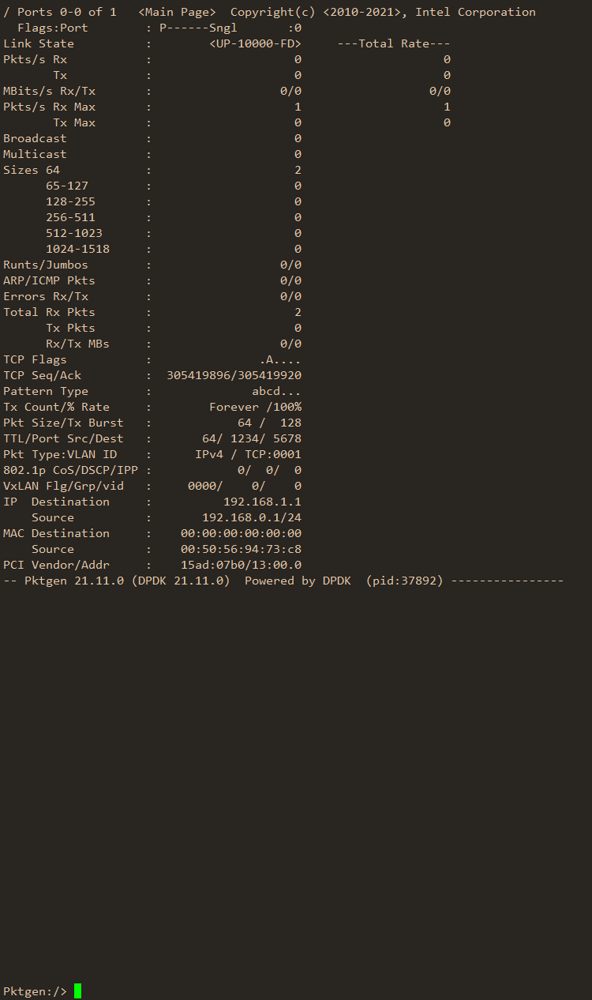
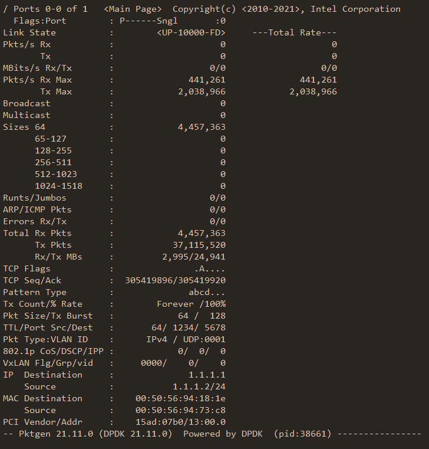

我们自己的数据面系统如何打流测试呢？如果使用Linux协议栈上的测试工具往往是测不出来真正的数据的，而且受制于协议栈，我们最终也无法得到真实的收发情况，因此这时候我们要请出基于DPDK开发的一个打流测试工具——Pktgen。

## 为什么推荐它？

**第一点，性能真的好。** 众所周知，一个数据包抵达网卡之后，网卡会交给驱动做收包处理，并将数据段解析成标准的Linux可使用的数据结构——sk_buff，然后将会沿着Linux的协议栈对数据包进行各种校验、Hook等操作。可以说，尽管有NAPI的加持，但极限条件下受制于境态间拷贝、各种Hook操作等，性能还是不如DPDK这种直接kernel bypass的方案好。使用DPDK Pktgen就很容易测出低速侧的真实速度，不至于打流工具自己先成瓶颈发不出去包了。

**第二点，规避了大量的干扰因素。** Linux会将进程进行调度，你的打流工具可能和其他进程共享逻辑核物理核，测出的基准可能会因为这些变得不准，受制于CPU内缓存命中率的影响，这个误差可能还会被放大。而DPDK可以指定核绑定，甚至你可以将CPU进行隔离，以获得尽可能精准的数据。当然，Pktgen规避这种因素意义不大，网络系统要考虑这种因素。

**第三点，集成的统计。** 正常情况下，使用iperf3之类的打流工具，我们无法得知发出去了究竟有多少个包以及究竟丢了多少（系统和其他应用可能会发送额外的包）。但是DPDK里其在网卡级别实现了发送和接收的实时统计，意味着我们可以跟踪到任何一个发回的包，加上网卡不能被系统和其他应用使用，因此能够很精准得算出丢包率，也能实时看到精确的转发率和吞吐量的信息，非常好用。

**第四点，能够模拟各种各样的包。** 你可以让它生成各种类型的包，包括一些协议的Flag也可以设置，甚至可以提供pcap文件进行回放，虽然不及思博伦的测试仪，但是绝大多数情况下已经相当nice了。

等等等等……

接下来，我们就开始吧！

## 准备虚拟机

此处，我新开了一台虚拟机来写这篇文章，因为我的物理机已经完成了安装。即便是虚拟机也能够使用，但是配置一定要满足要求喔~

需要注意的是，虚拟机受限于软件实现的虚拟交换机的瓶颈，得到的数据可能会有比较大偏差，需要做好心理准备。

**CPU：** 6核心，最少不低于4个，同机带业务测试最少不低于6个

**内存：** 4G以上

**硬盘：** 40G够用

**网卡：** 建议KVM使用VirtIO，VMware平台使用vmxnet3

注意内存不要太小，推荐最小4G，否则编译链接期间可能会出现内存不足的情况导致编译失败，即便是编译成功最后内存太小可能也不够DPDK用。

如果你用虚拟机的话，记得要为虚拟交换机启用混杂模式、伪传输、允许MAC地址改变，否则会造成收不到包。仅限测试环境使用，请勿在生产环境修改。

## 安装系统

此处我使用了**RockyLinux 8**，理论上来说所有**RHEL 8系列**的系统应该都能用。安装时最简安装，不需要安装桌面。

然后更新所有软件，全部更新到最新。

```bash
dnf update -y
```

紧接着，安装一些工具。

```bash
dnf install epel-release -y
dnf install vim bash-completion wget curl -y
```

然后修改`/etc/default/grub`中的内容，按照下边的内容进行修改。

```ini
# 改短开机等待的时间
GRUB_TIMEOUT=1

# 配置内核的命令行参数
GRUB_CMDLINE_LINUX="rhgb crashkernel=0 default_hugepagesz=1G hugepagesz=1G hugepages=1 intel_iommu=off selinux=0"
```

其中，`crashkernel=0`是禁用了内核转储保留的内存空间，不使用内核debug转储的话可以禁用以节省内存；`default_hugepagesz=1G hugepagesz=1G hugepages=1`是启用Hugepage并保留一个大页，供DPDK使用；`intel_iommu=off`是关闭IOMMU，因为我们使用UIO所以用不到IOMMU；`selinux=0`是彻底关闭SELinux，新内核中改配置文件只能让SELinux保持空策略但是不能完全禁用。

然后，再使用`grub2-mkconfig -o <grub.cfg位置>`重新生成Grub2的配置文件即可，**然后重启即可生效**。

重启系统之后，即可看到内存消耗多了1G、SELinux已经被关闭。

```bash
[root@pktgen ~]# free -m
              total        used        free      shared  buff/cache   available
Mem:           5938        1275        4501           8         161        4456
Swap:             0           0           0
[root@pktgen ~]# sestatus 
SELinux status:                 disabled
```

多消耗的1G是预留给Hugepage的。

卸载`firewalld`换装`iptables-services`，避免干扰后续Linux协议栈上应用的测试，切换到iptables。

```bash
dnf remove firewalld -y
dnf install iptables-services -y
```

装完之后没有需求可以不启用，这样就是完全放通。

## 步骤

Pktgen相关的大致分为如下几个步骤，基于上边全新安装的系统，在满足配置条件的情况下，应该是不会出问题的。

- 安装依赖
- 下载、编译、安装DPDK
- 下载、编译、安装Pktgen
- 绑定网卡
- 准备参数
- 设置Pktgen
- 开始打流
- 观察数据

## 安装依赖

安装一些工具和头文件、工具链等。

```bash
dnf groupinstall "Development Tools" -y
dnf install bash unzip vim curl wget -y
dnf install --enablerepo=powertools meson python3-pyelftools python3-pip numactl-devel libbpf-devel libpcap-devel openssl-devel -y
pip3 install ninja
```

## 下载编译安装DPDK

下载21.11版本的DPDK并解压。

```bash
wget https://github.com/DPDK/dpdk/archive/refs/tags/v21.11.zip
unzip v21.11.zip
```

准备编译DPDK。

```bash
cd dpdk-21.11/
meson build
```

此时，会开始进行环境检查，要特别留意一下你所需要的驱动编译上没有，会有下边这一串内容输出，可以看到`virtio`和`vmxnet3`均已经启用编译。

```bash
Message: 
===============
Drivers Enabled
===============

common:
	cpt, dpaax, iavf, octeontx, octeontx2, cnxk, qat, sfc_efx, 
	
bus:
	auxiliary, dpaa, fslmc, ifpga, pci, vdev, vmbus, 
mempool:
	bucket, cnxk, dpaa, dpaa2, octeontx, octeontx2, ring, stack, 
	
dma:
	cnxk, dpaa, hisilicon, idxd, ioat, skeleton, 
net:
	af_packet, af_xdp, ark, atlantic, avp, axgbe, bnx2x, bnxt, 
	bond, cnxk, cxgbe, dpaa, dpaa2, e1000, ena, enetc, 
	enetfec, enic, failsafe, fm10k, hinic, hns3, i40e, iavf, 
	ice, igc, ionic, ixgbe, kni, liquidio, memif, netvsc, 
	nfp, ngbe, null, octeontx, octeontx2, octeontx_ep, pcap, pfe, 
	qede, ring, softnic, tap, thunderx, txgbe, vdev_netvsc, vhost, 
	virtio, vmxnet3, 
raw:
	cnxk_bphy, dpaa2_cmdif, dpaa2_qdma, ntb, skeleton, 
crypto:
	bcmfs, caam_jr, ccp, cnxk, dpaa_sec, dpaa2_sec, nitrox, null, 
	octeontx, octeontx2, openssl, scheduler, virtio, 
compress:
	octeontx, zlib, 
regex:
	octeontx2, 
vdpa:
	ifc, sfc, 
event:
	cnxk, dlb2, dpaa, dpaa2, dsw, octeontx2, opdl, skeleton, 
	sw, octeontx, 
baseband:
	acc100, fpga_5gnr_fec, fpga_lte_fec, la12xx, null, turbo_sw, 
gpu:
```

然后，即可开始编译，编译过程会持续很久。

```bash
cd build
ninja
```

编译成功后，再安装即可。

```bash
ninja install
```

由于DPDK安装时没有安装配置到`pkgconfig`去，因此我们要手工修复一下，这样才能给其他编译的应用链接到。

```bash
echo '/usr/local/lib64' > /etc/ld.so.conf.d/dpdk.conf
ln -s /usr/local/lib64/pkgconfig/libdpdk.pc /lib64/pkgconfig
ln -s /usr/local/lib64/pkgconfig/libdpdk-libs.pc /lib64/pkgconfig
ldconfig
```

到这里，我们就成功把DPDK编译并且安装上了。

通过下边的命令如果可以得到编译参数，此时说明已经能够进行后续操作了。

```bash
[root@pktgen ~]# pkg-config --cflags libdpdk
-I/usr/local/include -include rte_config.h -march=native -mno-avx512f
```

## 下载编译安装Pktgen

下载21.11版本的Pktgen并解压。

```bash
wget https://github.com/pktgen/Pktgen-DPDK/archive/refs/tags/pktgen-21.11.0.zip
unzip pktgen-21.11.0.zip
```

编译Pktgen。

```bash
cd Pktgen-DPDK-pktgen-21.11.0/
make -j
```

如果你按照刚刚的步骤一步一步进行的话，那么此处应该是不会出问题的，看到下边的信息时，就说明编译成功了。

```bash
[70/70] Linking target app/pktgen
>>> Ninja install to '/root/Pktgen-DPDK-pktgen-21.11.0/usr'
```

此时我们需要把编译出的二进制文件安装到系统去。

```bash
mv usr/local/bin/pktgen /usr/local/bin/
```

安装后，执行`pktgen -h`即可看到EAL和程序本身参数的提示，也就说明编译安装成功了。

## 绑定网卡

接下来，我们需要对系统简单配置并绑定网卡，使得其能够满足运行DPDK的要求。

上边安装系统时，我们已经直接配置了Hugepage，因此此处只需要再启用一个模块即可开始绑定网卡。此处，我选择了**UIO模式**来使用网卡，虽然官方推荐使用VFIO，但是此处我们是虚拟机，硬件特性可能无法很好运行，如果你有支持这些特性的纯物理机用来打流测试，那么就可以使用VFIO。

```bash
modprobe uio_pci_generic
```

接下来，将网卡绑定，让网卡使用DPDK提供的用户态驱动，将其从Linux内核卸载下来。**注意，此步骤将会将PCI设备直接从系统中卸载，请不要卸载带外管理的网卡，否则会无法SSH到此机器。**

网卡从系统中卸载后，`ifconfig`或者`ip link`将会看不到原本的接口。

再使用lspci命令，找到需要绑定的网卡，此处我需要绑定第二个PCI设备，也就是`13:00.0`。

```bash
[root@pktgen ~]# lspci 
...
0b:00.0 Ethernet controller: VMware VMXNET3 Ethernet Controller (rev 01)
13:00.0 Ethernet controller: VMware VMXNET3 Ethernet Controller (rev 01)
1b:00.0 Ethernet controller: VMware VMXNET3 Ethernet Controller (rev 01)
```

然后将其绑定。

```bash
dpdk-devbind.py --bind=uio_pci_generic 13:00.0
```

绑定之后，我们可以使用下边的命令检查是否绑定成功。

```bash
[root@pktgen ~]# dpdk-devbind.py -s

Network devices using DPDK-compatible driver
============================================
0000:13:00.0 'VMXNET3 Ethernet Controller 07b0' drv=uio_pci_generic unused=vmxnet3

Network devices using kernel driver
===================================
0000:0b:00.0 'VMXNET3 Ethernet Controller 07b0' if=ens192 drv=vmxnet3 unused=uio_pci_generic *Active*
0000:1b:00.0 'VMXNET3 Ethernet Controller 07b0' if=ens256 drv=vmxnet3 unused=uio_pci_generic
```

可以看到，绑定的网卡`0000:13:00.0`已经成功归属到DPDK驱动下边，另外两张卡由于我还要用，因此此处就不再绑定。

到这里，网卡就绑定成功了。

## 准备参数

参数部分，总共分为两块：**一块是DPDK EAL参数**，即在`--`之前的参数，**一块是应用程序本身的参数**，就是`--`后的参数。这两块参数我们可以使用`-h`来查看。

```bash
[root@pktgen ~]# pktgen -h
Copyright(c) <2010-2021>, Intel Corporation. All rights reserved. Powered by DPDK
EAL: Detected CPU lcores: 6
EAL: Detected NUMA nodes: 1

Usage: pktgen [options]

EAL common options:
  -c COREMASK         Hexadecimal bitmask of cores to run on
  -l CORELIST         List of cores to run on
                      The argument format is <c1>[-c2][,c3[-c4],...]
                      where c1, c2, etc are core indexes between 0 and 128
  --lcores COREMAP    Map lcore set to physical cpu set
                      The argument format is
                            '<lcores[@cpus]>[<,lcores[@cpus]>...]'
                      lcores and cpus list are grouped by '(' and ')'
                      Within the group, '-' is used for range separator,
                      ',' is used for single number separator.
                      '( )' can be omitted for single element group,
                      '@' can be omitted if cpus and lcores have the same value
  -s SERVICE COREMASK Hexadecimal bitmask of cores to be used as service cores
  --main-lcore ID     Core ID that is used as main
  --mbuf-pool-ops-name Pool ops name for mbuf to use
  -n CHANNELS         Number of memory channels
  -m MB               Memory to allocate (see also --socket-mem)
  -r RANKS            Force number of memory ranks (don't detect)
  -b, --block         Add a device to the blocked list.
                      Prevent EAL from using this device. The argument
                      format for PCI devices is <domain:bus:devid.func>.
  -a, --allow         Add a device to the allow list.
                      Only use the specified devices. The argument format
                      for PCI devices is <[domain:]bus:devid.func>.
                      This option can be present several times.
                      [NOTE: allow cannot be used with block option]
  --vdev              Add a virtual device.
                      The argument format is <driver><id>[,key=val,...]
                      (ex: --vdev=net_pcap0,iface=eth2).
  --iova-mode   Set IOVA mode. 'pa' for IOVA_PA
                      'va' for IOVA_VA
  -d LIB.so|DIR       Add a driver or driver directory
                      (can be used multiple times)
  --vmware-tsc-map    Use VMware TSC map instead of native RDTSC
  --proc-type         Type of this process (primary|secondary|auto)
  --syslog            Set syslog facility
  --log-level=<level> Set global log level
  --log-level=<type-match>:<level>
                      Set specific log level
  --log-level=help    Show log types and levels
  --trace=<regex-match>
                      Enable trace based on regular expression trace name.
                      By default, the trace is disabled.
		      User must specify this option to enable trace.
  --trace-dir=<directory path>
                      Specify trace directory for trace output.
                      By default, trace output will created at
                      $HOME directory and parameter must be
                      specified once only.
  --trace-bufsz=<int>
                      Specify maximum size of allocated memory
                      for trace output for each thread. Valid
                      unit can be either 'B|K|M' for 'Bytes',
                      'KBytes' and 'MBytes' respectively.
                      Default is 1MB and parameter must be
                      specified once only.
  --trace-mode=<o[verwrite] | d[iscard]>
                      Specify the mode of update of trace
                      output file. Either update on a file can
                      be wrapped or discarded when file size
                      reaches its maximum limit.
                      Default mode is 'overwrite' and parameter
                      must be specified once only.
  -v                  Display version information on startup
  -h, --help          This help
  --in-memory   Operate entirely in memory. This will
                      disable secondary process support
  --base-virtaddr     Base virtual address
  --telemetry   Enable telemetry support (on by default)
  --no-telemetry   Disable telemetry support
  --force-max-simd-bitwidth Force the max SIMD bitwidth

EAL options for DEBUG use only:
  --huge-unlink       Unlink hugepage files after init
  --no-huge           Use malloc instead of hugetlbfs
  --no-pci            Disable PCI
  --no-hpet           Disable HPET
  --no-shconf         No shared config (mmap'd files)

EAL Linux options:
  --socket-mem        Memory to allocate on sockets (comma separated values)
  --socket-limit      Limit memory allocation on sockets (comma separated values)
  --huge-dir          Directory where hugetlbfs is mounted
  --file-prefix       Prefix for hugepage filenames
  --create-uio-dev    Create /dev/uioX (usually done by hotplug)
  --vfio-intr         Interrupt mode for VFIO (legacy|msi|msix)
  --vfio-vf-token     VF token (UUID) shared between SR-IOV PF and VFs
  --legacy-mem        Legacy memory mode (no dynamic allocation, contiguous segments)
  --single-file-segments Put all hugepage memory in single files
  --match-allocations Free hugepages exactly as allocated

===== Application Usage =====

Usage: pktgen [EAL options] -- [-h] [-v] [-P] [-G] [-T] [-f cmd_file] [-l log_file] [-s P:PCAP_file] [-m <string>]
  -s P:file    PCAP packet stream file, 'P' is the port number
  -s P:file0,file1,... list of PCAP packet stream files per queue, 'P' is the port number
  -f filename  Command file (.pkt) to execute
  -l filename  Write log to filename
  -P           Enable PROMISCUOUS mode on all ports
  -g address   Optional IP address and port number default is (localhost:0x5606)
               If -g is used that enable socket support as a server application
  -G           Enable socket support using default server values localhost:0x5606 
  -N           Enable NUMA support
  -T           Enable the color output
  -v           Verbose output
  -j           Enable jumbo frames of 9600 bytes
  --txd=N      set the number of descriptors in Tx rings to N 
  --rxd=N      set the number of descriptors in Rx rings to N 
  --no-crc-strip  Do not strip CRC on all ports, (Default is to strip crc)
  -m <string>  matrix for mapping ports to logical cores
      BNF: (or kind of BNF)
      <matrix-string>   := """ <lcore-port> { "," <lcore-port>} """
      <lcore-port>      := <lcore-list> "." <port-list>
      <lcore-list>      := "[" <rx-list> ":" <tx-list> "]"
      <port-list>       := "[" <rx-list> ":" <tx-list>"]"
      <rx-list>         := <num> { "/" (<num> | <list>) }
      <tx-list>         := <num> { "/" (<num> | <list>) }
      <list>            := <num> { "/" (<range> | <list>) }
      <range>           := <num> "-" <num> { "/" <range> }
      <num>             := <digit>+
      <digit>           := 0 | 1 | 2 | 3 | 4 | 5 | 6 | 7 | 8 | 9
      1.0, 2.1, 3.2                 - core 1 handles port 0 rx/tx,
                                      core 2 handles port 1 rx/tx
                                      core 3 handles port 2 rx/tx
      1.[0-2], 2.3, ...             - core 1 handle ports 0,1,2 rx/tx,
                                      core 2 handle port 3 rx/tx
      [0-1].0, [2/4-5].1, ...       - cores 0-1 handle port 0 rx/tx,
                                      cores 2,4,5 handle port 1 rx/tx
      [1:2].0, [4:6].1, ...         - core 1 handles port 0 rx,
                                      core 2 handles port 0 tx,
      [1:2].[0-1], [4:6].[2/3], ... - core 1 handles port 0 & 1 rx,
                                      core 2 handles port  0 & 1 tx
      [1:2-3].0, [4:5-6].1, ...     - core 1 handles port 0 rx, cores 2,3 handle port 0 tx
                                      core 4 handles port 1 rx & core 5,6 handles port 1 tx
      [1-2:3].0, [4-5:6].1, ...     - core 1,2 handles port 0 rx, core 3 handles port 0 tx
                                      core 4,5 handles port 1 rx & core 6 handles port 1 tx
      [1-2:3-5].0, [4-5:6/8].1, ... - core 1,2 handles port 0 rx, core 3,4,5 handles port 0 tx
                                      core 4,5 handles port 1 rx & core 6,8 handles port 1 tx
      [1:2].[0:0-7], [3:4].[1:0-7], - core 1 handles port 0 rx, core 2 handles ports 0-7 tx
                                      core 3 handles port 1 rx & core 4 handles port 0-7 tx
      BTW: you can use "{}" instead of "[]" as it does not matter to the syntax.
  -h           Display the help information
```

可以看到，参数非常长，大家可以根据需要自行去设置，此处我就只贴了我比较常用的配置并解释一下。

```bash
pktgen -l 0,1 -m 768 -a 0000:13:00.0 --iova-mode=pa -- -P -m 1.0
```

其中：

- `-l 0,1` 是DPDK使用的逻辑核。由于DPDK使用忙轮询的方式处理会把CPU拉满，我们要指定使用的物理核。推荐DPDK的主线程独占一个核，每个队列分配一个核，此处我只有一个端口并且vmxnet3是不支持多队列，因此我就分配了两个核，即0号核和1号核
- `-m 768` 是为DPDK分配的内存。我Hugepage只设置了1G，因此此处设置768M即可
- `-a 0000:13:00.0` 是允许的PCI设备。为了防止DPDK把所有的网卡都进行接管，这里我们只需要让它接管我们刚刚绑定的一个网卡设备即可
- `--iova-mode=pa` 内存寻址模式，只能用PA，VA会导致接口无法初始化
- `--` 分隔号，前边的就是EAL参数，后边的就是应用程序的参数
- `-P` 为网卡启用混杂模式，以免MAC地址不对的情况下收不到包
- `-m 1.0` 为绑定端口到某个逻辑核，此处我把第0个端口（1.0中的0）绑定到1号核（1.0中的1），0号核留给DPDK主线程。**这个参数一定要设置，否则可能会提示找不到端口**

使用这些参数即可启动测试工具，我们即可得到这样个界面。



## 设置Pktgen

接下来，我们就要设置Pktgen，好比设置发包大小、数量、协议、IP等。对于这些参数，如果想了解更多可以去查看官方的文档[^1]。

[^1]: https://pktgen-dpdk.readthedocs.io/en/latest/commands.html

此处，我进行了下面这些设置。由于此处只有一个端口（port），ID为0，因此下边set时都是针对这个0号端口进行设置。

```bash
# 不设置数量，一直发送
set 0 count 0
# 设置单包长度，此处我是测小包
set 0 size 64
# 设置IP类型
set 0 type ipv4
# 设置L4协议
set 0 proto udp
# 设置目标IP，不用设置子网
set 0 dst ip 1.1.1.1
# 设置源IP，要设置子网
set 0 src ip 1.1.1.2/24
# 设置目标MAC
set 0 dst mac 00:50:56:94:18:1e
# 设置发出的MAC，最好和网卡MAC保持一致
set 0 src mac 00:50:56:94:73:c8
```

设置完成后，你可以使用`save <配置名>`来保存配置，此时在你bash停留的目录下就会生成个文件，后续你就可以使用`load <配置名>`将其加载回来。

## 开始打流

使用我们刚刚配置好的0号端口开始打流，使用下边命令即可开始。

```bash
start 0
```

使用下边的命令即可停止。

```bash
stop 0
```

打流过程中，可以查看上边的看板，上边会定期更新发送和接收情况。

## 观察数据

第一列是参数名称，第二列就是0号端口，第三列是全部。



细致的配置的话，我就挑几个目前自己比较常用的说明一下：

- `Link State` 链路状态，可以看到是否打开、速率、双工模式
- `Pkts/s Rx` 每秒的接收包数量，`Tx` 则是每秒的发送包数量
- `MBits/s Rx/Tx` 吞吐量
- `Pkts/s Rx Max` 每秒收包的最大值，`Tx` 就是每秒的发包最大值
- `Broadcast` 是广播，`Multicast` 是组播
- `Sizes` 的几行是不同大小的包的计数，一般我们用小包（64byte）测试转发率，用大包（1000+）测试吞吐量
- `Errors Rx/Tx` 错误包计数
- `Total` 总计

下边的那几行就是配置了，就不再赘述。

## 其他注意

如果你想尽可能得到准确的测试数据，在现有区分逻辑核的情况下，你还需要将这些逻辑核进行隔离，即在Linux启动时不要将任何任务调度到这些隔离的核上，让DPDK和你的业务程序（数据面系统）独立享用这几个逻辑核，以尽可能保证不会被其他程序调度和抢占。

## 写在最后

DPDK是个好东西，不仅能解决高性能转发面的转发需求，在测试场景下同样也能发挥相当大的作用，甚至还有基于其开发的用户态协议栈（好比mTCP、fStack等），还是相当不错的。当然，其有这些能力也必定其他方面有些损失，好比额外的系统和硬件要求、额外的开发工作、比较难用作通用场景等，因此，根据我们实际的需求来选型就好啦~
