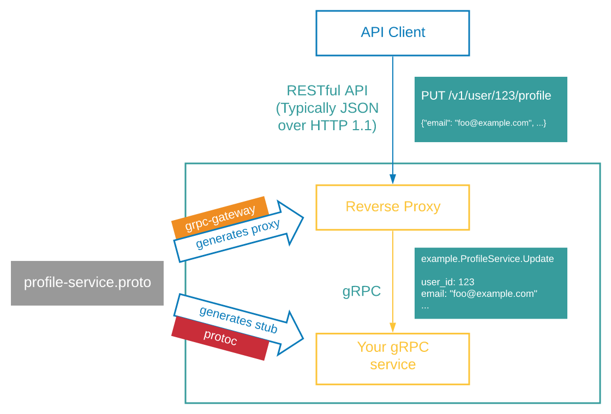

众所周知，Google的gRPC体系可谓是相当好用，在有protoc这样的工具加持下，原本要维护调用侧和服务侧两部分代码，现在写完proto文件直接交给protoc编译一下即可，可谓是减少了不少工作量。但是，如果我就是要兼容HTTP API，那么这又怎么处理呢？

方法就是——gRPC-Gateway[^1]。抛去兼容HTTP API不说，如果你本身就在使用RESTful HTTP API，那么仍然可以使用gRPC-Gateway来生成代码，从原本维护两侧代码到现在，你可以只需要一些proto文件就可以搞定你的HTTP API，还是相当省心的。

在开始这篇文章之前，我认为你已经了解了protobuf的语法。

[^1]: https://grpc-ecosystem.github.io/grpc-gateway/

## 什么是gRPC Gateway

它是protoc的一个插件，能够将protobuf定义翻译成RESTful JSON API，这样一来就可以透过CDN这种反向代理器来兼容使用原本gRPC的了。同时使用它提供的go库和gRPC库，即可同时提供HTTP兼容访问和原生gRPC访问，如下图[^1]。




## gRPC定义转译

使用gRPC-Gateway，它所提供的protoc插件将会将gRPC定义转译为HTTP API相关代码，因此我们需要知道它所需要哪些options以及转译关系，可以去查看googleapis中的相关定义[^2]。

[^2]: https://github.com/googleapis/googleapis/blob/f46dc249e1987a6bef1a70a371e8288ea4c17481/google/api/http.proto#L44

此处，我就简单列了一部分。

```protobuf
service Messaging {
  rpc UpdateMessage(UpdateMessageRequest) returns (Message) {
    option (google.api.http) = {
      patch: "/v1/messages/{message_id}"
      body: "message"
    };
  }
}
message UpdateMessageRequest {
  string message_id = 1; // mapped to the URL
  Message message = 2;   // mapped to the body
}
```

可以看到，相比原生的gRPC，这段proto中为接口额外定义了一些参数，这些参数需要导入`google.api.http`的依赖后才能使用，关于如何导入以及编译，我们放到后文，此处我们就来看看这个转译的规则。

其中，`patch`为请求的类型，你也可以选择`get`、`post`等其他类型，来实现你的RESTful。在这个参数中，可以将Request中的参数直接带入到URL中，你也可以设置`body`来决定哪些参数放在URL中而不是在HTTP body中。

Google AIPs提供了更多用法，包括REST的标准类型和自定义类型，可以前往官方页面[^3]查看。

[^3]: https://google.aip.dev/127

## 简介buf

很多语言都有它自己的包管理器来管理依赖，protobuf也有它的包管理器——buf[^4]。本文，我就用buf来管理这些protobuf的依赖。

[^4]: https://buf.build

我在一开始使用gRPC时，是直接使用protoc生成代码，在不引入其他protobuf依赖的情况下，这样做也比较快捷。但是当引用依赖多起来时，protoc的参数便会逐渐多起来，要手工管理的vendor也就越来越多，成了额外的负担。buf的出现，不仅带来了一套独立的依赖管理模式，还带来了其独有的BSR（Buf Schema Registry），protobuf也拥有了其依赖的家。

## 安装go、protoc及其插件

接下来，我以Rocky Linux 8为环境进行测试并写了这篇文章，如果你是其他Linux系统，命令可能会稍微有所不同。

在我使用的Rocky Linux 8的rpm镜像中，只有Go 1.17.7版本的包，因此此处我就使用此版本来进行后续操作。如果你是CentOS 7的系统，可能要留意一下protobuf-compiler的版本号，可能会比较老导致无法正常使用。

```bash
# dnf install go -y
# dnf install protobuf-compiler -y
```

安装完这两个包之后，我们切到普通用户，安装go的相关依赖。**注意不要在go的项目目录中进行操作**，可能会造成错误。

```bash
$ go install google.golang.org/protobuf/cmd/protoc-gen-go@v1.28
$ go install google.golang.org/grpc/cmd/protoc-gen-go-grpc@v1.2
$ go install github.com/grpc-ecosystem/grpc-gateway/v2/protoc-gen-grpc-gateway@latest
```

安装后，会有三个二进制文件要被用到，一个是`protoc-gen-go`，一个是`protoc-gen-go-grpc`，一个是`protoc-gen-grpc-gateway`，正常情况下go可能不会把二进制文件目录添加到PATH中，此处我们要自己操作一下。

```bash
$ export PATH="$PATH:$(go env GOPATH)/bin"
```

这样设置后，**即可在本次退出bash前**，使用刚刚安装的二进制文件。

## 安装buf

在安装buf前，你需要在系统上安装了`git`和`jq`[^5]，使用下方命令安装即可。

```bash
# dnf install git jq -y
```

[^5]: https://docs.buf.build/tour/introduction#prerequisites

然后，可以使用下方命令快速安装buf。**需要root执行**。

```bash
# Substitute BIN for your bin directory.
# Substitute VERSION for the current released version.
BIN="/usr/local/bin" && \
VERSION="1.6.0" && \
  curl -sSL \
    "https://github.com/bufbuild/buf/releases/download/v${VERSION}/buf-$(uname -s)-$(uname -m)" \
    -o "${BIN}/buf" && \
  chmod +x "${BIN}/buf"
```

此时，你就可以直接使用`buf`命令了。

## 为项目引入buf

此处我随便创建了一个go项目来举例，项目根目录就是这个go项目的目录（忽略go.mod）。

你需要先创建一个`proto`目录（名称随意），用来存放所有的proto文件，此处我已经创建了`pigapi/v1`，并在其下放了一个`baseconf.proto`，可以先忽略。

然后，在proto目录下使用命令`buf mod init`进行初始化。初始化后，你就会得到下边这样的目录结构。

```
项目根目录
└── proto
    ├── buf.yaml
    └── pigapi
        └── v1
            └── baseconf.proto
```

初始化后，就可以看到proto目录下多了一个`buf.yaml`文件，其内容大概是如下这样。

```yaml
version: v1
lint:
  use:
    - DEFAULT
breaking:
  use:
    - FILE
```

你可以增加你需要的依赖（如下）到`buf.yaml`中即可导入依赖。此处我添加了两个，第一个是googleapis，第二个用于参数检验。本文我只用到了第一个依赖，第二个依赖感兴趣的话可以自行查阅文档（会有惊喜噢）~

```yaml
deps:
  - buf.build/googleapis/googleapis
  - buf.build/envoyproxy/protoc-gen-validate
```

添加依赖后，你需要使用`buf mod update`来生成`buf.lock`文件（**在proto目录下执行**）。那么此时此刻，你就得到了下边这样的目录结构。

```
项目根目录
└── proto
    ├── buf.lock
    ├── buf.yaml
    └── pigapi
        └── v1
            └── baseconf.proto
```

紧接着我们分别在**项目根目录**创建目录`api`、文件`buf.gen.yaml`和文件`buf.work.yaml`。

其中，文件`buf.gen.yaml`的内容如下。
```yaml
version: v1
plugins:
  - name: go
    out: api
    opt: paths=source_relative
  - name: go-grpc
    out: api
    opt: paths=source_relative
  - name: grpc-gateway
    out: api
    opt: paths=source_relative
```

所谓的plugins也就是你使用的protoc的插件，此处我需要同时生成原生gRPC代码和RESTful HTTP代码，因此我就添加了三个插件，并让它们把生成的代码全部放到`api`目录下。`opt`选项的`paths=source_relative`则是确保protoc生成的代码的路径与proto文件的路径保持一致。

然后，文件`buf.work.yaml`的内容如下。

```yaml
version: v1
directories:
  - proto
```

这个`directories`也就是指明了proto目录位置（注意不是项目根目录）。

此处再次强调一下，在proto目录下进行初始化操作，然后在项目根目录下创建`buf.gen.yaml`和`buf.work.yaml`这两个文件，不要整错~

## 编写proto文件

我们再来看看刚刚创建的项目中的`baseconf.proto`文件的内容。

```yaml
syntax = "proto3";

package pigapi.v1;

import "google/api/annotations.proto";
import "google/protobuf/empty.proto";
import "validate/validate.proto";

option go_package = "pig/api/pigapi/v1";

message GetBaseConfigRequest {
  uint64 test = 1;
}

message GetBaseConfigResponse {
  uint64 test = 1;
}

service BaseConfigService {
  rpc GetBaseConfig(GetBaseConfigRequest) returns (GetBaseConfigResponse) {
    option (google.api.http) = {
      get: "/v1/pigconfig"
    };
  }
}
```

需要特别注意如下这几个内容。

* `package pigapi.v1;` 一个目录下的所有proto文件应当拥有相同的package名称
* `option go_package = "pig/api/pigapi/v1";` 要与上方的package对应，但是这里是生成的go代码的package

如果你安装了buf的GoLand插件，那么此时这个插件还会为你检查语法是否规范，可以按照其提示进行修改。

## 生成代码

此时，你就可以在**项目根目录下**使用`buf generate`命令来生成代码了。

生成代码之后，就可以得到下边这样的目录结构，然后就可以直接在go里导入`api/pigapi/v1`下的代码使用了~至于如何在Go中使用，可以直接参考官方文档[^6]，本文就不再赘述了。

[^6]: https://grpc-ecosystem.github.io/grpc-gateway/docs/tutorials/adding_annotations/#using-protoc

```
项目根目录
├── api
│   └── pigapi
│       └── v1
│           ├── baseconf_grpc.pb.go
│           ├── baseconf.pb.go
│           └── baseconf.pb.gw.go
├── buf.gen.yaml
├── buf.work.yaml
└── proto
    ├── buf.lock
    ├── buf.yaml
    └── pigapi
        └── v1
            └── baseconf.proto
```

## 为GoLand加入buf支持

默认情况下，GoLand不会索引到依赖的protobuf文件，因此如果你需要补全提示，或者像我一样强迫症，那么你需要去应用商店安装**Buf for Protocol Buffers**这个插件，安装后重启GoLand，protobuf的依赖就可以正常高亮和自动补全了。


## 更多

本文只是简单入门，以解决现有问题。你可以前往buf官方的文档[^7]，这里有官方提供的`buf-tour`例程，你可以仿照该例程的目录结构和代码来尝试更多内容。在此文档上，你还能找到更多细节的配置。

[^7]: https://docs.buf.build/tour/introduction

## 写在最后

有了buf的加成，稍加改动的protobuf同时可以转译出两份代码，一边可以为原生gRPC提供服务，一边可以兼容RESTful HTTP API，为gRPC的生态又补上了一块。有了这些新工具，开发者就可以更加关注业务本身，无需再为业务之外的东西（比如依赖管理）操心，非常有助于效率提升。

