 

大家好，最近想了想决定在博客开辟“网络方案”的板块，结合博主我所熟悉的MikroTik、H3C、华为等商用设备以及基于Linux的网络系统（如常规发行版Linux、VyOS、OpenWRT），为大家推荐一些能够覆盖家用、工作室及小规模办公室的网络方案，这些方案有各自的侧重点和缺点，适合不同场景使用，当然如果你有你独特的需求，也欢迎和我一起讨论~

这篇文章，我们就先来看看博主我自己家的网络方案。

## 写在开始

大家中秋节和教师节快乐~

早在一些日子之前，我家的内网里还是跑BGP的，为了和朋友、云上的内网间互通，我们在骨干网和边缘使用了大量的BGP实例，一度可以说几乎只有AP不用BGP，剩下的都会跑，甚至云上的服务器间都是通过BGP EVPN打通的。

我们开发了自己的基础设施架构和NOC，试图去改善这么大一套复杂的体系，后边发现其实在边缘引入BGP就极大化复杂了网络，毕竟比上我们不是CLOS，比下又真的需要BGP。当故障时算是不太好排错的，也给接入和认证带来了很大不便。这时候我们认识到，网络体系应当以最简为主，围绕最简单的RFC标准、不轻易造数据面、不乱改标准的数据路径、在尽可能低的OSI解决问题这几个思路，尝试重新构建了新的网络方案。

这个家庭的网络方案是我在推翻以往BGP方案后的第二代产物，它解决了一代直接一个OpenWRT带来的一些问题，同时又能恰到好处补上OpenWRT才有的一些功能。

## 架构


## 核心诉求

* 稳定第一。安装了UPS，能够保证NAS和IOT设备供电稳定，但是需要这些设备不要走OpenWRT，以免引入不确定因素。
* 保证PT下载机能够正常下载和做种。博主我也是PT玩家，因此在淘汰的老NUC上装上了一块5400转的机械盘跑Transmission，需要能够使用IPv6和公网IPv4映射。
* 确保直接走主网关的设备能够正常解析和使用IPv6。
* 解决OpenWRT不能指定IPv6委派前缀的生存时间问题。国内ISP非常喜欢72小时就把用户强制踢下线，这样一来公网IPv4和IPv6前缀就会发生更新，如果正好是在白天，则会造成网络的闪断，非常影响使用，因此一般我会设置在每天凌晨自动断开PPPoE并且重拨，保证白天不会被踢断线。由于OpenWRT的DHCPv6服务器不能支持IPv6 PD前缀的生存时间重写、优选时间重写，然而ISP下发的前缀又是3天的生存时间，这样一来每天重拨就会导致老前缀卡在所有内网设备上，造成IPv6无法联网，PT机无法做种，体验极差。OpenWRT的有状态DHCPv6一度还不生效，不知道是bug还是压根没支持好。
* 使用状态防火墙过滤掉入向的IPv6低位端口，确保内网安全。
* 能有个设备停电后（UPS耗尽），能通过WOL唤起NUC开机，保证在外能够正常连上开发机。因此这也是为什么主网关选用低功耗的硬路由，因为它总是能开机的，并且能最快速度启动，UPS能额外支撑它运行一天都没问题。

## 缺点

* 这套网络里把所有的设备全部放在了一个子网里，包括IOT设备。因此需要为WiFi设置强密码，尽量不公开密码，以免成为攻击入口。
* 没有办法严谨管控哪些设备能用OpenWRT旁路由、哪些设备不能用，设备上仍然可以自己修改网关和DNS服务器来绕过，因此比较适合小环境使用。
* 需要自己管理地址池并添加DHCP选项。

## 概览

本文我主要写主网关和旁路网关的配置，其中会带入一些虚拟化的配置，其他内容需要大家自行查阅~ **完整的脚本直接附在了文章末尾，可以自行取用~** 但是特别注意，完整的脚本带有很多额外的配置，文章中的则只围绕主题因此删减掉了很多。

这个方案中，主要利用了MikroTik RouterOS的`DHCP Option`功能，给不同的终端下发不同的网关和DNS（仅限IPv4栈），让指定的终端设备走OpenWRT，默认直接走主网关。如下图中，分配了OpenWRT作为网关的设备，流量会沿着红色的虚线走；其他保持默认的则沿着蓝色的路线走；IPv6则始终沿着蓝色的虚线直接走主网关。这样一来，就可以指定只有自己的手机电脑走OpenWRT，其他直接走主网关，即便OpenWRT偶尔网络故障或者bug也不会影响内网的IOT硬件，PT下载机也不会不小心把流量走到OpenWRT给转发到海外去导致被ban了。


当然，这会引入一个新问题，如果OpenWRT返回了IPv6的DNS解析记录，那么会导致走成主网关的路径。因此，我们需要为IPv6 SLAAC设置不再通告DNS，让设备解析域名时只使用IPv4的服务器来解，这样在OpenWRT的DNS服务器设置过滤IPv6的AAAA记录后，即可避免流量不小心走到IPv6栈上去，但是又不会影响直连IPv6的业务访问，PT机也可以直接通过IPv6做种。

在这种情况下，旁路由一定会进行一次NAT，同时如果你在旁路由上启动了某些出海应用，则终端访问到OpenWRT默认会使用1400以上的TCP MSS，因此加密发出时长度会过大，到主网关会进行二次分片，造成大量乱序和重传，导致网页一直转圈圈无法打开，因此需要对旁路由单独设置略低的MSS以避免在主网关过多分片，详见后文。

按照上边的思路配置完成后，我们即可构建出一套非常稳定、又可以灵活选择网关的一套家庭网络，还能同时并存双栈又不影响使用OpenWRT和PT机。

## 配置主网关

此处，我的主网关为`MikroTik RB760iGS`，一台MT7621的设备。看似比较落后的配置，但是凭着5W不到的功耗、优秀的硬件NAT性能，跑满500Mbps的带宽完全没有压力，仅仅只要百来块钱，还能拥有功能丰富的防火墙等功能，还是相当划算。

我在这里带大家过一些比较重要的配置，完整的配置我直接贴在后文，需要的小伙伴可以直接划到后边自取~注意需要修改，直接复制粘贴不一定能用噢。

### 配置PPPoE拨号和自动重拨

首先，我给我的1号接口改个名字，方便后边在WinBox中识别。

```bash
/interface ethernet
set [ find default-name=ether1 ] loop-protect=off name=ether1-wan-onu
```

接下来，设置PPPoE的配置，并且创建PPPoE的拨号客户端。注意这里接口的名称设置完之后，后边就不要再改了，下边会有个脚本直接使用的接口名，改了会导致脚本失效。

此处我没有设置TCP MSS和UPnP，稍后我们单独配置。MTU和MRU建议都设置在1480，据说有的地区MTU是1480有的是1492，因此这里直接设置1480最保险，也不差这点大包性能。

**如果你有公网IPv4，一定记得在设置PPPoE拨号之前，先为路由器设置强密码，博主我一开始设置密码后拨号，还没有设置防火墙，短短十几分钟的时间日志中上百条爆破登录失败的错误日志。如果你直接空密码拨号并且获取了公网IPv4，那么很可能还没来得及设置密码和防火墙，你的路由器就被外部的攻击给爆破了。**

```bash
/ppp profile
add change-tcp-mss=no name=pppoe-ct only-one=yes use-compression=no \
    use-encryption=no use-mpls=no use-upnp=no
/interface pppoe-client
add add-default-route=yes comment="-- do not change the name" \
    default-route-distance=100 disabled=no interface=ether1-wan-onu max-mru=\
    1480 max-mtu=1480 name=pppoe-ct profile=pppoe-ct use-peer-dns=yes user=\
    <你的PPPoE用户名> password=<你的PPPoE密码>
```

接下来，我们设置计划任务，每天凌晨自动断开并重拨PPPoE重新获取IP地址，这样可以避免白天时候因为72小时到了被ISP强制踢下线重拨。当然为了防止5点断开PPPoE后停电，导致没来得及在5点1分启动后拨号，因此我设置了个开机启用PPPoE接口。

```bash
/system scheduler
add interval=1d name="set down pppoe" on-event=\
    "/interface/pppoe-client/disable pppoe-ct" policy=\
    ftp,reboot,read,write,policy,test,password,sniff,sensitive,romon \
    start-date=sep/07/2021 start-time=05:00:00
add interval=1d name="set up pppoe" on-event=\
    "/interface/pppoe-client/enable pppoe-ct" policy=\
    ftp,reboot,read,write,policy,test,password,sniff,sensitive,romon \
    start-date=sep/07/2021 start-time=05:01:00
add comment="-- set up pppoe when startup, recovery state from unexpected shutdown" \
    name="set up pppoe when startup" on-event=\
    "/interface/pppoe-client/enable pppoe-ct" policy=\
    ftp,reboot,read,write,policy,test,password,sniff,sensitive,romon \
    start-time=startup
```

### 配置接口和IPv4网络

添加桥的接口，此桥就是我们LAN（内网）的网桥，MAC地址没有经验的话建议保持此配置，以免设置成组播地址。注意我有禁用的接口~

```bash
/interface bridge
add admin-mac=94:94:26:00:00:01 auto-mac=no name=bridge-lan protocol-mode=\
    none
/interface ethernet
set [ find default-name=ether2 ] arp=disabled loop-protect=off name=\
    ether2-lan-synology_nas
set [ find default-name=ether3 ] arp=disabled loop-protect=off name=\
    ether3-lan-intel_nuc
set [ find default-name=ether4 ] arp=disabled disabled=yes loop-protect=off \
    name=ether4-lan
set [ find default-name=ether5 ] arp=disabled loop-protect=off name=\
    ether5-lan-h3c_ap
set [ find default-name=sfp1 ] arp=disabled disabled=yes loop-protect=off \
    name=sfp1-lan
/interface bridge port
add bridge=bridge-lan interface=ether2-lan-synology_nas
add bridge=bridge-lan interface=ether3-lan-intel_nuc
add bridge=bridge-lan interface=ether4-lan
add bridge=bridge-lan interface=ether5-lan-h3c_ap
add bridge=bridge-lan interface=sfp1-lan
```

紧接着，为桥设置内网IP地址`192.168.1.1/24`，并为连接ONU的接口设置IP，以保证后续你能打开ONU（即光猫）的控制台。我的光猫的IPv4地址为`192.168.100.1`掩码是`24`，因此配置就如下。

```bash
/ip address
add address=192.168.1.1/24 interface=bridge-lan network=192.168.1.0
add address=192.168.100.2/24 interface=ether1-wan-onu network=192.168.100.0
```

当然，仅设置地址还不够，还需要在防火墙上设置NAT，我们才能访问到ONU的管理地址和公网。

````bash
/ip firewall nat
add action=masquerade chain=srcnat comment="-- NAT to pppoe" out-interface=\
    pppoe-ct
add action=masquerade chain=srcnat comment="-- NAT to onu" out-interface=\
    ether1-wan-onu
````

这样一来，你就可以在拨号之后，手工配置静态内网IP地址和DNS，开始网络冲浪了~

### 配置DHCPv4

接下来，我们要配置DHCPv4，让客户端连上WiFi或者插上网线，能自己获取到地址，不用人工配IP。

这里重头戏就来了，为了能够让不同的设备分配到不同的网关和不同的DNS，需要使用MikroTik RouterOS的`DHCP Option`给客户端下发不同的参数。其中：

* `Code 3`为网关，值填写你的OpenWRT地址即可，比如`'192.168.1.2'`，要包含单引号
* `Code 6`为DNS服务器，值填写你的OpenWRT地址即可，用OpenWRT来解析，也要带单引号

将这两个Option添加到一个集合里，就可以为客户端一口气下发两个参数。

命令如下：

```bash
/ip dhcp-server option
add code=3 name=Gateway-OpenWRT value="'192.168.1.2'"
add code=6 name=DNS-OpenWRT value="'192.168.1.2'"
/ip dhcp-server option sets
add name=UseOpenWRT options=Gateway-OpenWRT,DNS-OpenWRT
```

然后我们创建基本的DHCP服务器，让它默认给客户端下发`192.168.1.1`（即主网关本身）作为网关和DNS，命令如下：

```bash
/ip pool
add name=pool-lan-dhcp ranges=192.168.1.100-192.168.1.199
/ip dhcp-server
add add-arp=yes address-pool=pool-lan-dhcp bootp-support=none \
    client-mac-limit=512 interface=bridge-lan lease-time=1h name=server-lan
/ip dhcp-server network
add address=192.168.1.0/24 dns-server=192.168.1.1 domain=lan gateway=\
    192.168.1.1 netmask=24
```

然后设置一下DNS服务器，可以根据你的情况进行修改，命令如下：

```bash
/ip dns
set allow-remote-requests=yes cache-max-ttl=1d cache-size=4096KiB \
    max-concurrent-queries=1000 max-concurrent-tcp-sessions=50 \
    max-udp-packet-size=1024 query-server-timeout=1s query-total-timeout=5s \
    servers=223.5.5.5,223.6.6.6,119.29.29.29
```

当新设备连入的时候，就可以按照这样的步骤操作转成下发OpenWRT旁路网关：

* 在WinBox中，进入`IP` -> `DHCP Server` -> `Leases`，将你需要的某个客户端的记录转为静态分配。 
  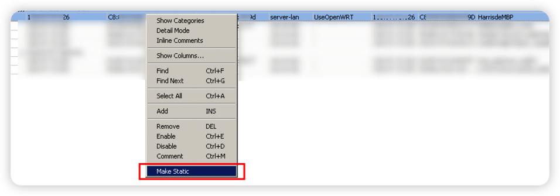

* 双击打开记录，将DHCP Option Set设置选中我们刚刚设置的`UseOpenWRT`，然后点击`Apply`保存应用。

  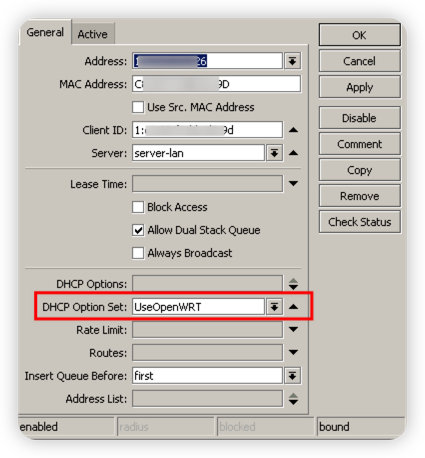

这时候，你的设备重新连上WiFi或者重新插上网线，获取到的新网关和DNS服务器就会是我们指定的OpenWRT的地址了。

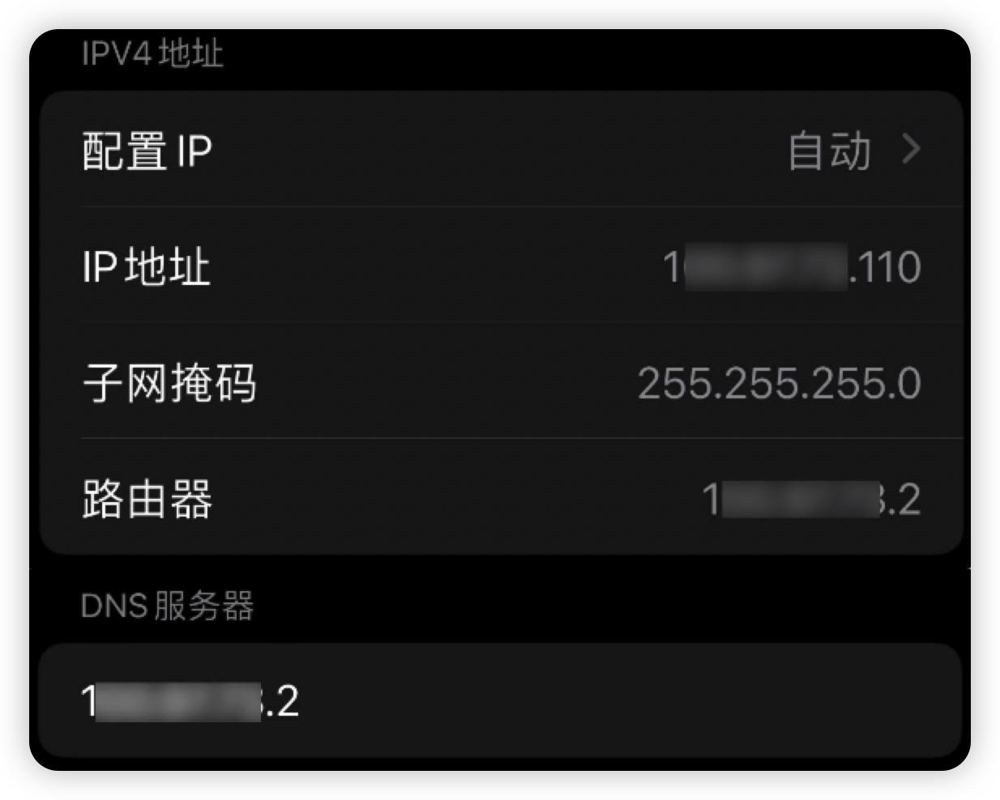

而没有经过此设置的的设备，就会获取到默认的网关和DNS为`192.168.1.1`。芜湖~

### 配置IPv4防火墙

因为我这里有公网IP，因此我需要再防火墙上设置状态防火墙，将从内网到公网的放行，拒绝掉从公网进来的请求。此处我将ONU进来的一块设置了规则，同时打开了RouterOS的FastTrack，用来提高数据包转发的速度。

```bash
/ip firewall filter
add action=fasttrack-connection chain=forward comment=\
    "-- fast track all forward" hw-offload=yes
add action=accept chain=input comment="-- accept all tracked from pppoe" \
    connection-state=established,related in-interface=pppoe-ct
add action=accept chain=input comment="-- accept all limited icmp from pppoe" \
    in-interface=pppoe-ct limit=100,200:packet protocol=icmp
add action=drop chain=input comment="-- drop all from pppoe" in-interface=\
    pppoe-ct
add action=accept chain=input comment="-- accept all tracked from onu" \
    connection-state=established,related in-interface=ether1-wan-onu
add action=accept chain=input comment="-- accept all limited icmp from onu" \
    in-interface=ether1-wan-onu limit=100,200:packet protocol=icmp
add action=drop chain=input comment="-- drop all from onu" in-interface=\
    ether1-wan-onu

```

紧接着，我们要为所有经过RouterOS转发的TCP数据包设置控制MSS，以防止超出PPPoE接口的MTU，造成丢包或者过度分片。由于我的网络还存在其他Overlay系统，因此我更倾向于设置主网关的MSS为1380，较高的MSS有助于提高TCP的极限吞吐率并降低路由器的CPU负载，但是MSS长度加上所有头长度如果超出MTU就会造成额外分片甚至丢包，反而得不偿失，如果你不知道怎么计算，那么直接使用此处的1380一定是最稳妥的办法。

```bash
/ip firewall mangle
add action=change-mss chain=forward comment="-- clamp all tcp mss to 1380" \
    new-mss=1380 passthrough=yes protocol=tcp tcp-flags=syn tcp-mss=\
    1381-65535
```

### 配置IPv4 UPnP

UPnP协议可以让路由器根据终端设备应用，主动打开外部的端口给内网应用。当你有公网IP的话，打开UPnP会获得非常好的游戏、语音通话、PT体验，因为相当于直接是公网访问。同时由于国内ISP大多是使用CGNAT，即便你分到的是大内网IP，UPnP也能一定程度上改善网络体验。

命令如下，我们将内网接口设置为内部接口，将PPPoE接口设置为外部接口，并启用UPnP即可。

```bash
/ip upnp
set allow-disable-external-interface=yes enabled=yes
/ip upnp interfaces
add interface=pppoe-ct type=external
add interface=bridge-lan type=internal
```

这样一来，当有应用申请UPnP端口映射时，路由器会自动在防火墙上添加相应的`dstnat`规则。不过，这个对于走旁路由的设备就无法享受到了，我还没试过在OpenWRT上再套一层UPnP会怎么样，感兴趣的小伙伴可以自行尝试然后告诉我哈~

### 设置IPv6网络并配置DHCP SLAAC

完成了IPv4的配置，我们就要进行IPv6的配置。相对来说，IPv6的配置会更加简单一些，没有v4那么复杂。

首先，我们要在PPPoE接口上启用DHCP客户端获取委托前缀。前缀长度可以随便填，一般只有56或者60固定长度下发，因此这里的`pool-prefix-length`大小都无所谓了。**不要使用ISP下发的IPv6 DNS地址，否则通告到客户端后客户端会优先使用IPv6 DNS解析，导致需要走OpenWRT旁路由的都走IPv6栈去了。**

```bash
/ipv6 dhcp-client
add add-default-route=yes default-route-distance=100 interface=pppoe-ct \
    pool-name=ct-prefix-pool pool-prefix-length=56 request=prefix \
    use-peer-dns=no
```

接下来，我们为接口设置IPv6的地址。IPv6的后缀可以根据情况随意修改，或者你也可以使用EUI64地址，让系统通过MAC地址直接生成。

```bash
/ipv6 address
add address=::6666:6666:6666:1 from-pool=ct-prefix-pool interface=bridge-lan
```

最后，我们还需要配置IPv6邻居发现，让路由器在通告路由和前缀时使用指定的MTU计算MSS；并且不要通告DNS，以免造成旁路由无法使用；不要使用ISP提供的原本长达3天的前缀有效期，以免卡在终端设备上导致无法联网。

```bash
/ipv6 nd
set [ find default=yes ] advertise-dns=no hop-limit=64 interface=bridge-lan \
    mtu=1480 ra-interval=2m-10m
/ipv6 nd prefix default
set preferred-lifetime=12h valid-lifetime=1d
```

这时候，你的设备就已经可以获得IPv6的地址了，并且已经能够访问IPv6网络了。（前提是你没有使用旁路由）

### 设置IPv6防火墙

虽然IPv6的地址池大了很多，再加上有隐私前缀，想扫描爆破地址几乎是不可能的事情。但是，为了防止服务器侧泄漏IP地址（好比PT），我仍然强烈建议在家用路由器上使用状态防火墙封掉低位端口（3万以下端口），以避免被爆破。

商用网络则不建议开启，原因是状态跟踪需要较高的内存和CPU开销，再加上IPv6的地址更长消耗内存更多，会加剧设备负担。商用网络建议咨询供应商并评估要不要打开，家用用户、小型办公室和工作室则无需担心。

命令如下，由于我的路由器不需要访问公网IPv6，因此屏蔽掉了所有入向的公网流量（`fe80`的前缀一般是DHCP协商等控制报文用的，丢弃会导致无法获取地址，所以要放通），回程的入向也会不通，因此路由器Ping不通外部IPv6是正常的。所有经过路由器转发的数据包，都会被连接跟踪器跟踪，从内网连到外部的都能够访问，但是从外部连到内网的只允许访问高位端口（30000-65535）。ICMPv6则是接受的。

```bash
/ipv6 firewall filter
add action=accept chain=input comment="-- accept src fe80::/10 from pppoe" \
    in-interface=pppoe-ct src-address=fe80::/10
add action=drop chain=input comment="-- drop all from pppoe" in-interface=\
    pppoe-ct
add action=accept chain=forward comment="-- accept all tracked from pppoe" \
    connection-state=established,related in-interface=pppoe-ct
add action=accept chain=forward comment=\
    "-- accept all limited icmp6 from pppoe" in-interface=pppoe-ct limit=\
    100,200:packet protocol=icmpv6
add action=accept chain=forward comment=\
    "-- accept all dst port 30000-65535 tcp from pppoe" dst-port=30000-65535 \
    in-interface=pppoe-ct protocol=tcp
add action=accept chain=forward comment=\
    "-- accept all dst port 30000-65535 udp from pppoe" dst-port=30000-65535 \
    in-interface=pppoe-ct protocol=udp
add action=drop chain=forward comment="-- drop all from pppoe" in-interface=\
    pppoe-ct
add action=drop chain=input comment="-- drop all from onu" in-interface=\
    ether1-wan-onu
```

## 配置OpenWRT旁路由

此处，我在我淘汰的Intel NUC上安装虚拟机来启动OpenWRT。由于OpenWRT是旁路由且默认并不会下发给终端设备，而且不会分配IPv6，因此你可以随时重启它，都不会影响其他设备用网。对于OpenWRT来说，尤其是All in One什么都有的，每天重启重启真的会稳定很多（笑

这台NUC是11代的NUC——猎豹峡谷，CPU为i5-1135G7，内存为32G，硬盘为1T SN750固态+1T 5400转机械硬盘。其中虚拟机均保存在固态硬盘中，PT则下载到机械硬盘，转速低热量低功耗低，希望能耐久一些。

### 禁用猎豹峡谷网卡的TSO功能

这是个题外话，其实并不算本文的正题，只是正好想到，给大家提醒一下。

这代猎豹峡谷使用了Intel I255V的网卡，虽然速率有2.5Gbps，但是bug是相当多。不仅会断流，在Windows上还会造成无法关机的问题。断流的根本问题就是网卡的TSO（无法关机可以确定也是网卡导致，但可能不是这个功能），这个特性本身是为了给TCP的分片做硬件加速，能改极大幅度提高TCP的性能，但是如果你本身是作为虚拟机平台或者软路由使用，那么任何额外的TSO都可能会拉低你的性能（并且看起来不是很环保）。但是如果你用作NAS等非网络设备，TSO功能能够极大程度提高你的网络传输性能。（前提是没bug）

此处，我在NUC上安装了Proxmox VE，写了个脚本关闭TSO，如下。这个脚本里你需要填写你的网卡接口名，然后使用root用户执行即可。需要系统已经安装了`ethtool`命令。

```bash
cat > /etc/systemd/system/off_tso.service << EOF
[Unit]
Description=Turn off TSO for NIC

[Service]
Type=oneshot
ExecStart=/usr/sbin/ethtool -K <这里填写你的接口名称> tso off
RemainAfterExit=yes

[Install]
WantedBy=multi-user.target
EOF

systemctl daemon-reload
systemctl enable --now off_tso.service
```

执行命令`systemctl status off_tso.service`如果能看到`SUCCESS`，则说明成功。

```bash
● off_tso.service - Turn off TSO for NIC
     Loaded: loaded (/etc/systemd/system/off_tso.service; enabled; vendor preset: enabled)
     Active: active (exited) since Wed 2022-09-07 23:28:20 HKT; 2 days ago
   Main PID: 729 (code=exited, status=0/SUCCESS)
      Tasks: 0 (limit: 38070)
     Memory: 0B
        CPU: 0
     CGroup: /system.slice/off_tso.service

Sep 07 23:28:20 harris-nuc systemd[1]: Starting Turn off TSO for NIC...
Sep 07 23:28:20 harris-nuc systemd[1]: Finished Turn off TSO for NIC.
```

### 配置虚拟机或者开发板

现在，你需要配置OpenWRT虚拟机。固件你可以自行前往网上找，也可以不运行在x86的虚拟化平台上，用arm的开发板都是没有问题的。本文以虚拟机举例，就不再阐述开发板~

如何导入OpenWRT虚拟机到Proxmox VE网上教程非常多，这里就不再赘述~

导入虚拟机后，你需要将CPU类型设置为`host`，如下图。该选项是为热迁移准备的，能够屏蔽掉CPU的特殊指令，让虚拟机能够在不同代的CPU间迁移，但是会损失特殊指令带来的性能加成。如果你不跑集群，那么此处改为`host`一定没有问题。

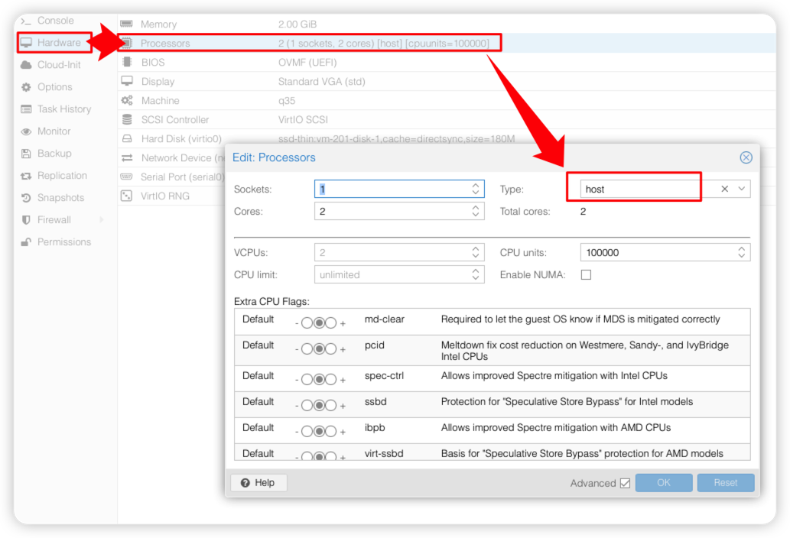

**在本文的旁路由模式下，虚拟机只需要一个网口即可，只需要一个网口！如果你是arm的开发板，也只需要一个口就够。**

接下来，我们透传宿主的硬件随机数发生器到虚拟机中，如下图。软件的随机数发生器为了保证高熵，会浪费较多的CPU，但是目前大多数CPU本身集成了硬件的随机数生成器，可以用于提速加密解密，因此此处需要把`Virto RNG`打开并解除限制。

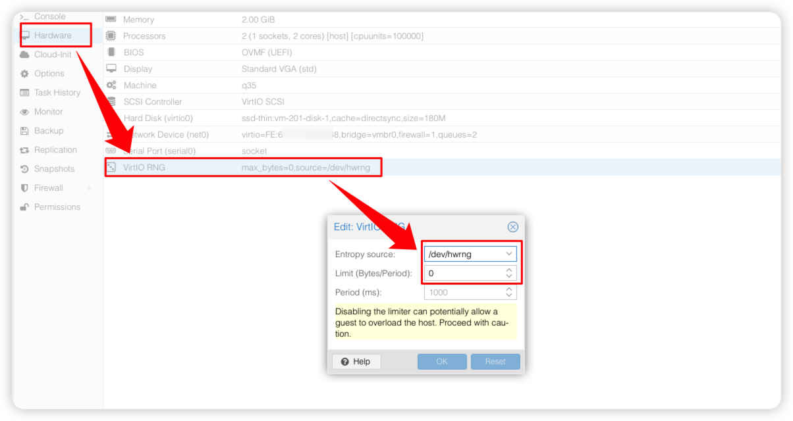

### 配置网络

在启动虚拟机前，需要将MikroTIk主网关临时拔掉，否则新启动的OpenWRT地址会和主网关冲突，导致无法打开控制台，当然你直接进PVE给虚拟机断网然后在终端改也是可以的。然后，启动虚拟机，重新插拔你的电脑或者重新打开WiFi获取新的地址，登录控制台，在LAN口侧将地址信息按照如下图中填写。IPv4地址需要避开主网关的地址（也要避开DHCP池子的，以免冲突），掩码和主网关的保持一致，IPv4网关和DNS服务器均填写主网关的IP，禁用IPv6，即可。

**在该页面的下方，需要选中`忽略此接口`，并在`IPv6`选项卡中全部配置为`已禁用`，来关闭OpenWRT上的DHCP服务，避免和主网关的DHCP冲突。**

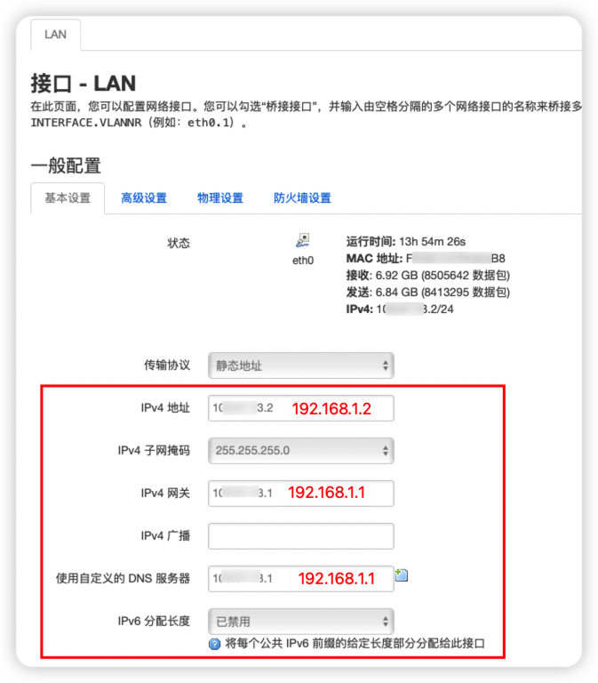

完成配置后，接上你的主网关，电脑重新获取IP，即可同时访问这两个设备。

然而在此时，你只能打开OpenWRT的管理页面，还不能通过它上网。

**你需要删除除了这个LAN以外的其他所有网络。**

然后，进入`DHCP/DNS`页面，按照如下两个图的框中配置。一定要禁用掉解析IPv6，否则旁路由大多数时候不会生效。

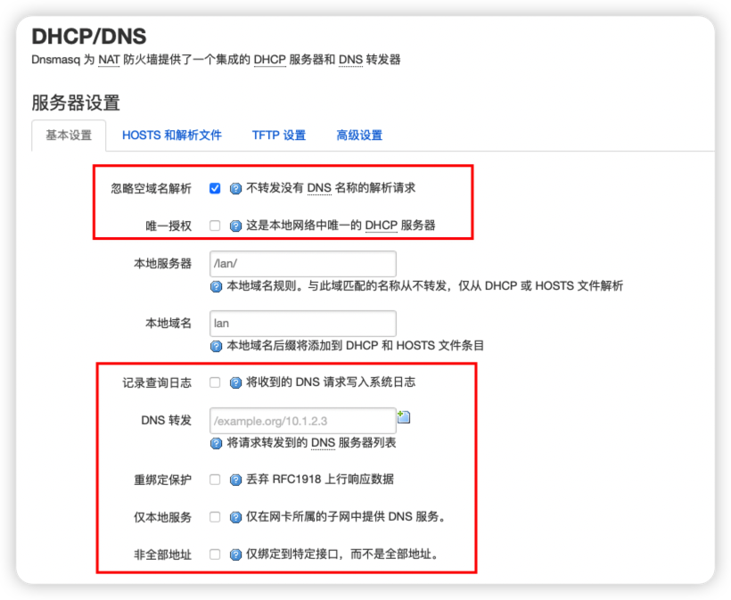

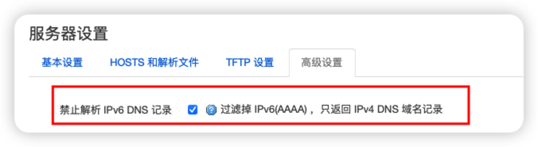

### 配置防火墙

进入防火墙，可以看到单单在OpenWRT的网页控制台上，防火墙的功能相比RouterOS的还是逊色了很多（但是实际上它是基于iptables的，iptables很强，RouterOS的防火墙就是基于iptables）。

你需要确保你仅有`lan`这一个区域，并且按照如下图进行配置（框中所有保持一致），打开IP动态伪装（就是NAT）。

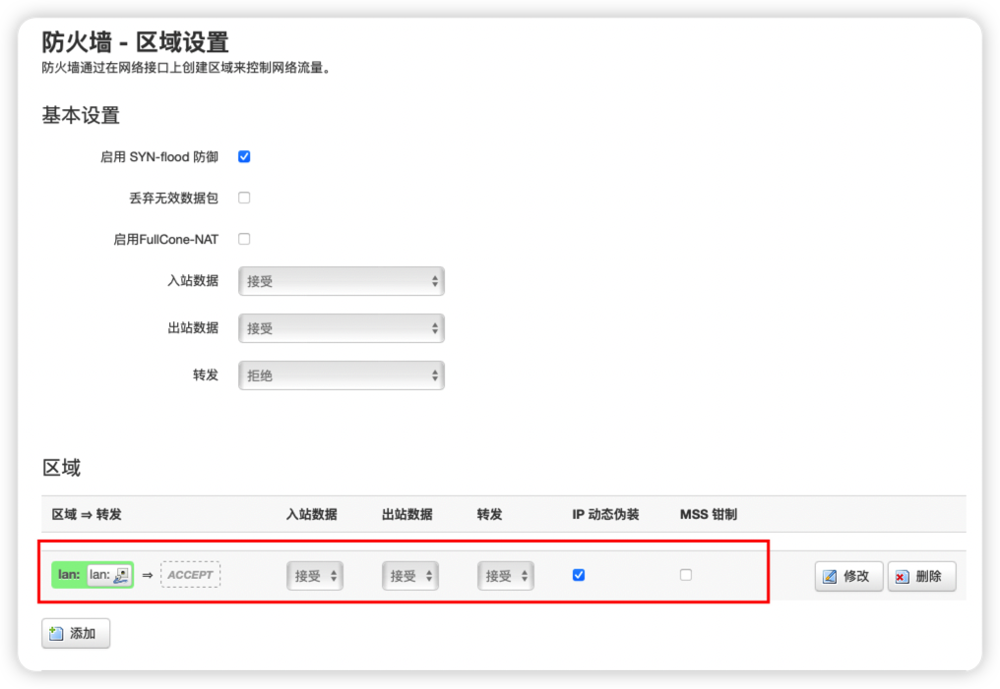

完成了这样的操作后，你的OpenWRT才能够让你连上网络。部分OpenWRT可能会出现默认路由加不上的情况导致没网，一般重启一下即可解决。

但是配置到这里时，连接到OpenWRT的TCP MSS还是默认的1400以上，在使用某些功能时，会造成过度分片、乱序和丢包，导致网页转圈无法打开，或者加载十分缓慢。因此，我们需要在防火墙的`自定义规则`中添加规则来减小MSS。

如下图，在`自定义规则`中，找到任意位置的空行，添加下边一行规则，让防火墙将TCP MSS控制到1280长度，这样经过OpenWRT的数据包（包括特殊操作需要重定向的）均会被修改为1280的MSS，给应用程序处理加密之后，发出到主网关时就不容易再被分片了，进而也就不会造成丢包、打开缓慢的问题了。

```bash
iptables -t mangle -I FORWARD 1 -p tcp -m tcp --tcp-flags SYN,RST SYN -m tcpmss --mss 1281:65535 -j TCPMSS --set-mss 1280
```

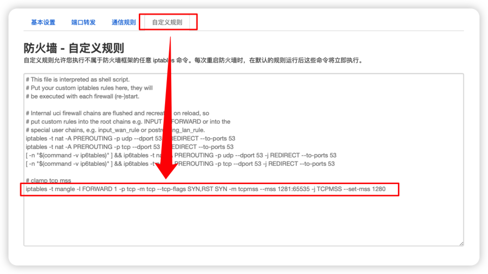

## 主网关完整配置脚本

脚本在导出后脱敏，略有修改。如果无法执行请告诉我~

```bash
# sep/10/2022 00:03:44 by RouterOS 7.5
#
# model = RB760iGS
/interface bridge
add admin-mac=94:94:26:00:00:01 auto-mac=no name=bridge-lan protocol-mode=\
    none
/interface ethernet
set [ find default-name=ether1 ] loop-protect=off name=ether1-wan-onu
set [ find default-name=ether2 ] arp=disabled loop-protect=off name=\
    ether2-lan-synology_nas
set [ find default-name=ether3 ] arp=disabled loop-protect=off name=\
    ether3-lan-intel_nuc
set [ find default-name=ether4 ] arp=disabled disabled=yes loop-protect=off \
    name=ether4-lan
set [ find default-name=ether5 ] arp=disabled loop-protect=off name=\
    ether5-lan-h3c_ap
set [ find default-name=sfp1 ] arp=disabled disabled=yes loop-protect=off \
    name=sfp1-lan
/interface list
add name=lan
/interface wireless security-profiles
set [ find default=yes ] supplicant-identity=MikroTik
/ip dhcp-server option
add code=3 name=Gateway-OpenWRT value="'192.168.1.2'"
add code=6 name=DNS-OpenWRT value="'192.168.1.2'"
/ip dhcp-server option sets
add name=UseOpenWRT options=Gateway-OpenWRT,DNS-OpenWRT
/ip pool
add name=pool-lan-dhcp ranges=192.168.1.100-192.168.1.199
/ip dhcp-server
add add-arp=yes address-pool=pool-lan-dhcp bootp-support=none \
    client-mac-limit=512 interface=bridge-lan lease-time=1h name=server-lan
/port
set 0 name=serial0
/ppp profile
add change-tcp-mss=no name=pppoe-ct only-one=yes use-compression=no \
    use-encryption=no use-mpls=no use-upnp=no
/interface pppoe-client
add add-default-route=yes comment="-- do not change the name" \
    default-route-distance=100 disabled=no interface=ether1-wan-onu max-mru=\
    1480 max-mtu=1480 name=pppoe-ct profile=pppoe-ct use-peer-dns=yes user=\
    <你的PPPoE用户名> password=<你的PPPoE密码>
/interface bridge port
add bridge=bridge-lan interface=ether2-lan-synology_nas
add bridge=bridge-lan interface=ether3-lan-intel_nuc
add bridge=bridge-lan interface=ether4-lan
add bridge=bridge-lan interface=ether5-lan-h3c_ap
add bridge=bridge-lan interface=sfp1-lan
/ip neighbor discovery-settings
set discover-interface-list=lan
/ip settings
set rp-filter=strict tcp-syncookies=yes
/interface list member
add interface=ether2-lan-synology_nas list=lan
add interface=ether3-lan-intel_nuc list=lan
add interface=ether4-lan list=lan
add interface=ether5-lan-h3c_ap list=lan
add interface=sfp1-lan list=lan
add interface=bridge-lan list=lan
/ip address
add address=192.168.1.1/24 interface=bridge-lan network=192.168.1.0
add address=192.168.100.2/24 interface=ether1-wan-onu network=192.168.100.0
/ip cloud
set ddns-enabled=yes ddns-update-interval=1h
/ip cloud advanced
set use-local-address=yes
/ip dhcp-server config
set store-leases-disk=30m
/ip dhcp-server network
add address=192.168.1.0/24 dns-server=192.168.1.1 domain=lan gateway=\
    192.168.1.1 netmask=24
/ip dns
set allow-remote-requests=yes cache-max-ttl=1d cache-size=4096KiB \
    max-concurrent-queries=1000 max-concurrent-tcp-sessions=50 \
    max-udp-packet-size=1024 query-server-timeout=1s query-total-timeout=5s \
    servers=223.5.5.5,223.6.6.6,119.29.29.29
/ip firewall filter
add action=fasttrack-connection chain=forward comment=\
    "-- fast track all forward" hw-offload=yes
add action=accept chain=input comment="-- accept all tracked from pppoe" \
    connection-state=established,related in-interface=pppoe-ct
add action=accept chain=input comment="-- accept all limited icmp from pppoe" \
    in-interface=pppoe-ct limit=100,200:packet protocol=icmp
add action=drop chain=input comment="-- drop all from pppoe" in-interface=\
    pppoe-ct
add action=accept chain=input comment="-- accept all tracked from onu" \
    connection-state=established,related in-interface=ether1-wan-onu
add action=accept chain=input comment="-- accept all limited icmp from onu" \
    in-interface=ether1-wan-onu limit=100,200:packet protocol=icmp
add action=drop chain=input comment="-- drop all from onu" in-interface=\
    ether1-wan-onu
/ip firewall mangle
add action=change-mss chain=forward comment="-- clamp all tcp mss to 1380" \
    new-mss=1380 passthrough=yes protocol=tcp tcp-flags=syn tcp-mss=\
    1381-65535
/ip firewall nat
add action=masquerade chain=srcnat comment="-- NAT to pppoe" out-interface=\
    pppoe-ct
add action=masquerade chain=srcnat comment="-- NAT to onu" out-interface=\
    ether1-wan-onu
/ip service
set telnet disabled=yes
set ftp disabled=yes
set api disabled=yes
set api-ssl disabled=yes
/ip ssh
set strong-crypto=yes
/ip upnp
set allow-disable-external-interface=yes enabled=yes
/ip upnp interfaces
add interface=pppoe-ct type=external
add interface=bridge-lan type=internal
/ipv6 address
add address=::6666:6666:6666:1 from-pool=ct-prefix-pool interface=bridge-lan
/ipv6 dhcp-client
add add-default-route=yes default-route-distance=100 interface=pppoe-ct \
    pool-name=ct-prefix-pool pool-prefix-length=56 request=prefix \
    use-peer-dns=no
/ipv6 firewall filter
add action=accept chain=input comment="-- accept src fe80::/10 from pppoe" \
    in-interface=pppoe-ct src-address=fe80::/10
add action=drop chain=input comment="-- drop all from pppoe" in-interface=\
    pppoe-ct
add action=accept chain=forward comment="-- accept all tracked from pppoe" \
    connection-state=established,related in-interface=pppoe-ct
add action=accept chain=forward comment=\
    "-- accept all limited icmp6 from pppoe" in-interface=pppoe-ct limit=\
    100,200:packet protocol=icmpv6
add action=accept chain=forward comment=\
    "-- accept all dst port 30000-65535 tcp from pppoe" dst-port=30000-65535 \
    in-interface=pppoe-ct protocol=tcp
add action=accept chain=forward comment=\
    "-- accept all dst port 30000-65535 udp from pppoe" dst-port=30000-65535 \
    in-interface=pppoe-ct protocol=udp
add action=drop chain=forward comment="-- drop all from pppoe" in-interface=\
    pppoe-ct
add action=drop chain=input comment="-- drop all from onu" in-interface=\
    ether1-wan-onu
/ipv6 nd
set [ find default=yes ] advertise-dns=no hop-limit=64 interface=bridge-lan \
    mtu=1480 ra-interval=2m-10m
/ipv6 nd prefix default
set preferred-lifetime=12h valid-lifetime=1d
/system clock
set time-zone-autodetect=no time-zone-name=Asia/Shanghai
/system identity
set name=harris-home-gateway
/system ntp client
set enabled=yes
/system ntp client servers
add address=ntp.aliyun.com
/system routerboard settings
set boot-delay=1s boot-device=nand-only
/system scheduler
add interval=1d name="set down pppoe" on-event=\
    "/interface/pppoe-client/disable pppoe-ct" policy=\
    ftp,reboot,read,write,policy,test,password,sniff,sensitive,romon \
    start-date=sep/07/2021 start-time=05:00:00
add interval=1d name="set up pppoe" on-event=\
    "/interface/pppoe-client/enable pppoe-ct" policy=\
    ftp,reboot,read,write,policy,test,password,sniff,sensitive,romon \
    start-date=sep/07/2021 start-time=05:01:00
add comment="-- set up pppoe when startup, recovery state from unexpected shutdown" \
    name="set up pppoe when startup" on-event=\
    "/interface/pppoe-client/enable pppoe-ct" policy=\
    ftp,reboot,read,write,policy,test,password,sniff,sensitive,romon \
    start-time=startup
/system watchdog
set automatic-supout=no
/tool graphing
set store-every=24hours
/tool graphing interface
add interface=bridge-lan store-on-disk=no
add interface=pppoe-ct store-on-disk=no
/tool graphing resource
add store-on-disk=no
/tool mac-server
set allowed-interface-list=none
/tool mac-server mac-winbox
set allowed-interface-list=lan
/tool mac-server ping
set enabled=no

```

