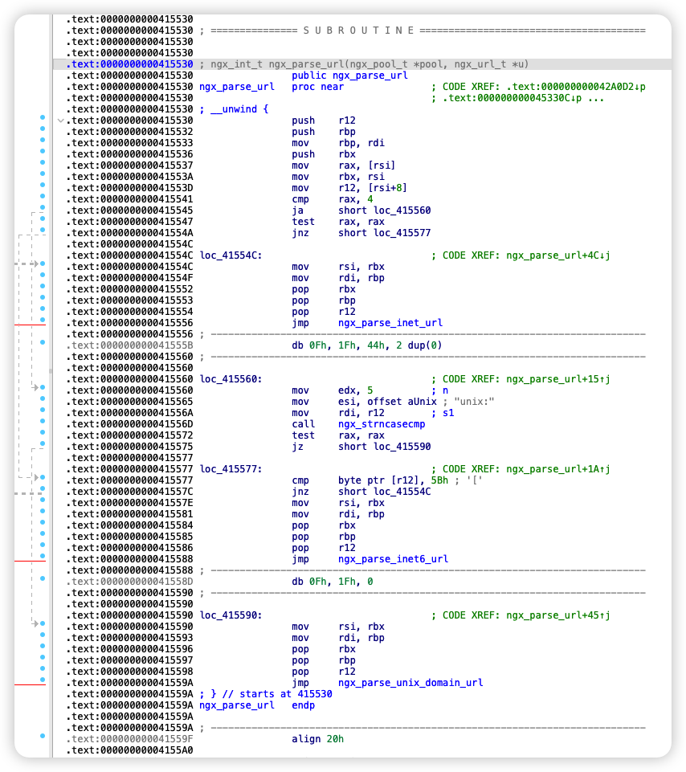

最近看了两个项目pyroscope[^4]和parca[^5]，这两个都是开源的可观测项目。pyroscope实现了基于eBPF的无侵入观测能力，鉴于parca实现得不是非常优雅（至少我用着觉得非常难受），本文就单纯从pyroscope展开分析了。由于当下eBPF实现Stack Trace等功能已经有了非常多的案例，本文就不再提如何使用eBPF做Continuous Profiler[^6]了，我们单纯来看看最核心的一个内容——符号名称是怎么解析出来的（也就是如何解析符号表的）？

[^4]: https://pyroscope.io
[^5]: https://www.parca.dev
[^6]: https://www.cncf.io/blog/2022/05/31/what-is-continuous-profiling/

# 开源项目如何实现

pyroscope中，为了能够实现对ELF文件符号表的解析，其借助Go语言的cgo实现了一个binding来调用bcc的`bcc_syms.h`，并对其进行封装，实现的这个包就叫做`symtab`。

整个实现非常简单，几乎没有做什么内容，纯是个binding来调用bcc的相关函数。

```go
// 省略部分代码...

/*
#include "bcc/bcc_syms.h"
*/
import "C"

// 省略部分代码...

type Symbol struct {
	Name   string // 函数名称
	Module string // 模块名称，主要是指装入的动态链接库的名称
	Offset uint64 // 偏移量
}

// 新建符号表实例
func NewBCCSymbolTable(pid int) *BCCSymTable {
	pidC := C.int(pid)
	if pid == 0 {
		pidC = C.int(-1) // for KSyms
	}
	symbolOpt := C.struct_bcc_symbol_option{use_symbol_type: C.uint(1 << elf.STT_FUNC)}
	symbolOptC := (*C.struct_bcc_symbol_option)(unsafe.Pointer(&symbolOpt))
	cache := C.bcc_symcache_new(pidC, symbolOptC)

	res := &BCCSymTable{cache: cache, pid: pid}
	return res
}

// 在符号表实例中解析地址，以得到Symbol
func (t *BCCSymTable) Resolve(addr uint64, refresh bool) Symbol {
	symbol := C.struct_bcc_symbol{}
	var symbolC = (*C.struct_bcc_symbol)(unsafe.Pointer(&symbol))

	var res C.int
	if t.pid == 0 {
		res = C.bcc_symcache_resolve_no_demangle(t.cache, C.ulong(addr), symbolC)
	} else {
		res = C.bcc_symcache_resolve(t.cache, C.ulong(addr), symbolC)
		defer C.bcc_symbol_free_demangle_name(symbolC)
	}
	if res < 0 {
		if symbol.offset > 0 {
			return Symbol{"", C.GoString(symbol.module), uint64(symbol.offset)}
		}
		return Symbol{"", "", addr}
	}
	if t.pid == 0 {
		return Symbol{C.GoString(symbol.name), C.GoString(symbol.module), uint64(symbol.offset)}
	}
	return Symbol{C.GoString(symbol.demangle_name), C.GoString(symbol.module), uint64(symbol.offset)}
}

// 关闭符号表
func (t *BCCSymTable) Close() {
	C.bcc_free_symcache(t.cache, C.int(t.pid))
}
```

# bcc是什么

bcc[^2]全称BPF Compiler Collection，是Linux基金会下一个名为IO Visor项目[^3]的作品之一。

[^3]: https://www.iovisor.org
[^2]: https://github.com/iovisor/bcc

> The IO Visor Project is an open source project and a community of developers to accelerate the innovation, development, and sharing of virtualized in-kernel IO services for tracing, analytics, monitoring, security and networking functions. It builds on the Linux community to bring open, flexible, distributed, secure and easy to operate technologies that enable any stack to run efficiently on any physical infrastructure.

为了看看这个IO Visor项目到底是什么来头，我专门去官网看了一下介绍。这个项目主要目的在于为开发者提供一个内核内部的IO服务，以加速软件开发和共享过程中的跟踪、分析、监控、安全和网络功能需求。总结就是，他可以帮你以内核的视角评估运行在之上、你的软件的运行情况，帮助你更快发现和解决问题，等。

bcc作为IO Visor项目中的作品之一，它是一个工具集，可以帮助用户高效地跟踪内核或者应用程序。bcc使用C语言实现了低级别的操作，并使用Python和lua封装了前端，说白了就是有Python和lua的binding并且做了额外的封装，让开发者减少心智负担。使用C语言实现的low-level操作（主要用在eBPF内核和用户态代码部分），并提供了名为libbcc的动态库。得益于各种语言都有binding提供，就可以将这个动态库移植到各种语言上，包括但不限于bcc直接提供的Python和lua。

**基于libbcc动态库**的**Python和lua前端**为开发者提供了一套非常简单的接口，甚至你可以不需要关注内核做了什么，只需要短短几行代码就可以得到各种你想要的信息。

上一节的代码就是直接引入了libbcc库中的`bcc_syms.h`头文件，来解析符号表。

# 符号表是什么

观察下边两个文件的信息，它们有什么区别？

```bash
$ file /bin/bash
/bin/bash: ELF 64-bit LSB pie executable, x86-64, version 1 (SYSV), dynamically linked, interpreter /lib64/ld-linux-x86-64.so.2, BuildID[sha1]=a6f564d6443d13760ca152ecec1c2db94c6d4812, for GNU/Linux 3.2.0, stripped

$ file ./test 
./test: ELF 64-bit LSB executable, x86-64, version 1 (SYSV), dynamically linked, interpreter /lib64/ld-linux-x86-64.so.2, BuildID[sha1]=196064e5a7b39379baafbb89af0c4daa8606e515, for GNU/Linux 3.2.0, with debug_info, not stripped
```

它们都是ELF格式的可执行文件，不准确一点就是我们常说的可执行二进制文件。ELF格式是Linux和Unix下的可执行和可链接文件格式，同期还存在Windows下的PE格式和macOS下的Mach-O格式。除去BuildID的消息摘要不同之外，主要的不同是这两点：

* 有无`with debug_info`
* `stripped`、`not stripped`

当存在`with debug_info`时，说明该ELF文件包含了完整DWARF数据，可以用于程序调试阶段使用。`stripped`和`not stripped`则表示符号表（symbol）是否被剥离，符号表是DWARF数据的其中一个类型，具体我们下边单独讨论，当符号表被剥离即显示`stripped`。它们的存在都会导致ELF文件增大，因此大多数的程序二进制文件在发行时都会选择不生成调试信息和符号表，从而大大减小程序体积。

本文我们不讨论调试信息，单纯来看看符号表是什么。符号表英文名叫做symbol table，由编译器生成，主要用于保存变量和函数名称，在链接的时候会被用于寻址，但是运行的时候就没什么用了。因此，为了裁减程序体积以及避免泄密，大多数程序发布时都会将符号表剥离。

# 如何查看符号表

当一个程序包含符号表时，我们可以使用`objdump`[^7]导出相关信息。其中，`-t`参数导出所有符号，`-T`参数则只会导出所有动态链接的符号。

[^7]: https://man7.org/linux/man-pages/man1/objdump.1.html

我使用了`./configure --with-cc-opt="-fno-inline -g -O2"`参数编译了一个nginx[^8]，以避免内联优化造成的不便分析，现在我使用这个二进制文件来导出符号表，可以得到下边的内容：

[^8]: https://nginx.org

```bash
$ objdump -t /usr/local/nginx/sbin/nginx
# 省略一些内容...
0000000000481110 l     F .text  00000000000000ff              ngx_http_upstream_get_keepalive_peer
0000000000480df0 l     F .text  0000000000000016              ngx_http_upstream_keepalive_close
0000000000480e10 l     F .text  0000000000000018              ngx_event_del_timer
0000000000480e30 l     F .text  000000000000005a              ngx_event_add_timer
0000000000480e90 l     F .text  00000000000000aa              ngx_http_upstream_keepalive_close_handler
0000000000480f40 l     F .text  00000000000001c9              ngx_http_upstream_free_keepalive_peer
00000000004b9a20 l     O .data  0000000000000040              ngx_http_upstream_keepalive_module_ctx
00000000004b9a60 l     O .data  0000000000000118              ngx_http_upstream_keepalive_commands
0000000000000000 l    df *ABS*  0000000000000000              ngx_http_upstream_zone_module.c
0000000000481210 l     F .text  00000000000000da              ngx_http_upstream_zone
0000000000481630 l     F .text  00000000000000f6              ngx_http_upstream_init_zone
00000000004812f0 l     F .text  000000000000018b              ngx_http_upstream_zone_copy_peer
0000000000481480 l     F .text  00000000000001ac              ngx_http_upstream_zone_copy_peers
00000000004d93e0 l     O .bss   0000000000000040              ngx_http_upstream_zone_module_ctx
00000000004b9c60 l     O .data  0000000000000070              ngx_http_upstream_zone_commands
0000000000000000 l    df *ABS*  0000000000000000              ngx_modules.c
0000000000000000 l    df *ABS*  0000000000000000              crtend.o
00000000004a72a0 l     O .eh_frame      0000000000000000              __FRAME_END__
0000000000000000 l    df *ABS*  0000000000000000
0000000000481728 l     F .fini  0000000000000000              _fini
0000000000482008 l     O .rodata        0000000000000000              __dso_handle
000000000040bcd0 l     F .text  0000000000000005              _dl_relocate_static_pie
00000000004a8df0 l     O .dynamic       0000000000000000              _DYNAMIC
0000000000490a44 l       .eh_frame_hdr  0000000000000000              __GNU_EH_FRAME_HDR
00000000004ba020 l     O .data  0000000000000000              __TMC_END__
00000000004a9000 l     O .got.plt       0000000000000000              _GLOBAL_OFFSET_TABLE_
000000000040b000 l     F .init  0000000000000000              _init
00000000004d8c08 g     O .bss   0000000000000008              ngx_process
000000000042f010 g     F .text  0000000000000009              ngx_close_glob
00000000004d8be8 g     O .bss   0000000000000004              ngx_terminate
0000000000412cc0 g     F .text  00000000000001b2              ngx_unescape_uri
0000000000419000 g     F .text  000000000000013b              ngx_rbtree_insert
0000000000414990 g     F .text  00000000000000b8              ngx_cmp_sockaddr
00000000004b2d60 g     O .data  00000000000000c8              ngx_http_index_module
000000000040ea80 g     F .text  0000000000000060              ngx_array_create
0000000000000000       F *UND*  0000000000000000              getenv@GLIBC_2.2.5
0000000000414a90 g     F .text  00000000000000f0              ngx_parse_addr_port
0000000000415530 g     F .text  000000000000006f              ngx_parse_url
00000000004b4480 g     O .data  00000000000000c8              ngx_http_rewrite_module
000000000041b710 g     F .text  0000000000000023              ngx_shmtx_trylock
00000000004d8b80 g     O .bss   0000000000000008              ngx_max_sockets
0000000000417700 g     F .text  00000000000001d4              ngx_md5_update
0000000000454820 g     F .text  0000000000000335              ngx_http_upstream_create_round_robin_peer
# 省略一些内容...
```

这一堆内容里有5列，特别注意的是`g     O`、`l    df`等这算一列，它们其实都是在一个变量下存放的bit flag。参考Stack Overflow上的回答[^1]，我们可以得知：

[^1]: https://stackoverflow.com/a/16471895

* 第一列，为十六进制的地址，对应`Elf32_Sym`结构体[^9]中的`st_value`。

* 第二列，为符号可见性和符号类型，对应`Elf32_Sym`结构体中的`st_info`。高4位中，`l`为局部符号，相当于C语言中的私有函数，`g`为全局符号，对于所有目标文件都是可见的，并且只能被定义一次。其他类型就先不阐述。低4位中，df代表调试信息中包含了文件，F代表函数，O代表对象。

* 第三列，为存储位置。其中：

  * `.data`段，保存已经被初始化的全局变量，可读可写。
  * `.bss`段，保存未初始化的全局变量，可读可写。
  * `.text`段，保存程序的代码和常量，只读。

  本文，我们只需要关注`.text`段中的函数即可。

* 第四列，为符号长度，对应`Elf32_Sym`结构体中的`st_size`。函数的符号长度也就是它这个函数的大小。

* 第五列，为符号名称索引，对应`Elf32_Sym`结构体中的`st_name`。可以从ELF字符串表（`.strtab`段）中索引出符号名称。

[^9]: https://docs.oracle.com/cd/E19683-01/816-1386/chapter6-79797/index.html

对于函数的符号长度其实我是存疑的，有这么长吗？为此，我专门下载了个IDA免费版[^10]，免费版仅提供x86-64平台的二进制文件分析，恰好我就是在x86-64平台编译的，它刚好够用。我随便找了个函数`ngx_parse_url`，来定位到它并且把显示模式从Graph转为Text，即可看到下边的内容：

[^10]: https://hex-rays.com/ida-free/



函数从`0x0000000000415530`的地址开始，不同的指令长度存在一定差异，可以看到地址不是线性增加的，最终到`0x000000000041559A`处结束，对齐到`0x000000000041559F`。上边符号表里我们得到的长度为6f，加上起始地址，也符合最终结束的位置`0x000000000041559F`。OK fine。

敲黑板，符号表中记录了众多函数的起始地址和长度。

到这里，我们对符号表已经有了一定的了解并且知道它能做什么事情了。接下来，开始进入正题。

# bcc如何解析符号表

结合最开始的Go的实现，我们基本可以得到解析分为如下几步：

```c
// 1. 创建cache
bcc_symcache_new(pidC, symbolOptC)
  
// 2. 解析
// 如果PID为0，使用下边的函数解析
bcc_symcache_resolve_no_demangle(t.cache, C.ulong(addr), symbolC)
// 如果PID不为0，使用下边函数解析最后并释放内存
bcc_symcache_resolve(t.cache, C.ulong(addr), symbolC)
bcc_symbol_free_demangle_name(symbolC)

// 3. 关闭cache
bcc_free_symcache(t.cache, C.int(t.pid))
```

可以看到，真正负责解析的函数就两个，`bcc_symcache_resolve_no_demangle`和`bcc_symcache_resolve`。

剩下的内容，我们就来重点关注一下下边两个问题：

1. 两个解析函数有什么区别？
2. 如何解析符号表？

## 两个解析函数区别

这几个函数都在头文件`bcc_syms.h`中，也可以很轻松地定位到实现在`bcc_syms.cc`中。

```c
// The demangle_name pointer in bcc_symbol struct is returned from the
// __cxa_demangle function call, which is supposed to be freed by caller. Call
// this function after done using returned result of bcc_symcache_resolve.
void bcc_symbol_free_demangle_name(struct bcc_symbol *sym);
int bcc_symcache_resolve(void *symcache, uint64_t addr, struct bcc_symbol *sym);
int bcc_symcache_resolve_no_demangle(void *symcache, uint64_t addr,
                                     struct bcc_symbol *sym);
```

先来看`bcc_symcache_resolve`的实现：

```c
int bcc_symcache_resolve(void *resolver, uint64_t addr,
                         struct bcc_symbol *sym) {
  SymbolCache *cache = static_cast<SymbolCache *>(resolver);
  return cache->resolve_addr(addr, sym) ? 0 : -1;
}
```

再来看`bcc_symcache_resolve_no_demangle`的实现：

```c
int bcc_symcache_resolve_no_demangle(void *resolver, uint64_t addr,
                                     struct bcc_symbol *sym) {
  SymbolCache *cache = static_cast<SymbolCache *>(resolver);
  return cache->resolve_addr(addr, sym, false) ? 0 : -1;
}
```

底层是C++写的，虽然我没有学过C++，但是凭借Rust的基础似乎也能猜出来它想干啥。两个实现几乎是相同的，都断言到了一个`SymbolCache`类去，并且调用了同一个方法`resolve_addr`，只是参数不同罢了。因此，我们需要先找一下这个方法，看看是使用了可选参数还是它就是个重载方法。

可以看到，这个类被继承到了`ProcSyms`中，并且定义`resolve_addr`时可以看到指定了可选参数`demangle`，当不指定的时候默认为`true`，因此，我们只需要关注这一个方法就好了。

```c
class ProcSyms : SymbolCache {
// 省略了一些内容...
public:
  ProcSyms(int pid, struct bcc_symbol_option *option = nullptr);
  virtual void refresh() override;
  virtual bool resolve_addr(uint64_t addr, struct bcc_symbol *sym, bool demangle = true) override;
// 省略了一些内容...
};
```

`resolve_addr`方法实现如下：

```c++
bool ProcSyms::resolve_addr(uint64_t addr, struct bcc_symbol *sym,
                            bool demangle) {
  if (procstat_.is_stale())
    refresh();

  memset(sym, 0, sizeof(struct bcc_symbol));

  const char *original_module = nullptr;
  uint64_t offset;
  bool only_perf_map = false;
  for (Module &mod : modules_) {
    if (only_perf_map && (mod.type_ != ModuleType::PERF_MAP))
      continue;
    if (mod.contains(addr, offset)) {
      if (mod.find_addr(offset, sym)) {
        // demangle决定了是否重新整理修饰名称
        if (demangle) {
          if (sym->name && (!strncmp(sym->name, "_Z", 2) || !strncmp(sym->name, "___Z", 4)))
            sym->demangle_name =
                abi::__cxa_demangle(sym->name, nullptr, nullptr, nullptr);
          if (!sym->demangle_name)
            sym->demangle_name = sym->name;
        }
        return true;
      } else if (mod.type_ != ModuleType::PERF_MAP) {
        // In this case, we found the address in the range of a module, but
        // not able to find a symbol of that address in the module.
        // Thus, we would try to find the address in perf map, and
        // save the module's name in case we will need it later.
        original_module = mod.name_.c_str();
        only_perf_map = true;
      }
    }
  }
  // If we didn't find the symbol anywhere, the module name is probably
  // set to be the perf map's name as it would be the last we tried.
  // In this case, if we have found the address previously in a module,
  // report the saved original module name instead.
  if (original_module)
    sym->module = original_module;
  return false;
}
```

上边的代码我们可以得知，`demangle`参数决定了是否重新整理修饰名称。

修饰名称[^11]主要是编译器为了解决现代语言中全局符号冲突的问题。在C++等语言中，不同的命名空间、不同的类或者不同的函数签名但是却拥有相同的函数符号名称，这就会造成冲突，为了解决这个问题，编译器会对函数名称进行修饰，因此解析完符号表最后就可能会得到一堆乱七八糟的字符串，就需要使用`abi::__cxa_demangle`方法重新还原原始函数或者方法的名称。

[^11]: https://en.wikipedia.org/wiki/Name_mangling

## 如何解析符号表

我们再来看看`mod.contains(addr, offset)`和`mod.find_addr(offset, sym)`，不出意外，这两个函数是解析符号表的主力了。

先来看看`mod.contains(addr, offset)`的实现：

```c
bool ProcSyms::Module::contains(uint64_t addr, uint64_t &offset) const {
  for (const auto &range : ranges_) {
    // 检查addr地址是否在当前遍历的module的范围下
    if (addr >= range.start && addr < range.end) {
      // 如果是动态库或者vdso，则另行计算
      if (type_ == ModuleType::SO || type_ == ModuleType::VDSO) {
        offset = __so_calc_mod_offset(range.start, range.file_offset,
                                      elf_so_addr_, elf_so_offset_, addr);
      } else { // 不是动态库就直接让offset等于addr
        offset = addr;
      }
      return true;
    }
  }
  return false;
}
```

从上边的代码我们可以得知，`offset`应该是一个类似于可变借用的玩意，当`addr`地址在当前遍历的module地址范围下时，就判断是否时动态库或者VDSO，如果不是就直接把`offset`设定为`addr`。此处我们就不关注动态库了， 看看符号表如何解析出应用程序本身的逻辑，因此这里我们认为`offset`等同于`addr`。

紧接着，我们再来看看`mod.find_addr(offset, sym)`的实现：

```c
bool ProcSyms::Module::find_addr(uint64_t offset, struct bcc_symbol *sym) {
  load_sym_table();

  // module名称，如果是动态库的话就是动态库的位置，其他情况尚不清楚
  sym->module = name_.c_str();
  // 非动态库的情况下，偏移量也就是上一个代码块中的addr地址
  sym->offset = offset;

  // std::upper_bound 是一个用于查找的迭代器
  // Symbol(nullptr, offset, 0) 的位置是一个类型参数 const T&
  auto it = std::upper_bound(syms_.begin(), syms_.end(), Symbol(nullptr, offset, 0));
  if (it == syms_.begin()) // 如果回到了开始，则返回没找到
    return false;

  // 'it' points to the symbol whose start address is strictly greater than
  // the address we're looking for. Start stepping backwards as long as the
  // current symbol is still below the desired address, and see if the end
  // of the current symbol (start + size) is above the desired address. Once
  // we have a matching symbol, return it. Note that simply looking at '--it'
  // is not enough, because symbols can be nested. For example, we could be
  // looking for offset 0x12 with the following symbols available:
  // SYMBOL   START   SIZE    END
  // goo      0x0     0x6     0x0 + 0x6 = 0x6
  // foo      0x6     0x10    0x6 + 0x10 = 0x16
  // bar      0x8     0x4     0x8 + 0x4 = 0xc
  // baz      0x16    0x10    0x16 + 0x10 = 0x26
  // The upper_bound lookup will return baz, and then going one symbol back
  // brings us to bar, which does not contain offset 0x12 and is nested inside
  // foo. Going back one more symbol brings us to foo, which contains 0x12
  // and is a match.
  // However, we also don't want to walk through the entire symbol list for
  // unknown / missing symbols. So we will break if we reach a function that
  // doesn't cover the function immediately before 'it', which means it is
  // not possibly a nested function containing the address we're looking for.
  --it;
  uint64_t limit = it->start;
  for (; offset >= it->start; --it) {
    if (offset < it->start + it->size) {
      // Resolve and cache the symbol name if necessary
      if (!it->is_name_resolved) {
        std::string sym_name(it->data.name_idx.str_len + 1, '\0');
        // 执行到这里时，说明已经搜索到了最临近的函数起始地址
        if (bcc_elf_symbol_str(path_.c_str(), it->data.name_idx.section_idx,
              it->data.name_idx.str_table_idx, &sym_name[0], sym_name.size(),
              it->data.name_idx.debugfile))
          break;

        it->data.name = &*(symnames_.emplace(std::move(sym_name)).first);
        it->is_name_resolved = true;
      }

      sym->name = it->data.name->c_str();
      sym->offset = (offset - it->start);
      return true;
    }
    if (limit > it->start + it->size)
      break;
    // But don't step beyond begin()!
    if (it == syms_.begin())
      break;
  }

  return false;
}
```

通过Stack Trace出来的一堆Virtual Memory地址（以下简称VM地址），这些地址在符号表中大多都搜不着，因为函数执行时不一定会刚刚好在开始，即经过Stack Trace到的指针不一定刚好就指向函数起始地址，它很有可能指向正执行的函数中间某个位置，因此就会得到一个符号表中不存在的地址。但是，可以通过这个地址反向搜索，找到最临近的上一个函数起始地址（似乎还有可能嵌套？），就可以知道当前运行到这个函数中，就可以确定函数的起始地址，得到这个函数对应的符号的信息。

上边的代码中，当执行到`bcc_elf_symbol_str`时，已经迭代出了确定的函数符号信息，因此通过`section_idx`和`str_table_idx`，即可在指定的段表中搜索指定索引的字符串，就得到了符号名称。再逐级返回，就可以将VM地址转换为符号表中的符号名称。

# 总结

从pyroscope的`symtab`包开始，向下引入了`bcc`依赖，bcc内又引入了`libelf`等依赖。流程从解析ELF格式的文件开始，到查找得到真实的函数起始位置，进而得到函数符号信息，再使用符号信息中的段索引和字符串表索引，才能找到一个函数的符号的名称。逐层返回和整理之后，用户才可以看到他的代码中运行到了哪些函数。

可以看到，想要解析一个符号表，流程还是挺麻烦的。


