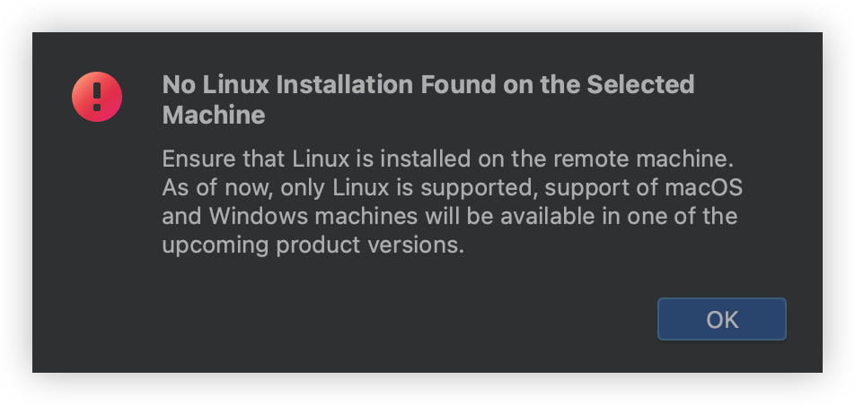
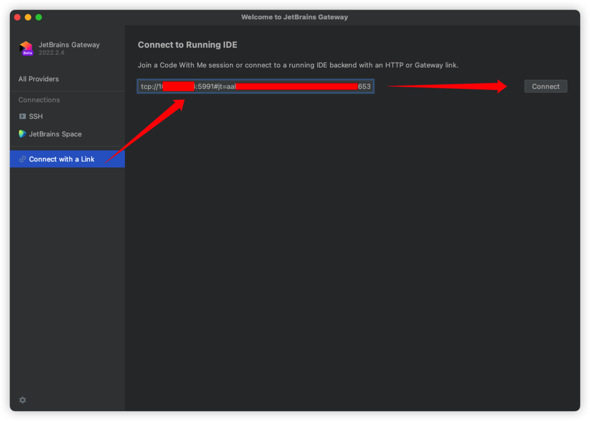
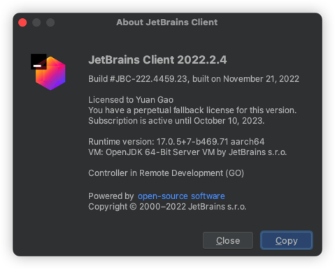

# 前言

相信大多数围绕Linux开发的开发者们会很喜欢这篇文章，当然如果你用VSCode就是另外一回事了（逃

大多数情况下，我不会选择Linux系统作为我主力使用的桌面操作系统，毕竟它稳定是真的稳定，但是桌面软件的生态上实在是太过于欠缺。但是，跨系统的开发，当阅读代码时，你会因为缺少系统头文件而不能继续，当调试代码时，你也会因为依赖差异无法成功编译，实在是难受。

为了解决这个问题，早期远程开发还不成熟的时候，博主我直接攒了一台64GB内存的台式机，32G内存分给Fedora Workstation虚拟机，在虚拟机里使用桌面版Linux开发，勉强还算是能够支撑开发，就是有点烧钱（那时候还是内存最贵的时候）。

后来，远程开发火了起来，JetBarins终于推出了它家的远程方案——Projector，我在博客还专门为它写了一篇文章。但是，它太短命了，短短几个月时间，JetBrains宣布放弃它，转向开发了新的远程方案——Gateway。

上边提到的这两个远程方案，前者远程渲染后使用WebSocket串流到浏览器，后者直接启动一个Agent，本地渲染、远程只负责核心功能。直到现在，这两个方案仍然在我的项目中活跃，因为Projector只是远程渲染，因此它拥有完整的IDE功能特性，并且几乎不存在影响使用的bug，但是它不适合弱网络使用，毕竟远程渲染再串流，弱网络下开发体验会非常差。而Gateway虽然本地渲染、远程只负责核心功能，但是它经常出现保存文件失败、运行提权失败、创建目录没反应等bug，非常影响使用。更要命的，如果你在ARM平台的Linux上使用Gateway启动IDE，会收到下边这么个提示：



就问你窒不窒息？

虽然在ARM平台的Projector手工更换JBR（JetBrains Runtime）后好歹还能启动和使用，但是逢运行或者调试程序就崩溃，实在是难绷。

为此，博主我查找了官方YouTrack上的一些回复，并且在我的ARM环境上测试了一下，得到了今天这篇文章——分享给大家如何在ARM平台的Linux上启动JetBrains Gateway远程开发，并解决一些bug，让你更进一步提高开发效率。

# 环境

我使用的MacBook Pro14，2021年的版本，Apple Silicon M1 PRO处理器。

从Apple发布M系列处理器以来，也差不多两年了，大多数软件生态都已经迁移完成，但是本文的Gateway就挺例外。x86体系的性能优势是不可否认的，但是拉胯的能效，让我这种有随时在线需求的用户不得不远离x86的消费端产品。Apple Silicon发布以来，推动了ARM桌面终端生态空前繁荣的同时，顺带造福了Windows on ARM，我们可以期待一下未来Windows on ARM能否带来更优异的能效表现。

本次的虚拟机软件为`Parallel Desktop 17 Pro`，虚拟机操作系统为`Fedora Linux 36 (Server Edition)`，内核版本为`Linux 6.0.8-200.fc36.aarch64`。

# 步骤

创建目录并进入，此处目录名称和路径随意。

```bash
mkdir ~/jetbrains -p
cd ~/jetbrains
```

从官网[^1]下载你需要的IDE（下载Linux版本），此处我需要GoLand，因此我就下载最新版的GoLand Linux包。

[^1]: https://www.jetbrains.com/

```bash
wget https://download.jetbrains.com/go/goland-2022.2.5.tar.gz
```

紧接着，把它解压，我们就可以得到`GoLand-2022.2.5`目录。

```bash
tar xvf goland-2022.2.5.tar.gz
```

下载ARM版本的JBR[^2]。

注意下载JBR时，向下翻找到`Binaries for launching IntelliJ IDEA`中的文件下载。建议最新版的IDE搭配最新版的JBR，以免出现兼容性问题。

```bash
wget https://cache-redirector.jetbrains.com/intellij-jbr/jbr_jcef-17.0.5-linux-aarch64-b653.14.tar.gz
tar xvf jbr_jcef-17.0.5-linux-aarch64-b653.14.tar.gz
```

[^2]: https://github.com/JetBrains/JetBrainsRuntime/releases/latest

这样，我们得到了`jbr_jcef-17.0.5-linux-aarch64-b653.14`目录，使用这个目录替换GoLand中的自带的jbr目录即可。

```bash
rm -rf GoLand-2022.2.5/jbr/
mv jbr_jcef-17.0.5-linux-aarch64-b653.14 GoLand-2022.2.5/jbr
```

紧接着，我们还要替换脚本中的一个动态库路径。

```bash
cd GoLand-2022.2.5/
vim plugins/remote-dev-server/bin/launcher.sh
```

搜索`/lib64/ld-linux-x86-64.so.2`并将其替换为`/lib/ld-linux-aarch64.so.1`，保存。

然后，我们使用如下命令，即可启动远程的IDE。你只需要指定启动的项目目录即可，监听地址请保持`0.0.0.0`，不要使用`127.0.0.1`，亲测如果使用`127.0.0.1`，即便使用iptables的REDIRECT，仍然会被拒绝连接。端口号需要区分不同的项目，彼此之间不能冲突。

```bash
./bin/remote-dev-server.sh run <你的项目目录> -l 0.0.0.0 -p 5991
```

启动后，你需要翻看控制台的输出，其中会有一行类似下边的内容：

```bash
*********************************************************

Join link: tcp://0.0.0.0:5991#（省略）

Http link: https://code-with-me.jetbrains.com/remoteDev#（省略）

Gateway link: jetbrains-gateway://connect#（省略）

*********************************************************
```

我们将会用到`Join link`这一行的地址，需要特别注意的是，该地址为TCP直连，似乎没有任何的加密，你可以在本地虚拟机或者家庭网络中使用，但是**请一定不要在公网环境的服务器中使用**，以免被攻击。公网使用时，你可以使用SSH端口转发将它映射到本地再连接，本文就不再赘述。

接下来，我们需要把这个地址修改一下，改成它真实的IP地址，然后启动Gateway，填入修改后的地址，即可连接。注意**粘贴的链接中可能会有空格**，如果你点击**Connect**没有反应，就需要检查一下是不是链接有问题。



到这里，我们的远程开发已经启动了。以后，你就可以在tmux启动远程开发后，一直将其挂在后台，只要虚拟机不关（挂起则不影响），就可以一直使用下去。



# 解决`Run with sudo`失败的问题

在远程开发启动后，当我们启动或者调试时能够正常运行，但是当使用`Run with sudo`时，会发现总是会报出`Failed to launch elevation service using 'pkexec': Process finished with exit code XXX`这样的错误，并且最后的`XXX`的代码还可能是不一样的。每次需要以root身份运行程序调试时，就会遇到这个错误，在不直接使用root账户的情况下，我们只能尽可能去排查这个问题的原因，给JetBrains修修bug。

经过一番排查，可以定位出两个问题。上边的`XXX`为错误代码，如果这个错误代码是127，那么就是`pkexec`提权失败导致的，如果错误代码是1，那么就是Java子进程启动方式错误导致的。一般情况下，你会首先遇到127的错误代码，解决完提权问题后，就会遇到1的错误代码，再解决问题后，即可正常使用。

这两个问题分别可以对应到官方YouTrack上的这两个问题单[^3][^4]，第二个问题已经提交给官方修复 : )

[^3]: https://youtrack.jetbrains.com/issue/GTW-2499/Run-with-sudo-doesnt-work
[^4]: https://youtrack.jetbrains.com/issue/GO-13971/Run-with-sudo-failed-can-not-debug-as-root

## `pkexec`提权失败

pkexec是Linux中的一个程序，它可以允许一个经过验证的用户以其他用户的身份执行程序，好比以root身份执行我们需要调试的程序。

> If the calling process is not authorized or an authorization could not be obtained through authentication or an error occured, **pkexec** exits with a return value of 127.

pkexec是polkit中的一个工具，都属于Freedesktop旗下的项目，主要都是针对桌面环境使用。在桌面环境下，GoLand可以正常拉起pkexec弹窗并要求用户输入密码，但是在不带GUI的服务器系统中，本应该使用sudo代替，但是由于所谓的安全问题，GoLand会优先选择使用pkexec，就出现了问题。我们在不可能把polkit卸载掉的情况下，只能对它进行单独配置。

使用root添加新的规则，为wheel组中的用户直接放行，不再验证密码，即可解决这个提权失败的问题。添加规则后记得重启服务，可以使用命令`systemctl restart polkit.service`。

```bash
cat < /etc/polkit-1/rules.d/1-nopasswd_global.rules << EOF
/* Allow members of the wheel group to execute any actions
 * without password authentication, similar to "sudo NOPASSWD:"
 */
polkit.addRule(function(action, subject) {
    if (subject.isInGroup("wheel")) {
      return polkit.Result.YES;
    }
});
EOF
```

最后，把你的用户添加到wheel组中即可，你也可以为sudo配置`NOPASSWD:`，这样sudo也不会再要求输入密码了，开发机上这样修改后会减少一些额外操作。

这样操作后，你会发现你的错误代码从127变为了1，这时候我们就需要解决下一个问题了。

## 子进程启动方式变化

Java 12中，增加了一个全新的参数`-Djdk.lang.Process.launchMechanism=POSIX_SPAWN`（仅POSIX_SPAWN），在这个版本之前默认值均为`vfork`，因此老版本的JetBrains的IDE由于还停留在Java 11，就不会存在这个问题，在2022年的版本后，更新到了Java 17，默认值就变更为了新的`POSIX_SPAWN`，从而导致了问题。

**POSIX_SPAWN**是Linux中引入的一个新的子进程启动方式，可以类比**fork**、**vfork**，但是相比起来，**POSIX_SPAWN**最大的差别在于其只拷贝了父进程的所有文件描述符，但是没有拷贝父进程所拥有的所有内存，因此这种方式启动的子进程没有办法使用父进程已有的内存数据（有文件背景的除外），进而就导致了错误发生。

> At a basic level posix_spawn(2) is a subset of fork(2). A new child process from
fork(2): 1) gets an exact copy of everything that the parent process had in memory, and 2) gets a copy of all the file descriptors that the parent process had open.
posix_spawn(2) preserves #2, but not #1. In some cases, say, shelling out a command,
it's unnecessary to get a copy of memory of the parent process. With copy-on-write, fork
will be less expensive but still, not necessary.

解决这个问题其实也非常简单，只需要在使用Java时添加一个参数`-Djdk.lang.Process.launchMechanism=vfork`，就可以正常使用了。

修改`plugins/remote-dev-server/bin/launcher.sh`文件，找到下面这部分内容，将其修改即可。

```bash
  patch_bin_file() {
    file="$1"
    extra_arg=""
    if [ "$(basename "$file")" = "java" ]; then
#      extra_arg="\"-Djava.home=$TEMP_JBR\"" 在这一行添加参数，成为下面这行即可
      extra_arg="\"-Djava.home=$TEMP_JBR\" -Djdk.lang.Process.launchMechanism=vfork"
    fi
    mv "$file" "$file.bin"
    cat >"$file" <<EOT
#!/bin/sh
exec /lib/ld-linux-aarch64.so.1 --library-path "$SELFCONTAINED_LIBS" "${file}.bin" $extra_arg "\$@"
EOT
    chmod 755 "$file"
  }
```

# 题外话：initramfs增加驱动

写到这里时，我已经把虚拟机从Parallel Desktop迁移到了VMware Fusion，相比起来，VMware Fusion最大的优势就在于它能连接vCenter，可以随时管理服务器上的虚拟机，并且也可以上传本地虚拟机到vCenter，而且使用的虚拟机镜像也是相对比较好找到工具的vmdk格式。

然而，Parallel Desktop对于Windows的支持不得不说非常好，但是对于Linux的支持实在是非常差，由于Parallel Tools在更新内核之后就无法再编译通过了，导致内核模块始终没有办法被加载上，虚拟机挂起后时间就停留在了那一刻，恢复之后时间无法和宿主同步，就造成了N多问题。甚至我手工去编译Parallel Tools的DKMS，也仍然是大片的错误，不知道官方是不是还没有适配。（摊手

所以我把虚拟机迁移到了VMware Fusion。

Parallel Desktop使用hdr格式的虚拟磁盘，转换需要使用brew安装qemu，其中会包含qemu-img这个程序，就可以用来转换镜像。

```bash
qemu-img convert ~/Parallels/Windows.pvm/Windows-0.hdd/Windows-0.hdd.0.\{5f000b00-0000-4000-0007-000e32900000\}.hds  -O vmdk data-0.vmdk
```

然后再将vmdk导入到VMware Fusion，即可。

由于Parallel Desktop默认竟然使用SATA控制器，并没有支持VirtIO之类的直通存储，因此在转移到VMware Fusion后，第一件事就是把存储控制器改为了NVME。

但是，改完NVME后，在系统启动到initramfs时，由于之前没有加载NVME驱动，因此无法识别到虚拟磁盘，导致无法启动。这时候，就可以将存储控制器先改为原本的SATA，保证能启动到系统，然后使用下边的命令为initramfs增加NVME驱动。

```bash
cat > /etc/modules-load.d/nvme.conf <<
nvme
EOF
```

增加这个配置后，我们还需要强制更新一下initramfs镜像。

```bash
dracut -f -v
```

更新后，我们可以使用`lsinitrd`命令查看initramfs中的文件，过滤一下，就可以看到内核的NVME驱动有没有被拷贝到initramfs镜像中，如下这样，就说明可以了。

```bash
# lsinitrd | grep nvme
-rw-r--r--   1 root     root            6 Sep 26 22:47 etc/modules-load.d/nvme.conf
drwxr-xr-x   4 root     root            0 Sep 26 22:47 usr/lib/modules/6.0.9-200.fc36.aarch64/kernel/drivers/nvme
drwxr-xr-x   2 root     root            0 Sep 26 22:47 usr/lib/modules/6.0.9-200.fc36.aarch64/kernel/drivers/nvme/common
-rw-r--r--   1 root     root         7980 Sep 26 22:47 usr/lib/modules/6.0.9-200.fc36.aarch64/kernel/drivers/nvme/common/nvme-common.ko.xz
drwxr-xr-x   2 root     root            0 Sep 26 22:47 usr/lib/modules/6.0.9-200.fc36.aarch64/kernel/drivers/nvme/host
-rw-r--r--   1 root     root        83236 Sep 26 22:47 usr/lib/modules/6.0.9-200.fc36.aarch64/kernel/drivers/nvme/host/nvme-core.ko.xz
-rw-r--r--   1 root     root        30072 Sep 26 22:47 usr/lib/modules/6.0.9-200.fc36.aarch64/kernel/drivers/nvme/host/nvme.ko.xz
```

关闭虚拟机，然后修改存储控制器为NVME，即可正常启动（注意你的fstab中需要使用UUID挂载，如果不是，则需要修改）。

```bash
# hostnamectl 
 Static hostname: fedora
       Icon name: computer-vm
         Chassis: vm
      Machine ID: 省略
         Boot ID: 省略
  Virtualization: vmware
Operating System: Fedora Linux 36 (Server Edition)
     CPE OS Name: cpe:/o:fedoraproject:fedora:36
          Kernel: Linux 6.0.9-200.fc36.aarch64
    Architecture: arm64
 Hardware Vendor: VMware, Inc.
  Hardware Model: VMware20,1
# df -h
Filesystem      Size  Used Avail Use% Mounted on
# 省略...
/dev/nvme0n1p3  511G   62G  449G  13% /
# 省略...
```

# 总结

终于可以好好开发了 : )

整篇文章看似内容不多，但是实际上却是有史以来战线拉的最久的一篇文章，希望能给大家带来帮助。

