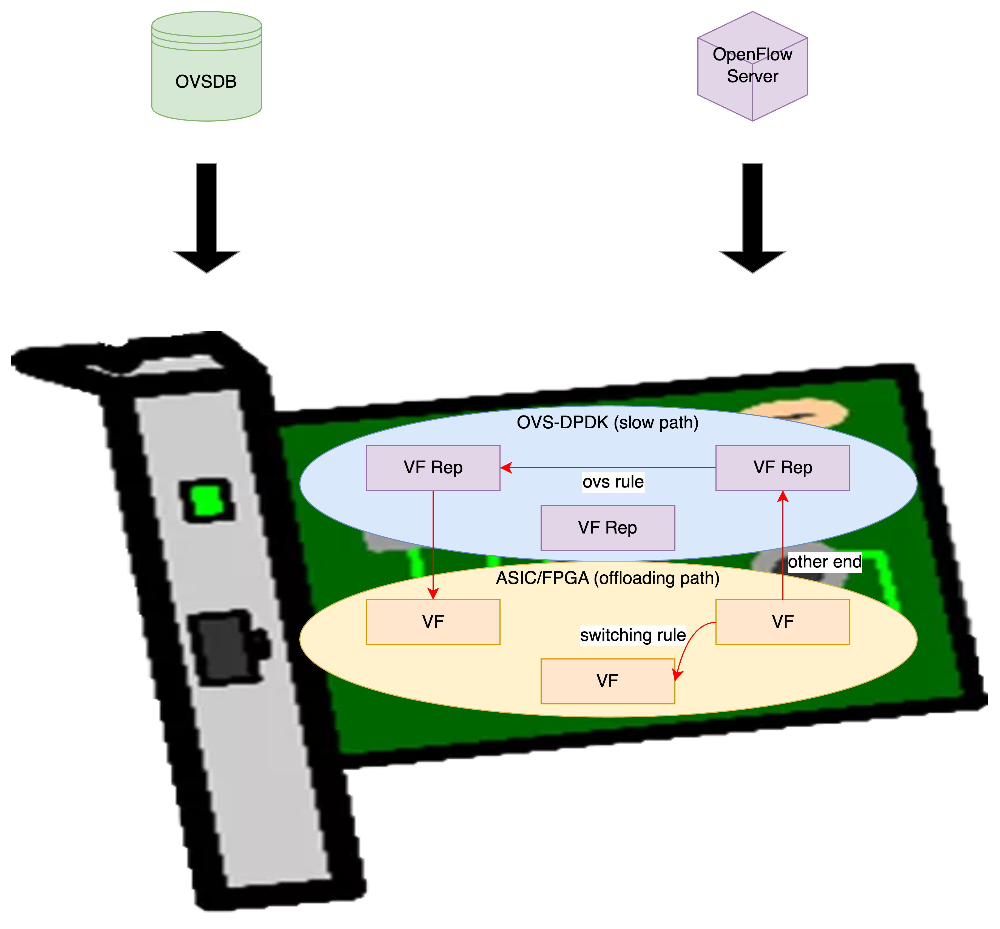
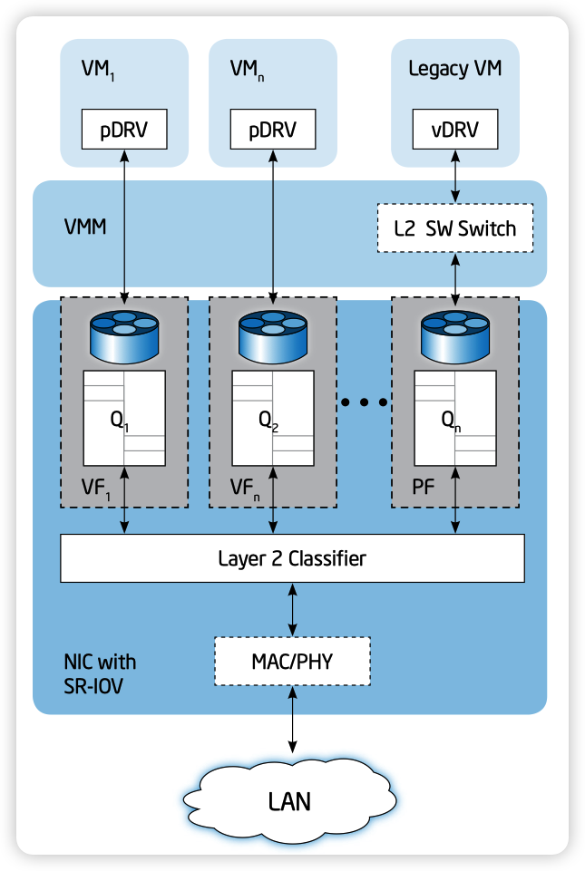
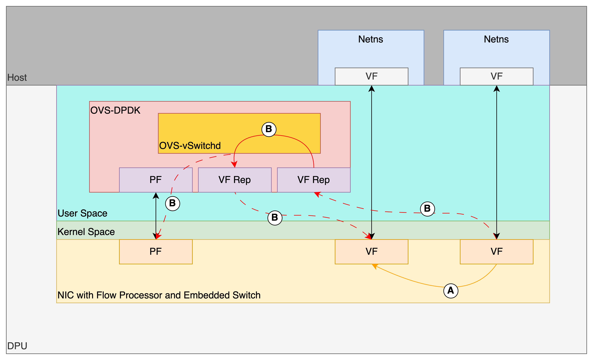
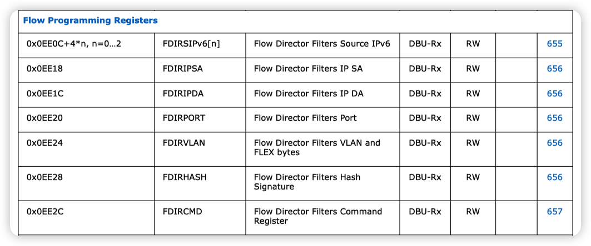
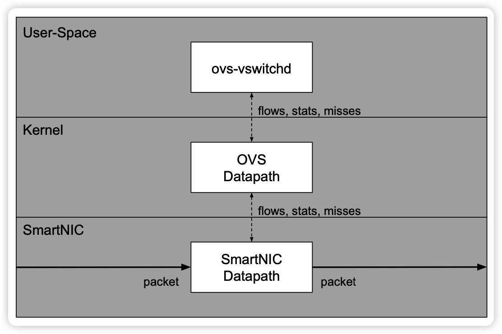
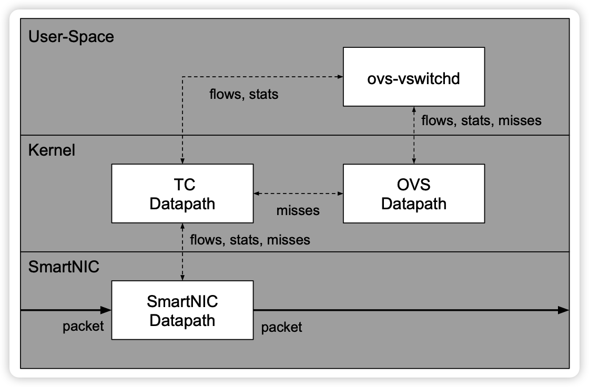

当今时代下，高性能网络的需求日益增加，在图形渲染被独立成GPU、神经网络计算被独立成NPU后，网络数据的加速也被提上日程，将网络数据处理转移到DPU上，成为了业内共识。

这篇文章，趁着我手里刚好有几张DPU，我们就一起来看一下，DPU如何像GPU、NPU一样，帮助加速云原生容器网络。

# 一点题外话

在接触DPU前，我一直觉得Open vSwitch（后文简称OVS）是一个处在黄昏时期的开源项目，是一个逐渐在被大家抛弃的东西。但是随着我用Proxmox VE等一些虚拟化、超融合平台以来，加之目前对DPU的适配工作，越发觉得OVS在业务性的SDN网络中处在一个不一般的地位，生态非常丰富。

在以往，对于这种类似的需求，我可能会非常推崇使用Linux原生的协议栈，或者使用DPDK lib自己开发。但是现在看来，没有比OVS再能all in one的方案了。Linux原生协议栈最大的问题就在于功能非常分散，简言之，我通过一个OVS可以解决大多数软转的需求，无非有些细节之处实现不会特别优雅，但是有OVS的生态加持下，很容易就可以加持上DPDK、智能网卡、DPU。但是如果在Linux原生协议栈下，这个适配还是比较有挑战性的，毕竟hook了FDB来offloading L2，还要再去hook FIB来offloading L3，然后还要再去hook netfilter来offloading L4，这太难受了。

所以，在满足99%需要的情况下，OVS还是没毛病的，人家还在稳步成长中，也还没到黄昏。

# 为什么会有DPU

由于网上对DPU的介绍非常多，此处我就不详细描述了，这里我们就简单聊聊为什么会有DPU。

网络数据的转发需求非常大，以我们常用的K8S网络，它有这么这么多的需求需要满足：

- L2转发。
- L3转发。
- NAT。需要实现Service的能力，还需要实现Pod出网的能力，所以既要DNAT，又要SNAT，由于要实现Pod出网，在一堆Pod共享一个出网IP的情况下，conntrack也得支持了。
- ACL。需要实现NetworkPolicy的能力，单单这个ACL的需求就非常多了，毕竟有那么多的协议、字段需要支持。
- ARP代答。在大二层的网络里，尤其是BGP EVPN的方案中，需要ARP代答来控制泛洪。
- Tunnel封装、解封装。比如VXLAN、GRE等，在BGP EVPN或者VRF跑VPC的场景里，不打封装根本没办法玩。
- …

可以看到，网络的需求有这么多，但是硬件的能力就那么点，所以让一个硬件实现完整的功能支持并不现实，即便是FPGA也不能这样既要又要，因此，把硬件和软件转发打包在一起组成一个DPU，就可以让它去包办所有网络相关的工作，Host就只需要关注业务了。

# DPU如何加速数据传输

博主我接触容器场景比较多，这里我拿容器中落地比较多的SR-IOV方案来阐述。

容器场景（Kubernetes）和虚拟机有点不太一样，他们虽然都算是基础设施平台，但是交付的资源的类型和对业务的感知程度有些许差别。在容器场景中，平台能够直接感知业务Pod的状态，可以说离业务更近了，业务可靠性通过多副本实现，因此可以一定程度容忍Pod失败。因此，容器场景下，不需要通过热迁移来保证Pod高可用，SR-IOV非常适合。但是在虚拟机场景下，虚拟机要能够支持热迁移，不能引入硬件依赖，因此SR-IOV无法胜任，vDPA反而是最佳选择。

在SR-IOV加速的方案中，DPU会有两个职能部分（如下图），一个是在通用芯片中运行的OVS-DPDK，来作为慢速路径，一个是在ASIC/FPGA中的快速路径（图中为offloading path，卸载路径），通过首包后下发的硬件规则（switching rule）将数据包从VF到VF直接转发，可以非常轻松达到线速，大幅提高性能。



这样加速之后，就形成了一个效果，一条流（flow）的首包发出之后，只要知道它该去哪里了，我就把这个路径告诉DPU，这样DPU每次在查找匹配到这条流之后，就直接从另外端口发出（或者做一些其他操作）就好了，就不用再来问问慢速路径该怎么走了，毕竟慢速路径转发也是靠通用芯片，效率肯定比不上ASIC/FPGA。通过这种抄近路的办法，DPU就可以把数据传输加速了。

# 为什么要区分快速、慢速路径

首先我们要知道，这两条路径是它们两个间相对的。

快速路径指的是可编程芯片（FPGA）或者专用芯片（ASIC）等中的转发路径，慢速路径指的是通用芯片（x86、ARM等）中的转发路径。慢速路径可以和快速路径打包在一起组成DPU，也可以转移到Host上，原理上区别不大。

快速路径虽然很快，但是它只能实现简单的操作，硬件级别Match/Action的能力有限，没有办法像慢速路径的通用芯片那样可以依靠多条指令处理非常复杂的转发，因此快速路径没有办法包揽业务的全部需求，需要慢速路径出面，对快速路径中硬件解决不了的转发需求进行补盲，共同支撑DPU的功能。

下文，我们会再更加细致得来看看快速、慢速路径是如何协同的。

# SR-IOV的接口概念

SR-IOV技术最开始来源于虚拟机场景中，为了能够实现更高的虚拟化效率，让网卡“分身”成为PF和众多的VF，就可以把VF通过硬件直通的方式直通到虚拟机中，这样一来，就不再需要通过软件来实现虚拟交换机了，就可以大幅提升网络性能，并且减少虚拟化宿主CPU的压力。



在SR-IOV这个过程中，共诞生出来了两个产物，一个叫做PF，一个叫做VF。

其中，PF本身也是个接口，可以在Linux操作系统中用于数据传输，相对于VF的区别在于PF接口提供了额外的权限，可以用于管理整个网卡的功能，比如VF的数量。如下的代码块，就是PF设备的驱动提供的额外权限，可以用于创建VF，仅仅PF接口的驱动才会有这个文件。

```bash
echo "10" > /sys/class/net/ens6/device/sriov_numvfs
```

VF接口就是个实打实的接口了，可以把它理解为一个轻量的PCIe设备，仅仅只包含了最基础的传输数据的功能。

在这个模型中，网卡更多还充当了一个硬交换机的角色（Embedded Switch），众多的VF实际上就是接在这么个交换机上，再通过网卡的物理接口，和外部网络接通。

# 什么是VF Representor

其实最开始我是觉得它应该归属到SR-IOV的范畴，但是之所以拆出来讲，是随着了解的深入，我觉得它更多算是SR-IOV的副产物，它并不算是SR-IOV这个硬件体系下的概念，只是各家软件系统在为了对齐标准的网络栈因而创造的概念。

VF Representor（后文简称VF Rep），在DPDK中也叫做Port Representor，是DPDK在管理PF时由DPDK PMD驱动创建的接口，本质是个ethdev。在大多数情况下，switching rule（在DPDK中叫做traffic steering rule）是没有办法预先确定的，因此快速路径必须要慢速路径告知，通过rte_flow接口将整一条flow下发到快速路径，才能完成所谓的硬件加速。那么实现这样的协同处理，网卡就必须要提供switch rule的other end选项，能够将失配规则的流通过某一种方式送回软件处理，这就是Representor诞生的意义，翻译成中文就是“代表”，也就可以理解成VF转不动的包，就让VF代表来，还是挺有意思的。

在有的智能网卡中，这个VF Rep也会被驱动支持，在Linux中呈现单独的接口，其目的和DPDK中的一样，都是为了能够实现标准的网络栈，能够通过VF Rep上送fallback的流量而已。

# Representor如何收包

了解了笼统的，再一起来看看DPDK里是如何处理VF Rep接口的收包的。

此处我拿Intel的ixgbe驱动来举例，VF Rep的初始化流程大概为：

- `rte_eal_init()`
    - `rte_bus_probe()`
        - `bus->probe()` 这里会到驱动的`eth_ixgbe_pci_probe`函数
            - `rte_eth_dev_create()` 创建PF的ethdev
            - `rte_eth_dev_create()` 创建VF Rep的ethdev
                - `ixgbe_vf_representor_init()` 配置队列的数量、链路信息等
- `rte_eth_dev_start()`
    - `(*dev->dev_ops->dev_start)(dev)` 这里会到驱动的`ixgbe_dev_start`函数
        - `ixgbe_dev_rx_init()` 每个VF Rep会分配独立的mbuf到rx ring中，最后通过`IXGBE_WRITE_REG`函数写入地址到网卡寄存器

起初，我以为网卡会为每个数据包在头端中添加额外的字段来标识这个数据包来自于哪个VF，随着分析DPDK的代码发现，其实并没有这些逻辑，网卡本身只需要匹配switching rule然后丢到合适的队列就好了，失配的就成other end，丢到VF Rep的队列，等慢速路径的PMD拿走处理就好，整个环节似乎没有理由再去添加专用的头端域。

那么在这个过程中，网卡非常依赖大量的队列，然而这些队列又都是通过DMA映射的物理内存，考虑到VF与VF间的隔离，我相信这里投递的disc，其内部的data也一定是从一个buf中复制到了另外的buf，应该不太可能能全部ZeroCpoy（吧？）。

因此，是不是可以得出一个结论，内存性能会非常影响网络性能（仅在慢速路径中）？

# Datapath

为了能够更直观一些，我画了个图来说明datapath，如下图。



图中共两条路径A和B。

路径A为快速路径，即已经通过rte_flow下发到硬件的flow信息，将会由硬件从VF的tx队列中Match到，然后直接Action转发到所选择的VF的rx队列中。

路径B为慢速路径，即当数据包在VF的tx队列中Match时失配，通过VF Rep上送到OVS-DPDK，在UIO的OVS-DPDK中完整查表后，找到目的的VF Rep口并发出，最终就会被送回到关联的VF口。最后，如果这一条流能够被快速路径加速，OVS-DPDK会再通过UIO驱动程序操作PF的寄存器，将这一条流的信息下发到快速路径中，后续就可以实现硬件加速。

# 快速路径的瓶颈

如果说Representor本质上只是系统或者软件的概念，那么意味着所有能够支持SR-IOV并且能够支持fallback上送路径的网卡，都可以作为快速路径使用（推测，改天找机会测试一下）。

这里，我就拿一张Intel 82599为例，看看它能在快速路径中发挥哪些作用。

在datasheet中，参考**8.2 Device Registers — PF**的**Flow Programming Registers**部分，可支持编程的字段不多，如下图。



可能硬件与硬件间的区别，就在于能够支持可编程的Match/Action的字段有多少了吧。

可编程的Match/Action字段越多，就支持更复杂的流的加速，相对而言就能分担更多慢速路径的负担，提高整体的网络性能。毕竟，在快速路径上打满线速还是比较容易的，而在慢速路径上，大带宽的小包满线速就非常难了。

# 和智能网卡的区别

此处，我拿一张来自Netronome的胶片，来一起看看智能网卡会怎么处理。

如下图，图片名称为OVS Datapath Hooks。



如下图，图片名称为OVS-TC。



可以看到，智能网卡和DPU一样，能够对特定的flow进行加速（卸载），上边的两幅图中都是硬件加速，只是实现的方式不同而已，但是最终都只是实现了快速路径，慢速路径的工作仍然还留在Host上。而DPU，可以把快速路径和慢速路径都转移到自己身上，这可能就是和智能网卡的最大差别吧。

# 总结

整体上来讲，我觉得DPU之所以能够被叫做DPU而不是智能网卡，是因为DPU不仅可以和智能网卡一样加速多种流，同时还整合了通用芯片来运行慢速路径，这两条路径协同起来，整体上看起来DPU才是真正一个独立的、可以处理一切流量的网络处理单元，才能从Host上解放了网络处理的工作，整体上提高网络的性能，让Host更加专注业务本身。

# 参考资料

- [http://events17.linuxfoundation.org/sites/events/files/slides/An Introduction to PCI Device Assignment with VFIO - Williamson - 2016-08-30_0.pdf](http://events17.linuxfoundation.org/sites/events/files/slides/An%20Introduction%20to%20PCI%20Device%20Assignment%20with%20VFIO%20-%20Williamson%20-%202016-08-30_0.pdf)
- [https://www.openvswitch.org/support/ovscon2020/slides/ovs-offload-too-many-models.pdf](https://www.openvswitch.org/support/ovscon2020/slides/ovs-offload-too-many-models.pdf)
- [https://cdrdv2-public.intel.com/331520/82599-datasheet-v3-4.pdf](https://cdrdv2-public.intel.com/331520/82599-datasheet-v3-4.pdf)
- [https://www.openvswitch.org/support/ovscon2021/slides/dma_offload.pdf](https://www.openvswitch.org/support/ovscon2021/slides/dma_offload.pdf)
- [https://doc.dpdk.org/guides-18.05/prog_guide/switch_representation.html](https://doc.dpdk.org/guides-18.05/prog_guide/switch_representation.html)
- [https://doc.dpdk.org/guides/prog_guide/switch_representation.html#vf-representors](https://doc.dpdk.org/guides/prog_guide/switch_representation.html#vf-representors)
- [https://www.dpdk.org/wp-content/uploads/sites/35/2016/08/Day02-Session02-Steve-Liang-DPDKUSASummit2016.pdf](https://www.dpdk.org/wp-content/uploads/sites/35/2016/08/Day02-Session02-Steve-Liang-DPDKUSASummit2016.pdf)
- [https://docs.kernel.org/networking/representors.html](https://docs.kernel.org/networking/representors.html)
- [https://www.intel.com/content/www/us/en/pci-express/pci-sig-single-root-io-virtualization-support-in-virtualization-technology-for-connectivity-paper.html](https://www.intel.com/content/www/us/en/pci-express/pci-sig-single-root-io-virtualization-support-in-virtualization-technology-for-connectivity-paper.html)
- [http://www.openvswitch.org/support/ovscon2017/horman.pdf](http://www.openvswitch.org/support/ovscon2017/horman.pdf)