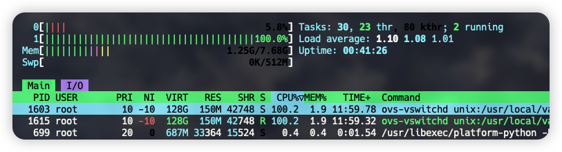

我有一台小主机，来自Lenovo的M73t，CPU型号为i3-4130T，内存为DDR3仅有8GB。这篇文章，我们就一起来看看，如何用这一台已经过时的、仅有两个物理核心的机器，做一台高性能的白盒交换机。

# 前言

如果你也要用你手边的机器做一个白盒，请务必去查一下你的硬件在DPDK的支持清单中。其中，x86_64的CPU几乎不用担心兼容性问题，其他架构的就要特别注意；网卡除去螃蟹（Realtek）完全不支持外，其他的大多数网卡都有DPDK的专用驱动，只是功能会有些许差别。

> https://core.dpdk.org/supported/

由于写下这篇文章的时候，我的机器都已经装完有一些时间了，我只能通过bash的历史记录来尽可能为大家还原当时的操作步骤，如果有疏漏，还请评论提醒我补充。

# 准备硬件

## 添加网卡

由于我的M73t只有一个网卡，型号为Intel I217-V，Linux驱动为e1000e，这个网卡也在DPDK的支持列表中，由于网卡绑定到DPDK的UIO驱动后，将会从Linux系统中卸下，不能再作为系统接口使用，因此我又插了一张USB的100M网卡，用来SSH连接。

DPDK的PMD驱动会屏蔽中断，使用忙轮询的方式不停检查网卡队列并处理包，因此绑定到DPDK的CPU核心将会直接被拉满到100%的使用率，这势必会增加机器的发热量，需要特别注意散热。

## 配置BIOS

- 禁用CPU超线程。
- 调小iGPU的内存，不需要使用桌面。
- 禁用C States。
- 设置电源策略为性能模式。
- 调高风扇转速。

此处不再赘述。

## 安装系统

此处我的系统信息如下：

```bash
# hostnamectl 
   Static hostname: sdn
         Icon name: computer-desktop
           Chassis: desktop
        Machine ID: 00000000000000000000000000000000
           Boot ID: 00000000000000000000000000000000
  Operating System: Rocky Linux 8.7 (Green Obsidian)
       CPE OS Name: cpe:/o:rocky:rocky:8:GA
            Kernel: Linux 4.18.0-425.13.1.el8_7.x86_64
      Architecture: x86-64
```

# 配置系统

## 前序配置

- 配置USB网卡。
- 配置或关闭防火墙。
- 配置SSH等常用系统组件。

此处不再赘述。

## 安装常用包

这个根据个人习惯安装即可。

```bash
dnf install epel-release -y
dnf install iftop htop wget vim tmux bash-completion pciutils usbutils net-tools -y
```

## 设置内核启动参数

为内核添加如下省略号后的参数，并且重新生成grub配置即可。

```bash
# cat /etc/default/grub 
GRUB_CMDLINE_LINUX="... crashkernel=0 selinux=0 isolcpus=1 intel_iommu=off default_hugepagesz=1G hugepagesz=1G hugepages=1 "
```

这些参数的含义如下 **（部分ChatGPT生成）** ：

1. **`crashkernel=0`**: 禁用内核崩溃转储功能。内核崩溃转储功能通常用于诊断和调试内核问题。开启转储需要预留一定的内存，关闭可以释放一些内存出来，但是会给kernel panic的分析带来不便，按需设置。
2. **`selinux=0`**: 禁用SELinux（安全增强Linux）。SELinux是一个安全模块，用于为Linux系统提供强制访问控制。将其设置为0表示禁用。
3. **`isolcpus=1`**: 隔离CPU核心1，使其不会被内核调度器分配任务。这可以确保分配给特定应用程序（如DPDK）的CPU核心不被其他进程使用。保留1号CPU核心给DPDK专用，不要让Linux调度任何task到这个核上。我的CPU在禁用了超线程后，只有两个核心，编号分别为0、1，就保留1号核心，注意这里是CPU核心编号的列表，不是下文提到的mask。
4. **`intel_iommu=off`**: 禁用Intel的IOMMU（输入输出内存管理单元）。IOMMU在虚拟化环境中很有用，因为它允许虚拟机直接访问硬件设备。禁用IOMMU，也就是Intel的VT-d。因为这颗CPU实在是很老了，本身也不支持VT-d，如果你的硬件支持，那么建议使用VFIO以提高安全性。
5. **`default_hugepagesz=1G`**: 将默认的大页大小设置为1GB。大页用于改善内存管理性能，特别是在需要大量内存的应用程序中。
6. **`hugepagesz=1G`**: 指定大页的大小为1GB。这与 **`default_hugepagesz`** 相匹配。
7. **`hugepages=1`**: 预留1个大页。根据前面的设置，这意味着预留1GB的大页内存。在启动时就预留1个1G的大页。

然后，生成新的grub配置，不同的系统、引导方式路径会有所差别。

```bash
grub2-mkconfig -o /boot/efi/EFI/rocky/grub.cfg
```

## 禁用网卡的Linux驱动

为了避免Linux启动时把网卡驱动加载了，此处将其驱动拉黑，这样系统中就看不到接口了。

```bash
cat > /etc/modprobe.d/e1000e.conf << EOF
blacklist e1000e
EOF
```

然后重新生成initrd。

```bash
dracut -f
```

## 自动加载UIO驱动

设置Linux启动时自动加载Userspace IO驱动。

```bash
cat > /etc/modules-load.d/uio.conf << EOF
uio_pci_generic
EOF
```

同样也要再重新生成initrd。

```bash
dracut -f
```

**在完成上边的系统配置后，需要重启系统。** 在重启后，就使用USB网卡进行SSH管理，自带的网卡将会被用于后续DPDK绑定，Linux的`ifconfig`、`ip link`命令中将不再能看到接口。建议提前就配置好并通过其他网卡SSH进来。

# 安装DPDK

此处使用源码编译的方式安装DPDK。

**在开始该安装步骤之前，一定要先去OVS、DPDK官网查找版本兼容性，编译2.x LTS版本的OVS时，如果使用了最新版本的DPDK，会有很多头文件不兼容，因此一定要提前确认好。** 目前，我使用的`22.11.1`版本的DPDK、`3.1.0`版本的OVS是可以正常搭配运行的。

由于很早之前我已经写了一篇文章讲解如何编译DPDK了，因此本文不再赘述，可以直接去找我的这篇文章：**网络系统基准测试——DPDK Pktgen使用记录**。在这个过程中，可能会在meson阶段报依赖错误，根据错误内容安装缺失的依赖即可。

在编译前安装ninja的过程中，出现了一个很奇怪的问题，我明明安装了最新的、符合条件版本的ninja，但是仍然提示我不满足。因此，索性卸载并且安装满足条件的最低版本，问题解决。

```bash
pip3 uninstall ninja
pip3 install ninja==1.8.2
```

# 安装配置OVS-DPDK

## 编译安装

这里的OVS需要单独编译，以引入DPDK作为datapath，此处我使用动态链接，并打开SSE4.2指令集的支持。

```bash
./configure --with-dpdk=shared CFLAGS="-Ofast -msse4.2 -mpopcnt"

```

然后编译并安装。

```bash
make
make install
```

由于默认的安装位置在`/usr/local`下，因此还要添加一下环境变量，指定一下脚本和域描述符的位置。

```bash
cat >> /etc/profile << EOF
export PATH="\$PATH:/usr/local/share/openvswitch/scripts"
EOF
```

然后重载一下profile。

```bash
source /etc/profile
```

## 启动

绑定网卡设备到DPDK驱动，如果不知道PCI地址，可以使用`lspci`或者`lshw -class net`命令查看。

```bash
dpdk-devbind.py --bind=uio_pci_generic 0000:00:19.0
```

紧接着就可以启动OVS了，使用如下的脚本可以快速拉起OVSDB和vswitchd。

```bash
ovs-ctl --db-sock="/usr/local/var/run/openvswitch/db.sock" start
```

如果启动遇到了问题，可以在`/usr/local/var/log/openvswitch`中查看OVSDB、vswitchd的日志。

配置DPDK PMD的参数。

```bash
# 让OVS使用DPDK
ovs-vsctl set Open_vSwitch . other_config:dpdk-init=true

# 使用预先分配的大页
ovs-vsctl set Open_vSwitch . other_config:dpdk-socket-mem="1024"

# 设置绑定1号CPU核心
ovs-vsctl set Open_vSwitch . other_config:dpdk-lcore-mask=0x2
```

其中，`dpdk-lcore-mask`参数为绑定的CPU核心的掩码，计算方法如下 **（ChatGPT生成）** ：

1. 首先，确定您希望分配给 DPDK 应用程序的 CPU 核心。例如，如果您有一个具有 8 个 CPU 核心的系统，并且您想要将核心 0、2、3 和 5 分配给 DPDK 应用程序。
2. 然后，将每个要分配的 CPU 核心的值表示为二进制数，将选定的核心对应的位置设置为 1，其他位置设置为 0。在此示例中，二进制表示为：**`00101101`**。请注意，二进制数的最右边表示 CPU 核心 0，依次向左递增。
3. 将二进制数转换为十六进制数。在此示例中，二进制数 **`00101101`** 转换为十六进制数为 **`0x2D`**。

设置完成后，我们可以通过命令查看所有的参数。

```bash
# ovs-vsctl list open_vswitch .
_uuid               : b9eef117-06ef-4014-8f86-2c833a075aba
bridges             : [dde8390a-24cc-450f-a8a4-c580aacacd14]
cur_cfg             : 7
datapath_types      : [netdev, system]
datapaths           : {}
db_version          : "8.3.1"
dpdk_initialized    : true
dpdk_version        : "DPDK 22.11.1"
external_ids        : {hostname=sdn, rundir="/usr/local/var/run/openvswitch", system-id=""}
iface_types         : [bareudp, dpdk, dpdkvhostuser, dpdkvhostuserclient, erspan, geneve, gre, gtpu, internal, ip6erspan, ip6gre, lisp, patch, stt, system, tap, vxlan]
manager_options     : []
next_cfg            : 7
other_config        : {dpdk-init="true", dpdk-lcore-mask="0x2", dpdk-socket-mem="1024"}
ovs_version         : "3.1.0"
ssl                 : []
statistics          : {}
system_type         : unknown
system_version      : unknown
```

## 配置网桥和接口

新增网桥。

```bash
ovs-vsctl add-br br0 -- set bridge br0 datapath_type=netdev
```

添加PCI设备作为接口。

```bash
ovs-vsctl add-port br0 if0 -- set Interface if0 type=dpdk options:dpdk-devargs=0000:00:19.0
```

绑定后，我们就可以使用如下命令看到OVS的接口信息了。

```bash
# ovs-vsctl show 
b9eef117-06ef-4014-8f86-2c833a075aba
    Bridge br0
        datapath_type: netdev
        Port if0
            Interface if0
                type: dpdk
                options: {dpdk-devargs="0000:00:19.0"}
        Port br0
            Interface br0
                type: internal
    ovs_version: "3.1.0"
```

这时候，也就可以看到一个CPU被拉满了。



## 配置

指定OpenFlow的服务器，并且设置只接受OpenFlow 1.5协议。

```bash
ovs-vsctl set-controller br0 tcp:127.0.0.1:6633
ovs-vsctl set bridge br0 protocols=OpenFlow15
```

在设置指定版本的协议后，后续再使用OVS的命令时需要使用`-O OpenFlow15`参数指定版本号，否则就会报错，可以参考如下命令。

```bash
ovs-ofctl dump-flows br0 -O OpenFlow15
```

## 使用抓包工具

使用该工具前，需要先安装python的依赖。

```bash
pip3 install ovs
```

然后即可像`tcpdump`那样使用OVS来抓包，排错数据面的问题。

```bash
ovs-tcpdump -i if0 arp -w arp_dpdk.pcap
```

## 使用带外+secure模式

这个问题源自于我使用Go开发的OpenFlow服务器下发了流表后，看到流表始终不生效，计数器没有增加，经过一番排查之后，发现了官方的文档中有如下解释：

> By default, Open vSwitch assumes that OpenFlow controllers are connected “in-band”, that is, that the controllers are actually part of the network that is being controlled. In in-band mode, Open vSwitch sets up special “hidden” flows to make sure that traffic can make it back and forth between OVS and the controllers. These hidden flows are higher priority than any flows that can be set up through OpenFlow, and they are not visible through normal OpenFlow flow table dumps.
> 
> https://docs.openvswitch.org/en/latest/faq/openflow/


默认情况下，OVS使用带内模式保证能和OpenFlow正常通信，因此添加了一些流，并且由于默认`fail-mode`为独立模式，因此当OpenFlow服务器关闭后，会有一条非常高优先级的NORMAL流生成，导致其他流无法被匹配到。

可以看到，下面的流表中添加了很多NORMAL流，并且优先级都非常高，结果就导致程序添加上去的流无法被匹配到。虽然第一条的NORMAL流，按照文档说的只会在OpenFlow服务器断开后才会自动加上，但是因为我的OpenFlow服务器只写了主动下发的逻辑，并没有监听Packet-In的端口，这可能是造成问题的根源。

```bash
# ovs-appctl bridge/dump-flows br0
duration=5428s, n_packets=49375, n_bytes=3817832, priority=15790320,actions=NORMAL
duration=29s, n_packets=0, n_bytes=0, priority=100,actions=drop
duration=5428s, n_packets=0, n_bytes=0, priority=180008,tcp,nw_src=127.0.0.1,tp_src=6633,actions=NORMAL
duration=5428s, n_packets=0, n_bytes=0, priority=180007,tcp,nw_dst=127.0.0.1,tp_dst=6633,actions=NORMAL
duration=5428s, n_packets=0, n_bytes=0, priority=180006,arp,arp_spa=127.0.0.1,arp_op=1,actions=NORMAL
duration=5428s, n_packets=0, n_bytes=0, priority=180005,arp,arp_tpa=127.0.0.1,arp_op=2,actions=NORMAL
duration=5428s, n_packets=0, n_bytes=0, priority=180002,arp,dl_src=00:23:24:7e:ab:cc,arp_op=1,actions=NORMAL
duration=5428s, n_packets=0, n_bytes=0, priority=180001,arp,dl_dst=00:23:24:7e:ab:cc,arp_op=2,actions=NORMAL
duration=5428s, n_packets=0, n_bytes=0, priority=180000,udp,in_port=LOCAL,dl_src=00:23:24:7e:ab:cc,tp_src=68,tp_dst=67,actions=NORMAL
duration=29s, n_packets=0, n_bytes=0, priority=10,arp,in_port=1,dl_dst=ff:ff:ff:ff:ff:ff,arp_tpa=10.11.22.26,arp_op=1,arp_tha=00:00:00:00:00:00,actions=set_field:2->arp_op,move:NXM_NX_ARP_SHA[]->NXM_NX_ARP_THA[],move:NXM_OF_ARP_SPA[]->NXM_OF_ARP_TPA[],set_field:10.11.22.26->arp_spa,set_field:00:00:00:00:99:99->arp_
sha,move:NXM_OF_ETH_SRC[]->NXM_OF_ETH_DST[],set_field:00:00:00:00:99:99->eth_src,IN_PORT
table_id=254, duration=57612s, n_packets=0, n_bytes=0, priority=2,recirc_id=0,actions=drop
table_id=254, duration=57612s, n_packets=3, n_bytes=180, priority=0,reg0=0x1,actions=controller(reason=)
table_id=254, duration=57612s, n_packets=19081, n_bytes=1409738, priority=0,reg0=0x2,actions=drop
table_id=254, duration=57612s, n_packets=0, n_bytes=0, priority=0,reg0=0x3,actions=drop
```

解决方法，将他们关闭即可，或者在程序向OVSDB下发配置时，就将配置预设。

```bash
# 配置带外模式，并且禁用带内模式
ovs-vsctl set controller br0 connection-mode=out-of-band
ovs-vsctl set bridge br0 other-config:disable-in-band=true

# 设置失败时不要添加NORMAL流表
ovs-vsctl set bridge br0 fail-mode=secure
```

上边这一堆命令中，有两个比较关键，能够导出OVS-DPDK内部的不同路径上的流表，非常有助于排错：

```bash
# 查看OpenFlow服务器下发的流，不含隐藏的流
ovs-ofctl dump-flows br0 -O OpenFlow15

# 查看OVS-DPDK的慢速路径中的所有流，包含隐藏的流
ovs-appctl bridge/dump-flows br0

# 查看OVS-DPDK的快速路径流表（DPDK PMD）
ovs-appctl dpctl/dump-flows
```

## 其他资料

- https://docs.openvswitch.org/en/latest/intro/install/dpdk/ OVS-DPDK的文档，可以在这里找到DPDK PMD的参数，配置核心和内存等信息。
- https://docs.openvswitch.org/en/latest/ref/ovs-ctl.8/ `ovs-ctl`脚本的文档。
- https://docs.openvswitch.org/en/latest/faq/openflow/ OVS常见问题QA，至少我遇到的坑都在这里找到了。

# 编写OVS服务器

OVS的体系中，remote分为两个部分，一个是OVSDB，用于管理接口配置，一个是OpenFlow，用于管理数据包的转发。

得益于VMware的支持，antrea这个K8S的CNI项目被开源出来，其中有个非常大的意义是，曾经被放弃的contiv项目被antrea的团队重新开始维护，并在antrea的pkg中提供了新的封装后的库，可以说为Go语言提供了首个勉强能用的生产级OVSDB、OpenFlow库。

## 注意

在你决定使用antrea的包开始开发OVSDB和OpenFlow服务前，务必准备好如下几个页面：

- https://pkg.go.dev/antrea.io/antrea/pkg/ovs/openflow OpenFlow包的文档。
- https://pkg.go.dev/antrea.io/antrea/pkg/ovs/ovsconfig OVSDB包的文档。
- https://opennetworking.org/wp-content/uploads/2014/10/openflow-switch-v1.3.4.pdf OpenFlow的协议文档，一定要时刻打开这个文档，当OpenFlow包报错时，这份文档是你能通过错误代码找到问题的唯一途径。例如`OFPBAC_MATCH_INCONSISTENT`、`OFPBMC_BAD_PREREQ`错误，如果没有这个协议文档，真的可能没有地方会告诉你错误的详细原因。
- https://www.iana.org/protocols IANA登记的协议信息，使用寄存器、直接协议操作（如ARP）时，需要操作OpCode、Type字段，都需要在这里查。

antrea的这两个库的思路和其他库不太一样，当你调用出现异常时，它大多数会选择直接panic给你，剩下的错误通过异步的错误输出显示给你，不像其他应用一样会返回一个err让你处理（虽然也有这个参数，但是我用了这么久没见返回过）。

当panic出现时，一定要使用调试工具，分析是哪里的空指针导致了panic，然后找到这个指针初始化的位置，找到初始化它的函数加以补充调用即可。当异步错误出现时，大多数都是OpenFlow协议文档中的错误，直接搜索即可，或者使用最高效率的办法——问ChatGPT。

## 一些题外话

最近OpenAI的ChatGPT大火，我也在第一时间换了外汇开通了Plus版本，在遇到上边这个问题时，我并没有第一时间去问ChatGPT，本身是一个异步的错误消息，没有特别引起我的注意，因此流表下发出问题、流表不生效，这些问题零零散散耗费了将近3个晚上才得以解决。

但是，但是，昨晚我将错误信息直接粘贴到了ChatGPT中，它竟然直接把错误的根源找到了，并且将上边我贴出的文档的原文总结并翻译给了我。本身也不是特别麻烦的问题，但是AI真的能注意到一些细节，真的很能提高效率。

最后提个醒，毕竟训练的数据集仍然是来自人类的，因此它也会胡扯，需要对生成的结果加以辨别和查证。

## OVSDB客户端例程

OVSDB的服务器由OVS的服务提供，我们使用客户端去操作它，来管理OVS中的接口。

```go
func NewOVSDB() error {
	db, err := ovsconfig.NewOVSDBConnectionUDS("/usr/local/var/run/openvswitch/db.sock")
	if err != nil {
		return err
	}
	defer db.Close()

	br := ovsconfig.NewOVSBridge("br0", "netdev", db)

	ports, err := br.GetPortList()
	if err != nil {
		return err
	}

	fmt.Printf("ports: %+v", ports)

	return nil
}
```

OVSDB的操作并没有太多问题，我就简单贴一个代码块给大家参考。

以下是对此代码的解释 **（ChatGPT生成）**：

1. 使用 **`ovsconfig.NewOVSDBConnectionUDS()`** 创建一个新的OVSDB连接。此连接使用Unix域套接字（UDS）连接到OVS数据库。在本例中，数据库套接字文件位于"/usr/local/var/run/openvswitch/db.sock"。
2. 如果连接创建失败，则返回错误。
3. 使用 **`defer db.Close()`** 确保在函数返回之前关闭数据库连接。
4. 使用 **`ovsconfig.NewOVSBridge()`** 创建一个新的 **`OVSBridge`** 对象，该对象表示名为"br0"的桥接器。此桥接器将使用"netdev"数据路径类型，并使用先前创建的数据库连接。
5. 调用 **`br.GetPortList()`** 以检索桥的端口列表。如果出现错误，则返回错误。
6. 使用 **`fmt.Printf()`** 打印检索到的端口列表。

## OpenFlow服务器例程

OVS需要连接OpenFlow服务器来处理Packet-In等消息，并且通过OpenFlow服务器来下发流表。

这里的开发会有非常多的坑，请大家结合我上文的提醒针对处理。

```go
import (
	"fmt"
	"net"

	"antrea.io/antrea/pkg/ovs/openflow"
)

type Switch struct {
	ofbr *openflow.OFBridge
}

var (
	selfIp     = net.ParseIP("10.11.22.26")
	selfMac, _ = net.ParseMAC("00:00:00:00:99:99")
)

var (
	tab0 = openflow.NewOFTable(0, "", 0, 0, openflow.TableMissActionDrop)
)

func New(ovsDir string) (*Switch, error) {
	mgmtAddr := openflow.GetMgmtAddress(ovsDir, "br0")

	br := openflow.NewOFBridge("br0", mgmtAddr)

	connCh := make(chan struct{}, 1)
	err := br.Connect(3, connCh)
	if err != nil {
		return nil, fmt.Errorf("failed to connect to OVS bridge: %v", err)
	}

	<-connCh

	return &Switch{ofbr: br}, nil
}

func (sw *Switch) InitTables() error {
	sw.ofbr.CreateTable(tab0, 0, openflow.TableMissActionDrop)

	// 一定要初始化，不然后续所有使用tab0的地方全部panic
	sw.ofbr.Initialize()

	return nil
}

func (sw *Switch) Close() {
	sw.ofbr.Disconnect()
}

func (sw *Switch) AddARPReplyFlow() error {
	flow := tab0.BuildFlow(10).
		MatchProtocol(openflow.ProtocolARP).
		MatchInPort(1).
		MatchDstMAC(net.HardwareAddr{0xFF, 0xFF, 0xFF, 0xFF, 0xFF, 0xFF}). // broadcast
		MatchARPOp(1).                                                     // ARP request
		MatchARPTpa(selfIp).                                               // target IP
		MatchARPTha(net.HardwareAddr{0x00, 0x00, 0x00, 0x00, 0x00, 0x00}). // broadcast
		Action().LoadARPOperation(2).                                      // ARP reply
		Action().Move("OXM_OF_ARP_SHA", "OXM_OF_ARP_THA").
		Action().Move("OXM_OF_ARP_SPA", "OXM_OF_ARP_TPA").
		Action().SetARPSpa(selfIp).
		Action().SetARPSha(selfMac).
		Action().Move("OXM_OF_ETH_SRC", "OXM_OF_ETH_DST").
		Action().SetSrcMAC(selfMac).
		Action().OutputInPort().
		Done()

	err := sw.ofbr.AddFlowsInBundle([]openflow.Flow{flow}, nil, nil)
	if err != nil {
		return fmt.Errorf("failed to add ARP reply flow: %v", err)
	}

	return nil
}

func (sw *Switch) AddICMPReplyFlow() error {
	flow := tab0.BuildFlow(11).
		MatchProtocol(openflow.ProtocolICMP).
		MatchDstMAC(selfMac).
		MatchDstIP(selfIp).
		MatchICMPType(8). // ICMP echo request
		MatchICMPCode(0). // no code
		Action().Move("OXM_OF_ETH_SRC", "OXM_OF_ETH_DST").
		Action().SetSrcMAC(selfMac).
		Action().Move("NXM_OF_IP_SRC", "NXM_OF_IP_DST").
		Action().SetSrcIP(selfIp).
		Action().Move("OXM_OF_ICMPV4_CODE", "OXM_OF_ICMPV4_TYPE").
		Action().OutputInPort().
		Done()

	err := sw.ofbr.AddFlowsInBundle([]openflow.Flow{flow}, nil, nil)
	if err != nil {
		return fmt.Errorf("failed to add ICMP reply flow: %v", err)
	}

	return nil
}
```

这个例程中，共下发了两条流，分别处理ARP的请求和ICMP echo的请求，在有这两条流之后，这个`selfIp`就可以被同子网下的其他设备ping通了。

在编写流的过程中，你应该会遇到这几个问题：

- 异步错误显示`OFPBMC_BAD_PREREQ`。这个错误的原因是因为你的Match缺失条件，比如你选择匹配ICMP的Code，但是没有指定MatchProtocol，就会出现这个错误。
- 空指针panic。目前这个问题大多数出现在寄存器的使用场景中，就好比`Move("OXM_OF_ETH_SRC", "OXM_OF_ETH_DST")`这一行，这两个寄存器key是一个map中预定义的内容，后文有预定义的寄存器，如果你使用了预定义之外的值，它会在某个地方直接panic。

### AddARPReplyFlow

**（ChatGPT生成）**

这个流会匹配特定条件的ARP请求，并将其修改为ARP回复，然后将结果发送回请求的端口。

以下是 **`AddARPReplyFlow`** 方法的详细解释：

1. 使用 **`tab0.BuildFlow(10)`** 开始构建一个新的流，其优先级为10。
2. 为流添加匹配条件：
    - **`MatchProtocol(openflow.ProtocolARP)`**：匹配ARP协议的数据包。
    - **`MatchInPort(1)`**：匹配从端口1进入的数据包。
    - **`MatchDstMAC(net.HardwareAddr{0xFF, 0xFF, 0xFF, 0xFF, 0xFF, 0xFF})`**：匹配目标MAC地址为广播地址的数据包。
    - **`MatchARPOp(1)`**：匹配ARP操作码为1（ARP请求）的数据包。
    - **`MatchARPTpa(selfIp)`**：匹配目标协议地址为 **`selfIp`** 的数据包。
    - **`MatchARPTha(net.HardwareAddr{0x00, 0x00, 0x00, 0x00, 0x00, 0x00})`**：匹配目标硬件地址为全零（未知）的数据包。
3. 为流添加动作：
    - **`Action().LoadARPOperation(2)`**：将ARP操作码设置为2（ARP回复）。
    - **`Action().Move("OXM_OF_ARP_SHA", "OXM_OF_ARP_THA")`**：将源硬件地址（SHA）移动到目标硬件地址（THA）。
    - **`Action().Move("OXM_OF_ARP_SPA", "OXM_OF_ARP_TPA")`**：将源协议地址（SPA）移动到目标协议地址（TPA）。
    - **`Action().SetARPSpa(selfIp)`**：将源协议地址设置为 **`selfIp`**。
    - **`Action().SetARPSha(selfMac)`**：将源硬件地址设置为 **`selfMac`**。
    - **`Action().Move("OXM_OF_ETH_SRC", "OXM_OF_ETH_DST")`**：将以太网源地址移动到以太网目标地址。
    - **`Action().SetSrcMAC(selfMac)`**：将以太网源地址设置为 **`selfMac`**。
    - **`Action().OutputInPort()`**：将数据包发送回输入端口。
4. 调用 **`Done()`** 完成流的构建。
5. 使用 **`sw.ofbr.AddFlowsInBundle()`** 将构建的流添加到OVS桥。该方法接收三个参数：要添加的流列表、要修改的流列表和要删除的流列表。在本例中，我们只添加一个流，不修改和删除任何流。

### AddICMPReplyFlow

**（ChatGPT生成）**

这个流会匹配特定条件的ICMP Echo请求（ping请求），并将其修改为ICMP Echo回复（ping回复），然后将结果发送回请求的端口。

以下是 **`AddICMPReplyFlow`** 方法的详细解释：

1. 使用 **`tab0.BuildFlow(11)`** 开始构建一个新的流，其优先级为11。
2. 为流添加匹配条件：
    - **`MatchProtocol(openflow.ProtocolICMP)`**：匹配ICMP协议的数据包。
    - **`MatchDstMAC(selfMac)`**：匹配目标MAC地址为 **`selfMac`** 的数据包。
    - **`MatchDstIP(selfIp)`**：匹配目标IP地址为 **`selfIp`** 的数据包。
    - **`MatchICMPType(8)`**：匹配ICMP类型为8（ICMP Echo请求）的数据包。
    - **`MatchICMPCode(0)`**：匹配ICMP代码为0（无代码）的数据包。
3. 为流添加动作：
    - **`Action().Move("OXM_OF_ETH_SRC", "OXM_OF_ETH_DST")`**：将以太网源地址移动到以太网目标地址。
    - **`Action().SetSrcMAC(selfMac)`**：将以太网源地址设置为 **`selfMac`**。
    - **`Action().Move("NXM_OF_IP_SRC", "NXM_OF_IP_DST")`**：将IP源地址移动到IP目标地址。
    - **`Action().SetSrcIP(selfIp)`**：将IP源地址设置为 **`selfIp`**。
    - **`Action().Move("OXM_OF_ICMPV4_CODE", "OXM_OF_ICMPV4_TYPE")`**：将ICMP类型设置为与ICMP代码相同的值（将Echo请求转换为Echo回复）。
    - **`Action().OutputInPort()`**：将数据包发送回输入端口。
4. 调用 **`Done()`** 完成流的构建。
5. 使用 **`sw.ofbr.AddFlowsInBundle()`** 将构建的流添加到OVS桥。该方法接收三个参数：要添加的流列表、要修改的流列表和要删除的流列表。在本例中，我们只添加一个流，不修改和删除任何流。

### 运行

运行这个服务器的代码如下（仅供参考测试）：

```go
func TestSwitch(t *testing.T) {
	log.SetOutput(os.Stdout)

	ofsw, err := New("/usr/local/var/run/openvswitch")
	if err != nil {
		t.Fatal(err)
	}

	err = ofsw.InitTables()
	if err != nil {
		t.Fatal(err)
	}

	err = ofsw.AddARPReplyFlow()
	if err != nil {
		t.Fatal(err)
	}

	err = ofsw.AddICMPReplyFlow()
	if err != nil {
		t.Fatal(err)
	}

	time.Sleep(time.Hour)
}
```

### 预定义的寄存器

预定义的寄存器的key如下，该代码在`antrea.io/lib!openflow@v0.9.2/openflow15/nx_util.go`。此处只放了一部分内容，更多可以去看这个代码文件，或者查找OVS的文档。

```go
// ...省略一些内容
	"NXM_OF_IN_PORT":   newMatchFieldHeader(OXM_CLASS_NXM_0, NXM_OF_IN_PORT, 2),
	"NXM_OF_ETH_DST":   newMatchFieldHeader(OXM_CLASS_NXM_0, NXM_OF_ETH_DST, 6),
	"NXM_OF_ETH_SRC":   newMatchFieldHeader(OXM_CLASS_NXM_0, NXM_OF_ETH_SRC, 6),
	"NXM_OF_ETH_TYPE":  newMatchFieldHeader(OXM_CLASS_NXM_0, NXM_OF_ETH_TYPE, 2),
	"NXM_OF_VLAN_TCI":  newMatchFieldHeader(OXM_CLASS_NXM_0, NXM_OF_VLAN_TCI, 2),
	"NXM_OF_IP_TOS":    newMatchFieldHeader(OXM_CLASS_NXM_0, NXM_OF_IP_TOS, 1),
	"NXM_OF_IP_PROTO":  newMatchFieldHeader(OXM_CLASS_NXM_0, NXM_OF_IP_PROTO, 1),
	"NXM_OF_IP_SRC":    newMatchFieldHeader(OXM_CLASS_NXM_0, NXM_OF_IP_SRC, 4),
	"NXM_OF_IP_DST":    newMatchFieldHeader(OXM_CLASS_NXM_0, NXM_OF_IP_DST, 4),
	"NXM_OF_TCP_SRC":   newMatchFieldHeader(OXM_CLASS_NXM_0, NXM_OF_TCP_SRC, 2),
	"NXM_OF_TCP_DST":   newMatchFieldHeader(OXM_CLASS_NXM_0, NXM_OF_TCP_DST, 2),
	"NXM_OF_UDP_SRC":   newMatchFieldHeader(OXM_CLASS_NXM_0, NXM_OF_UDP_SRC, 2),
	"NXM_OF_UDP_DST":   newMatchFieldHeader(OXM_CLASS_NXM_0, NXM_OF_UDP_DST, 2),
	"NXM_OF_ICMP_TYPE": newMatchFieldHeader(OXM_CLASS_NXM_0, NXM_OF_ICMP_TYPE, 1),
	"NXM_OF_ICMP_CODE": newMatchFieldHeader(OXM_CLASS_NXM_0, NXM_OF_ICMP_CODE, 1),
	"NXM_OF_ARP_OP":    newMatchFieldHeader(OXM_CLASS_NXM_0, NXM_OF_ARP_OP, 2),
	"NXM_OF_ARP_SPA":   newMatchFieldHeader(OXM_CLASS_NXM_0, NXM_OF_ARP_SPA, 4),
	"NXM_OF_ARP_TPA":   newMatchFieldHeader(OXM_CLASS_NXM_0, NXM_OF_ARP_TPA, 4),
// ...省略一些内容
```

# 收尾工作

如果你重启了机器，那么网卡默认不会使用DPDK的兼容驱动，需要在启动OVS前绑定。针对这个过程，以及其他一些相关流程，还需要添加一些systemd的服务来保证开机时自动处理。

可以参考下方的文档，添加systemd拉起的配置。

> https://github.com/openvswitch/ovs/tree/master/rhel

# 总结

经过本文这一通操作之后，这台机器摇身一变，成为了一个高性能的白盒交换机，我们可以开发应用来让他对数据包进行各种操作，来充当网关、VTEP等，配合能够编排BGP的NFV，摇身一变就可以跑VPC。

起初我还在想一个核心跑DPDK，就剩下一个核心还要跑系统应用，开发也就只有这一个核心能用，会不会体验特别差，以至于考虑了很久要不要买一台新机器。经过一段时间的测试，发现一个核心已经非常够用了，远程开发的体验几乎没有差别，可以说省下了一笔钱同时又利旧了淘汰的设备，可以再继续发光发热了。

性能测试我就不测了，手边没有测试仪打流了。

# 其他资料

- https://www.openvswitch.org/support/dist-docs/ovs-actions.7.txt
- http://conferences.sigcomm.org/sigcomm/2014/doc/slides/211.pdf

