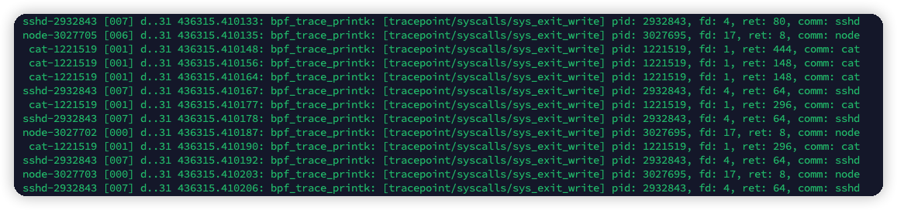
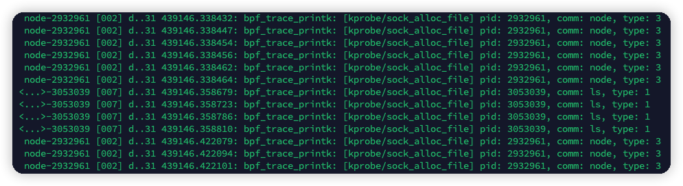
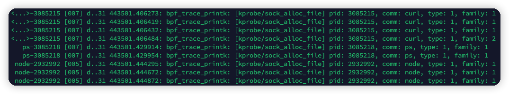
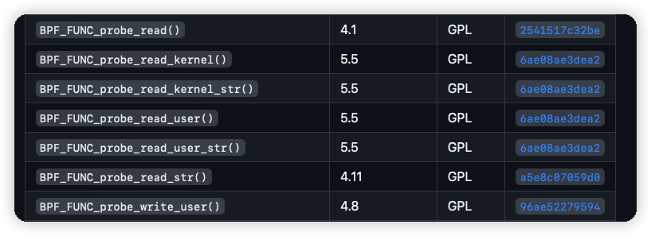
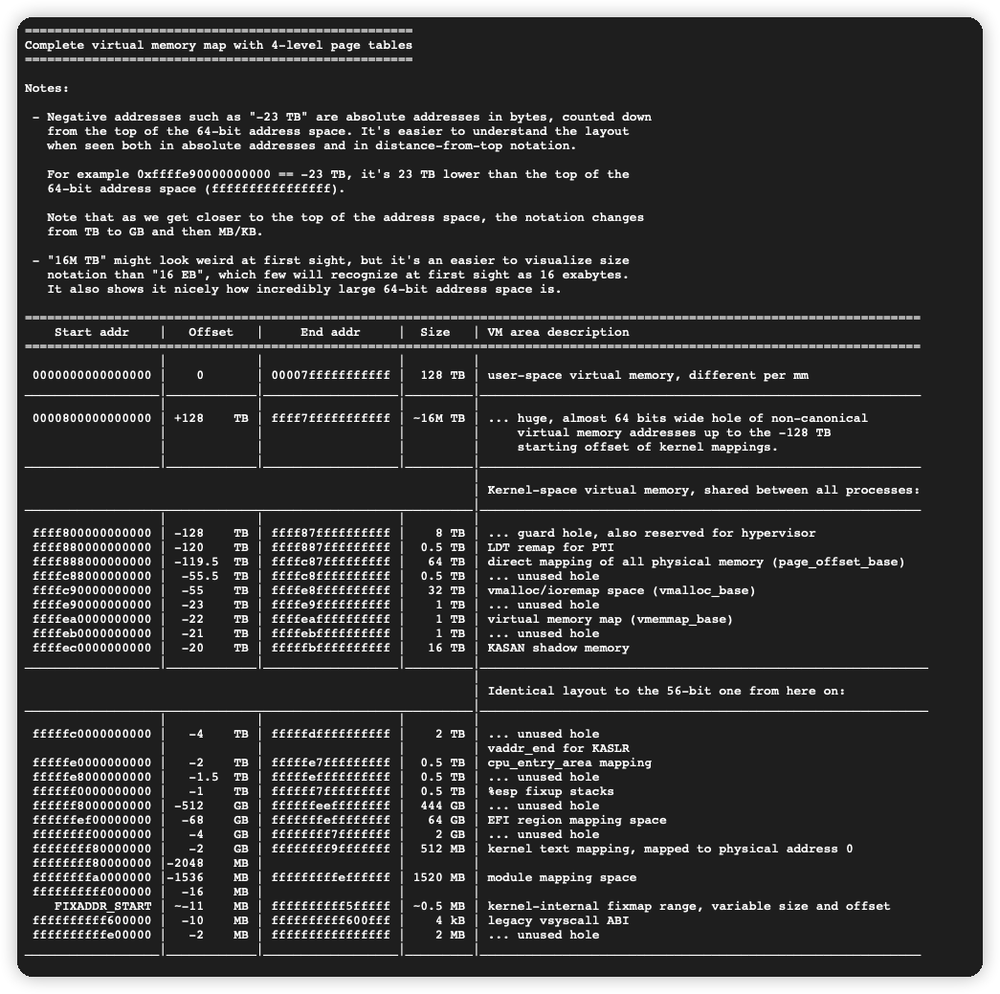

# 简介

eBPF老生常谈了，这里就不多介绍了，我们直接来看看Tracepoint和Kprobe。

Kprobe是Linux内核中的一个功能，可以实现无感知、动态切入任何内核活动中，并且收集调试和性能信息，一个很典型的使用案例就是切入内核的某个函数中并且获取传入参数和返回值。Kprobe共有两个类型，一个是Kprobe，一个是Kretprobe，他们都被统称为probes，前者用于切入内核函数并且获取传入参数，后者用于切入内核函数并且获取返回值。早期的Kprobe是以内核模块的形式开发，错误的操作会直接导致模块panic，并且可能会影响内核运行的稳定性，而如今，这些代码可以简化成eBPF代码，经过内核的检查才会装入BPF虚拟机中运行，也会限制能够访问的内存、内核函数，这虽然造成了一定的使用不便，但是大幅提高了安全性，也降低了使用难度。

Tracepoint也是Linux内核中的一个功能，并且也可以实现无感知切入内核活动中，与Kprobe不同的是，Tracepoint能够支持的内核活动是内核开发时就预先定义好的，因此只能叫做static probes，也正是因为开发阶段就定义好了，因此支持会比较稳定，并且性能也比Kprobe好。Linux内核更新频繁，不同的版本中函数定义、名称可能会有所差别，使用Tracepoint则完全无需顾虑这一问题，而Kprobe则可能会因为这些变化失败。

本文，我们就围绕这两种方式，来展开阐述一下如何通过eBPF来跟踪内核活动。

# 限制

Kprobe所谓的“任何内核活动”也并非任何，也会有一些黑名单函数不能被切入，以防止递归陷阱。并且，内核中被内联的函数，也无法切入。

高版本的Linux内核会包含一些低版本内核没有的BPF特性，开源项目bcc中维护了一个文档，记录了Linux内核版本对BPF特性的支持情况，详见文章底部参考资料。建议在开发前，看一下后期上线的生产环境的内核版本，开发时就只使用该内核版本可用的BPF特性，适配越早的内核版本就越免不了造轮子、甚至可能还要另辟蹊径弥补高版本内核才支持的BPF特性。

# 搭配Kprobe和Tracepoint

上文提到，两种方式都可以跟踪内核活动。由于Tracepoint性能好、支持稳定，因此会优先使用Tracepoint，对于Tracepoint无法覆盖的函数，则使用Kprobe、Kretprobe切入。

# 准备Tracepoint

Tracepoint支持的函数（活动），可以通过如下命令查看。

```bash
# cat /sys/kernel/tracing/available_events
# ... 省略
syscalls:sys_exit_write
syscalls:sys_enter_write
syscalls:sys_exit_socket
syscalls:sys_enter_socket
io_uring:io_uring_short_write
msr:write_msr
regmap:regmap_hw_write_start
regmap:regmap_bulk_write
regmap:regmap_reg_write
i2c:i2c_write
smbus:smbus_write
maple_tree:ma_write
# ... 省略
```

可以看到，不仅支持系统调用（syscalls），还支持外围设备、Linux IO等众多活动。此处我需要跟踪系统调用write，那么就使用`syscalls:sys_enter_write`获取传入参数，使用`syscalls:sys_exit_write`获取返回值，他们的定义都可以使用如下命令找到。

```bash
# cat /sys/kernel/tracing/events/syscalls/sys_enter_write/format 
name: sys_enter_write
ID: 713
format:
        field:unsigned short common_type;       offset:0;       size:2; signed:0;
        field:unsigned char common_flags;       offset:2;       size:1; signed:0;
        field:unsigned char common_preempt_count;       offset:3;       size:1; signed:0;
        field:int common_pid;   offset:4;       size:4; signed:1;

        field:int __syscall_nr; offset:8;       size:4; signed:1;
        field:unsigned int fd;  offset:16;      size:8; signed:0;
        field:const char * buf; offset:24;      size:8; signed:0;
        field:size_t count;     offset:32;      size:8; signed:0;

print fmt: "fd: 0x%08lx, buf: 0x%08lx, count: 0x%08lx", ((unsigned long)(REC->fd)), ((unsigned long)(REC->buf)), ((unsigned long)(REC->count))
```

```bash
# cat /sys/kernel/tracing/events/syscalls/sys_exit_write/format 
name: sys_exit_write
ID: 712
format:
        field:unsigned short common_type;       offset:0;       size:2; signed:0;
        field:unsigned char common_flags;       offset:2;       size:1; signed:0;
        field:unsigned char common_preempt_count;       offset:3;       size:1; signed:0;
        field:int common_pid;   offset:4;       size:4; signed:1;

        field:int __syscall_nr; offset:8;       size:4; signed:1;
        field:long ret; offset:16;      size:8; signed:1;

print fmt: "0x%lx", REC->ret
```

可谓是相当方便。

# 准备Kprobe

使用Kprobe就略微麻烦一些。

首先，需要去下载目标环境中Linux内核的源代码包，建议从源中下载发行版的内核代码包，并不推荐直接从Linux Kernel官网下载，可能会存在一定的差异。

- Debian/Ubuntu
    - 使用`apt install linux-source`安装
    - 进入`/usr/src/linux-source-x.x.x`目录
    - 找到`linux-source-x.x.x.tar.bz2`文件，解压得到源码
- CentOS/RockyLinux
    - 使用`yum install kernel-devel`安装
    - 进入`/usr/src/kernels/x.x.x-xxx.x.x.el8_8.x86_64`目录，即为源码

接下来，需要导入`/boot`中的配置编译一下内核，以便生成专用的头文件。

紧接着，打开内核的源代码，寻找需要切入的内核函数即可。需要特别注意的是，内核中有相当多的函数在编译时会被内联优化，这最终就会导致无法切入，需要另寻其他函数。可以通过如下命令查看内核已经装载的符号（即函数等，会包括已装载的kmod），如果没有想要的函数，那么可能就是被内联了，或者这个版本的内核删除了这个函数。

```bash
# cat /proc/kallsyms
# ... 省略
ffffffffa16d2dc0 T __x64_sys_writev
ffffffffa16d2de0 T __ia32_sys_writev
ffffffffa16d3170 T __ia32_compat_sys_writev
ffffffffa16d3190 T __x32_compat_sys_writev
ffffffffa16d47d0 T ksys_write
ffffffffa16d48b0 T __x64_sys_write
ffffffffa1cdd900 T sock_alloc_file
# ... 省略
```

需要特别注意的是，不要使用kprobe去跟踪系统调用，应该使用tracepoint。理由是kprobe跟踪系统调用时，系统调用可能会受到内核编译参数`ARCH_HAS_SYSCALL_WRAPPER`的影响，参数会被包起来，以至于我们看到的系统调用的定义和实际的传参会不一致，导致后续获取寄存器内容、指针内容时出现问题。

此处，我需要跟踪内核函数`sock_alloc_file`，可以确认该函数没有被内联，并且从源代码中找到其定义如下。

```c
struct file *sock_alloc_file(struct socket *sock, int flags, const char *dname)
```

# 准备VSCode

`.vscode/c_cpp_properties.json`配置如下。

```json
{
    "configurations": [
        {
            "name": "Linux",
            "includePath": [
                "/usr/include"
            ],
            "defines": [
                // ptrace需要，否则在使用 PT_REGS_PARMx 之类函数时IDE会标红。
                "__TARGET_ARCH_x86",
                // ptrace需要。
                "__KERNEL__",
                // 条件编译用，用于控制自定义的宏行为。
                "DEBUG"
            ],
            "compilerPath": "/usr/bin/clang-14",
            "cStandard": "c17",
            "cppStandard": "c++14",
            "intelliSenseMode": "linux-clang-x64"
        }
    ],
    "version": 4
}
```

不建议引入过多UAPI之外的头文件，因此此处我只引入了`/usr/include`一处。对于UAPI中只有声明没有定义的结构体，可以从内核源代码中拷贝出来，放到项目的头文件中使用。对于结构体中不需要的成员，可以直接删除，eBPF CORE特性将会自动计算出成员在结构体中的实际位置并重定向，具体我们后文将会提到。

# 编写Tracepoint

上文中，我们已经获取到了`syscalls:sys_enter_write`和`syscalls:sys_exit_write`的格式，接下来就把它们整理成结构体，并且编写一个demo来显示向fd中写入了多少字节。

```c
struct sys_enter_write_args
{
    // size:2; signed:0;
    __u16 common_type;
    // size:1; signed:0;
    __u8 common_flags;
    // size:1; signed:0;
    __u8 common_preempt_count;
    // size:4; signed:1;
    __s32 common_pid;

    // size:4; signed:1;
    __s32 __syscall_nr;
    // size:8; signed:0;
    __u64 fd;
    // size:8; signed:0;
    __u64 buf;
    // size:8; signed:0;
    __u64 count;
};
```

```c
struct sys_exit_write_args
{
    // size:2; signed:0;
    __u16 common_type;
    // size:1; signed:0;
    __u8 common_flags;
    // size:1; signed:0;
    __u8 common_preempt_count;
    // size:4; signed:1;
    __s32 common_pid;

    // size:4; signed:1;
    __s32 __syscall_nr;
    // size:8; signed:1;
    __s64 ret;
};
```

整理结构体时，一定要按照格式中的长度、是否有符号来定义，尤其是要认真检查长度，一旦长度错了，就会导致后边所有的成员位置无法对齐，最终读出的值与实际不符，造成错误。

eBPF的C代码如下。

Linux的task是最小的调度单元，它不会再并发，因此可以借助一个中间map来传递入参，就可以关联函数的入参和返回值了，此处就是名为`sys_write_map`的map，key值使用tgid，就可以唯一标识task。

```c
#include <linux/bpf.h>
#include <bpf/bpf_helpers.h>

// 条件编译，可以按需关闭日志输出。
#ifdef DEBUG
#define debugf(fmt, ...) bpf_printk(fmt, ##__VA_ARGS__)
#else
#define debugf(fmt, ...)
#endif

struct
{
    __uint(type, BPF_MAP_TYPE_HASH);
    __type(key, __u64);
    __type(value, __u64);
    __uint(max_entries, (1 << 16) - 1);
    __uint(map_flags, BPF_F_NO_PREALLOC);
} sys_write_map SEC(".maps");

struct sys_enter_write_args
{
    // size:2; signed:0;
    __u16 common_type;
    // size:1; signed:0;
    __u8 common_flags;
    // size:1; signed:0;
    __u8 common_preempt_count;
    // size:4; signed:1;
    __s32 common_pid;

    // size:4; signed:1;
    __s32 __syscall_nr;
    // size:8; signed:0;
    __u64 fd;
    // size:8; signed:0;
    __u64 buf;
    // size:8; signed:0;
    __u64 count;
};

SEC("tracepoint/syscalls/sys_enter_write")
int tracepoint__syscalls__sys_enter_write(struct sys_enter_write_args *ctx)
{
    // 获取task id。
    __u64 tgid = bpf_get_current_pid_tgid();
    // 获取入参中的fd。
    __u64 fd = ctx->fd;

    // 更新到中间map中。
    long ret = bpf_map_update_elem(&sys_write_map, &tgid, &fd, BPF_NOEXIST);
    if (ret < 0)
    {
        debugf("[tracepoint/syscalls/sys_enter_write] bpf_map_update_elem() update `sys_write_map` failed: %ld", ret);
        return 0;
    }

    return 0;
}

struct sys_exit_write_args
{
    // size:2; signed:0;
    __u16 common_type;
    // size:1; signed:0;
    __u8 common_flags;
    // size:1; signed:0;
    __u8 common_preempt_count;
    // size:4; signed:1;
    __s32 common_pid;

    // size:4; signed:1;
    __s32 __syscall_nr;
    // size:8; signed:1;
    __s64 ret;
};

SEC("tracepoint/syscalls/sys_exit_write")
int tracepoint__syscalls__sys_exit_write(struct sys_exit_write_args *ctx)
{
    __u64 tgid = bpf_get_current_pid_tgid();
    // tgid是
    __u64 pid = tgid >> 32;

    __u64 *fd = bpf_map_lookup_elem(&sys_write_map, &tgid);
    if (fd == NULL)
        return 0;
    bpf_map_delete_elem(&sys_write_map, &tgid);

    if (ctx->ret < 0)
        return 0;

    __u8 comm[64];
    bpf_get_current_comm(&comm, sizeof(comm));

    debugf("[tracepoint/syscalls/sys_exit_write] pid: %lu, fd: %lu, ret: %ld, comm: %s", pid, *fd, ctx->ret, comm);

    return 0;
}

char __license[] SEC("license") = "Dual MIT/GPL";
```

`bpf_get_current_pid_tgid()`获取到的tgid实际上包含了两部分，前32bit为tgid，后32bit为pid。这里的pid和用户态中的pid并非同一个概念，内核中的最小调度单元为task（即用户态的thread），pid实际上是task id，tgid全称为task group id，一组task（即用户态的thread）共同属于一个task group（即用户态的process），代码中的命名不是特别严谨，这里特别说明一下。参考资料中有更详细的说明，可以自行查看，下方引用了其中的一个回答，可以很直观地解释差异。

```
                         USER VIEW
                         vvvv vvvv
              |          
<-- PID 43 -->|<----------------- PID 42 ----------------->
              |                           |
              |      +---------+          |
              |      | process |          |
              |     _| pid=42  |_         |
         __(fork) _/ | tgid=42 | \_ (new thread) _
        /     |      +---------+          |       \
+---------+   |                           |    +---------+
| process |   |                           |    | process |
| pid=43  |   |                           |    | pid=44  |
| tgid=43 |   |                           |    | tgid=42 |
+---------+   |                           |    +---------+
              |                           |
<-- PID 43 -->|<--------- PID 42 -------->|<--- PID 44 --->
              |                           |
                        ^^^^^^ ^^^^
                        KERNEL VIEW
```

再使用`cilium/ebpf`的包生成go代码，并使用go装载运行。

```go
package main

import (
	"log"
	"os"
	"os/signal"

	"github.com/cilium/ebpf/link"
	"github.com/cilium/ebpf/rlimit"
	"golang.org/x/sys/unix"
)

//go:generate go run github.com/cilium/ebpf/cmd/bpf2go -target amd64 -cc clang -cflags "-O2 -g -D__TARGET_ARCH_x86 -D__KERNEL__ -DDEBUG -I/usr/include" write ../../bpf/write.c

func main() {
	err := rlimit.RemoveMemlock()
	if err != nil {
		log.Fatalf("remove mem limit failed: %v", err)
	}

	var objs writeObjects
	err = loadWriteObjects(&objs, nil)
	if err != nil {
		log.Fatalf("load ebpf objects failed: %v", err)
	}

	tracepointSyscallsSysEnterWriteLink, err := link.Tracepoint(
		"syscalls",
		"sys_enter_write",
		objs.TracepointSyscallsSysEnterWrite,
		nil,
	)
	if err != nil {
		log.Fatalf("open tracepoint `syscalls:sys_enter_write` failed: %v", err)
	}
	defer tracepointSyscallsSysEnterWriteLink.Close()

	tracepointSyscallsSysExitWriteLink, err := link.Tracepoint(
		"syscalls",
		"sys_exit_write",
		objs.TracepointSyscallsSysExitWrite,
		nil,
	)
	if err != nil {
		log.Fatalf("open tracepoint `syscalls:sys_exit_write` failed: %v", err)
	}
	defer tracepointSyscallsSysExitWriteLink.Close()

	sigCh := make(chan os.Signal, 1)
	signal.Notify(sigCh, os.Interrupt, unix.SIGTERM)
	<-sigCh
}
```

使用`go generate`生成eBPF文件和代码后，再使用`go build`编译即可。

执行，即可`cat /sys/kernel/debug/tracing/trace_pipe`看到如下的输出。



# 编写Kprobe

Kretprobe非常类似Kprobe，无非是使用`PT_REGS_RC`宏获取返回值，此处就不再单独贴代码了。接下来，我们使用Kprobe切入`sock_alloc_file`函数并且获取其参数，将新分配的socket结构体（即参数中的）的类型显示出来。

曾经我就想过，既然kretprobe中也可以使用`PT_REGS_PARMx`宏，那是不是可以不使用kprobe，直接在kretprobe中获取传入参数？实际上是不行的，因为在函数返回时，已经不能够确定ebx、ecx等存放入参的寄存器上是否发生了变化，因此还是要分开单独使用kprobe和kretprobe。

上文中已经提到过，我们从内核源码中找到了这个函数的定义，和上边Tracepoint中不同的是，这次的参数中有一个是结构体指针，这个指针指向的位置是在内核态的内存空间中分配的，因此我们不能直接访问它，需要使用helper提供的`bpf_probe_read`等函数读取它，这些函数就存在于头文件`bpf/bpf_helpers.h`中。

如果我们不使用helper提供的函数直接读取结构体中的值，在eBPF程序装载时会得到如下的报错。

```bash
load program: permission denied: 9: (69) r5 = *(u16 *)(r1 +0): R1 invalid mem access 'scalar' (17 line(s) omitted)
```

我们把eBPF C代码编译为字节码文件（命令如下），看看具体问题在哪一行。

```bash
clang -O2 -target bpf -g -c ../../bpf/skalloc.c -S -o ./skalloc.S -D__TARGET_ARCH_x86 -D__KERNEL__ -DDEBUG -I/usr/include
```

此时，我们即可得到`skalloc.S`文件，在其中搜索错误内容`*(u16 *)(r1 +0)`，注意加空格，即需要按照`*(u16 *)(r1 + 0)`来搜索才能找到，如下。

```bash
.Ltmp11:
	#DEBUG_VALUE: kprobe__sock_alloc_file:sock <- $r1
	#DEBUG_VALUE: kprobe__sock_alloc_file:t <- 0
	.loc	0 68 5                          # ../../bpf/skalloc.c:68:5
.Ltmp12:
	r5 = *(u16 *)(r1 + 0)
.Ltmp13:
.Ltmp14:
	.loc	0 53 22                         # ../../bpf/skalloc.c:53:22
```

即可定位到eBPF C代码的第68行（如下），也就是在这一行中直接访问`sock->type`时失败了。

```c
debugf("[kprobe/sock_alloc_file] pid: %lld, comm: %s, type: %d", pid, comm, sock->type);
```

在加入`bpf_probe_read`函数之后，即可正常编译并运行。



正常运行的eBPF C代码如下。

```c
#include <linux/bpf.h>
#include <linux/net.h>
#include <linux/socket.h>
#include <linux/types.h>
#include <sys/types.h>
#include <sys/socket.h>
#include <bpf/bpf_helpers.h>
#include <bpf/bpf_tracing.h>
#include <bpf/bpf_endian.h>
#include <bpf/bpf_core_read.h>

// 从 include/linux/net.h 中截取。
struct socket
{
    short type;
};

// 从 arch/x86/include/asm/ptrace.h 中截取。
struct pt_regs
{
    unsigned long r15;
    unsigned long r14;
    unsigned long r13;
    unsigned long r12;
    unsigned long bp;
    unsigned long bx;
    unsigned long r11;
    unsigned long r10;
    unsigned long r9;
    unsigned long r8;
    unsigned long ax;
    unsigned long cx;
    unsigned long dx;
    unsigned long si;
    unsigned long di;
    unsigned long orig_ax;
    unsigned long ip;
    unsigned long cs;
    unsigned long flags;
    unsigned long sp;
    unsigned long ss;
};

#ifdef DEBUG
#define debugf(fmt, ...) bpf_printk(fmt, ##__VA_ARGS__)
#else
#define debugf(fmt, ...)
#endif

SEC("kprobe/sock_alloc_file")
int kprobe__sock_alloc_file(struct pt_regs *ctx)
{
    __u64 tgid = bpf_get_current_pid_tgid();
    __u64 pid = tgid >> 32;

    __u8 comm[64];
    bpf_get_current_comm(&comm, sizeof(comm));

    struct socket *socket = (struct socket *)PT_REGS_PARM1(ctx);
    short t = 0;

    long ret = bpf_probe_read(&t, sizeof(t), &socket->type);
    if (ret < 0)
    {
        debugf("[kprobe/sock_alloc_file] bpf_probe_read() read `socket->type` failed: %ld", ret);
        return 0;
    }

    debugf("[kprobe/sock_alloc_file] pid: %lu, comm: %s, type: %d", pid, comm, t);

    return 0;
}

char __license[] SEC("license") = "Dual MIT/GPL";
```

加载eBPF程序的go的代码如下。

```go
package main

import (
	"log"
	"os"
	"os/signal"

	"github.com/cilium/ebpf/link"
	"github.com/cilium/ebpf/rlimit"
	"golang.org/x/sys/unix"
)

//go:generate go run github.com/cilium/ebpf/cmd/bpf2go -target amd64 -cc clang -cflags "-O2 -g -D__TARGET_ARCH_x86 -D__KERNEL__ -DDEBUG -I/usr/include" skalloc ../../bpf/skalloc.c

func main() {
	err := rlimit.RemoveMemlock()
	if err != nil {
		log.Fatalf("remove mem limit failed: %v", err)
	}

	var objs skallocObjects
	err = loadSkallocObjects(&objs, nil)
	if err != nil {
		log.Fatalf("load ebpf objects failed: %v", err)
	}

	kprobeSockAllocFileLink, err := link.Kprobe(
		"sock_alloc_file",
		objs.KprobeSockAllocFile,
		nil,
	)
	if err != nil {
		log.Fatalf("open kprobe `sock_alloc_file` failed: %v", err)
	}
	defer kprobeSockAllocFileLink.Close()

	sigCh := make(chan os.Signal, 1)
	signal.Notify(sigCh, os.Interrupt, unix.SIGTERM)
	<-sigCh
}
```

# 使用eBPF CORE

接下来我们要再获取socket结构体中sock结构体中的一个成员，那么问题来了，由于内核中一个结构体可能非常大，并且可能会引入条件编译，不好确定成员位置的情况下，如何使用`bpf_probe_read`函数读取成员内容？

我们来看看内核源码中的socket结构体定义，如下。

```c
struct socket {
	socket_state		state;

	short			type;

	unsigned long		flags;

	struct file		*file;
	struct sock		*sk;
	const struct proto_ops	*ops;

	struct socket_wq	wq;
};
```

可以看到，成员`sk`排的比较靠后，并且这个结构体不算很大，我们手工算甚至都能算出来成员`sk`在socket结构体中的位置，或者也可以使用pahole工具计算位置。

如果你的内核编译时带上了DWARF信息或者有生成BTF信息，就可以使用pahole计算结构体中成员位置。

```bash
# 复制当前系统中的内核镜像到当前目录里。
cp /boot/vmlinuz-5.4.0-156-generic .

# 下载Linux源码中的解压工具并且给可执行权限。
wget -O extract-vmlinux https://raw.githubusercontent.com/torvalds/linux/master/scripts/extract-vmlinux
chmod a+x ./extract-vmlinux

# 解压内核镜像到 vmlinux 文件中。
./extract-vmlinux vmlinuz-5.4.0-156-generic > ./vmlinux
```

此时，我们就得到了vmlinux文件，使用`file`命令就可以得到其信息，为一个ELF格式的文件，不过符号表已经被剥离了，好在还有BTF。

```bash
# file vmlinux 
vmlinux: ELF 64-bit LSB executable, x86-64, version 1 (SYSV), statically linked, BuildID[sha1]=d3edeaa50be254a4531bef09e77a003c25b4d938, stripped
```

现在，我们就可以使用pahole工具搜索vmlinux中的结构体信息，此处我就搜索socket结构体。

```bash
# pahole -C socket ./vmlinux
struct socket {
        socket_state               state;                /*     0     4 */
        short int                  type;                 /*     4     2 */

        /* XXX 2 bytes hole, try to pack */

        long unsigned int          flags;                /*     8     8 */
        struct file *              file;                 /*    16     8 */
        struct sock *              sk;                   /*    24     8 */
        const struct proto_ops  *  ops;                  /*    32     8 */

        /* XXX 24 bytes hole, try to pack */

        /* --- cacheline 1 boundary (64 bytes) --- */
        struct socket_wq           wq;                   /*    64    64 */

        /* XXX last struct has 8 bytes of padding */

        /* size: 128, cachelines: 2, members: 7 */
        /* sum members: 102, holes: 2, sum holes: 26 */
        /* paddings: 1, sum paddings: 8 */
};
```

可以看到，成员`sk`的位置在第24字节处，并且大小为8字节（因为是个64位的指针）。

如果填充结构体，我们就可以使用如下的方式手工填充到第24字节的位置，进而就可以直接使用`bpf_probe_read(..., ..., &socket->sk)`的方式读取成员`sk`。这种做法一般不会用到，因为内核中的结构体动辄可能上千字节，都这样填充对齐会累死人的。

```c
struct socket
{
    short type;      // 第 0 字节。
    short unused1;   // 第 2 字节。
    __u32 unused2;   // 第 4 字节。
    __u64 unused3;   // 第 8 字节。
    __u64 unused4;   // 第 16 字节。
    struct sock *sk; // 第 24 字节。
};
```

由于我们通过pahole已经分析出来了成员`sk`的位置在第24字节处，因此使用`bpf_probe_read(..., ..., (void *)((u64)socket + 24))`也是可行的办法。但是这种做法只能适用在比较稳定的结构体中，如果结构体中的成员经常变化，就要再另行计算和适配，会很麻烦。之所以要先把结构体指针`socket`转换为`__u64`类型再加24再转回指针类型，是因为如果直接对指针加24，编译器实际上将会编译为`socket + sizeof(socket) * 24`，这样就会得到错误的结果。

讨论了这么多，如何简化这些操作呢？那就是使用eBPF CORE特性了，它全称为BPF CO-RE (Compile Once – Run Everywhere)，即一次编译到处运行，看到这个名字我们就知道它是来解决上边结构体成员位置不好确定的问题了。头文件`bpf/bpf_core_read.h`提供了`bpf_core_read`等宏，可以在每次装载时通过BTF信息推算并重定向目标成员的位置，即可实现一份代码、不同版本内核间通用。

BTF信息是一种DWARF格式的替代品，可以在更小的体积下记录C代码中的信息，为eBPF CORE特性提供可能，在内核编译时，选中`CONFIG_DEBUG_INFO_BTF`配置，并且安装了如下依赖，即可在编译内核时生成BTF信息。

- Debian/Ubuntu
    - `apt install dwarves`
- CentOS/RockyLinux
    - `dnf --enablerepo=devel install libdwarves1`

如果Linux内核带了BTF信息，即可找到`/sys/kernel/btf/vmlinux`这个文件。此时，就可以使用如下命令导出内核中所有的定义，UAPI中不存在的定义也会被导出。导出的vmlinux.h将会是一个非常庞大的头文件，它并不一定能直接引入程序中使用，甚至VSCode打开它还能崩溃。

```bash
bpftool btf dump file /sys/kernel/btf/vmlinux format c > vmlinux.h
```

我们使用eBPF CORE特性获取结构体成员`sk`中的成员、及其中的`skc_family`，再将其显示出来，eBPF C代码如下，可以看到，完全不用再考虑对齐的问题了。

```c
#include <linux/bpf.h>
#include <linux/net.h>
#include <linux/socket.h>
#include <linux/types.h>
#include <sys/types.h>
#include <sys/socket.h>
#include <bpf/bpf_helpers.h>
#include <bpf/bpf_tracing.h>
#include <bpf/bpf_endian.h>
#include <bpf/bpf_core_read.h>

struct sock_common
{
	unsigned short skc_family;
};

struct sock
{
	struct sock_common __sk_common;
};

struct socket
{
    short type;
    struct sock *sk;
};

struct pt_regs
{
    unsigned long r15;
    unsigned long r14;
    unsigned long r13;
    unsigned long r12;
    unsigned long bp;
    unsigned long bx;
    unsigned long r11;
    unsigned long r10;
    unsigned long r9;
    unsigned long r8;
    unsigned long ax;
    unsigned long cx;
    unsigned long dx;
    unsigned long si;
    unsigned long di;
    unsigned long orig_ax;
    unsigned long ip;
    unsigned long cs;
    unsigned long flags;
    unsigned long sp;
    unsigned long ss;
};

#ifdef DEBUG
#define debugf(fmt, ...) bpf_printk(fmt, ##__VA_ARGS__)
#else
#define debugf(fmt, ...)
#endif

SEC("kprobe/sock_alloc_file")
int kprobe__sock_alloc_file(struct pt_regs *ctx)
{
    __u64 tgid = bpf_get_current_pid_tgid();
    __u64 pid = tgid >> 32;

    int a = sizeof(short);

    __u8 comm[64];
    bpf_get_current_comm(&comm, sizeof(comm));

    struct socket *socket = (struct socket *)PT_REGS_PARM1(ctx);
    short t = 0;

    long ret = bpf_core_read(&t, sizeof(t), &socket->type);
    if (ret < 0)
    {
        debugf("[kprobe/sock_alloc_file] bpf_core_read() read `socket->type` failed: %ld", ret);
        return 0;
    }

    struct sock *sk = NULL;
    ret = bpf_core_read(&sk, sizeof(sk), &socket->sk);
    if (ret < 0)
    {
        debugf("[kprobe/sock_alloc_file] bpf_core_read() read `socket->sk` failed: %ld", ret);
        return 0;
    }

    unsigned short f = 0;
    ret = bpf_core_read(&f, sizeof(f), &sk->__sk_common.skc_family);
    if (ret < 0)
    {
        debugf("[kprobe/sock_alloc_file] bpf_core_read() read `sk->__sk_common.skc_family` failed: %ld", ret);
        return 0;
    }

    debugf("[kprobe/sock_alloc_file] pid: %lu, comm: %s, type: %d, family: %u", pid, comm, t, f);

    return 0;
}

char __license[] SEC("license") = "Dual MIT/GPL";
```

编译，运行，即可看到获取的`type`和`skc_family`。



# 访问地址检查

上文的kprobe中，我们用到了`bpf_probe_read`函数，但是其实这个函数在新版本的内核中已经不推荐使用了。

> bpf: Add probe_read_{user, kernel} and probe_read_{user, kernel}_str …
…helpers
> 
> 
> The current bpf_probe_read() and bpf_probe_read_str() helpers are broken
> in that they assume they can be used for probing memory access for kernel
> space addresses /as well as/ user space addresses.
> 
> However, plain use of probe_kernel_read() for both cases will attempt to
> always access kernel space address space given access is performed under
> KERNEL_DS and some archs in-fact have overlapping address spaces where a
> kernel pointer and user pointer would have the /same/ address value and
> therefore accessing application memory via bpf_probe_read{,_str}() would
> read garbage values.
> 
> Lets fix BPF side by making use of recently added 3d70818 ("uaccess:
> Add non-pagefault user-space read functions"). Unfortunately, the only way
> to fix this status quo is to add dedicated bpf_probe_read_{user,kernel}()
> and bpf_probe_read_{user,kernel}_str() helpers. The bpf_probe_read{,_str}()
> helpers are kept as-is to retain their current behavior.
> 
> The two *_user() variants attempt the access always under USER_DS set, the
> two *_kernel() variants will -EFAULT when accessing user memory if the
> underlying architecture has non-overlapping address ranges, also avoiding
> throwing the kernel warning via 00c4237 ("x86-64: add warning for
> non-canonical user access address dereferences").
> 

在Linux内核代码的一个Commit Message中，可以看到不推荐使用`bpf_probe_read`函数的原因，这个老函数在读取用户空间的内存时会造成错误，例如如下的错误信息。（高版本的内核中已经修复，使用这个老函数不会再导致错误，具体可以在参考资料中找到版本。）

```c
[259423.957389] ------------[ cut here ]------------
[259423.957390] General protection fault in user access. Non-canonical address?
[259423.957398] WARNING: CPU: 2 PID: 909 at arch/x86/mm/extable.c:77 ex_handler_uaccess+0x52/0x60
[259423.957399] Modules linked in: rpcsec_gss_krb5 auth_rpcgss nfsv4 nfs lockd grace fscache binfmt_misc dm_multipath scsi_dh_rdac scsi_dh_emc scsi_dh_alua input_leds kvm_amd ccp joydev kvm serio_raw snd_hda_codec_generic ledtrig_audio snd_hda_intel snd_intel_dspcfg snd_hda_codec snd_hda_core snd_hwdep snd_pcm mac_hid qemu_fw_cfg snd_timer snd soundcore sch_fq_codel msr ramoops reed_solomon efi_pstore sunrpc virtio_rng ip_tables x_tables autofs4 xfs btrfs zstd_compress raid10 raid456 async_raid6_recov async_memcpy async_pq async_xor async_tx xor raid6_pq libcrc32c raid1 raid0 multipath linear crct10dif_pclmul crc32_pclmul qxl ttm ghash_clmulni_intel drm_kms_helper hid_generic syscopyarea aesni_intel sysfillrect sysimgblt usbhid crypto_simd fb_sys_fops virtio_net psmouse cryptd net_failover glue_helper i2c_i801 failover hid virtio_blk ahci drm libahci lpc_ich
[259423.957408] CPU: 2 PID: 909 Comm: cat Not tainted 5.4.0-156-generic #173-Ubuntu
[259423.957408] Hardware name: Red Hat KVM/RHEL-AV, BIOS 1.16.0-3.module+el8.8.0+1279+230c2115 04/01/2014
[259423.957410] RIP: 0010:ex_handler_uaccess+0x52/0x60
[259423.957411] Code: c4 08 b8 01 00 00 00 5b 5d c3 80 3d 29 f7 b8 01 00 75 db 48 c7 c7 60 08 76 a2 48 89 75 f0 c6 05 15 f7 b8 01 01 e8 ed 7a a2 00 <0f> 0b 48 8b 75 f0 eb bc 66 0f 1f 44 00 00 0f 1f 44 00 00 55 80 3d
[259423.957411] RSP: 0018:ffff9e5c00b4fbf0 EFLAGS: 00010286
[259423.957412] RAX: 0000000000000000 RBX: ffffffffa2202858 RCX: 0000000000000000
[259423.957412] RDX: 000000000000003f RSI: ffffffffa3f9d65f RDI: 0000000000000246
[259423.957412] RBP: ffff9e5c00b4fc00 R08: ffffffffa3f9d620 R09: 000000000000003f
[259423.957412] R10: 0000000000000000 R11: 0000000000000001 R12: ffff9e5c00b4fc68
[259423.957413] R13: 0000000000000000 R14: 000000000000000d R15: 0000000000000000
[259423.957414] FS:  00007f33163cb580(0000) GS:ffff92bf77b00000(0000) knlGS:0000000000000000
[259423.957415] CS:  0010 DS: 0000 ES: 0000 CR0: 0000000080050033
[259423.957416] CR2: ffffffff00000020 CR3: 00000002646b4000 CR4: 0000000000740ee0
[259423.957417] PKRU: 55555554
[259423.957418] Call Trace:
[259423.957421]  fixup_exception+0x4a/0x70
[259423.957423]  do_general_protection+0x50/0x160
[259423.957425]  general_protection+0x28/0x30
[259423.957427] RIP: 0010:copy_user_generic_unrolled+0x86/0xc0
[259423.957428] Code: 4c 8b 5e 38 4c 89 47 20 4c 89 4f 28 4c 89 57 30 4c 89 5f 38 48 8d 76 40 48 8d 7f 40 ff c9 75 b6 89 d1 83 e2 07 c1 e9 03 74 12 <4c> 8b 06 4c 89 07 48 8d 76 08 48 8d 7f 08 ff c9 75 ee 21 d2 74 10
[259423.957428] RSP: 0018:ffff9e5c00b4fd18 EFLAGS: 00050212
[259423.957428] RAX: 0000000000000000 RBX: ffff92bf6b985f00 RCX: 0000000000000001
[259423.957428] RDX: 0000000000000000 RSI: 6573200000746183 RDI: ffff9e5c00b4fe10
[259423.957429] RBP: ffff9e5c00b4fd48 R08: ffff9e5c00b4fd88 R09: ffff9e5c00b4fe10
[259423.957429] R10: ffff9e5c00b4fdf0 R11: 0000000024d8c253 R12: 0000000000000008
[259423.957429] R13: 00007ffffffff000 R14: 6573200000746183 R15: ffff9e5c00b4fe10
[259423.957431]  ? __probe_kernel_read+0x5a/0x90
[259423.957432]  bpf_probe_read+0x33/0x60
[259423.957434]  ? __wake_up+0x13/0x20
[259423.957435]  ? trace_call_bpf+0x69/0xe0
[259423.957436]  ? perf_syscall_exit+0x17b/0x1a0
[259423.957437]  ? syscall_slow_exit_work+0xb9/0x150
[259423.957438]  ? do_syscall_64+0x156/0x190
[259423.957439]  ? entry_SYSCALL_64_after_hwframe+0x5c/0xc1
[259423.957439] ---[ end trace 3a2892dbac5ed9bf ]---
```

这个错误本质上是把用户空间的地址当成内核地址来读取了，从错误信息中就可以看到`bpf_probe_read`始终调用`__probe_kernel_read`，导致了fault。

好在5.5版本的内核修复了这个问题，如下图中，可以使用后缀包含`_kernel`和`_user`的函数来分别读取内核态和用户态的地址，也就不会再出现fault了。



那么问题来了，低版本会fault的内核如何适配？

其实解决办法也很简单，校验一下地址是否真的为内核态地址即可。通过文档我们可以得知Linux内核的内存布局，在x86_64架构、4级页表的情况下，内核态空间一定是从`0xffff800000000000`开始的，只需要检查传入的地址是否在这个范围内即可避免fault。在5级页表的情况下，这个地址会有变化，因此还需要检查所使用的内核的编译参数，确保`CONFIG_X86_5LEVEL`没有被启用。



在eBPF C代码中添加如下的函数和宏定义，并且使用宏替代原有的`bpf_probe_read`函数，即可解决问题。

```c
static __inline int is_kernel_addr(void *addr)
{
    if ((__u64)addr >= 0xffff800000000000)
        return 1;
    else
        return 0;
}

#define bpf_check_and_probe_read(dst, size, addr)  \
    ({                                             \
        int ret = 0;                               \
        if (is_kernel_addr(addr) != 1)             \
            ret = -1;                              \
        else                                       \
            ret = bpf_probe_read(dst, size, addr); \
        ret;                                       \
    })
```

# 参考资料

- [https://github.com/iovisor/bcc/blob/master/docs/kernel-versions.md](https://github.com/iovisor/bcc/blob/master/docs/kernel-versions.md)
- [https://docs.kernel.org/trace/kprobes.html](https://docs.kernel.org/trace/kprobes.html)
- [https://lore.kernel.org/bpf/1644044042.jx0r0wed12.naveen@linux.ibm.com/](https://lore.kernel.org/bpf/1644044042.jx0r0wed12.naveen@linux.ibm.com/)
- [https://stackoverflow.com/questions/8437149/get-syscall-parameters-with-kretprobes-post-handler](https://stackoverflow.com/questions/8437149/get-syscall-parameters-with-kretprobes-post-handler)
- [https://stackoverflow.com/questions/9305992/if-threads-share-the-same-pid-how-can-they-be-identified](https://stackoverflow.com/questions/9305992/if-threads-share-the-same-pid-how-can-they-be-identified)
- [https://nakryiko.com/posts/bpf-core-reference-guide/](https://nakryiko.com/posts/bpf-core-reference-guide/)
- [https://nakryiko.com/posts/bpf-portability-and-co-re/](https://nakryiko.com/posts/bpf-portability-and-co-re/)
- [https://www.brendangregg.com/blog/2020-11-04/bpf-co-re-btf-libbpf.html](https://www.brendangregg.com/blog/2020-11-04/bpf-co-re-btf-libbpf.html)
- [https://github.com/kinvolk/traceloop/issues/30](https://github.com/kinvolk/traceloop/issues/30)
- [https://github.com/torvalds/linux/commit/6ae08ae3dea2cfa03dd3665a3c8475c2d429ef47](https://github.com/torvalds/linux/commit/6ae08ae3dea2cfa03dd3665a3c8475c2d429ef47)
- [https://www.kernel.org/doc/Documentation/x86/x86_64/mm.txt](https://www.kernel.org/doc/Documentation/x86/x86_64/mm.txt)

