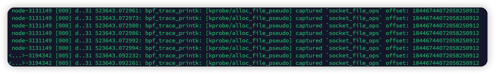

上一篇文章讲了eBPF Tracepoint和Kprobe，这一篇文章我们来看一下如何应对无BTF的老版本内核，以及如何只使用fd寻找关联的socket结构。

这篇文章的大背景，是需要关联fd、socket结构体指针，以便能够在hook系统调用时，通过fd找到对应的五元组信息。但是问题就在于，尝试了众多方法来关联上述的数据，甚至hook了十几个内核函数，希望包围socket的全生命周期，但是最终都出现了意料之外的结果，非常棘手。

# GPT4的灵感

> Using BTF (BPF Type Format) and CO-RE (Compile Once, Run Everywhere), the approach to determine if a **`struct file *`** can be converted to a **`struct socket *`** involves inspecting the type information embedded in the kernel using BTF.
>
> The basic idea is to use the BTF information available at runtime to dynamically understand the type layout and relationships. Specifically, you'd check if the **`f_op`** from the **`struct file`** is the **`socket_file_ops`**.
>
> However, BTF and CO-RE primarily help with maintaining the correct structure offsets, ensuring compatibility across kernel versions. While they provide rich type information about kernel structures, they don't provide runtime data, like the address of the **`socket_file_ops`** global variable, which poses a challenge for our use case.
>
> You can try to read data from the kernel memory location **`&fdt->fd[fd]`** into your **`file`** variable in the eBPF program.

GPT3还会胡扯，现在的GPT4已经非常强大了，虽然有时候还是会一本正经胡说八道，但是用来在困境上提供灵感和方向，还是非常有帮助的。

我问GPT4如何判断`struct file *`是否是在创建`struct socket *`时跟随创建的，它告诉我可以想办法拿到内核符号中`socket_file_ops`的位置，对比一下，如果`struct file *`中的`f_op`指针指向了内核符号中的`socket_file_ops`，就可以判断是创建socket时跟随创建的。

另外，GPT4为使用fd获取file结构体提供了一种思路，即从fdt中获取，这个fd只是fdt数组的索引而已。

这两个思路在实施过程中均被验证是正确的，接下来，我们来看一看为什么可以这么做以及具体怎么做。

# 从file得到socket

抛开fd先不管，假设我们现在得到了file结构体，如何从file结构体中获取到socket结构体？

在内核代码中，有下面这么个函数，并且它还是个导出的符号，这为Kprobe打下了可能。

创建socket结构体后，会进入到这个函数中分配file结构体，成功分配file结构体后，会把socket结构体的指针放到file结构体的成员`private_data`中。因此，反推回来，如果这个file结构体是被socket结构体创建的，我们就可以直接拿它的`private_data`来用，因为它其实就是指向socket结构体的指针。

```c
struct file *sock_alloc_file(struct socket *sock, int flags, const char *dname)
{
	struct file *file;

	if (!dname)
		dname = sock->sk ? sock->sk->sk_prot_creator->name : "";

	file = alloc_file_pseudo(SOCK_INODE(sock), sock_mnt, dname,
				O_RDWR | (flags & O_NONBLOCK),
				&socket_file_ops);
	if (IS_ERR(file)) {
		sock_release(sock);
		return file;
	}

	sock->file = file;
	file->private_data = sock;
	return file;
}
EXPORT_SYMBOL(sock_alloc_file);
```

那么怎么判断file结构体就是被socket结构体创建的呢？GPT4也说了，看它的成员`f_op`即可。在上边的代码中，会再调用一个名为`alloc_file_pseudo`的函数，最后一个参数传了`socket_file_ops`的指针，这就是我们想要的东西，用Kprobe去hook这个函数，就可以拿到`socket_file_ops`在内核符号中的位置。

那么，上边这种通过hook函数参数来获取内核符号中位置的方法，是不是可以同样用在不支持BTF的内核中，用来动态分析符号的所在位置呢？答案是：可以，并且会非常有用。

回到上边的问题，接下来，就可以使用这样一个eBPF C程序去hook并且拿到`socket_file_ops`在内核符号中的位置。

```c
#include <linux/bpf.h>
#include <bpf/bpf_helpers.h>
#include <bpf/bpf_tracing.h>

struct pt_regs
{
    unsigned long r15;
    unsigned long r14;
    unsigned long r13;
    unsigned long r12;
    unsigned long bp;
    unsigned long bx;
    unsigned long r11;
    unsigned long r10;
    unsigned long r9;
    unsigned long r8;
    unsigned long ax;
    unsigned long cx;
    unsigned long dx;
    unsigned long si;
    unsigned long di;
    unsigned long orig_ax;
    unsigned long ip;
    unsigned long cs;
    unsigned long flags;
    unsigned long sp;
    unsigned long ss;
};

#ifdef DEBUG
#define debugf(fmt, ...) bpf_printk(fmt, ##__VA_ARGS__)
#else
#define debugf(fmt, ...)
#endif

struct
{
    __uint(type, BPF_MAP_TYPE_HASH);
    __type(key, __u64);
    __type(value, __u8);
    __uint(max_entries, (1 << 16) - 1);
    __uint(map_flags, BPF_F_NO_PREALLOC);
} kprobe_sock_alloc_file_map SEC(".maps");

SEC("kprobe/sock_alloc_file")
int kprobe__sock_alloc_file(struct pt_regs *ctx)
{
    __u64 tgid = bpf_get_current_pid_tgid();
    __u8 v = 1;

    bpf_map_update_elem(&kprobe_sock_alloc_file_map, &tgid, &v, BPF_NOEXIST);
    return 0;
}

SEC("kprobe/alloc_file_pseudo")
int kprobe__alloc_file_pseudo(struct pt_regs *ctx)
{
    __u64 tgid = bpf_get_current_pid_tgid();

    // 确保一定是通过 sock_alloc_file 进来的。
    __u8 *v0 = bpf_map_lookup_elem(&kprobe_sock_alloc_file_map, &tgid);
    if (v0 == NULL)
        return 0;
    bpf_map_delete_elem(&kprobe_sock_alloc_file_map, &tgid);

    void *fops = (void *)PT_REGS_PARM5(ctx);

    debugf("[kprobe/alloc_file_pseudo] captured `socket_file_ops` offset: %lu", (__u64)fops);
    return 0;
}

char __license[] SEC("license") = "Dual MIT/GPL";
```

编译，加载，即可看到成功捕获到了`sock_alloc_file`的位置。



# 从fd得到file

GPT4告诉我，可以去fdt中，使用fd作为索引，找到file结构体。那么这个fdt长什么样？如下代码中，fdt就是fdtable，`max_fds`表明了当前fdtable中存放了多少fd，`struct file __rcu **fd`即为存放file结构体指针的列表。

```c
struct fdtable {
	unsigned int max_fds;
	struct file __rcu **fd;      /* current fd array */
	unsigned long *close_on_exec;
	unsigned long *open_fds;
	unsigned long *full_fds_bits;
	struct rcu_head rcu;
};
```

再来看看fdtable存在于哪里。如下代码中，fdtable还会存在于files_struct结构体中。

```c
struct files_struct {
  /*
   * read mostly part
   */
	atomic_t count;
	bool resize_in_progress;
	wait_queue_head_t resize_wait;

	struct fdtable __rcu *fdt;
	struct fdtable fdtab;
  /*
   * written part on a separate cache line in SMP
   */
	spinlock_t file_lock ____cacheline_aligned_in_smp;
	unsigned int next_fd;
	unsigned long close_on_exec_init[1];
	unsigned long open_fds_init[1];
	unsigned long full_fds_bits_init[1];
	struct file __rcu * fd_array[NR_OPEN_DEFAULT];
};
```

那么files_struct结构体还会存在于哪里呢？再找下去就变得有意思起来了，它还会存在于task_struct结构体中，对没错，就是在那个Linux最小调度单元task中。

如下代码，就是task_struct结构体的定义，这个结构体相当之大，而且有非常多的条件编译，存放了task的命名空间、文件、内存管理、锁、CPU亲和性、cGroups等信息，更重要的是，它可以直接通过`bpf_get_current_task()`函数获取。

```c
struct task_struct {
	// ... 省略
	struct files_struct		*files;
  // ... 省略
};
```

files_struct结构体和fdtable结构体的定义都比较稳定，不能使用eBPF CORE的情况下，我们可以直接使用pahole分析位置（详见上一篇文章），但是task_struct结构体怎么办？这么大的结构体，Linux一个小更新就可能会引起成员位置变化，没有eBPF CORE的加持下，如何解决？上边这些逻辑，我们就可以把它整理成eBPF C的一个函数（如下代码），`files_offset`参数即为files_struct结构体在task_struct结构体中的位置，后文的逻辑我们再细讲这个`files_offset`究竟从何而来。

下方代码中`bpf_check_and_probe_read`为一个宏，定义请看上一篇文章。

```c
static __inline struct file *try_get_file_from_fd_and_offset(struct task_struct *task, int fd, int files_offset)
{
    struct file *file = NULL;
    struct files_struct *files = NULL;

    // 先得到files_struct结构体在task_struct中的偏移量，即指针的位置。
    struct files_struct *files_ptr = (struct files_struct *)((__u64)task + (__u64)files_offset);
    // 尝试读一下，读指针中指向的位置，即最终files_struct的地址。
    if (bpf_check_and_probe_read(&files, sizeof(files), files_ptr) < 0)
        return NULL;

    struct fdtable *fdt = NULL;
    // 使用pahole分析得到结果：struct fdtable *           fdt;                  /*    32     8 */
    // 尝试读一下files_struct中的fdt的位置，得到fdtable结构。
    if (bpf_check_and_probe_read(&fdt, sizeof(fdt), (void *)((__u64)files + 32)) < 0)
        return NULL;

    // 获取最大的fd数量。
    unsigned int max_fds;
    if (bpf_check_and_probe_read(&max_fds, sizeof(max_fds), &fdt->max_fds) < 0)
        return NULL;

    // 检查fd是不是已经多于最大的fd数量了。
    if (fd < 0 || fd >= max_fds)
        return NULL;

    // fdt中的fd就是个指针数组。
    // 尝试读取fd数组中的fd位置，得到file结构体。
    struct file **file_base = NULL;
    if (bpf_check_and_probe_read(&file_base, sizeof(file_base), &fdt->fd) < 0)
        return NULL;

    // 指针加法，得到fd对应的file结构体，这里的加法会自动*8。
    if (bpf_check_and_probe_read(&file, sizeof(file), file_base + fd) < 0)
        return NULL;

    return file;
}
```

# 推算task_struct中的files_struct

上文中，我们在从file得到socket时，使用了一种通过kprobe动态分析符号位置的方法，但是很可惜，它在推算**task_struct结构体中的files_struct结构体位置**的过程中并不适用。为什么呢？因为task_struct结构体中的files_struct结构体存在形式是指针，并且内核中没有传递该指针的指针的函数，因此，通过kprobe只能拿到指针指向的位置，拿不到task_struct结构体中files_struct结构体指针的位置。

从内核层面解决这个问题，有办法，但是都有足够的侵入性。要么魔改内核，定义并实现一个新的BPF call，能够用来获取这个场景中的结构体中成员；要么为内核加一个kmod，通过kmod的kprobe来计算当前内核中task_struct结构体中指定成员的位置，并且提供一个函数供eBPF的kprobe来hook。但是这两种办法都有一定的侵入性，而且可能会造成不稳定因素，并不好推行。

那还有别的办法吗？有，人工适配，属于下下策了。为适配没有BTF信息的内核，我写了一个工具，可以使用这样一个非常安全的内核模块，自动计算出位置并且输出到内核日志上，并且只需要执行一次就可以卸载，链接如下。

[https://github.com/ic0xgkk/where_are_my_files](https://github.com/ic0xgkk/where_are_my_files)

内核模块载入后，即可在内核日志上得到如下这样的输出，在所有需要特殊支持的内核中载入一遍该模块，即可维护出一个位置列表。

```bash
# dmesg | grep files_struct
[   33.279208] files_struct offset: 2848, task_struct size: 13504
```

再来看看socket结构体的定义。

```c
struct socket {
	// ... 省略
	struct file		*file;
	// ... 省略
};
```

可以看到，socket结构体中也有一个file，因此，我们就可以使用上方维护的列表，暴力循环验证所有的位置能不能正常读出file结构体，再尝试从file结构体中获取socket结构体，再尝试从socket结构体中获取file结构体，只要前后两个file结构体的指针指向了同一个内存地址，那么就可以认为当前循环验证的这个位置是正确的。

```c
static __always_inline void try_get_files_offset_from_task_struct(int fd)
{
    int files_offset_array[] = {2848};

    struct task_struct *task = (struct task_struct *)bpf_get_current_task();

#pragma unroll
    // 暴力尝试，直到找到为止。
    for (int i = 0; i < sizeof(files_offset_array) / sizeof(int); i++)
    {
        struct file *file = try_get_file_from_fd_and_offset(task, fd, files_offset_array[i]);
        if (file == NULL)
            continue;

        // 从file的private_data中获取socket。
        struct socket *socket = get_socket_from_file(file);
        // 如果不是socket创建的file，或者获取失败，就结束。
        if (socket == NULL)
            continue;

        struct file *file_tmp = NULL;
        // 读socket指针中file指针的位置，注意读它的指针的内容，不是读file的内容。
        if (bpf_check_and_probe_read(&file_tmp, sizeof(file_tmp), &socket->file) < 0)
            continue;

        // 如果socket中的file和上文的file是同一个，就说明找到了正确的offset。
        if (file_tmp != file)
            continue;

        __u64 off = files_offset_array[i];
        debugf("captured files from task_struct offset: %lu", off);
        return;
    }
}
```

# 总结

通过上文从file得到socket，再到从fd得到file，再到推算task_struct中的files_struct，我们已经成功能够从`bpf_get_current_task()`返回的task_struct中获取到fd的file、socket，而五元组信息，就存在于socket结构体及其成员中，接下来的操作就非常简单了，开发工作也就可以继续推进了～
