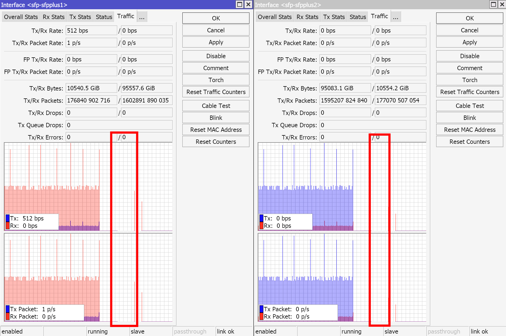

# 背景

机房有一台H3C的路由器，它同时负责接入和三层路由。今年偶然在传文件的时候发现速度奇慢，排查发现瓶颈在这台路由器，三层转发大包（SSH传文件）只有90Mbps左右了，转发率就不用算了吧，然后看路由器的control-plane和data-plane的负载都被打满了，应该是没走成交换芯片（快速路径），全部走CPU（慢速路径）处理去了。更重要的是，这台机器并没有使用ACL、VRF这种比较难offload的功能，如今掉速这么严重，不知道是触发了哪门子bug，再加上系统全部是黑盒，在没有购买官方支持的情况下，基本没有解决这种问题的可能了。

在这里我就想吐槽一下了，这是H3C的设备性能测试数据：


这是某拉脱维亚小厂的设备性能测试数据：


只能说定位的用户群体确实很不相同了。H3C给的如此模糊的测试数据，直接导致了看着数据很好，但是实际上是实验室条件下测得的非常、非常、非常理想的结果，要满足规则全部能offload到交换芯片上，才能达成如此高的转发率，但是问题是用户的需求是多样性的，很可能一个刚需、又不起眼的配置，就会导致所有流量offload失败，这时候随便一台200元的家用路由器来就可以把H3C上千的机器秒掉了。

问题出现了并不是最糟糕的，毕竟可以尝试解决问题，而H3C文档只给如何使用，再细节一些的offloading、交换芯片、packet flow相关的内容完全没有，社区又很难解决这类问题，导致遇到这种冷门问题时几乎没有自己排障解决的可能，直线拉升后期使用成本。

基于这个背景，决定逐步撤下现有机房的H3C设备，改换方案。

# 需求点

- 满足网络需求
    - 三层路由（少量南北向+大量东西向）
    - BGP和ECMP（等价路由）
    - PBR（策略路由）
    - ACL（访问控制）
- 控制PUE
- 高ROI
- 便宜

# 方案一

使用现有旧路由器设备做纯二层交换机用（全部走快速路径），利用现有的旧机架服务器安装VPP+DPDK，并使用binapi开发单独的控制面和CLI，以便于使用。

## 可行性验证

### 平台信息

操作系统信息如下。

```bash
Operating System: Ubuntu 22.04.4 LTS 
Kernel: Linux 5.15.0-105-generic
Architecture: x86-64
Hardware Vendor: HP
Hardware Model: HP EliteDesk 880 G6 Tower PC
```

CPU调度策略如下。

```bash
analyzing CPU 6:
  driver: intel_pstate
  CPUs which run at the same hardware frequency: 6
  CPUs which need to have their frequency coordinated by software: 6
  maximum transition latency: 4294.55 ms.
  hardware limits: 800 MHz - 4.40 GHz
  available cpufreq governors: performance, powersave 
  current policy: frequency should be within 3.20 GHz and 4.40 GHz.   
                  The governor "performance" may decide which speed to use
                  within this range. 
  current CPU frequency is 4.20 GHz.
```

CPU：Intel(R) Core(TM) i3-10105 CPU @ 3.70GHz（核心已隔离，专用于网络处理）

内存：Kingston 9905701-017.A00G 2667 MT/s

网卡：

- Mellanox MCX512A（Pktgen打流）
- Intel X520-DA2（VPP转发）

### 测试拓扑


### 打流方向

Pktgen打流 → Mellanox卡0号口 → Intel卡0号口 → VPP转发 → Intel卡1号口 → Mellanox卡1号口 → Pktgen接收统计

### 测试内容

每个方向只配置一条流（5元组相同，即为两条连接），并配置VPP的ABF功能，搜索的ACL中每个方向包含2个32位的主机路由，确保打的流能够匹配到这个ACL并完成策略路由转发到另外一个端口。

### 测试数据-ABF

**⬇️单向**


**⬇️双向**


### 数据测试-路由

**⬇️单向**


**⬇️双向**


## 结论

可行。

2个核心，ABF极限转发率到9.2Mpps，路由极限转发率到8.7Mpps，按照10Gbps线速、1500字节MTU计算，这个转发率仍然可以打满线速，并且实现这一效果，只用到了2个CPU逻辑核心，如果启用网卡多队列和RSS，并配置更多的CPU核心，这一数据可以再增长。

对比MikroTik CCR2004-16G-2S+和MikroTik RB5009两个机器的Routing（fast path）性能数据，直接秒杀两台官方机器。


# 方案二

考虑到三层路由、BGP和ECMP主要用在内网核心，PBR、ACL主要用在公网出口，因此设备的职责可以更加细分。

内网核心只需要在data-plane负责VLAN终止、三层路由，control-plane负责动态路由，这些都是可以被交换芯片offload的，可以保证最大头的东西向流量以最高效率处理。

公网出口则需要负责PBR、ACL，这两个功能就很难被交换芯片offload，换到一些智能网卡上，也需要快速路径和慢速路径协同处理才能实现，即状态留在慢速路径，连接offload到快速路径，在一些corner case下仍然会存在一些问题。因此这类比较灵活的功能，不如直接拿CPU跑，完全抛弃掉硬件加速，反而会更容易跟随需求变化。

因此，内网核心使用交换芯片功能比较多的硬件交换机，此处选型MikroTik CRS系列交换机，只考虑DX2000/DX3000/DX8000系列交换芯片的机型，满足需求并且价格足够低。公网出口使用纯CPU处理，此处选型MikroTik RB450Gx4，PBR会导致fast track失效，全走慢速路径的话，由于公网出口量不大，并且也不会全部都是单流，因此也够用。


## 可行性验证

### 平台信息

Pktgen的机器和方案一中的相同。

交换机信息如下。

```bash
[admin@MikroTik] > /system/routerboard/print 
       routerboard: yes
             model: CRS326-24G-2S+
     firmware-type: dx3230L
  factory-firmware: 3.43
  current-firmware: 7.14.3
  upgrade-firmware: 7.14.3
```

### 测试拓扑


### 打流方向

Pktgen打流 → Mellanox卡0号口 → MikroTik交换机0号口 → L3 Hardware Offloading → MikroTik交换机1号口 → Mellanox卡1号口 → Pktgen接收统计

### 测试内容

每个方向只配置一条流（5元组交叉，即为一条连接的tx/rx），并配置如下内容：

- Bridge VLAN FIlter（802.1q），2个VLAN
- Bridge Ingress Filter
- DHCP Snooping
- 2条直连路由，2条静态路由

最终，流量将会从交换机0号口进入，归属VLAN 2，并进入三层路由，路由到VLAN 3，从交换机1号口出。

### 测试数据-WithOffloading

**⬇️Pktgen端**


**⬇️交换机端**


### 测试数据-WithoutOffloading

**⬇️Pktgen端**


**⬇️交换机端**

关了L3 Hardware Offloading后，转发率一下子掉到了60kpps，全走慢速路径后直接把CPU打满了，以至于WinBox的连接都卡住了，所以下图这一段没数据了。



## 结论

可行。

会特别依赖交换机的交换芯片，offload失败的话就走慢速路径，转发率会掉到60kpps，按照1500字节MTU计算，只能打到680Mbps的线速，直接拉跨。但是一旦offload成功，转发率会上到15Mpps左右，秒杀xxxx，性价比爆炸。

# 对比选型

选方案二，30W的功耗就可以搞定，现有的设备+采购一台新机器，即可快速上线。方案一ROI、能效比低，也不利于控制PUE。

# 额外补充

- 交换机注意散热，打流测试发现MikroTik的交换机很容易积热，温度会上到70度以上，会大幅提高机器故障率。
- DX3000系列交换芯片不支持fast track，所以firewall的mangle表只要有规则，offload就会失效，转发率就掉下来了。
- UDP如果单向打流不回包的话，offload不会成功，必须对端也回复一个包，才会offload下去走快速路径，这跟我之前用的智能网卡一模一样，在conntrack的角度上必须成一条flow才可以下发下去，它并不是直接下发路由表在交换芯片内路由的（不确定实际上是不是这个技术原因）。但是，如果接口不配置Bridge VLAN Filter，直接分别在两个接口配置两个子网做路由的话，就可以把路由表下发到交换芯片内。

结合我看MikroTik的文档，我现在觉得MikroTik的交换机有两台最有性价比：

- 只做三层路由不配firewall规则的话，选CRS326-24G-2S+。芯片是DX3000系列，不支持fast track，但是不配规则的情况下，flow可以被offload下去，L3小包可以打满10Gbps的线速，有16Mpps的转发率。
- 做三层路由并且配firewall规则的话，选CRS309-1G-8S+。芯片是DX8000系列，支持fast track，可以配置firewall规则，这样首包和后续随机包走慢速路径维护状态和过firewall，其他的就可以全走快速路径，这样就可以把NAT打到线速，firewall规则也可以保证生效。

# 参考资料

- [L3 Hardware Offloading](https://help.mikrotik.com/docs/display/ROS/L3+Hardware+Offloading)
- [Switch Chip Features](https://help.mikrotik.com/docs/display/ROS/Switch+Chip+Features)
- [Bridging and Switching](https://help.mikrotik.com/docs/display/ROS/Bridging+and+Switching#BridgingandSwitching-BridgeHardwareOffloading)
- [Packet Flow in RouterOS](https://help.mikrotik.com/docs/display/ROS/Packet+Flow+in+RouterOS#PacketFlowinRouterOS-FastTrack)