# 前言

在上一篇文章中，我准备使用 MikroTik RB450Gx4 做出口网关，这样 CRS326 做一个弱三层的角色，用交换芯片抗东西向流量，南北向的给这台 RB450Gx4，直接用 CPU 跑。

新买的 RB450Gx4 到货了，投入使用前拿来测一下，看看和官方的数据差多少，摸个底。

# RB450Gx4 without Bridging

## 测试拓扑

RB450Gx4 不使用 Bridge，单纯在两个接口间路由。

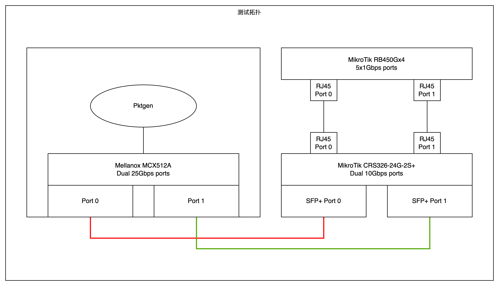

## 打流方向

Pktgen打流 → Mellanox卡0号口 → CRS326 SFP+ Port 0 → 二层交换 → CRS326 RJ45 Port 0 → RB450Gx4 RJ45 Port 0 → 三层路由 → RB450Gx4 RJ45 Port 1 → CRS326 RJ45 Port 1 → 二层交换 → CRS326 SFP+ Port 1 → Mellanox卡1号口 → Pktgen接收统计

## 测试数据

⬇️Pktgen端

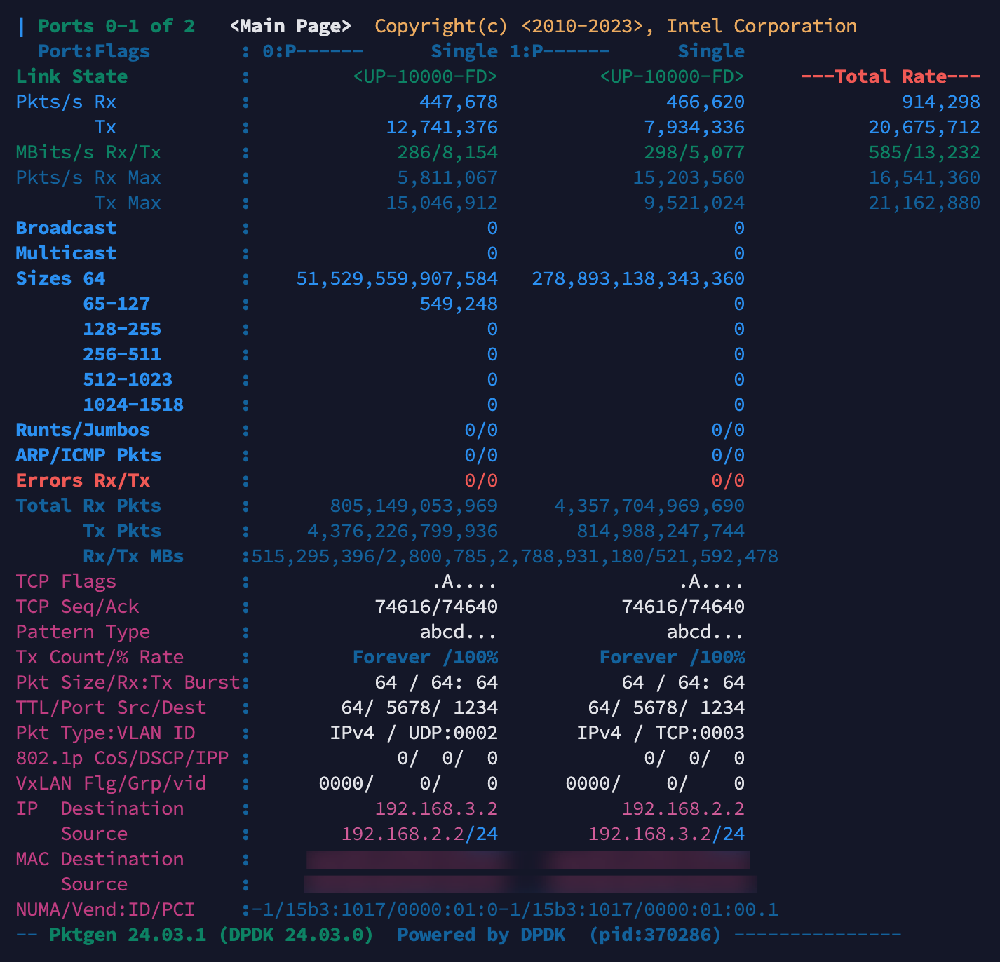

⬇️RB450Gx4端

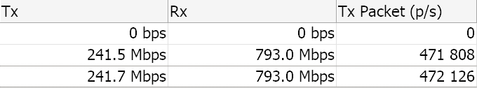

## 总结

**⬇️**在 28 度温度、76% 湿度的房间中，这玩意竟然不怎么积热，测了10 分钟温度稳定在 35 度。

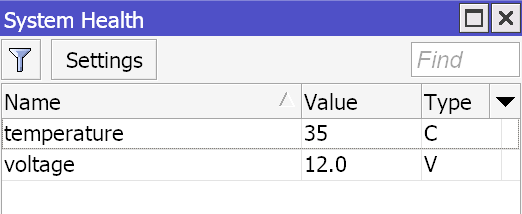

⬇️难怪温度这么低，竟然才跑满了一个 CPU 核心？？？真一核有难，三核围观？

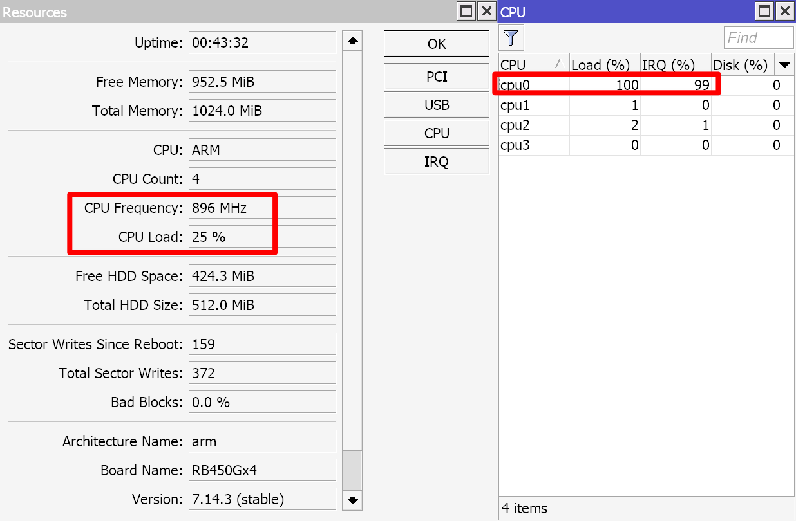

⬇️所有的接口的收发队列的 irq handler 都挂到 CPU 0 去了，难怪不论几条流都只有 900 多 Kpps。理论上这个 CPU 可以扛住 3600Kpps 左右的转发率，也就是大概3.6Mpps，但是 edma irq 的 CPU 核心不给改，所以也没办法了。只能说这个 CPU 有潜力，不 Docker 拉几个容器可惜了，更何况这机器还是 1G 运行内存。

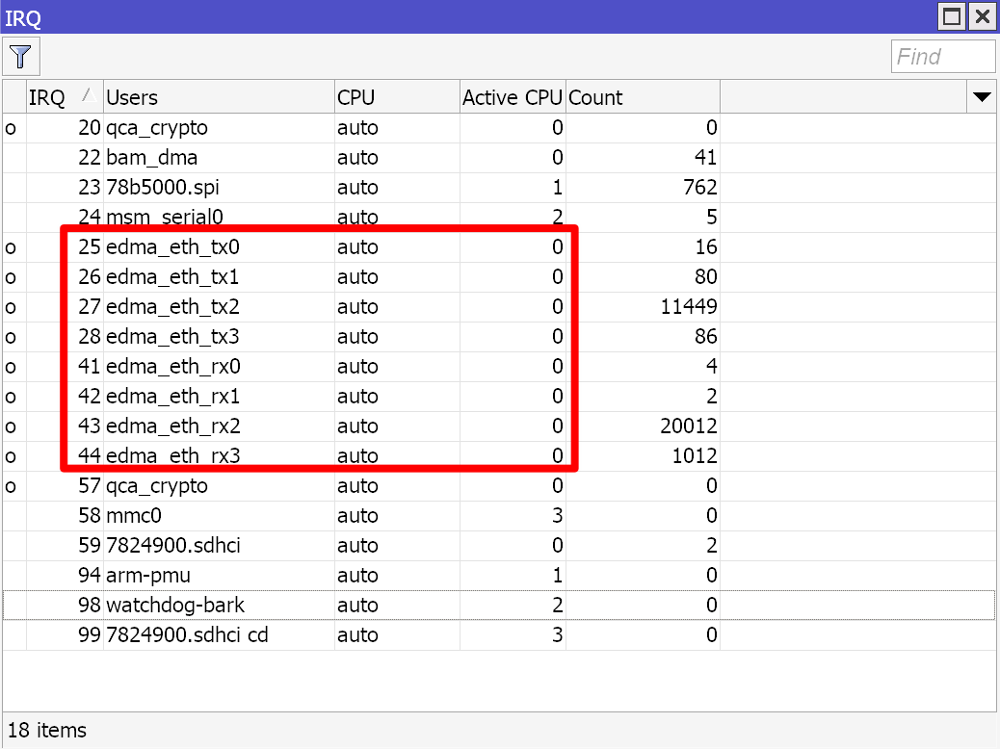

**⬇️**但是这和官网的14Mpps 差的有点远吧？官方的 Routing none (fast path)转发率都和 Bridging none (fast path)持平了，难道要把两个口桥起来测？

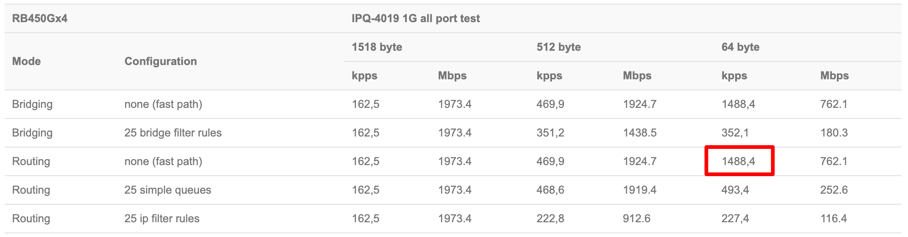

# RB450Gx4 with Bridging and VLAN Filter

## 背景

上边测出来了 900 多 Kpps，但是发现离官方的数据差了十万八千里，看 Bridge Fast Path 没数据，难不成真要在 Bridge 里才行？但是我记得这交换芯片也没啥硬件特性啊？难道 MikroTik 有什么外星科技？

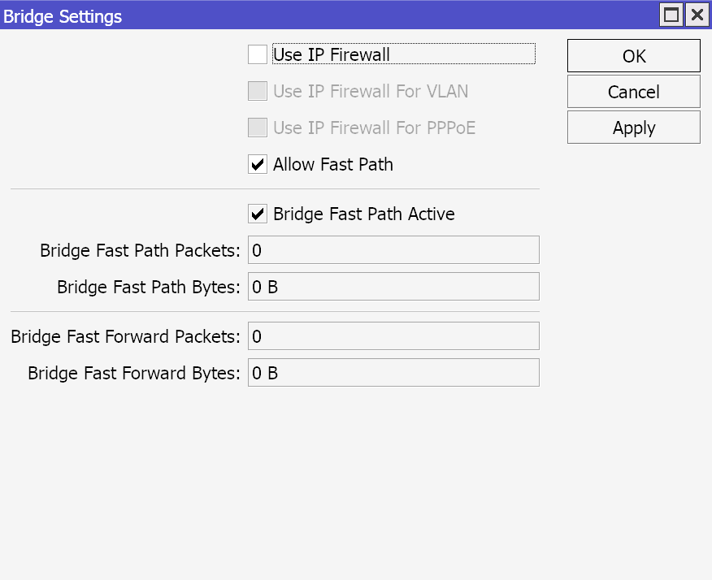

## 测试拓扑

RB450Gx4 使用 Bridge，并且开 VLAN Filter，两个接口分别归属到不同的 VLAN，通过系统中的 VLAN 接口在三层路由。

## 打流方向

Pktgen打流 → Mellanox卡0号口 → CRS326 SFP+ Port 0 → 二层交换 → CRS326 RJ45 Port 0 → RB450Gx4 RJ45 Port 0 → 系统 Bridge → 系统 VLAN2 接口 → 三层路由 → 系统 VLAN3 接口 → 系统 Bridge → RB450Gx4 RJ45 Port 1 → CRS326 RJ45 Port 1 → 二层交换 → CRS326 SFP+ Port 1 → Mellanox卡1号口 → Pktgen接收统计

## 测试数据

⬇️拉了一个 Bridge，开着 VLAN Filter，现在确实有 Fast Path 的统计了。

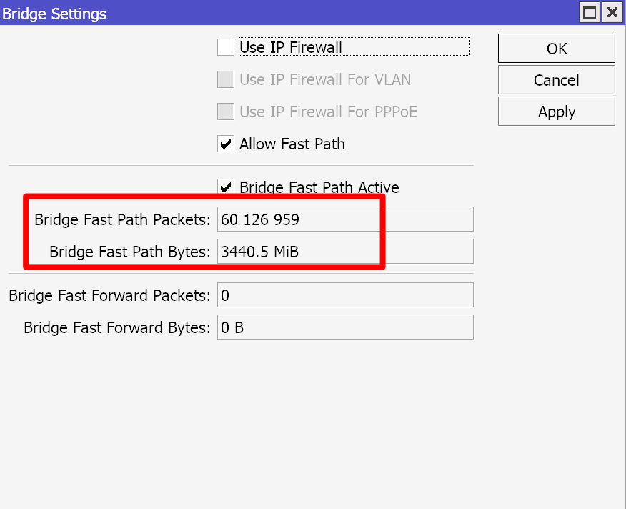

⬇️但是测试数据看起来更拉跨了。

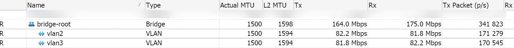

⬇️Pktgen 端只剩 343Kpps 了，这还玩什么。

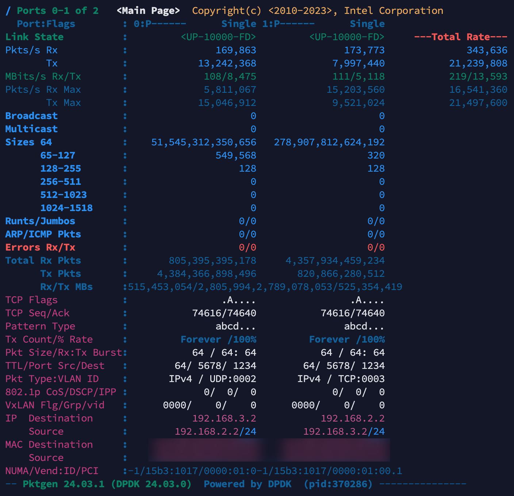

# RB450Gx4 with Bridging only

这样的模式说白了就成旁路由了，难不成这样测才会有加成？这种情况下，RB450Gx4 两个参与测试的口全部在一个桥下，桥不开VLAN FIlter，系统路由加一条路由让它重新路由回 Bridge 中，只是从另外一个口发出去，这里就不贴拓扑了。

## 测试数据

⬇️还是打满。

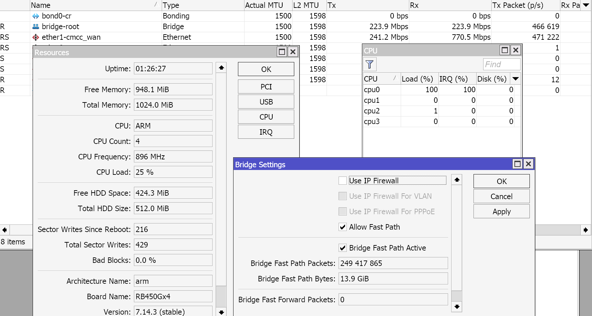

⬇️即便是有 Bridge Fast Path，单核的 Bridging 还是最高的，即便去掉这部分的消耗，再算上 4 核心真能拉满，离 14Mbpps 也差太远了吧？

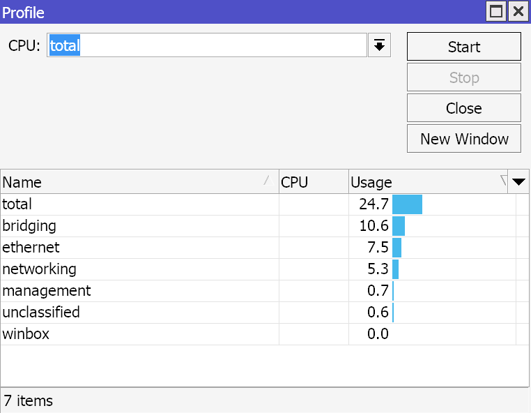

# 参考hAP ac2

⬇️这个数据就正常多了，大概 1.4Mpps，但是 RB450Gx4 和 RBD52G 的 CPU 我记得差不多啊？

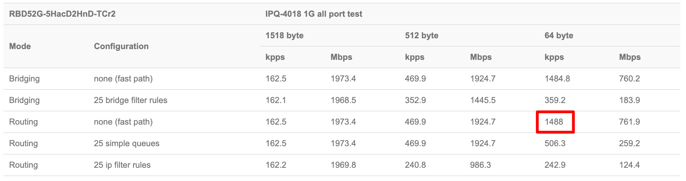

⬇️再看看 RB450Gx4 的数据，好吧，Mbps 是对的，kpps 的数据小数点标成了逗号，于是 1.4Mpps 就成了 14Mpps，就翻了十倍，好吧，官方还能犯这么低级的错误。

# 总结

如果按照 914kpps 的转发率来算，以 1.4Mpps 为基准，达成率大概 65%，中规中矩吧，这机器本来也没啥交换芯片特性，纯拿 CPU 单核跑出来了 914Kpps，还有 3 个核心在观望，不如超个频跑 Docker 算了。

如果按照大包 1500 字节来算，这个机器单核可以打到 10Gbps 以上的速度，远超交换芯片到 CPU 的带宽，拉满应该问题不大了，在我这个场景用用，甚至配置点规则都很够用。

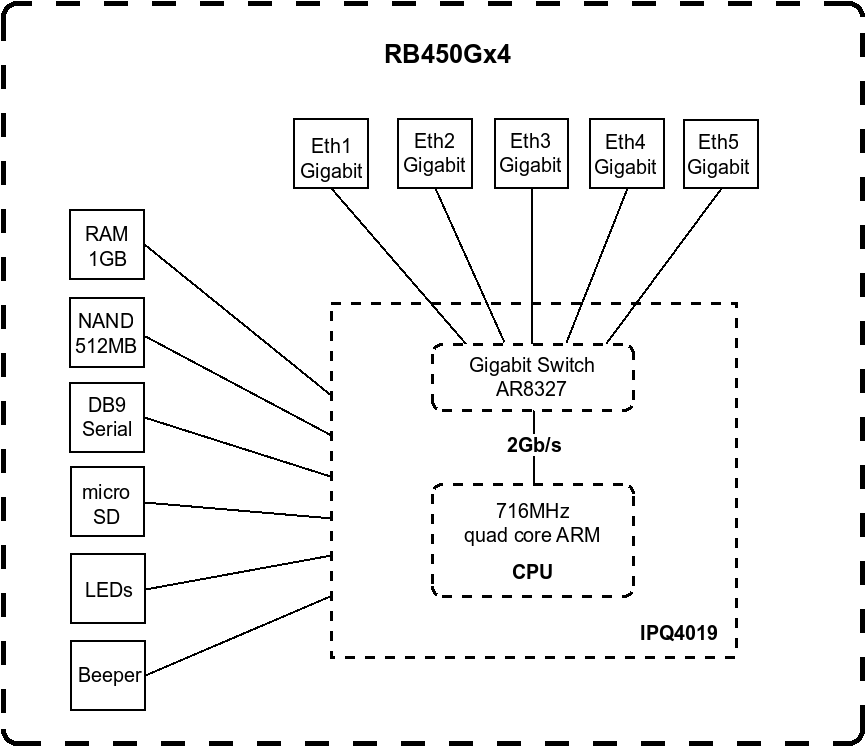
