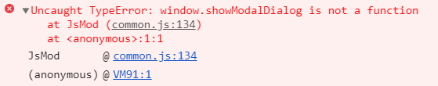
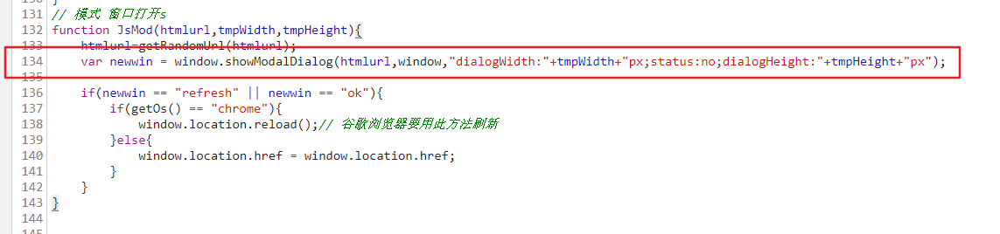
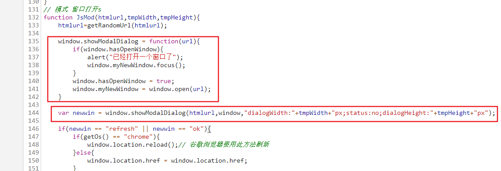
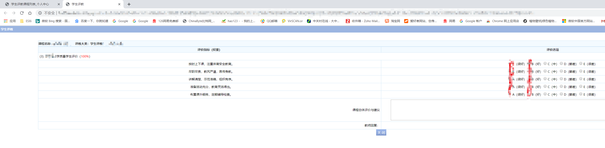

---
aliases:
- /archives/215
categories:
- 问题解决
date: 2019-06-21 02:24:30+00:00
draft: false
title: 强智教务系统无法评教解决办法
---

教务系统对于弹出窗口使用的是showModalDialog这个方法，然鹅这个方法的接口是微软在IE4时引入的，新浏览器在更新后绝大多数都已经不再支持这个接口了。因此也就导致了点击没有反应的问题，根本就没有这个方法啊怎么给你弹😂??


图1. 无响应的图。点击这里后会没有反应


图2. 错误提示。Console中也很直观地显示了没有这个函数

如图1和2，点击评教后不会有任何反应，在Console中可以看到这个错误提示。当然，我们也不可能去专程安装一个XP去使用老版本地IE，这样过于麻烦。可以试试下边给出地方法，使用Chrome或者Firefox都可以。

如图2，提示在common.js 的第134行有错误，直接点击这个common.js即可开始浏览代码。


图3. 代码。问题代码就在这一行

此时，把下面的代码复制到134行前，使其成为图4的样子，然后按下Ctrl+S保存一下，再去点击评教，就可以点开了。但是记得，这个js是本地修改了的，刷新页面后如果js被更新的情况下，还是需要再次手工修改一遍才行。

```js
window.showModalDialog = function(url){ 
    if(window.hasOpenWindow){  
        alert("已经打开一个窗口了");
        window.myNewWindow.focus();  
    }  
    window.hasOpenWindow = true;  
    window.myNewWindow = window.open(url);  
} 
```


图4. 修改后的代码。记得Ctrl+S保存


图5. 效果图。已经可以点开评教了


图6. 评教成功

如图5，点击后已经成功弹出评教窗口了，评教后如图6，在上一页上刷新后也已经显示评教成功了。

使用Edge或者Firefox的话，原理都差不多，也是修改js即可，就不多说啦