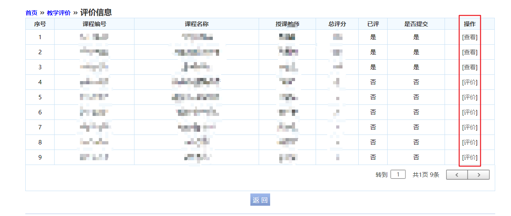
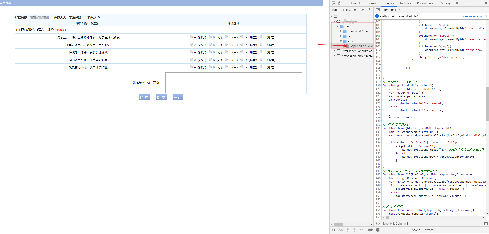
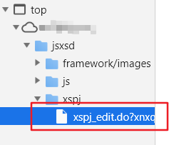
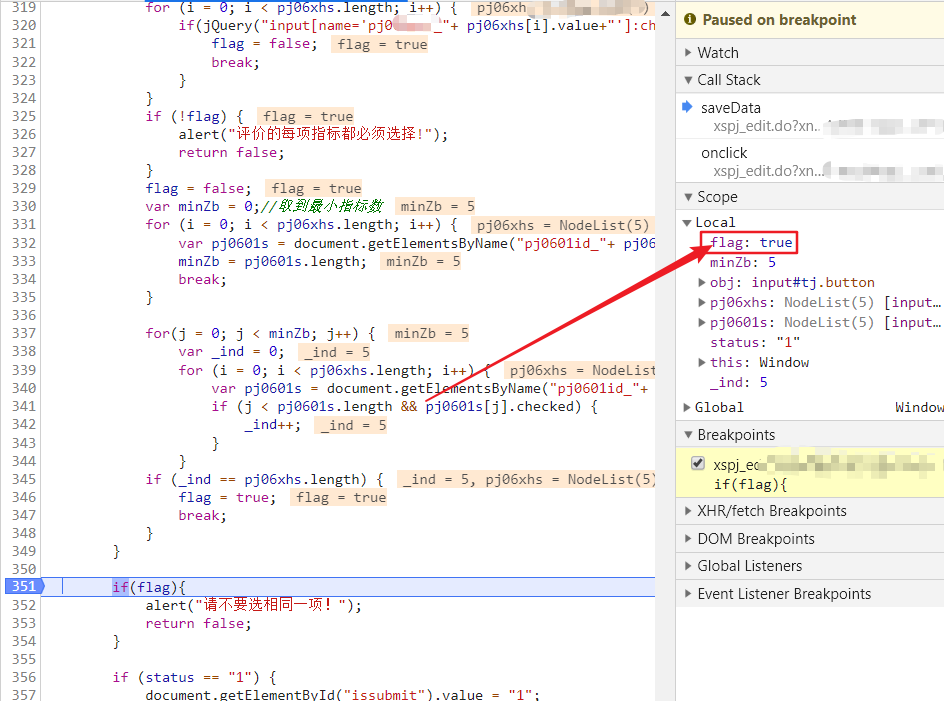
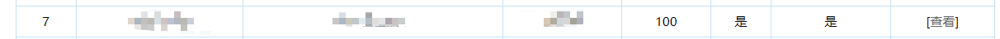

---
aliases:
- /archives/225
categories:
- 问题解决
date: 2019-06-21 04:51:33+00:00
draft: false
title: 强智教务系统评教给满分的方法
---

教务系统限制评教的五个选项不能选择同一项，也就意味着评教最多只能给到95分，每个等级对应的分数我并不太清楚，总之就是给不了100就是了。但是这个判断逻辑是在前端的，所以，你懂。

此处推荐使用Google Chrome浏览器。然后打开教务系统的评教

图1. 评教页面

如图1，首先你会发现点击评价按钮是没反应的，这个是因为教务系统代码太古董导致的，解决办法详见我上一篇博文。在打开评教页面后，按下F12，侧边会弹出如图2的调试页面。

图2. 调试页面

**在打开调试页面后切换到箭头指向的那里，发现好像是错的，刷新一下在重新点进去就对了。务必需要对比一下，如果内容不一致的话需要刷新一下再重新点进去。**

图3. 刷新后的页面文件

如图3，我刷新后再次点进去xspj中，对比这个文件和当前页面内容已经一致了。然后就可以开始下边的操作了。

图4. 判断

如图4，找到351行，这里有一个判断逻辑，由于好像并不能直接像js那样修改，因此此处要在351行点个断点以便进行调试。断点点上后行号就会变成如图中的蓝色箭头。

紧接着评教，全部选A，然后点击提交，此时你的页面上方会显示出来图5中的断点提示，此时再看侧边的调试窗口，侧边已经把实时变量显示出来了

图5. 断点提示

图6. 侧边的调试窗口

紧接着，把图中箭头处的flag中的true改成false，然后回车确定，再点击图5中的蓝色的那个继续箭头继续执行。此时这个验证就跳过了直接弹出是否提交的确认框。确认即可

图7. 评教成功

如图7，回到上一页后刷新一下，评教结果就出来了，可以看到已经OK了。

满分操作~~~