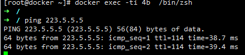

---
aliases:
- /archives/242
categories:
- Docker
date: 2019-09-20 12:57:35+00:00
draft: false
title: Docker配置容器网络和容器
---

本篇文章介绍如何使用Docker配置网络和容器，此处我使用IPVLAN的L3模式。

## 环境

  * 系统：Fedora 29 x86_64
  * Docker：CE 18.09.8 build 0dd43dd87f
  * 网络：已经挂在汇聚，可直接引路由，可直接做IPVLAN L3路由汇总

## Docker网络

我使用的IPVLAN L3模式，该模式为实验性特性，参照官方文档，需要按照如下步骤开启实验新特性：

编辑配置文件，该文件可能不存在，直接创建即可


```bash
vim /etc/docker/daemon.json 
```


向该文件内写入如下json：


```json
{
   "experimental": true
}
```


保存后使用systemctl重启docker，进而即可开启实验功能

紧接着创建IPVLAN L3网络，


```bash
docker network create -d ipvlan \
--subnet=192.168.36.0/24 \
--gateway=192.168.36.1 \
-o ipvlan_mode=l3 ipvlan36 \
-o parent=ens160
```


上面的命令的ipvlan36为名称，随意输入即可。对于容器使用的网络，建议单独开辟出来一个子网，同时要在上联添加静态路由，即对该IPVLAN的路由进行汇总。以及，一定要添加父接口！IPVLAN没有父接口无法进行上联

经过实际测试，发现即便是IPVLAN，上游引出静态路由后，访问没有使用的IP时仍然会出环，因此一定要双向添加路由，即上游引出一条静态路由到宿主机，然后宿主机引入一条同样的路由指向blackhole以避免环路。对于路由汇总的情况下，宿主机直连的所有路由和本机要按照同样的方式双向引入子网路由以避免环路。

宿主机可以使用nmtui配置静态路由，下一条的网关配置为127.0.0.1即可

## 容器部署

先抓镜像


```bash
docker pull a980883231/centos-systemd
```


然后启动容器


```bash
docker run -it -d --privileged -v /sys/fs/cgroup:/sys/fs/cgroup:ro --name cluster_test_1 a980883231/centos-systemd:latest
```


为容器配置网络，一定要先把容器停止！！！ 一定要先把容器停止！！ 一定要先把容器停止！！ 再把容器从原本网络中脱离


```bash
docker network disconnect bridge
```


再把容器加入到新的网络中去


```bash
docker network connect --ip 192.168.36.100 ipvlan36 cluster_test_1
```


再启动容器


```bash
docker container start cluster_test_1
```


切到容器


```bash
docker exec -ti cluster_test_1 /bin/zsh
```





如上图，通了
