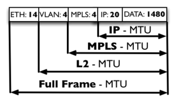

---
aliases:
- /archives/244
categories:
- 网络基础
date: 2019-07-27 10:34:04+00:00
draft: false
title: 组网雷区——MTU
---

最大传输单元（Maximum Transmission Unit，MTU）是指一种通信协议的某一层上面所能通过的最大数据包大小（以字节为单位）。MTU在布网时很容易被忽视（反正我是忽视了），以至于造成了很多奇奇怪怪的问题，经过一番研究后发现罪魁祸首在MTU的设置，总结一下原理和问题所在。

按照MikroTik官方对MTU的解释，MTU总共分为如下几种：

  * Full Frame MTU 以太网帧最大传输单元
  * L2 MTU 不含14字节以太网帧的最大传输单元
  * MPLS 我没用上，这个跳过
  * IP MTU 即L3 MTU，含IP头在内的最大传输单元

其中，上述的MTU值都是包含了协议上层封装的所有载荷计算得出的长度。也有说法讲以太网帧为 18字节的，其是包含了VLAN帧的4字节，并不为错，按照实际情况计算即可。具体如图1

在准备进入正题之前，我们需要先了解一些协议报头的长度：

  * 以太网帧 14字节
  * IP头 20字节
  * GRE头 8字节
  * SSTP头 32字节

根据IEEE 802.3中规定，以太网帧（Ethernet II）格式总共包含如下几部分：

  * 前导码，7字节，主要用于同步
  * 帧起实定界符，1字节，表示这一帧的开始
  * 目标MAC地址，6字节
  * 源MAC地址，6字节
  * 802.1Q标签（即VLAN，可选），4字节
  * 以太网类型，2字节
  * 载荷，46字节以上，即数据
  * CRC校验得到的FCS，4字节

由于以太网是无状态的，它为尽力传输，属于一种不可靠的服务方式，因此，需要通过碰撞检测来确认是否发生错误。这个碰撞检测机制全称即为CSMA/CD（Carrier Sense Multiple Access / Collision Detection，带冲突检测的载波监听多路访问技术)。

众所周知，在从网卡发送之前，数据都是数字信号，发送到传输介质时，信号为模拟信号，接收端对模拟信号进行模数转换后还原为数字信号。高频率的高低电平持续在介质中传输，在抽样量化后还原得到的数字信号即为传输的数据（暂时不考虑噪声），吉比特以太网的时钟周期为125MHZ，因此可以计算出每个比特的周期为1ns，同理，1字节的发送周期即为8ns。这些信号在介质上传输是以电的形式传输，即电荷在电场力的作用下的定向移动，因此这些信号传输的速度是光速，即 299792458米/s。信号的传输需要花费一定的时间，只是太快了我们感觉不到而已。

当两端机器同时发送数据时，会发生碰撞（应该是指传输介质中两个模拟信号相互作用），进而发觉碰撞的一端会发送碰撞信号，为了保证对端在收到碰撞信号时该帧还没有传输完成（因为传输完成后收到碰撞信号该帧就不会再重传了），需要确保每个帧持续发送了一定的时间。IEEE定义两个最远终端间的往返时间要小于512的比特传输时间，即64字节传输时间，借此来区分正常碰撞信号和异常碰撞信号。 

~~在交换设备无碎片转发的情况下，~~这些以太网碎片就会被~~丢弃~~填充。(感谢导师的指正)

根据MikroTik官方的解释，MTU指的是IP层的最大传输单元，L2 MTU才指的MAC层。因此，当L3的数据报（含包头）超出MTU后，剩余的数据就要进行分片，如果需要分片的数据设置了Dont Fragment （即DF标志），该报会直接被丢弃（no zuo no die）。如果数据（含报头）长度超过MTU，然而多出的长度刚刚好没有达到46字节的临界长度，则分片后产生了碎片，将会被丢弃。

这将会诱发上层协议持续重传，造成额外的开销，同时频繁重传会影响窗口，造成一定程度的网络波动，影响使用体验。

因此，针对我目前 IP->SSTP->SSTP->EoIP 这一情况，需要解决重传和性能问题，就要尽量确保数据不被分片，需要计算最合适的MTU。

由于SSTP依靠TCP传输，并且推荐MTU为1430，因此客户端使用服务端下发的1350 MTU，保证第一层SSTP传输单元不会超过1430。在地抵达第二层时，假定传输单元达到了最大值1430，由于SSTP是L3 VPN，因此会再度封装进IP头和SSTP头，共52字节，因此第二层封装后报文长度可能达到1482。在抵达第三层EoIP封装时，由于EoIP是L2隧道，因此会加上EoIP头，共42字节，全长1524字节。

因此，保守一些，我将每层的MTU设置如下：

  * 物理网卡，统一MTU设置为1800
  * EoIP，统一MTU设置为1680
  * 第一层SSTP，统一MTU设置为1580
  * 第二层SSTP（客户端），服务端统一下发为1350

同时，针对L2隧道，特此做了优化，给接入用的MTU统一设置为了1500，MSS控制在1460。因此，向上的EoIP的MTU直接设置为1680

按照这个方法配置完成后，再在出口处加一个TCP MSS Clamp即可，即可解决MTU问题。MTU这个问题容易被忽视，还是需要多留意一些。