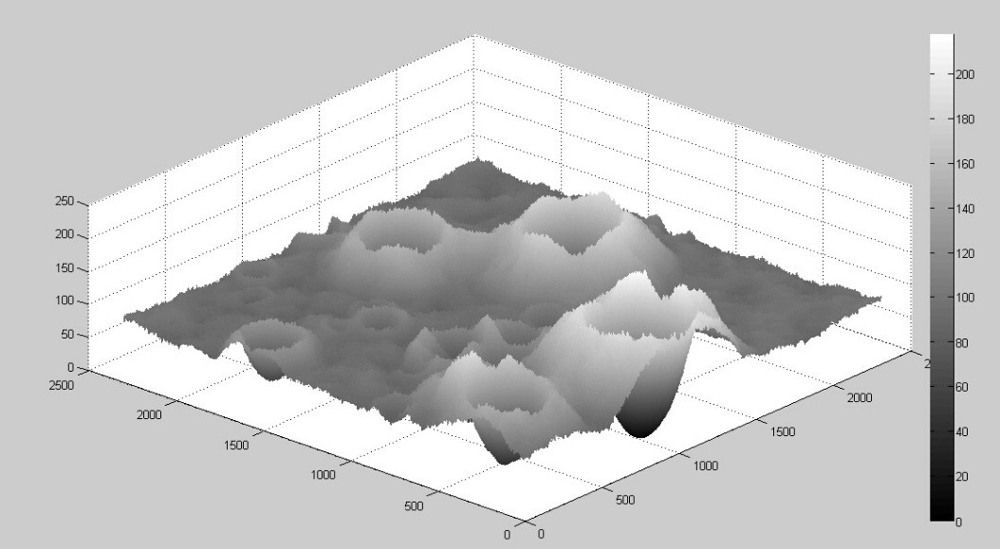
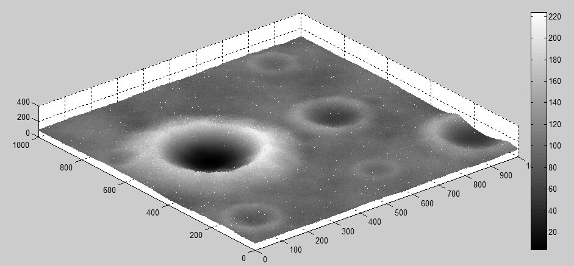
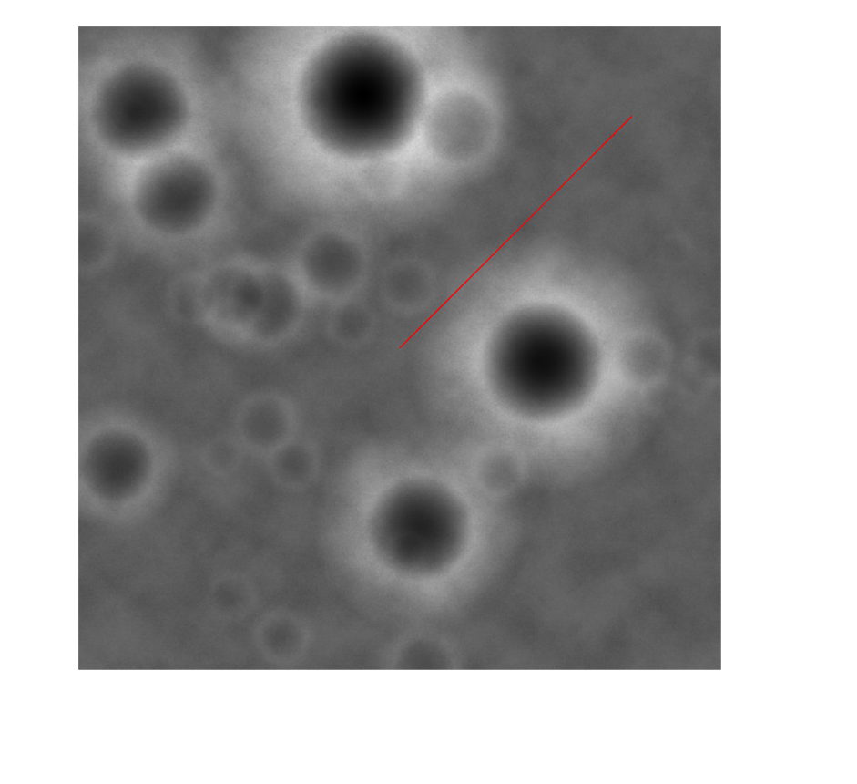
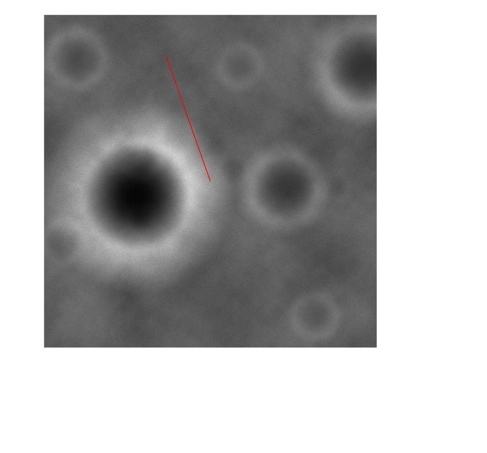
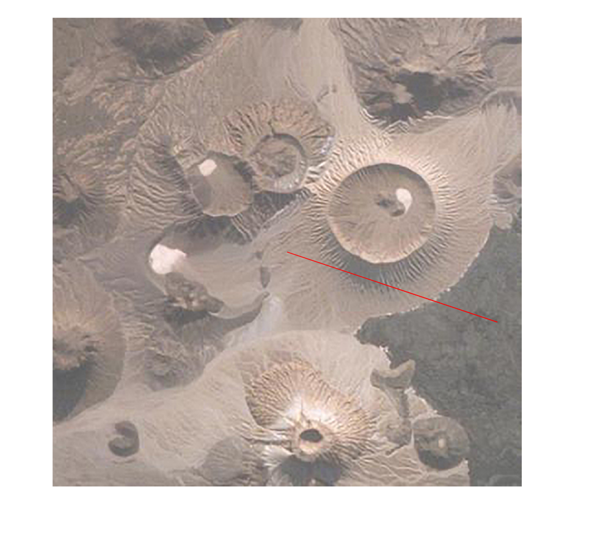
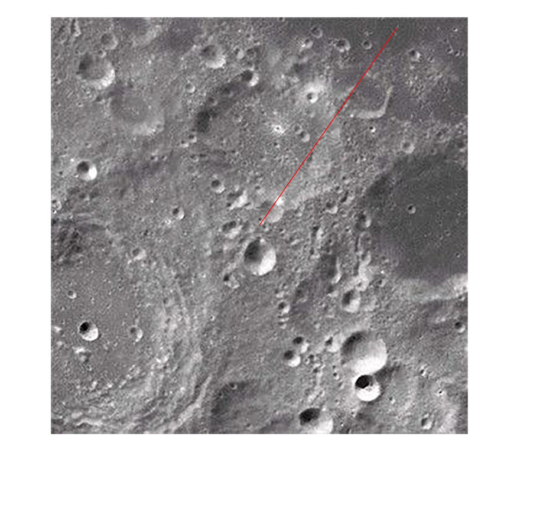
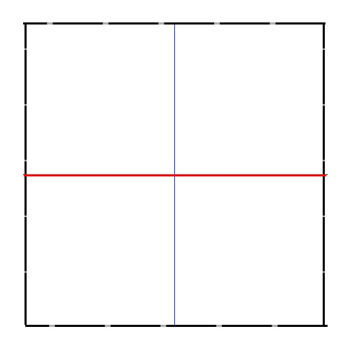
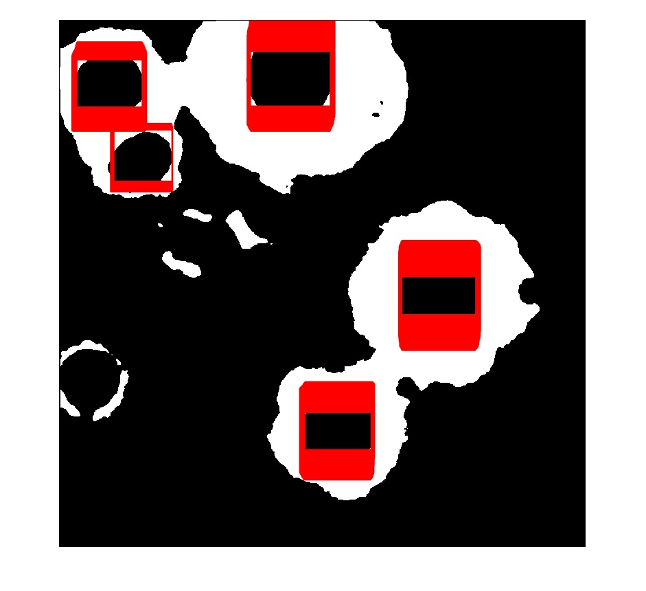
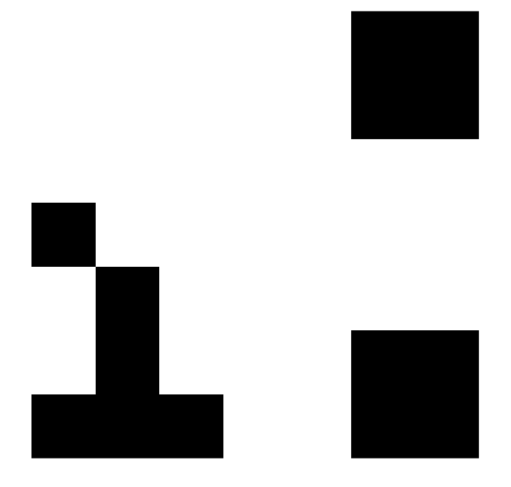

---
aliases:
- /archives/25
categories:
- 数学
date: 2018-08-21 03:25:55+00:00
draft: false
title: MATLAB月球坑识别和降落避障
---

此为全国大学生数学建模大赛2014年的A题，参加了学校的数模培训，期间第一轮模拟赛就是这个题，再加上之前有看过CNN的算法，突发奇想写了一个还还行的逻辑处理方法，没想到最后的识别效果还能够看，特此纪念下

## 题目




4）粗避障段：粗避障段的范围是距离月面2.4km到100m区间，其主要是要求避开大的陨石坑，实现在设计着陆点上方100m处悬停，并初步确定落月地点。  
嫦娥三号在距离月面2.4km处对正下方月面2300×2300m的范围进行拍照，获得数字高程如附图5所示（相关数据文件见附件3），并嫦娥三号在月面的垂直投影位于预定着陆区域的中心位置。  
  
该高程图的水平分辨率是1m/像素，其数值的单位是1m。例如数字高程图中第1行第1列的数值是102，则表示着陆区域最左上角的高程是102米。  
（5）精避障段：精细避障段的区间是距离月面100m到30m。要求嫦娥三号悬停在距离月面100m处，对着陆点附近区域100m范围内拍摄图像，并获得三维数字高程图。分析三维数字高程图，避开较大的陨石坑，确定最佳着陆地点，实现在着陆点上方30m处水平方向速度为0m/s。附图6是在距离月面100m处悬停拍摄到的数字高程图（相关数据文件见附件4）。  
该数字高程的水平分辨率为0.1m/像素，高度数值的单位是0.1m。

暂且不考虑题目要求用的高程图

## 效果

因为程序还有点小bug，卷积的边界处仅仅只依靠了题目中相等的边长长度来补全，导入非正方形的图亲测会将坐标标出边界框外……其次是暂时不支持500×500以下分辨率，多多少少会出奇怪的问题，题目中的2300×2300和100×100刚刚好没问题；以及高度太高导致坑过于密集也会对识别造成影响。  
放了个demo出来，还有bug和需要优化的地方，等后续有空再拐回来修好了。  
不多说了，上图

* 粗避障 
* 细避障 
* 测试图1 
* 测试图2 

图片的中心点对应实时航天器的位置，红色线从中心点出发，到结束处为平缓地带（没有坑的可以降落的地方）

## 处理思路

* 读入图片
* 刚开始加了滤波以除去一些噪点，后边发现去掉对坑边缘的识别效果更好，所以并不推荐对图像进行这些操作
* 大津算法对图像进行二值化处理，我们就可以得到如下这样的二值图（图1）


* 对每一行的黑色长度进行测量，测量出整个图片中所有行的黑色的长度并且统计到矩阵中，得到这样的格式 [X坐标，Y坐标，黑色长度]
* 去除低于80个像素点的长度，因为没什么用，过小的坑最后也会被处理掉，但是前期容易影响直径均值。去掉这些坑后重新构成一个新的矩阵
* 创建矩形构建边界框，如下图2，红色线即为原本的按行测量的黑色线，蓝色线为红色线在中心点旋转90度后形成，这样即可构建出一个边界框（周围的虚线），判断这四个点是否在图像中，留下在图像中的4个顶点转移到新的矩阵中  



* 判断四个点是否都为白色（旋转得到的，说明中心点肯定是黑色，四个顶点不一定是黑色，如果是黑色即为连续的图，如果为白色可断定已经标记到了坑中心），满足这个条件的再次转移到一个新的矩阵。如下图3，可以看到，没有误判，只有漏掉的（这样更好），坑越明显，其直径起到的权重越大，对均值直径影响越大，此处的均值直径也是后边用在魔改版卷积的每个单元的边长



* 按照均值直径的倍数补全二值图，并且按照均值直径的长度进行分割，分割成若干个小正方形，并且去除掉所有包含白色像素点的小正方形，如下图4，我们看到，对比原图，所有包含坑的地方已经去除



* 以正方形的形式去统计最大面积，并且只取第一个最大面积，计算出该矩阵对应的小正方形的中心位置（分奇偶边长，可能会有1个像素的误差），得到代码中的target_centre，即目标中心
* 连接图片中心和目标中心，好了，可以了

## 代码

此代码还有bug，有更好建议的朋友欢迎留言我哈哈


```matlab
clc;clear;close;
pic=imread('test.jpg');
% subplot(1,2,1),imshow(pic);
% J=ordfilt2(pic,5,ones(3,4));
% J=ordfilt2(J,5,ones(3,4)); 
% J=filter2(fspecial('average',16),J)/255;
level=graythresh(pic);
binary_img=im2bw(pic,level);
% subplot(1,2,2),imshow(binary_img);
[length,width]=size(binary_img);
% length <--> y
% width  <--> x
discontinuous_object=[];
for l = 1:length
    w=1;
    while w<(width+1)
        tmp=zeros(1,3);
        if binary_img(l,w) == 1
            w=w+1;
            continue;
        else
            blk_let=blank_length(w,l,binary_img,width);
            tmp=[w,l,blk_let];
            discontinuous_object=[discontinuous_object;tmp];
            w=w+blk_let;
        end
    end
end
[discontinuous_number,tmp_01]=size(discontinuous_object);
reliable_length=[];
for i=1:discontinuous_number
    if discontinuous_object(i,3) > 80
        reliable_length=[reliable_length;discontinuous_object(i,:)];
    else
        continue;
    end
end
[line_num,tmp02]=size(reliable_length);
reliable_matrix=[];
for i=1:line_num
    tmp_matrix=create_matrix(reliable_length(i,:),width,length);
    reliable_matrix=[reliable_matrix;tmp_matrix];
end
[remat_length,tmp03]=size(reliable_matrix);
right_matrix=[];
for i=1:(remat_length/4)
    jud_matr=reliable_matrix(i4-3:i4,:);
    if binary_img(jud_matr(1,2),jud_matr(1,1))==1&&binary_img(jud_matr(2,2),jud_matr(2,1))==1&&binary_img(jud_matr(3,2),jud_matr(3,1))==1&&binary_img(jud_matr(4,2),jud_matr(4,1))==1
        right_matrix=[right_matrix;jud_matr];
    else
        continue;
    end
end
[right_matr_length,tmp04]=size(right_matrix);
% imshow(binary_img);
% hold on;
% for i=1:(right_matr_length/4)
%    tmp_matr=right_matrix(i4-3:i4,:);
%    line([tmp_matr(1,1),tmp_matr(2,1)],[tmp_matr(1,2),tmp_matr(2,2)],'Color','r','LineWidth',1);
%    line([tmp_matr(2,1),tmp_matr(3,1)],[tmp_matr(2,2),tmp_matr(3,2)],'Color','r','LineWidth',1);
%    line([tmp_matr(3,1),tmp_matr(4,1)],[tmp_matr(3,2),tmp_matr(4,2)],'Color','r','LineWidth',1);
%    line([tmp_matr(4,1),tmp_matr(1,1)],[tmp_matr(4,2),tmp_matr(1,2)],'Color','r','LineWidth',1);
% end
% hold off;
all_len=0;
for i=1:(right_matr_length/4)
    tmp_matr=right_matrix(i4-3:i4,:);
    all_len=all_len+(tmp_matr(2,1)-tmp_matr(1,1))/2.0;
end
r=all_len/(right_matr_length/4.0);
r=round(r2); if mod(width,r)==0     matr_num=width/r; else     matr_num=ceil(width/(r1.0));
end
full_matrix=zeros(rmatr_num); for i=1:length     for j=1:width         full_matrix(i,j=binary_img(i,j);     end end % imshow(full_matrix); for i=1:matr_num     forj=1:matr_num         if ismember(1,full_matrix(((i-1)r+1):(ir),((j-1)r+1):(jr)) )            full_matrix(((i-1)r+1):(ir),((j-1)r+1):(j*r))=1;
        end
    end
end
% imshow(full_matrix);
for i=1:length
    for j=1:width
        binary_img(i,j)=full_matrix(i,j);
    end
end
centre=[ceil(length/2.0),ceil(width/2.0)];
matrix_size=[];
for y=1:length
    x=1;
    while x<=width
        if binary_img(y,x) == 1
            x=x+1;
            continue;
        else
            size_tmp=get_black_size(y,x,length,width,r,binary_img);
            matrix_size=[matrix_size;size_tmp];
            x=x+size_tmp(1,3);
        end
    end
end
MAX_SIZE=max(matrix_size(:,4));
[maxm_length,tmp05]=size(matrix_size);
for i=1:maxm_length
    if matrix_size(i,4)==MAX_SIZE
        MAX_MATRIX=matrix_size(i,:);
        break;
    else
        continue;
    end
end
target_centre=[ceil(MAX_MATRIX(1)+(MAX_MATRIX(3)/2.0)),ceil(MAX_MATRIX(2)+(MAX_MATRIX(3)/2.0));   % x,y
hold on;
imshow(pic);
line([centre(2),target_centre(2)],[centre(1),target_centre(1)],'Color','r','LineWidth',1);
hold off;
function [matrix]=get_black_size(y,x,length,width,r,binary_img)
sm_y=y;sm_x=x;
for len=r:width
    if  (y+len)>0 && (y+len)<=length && (x+len)>0 && (x+len)<=width
        matrix_tmp=binary_img(y:(y+len),x:(x+len));
    else
        sm_length=len-1;
        s=sm_lengthsm_length;         matrix=[sm_y,sm_x,sm_length,s];         break;     end     if ismember(1,matrix_tmp) == 1         sm_length=len-1;         s=sm_lengthsm_length;
        matrix=[sm_y,sm_x,sm_length,s];
        break;
    else
        continue;
    end
end
end
function [matrix]=create_matrix(s,w,l)
matrix_tmp=[];
if mod(s(1,3),2)==0 %ou shu
    half_l=s(1,3)/2;
    x_centre=s(1,1)+half_l;
    matrix_tmp=[s(1,1),s(1,2)-half_l;
                x_centre+half_l,s(1,2)-half_l;
                x_centre+half_l,s(1,2)+half_l;
                s(1,1),s(1,2)+half_l];
end
if mod(s(1,3),2)==1 %ji shu
    half_l=(s(1,3)-1)/2;
    x_centre=s(1,1)+half_l;
    matrix_tmp=[s(1,1),s(1,2)-half_l;
                x_centre+half_l,s(1,2)-half_l;
                x_centre+half_l,s(1,2)+half_l;
                s(1,1),s(1,2)+half_l];
end
if s(1,1)>0 && s(1,1)<=w && (x_centre+half_l)>0 && (x_centre+half_l)<=w && (s(1,2)-half_l)>0 &&(s(1,2)-half_l)<=l && (s(1,2)+half_l)>0 && (s(1,2)+half_l)<=l
   matrix=matrix_tmp;
else
   matrix=[];
end
end
function [le]=blank_length(x,y,bpic,width)
le=0;
for a=x:width
    if bpic(y,a) == 1
        break;
    else
        le=le+1;
        continue;
    end
end
end
```
