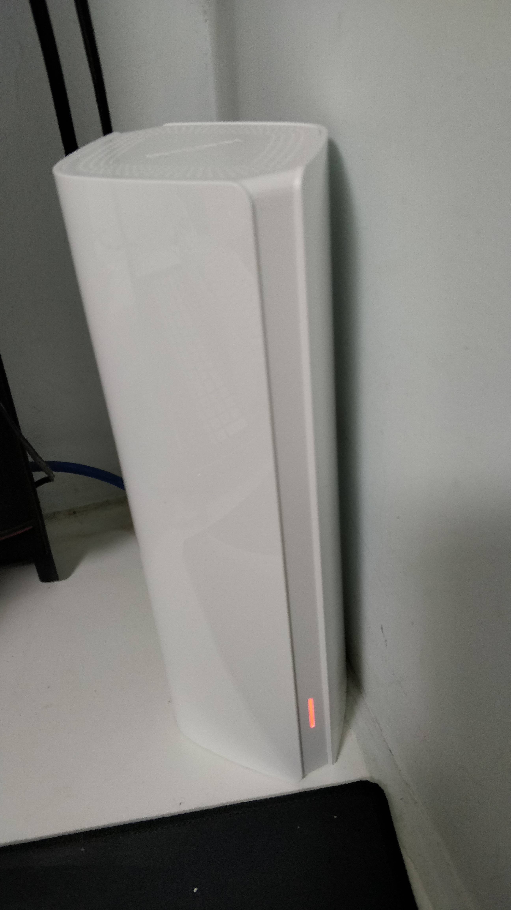
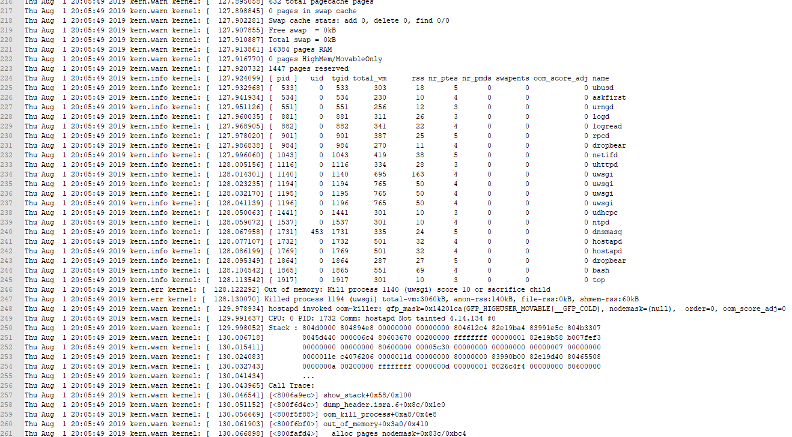
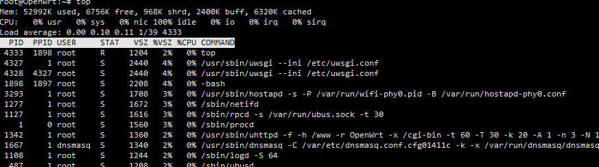
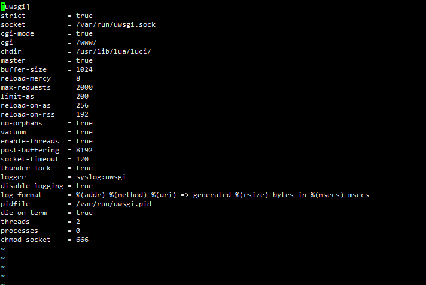

---
aliases:
- /archives/254
categories:
- 网络基础
date: 2019-08-06 15:35:12+00:00
draft: false
title: 斐讯K2T原机运行OpenWRT内存OOM解决
---

家境贫寒的我为了能够为家里带来更好的无线网络体验，决定购买一台全高通方案的设备用来做AP。在逛了各大论坛后，还是不顾朋友反对买了斐讯的K2T，原因就是因为它便宜（并夕夕123元拿下，相对全高通千兆方案中算是廉价的了），只可惜其64M RAM运行自编译的OpenWRT时频繁因为OOM（Out Of Memory）导致crash，在经过不断优化后终于能用了。

昨天，并夕夕123元拿下了这台机器（斐讯K2T），今天拆箱时这一简约的设计实在是震惊到了我，如果斐讯专心靠产品做下去的话，或许可能还真的会打下中国民用网络设备的半壁江山吧，可惜斐讯目前已经半死不活了。

图1. K2T侧边

图2. K2T正面

从图1可以看到整机只有一个Type-C接口，一根Type-C线承载了电源+3组以太网，3口以太网接口全部都在电源适配器上，桌子上只需要放一个机器即可，可谓非常棒的设计，设计师充分照顾了程序员和强迫症患者。再看图2，前面板也只有一个LED灯，天线也是PCB阵列天线，隐藏在壳子中，并没有像传统路由器一样竖着N根天线在外边。讲真，我真的觉得传统路由器那样的设计真是丑到爆炸。

家里主路由使用的MikroTik hAP ac2（RBD52G），使用有线连接AP来扩展覆盖面积。RBD52G在将2.4G发射功率调整到30dbm（1000mW）时，已经能够完整覆盖全家，因此为了节省AP（K2T）的内存使用，也只打开了K2T的5.8G。由于hAP ac2在我屋子里已经完全没有信号了，因此无线扩展决定使用同频组网，使得设备能够在之间漫游。曾经有考虑过使用802.11s组Mesh网络，在查阅MikroTik Wiki和OpenWRT Wiki后确认都支持802.11s这一标准，但是实际部署中使用有线回程时，发现AP无法和ROS握手成功，同时按照OpenWRT Wiki要求需要填写的MeshID在RouterOS并未找到，查了两天资料并尝试后，依然无果，考虑到8号要飞回深圳，只好晚些再继续研究，先使用同频组网苟且一下。

由于自己极度强迫症，因此固件并不打算使用非官方渠道的，总觉得那些固件只适合玩一玩，真要遇到稳定性问题排查起来会比较麻烦。共编译了4个版本，1.0-2.0均使用了标准库和工具链编译，体积略大，2.1-3.0使用uclibc库搭配musl工具链编译，同时在3.0中进行了大幅度的裁剪。

图3. 全部编译的版本

起初在1.0-2.0固件时，每每打开无线后，K2T总是会在之后5分钟左右莫名其妙死机，表现为Ping网关能通，但是控制台和SSH已经完全无法使用。由于手边没有工具和TTL线，因此也无法查看日志。当然，曲线救国——把日志写在了本地（如图4），再把日志下载回本地查看，发现确实是OOM导致的Crash

 图4. 系统日志设置

如图4，将日志写入本地非易失性设备中，同时日志等级调为Info以得到尽可能多的信息，然后确认了OOM这一事实。

 图5. 内核日志

如图5，这只是日志的一小部分，当OOM发生时，再加上没有swap可用，进程纷纷被迫kill掉，其中就包含了uwsgi和uhttpd。

经过观察，发现问题在于高通5G无线网卡的驱动ath10。每当无线启动，空闲内存直线下降，内存不足然后引发众多程序崩溃。针对这些问题，尝试换了uclibc库同时使用musl工具链编译，但是仍然无法续命，无奈之下内核去掉了IP v6支持，续命时间仍然不能够满足日常使用。在分别去除了系统的完整wpad、完整hostapd等包之后，依然还是无法正常使用。

还是要从根本上查起。重置设置，SSH进入系统，跟踪观察top和ps，发现如图6中，uswgi启动了多个进程，这些进程每个分别占用了2440 K内存。其实这幅图是我已经改过参数的了，只有两个进程，原本是4个，由于进程资源是相互独立的，这一操作成功浪费了9.5M左右的内存，总共才64M内存，哪有这么多给你浪费啊，话不多说，立即开始修改。

图6. 进程内存使用情况

 图7. uwsgi配置

如图7，uwsgi的配置文件为/etc/uwsgi.conf， 使用vim打开后，我分别调整了几个参数：buffer-size修改为了1024，减少缓冲大小，腾出来尽可能多的内存；threads修改为2，processes修改为0，毕竟是个路由器，不需要面临非常大的访问量，单进程两个线程的后端就够用了。保存后，执行/etc/init.d/uwsgi restart，看到只剩一个进程了，内存使用也有所缓解。

紧接着，为了防止内核过早直接回收内存，调小了vm.min_free_kbytes这一参数为4096，原本为8192。之所以修改为这个值是因为在跟踪了一阵子内存使用情况后，发现系统在正常运行的情况下，剩余内存在6.7-15M左右波动，过早触发系统直接内存回收机制会导致程序挂掉，然而无线需要依靠hostapd，当这一进程被kill后会影响无线网络使用。

同时，为了减少缓存使用，也修改了vm.dirty_ratio为1，即当文件系统缓存脏页达到内存的1%时立即开始进行回写。考虑到这里的缓存回写是针对IO的，再加上OpenWRT上需要回写到Flash中的内容很少（几乎没有，除非修改了配置文件），大多是日志等内容，然而日志又是在/tmp这一内存空间中，因此在回写脏页减少缓存使用时也最好把日志等级调低，能省多少是多少吧。

脏页是Linux内核中的概念，因为硬盘的读写速度远赶不上内存的速度，系统就把读写比较频繁的数据事先放到内存中，以提高读写速度，这就叫高速缓存，linux是以页作为高速缓存的单位，当进程修改了高速缓存里的数据时，该页就被内核标记为脏页，内核将会在合适的时间把脏页的数据写到磁盘中去，以保持高速缓存中的数据和磁盘中的数据是一致的。

同时，观察ps可以得到，udhcpc为DHCP客户端，因此为了节省内存，我将桥接口配置为静态IP同时关闭了dnsmasq。因为我将AP的上联口和无线bridge在了一起，DHCP使用上游，因此单独一个配置口的DHCP Server可有可无，再加上我也打开了防火墙的80和22端口，dnsmasq更显得无用了，还是disable掉好了。

图8. 优化后的内存使用情况

如图8，在这样一波折腾后，内存终于不是那么捉急了。也不用再去make kernel_menuconfig精简内核了，测试使用了半天左右，也没有什么问题，写个每天定时重启，长期使用应该没有问题~
