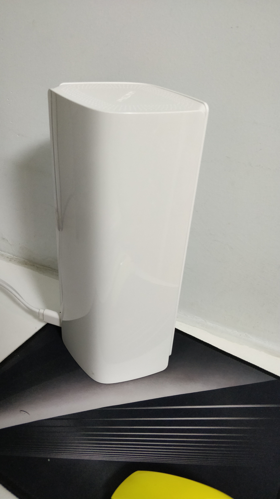
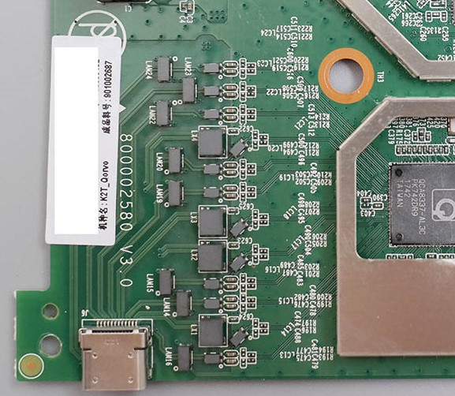
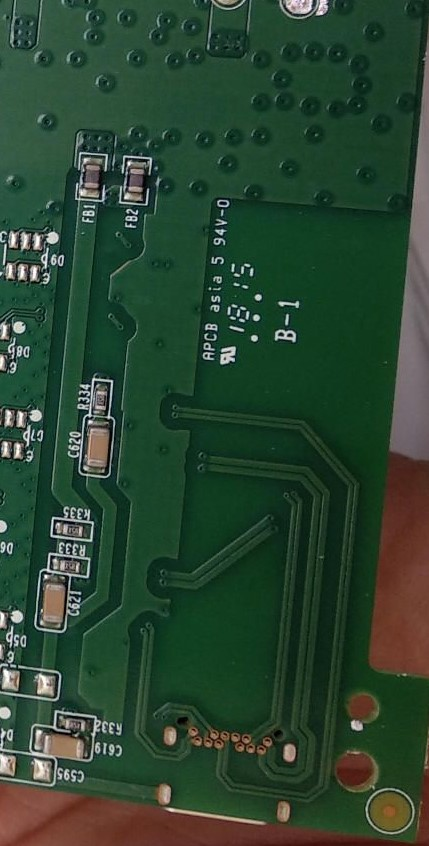
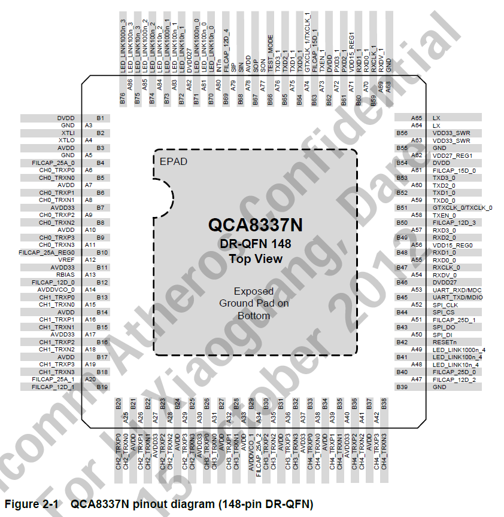
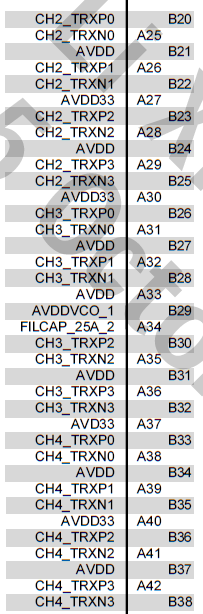
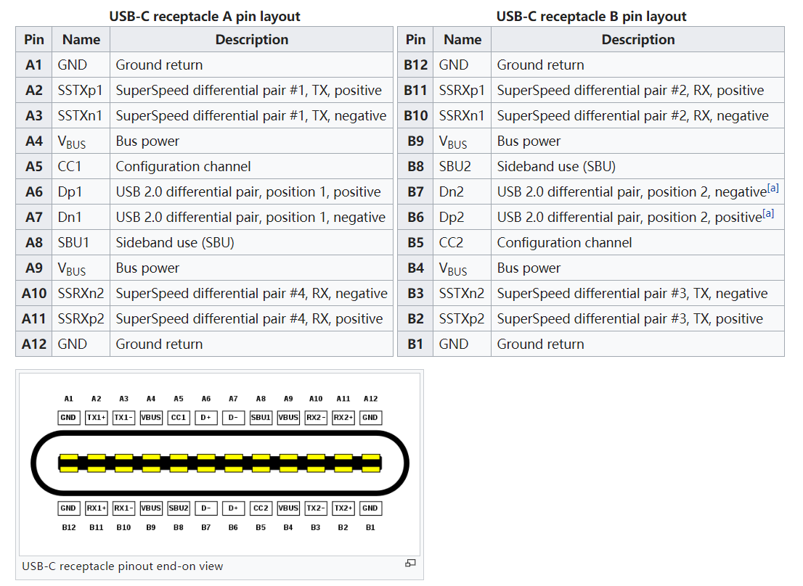
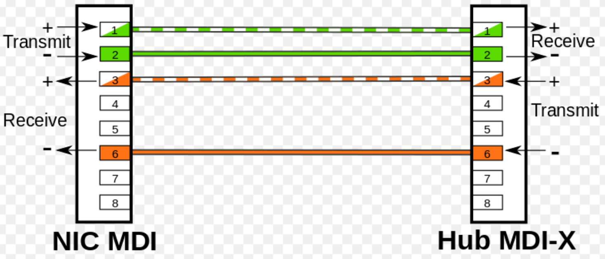
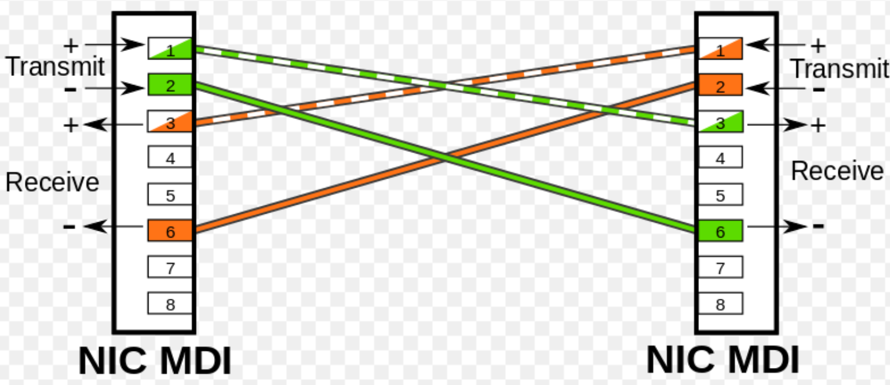

---
aliases:
- /archives/278
categories:
- 电路基础
date: 2019-08-21 06:07:38+00:00
draft: false
title: 漫谈斐讯K2T单Type-C线数据电源同传技术
---

如果斐讯一心一意靠产品发展的话，拿下中国民用网络设备领域的半壁江山应该不成问题，很可惜可能是由于斐讯自己操作不当，搞得现在半死不活了。作为斐讯一款全高通千兆方案的斐讯K2T，其采用Type-C接口单线模式，官方声称该数据电源同传技术拥有5项专利。既然难得入手一台K2T，也研究一下这些黑科技~

这些内容是我在购买之前依靠各方资料脑补出来的，作为一个非相关行业的人，我就单纯凭借我大一一年在ROBOMASTER这个比赛中学到的电路知识来梳理一下斐讯的这项技术，如有错误，希望您能联系指正，非常感谢。

图1. K2T的单线技术

## 什么是单Type-C线数据电源同传技术

这个名词是斐讯定义来的，即只通过一根Type-C线，承载3个千兆以太网接口+电源的传输。正如图1我们所看到的，整个路由器尾部只有一个Type-C接口，另外3个千兆以太网接口被扩展在了电源适配器上，这项设计最大的好处就是美化桌面，网线可以全部插在电源适配器上，桌子上只需要摆这一台仅有一根Type-C线的路由器，强迫症福音。

## 数据电源同传传输了什么

正如标题一样，同传传输了数据和电源，即：

  * 数据，3个千兆以太网的数据
  * 电源，经过电源适配器整流输出后的直流低压电源

## 以太网数据是什么亚子的

传统以太网物理层编码技术使用曼彻斯特（含差分）编码，每一位的中间存在一个跳变沿，既做时钟信号，又作数据信号。这一技术实现了时钟自同步，端对端无需再使用GND测量电平即可直接同步时钟信号，因此我们可以看到，网线的8根线全为数据线，并没有GND，而反观SPI、UART、I2C等这些标准，其数据传输同步时钟信号必须需要一根GND作为基础。

当今，在千兆以太网中， 8B/10B编码[^1]被广泛使用。8比特的数据会被拆封成5比特、3比特两部分，前5比特使用6B编码，后3比特使用4B编码。假设需要发送一串数据`11011100 `，由于最右侧为最低位，因此拆分后为`00111`和`011`，前五位`00111`使用5B/6B编码，后三位`011`使用3B/4B编码，这样一边能在数据流中包含控制代码，一边也能起到DC平衡作用，进而**实现高精度的时钟同步和恢复**[^2]。

## 数据传输介质

图2. K2T主控板Type-C部分-正面[^3].

图3. K2T主控板Type-C部分-背面[^4].

观察图3和图4后，不难看出，分别是独立的12根线。PCB正面12根+背面12根，刚好24根线，即3组以太网网线（8根*3）。为了证实这个猜测，我们可以再对比一下芯片的数据手册，这个交换芯片是高通的QCA8337-AL3C，鉴于该型号的Datasheet并没有找到，因此此处使用QCA8337N的数据手册来替补，理论上来说差别因该不会非常大。在特别对比了QCA8337-AL3C和QCA8337N的封装和引脚后，发现两个芯片相似度非常高，同QFN148封装，参考引脚定义应该问题不大。

图4. QCA8337N引脚定义[^5].

根据完整的图2可以定位出晶振那个角为1号引脚所在的位置，进而得到交换芯片侧边到Type-C处的引脚分别可以对应数据手册中A25-A42、B20-B38号引脚。

图4. 单独抠出来的引脚定义[^5].

如图4，我们已经可以看到，CH2、CH3、CH4三个接口的共24根线，细数PCB正面到交换机芯片的线，刚刚好也是12组，可以断定这个Type-C就是赤裸裸的网线。利用Type-C线的24个引脚承载3组以太网线路，说白了就是拿Type-C当三根网线用。

### 为什么能配合Type-C实现正反插

我想这个问题才是更多人关心的。

由于图片是各处搜集而来的，没办法精准确定蛇皮走线，本想把我的K2T拆了，刚拿起工具撬壳子一不小心手指挂彩了……撬棒什么的都在学校，再加上这台设备是为家里无线漫游用的，迫不得已，还是先拿网上的拆机图凑合看一下吧。

好吧网上的图完全看不清细节。在找出证据之前，我大概想到了如下两种正反插的原理：

  1. 两个LAN在Type-C引脚外侧，WAN在内侧，正反插只影响LAN口顺序，但是这两个口都在同一个交换机下，因此只是影响了交换机芯片中对应的端口而已。好吧我感觉我这个猜测比较离谱
  2. 这个猜测比较有说服力。众所周知，网线8根，4股双绞，线序类型可以分为交叉线和直连线。当交换机芯片支持自动翻转(AUTO MDI/MDIX)时，这两种线序可以混用。

那么总结上述第2点猜测，8股线，有4根（4，5，7，8号线）始终是处于直连，剩下4根可直连可交叉。我们来看一下Type-C 3.0接口的引脚定义，如下图5

图5. Type-C 3.1规范引脚定义[^6]

可以看到，A6 A7 B6 B7翻转后以然处于对应。整个Type-C的引脚类型都关于中心对称。电源和电源对应，GND和GND对应，数据线和数据线对应。

再参考一下Auto MDI/MDI-X，在10Base-T的线缆中，传输使用1236号，同时满足`an Ethernet crossover cable is needed to cross over the transmit and receive signals in the cable`[^7]，即以太网交叉线需要反转R/T信号线。

图6. NIC MDI与MDI-X相连[^7]

图7. NIC MDI与MDI相连[^7]

如上图6和7，再结合上一段提到的反转的是R/T信号线，因此可以推断出Type-C中正反插是利用的R/T反转这一特性。由于手边没有机器拆开确认，网上搜到的图也不是很清晰（没法对照正反面电路），因此只能先停留在猜测阶段了，感兴趣的朋友可以查证一下。

## 电源传输介质

参考acwifi.net中的那篇文章[^3] 中的说法，`拨掉与下方网络主板的电源连接线，把电源接上电，查看空载时的功率为0W，用电表测量输出电压11.8V`，可以大致判定斐讯的这套供电设计并不是标准的PoE，电压并不匹配。

我们重新回到图2观察一番，可以看到此处有很多的钽电容。在钽电容左边还有一排应该是ESD[^8]做经静电保护，电源和数据线合一，数字信号的波形不变化（不考虑噪声）的情况下，将12V的电压整流后到3.3V，同时给设备供电。在钽电容右侧看起来是一些上拉电路（不完全确定）。由于手边没有板子，再加上不是这个行业的，暂时无法完全确定。感兴趣的朋友可以拿示波器测一下

Type-C 3.1规范中，共24根数据线，刚刚好3组以太网线路。电源的GND即Type-C金属壳子，共25根线，完美地解决了电源数据同传这一问题。

## 参考
[^1]: Wikipedia. https://en.wikipedia.org/wiki/8b/10b_encoding
[^2]: 百度百科, 同步以太网时钟. https://baike.baidu.com/item/%E5%90%8C%E6%AD%A5%E4%BB%A5%E5%A4%AA%E7%BD%91%E6%97%B6%E9%92%9F
[^3]: acwifi.net, 斐讯K2T拆机，完全暴力拆解. https://www.acwifi.net/4576.html
[^4]: tianshui1001, K2T拆解. https://www.right.com.cn/forum/thread-320327-1-1.html
[^5]: Qualcomm Atheros, Inc., QCA8337N Seven-port Gigabit Ethernet Switch Datasheet, MKG-17793 Ver. 1.0, 14 May 2012
[^6]: Wikipedia, USB-C. https://en.wikipedia.org/wiki/USB-C
[^7]: Wikipedia, Medium-dependent interface. https://en.wikipedia.org/wiki/Medium-dependent_interface
[^8]: 咨询了师兄，感谢银宇师兄的解答
