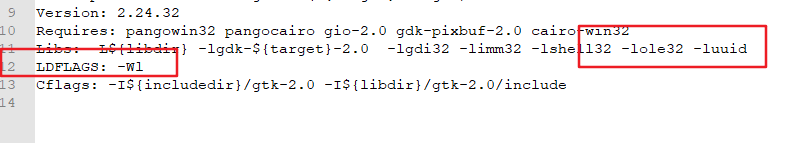

---
aliases:
- /archives/304
categories:
- 问题解决
date: 2019-08-21 05:38:38+00:00
draft: false
title: Windows安装GTK环境
---

Golang GUI编程可以用GTK或者Qt，我先入坑了Gtk，发现有一些bug导致无法编译通过，官方的文档也有一些问题


### 安装Git

安装Git for Windows即可，安装时需要选择bash

### 安装MinGW

此处建议安装MSYS2，它是一个MSYS的独立改写版本，更好一点。

### 安装相关依赖

在msys2的终端中，执行如下命令


```bash
pacman --noconfirm --needed -Sy bash pacman pacman-mirrors
pacman --noconfirm -Su
pacman --noconfirm -S mingw-w64-x86_64-gcc mingw64/mingw-w64-x86_64-pkg-config mingw-w64-x86_64-gtk3 # 安装GTK3等
pacman -S mingw-w64-x86_64-gtk2 # 安装GTK2
pacman -S mingw-w64-x86_64-glade # 安装Glade
pacman -S mingw-w64-x86_64-toolchain base-devel # 安装工具链
```

Golang编译器默认会使用GTK2，如果需要切换GTK3还需要自己查以下Google

### 修改pkg-config

官方说法称，这里有一个bug需要手工修复，并且在我使用时这个bug还没有被安装在我在用的这个发布版本中修复上。因此，如果在 `go get github.com/gotk3/gotk3/gtk `的过程中提示 **invalid flag in pkg-config –libs: -Wl,-luuid** 这样的问题，说明你遇到了这个bug，需要手工修复，方法如下：

找到msys2的安装文件夹，在其根目录中分别进到mingw64->lib->pkgconfig中，找到 gdk-2.0.pc和 gdk-win32-2.0.pc 文件，如果使用gtk3可能要改另外两个gtk3文件。具体修改内容：将这两个文件中Libs中的 -Wl 删除，额外增加一行 LDFLAGS: -Wl ，如下图，保存即可



再次进行go get或者编译，即可正常进行

