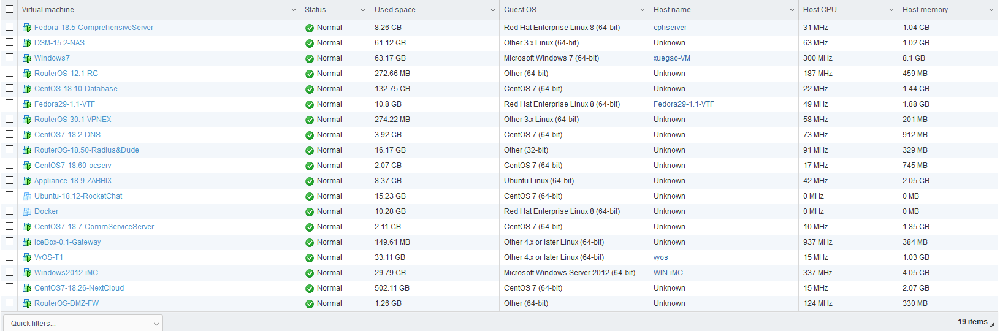
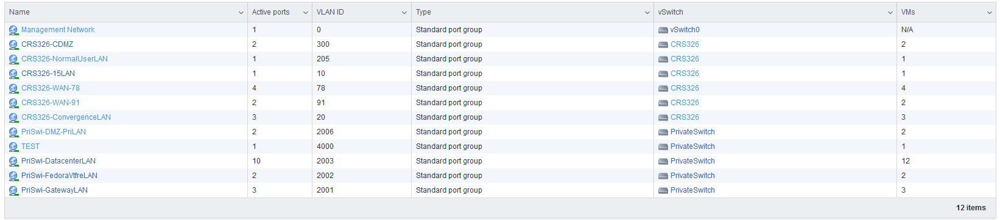
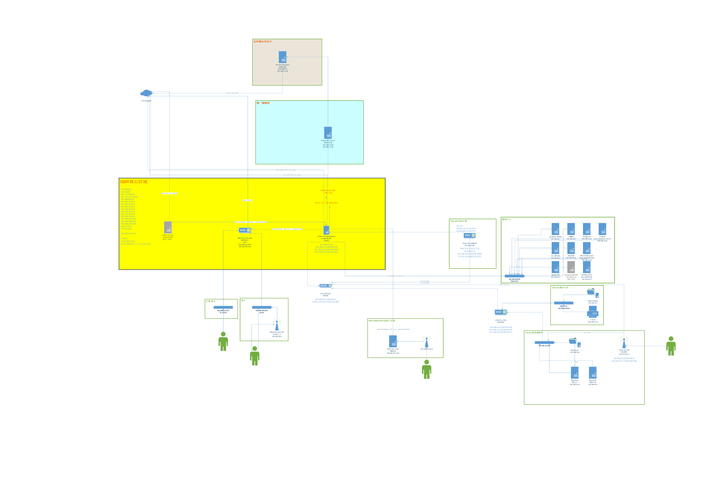

---
aliases:
- /archives/324
categories:
- 网络基础
date: 2019-09-14 04:05:14+00:00
draft: false
title: 102网管——从小到大的网络
---

组过N套网络了，从小到大的拓扑，从简单到复杂的网络

图0

**接下来是正文~**

先来看看这个拓扑中一共有多少台机器呢…..?可以看看下图1，这些只是虚拟机，不含实体硬件

图1. 拓扑中的所有虚拟机

其中，虚拟交换机共有如下图2（不含实体交换）：

图2. 所有虚拟交换机

拓扑如下图3

图3. 拓扑

不得不说的是，这个拓扑远远没有企业网和ISP的那么庞大，对比起来看确实还是自娱自乐的产物，也算是成长的过程吧~

### 为什么要这样设计拓扑

算是惯例了吧，接入-汇聚-核心，不过此处考虑到位置特性，我并没有把**数据中心**这个区域挂到核心之下，而是选择直接挂在了汇聚中，就和接入合并。因为要考虑一个问题是，自娱自乐的产物无法保证高可用，再加上汇聚的RouterOS是虚拟机来的，如果**数据中心**和**服务器硬件区域**挂在核心的话，一旦服务器挂了，我就没办法直接访问到它了……..因此考虑到这个风险，服务器接入用的**服务器硬件VLAN**和**维护专用的VLAN**独立挂在了**15.1-EXA**这台机器下，上层汇聚向下引一个静态路由，在OSPF区域内重发布了静态路由，解决~这样就算服务器挂了，至少保证**维护专用**和**服务器硬件**这两个VLAN仍然可以通过**15.1-EXA**互访，进而进行检查。

当然，真正的企业网和数据中心中，是不会这样挂的，不方便管理和维护。

### 限制因素

由于还是在校园网的基础之上建设，因此限制因素还是校园网。考虑到现在校园网故障率实在是太高，质量也不佳，限制条件也太多，因此存在一些问题一直没办法解决：

  1. 多IP负载平衡的单连接速度瓶颈。通过学校一些交换机的配置不当，我借此拿到了部分交换机的管理员权限，对我们所用的接口的VLAN进行了调整，使得原本的Access口成了Trunk口并且可以横跨使用78/56/57多个接入层VLAN，考虑到78客户段非常稀少，因此使用10.0.78.0/24中的随机55个IP作为负载平衡IP。由于出到学校网关还要进行NAT，再加上网关又是深信服网关，防火墙不允许非法状态转移，因此平衡内网流量只能通过连接平衡，如果按照包平衡，会导致分发错误的包被网关拒绝转发。正是由于负载平衡基于了连接进行平衡，因此单个连接的情况下，速度最大也只能到一个IP的速度，即下15M上5M，想提高速度只能通过提高连接数解决。但是，Chrome等大多浏览器默认连接数都有限制，好像是3，因此原则上来讲55*15=825Mbps的下行速度，受制于连接数问题，远远不会达到预估速度。
  2. 无法进行打洞。首先是园区网，层层路由，UPnP就不想了。其次，经过测试学校所使用的深信服的网关NAT类型使用的是对称NAT（Symmetric），SNAT过程中会绑定私网地址+端口、NAT后地址+端口和目标地址+端口，无法用于打洞，只能通过中转（隧道）解决。
  3. 偶尔会乱改配置。曾经有过一次，学校汇聚层设备的MTU从原本的10240改到了1500，导致我原本算好的实验室和宿舍间GRE隧道的MTU和MRU偏大，然后几乎所有的服务都无法使用了（小包ping除外）。

### 题外话

其实我一直不怎么认同教科书说法“UDP无状态、没有连接”。严格来说，TCP/UDP的状态是对于他们协议本身而言的，然而对于连接跟踪来说，却还是有状态的，然而目前的情况下连接跟踪却还是必须的。UDP的无状态、没有连接只是相对于TCP的而言的，由于UDP的连接保持时间非常非常非常短，一般只有10秒左右，因此UDP连接容易被防火墙跟丢，但这并不意味着UDP是无连接的，至少在IPv4的私网中是这样的，因为要过NAT网关，要进行连接跟踪。如果过渡到了IPv6阶段，UDP可以点对点直连的情况下，到那时候，UDP可能才真正能算实现它的初衷——无状态、无连接，不过还是要进系统的conntrack，仍然是有短暂的连接。

### 关于DMZ区域的一些理解

实际是应该把**DMZ**挂在核心之下，我结合我在51cto买的专栏看大佬们规划，旁挂防火墙都是在核心一侧，而并非在汇聚。之所以会部署成我这样的结构，也是考虑到自娱自乐的情况下，没必要DMZ区域挂到核心去，再加上本应该挂到核心的**数据中心**也在汇聚之下，因此为了确保服务正常，DMZ区域也一起挂在了汇聚边缘。NAT Table在Mangle Table之后，因此，DMZ区域的DNAT之前经过Mangle时会通过一层状态防火墙，未有连接跟踪记录和特定端口（如139等）请求会被标记，进而进blackhole去

### 关于OSPF的一点想法

这里之所以要用OSPF的原因，是因为宿舍那边的路由器中不仅仅只有2个段，后边根据情况可能还会再扩充新的子网。考虑到出口可能做统一，因为虽然这些区域都是分开的，但是有很多服务是共用的，好比Radius、数据库和策略等。再加上子网可能会扩充，在上游做路由汇总时可能会有一些麻烦（要考虑环），因此还是上OSPF吧。

目前关于OSPF还有一个问题是blackhole的路由也通过OSPF通告了，其实我倒是想把blackhole的路由（路由汇总用的，防环）通过OSPF通告到各个节点中去，直接在每台机器上独立通告一个blackhole就好，这样就省去了转发。还在想办法

### 关于Hotspot

此处对于接入我采用的是hotspot方案，所有设备联网后会自动弹出页面提示要求输入用户名密码。其实这里想用自己的方案的，其实所谓的hotspot实现也不难，只要设备连接后HTTP请求返回301跳转即可，系统就会自动提示需要下一步操作，只是受限于和RouterOS的对接和身份认证，目前并没有想到完善的解决方案。

对于策略随行，有做过尝试，并且也取得了一定效果。不过还是受限于RouterOS的稍微的封闭，以及客户端跨平台的问题。具体可以查看另外一篇博文

### 关于负载平衡

网关是IceBox，是博主我的定制版本的OpenWRT。其实说定制也不是定制，只是精简了一点点点点点而已，只是精简掉了很多不需要用的modules，集成了mwan3而已，并没有太大改动。之所以不用RouterOS来做平衡，是因为RouterOS并不支持网络监测，78段的IP可能偶尔会出现冲突的情况，使用RouterOS时，一旦出现这种情况，会直接导致从这个IP分流的所有连接卡死。具体相关内容可以查看我的另外一篇博文

### 最后一点想法

这个网络是玩了N年网络后慢慢摸索出来的，然后一代一代迭代上来的架构。如果一开始就按照教科书的内容走，其实也能少踩很多坑，只是这样的话，底层到底都发生了什么，可能就不得而知了吧。花了些时间去了解原理，同时慢慢去修改去尝试，然后一代以带迭代上来的架构，这可能就是成长的过程吧。